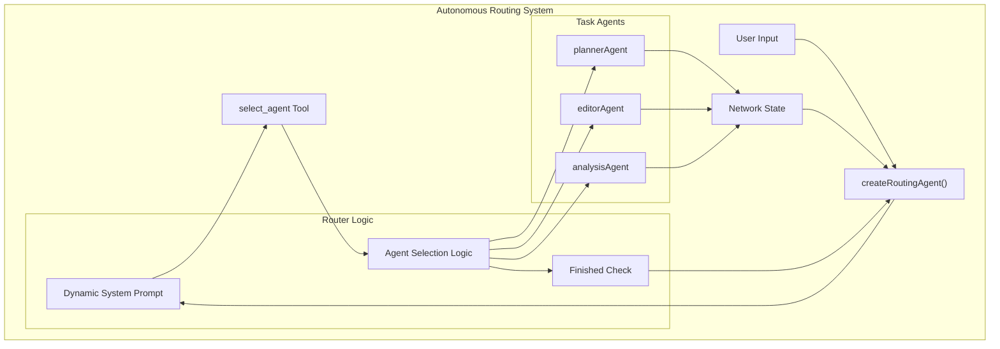
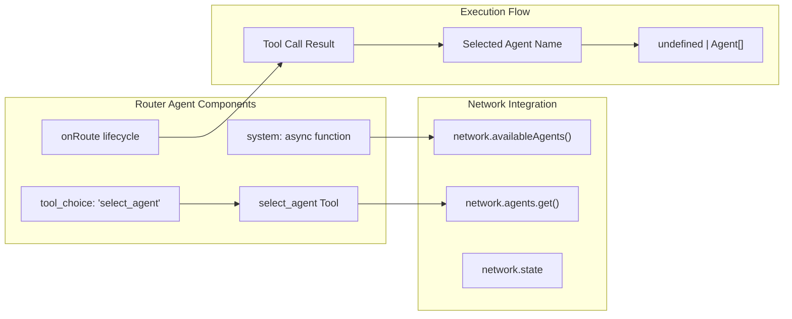
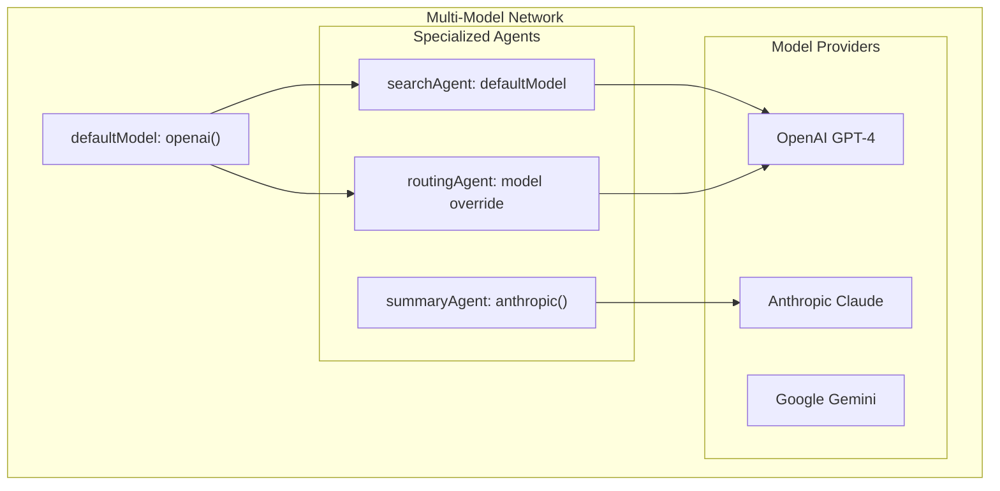
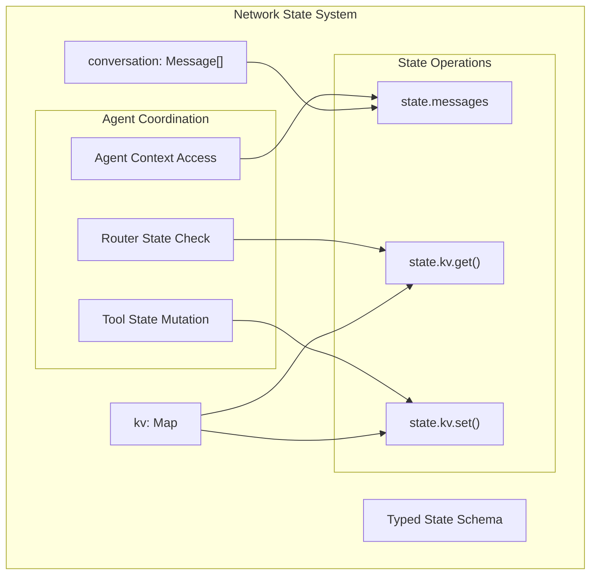
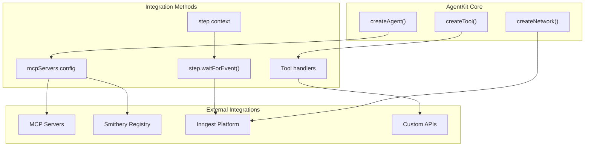
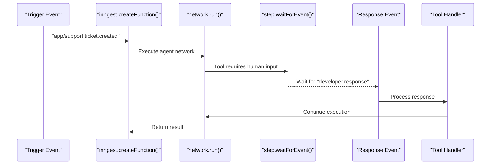
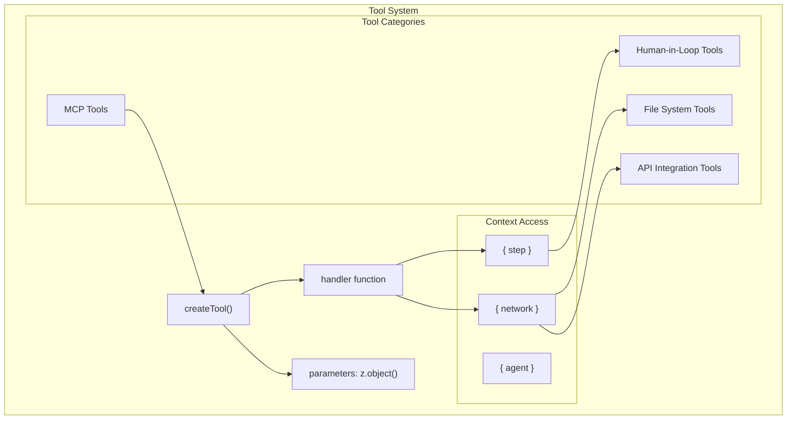
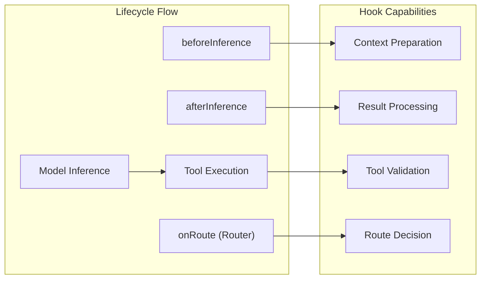

This document covers sophisticated patterns and architectural approaches for building complex multi-agent AI systems with AgentKit. These patterns enable advanced orchestration, external integrations, and human collaboration within agent workflows.

The patterns covered here include autonomous agent routing, external system integration via Model Context Protocol (MCP), human-in-the-loop workflows, and complex state management strategies. For specific implementation details on human workflow integration, see [Human-in-the-Loop](#5.1). For external tool server integration, see [MCP Integration](#5.2).

## Router Agent Patterns

Router Agents provide autonomous decision-making capabilities for agent orchestration. Unlike function-based routers that use predetermined logic, Router Agents leverage LLM reasoning to dynamically select the next agent based on current context.

### Autonomous Agent Orchestration

Router Agents are created using `createRoutingAgent()` and implement the `onRoute` lifecycle hook to determine execution flow. The router evaluates network state and selects appropriate task agents until completion criteria are met.

**Sources:** [docs/reference/network-router.mdx:77-147](), [docs/guided-tour/ai-agents.mdx:275-361]()

### Router Agent Implementation Pattern

The `createRoutingAgent()` function combines agent capabilities with routing logic through specific lifecycle hooks and tool definitions.

**Sources:** [docs/reference/network-router.mdx:79-147](), [docs/guided-tour/ai-agents.mdx:280-361]()

## Multi-Model Network Architecture

AgentKit supports heterogeneous model configurations within a single network, enabling specialized model selection for different agent roles.

### Model Provider Coordination

| Component | Model Configuration | Use Case |
|-----------|-------------------|----------|
| `defaultModel` | Network-wide fallback | Router agents, model-less agents |
| Agent `model` | Agent-specific override | Specialized capabilities |
| Router `model` | Routing decisions | Planning and orchestration |

Each agent can specify its own model configuration, allowing networks to leverage different model strengths for specific tasks.

**Sources:** [docs/concepts/networks.mdx:90-113]()

## State-Based Coordination Patterns

Advanced state management enables complex agent coordination through shared data structures and conversation history.

### State Management Architecture

State coordination enables deterministic routing decisions and persistent context across agent interactions.

**Sources:** [docs/concepts/networks.mdx:179-196](), [docs/advanced-patterns/human-in-the-loop.mdx:84-86]()

## External System Integration

AgentKit integrates with external systems through multiple patterns including MCP servers, Inngest orchestration, and custom tool implementations.

### Integration Architecture Overview

Integration patterns provide agents with extended capabilities through external tool servers and orchestration platforms.

**Sources:** [docs/integrations/smithery.mdx:146-154](), [docs/advanced-patterns/human-in-the-loop.mdx:24-47]()

## Event-Driven Workflow Patterns

Complex workflows can be implemented using Inngest's event-driven architecture combined with AgentKit's agent orchestration.

### Event-Driven Agent Execution

Event-driven patterns enable long-running workflows with human interaction points and external system coordination.

**Sources:** [docs/advanced-patterns/human-in-the-loop.mdx:154-178](), [docs/advanced-patterns/human-in-the-loop.mdx:32-36]()

## Tool Integration Patterns

Advanced tool patterns enable sophisticated agent capabilities through external system integration and custom implementations.

### Tool Architecture Components

Tool patterns provide structured interfaces for agent-environment interaction with proper context management and error handling.

**Sources:** [docs/advanced-patterns/human-in-the-loop.mdx:15-47](), [docs/guided-tour/ai-agents.mdx:143-216]()

## Lifecycle Management Patterns

Advanced agent lifecycle management enables sophisticated coordination and monitoring capabilities.

### Agent Lifecycle Hooks

| Hook | Purpose | Use Cases |
|------|---------|-----------|
| `onRoute` | Router agent decisions | Agent selection logic |
| `beforeInference` | Pre-execution setup | Context preparation |
| `afterInference` | Post-execution handling | Result processing |
| `onToolCall` | Tool execution control | Validation, logging |

Lifecycle hooks enable fine-grained control over agent execution flow and provide extension points for custom logic.

**Sources:** [docs/reference/network-router.mdx:120-137](), [docs/guided-tour/ai-agents.mdx:347-361]()