ANTHROPIC_API_KEY=your-anthropic-api-key
```

You can use different model providers like OpenAI, Google, or Anthropic. Make sure to set the corresponding environment variables for the provider you choose.

Sources: [docs/getting-started/quick-start.mdx:80-83]()

## Running Your Agent with a Server

To run your agent, you need to create a server:

```typescript
import { createServer } from "@inngest/agent-kit/server";

const server = createServer({
  agents: [dbaAgent],
});

server.listen(3000, () => console.log("Agent kit running!"));
```

Then run your server:

```bash
npx tsx ./index.ts
```

Sources: [examples/quick-start/index.ts:46-51](), [docs/getting-started/quick-start.mdx:90-104]()

## Testing Your Agent

To test your agent, you can use the Inngest dev server which provides a visual interface for debugging:

```bash
npx inngest-cli@latest dev -u http://localhost:3000/api/inngest
```

This will start a local development server that connects to your AgentKit server. You can then interact with your agent by:

1. Opening http://localhost:8288/functions
2. Clicking the "Invoke" button
3. Entering a prompt for your agent
4. Viewing the agent's response

Sources: [docs/getting-started/quick-start.mdx:108-134]()

## Creating a Multi-Agent Network

A Network allows multiple specialized agents to work together by sharing state and using routing logic to determine execution flow. Let's add tools and state management to our agents:

### Defining Network State

First, define a typed interface for the shared state between agents:

```typescript
export interface NetworkState {
  // answer from the Database Administrator Agent
  dba_agent_answer?: string;

  // answer from the Security Expert Agent
  security_agent_answer?: string;
}
```

### Adding Tools to Agents

Update the DBA agent to include a tool for saving answers to the shared state:

```typescript
import { createTool, Tool } from "@inngest/agent-kit";
import { z } from "zod";

const dbaAgent = createAgent({
  name: "Database administrator",
  description: "Provides expert support for managing PostgreSQL databases",
  system:
    "You are a PostgreSQL expert database administrator. " +
    "You only provide answers to questions linked to Postgres database schema, indexes, extensions.",
  model: anthropic({
    model: "claude-3-5-haiku-latest",
    defaultParameters: {
      max_tokens: 4096,
    },
  }),
  tools: [
    createTool({
      name: "provide_answer",
      description: "Provide the answer to the questions",
      parameters: z.object({
        answer: z.string(),
      }),
      handler: async ({ answer }, { network }: Tool.Options<NetworkState>) => {
        network.state.data.dba_agent_answer = answer;
      },
    }),
  ]
});
```

### Creating the Security Agent

Create a security expert agent with similar tool functionality:

```typescript
const securityAgent = createAgent({
  name: "Database Security Expert",
  description:
    "Provides expert guidance on PostgreSQL security, access control, audit logging, and compliance best practices",
  system:
    "You are a PostgreSQL security expert. " +
    "Provide answers to questions linked to PostgreSQL security topics such as encryption, access control, audit logging, and compliance best practices.",
  model: anthropic({
    model: "claude-3-5-haiku-latest",
    defaultParameters: {
      max_tokens: 4096,
    },
  }),
  tools: [
    createTool({
      name: "provide_answer",
      description: "Provide the answer to the questions",
      parameters: z.object({
        answer: z.string(),
      }),
      handler: async ({ answer }, { network }: Tool.Options<NetworkState>) => {
        network.state.data.security_agent_answer = answer;
      },
    }),
  ]
});
```

### Creating the Network with Router Logic

Create a network with custom routing logic that determines which agent runs based on the current state:

```typescript
const devOpsNetwork = createNetwork<NetworkState>({
  name: "DevOps team",
  agents: [dbaAgent, securityAgent],
  router: async ({ network }) => {
    if (network.state.data.dba_agent_answer && !network.state.data.security_agent_answer) {
      return securityAgent;
    } else if (network.state.data.security_agent_answer && network.state.data.dba_agent_answer) {
      return; // End execution
    }
    return dbaAgent; // Start with DBA agent
  },
});
```

The router function determines execution flow by:
- Starting with the `dbaAgent`
- Running `securityAgent` after DBA agent completes
- Ending execution (returning `undefined`) when both agents have provided answers

### Server Configuration

Update your server to include the network:

```typescript
const server = createServer({
  agents: [],
  networks: [devOpsNetwork],
});

server.listen(3010, () => console.log("Agent kit running!"));
```

Sources: [examples/quick-start/index.ts:6-86](), [docs/getting-started/quick-start.mdx:158-277]()

## Network Execution Flow

Network execution flow with state-based routing:

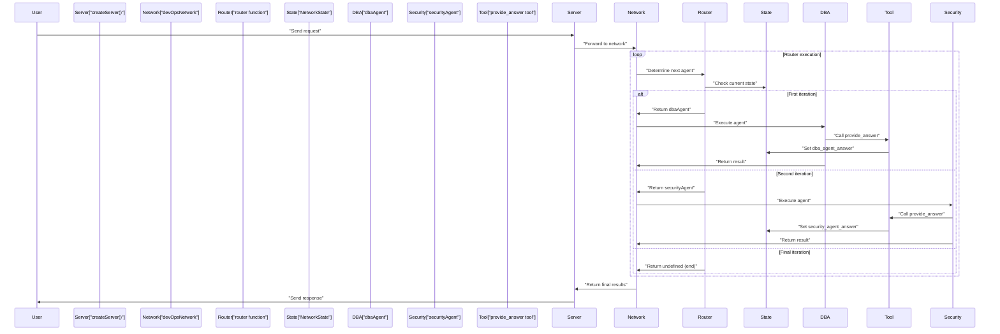

Sources: [examples/quick-start/index.ts:68-78](), [docs/getting-started/quick-start.mdx:156-310]()

## Network Components and State Management

Network architecture with state-based routing:

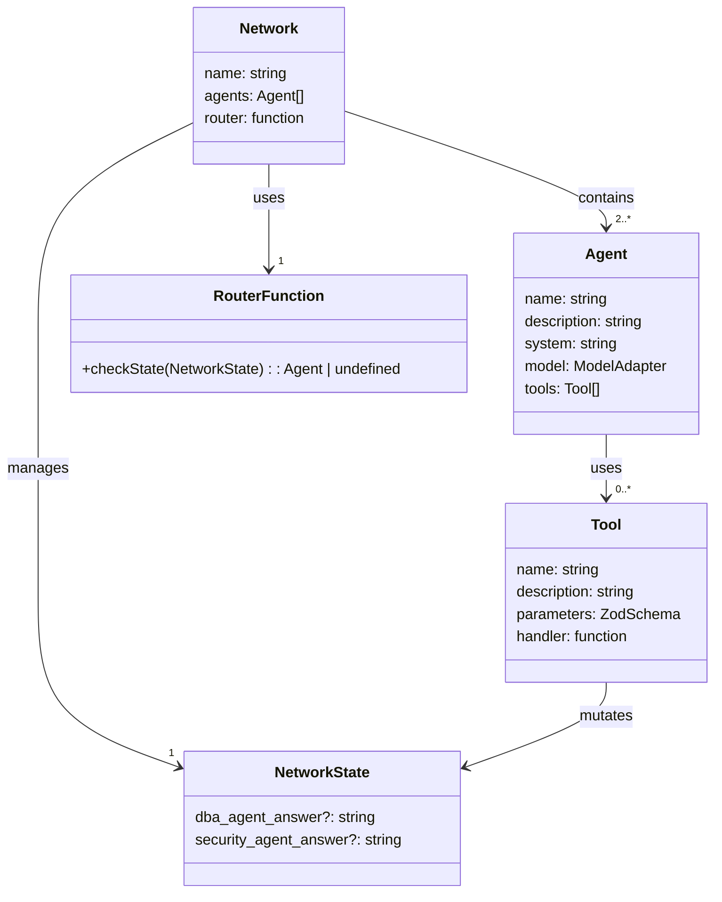

Key components:
- `createNetwork`: Creates a network with typed state and custom router
- `NetworkState`: Interface defining shared state structure  
- `router`: Function that determines next agent based on current state
- `createTool`: Creates tools that agents use to interact with state
- `Tool.Options<NetworkState>`: Provides access to network state in tool handlers

Sources: [examples/quick-start/index.ts:6-78](), [docs/getting-started/quick-start.mdx:249-272]()

## Testing Your Network

Test your network using the Inngest dev server with complex queries that require both agents:

```json
{
  "data": {
    "input": "I am building a Finance application. Help me answer the following 2 questions: \n - How can I scale my application to millions of requests per second? \n - How should I design my schema to ensure the safety of each organization's data?"
  }
}
```

The execution flow will be:
1. **First iteration**: Router returns `dbaAgent` → DBA agent processes the input → Calls `provide_answer` tool → Sets `dba_agent_answer` in state
2. **Second iteration**: Router detects DBA answer exists, returns `securityAgent` → Security agent processes input → Calls `provide_answer` tool → Sets `security_agent_answer` in state  
3. **Final iteration**: Router detects both answers exist, returns `undefined` → Network execution ends

You can inspect the final state in the Inngest dev server to see both agents' responses stored in the `NetworkState`.

Sources: [docs/getting-started/quick-start.mdx:287-306](), [examples/quick-start/index.ts:68-78]()

## Complete Example

Here's the complete working example with state management and tools:

```typescript
import "dotenv/config";
import { anthropic, createAgent, createNetwork, createTool, Tool } from "@inngest/agent-kit";
import { createServer } from "@inngest/agent-kit/server";
import { z } from "zod";

export interface NetworkState {
  // answer from the Database Administrator Agent
  dba_agent_answer?: string;

  // answer from the Security Expert Agent
  security_agent_answer?: string;
}

const dbaAgent = createAgent({
  name: "Database administrator",
  description: "Provides expert support for managing PostgreSQL databases",
  system:
    "You are a PostgreSQL expert database administrator. " +
    "You only provide answers to questions linked to Postgres database schema, indexes, extensions.",
  model: anthropic({
    model: "claude-3-5-haiku-latest",
    defaultParameters: {
      max_tokens: 4096,
    },
  }),
  tools: [
    createTool({
      name: "provide_answer",
      description: "Provide the answer to the questions",
      parameters: z.object({
        answer: z.string(),
      }),
      handler: async ({ answer }, { network }: Tool.Options<NetworkState>) => {
        network.state.data.dba_agent_answer = answer;
      },
    }),
  ]
});

const securityAgent = createAgent({
  name: "Database Security Expert",
  description:
    "Provides expert guidance on PostgreSQL security, access control, audit logging, and compliance best practices",
  system:
    "You are a PostgreSQL security expert. " +
    "Provide answers to questions linked to PostgreSQL security topics such as encryption, access control, audit logging, and compliance best practices.",
  model: anthropic({
    model: "claude-3-5-haiku-latest",
    defaultParameters: {
      max_tokens: 4096,
    },
  }),
  tools: [
    createTool({
      name: "provide_answer",
      description: "Provide the answer to the questions",
      parameters: z.object({
        answer: z.string(),
      }),
      handler: async ({ answer }, { network }: Tool.Options<NetworkState>) => {
        network.state.data.security_agent_answer = answer;
      },
    }),
  ]
});

const devOpsNetwork = createNetwork<NetworkState>({
  name: "DevOps team",
  agents: [dbaAgent, securityAgent],
  router: async ({ network }) => {
    if (network.state.data.dba_agent_answer && !network.state.data.security_agent_answer) {
      return securityAgent;
    } else if (network.state.data.security_agent_answer && network.state.data.dba_agent_answer) {
      return;
    }
    return dbaAgent;
  },
});

const server = createServer({
  agents: [],
  networks: [devOpsNetwork],
});

server.listen(3010, () => console.log("Agent kit running!"));
```

This example demonstrates:
- **Typed State Management**: Using `NetworkState` interface for shared data
- **Tool Integration**: Agents use `createTool` to save answers to network state
- **State-Based Routing**: Router function checks state to determine execution flow
- **Network Configuration**: Using `createNetwork` with custom router logic

Sources: [examples/quick-start/index.ts:1-86]()

## Next Steps

After completing this Quick Start Guide, you can explore more advanced features of AgentKit:

1. **Adding Tools to Agents** - Learn how to add tools to allow agents to interact with external systems and access fresh data. See [Tools](#2.5) for more information.

2. **Custom Routers** - Learn how to create custom routers to determine which agent to run next in your network. See [Routers](#2.4) for more details.

3. **State Management** - Learn how to manage state between agents in a network. See [State Management](#2.3) for more information.

4. **Model Adapters** - Explore different model providers and their configurations. See [Model Adapters](#2.6) for more details.

Sources: [docs/getting-started/quick-start.mdx:232-253]()

# Example Applications


This page showcases real-world applications built with AgentKit to demonstrate different patterns, use cases, and integration approaches. These examples serve as practical references for implementing multi-agent systems, from simple single-agent workflows to complex networks with human-in-the-loop patterns.

For detailed implementation guidance on specific patterns, see [Advanced Patterns](#5) and [SWE-bench Code Agent](#4.1).

## Overview of Available Examples

AgentKit provides a comprehensive set of example applications that demonstrate the framework's capabilities across different domains and complexity levels. These examples are organized into three main categories: tutorials, MCP tool integrations, and advanced code examples.

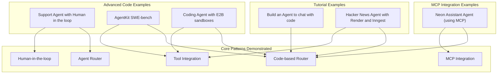

Sources: [docs/examples/overview.mdx:1-95]()

## Example Categories and AgentKit Concepts

Each example application demonstrates specific AgentKit concepts and patterns, providing practical implementations that developers can adapt for their own use cases.

| Example | Agents | Tools | Network | State | Router Type | Special Features |
|---------|--------|-------|---------|-------|-------------|------------------|
| Chat with Code | ✓ | - | - | - | - | Basic agent implementation |
| Hacker News Agent | ✓ | ✓ | ✓ | ✓ | Code-based | Multi-agent orchestration |
| Neon Assistant | ✓ | ✓ | ✓ | - | Code-based | MCP server integration |
| Support Agent | ✓ | ✓ | ✓ | - | Agent-based | Human escalation |
| SWE-bench | ✓ | ✓ | ✓ | - | Code-based | File system tools |
| E2B Coding Agent | ✓ | ✓ | ✓ | - | Code-based | Sandbox execution |

Sources: [docs/examples/overview.mdx:10-94]()

## Routing Patterns Demonstrated

The examples showcase two primary routing mechanisms available in AgentKit: code-based routing for deterministic workflows and agent-based routing for dynamic decision-making.

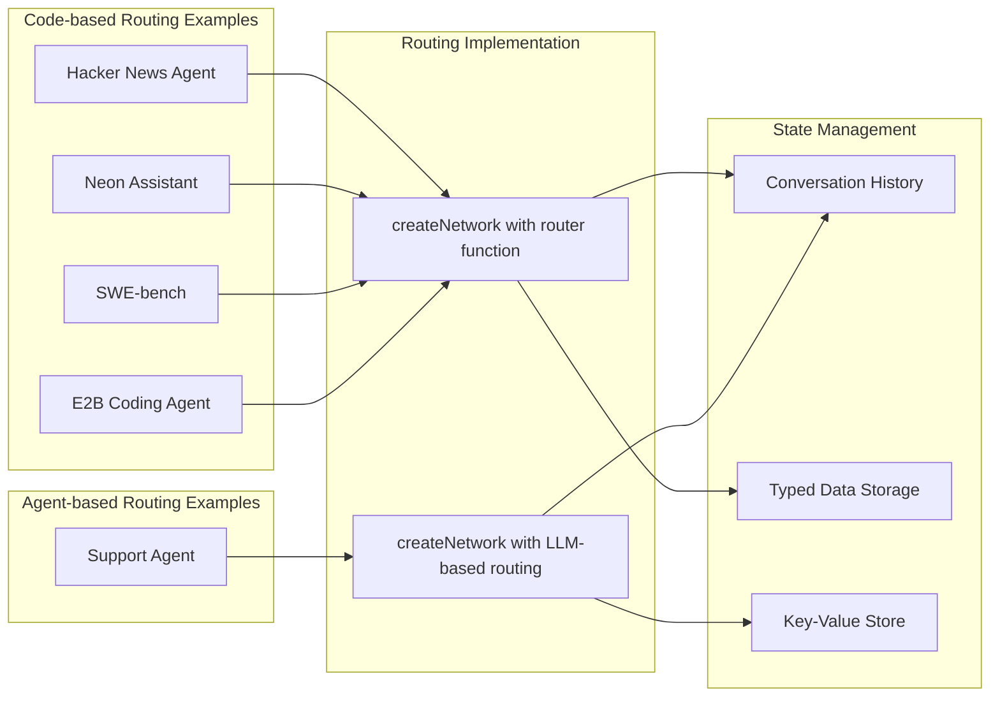

Sources: [docs/examples/overview.mdx:27-28](), [docs/examples/overview.mdx:49](), [docs/examples/overview.mdx:68](), [docs/examples/overview.mdx:79](), [docs/examples/overview.mdx:91]()

## Tool Integration Patterns

The examples demonstrate various approaches to tool integration, from simple function calls to complex external service integrations through the Model Context Protocol (MCP).

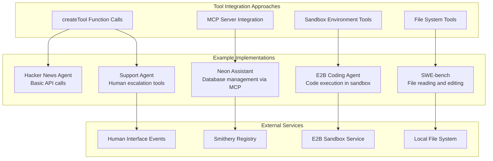

Sources: [docs/examples/overview.mdx:23](), [docs/examples/overview.mdx:45](), [docs/examples/overview.mdx:65](), [docs/examples/overview.mdx:76](), [docs/examples/overview.mdx:87]()

## Network Architecture Patterns

The examples demonstrate different network architectures, from simple single-agent implementations to complex multi-agent networks with sophisticated routing logic.

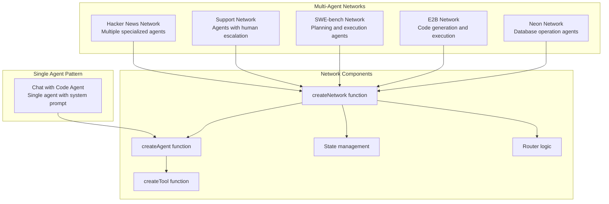

Sources: [docs/examples/overview.mdx:12-28](), [docs/examples/overview.mdx:39-51](), [docs/examples/overview.mdx:61-92]()

## Deployment and Integration Patterns

The examples showcase different deployment approaches, from local development with Inngest's dev server to production deployments with external service integrations.

| Pattern | Examples | Integration | Deployment |
|---------|----------|-------------|------------|
| Local Development | All examples | Inngest dev server | Local testing |
| MCP Integration | Neon Assistant | Smithery Registry | External tools |
| Sandbox Integration | E2B Coding Agent | E2B Service | Isolated execution |
| Human-in-the-Loop | Support Agent | Event-driven | Async workflows |
| File System Tools | SWE-bench | Local FS access | Code modification |

Sources: [docs/examples/overview.mdx:39](), [docs/examples/overview.mdx:61](), [docs/examples/overview.mdx:72](), [docs/examples/overview.mdx:83]()

# SWE-bench Code Agent


This document describes the SWE-bench code agent example, which demonstrates automated code modification using AgentKit with the SWE-bench benchmark. The example showcases a multi-agent system that can understand problem statements, create execution plans, and automatically edit Python codebases to resolve software engineering issues.

For information about other code assistant patterns and implementations, see [Code Assistant Variants](#4.2). For details about the core AgentKit concepts used in this example, see [Core Concepts](#2).

## System Overview

The SWE-bench code agent implements a two-phase approach to automated code modification: planning and editing. The system takes problem statements from the SWE-bench dataset, analyzes repository contents, creates an execution plan, and applies code changes to resolve the specified issues.

The implementation uses Inngest for orchestration, AgentKit for agent management, and tree-sitter for Python code parsing. The system operates on cloned Git repositories and can handle complex code modifications including class method replacements and file operations.

### Architecture Diagram

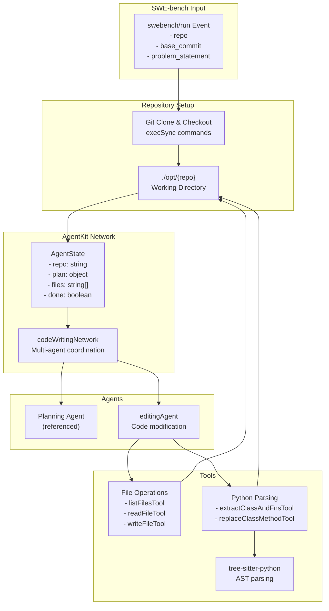

Sources: [examples/swebench/inngest.ts:22-70](), [examples/swebench/agents/editor.ts:14-70](), [examples/swebench/tools/tools.ts:30-161]()

## Agent Workflow

The SWE-bench agent follows a structured workflow from problem analysis to code implementation:

### Execution Flow Diagram

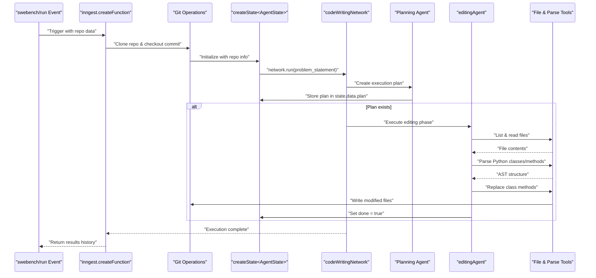

Sources: [examples/swebench/inngest.ts:25-68](), [examples/swebench/agents/editor.ts:35-51]()

## State Management

The system uses a typed state structure to coordinate between agents and maintain execution context:

### AgentState Structure

| Property | Type | Purpose |
|----------|------|---------|
| `repo` | `string` | Repository identifier (e.g., "pvlib/pvlib-python") |
| `plan` | `object` | Execution plan created by planning agent |
| `files` | `string[]` | List of files in the repository |
| `done` | `boolean` | Completion flag set by editing agent |

The state enables deterministic routing between planning and editing phases. The editing agent is conditionally enabled only when `plan` exists in the state, ensuring proper sequencing of operations.

Sources: [examples/swebench/inngest.ts:54-57](), [examples/swebench/agents/editor.ts:37-39]()

## Agent Implementation

### Editing Agent

The `editingAgent` is the primary code modification component with the following characteristics:

**Lifecycle Management**:
- **Enabled condition**: Only active when `opts.network?.state.data.plan !== undefined`
- **History filtering**: Maintains conversation history only from its own previous executions
- **System prompt**: Dynamically includes the current plan from network state

**Tool Integration**:
- `extractClassAndFnsTool` - Python AST parsing for code structure analysis
- `replaceClassMethodTool` - Precise method replacement within classes  
- `readFileTool` - File content retrieval
- `done` tool - Marks completion by setting `state.data.done = true`

Sources: [examples/swebench/agents/editor.ts:14-70]()

## Tool System

### File Operations

The tool system provides comprehensive file manipulation capabilities:

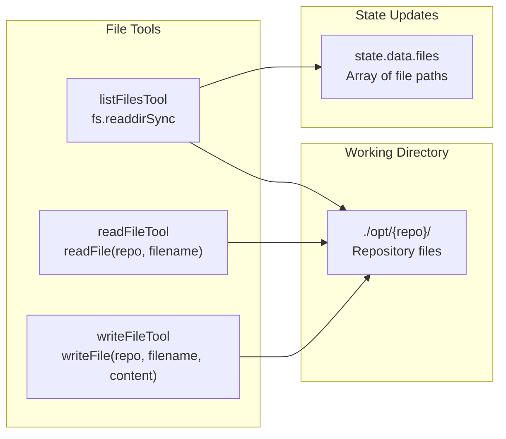

Sources: [examples/swebench/tools/tools.ts:30-86]()

### Python Code Parsing

The system uses tree-sitter for precise Python code analysis and modification:

**Parser Components**:
- **Language**: `tree-sitter-python` for Python AST generation
- **Structures**: `PyClass` and `PyFn` interfaces for code representation
- **Methods**: `parseClassAndFns()` for extracting class and function definitions

**Code Modification Process**:
1. Parse file contents using `Parser.parse(contents)`
2. Navigate AST using `tree.walk()` cursor
3. Extract class methods with line number ranges
4. Replace method content by line-based string manipulation
5. Write updated content back to filesystem

Sources: [examples/swebench/tools/tools.ts:93-253]()

## Dependencies and Setup

### Key Dependencies

| Package | Version | Purpose |
|---------|---------|---------|
| `@inngest/agent-kit` | 0.7.0 | Core AgentKit framework |
| `inngest` | latest | Serverless orchestration |
| `tree-sitter` | ^0.22.1 | Code parsing engine |
| `tree-sitter-python` | ^0.23.5 | Python language support |
| `express` | ^4.21.1 | HTTP server framework |

### Server Configuration

The example runs as an Express server with Inngest middleware:

**Port Configuration**: `3001`
**Inngest Endpoint**: `/api/inngest`
**JSON Payload Limit**: `50mb` to handle large repository data

Sources: [examples/swebench/package.json:14-25](), [examples/swebench/index.ts:1-23]()

## Usage Example

The system processes SWE-bench formatted events containing repository information and problem statements. Here's the expected event structure:

```json
{
  "data": {
    "repo": "pvlib/pvlib-python",
    "base_commit": "27a3a07ebc84b11014d3753e4923902adf9a38c0",
    "environment_setup_commit": "6072e0982c3c0236f532ddfa48fbf461180d834e",
    "problem_statement": "PVSystem with single Array generates an error..."
  }
}
```

The system automatically:
1. Clones the specified repository to `./opt/{repo}`
2. Checks out the base commit
3. Analyzes the problem statement
4. Creates and executes a modification plan
5. Returns execution history with agent results and checksums

Sources: [examples/swebench/README.md:41-55](), [examples/swebench/inngest.ts:11-18]()

# Code Assistant Variants


The Code Assistant examples demonstrate three distinct approaches to building AI-powered code analysis tools using AgentKit. Each variant showcases different patterns for implementing code assistance capabilities, from simple single-agent workflows to complex multi-agent networks.

## Architecture Overview

AgentKit provides three different code assistant implementations, each representing a different architectural pattern:

### Code Assistant Variant Architecture Comparison

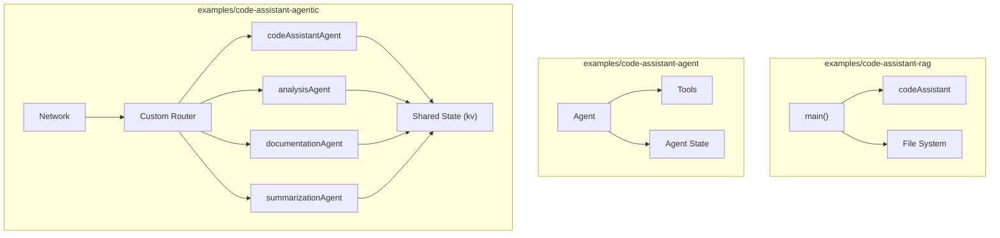

Sources: [examples/code-assistant-rag/package.json:1-22](), [examples/code-assistant-agent/package.json:1-22](), [examples/code-assistant-agentic/package.json:1-22]()

## Variant Comparison

| Variant | Pattern | Complexity | Use Case |
|---------|---------|------------|----------|
| `code-assistant-rag` | Simple RAG | Low | Basic code explanation |
| `code-assistant-agent` | Single Agent with Tools | Medium | Interactive code assistance |
| `code-assistant-agentic` | Multi-Agent Network | High | Complex code analysis workflows |

Each variant demonstrates different AgentKit capabilities and architectural patterns suitable for different requirements.

## RAG Variant: `examples/code-assistant-rag`

### Implementation Pattern

The RAG variant implements a simple Retrieval-Augmented Generation workflow using a single `createAgent` call with no tools. This represents the simplest possible AgentKit implementation.

### RAG Variant Flow

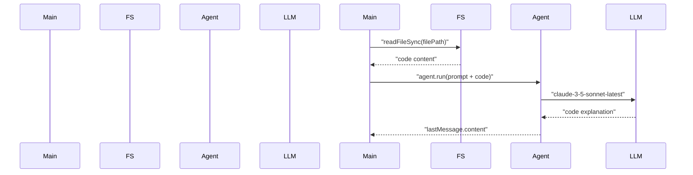

### Key Components

The RAG variant uses minimal AgentKit components:
- Single `codeAssistant` agent created with `createAgent`
- Direct file system access via Node.js `readFileSync`
- No tools, state management, or routing
- Direct model invocation through the agent

```mermaid
classDiagram
    class "createAgent" {
        +name: "code_assistant"
        +system: "AI assistant for code questions"
        +model: "anthropic(claude-3-5-sonnet-latest)"
    }
    
    class "main" {
        +readFileSync()
        +agent.run()
        +console.log()
    }
    
    main --> createAgent : "instantiates"
```

Sources: [examples/code-assistant-rag/package.json:1-22]()

## Single Agent Variant: `examples/code-assistant-agent`

### Implementation Pattern

The single agent variant uses `createAgent` with custom tools, representing a middle-ground approach that provides interactive capabilities while maintaining simplicity.

### Single Agent Architecture

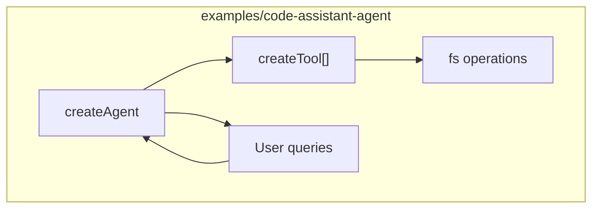

This variant demonstrates:
- Agent with tool integration using `createTool`
- Interactive workflow capabilities
- File system operations through tools
- State maintained within the agent context

Sources: [examples/code-assistant-agent/package.json:1-22]()

## Agentic Variant: `examples/code-assistant-agentic`

### Implementation Pattern

The agentic variant uses `createNetwork` with multiple specialized agents coordinated by a custom router. This demonstrates the full power of AgentKit's multi-agent orchestration capabilities.

### Agentic Network Architecture

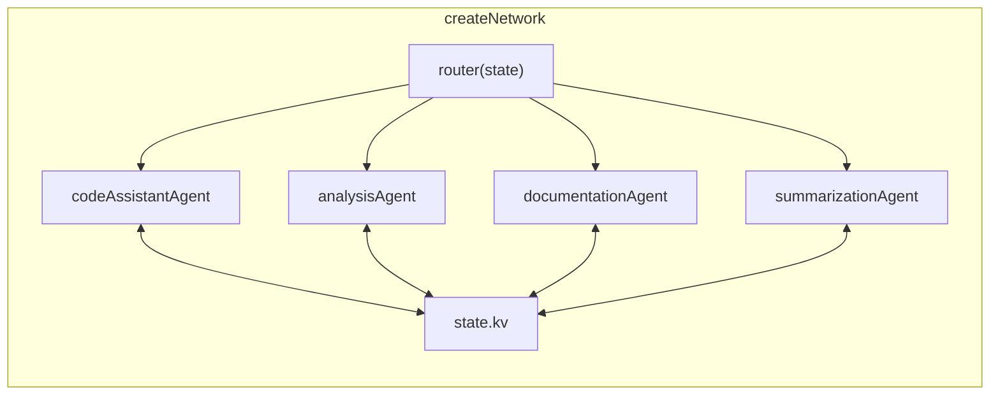

### Agent-Tool Mapping

Each agent in the network uses specialized tools created with `createTool`:

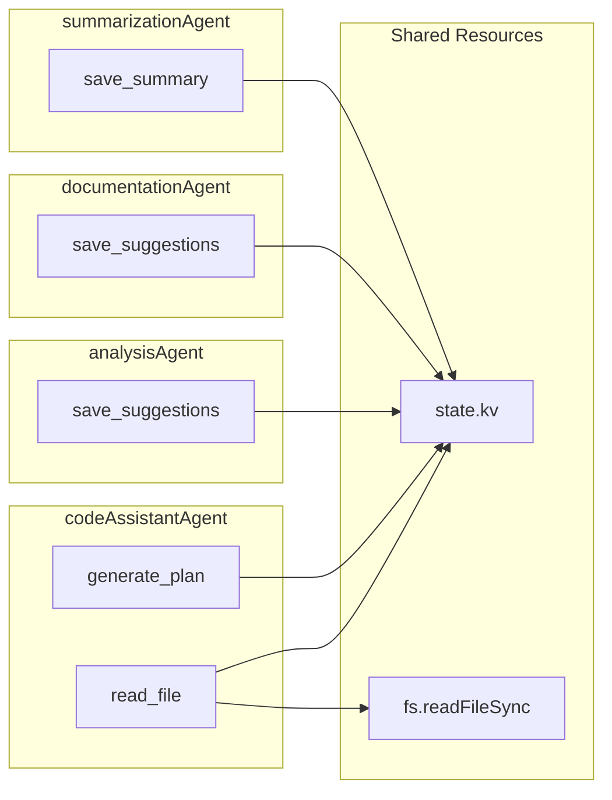

### Router Logic Implementation

The custom router function determines agent execution order based on shared state:

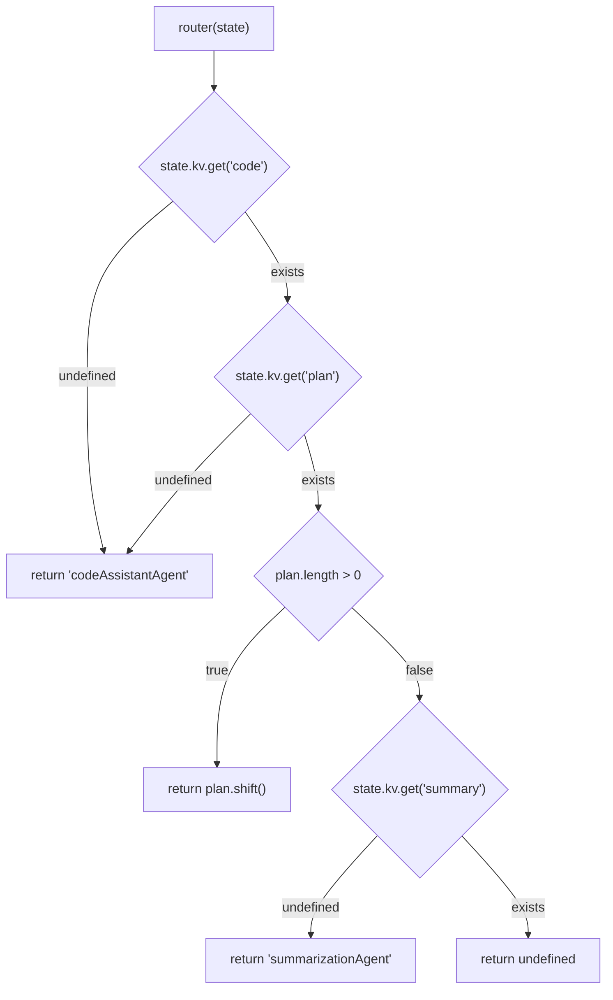

### Execution Flow

The network orchestrates a complex multi-step workflow:

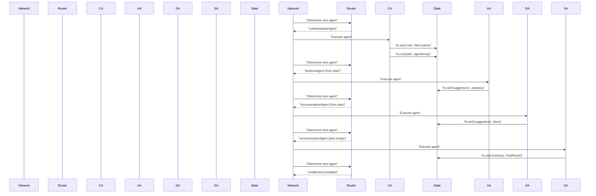

Sources: [examples/code-assistant-agentic/package.json:1-22]()

## Example Usage

### Code Assistant v1

```typescript
// Load the code file
const filePath = join(process.cwd(), `files/example.ts`);
const code = readFileSync(filePath, "utf-8");

// Run the analysis
const { lastMessage } = await codeAssistant.run(`What the following code does?

${code}
`);

console.log(lastMessage({ type: "text" }).content);
```

Sources: [docs/guided-tour/ai-workflows.mdx:15-36]()

### Code Assistant v2

```typescript
// Run the network with a user query
const {
  state: { kv },
} = await network.run(
  `Analyze the files/example.ts file by suggesting improvements and documentation.`
);

// Access the final summary
console.log("Analysis:", kv.get("summary"));
```

Sample output:
```
Analysis: The code analysis suggests several key areas for improvement:

1. Type Safety and Structure:
- Implement strict TypeScript configurations
- Add explicit return types and interfaces
- Break down complex functions
- Follow Single Responsibility Principle
- Implement proper error handling

2. Performance Optimization:
- Review and optimize critical operations
...
```

Sources: [docs/guided-tour/agentic-workflows.mdx:12-32](), [docs/guided-tour/agentic-workflows.mdx:507-528]()

## Deployment

The Code Assistant examples are implemented as Node.js applications with TypeScript:

| Implementation | Package | Key Dependencies |
|----------------|---------|------------------|
| Code Assistant v1 (RAG) | examples/code-assistant-rag | @inngest/agent-kit |
| Code Assistant v2 (Agentic) | examples/code-assistant-agentic | @inngest/agent-kit, zod |
| Code Assistant v3 (Agent) | examples/code-assistant-agent | @inngest/agent-kit, zod |

Each implementation can be run locally with a compatible LLM API key (primarily Anthropic's Claude).

Sources: [examples/code-assistant-rag/package.json:1-22](), [examples/code-assistant-agentic/package.json:1-23](), [examples/code-assistant-agent/package.json:1-22]()

## Summary

The Code Assistant examples demonstrate the flexibility of the AgentKit framework, showcasing:

1. How to build progressively more complex AI applications
2. Different patterns for integrating with language models
3. The use of core AgentKit concepts:
   - Single agents for simple tasks
   - Networks for complex workflows
   - Tools for environment interaction
   - State management for coordination
   - Routers for dynamic workflow control

These examples serve as practical references for developers looking to implement their own AI-powered code analysis tools using AgentKit.

# Search Stagehand


## Purpose and Overview

The Search Stagehand example demonstrates how to create an agent that can perform web searches and interact with web content using AgentKit integrated with BrowserBase's Stagehand service. This example showcases how to build agents that can browse the web, extract information, and interact with web pages programmatically.

For more information about building general agents, see [Agents](#2.1). For information about other example applications, see [Example Applications](#4).

## Architecture Overview

Search Stagehand combines AgentKit's agent capabilities with BrowserBase's web interaction tools to create an agent that can perform web searches and extract information from the results.

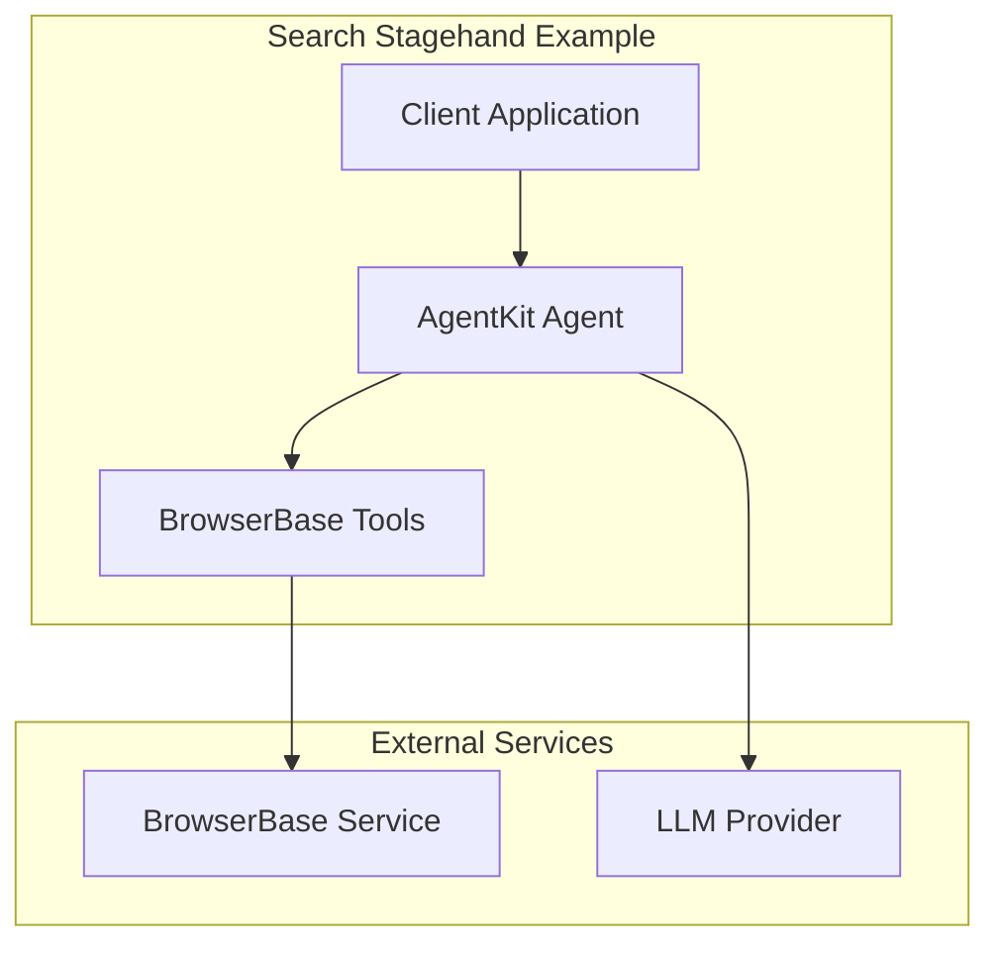

Sources: [examples/simple-search-stagehand/package.json:8-14]()

## Components and Dependencies

The Search Stagehand example relies on several key dependencies to function:

| Component | Package | Purpose |
|-----------|---------|---------|
| AgentKit | `@inngest/agent-kit` | Core agent functionality |
| BrowserBase SDK | `@browserbasehq/sdk` | SDK for interacting with BrowserBase services |
| BrowserBase Stagehand | `@browserbasehq/stagehand` | Stagehand-specific functionality |
| Inngest | `inngest` | Function orchestration (optional) |
| Environment Variables | `dotenv` | Configuration management |
| Schema Validation | `zod` | Data validation |

Sources: [examples/simple-search-stagehand/package.json:8-14]()

## How It Works

The Search Stagehand example creates an agent that can perform web searches and extract information using a combination of AgentKit and BrowserBase's Stagehand service.

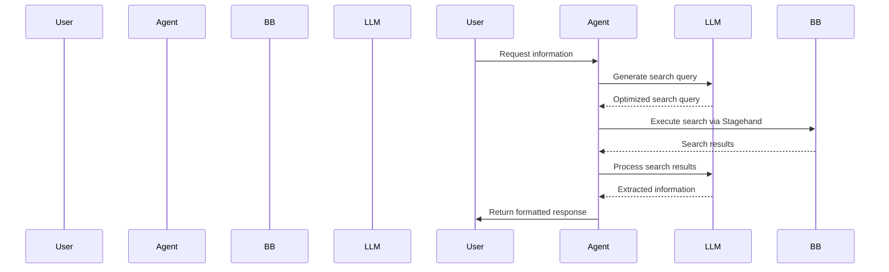

Sources: [examples/simple-search-stagehand/package.json:5-6]()

## Implementation Architecture

The Search Stagehand example implements a simple but powerful pattern for web search and information extraction using AgentKit and BrowserBase.

```mermaid
classDiagram
    class "Agent" {
        +tools: Tool[]
        +model: ModelAdapter
        +execute(input): Promise<AgentResponse>
    }
    
    class "BrowserBaseTool" {
        +name: string
        +description: string
        +parameters: ZodSchema
        +handler(params): Promise<any>
    }
    
    class "SearchTool" {
        +name: "search"
        +description: "Search the web"
        +parameters: ZodSchema~SearchParams~
        +handler(params): Promise<SearchResults>
    }
    
    class "ExtractTool" {
        +name: "extract"
        +description: "Extract data from webpage"
        +parameters: ZodSchema~ExtractParams~
        +handler(params): Promise<ExtractedData>
    }
    
    Agent --> BrowserBaseTool: uses
    BrowserBaseTool <|-- SearchTool: extends
    BrowserBaseTool <|-- ExtractTool: extends
```

Sources: [examples/simple-search-stagehand/package.json:8-14]()

## Key Functional Flow

The typical flow of the Search Stagehand example follows these steps:

1. Initialize the BrowserBase SDK with credentials
2. Create tools that wrap BrowserBase's Stagehand functionality
3. Create an AgentKit agent with these tools
4. Accept user queries
5. Use the agent to process queries, which may involve:
   - Formulating search queries
   - Executing web searches through BrowserBase
   - Extracting information from search results
   - Synthesizing and returning answers

```mermaid
flowchart TD
    A["Initialize"] --> B["Configure Tools"]
    B --> C["Create Agent"]
    C --> D["Accept User Query"]
    D --> E["Process Query"]
    
    subgraph "Query Processing"
        E --> F["Formulate Search"]
        F --> G["Execute Search via BrowserBase"]
        G --> H["Process Results"]
        H --> I["Extract Information"]
        I --> J["Synthesize Answer"]
    end
    
    J --> K["Return Response to User"]
```

Sources: [examples/simple-search-stagehand/package.json:5-6]()

## Integration with AgentKit

The Search Stagehand example demonstrates a key pattern in AgentKit: extending agent capabilities through external tools. In this case, the tools are provided by BrowserBase's Stagehand service.

```mermaid
flowchart LR
    subgraph "AgentKit"
        Agent["Agent"]
        ToolSystem["Tool System"]
    end
    
    subgraph "BrowserBase Integration"
        BBTools["BrowserBase Tools"]
        Stagehand["Stagehand API"]
    end
    
    Agent --> ToolSystem
    ToolSystem --> BBTools
    BBTools --> Stagehand
```

Sources: [examples/simple-search-stagehand/package.json:8-14]()

## Setup and Configuration

To run the Search Stagehand example, you need to:

1. Set up environment variables for BrowserBase credentials
2. Install the necessary dependencies
3. Run the example with the start script

These steps are defined in the package.json:

```
npm install
npm start
```

The start script compiles TypeScript and runs the built application:

Sources: [examples/simple-search-stagehand/package.json:5-6]()

## Use Cases

The Search Stagehand example is particularly useful for:

1. **Information Retrieval**: Collecting specific information from web searches
2. **Research Assistance**: Helping researchers gather information from multiple sources
3. **Content Aggregation**: Compiling information from various websites
4. **Web Automation**: Demonstrating how agents can interact with web interfaces
5. **Data Extraction**: Showing how to extract structured data from unstructured web content

## Conclusion

The Search Stagehand example demonstrates the integration of AgentKit with BrowserBase's Stagehand service to create agents capable of web search and information extraction. This example showcases how AgentKit can be extended with external tools to provide specialized capabilities to agents, allowing them to interact with web content in sophisticated ways.

The combination of AgentKit's agent framework with BrowserBase's web interaction tools creates a powerful system for building agents that can navigate and extract information from the web, enabling a wide range of web automation and information retrieval applications.