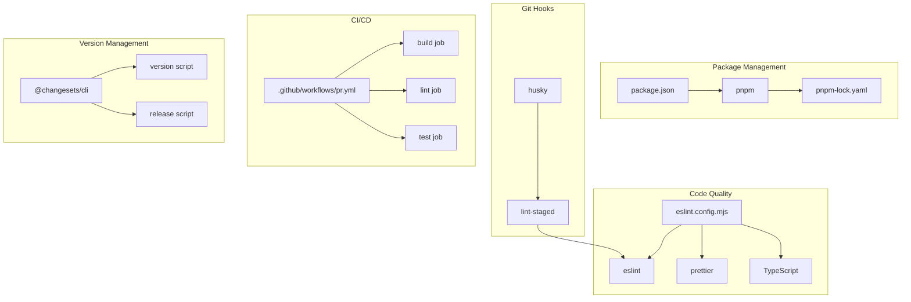
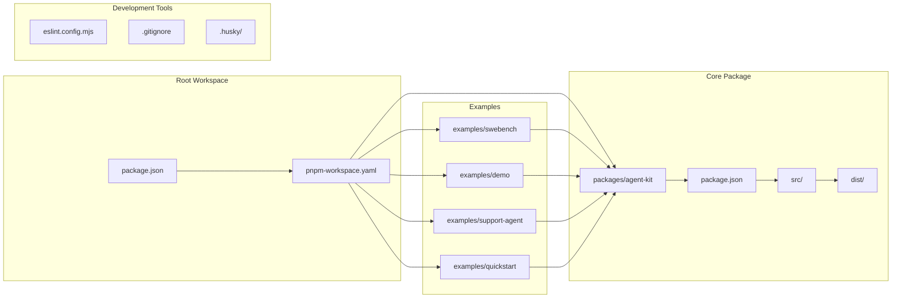
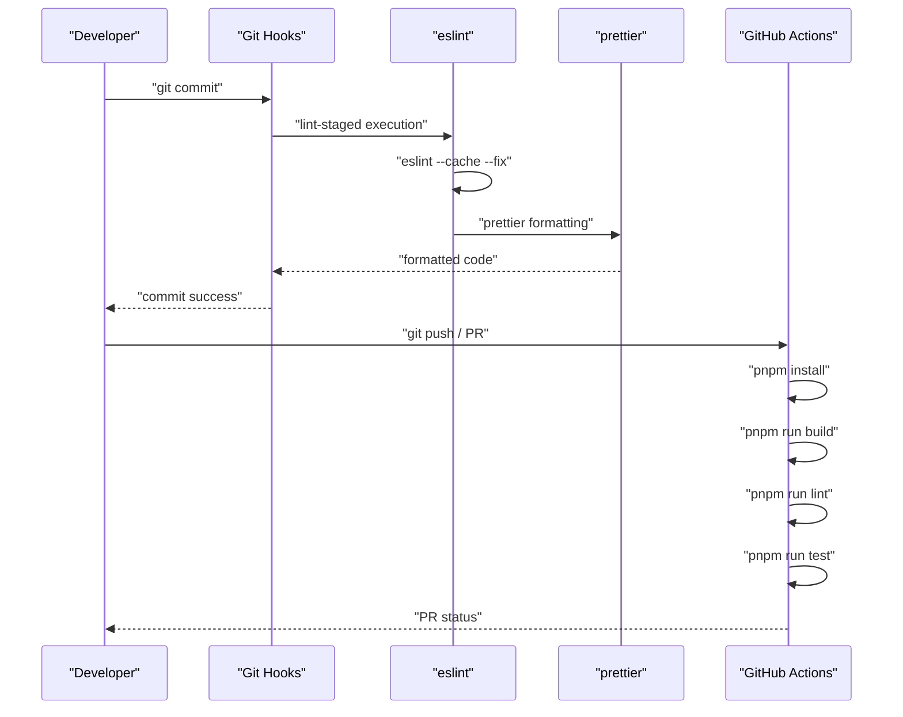
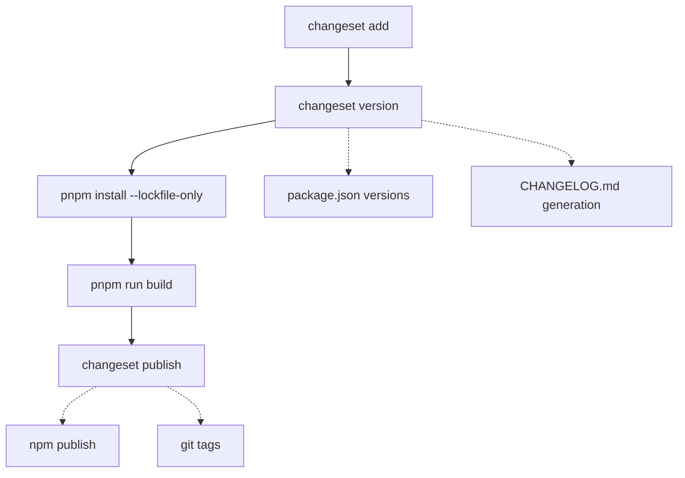

This document covers the development environment, build system, and contribution workflow for AgentKit framework contributors and maintainers. It focuses on the technical infrastructure and tooling used to develop the framework itself.

For detailed repository setup instructions, see [Repository Setup](#7.1). For information about using AgentKit in your applications, see [Getting Started](#3).

## Development Overview

AgentKit is developed as a TypeScript monorepo using modern development practices and tooling. The development environment emphasizes code quality, automated testing, and streamlined release management through a comprehensive toolchain.

The framework follows a workspace-based architecture where the core `@inngest/agent-kit` package is developed alongside example applications that demonstrate various usage patterns. This co-location enables rapid iteration and ensures examples stay current with API changes.

**Development Toolchain Architecture**



Sources: [package.json:1-33](), [eslint.config.mjs:1-33](), [.github/workflows/pr.yml:1-33](), [pnpm-lock.yaml:1-50]()

## Monorepo Structure

The codebase is organized as a pnpm workspace with the following key components:

| Component | Purpose | Location |
|-----------|---------|----------|
| Core Package | Main `@inngest/agent-kit` framework | `packages/agent-kit/` |
| Examples | Usage demonstrations and test applications | `examples/` |
| Tooling Config | Development tool configurations | Root directory |
| CI/CD | GitHub Actions workflows | `.github/workflows/` |

**Workspace Dependencies Flow**



Sources: [package.json:1-33](), [examples/swebench/Makefile:1-8]()

## Development Workflow

The development workflow is built around three core scripts defined in the root `package.json`:

### Build Process

The `build` script executes builds across all workspace packages that define a build command:

```
pnpm run --if-present --recursive build
```

This ensures the core framework is compiled and examples can consume the latest changes during development.

### Code Quality Pipeline

Code quality is enforced through multiple layers:

1. **Linting**: `eslint` with TypeScript integration via `typescript-eslint`
2. **Formatting**: `prettier` for consistent code style  
3. **Git Hooks**: `husky` + `lint-staged` for pre-commit validation
4. **CI Validation**: GitHub Actions for automated checks on pull requests

**Code Quality Enforcement Flow**



Sources: [package.json:22-24](), [eslint.config.mjs:1-33](), [.github/workflows/pr.yml:1-33]()

### Testing Strategy

Tests are executed via the `test` script which runs tests in all packages that define test commands:

```
pnpm run --if-present --recursive test
```

The CI pipeline validates all packages through the standardized test workflow defined in [.github/workflows/pr.yml:26-32]().

## Release Management

AgentKit uses `@changesets/cli` for automated version management and publishing. The release process involves two primary commands:

### Version Management

The `version` script handles version bumping and lockfile updates:

```
changeset version && pnpm install --lockfile-only
```

This command:
- Applies pending changesets to update package versions
- Updates `pnpm-lock.yaml` to reflect new version constraints
- Generates changelog entries

### Publishing Process  

The `release` script handles the complete build and publish workflow:

```
pnpm run build && changeset publish
```

This ensures:
- All packages are built with latest changes
- Packages are published to npm with correct versions
- Release tags are created in the repository

**Release Workflow**



Sources: [package.json:6-7](), [pnpm-lock.yaml:10-13]()

## Build System Configuration

The build system leverages several configuration files that define development behavior:

### TypeScript Configuration

TypeScript compilation is configured through project-specific `tsconfig.json` files in each package, with ESLint integration providing type-aware linting via `typescript-eslint`.

### ESLint Configuration

The modern flat config format in [eslint.config.mjs:1-33]() defines:

- **Ignored Patterns**: `**/dist`, `eslint.config.mjs`, `examples/**`
- **Rule Sets**: `@eslint/js` recommended + `typescript-eslint` recommended + `prettier` integration
- **TypeScript Integration**: Project service with automatic tsconfig detection
- **Custom Rules**: Prettier warnings, namespace allowance, consistent type imports

### Git Integration

Git workflow is enhanced through:

- **Pre-commit Hooks**: [package.json:22-24]() defines `lint-staged` configuration for `*.{j,t}s` files
- **Ignored Files**: [.gitignore:1-13]() excludes build artifacts, dependencies, and environment files
- **CI Triggers**: [.github/workflows/pr.yml:4-5]() activates on pull requests and manual dispatch

Sources: [eslint.config.mjs:8-31](), [package.json:22-31](), [.gitignore:1-13](), [.github/workflows/pr.yml:1-33]()