This document covers implementing human-in-the-loop workflows in AgentKit, enabling agents to pause execution and wait for human input or approval before continuing. This pattern is essential for building agents that require human oversight, escalation, or input for critical decisions.

For information about general agent routing and orchestration, see [Routers](#2.4). For details on tool creation and usage, see [Tools](#2.5).

## Overview

Human-in-the-loop workflows allow agents to seamlessly pause their execution and wait for human intervention when needed. This pattern is implemented by combining AgentKit tools with Inngest's event-driven orchestration capabilities, specifically using the `step.waitForEvent()` method to pause execution until a specific event is received.

The pattern is particularly useful for:
- Support agents that need to escalate complex issues to humans
- Code review and approval workflows
- Decision points requiring human judgment
- Quality assurance and safety checks

Sources: [docs/advanced-patterns/human-in-the-loop.mdx:1-13](), [examples/support-agent-human-in-the-loop/src/index.ts:1-14]()

## Core Architecture

The human-in-the-loop pattern requires three key components working together:

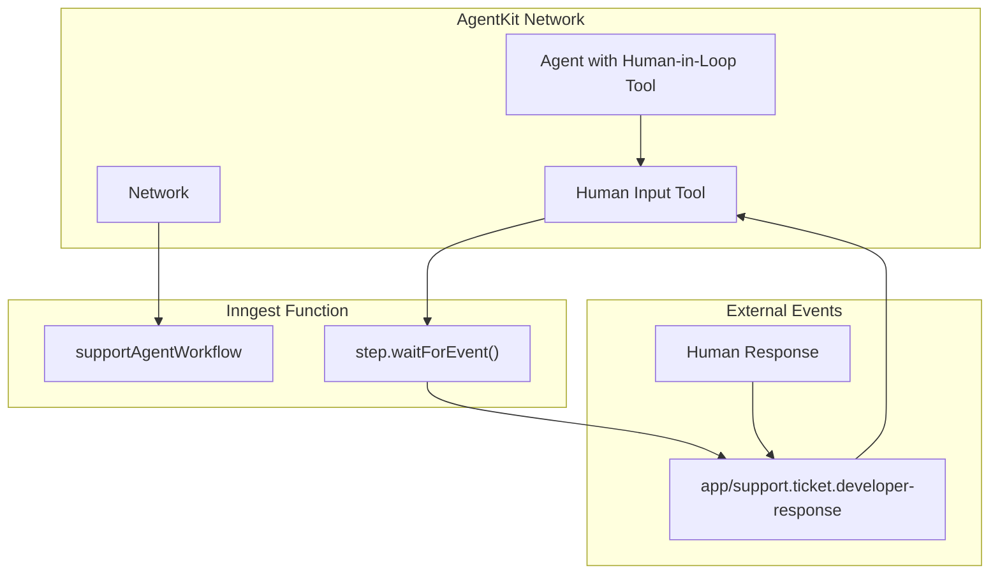

**Human-in-the-Loop Execution Flow**

Sources: [docs/advanced-patterns/human-in-the-loop.mdx:10-52](), [examples/support-agent-human-in-the-loop/src/index.ts:211-235]()

## Tool Implementation Pattern

Human-in-the-loop functionality is implemented as tools that use Inngest's `step.waitForEvent()` method. The basic pattern involves:

1. **Tool Handler**: Uses the `step` context to wait for external events
2. **Event Matching**: Matches incoming events against specific criteria
3. **Timeout Handling**: Defines maximum wait time for human response
4. **Result Processing**: Handles the received human input

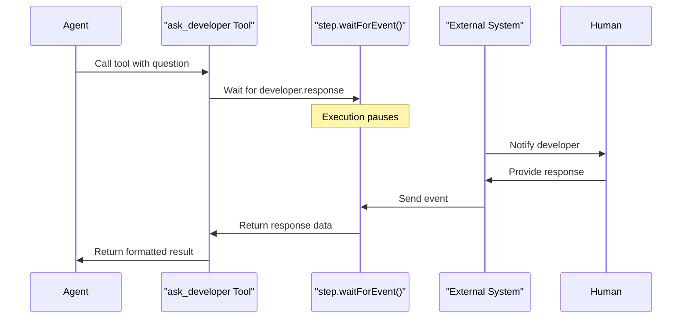

**Human-in-the-Loop Tool Execution Sequence**

The `ask_developer` tool implementation demonstrates this pattern:

Sources: [examples/support-agent-human-in-the-loop/src/index.ts:93-130](), [docs/advanced-patterns/human-in-the-loop.mdx:14-48]()

## Inngest Function Integration

AgentKit networks must be wrapped in Inngest functions to enable human-in-the-loop capabilities. This integration provides the `step` context required for event waiting:

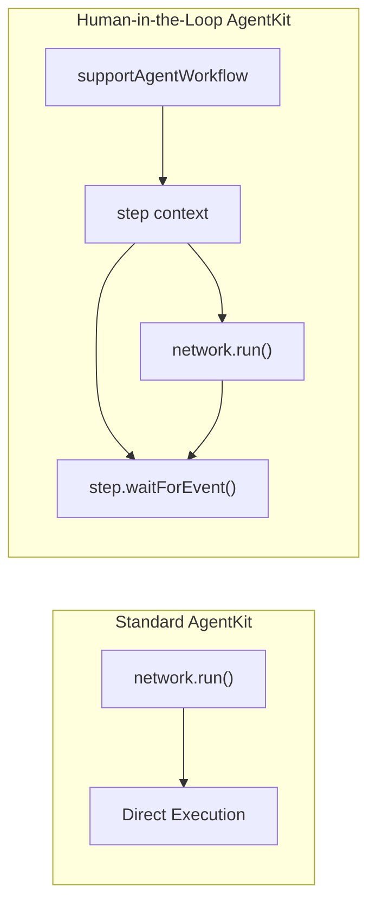

**AgentKit Integration with Inngest Functions**

The integration transforms direct network execution into event-driven workflows:

| Component | Standard AgentKit | Human-in-the-Loop |
|-----------|------------------|-------------------|
| Execution | `network.run()` | `inngest.createFunction()` |
| Context | No step context | `step` parameter available |
| Tools | Synchronous only | Can use `step.waitForEvent()` |
| Triggering | Direct invocation | Event-driven |

Sources: [examples/support-agent-human-in-the-loop/src/index.ts:211-235](), [docs/advanced-patterns/human-in-the-loop.mdx:119-188]()

## Support Agent Example Architecture

The support agent example demonstrates a complete human-in-the-loop system with multiple agent types and escalation patterns:

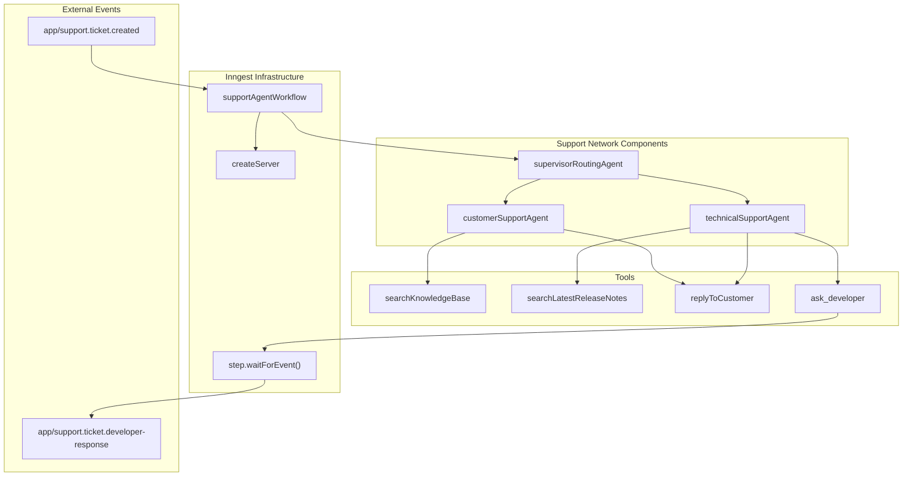

**Support Agent Network Architecture**

The system includes:

- **Agent Hierarchy**: `supervisorRoutingAgent` routes between `customerSupportAgent` and `technicalSupportAgent`
- **Tool Distribution**: Each agent has access to relevant tools for their domain
- **Human Escalation**: `technicalSupportAgent` can escalate to developers via `ask_developer` tool
- **Event Coordination**: Inngest coordinates between ticket creation and developer responses

Sources: [examples/support-agent-human-in-the-loop/src/index.ts:70-205](), [examples/support-agent-human-in-the-loop/src/index.ts:211-244]()

## Implementation Details

### Tool Handler Requirements

Human-in-the-loop tools must validate the presence of the `step` context:

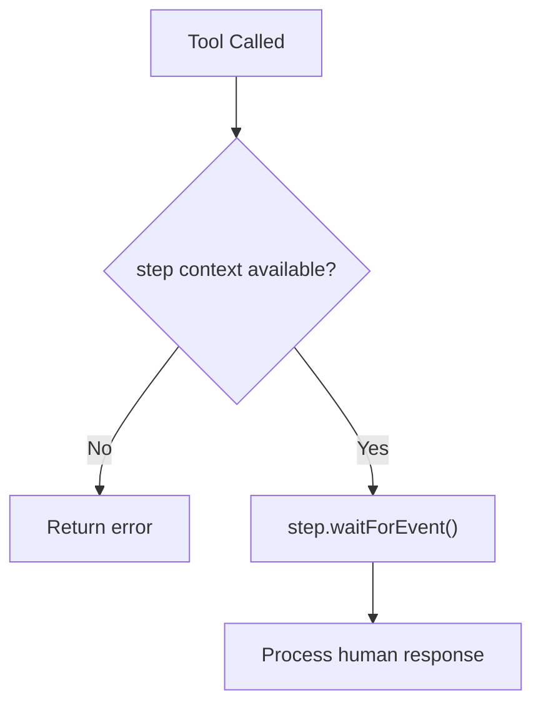

**Tool Context Validation Flow**

The pattern ensures tools fail gracefully when used outside Inngest functions.

Sources: [examples/support-agent-human-in-the-loop/src/index.ts:102-105](), [docs/advanced-patterns/human-in-the-loop.mdx:24-27]()

### Event Matching Configuration

The `step.waitForEvent()` method supports sophisticated event matching:

| Parameter | Purpose | Example Value |
|-----------|---------|---------------|
| `event` | Event type to wait for | `"app/support.ticket.developer-response"` |
| `timeout` | Maximum wait duration | `"4h"` |
| `match` | Field matching criteria | `"data.ticketId"` |

This configuration ensures events are properly routed to the correct waiting tool instance.

Sources: [examples/support-agent-human-in-the-loop/src/index.ts:111-118](), [docs/advanced-patterns/human-in-the-loop.mdx:31-36]()

### Server Configuration

The AgentKit server must be configured with the Inngest functions:

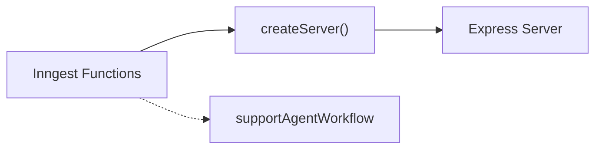

**Server Setup for Human-in-the-Loop**

The `createServer` function from `@inngest/agent-kit/server` handles the integration between AgentKit networks and Inngest functions.

Sources: [examples/support-agent-human-in-the-loop/src/index.ts:238-244]()

## Event Flow Patterns

Human-in-the-loop workflows follow predictable event patterns:

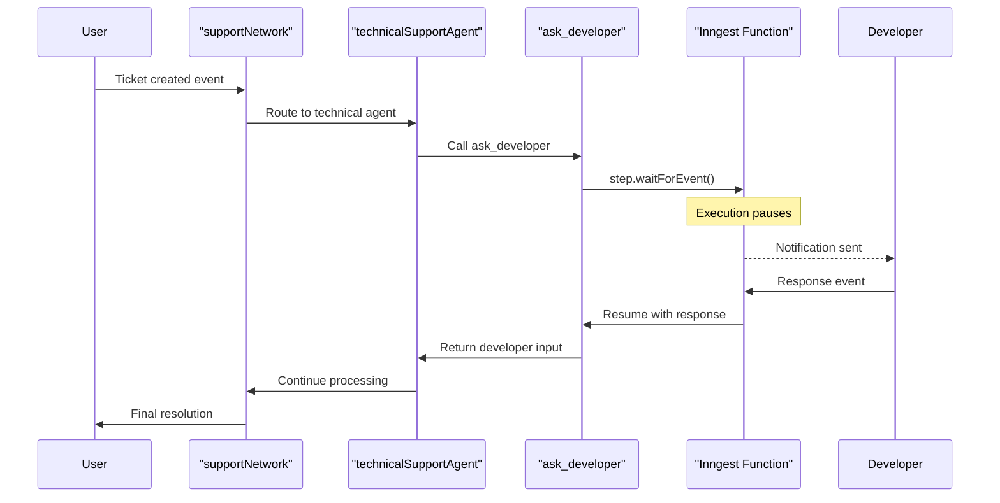

**Complete Human-in-the-Loop Event Flow**

This pattern enables seamless integration of human decision-making into automated agent workflows while maintaining the benefits of event-driven orchestration.

Sources: [examples/support-agent-human-in-the-loop/src/index.ts:211-235](), [docs/advanced-patterns/human-in-the-loop.mdx:154-188]()

# Agentic Workflows


## Purpose and Scope

This document explains how to build complex agentic workflows in AgentKit. Agentic workflows introduce reasoning capabilities that allow AI systems to adapt to user input, plan actions, and select appropriate tools. Unlike simpler approaches like RAG (Retrieval Augmented Generation), agentic workflows enable a more flexible and powerful interaction model.

For information about simpler AI workflows, see [AI Workflows](#5.1). For specific routing strategies that can be used within agentic workflows, see [Routing Strategies](#5.3).

Sources: [docs/guided-tour/agentic-workflows.mdx:7-40](). [docs/guided-tour/overview.mdx:6-14]()

## What Are Agentic Workflows?

Agentic workflows are AI application patterns that go beyond simple input-output relationships by introducing:

1. **Reasoning capabilities** - The ability to understand and adapt to user input
2. **Planning** - Determining a sequence of actions to achieve a goal
3. **Tool selection** - Choosing and using the appropriate tools based on the context
4. **Multi-agent collaboration** - Coordinating specialized agents for more accurate results

Unlike RAG workflows that follow predetermined retrieval and generation steps, agentic workflows dynamically determine their execution path based on the current state and context.

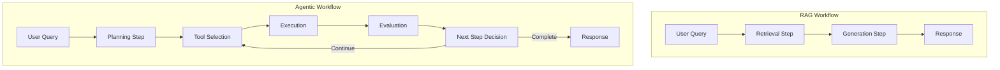

**Diagram: Comparison between RAG and Agentic Workflows**

Sources: [docs/guided-tour/agentic-workflows.mdx:138-152](). [docs/guided-tour/ai-workflows.mdx:138-147]()

## Key Components of Agentic Workflows

Agentic workflows in AgentKit are built upon four core components:

1. **Tools**: Functions that agents can call to interact with their environment
2. **Router**: Controls the flow between agents based on state and logic
3. **Network**: Orchestrates multiple agents and maintains shared state
4. **State**: Stores and shares information between agents

These components work together to create flexible, reasoning-driven workflows that can adapt to different scenarios.

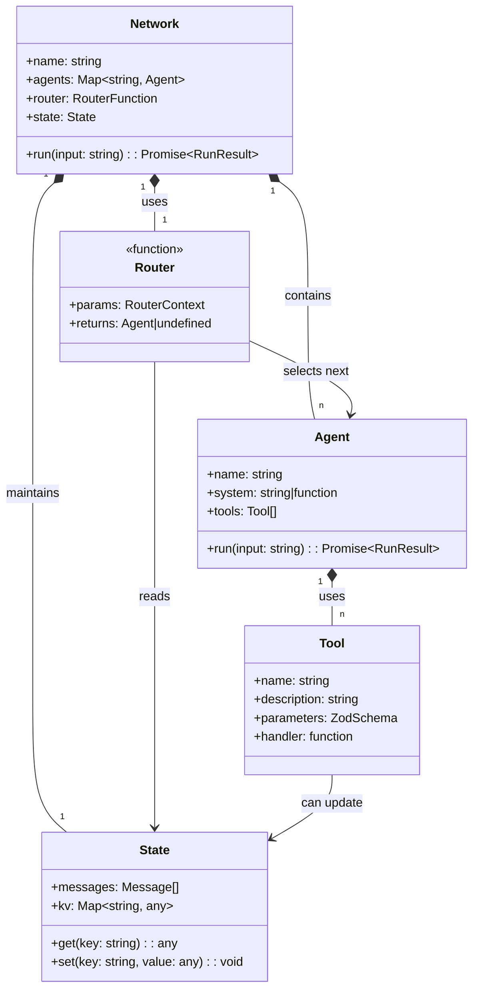

**Diagram: Core Components of Agentic Workflows in AgentKit**

Sources: [docs/guided-tour/agentic-workflows.mdx:32-38](). [docs/guided-tour/agentic-workflows.mdx:156-172]()

## Creating and Using Tools

Tools are the primary way agents interact with their environment in agentic workflows. They enable agents to perform actions such as reading from the filesystem, storing data in the shared state, or calling external APIs.

### Tool Structure

Tools in AgentKit are defined using the `createTool` function with the following properties:

- `name`: A unique identifier for the tool
- `description`: Explains what the tool does to the LLM
- `parameters`: A Zod schema defining the expected inputs
- `handler`: A function that implements the tool's functionality

Here's an example of a tool that saves information to the shared state:

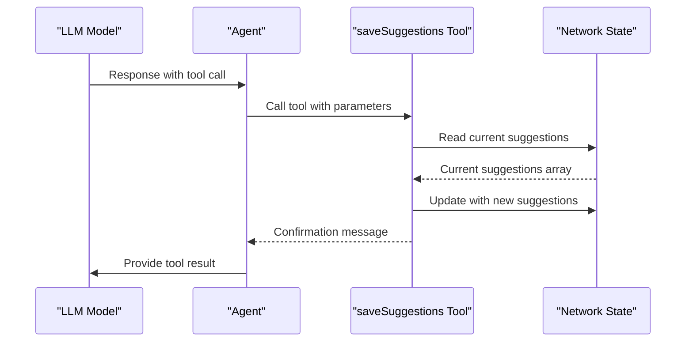

**Diagram: Tool Execution Flow**

Sources: [docs/guided-tour/agentic-workflows.mdx:210-228](). [docs/guided-tour/agentic-workflows.mdx:229-238]()

## Network and Agent Configuration

To create an agentic workflow, you first need to define your agents with appropriate tools, then configure them in a network with a router.

### Creating Agents with Tools

Agents are created with the `createAgent` function and can be equipped with tools:

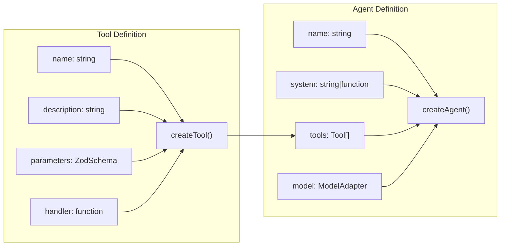

**Diagram: Agent and Tool Definition Structure**

Sources: [docs/guided-tour/agentic-workflows.mdx:189-203](). [docs/guided-tour/agentic-workflows.mdx:210-228]()

### Assembling the Network

A network is created using the `createNetwork` function, which connects multiple agents and configures the routing logic:

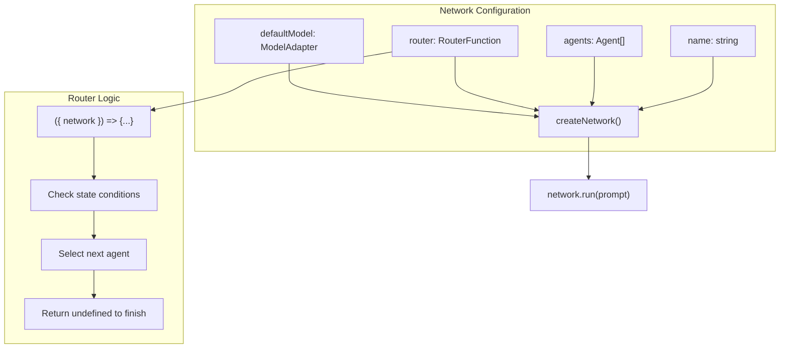

**Diagram: Network Configuration and Execution**

Sources: [docs/guided-tour/agentic-workflows.mdx:370-440](). [docs/guided-tour/agentic-workflows.mdx:456-478]()

## Implementing a Router for Workflow Control

The router is the component that determines which agent should run next in the workflow. It receives the current network state and returns the next agent to execute, or `undefined` to complete the workflow.

### Router Function Structure

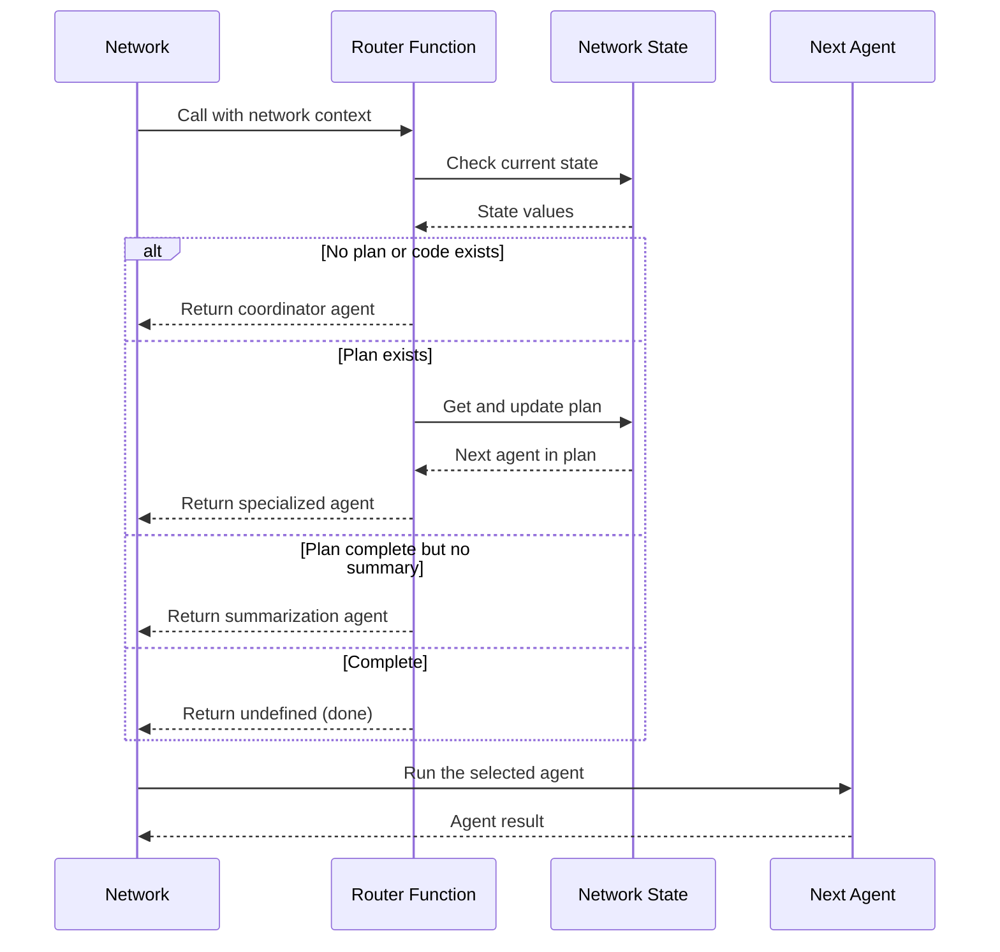

**Diagram: Router Decision Flow**

Sources: [docs/guided-tour/agentic-workflows.mdx:409-440](). [docs/guided-tour/agentic-workflows.mdx:456-478]()

## State Management in Agentic Workflows

State management is crucial for agentic workflows as it enables information to be shared between different agents and across multiple steps of the workflow.

### Shared State Through Key-Value Store

AgentKit provides a key-value store in the network's state that allows agents to read and write data:

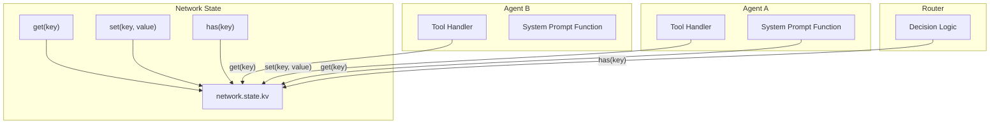

**Diagram: State Interaction in Agentic Workflows**

Sources: [docs/guided-tour/agentic-workflows.mdx:219-227](). [docs/guided-tour/agentic-workflows.mdx:292-296](). [docs/guided-tour/agentic-workflows.mdx:305-307](). [docs/guided-tour/agentic-workflows.mdx:344-347]()

## Example: Code Analysis Workflow

Let's examine a practical example of an agentic workflow for code analysis:

### Workflow Overview

This workflow analyzes code files and provides tailored recommendations:

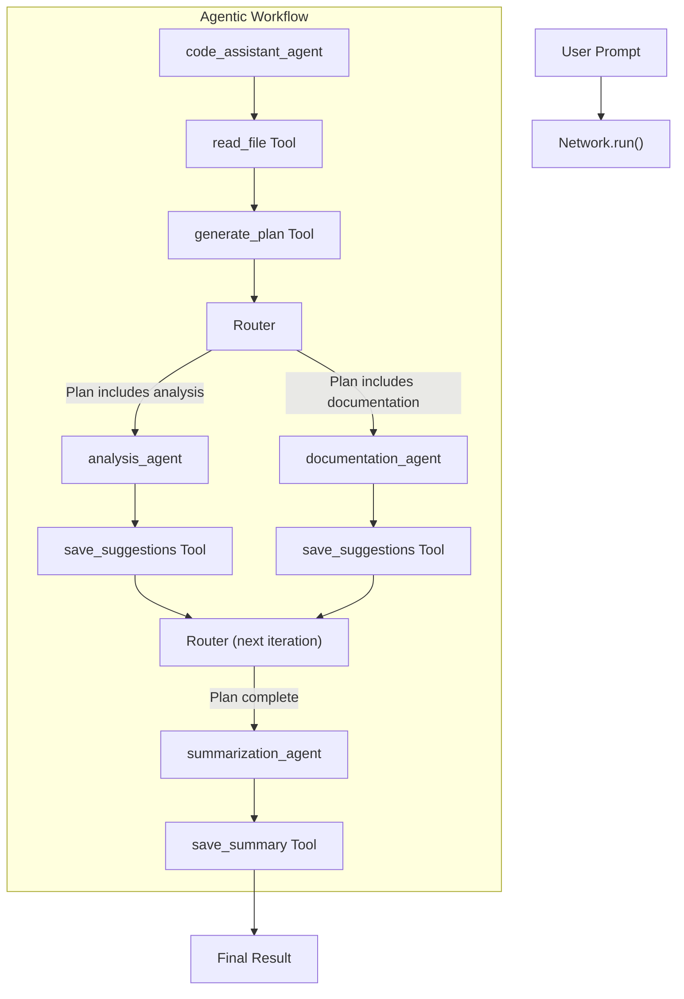

**Diagram: Code Analysis Agentic Workflow**

Sources: [docs/guided-tour/agentic-workflows.mdx:138-152](). [docs/guided-tour/agentic-workflows.mdx:261-312](). [docs/guided-tour/agentic-workflows.mdx:328-350]()

### Key Components in the Example

| Component | Role | Implementation |
|-----------|------|----------------|
| `code_assistant_agent` | Coordinator that reads code and plans workflow | Agent with `read_file` and `generate_plan` tools |
| `analysis_agent` | Analyzes code and suggests improvements | Agent with `save_suggestions` tool |
| `documentation_agent` | Generates documentation for code | Agent with `save_suggestions` tool |
| `summarization_agent` | Creates final summary from all suggestions | Agent with `save_summary` tool |
| Router | Controls workflow based on the generated plan | Function checking state and returning next agent |
| State | Stores code, plan, suggestions, and summary | Accessed through `network.state.kv` |

Sources: [docs/guided-tour/agentic-workflows.mdx:189-203](). [docs/guided-tour/agentic-workflows.mdx:261-312](). [docs/guided-tour/agentic-workflows.mdx:328-350](). [docs/guided-tour/agentic-workflows.mdx:409-440]()

## Best Practices for Agentic Workflows

When designing agentic workflows, consider the following best practices:

1. **Create specialized agents** for specific tasks to improve reasoning efficiency
2. **Use dynamic system prompts** that leverage the current state for better context
3. **Design tools with clear names and descriptions** to help the LLM understand when to use them
4. **Implement robust router logic** to handle different execution paths and edge cases
5. **Store intermediate results in state** to enable sharing between agents

Sources: [docs/guided-tour/agentic-workflows.mdx:538-544](). [docs/guided-tour/agentic-workflows.mdx:229-258]()

## Comparing RAG and Agentic Workflows

| Aspect | RAG Workflow | Agentic Workflow |
|--------|-------------|-----------------|
| **Execution Path** | Predetermined steps | Dynamic based on reasoning |
| **Flexibility** | Limited to retrieval and generation | Can adapt to different scenarios |
| **Tool Usage** | Basic context enhancement | Strategic tool selection |
| **Agent Structure** | Usually single agent | Multiple specialized agents |
| **State Management** | Simple input/output | Complex shared state |
| **Planning** | No planning capability | Can plan and adjust execution |
| **Autonomy** | Low autonomy | Higher autonomy with reasoning |

Sources: [docs/guided-tour/ai-workflows.mdx:138-147](). [docs/guided-tour/agentic-workflows.mdx:7-40](). [docs/guided-tour/agentic-workflows.mdx:538-544]()

## Conclusion

Agentic workflows represent a significant advancement over simpler AI workflows by introducing reasoning capabilities, dynamic planning, and tool selection. They enable more flexible and powerful AI applications that can adapt to user input and solve complex problems.

AgentKit provides the necessary components—Tools, Router, Network, and State—to build sophisticated agentic workflows with multiple specialized agents working together. By following the patterns and best practices outlined in this document, you can create workflows that effectively leverage the reasoning capabilities of modern LLMs.

# API Reference


This page provides a comprehensive overview of all AgentKit APIs and interfaces. It serves as the main entry point for understanding the programmatic interface to the AgentKit framework.

The API Reference covers all public functions, classes, and types exported from the `@inngest/agent-kit` package. For detailed documentation of specific API categories, see the dedicated sub-pages: [Agent API](#6.1), [Network API](#6.2), [State API](#6.3), and [Model Adapters API](#6.4).

For getting started guides and practical examples, see [Quick Start Guide](#3.1) and [Example Applications](#4).

## Core API Overview

AgentKit exports its functionality through several main categories, each focused on a specific aspect of multi-agent system development. The following diagram shows how the core APIs relate to each other in the codebase:

```mermaid
graph TB
    subgraph "Package Exports (@inngest/agent-kit)"
        indexTs["index.ts"]
        indexTs --> agent["./agent"]
        indexTs --> network["./network"] 
        indexTs --> state["./state"]
        indexTs --> tool["./tool"]
        indexTs --> model["./model"]
        indexTs --> models["./models"]
        indexTs --> util["./util"]
        indexTs --> types["./types"]
    end
    
    subgraph "Core API Functions"
        agent --> createAgent["createAgent()"]
        network --> createNetwork["createNetwork()"]
        network --> createServer["createServer()"]
        tool --> createTool["createTool()"]
        model --> ModelAdapter["ModelAdapter interface"]
        models --> OpenAI["OpenAI adapter"]
        models --> Anthropic["Anthropic adapter"]
        models --> Gemini["Gemini adapter"]
        models --> Grok["Grok adapter"]
    end
    
    subgraph "State Management"
        state --> ConversationHistory["ConversationHistory"]
        state --> StateStore["StateStore"]
        state --> StateManager["StateManager"]
    end
    
    subgraph "Type Definitions"
        types --> AgentConfig["AgentConfig"]
        types --> NetworkConfig["NetworkConfig"]
        types --> ToolConfig["ToolConfig"]
        types --> RouterFunction["RouterFunction"]
    end
    
    subgraph "Utilities"
        util --> PromptHelpers["Prompt helpers"]
        util --> ValidationUtils["Validation utilities"]
    end
```

Sources: [packages/agent-kit/src/index.ts:1-9]()

## API Function Flow

The following diagram illustrates how the main API functions work together during typical AgentKit usage, showing the actual method calls and data flow:

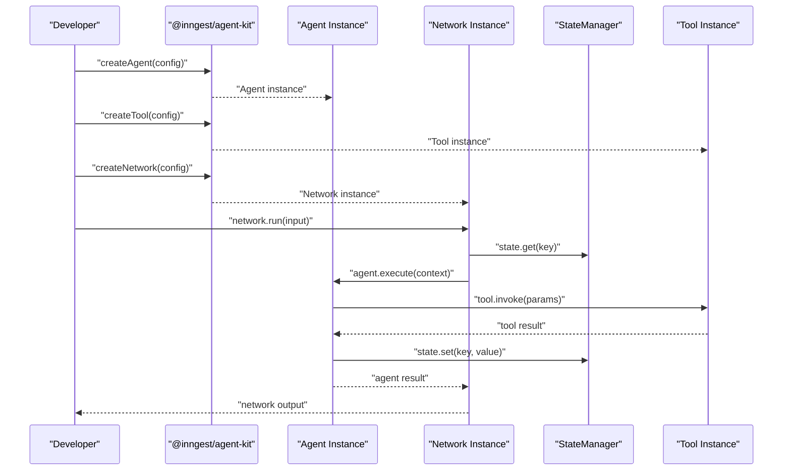

Sources: [packages/agent-kit/src/index.ts:1-9]()

## API Categories

| Category | Primary Exports | Purpose |
|----------|----------------|---------|
| **Agent Management** | `createAgent`, `AgentConfig` | Creating and configuring individual AI agents |
| **Network Orchestration** | `createNetwork`, `createServer`, `NetworkConfig` | Multi-agent coordination and execution |
| **State Management** | `StateStore`, `ConversationHistory`, `StateManager` | Persistent state and conversation tracking |
| **Tool Integration** | `createTool`, `ToolConfig` | External system integration and capabilities |
| **Model Adapters** | `ModelAdapter`, provider-specific adapters | AI model abstraction and normalization |
| **Type Definitions** | Interface and type exports | TypeScript support and configuration schemas |
| **Utilities** | Helper functions and validation | Common operations and development aids |

## Core Functions

### Agent Creation
The `createAgent` function is the primary entry point for defining individual AI agents:

```typescript
// Exported from ./agent module
createAgent(config: AgentConfig): Agent
```

### Network Creation  
The `createNetwork` function orchestrates multiple agents:

```typescript
// Exported from ./network module
createNetwork(config: NetworkConfig): Network
```

### Tool Creation
The `createTool` function defines external capabilities:

```typescript
// Exported from ./tool module  
createTool(config: ToolConfig): Tool
```

### Server Creation
The `createServer` function sets up HTTP endpoints:

```typescript
// Exported from ./network module
createServer(config: ServerConfig): Server
```

## Model Adapters

AgentKit provides standardized adapters for major AI providers:

| Provider | Adapter Export | Configuration |
|----------|---------------|---------------|
| OpenAI | `OpenAI` | API key, model selection |
| Anthropic | `Anthropic` | API key, model selection |
| Google Gemini | `Gemini` | API key, model selection |
| Grok | `Grok` | API key, model selection |

## State Management APIs

The state system provides persistent storage and conversation tracking:

| Component | Purpose | Key Methods |
|-----------|---------|-------------|
| `StateStore` | Key-value storage | `get()`, `set()`, `delete()` |
| `ConversationHistory` | Message tracking | `add()`, `get()`, `clear()` |
| `StateManager` | Unified interface | `state()`, `history()` |

## Type System

AgentKit exports comprehensive TypeScript types for configuration and runtime objects:

- **Configuration Types**: `AgentConfig`, `NetworkConfig`, `ToolConfig`
- **Runtime Types**: `Agent`, `Network`, `Tool`, `StateManager`
- **Function Types**: `RouterFunction`, `PromptFunction`, `ToolFunction`
- **Data Types**: `Message`, `Context`, `ExecutionResult`

## Utility Functions

The utilities module provides helper functions for common operations:

- **Prompt Helpers**: Template processing and dynamic prompt generation
- **Validation**: Configuration validation and type checking
- **Serialization**: State persistence and message formatting

## Detailed API Documentation

For comprehensive documentation of each API category, refer to the following pages:

- **[Agent API](#6.1)** - Complete agent creation and configuration reference
- **[Network API](#6.2)** - Network orchestration and routing documentation  
- **[State API](#6.3)** - State management and persistence methods
- **[Model Adapters API](#6.4)** - AI provider integration and configuration

Sources: [packages/agent-kit/src/index.ts:1-9]()

# Agent API


This document provides a comprehensive reference for creating, configuring, and managing individual agents in AgentKit. Agents are the core building blocks that handle specific tasks through AI model inference and tool execution.

For information about coordinating multiple agents, see [Network API](#6.2). For managing conversation history and shared data, see [State API](#6.3). For configuring AI models, see [Model Adapters API](#6.4).

## Agent Creation

### createAgent()

Creates a standard agent with specified configuration and capabilities.

```typescript
function createAgent<T extends StateData>(opts: Agent.Constructor<T>): Agent<T>
```

**Parameters:**
- `opts` - Agent configuration object containing name, system prompt, tools, and other options

**Returns:** An `Agent<T>` instance ready for execution

### createRoutingAgent()

Creates a specialized routing agent that includes routing lifecycle hooks for agent selection.

```typescript
function createRoutingAgent<T extends StateData>(opts: Agent.RoutingConstructor<T>): RoutingAgent<T>
```

**Parameters:**
- `opts` - Routing agent configuration extending base agent options with routing lifecycle

**Returns:** A `RoutingAgent<T>` instance with routing capabilities

Sources: [packages/agent-kit/src/agent.ts:33-38]()

## Agent Configuration

### Constructor Options

The `Agent.Constructor<T>` interface defines all configuration options for creating agents:

| Property | Type | Required | Description |
|----------|------|----------|-------------|
| `name` | `string` | Yes | Unique identifier for the agent |
| `description` | `string` | No | Human-readable description of agent's purpose |
| `system` | `string \| function` | Yes | System prompt or dynamic prompt function |
| `assistant` | `string` | No | Initial assistant message for completion |
| `tools` | `(Tool.Any \| InngestFunction.Any)[]` | No | Available tools for the agent |
| `tool_choice` | `Tool.Choice` | No | Tool selection strategy: "auto", "any", or specific tool name |
| `lifecycle` | `Lifecycle<T>` | No | Programmatic hooks for agent management |
| `model` | `AiAdapter.Any` | No | Specific AI model for this agent |
| `mcpServers` | `MCP.Server[]` | No | Model Context Protocol servers for additional tools |

**Agent Creation Flow Diagram**

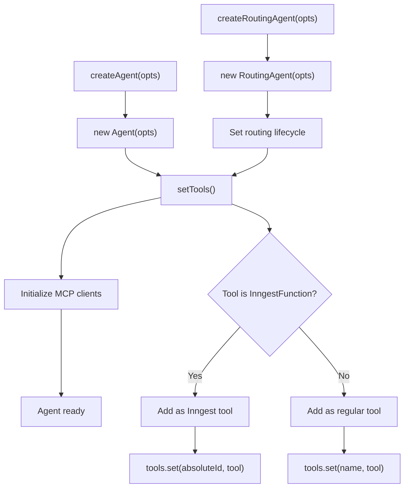

Sources: [packages/agent-kit/src/agent.ts:100-112](), [packages/agent-kit/src/agent.ts:534-546]()

## Agent Class

### Core Properties

**name**: `string`
- Unique identifier for the agent within the network

**description**: `string`  
- Human-readable description of the agent's capabilities and purpose

**system**: `string | ((ctx: { network?: NetworkRun<T> }) => MaybePromise<string>)`
- System prompt defining agent behavior, can be static string or dynamic function

**tools**: `Map<string, Tool.Any>`
- Collection of available tools keyed by tool name

**model**: `AiAdapter.Any | undefined`
- AI model adapter for this specific agent

Sources: [packages/agent-kit/src/agent.ts:44-95]()

### Core Methods

#### run()

Executes the agent with user input, handling the complete inference and tool execution cycle.

```typescript
async run(
  input: string, 
  options?: Agent.RunOptions<T>
): Promise<AgentResult>
```

**Parameters:**
- `input` - User message or empty string for system-only execution
- `options.model` - Override the agent's default model
- `options.network` - Network context for shared state
- `options.state` - Custom state for standalone execution  
- `options.maxIter` - Maximum tool execution iterations (default: 0)

**Returns:** `AgentResult` containing output messages and tool call results

#### withModel()

Creates a new agent instance with a different AI model while preserving all other configuration.

```typescript
withModel(model: AiAdapter.Any): Agent<T>
```

**Agent Execution Lifecycle Diagram**

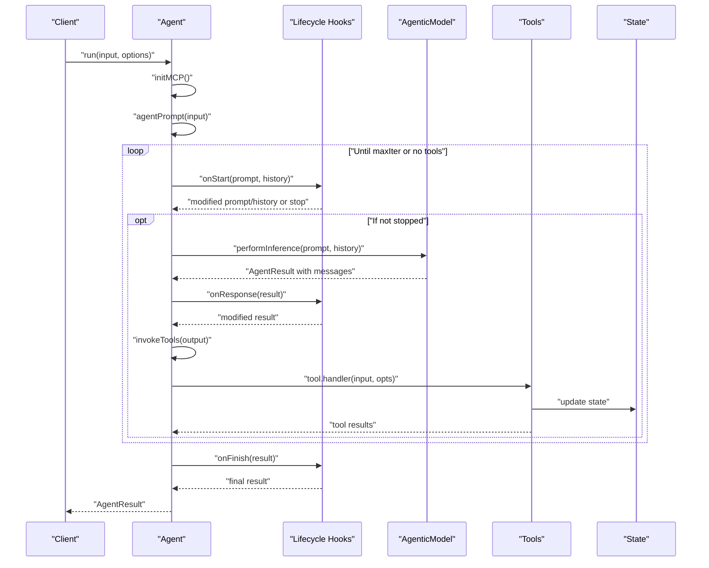

Sources: [packages/agent-kit/src/agent.ts:165-245](), [packages/agent-kit/src/agent.ts:247-286]()

## Lifecycle Hooks

The `Agent.Lifecycle<T>` interface provides programmatic control over agent execution phases:

### enabled()

Conditionally enables or disables the agent based on network state.

```typescript
enabled?: (args: Agent.LifecycleArgs.Base<T>) => MaybePromise<boolean>
```

### onStart()

Called before inference with the ability to modify prompt and history or stop execution.

```typescript
onStart?: (args: Agent.LifecycleArgs.Before<T>) => MaybePromise<{
  prompt: Message[];
  history: Message[];
  stop: boolean;
}>
```

### onResponse()

Called after inference but before tool execution, allowing response moderation.

```typescript
onResponse?: (args: Agent.LifecycleArgs.Result<T>) => MaybePromise<AgentResult>
```

### onFinish()

Called with the final result including tool outputs before saving to network history.

```typescript
onFinish?: (args: Agent.LifecycleArgs.Result<T>) => MaybePromise<AgentResult>
```

Sources: [packages/agent-kit/src/agent.ts:575-618]()

## Routing Agents

### RoutingAgent Class

Extends `Agent<T>` with routing-specific functionality for agent selection in networks.

**Additional Properties:**
- `type`: `"routing"` - Identifies this as a routing agent
- `lifecycles`: `Agent.RoutingLifecycle<T>` - Includes routing-specific hooks

### Routing Lifecycle

Extends base lifecycle with agent selection capability:

```typescript
interface RoutingLifecycle<T extends StateData> extends Lifecycle<T> {
  onRoute: RouterFn<T>;
}
```

**onRoute**: `RouterFn<T>`
- Function that returns array of agent names to execute next
- Called after routing agent inference to determine network flow

```typescript
type RouterFn<T extends StateData> = (
  args: Agent.RouterArgs<T>
) => string[] | undefined
```

Sources: [packages/agent-kit/src/agent.ts:512-531](), [packages/agent-kit/src/agent.ts:646-658]()

## Tool Integration

### Tool Assignment

Agents accept tools through the `tools` constructor option. Tools can be:

1. **Regular Tools**: Created with `createTool()` function
2. **Inngest Functions**: Serverless functions automatically converted to tools
3. **MCP Tools**: Dynamically loaded from Model Context Protocol servers

**Tool Integration Flow Diagram**

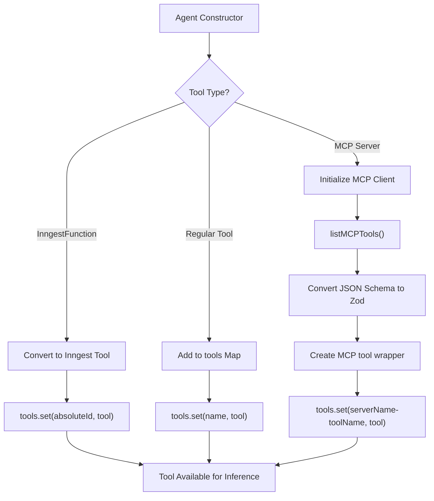

### Tool Execution

During inference, when the model requests tool calls:

1. Agent validates tool exists in `tools` Map
2. Calls `tool.handler(input, options)` with parsed arguments
3. Wraps result in `ToolResultMessage` for conversation history
4. Handles errors gracefully with serialized error information

Sources: [packages/agent-kit/src/agent.ts:114-147](), [packages/agent-kit/src/agent.ts:292-359](), [packages/agent-kit/src/agent.ts:395-459]()

## MCP Integration

### MCP Server Configuration

Agents can connect to Model Context Protocol servers to access external tools:

```typescript
type MCP.Server = {
  name: string;
  transport: TransportSSE | TransportWebsocket | TransportStreamableHttp;
}
```

### MCP Tool Discovery

1. **Initialization**: `initMCP()` establishes connections to configured servers
2. **Tool Listing**: `listMCPTools()` requests available tools from each server  
3. **Schema Conversion**: JSON Schema converted to Zod types for validation
4. **Tool Registration**: MCP tools added to agent's tool map with server namespace

### MCP Tool Execution

MCP tools are wrapped to:
- Call the remote MCP server via `client.callTool()`
- Handle step execution in Inngest contexts
- Return tool content in standardized format

Sources: [packages/agent-kit/src/agent.ts:395-509]()

## Type Definitions

### Agent.RunOptions<T>

Configuration for individual agent execution:

```typescript
interface RunOptions<T extends StateData> {
  model?: AiAdapter.Any;      // Override agent's model
  network?: NetworkRun<T>;    // Network context  
  state?: State<T>;           // Custom state for standalone use
  maxIter?: number;           // Maximum tool iterations
}
```

### Agent.LifecycleArgs

Argument types for lifecycle hooks:

- `Base<T>`: Contains `agent` and optional `network`
- `Result<T>`: Extends `Base<T>` with `result: AgentResult`  
- `Before<T>`: Extends `Base<T>` with `input`, `prompt`, and `history`

Sources: [packages/agent-kit/src/agent.ts:563-574](), [packages/agent-kit/src/agent.ts:620-644]()