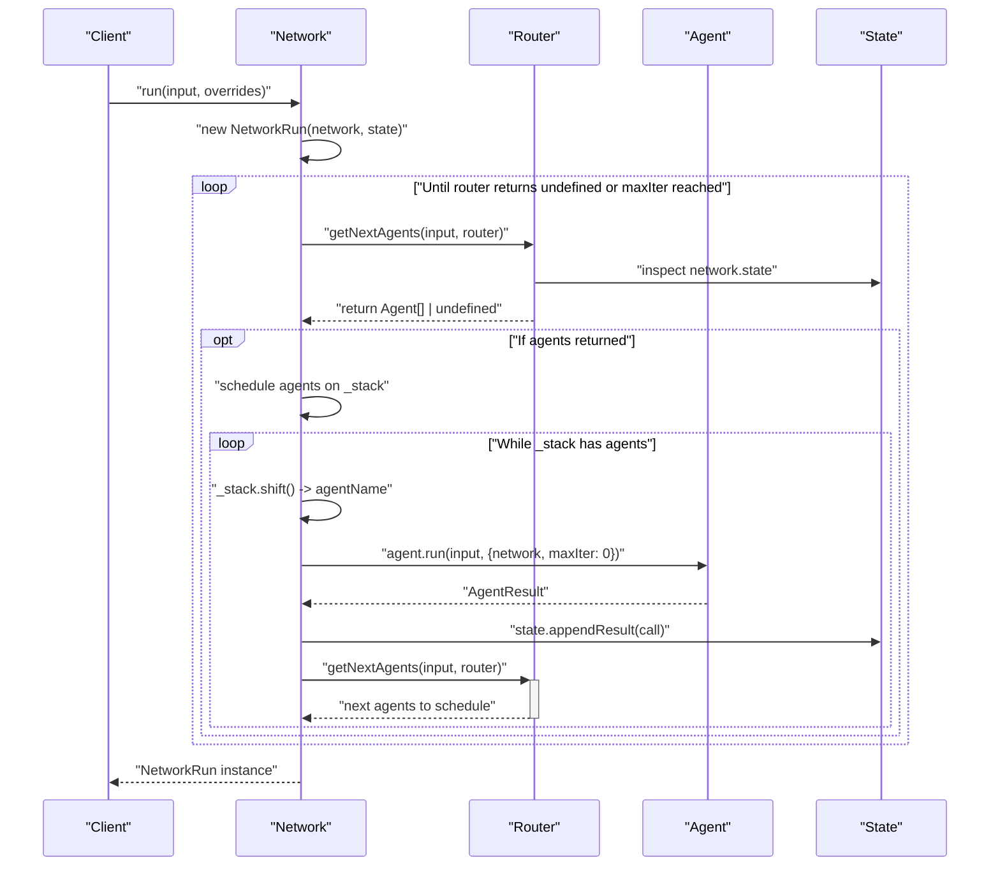
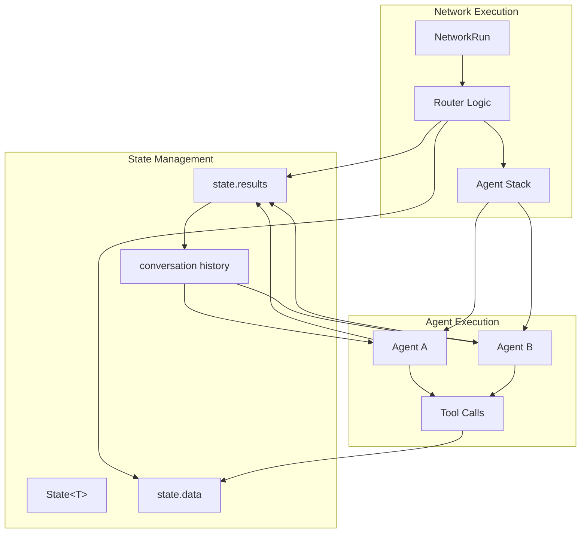

This document provides comprehensive reference documentation for AgentKit's Network API, which enables the creation and orchestration of multi-agent systems. The Network API handles agent coordination, routing logic, shared state management, and execution flow control.

For information about individual agent configuration, see [Agent API](#6.1). For state management details, see [State API](#6.3).

## Core Network Creation

### `createNetwork<T>` Function

The `createNetwork` function is the primary entry point for creating agent networks. It accepts a configuration object and returns a `Network` instance.

```typescript
const createNetwork = <T extends StateData>(
  opts: Network.Constructor<T>
) => new Network(opts);
```

**Sources:** [packages/agent-kit/src/network.ts:12-14]()

### Network Constructor Interface

The `Network.Constructor<T>` interface defines the configuration options for network creation:

| Property | Type | Required | Description |
|----------|------|----------|-------------|
| `name` | `string` | Yes | Network identifier |
| `description` | `string` | No | Network description |
| `agents` | `Agent<T>[]` | Yes | Array of agents in the network |
| `defaultModel` | `AiAdapter.Any` | No | Default AI model for agents |
| `maxIter` | `number` | No | Maximum iteration limit |
| `defaultState` | `State<T>` | No | Initial network state |
| `router` | `Router<T>` | No | Custom routing logic |
| `defaultRouter` | `Router<T>` | No | Fallback routing logic |

**Sources:** [packages/agent-kit/src/network.ts:251-262]()

## Network Class Architecture

```mermaid
classDiagram
    class Network {
        +String name
        +String description
        +Map~String,Agent~ agents
        +State~T~ state
        +AiAdapter defaultModel
        +Router~T~ router
        +Number maxIter
        -Map~String,Agent~ _agents
        -String[] _stack
        -Number _counter
        +constructor(opts)
        +addAgent(agent)
        +run(input, overrides) NetworkRun
        +availableAgents() Agent[]
    }
    
    class NetworkRun {
        +schedule(agentName)
        +availableAgents() Agent[]
        -execute(input, overrides) NetworkRun
        -getNextAgents(input, router) Agent[]
        -getNextAgentsViaRoutingAgent(routingAgent, input) Agent[]
    }
    
    class State {
        +T data
        +AgentResult[] results
        +appendResult(call)
        +formatHistory(formatter) Message[]
        +clone() State
    }
    
    class Router {
        <<interface>>
    }
    
    class RoutingAgent {
        +lifecycles
        +onRoute()
    }
    
    Network ||--o| State : "manages state"
    Network ||--o| Router : "uses router"
    NetworkRun --|> Network : "extends"
    Router <|.. RoutingAgent : "implements"
```

**Sources:** [packages/agent-kit/src/network.ts:19-138](), [packages/agent-kit/src/network.ts:332-511]()

## Router System

The Network API supports two types of routers for agent coordination:

### Function Routers

Function routers use deterministic code logic to select the next agent:

```typescript
type FnRouter<T extends StateData> = (
  args: Router.Args<T>
) => MaybePromise<RoutingAgent<T> | Agent<T> | Agent<T>[] | undefined>;
```

**Router Arguments:**

| Property | Type | Description |
|----------|------|-------------|
| `input` | `string` | Original network input |
| `network` | `NetworkRun<T>` | Current network instance |
| `stack` | `Agent<T>[]` | Pending agents queue |
| `callCount` | `number` | Current iteration count |
| `lastResult` | `AgentResult` | Previous agent result |

**Sources:** [packages/agent-kit/src/network.ts:296-329]()

### Routing Agents

Routing Agents use AI inference to select the next agent. The default routing agent is created automatically when no router is specified:

```typescript
const getDefaultRoutingAgent = () => {
  defaultRoutingAgent ??= createRoutingAgent({
    name: "Default routing agent",
    description: "Selects which agents to work on based off of the current prompt and input.",
    tools: [selectAgentTool],
    system: async ({ network }) => { /* agent selection prompt */ }
  });
}
```

**Sources:** [packages/agent-kit/src/network.ts:150-248]()

## Network Execution Flow



**Sources:** [packages/agent-kit/src/network.ts:362-432]()

## NetworkRun Class

The `NetworkRun` class extends `Network` and represents an active execution instance:

### Key Methods

#### `schedule(agentName: string)`
Adds an agent to the execution queue.

**Sources:** [packages/agent-kit/src/network.ts:358-360]()

#### `availableAgents(): Promise<Agent<T>[]>`
Returns agents that are currently enabled based on their lifecycle hooks.

**Sources:** [packages/agent-kit/src/network.ts:351-353]()

### Execution Control

The network execution is controlled by several factors:

- **Stack Management**: Agents are queued in `_stack` and executed sequentially
- **Iteration Limits**: `maxIter` prevents infinite loops
- **Router Logic**: Determines when to continue or terminate execution
- **Agent Availability**: Lifecycle hooks can disable agents dynamically

**Sources:** [packages/agent-kit/src/network.ts:387-431]()

## State Integration

Networks tightly integrate with the State system for shared data and conversation history:



**Sources:** [packages/agent-kit/src/network.ts:408-413](), [packages/agent-kit/src/state.ts:36-96]()

## Network Configuration Examples

### Basic Network with Function Router

```typescript
// State interface
interface AgentState {
  plan?: PlanData;
  done: boolean;
}

// Network creation
const network = createNetwork<AgentState>({
  name: "Code writing network",
  agents: [planningAgent, editingAgent],
  defaultModel: anthropic({ model: "claude-3-5-haiku-latest" }),
  defaultRouter: ({ network }) => {
    if (network.state.data.done) {
      return; // Terminate execution
    }
    if (!network.state.data.plan) {
      return planningAgent; // Start with planning
    }
    return editingAgent; // Execute the plan
  }
});
```

**Sources:** [examples/swebench/networks/codeWritingNetwork.ts:32-67]()

### Network with AI Router

```typescript
const network = createNetwork({
  name: "Support Network",
  agents: [classificationAgent, supportAgent, escalationAgent],
  defaultModel: openai({ model: "gpt-4" }),
  // No router specified - uses default AI routing agent
});
```

**Sources:** [packages/agent-kit/src/network.ts:444-451]()

## Run Method and Overrides

The `run` method executes the network with optional configuration overrides:

```typescript
public run(
  input: string,
  overrides?: {
    router?: Router<T>;
    defaultRouter?: Router<T>;
    state?: State<T> | Record<string, any>;
  }
): Promise<NetworkRun<T>>
```

### State Handling

The network handles state initialization in the following priority:
1. `overrides.state` - Runtime state override
2. `network.state` - Network's default state
3. New empty state - Created automatically

**Sources:** [packages/agent-kit/src/network.ts:123-138]()

## Error Handling and Constraints

### Agent Availability

Networks check agent availability through lifecycle hooks before execution:

```typescript
async availableAgents(): Promise<Agent<T>[]> {
  const available: Agent<T>[] = [];
  for (const a of this.agents.values()) {
    const enabled = a?.lifecycles?.enabled;
    if (!enabled || await enabled({ agent: a, network: this })) {
      available.push(a);
    }
  }
  return available;
}
```

**Sources:** [packages/agent-kit/src/network.ts:96-108]()

### Execution Constraints

- **No Available Agents**: Throws error if no agents are enabled
- **Missing Router**: Requires router or default model for AI routing
- **Iteration Limits**: Prevents infinite loops with `maxIter`
- **Invalid Agents**: Validates agent references in router responses

**Sources:** [packages/agent-kit/src/network.ts:365-368](), [packages/agent-kit/src/network.ts:444-448]()