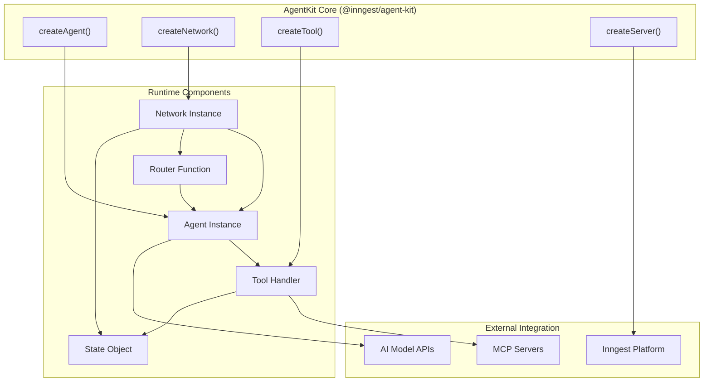
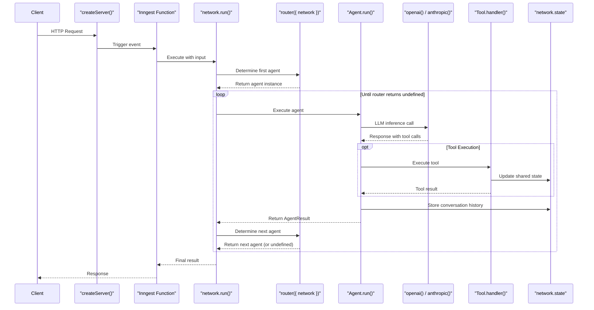
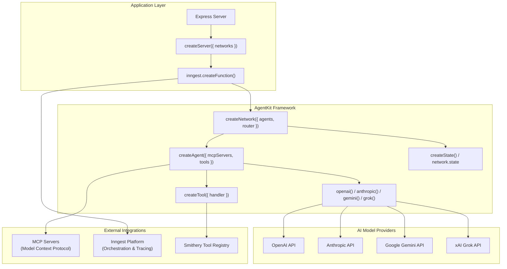
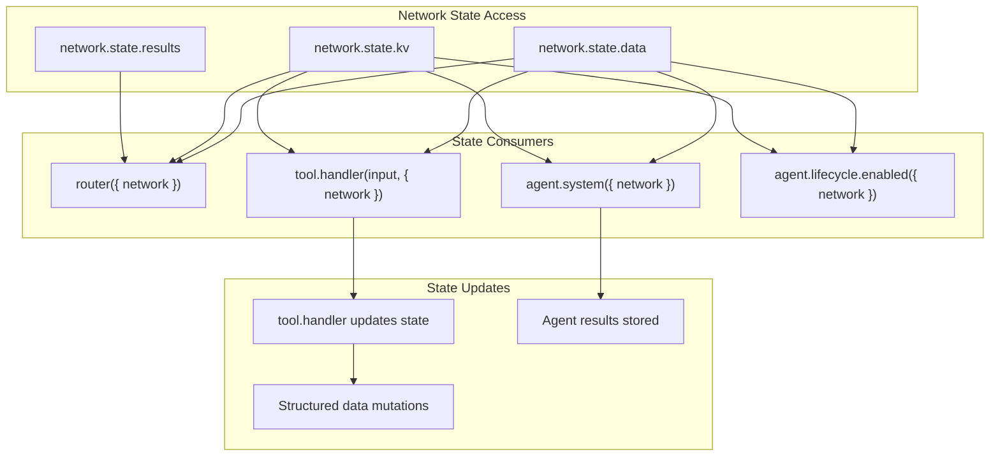
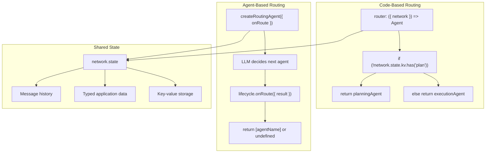
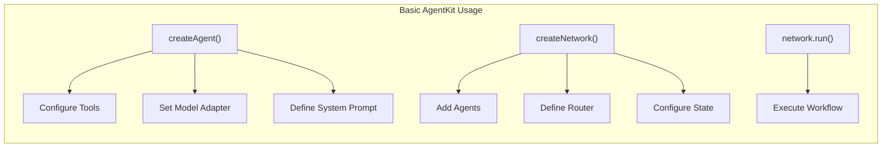

AgentKit is a TypeScript framework for creating and orchestrating AI agents and AI workflows. Built with orchestration at its core, AgentKit enables developers to build, test, and deploy reliable multi-agent AI applications at scale. The framework integrates seamlessly with Inngest for serverless orchestration, providing fault-tolerant execution and local development tools with built-in tracing.

## What is AgentKit?

AgentKit provides simple and composable primitives to build everything from basic support agents to complex multi-agent systems. It supports multiple AI model providers including OpenAI, Anthropic, Gemini, and Grok, while offering powerful tool-building APIs with support for the Model Context Protocol (MCP).

Key capabilities include:

- **Multi-agent orchestration** with deterministic routing and shared state
- **Inngest integration** for serverless orchestration and fault-tolerant execution  
- **Tool ecosystem** with MCP support and external service integrations
- **Local development** with live tracing and input/output logs via Inngest Dev Server
- **Flexible routing** from code-based to fully autonomous agent-based routing

This overview covers the framework's fundamental architecture and components. For detailed installation instructions, see [Installation and Setup](#1.1). For in-depth exploration of core concepts, see [Core Concepts](#2).

Sources: [packages/agent-kit/package.json:2-4](), [docs/overview.mdx:8-22](), [README.md:1-16]()

## Core Architecture

**AgentKit Framework Components**

AgentKit is built around several key components that work together to enable flexible AI agent applications:

Sources: [packages/agent-kit/package.json:36-52](), [README.md:15-24](), [docs/overview.mdx:53-65]()

### Key Components

Each component in the AgentKit framework serves a specific purpose:

| Component | Description |
|-----------|-------------|
| Agents | Core building blocks that use LLMs to perform tasks |
| Networks | Orchestrate multiple agents through defined workflows |
| State | Manages shared context and memory across agent interactions |
| Routers | Determine which agent to run next based on state and rules |
| Tools | Enable agents to perform actions and access external systems |
| Model Adapters | Connect to different LLM providers (OpenAI, Anthropic, etc.) |

Sources: [README.md:15-24](), [docs/overview.mdx:10-20]()

## AgentKit with Inngest Integration

**Network Execution Flow**

The following diagram illustrates how AgentKit components interact during execution, including Inngest integration:

Sources: [README.md:96-105](), [examples/demo/inngest.ts:21-38](), [README.md:111-146]()

## AgentKit Ecosystem Integration

**Technology Stack and Service Integration**

This diagram shows how AgentKit integrates with external services and AI providers:

Sources: [README.md:33-105](), [packages/agent-kit/package.json:54-63](), [README.md:96-105]()

## State-Based Routing Architecture

**Deterministic Routing with Shared State**

AgentKit provides deterministic routing through state-based coordination between network components:

Sources: [README.md:111-146](), [docs/reference/state.mdx:1-113](), [README.md:147-298]()

## Multi-Agent Coordination Patterns

**Code-Based vs Agent-Based Routing**

AgentKit supports multiple coordination patterns for different use cases:

Sources: [README.md:142-296](), [README.md:297-497]()

## Routing Mechanisms

AgentKit supports different routing strategies to control agent execution flow:

| Routing Type | Description | Use Case |
|--------------|-------------|----------|
| Code-based Routing | Uses programmatic logic to determine next agent | Precise control over agent flow |
| Agent-based Routing | Uses an AI agent to decide the next step | More autonomous, flexible workflows |
| State-based Routing | Routes based on the current state | Reactive workflows that adapt to context |

Sources: [README.md:111-146](), [README.md:147-497]()

## Basic Usage Example

Here's a simplified view of how the core components are used together:

Sources: [README.md:80-105](), [docs/overview.mdx:78-118]()

## Supported Model Providers

AgentKit supports multiple LLM providers through its model adapter system:

| Provider | Models | Integration Method |
|----------|--------|-------------------|
| OpenAI | GPT-3.5, GPT-4o, etc. | `openai()` adapter |
| Anthropic | Claude 3 Opus, Sonnet, Haiku | `anthropic()` adapter |
| Google | Gemini | `gemini()` adapter |
| xAI | Grok | `grok()` adapter |

Sources: [README.md:80-105](), [packages/agent-kit/CHANGELOG.md:48-50]()

## Current Version and Status

AgentKit is currently at version 0.8.0, with recent updates including StreamableHttp support in MCP Client and improved concurrent server handling. The framework continues active development with focus on expanding model provider support, improving MCP integration, and enhancing the developer experience.

Recent additions include support for Gemini and Grok models, typed state management, and enhanced tool integration capabilities.

Sources: [packages/agent-kit/package.json:3](), [packages/agent-kit/CHANGELOG.md:3-12]()

For more information on how to get started with AgentKit, please see the [Quick Start Guide](#3.1). For detailed explanation of the core concepts, refer to the pages on [Agents](#2.1), [Networks](#2.2), [State Management](#2.3), [Routers](#2.4), [Tools](#2.5), and [Model Adapters](#2.6).