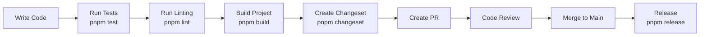
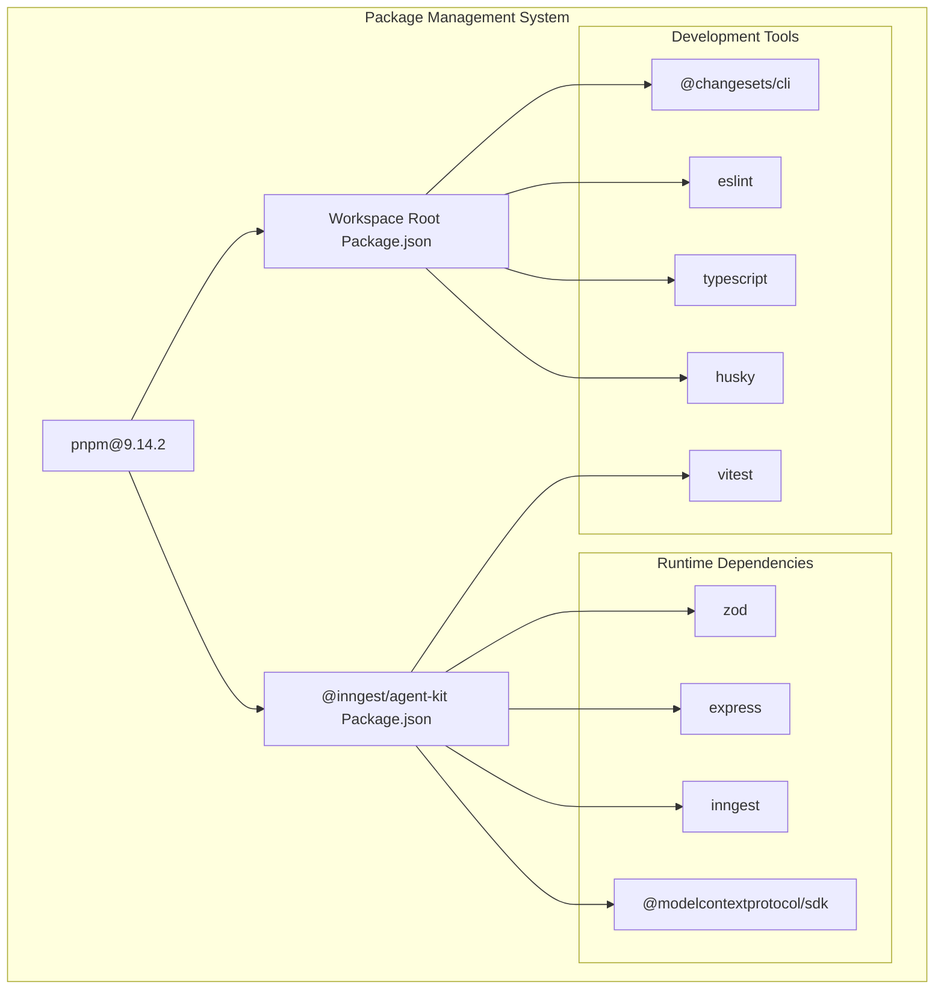
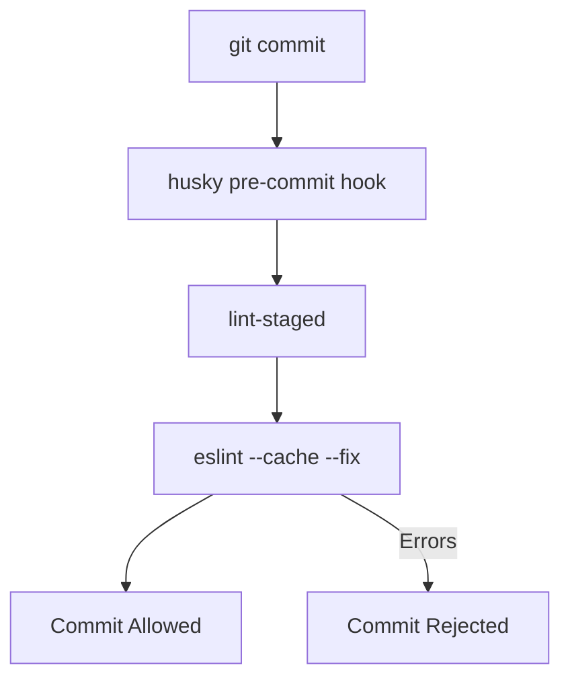
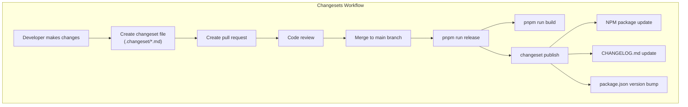
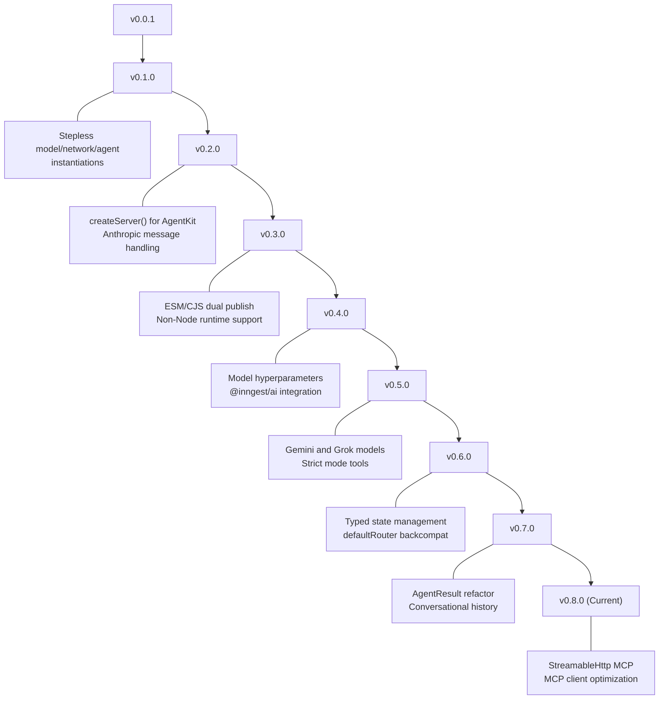
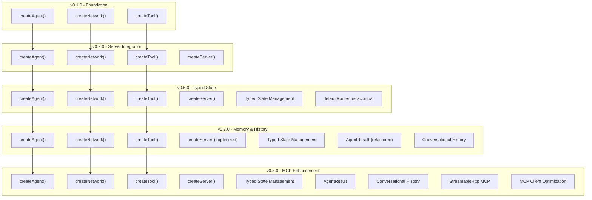
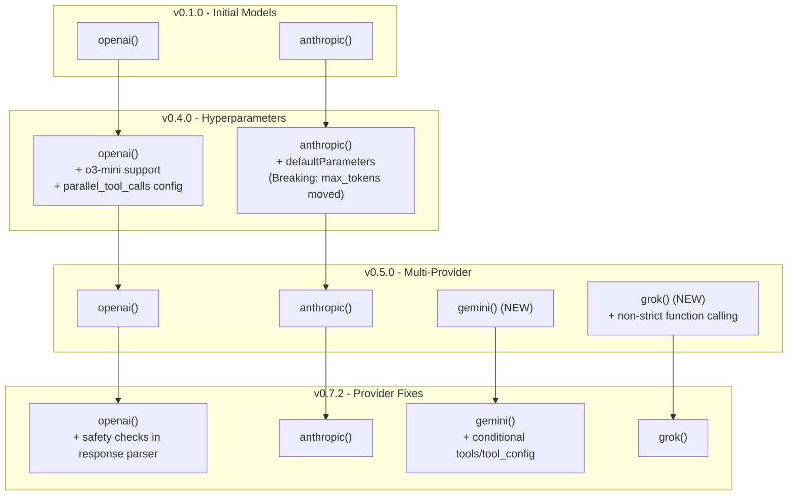
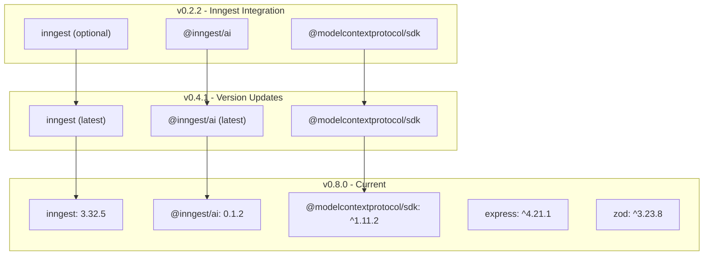
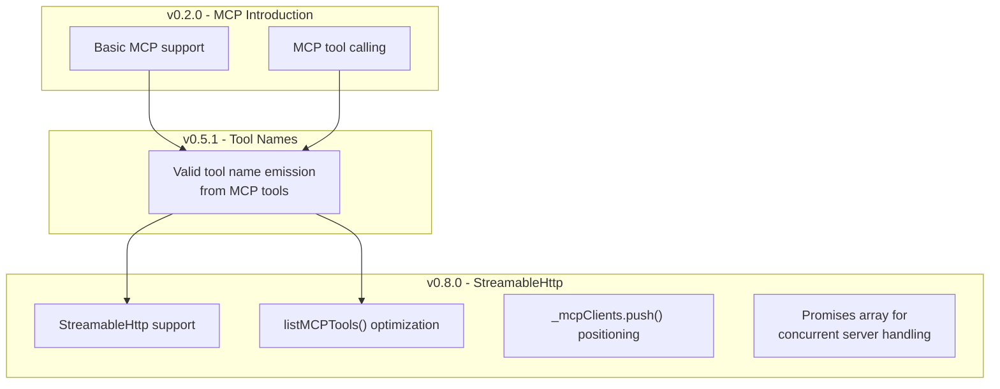
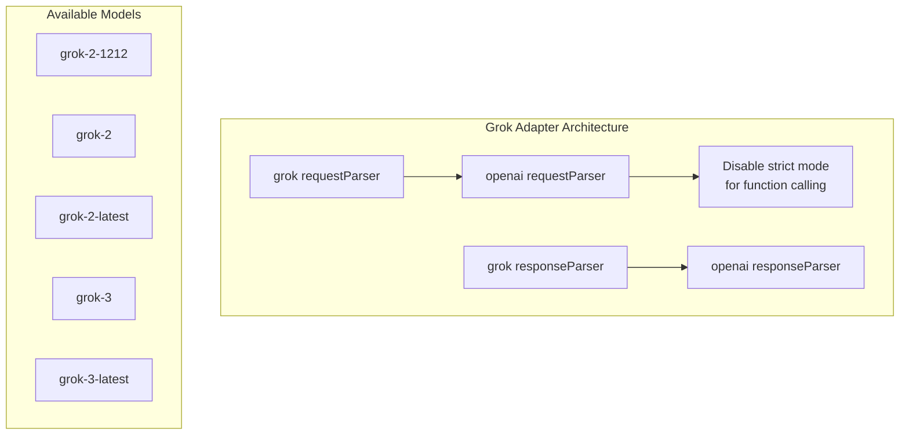

This document provides instructions for setting up the AgentKit repository for development purposes. It covers the prerequisites, installation steps, repository structure, and development workflow for contributing to the project. For information on using AgentKit in your own projects, see [Installation and Setup](#1.1).

## Prerequisites

Before setting up the repository, ensure you have the following tools installed:

| Tool     | Version                 | Purpose                          |
|----------|-------------------------|----------------------------------|
| Node.js  | 18+ (recommended)       | JavaScript runtime               |
| pnpm     | 9.14.2+ (recommended)   | Package manager                  |
| Git      | Latest                  | Version control                  |

The repository specifically uses pnpm as its package manager, as specified in the root package.json.

Sources: [package.json:31]()

## Repository Structure

AgentKit is organized as a monorepo using pnpm workspaces. This structure allows for managing multiple packages within a single repository.

```mermaid
graph TD
    subgraph "Repository Root"
        Root["agent-kit (root)"]
        Config["Configuration Files
        - package.json
        - pnpm-lock.yaml
        - .eslintrc.js
        - etc."]
        
        subgraph "packages/"
            AgentKit["@inngest/agent-kit
            Main package with core functionality"]
        end
        
        subgraph "Examples"
            Examples["Example applications 
            showing AgentKit usage"]
        end
    end
    
    Root --> Config
    Root --> AgentKit
    Root --> Examples
```

The repository contains:
- Root configuration files for development tools
- The main `@inngest/agent-kit` package in the `packages/` directory
- Example applications demonstrating AgentKit usage

Sources: [package.json:1-32](), [packages/agent-kit/package.json:1-77]()

## Installation Steps

Follow these steps to set up the repository for development:

1. Clone the repository:
   ```bash
   git clone https://github.com/inngest/agent-kit.git
   cd agent-kit
   ```

2. Install dependencies:
   ```bash
   pnpm install
   ```

3. Set up Git hooks (automatically installed during `pnpm install`):
   The project uses Husky for Git hooks to ensure code quality before commits.

Sources: [package.json:2-8](), [packages/agent-kit/package.json:7-14]()

## Development Workflow

The following diagram illustrates the development workflow for AgentKit:



### Running Tests

Tests are run using Vitest:

```bash
pnpm test
```

This command runs tests for all packages in the repository.

Sources: [packages/agent-kit/package.json:8](), [package.json:4]()

### Building the Project

To build all packages:

```bash
pnpm build
```

This runs TypeScript compilation and bundles the code using tsup.

Sources: [packages/agent-kit/package.json:10](), [package.json:5]()

### Linting

To lint the codebase:

```bash
pnpm lint
```

The project uses ESLint with TypeScript support and Prettier integration for code formatting.

Sources: [packages/agent-kit/package.json:11](), [package.json:3]()

### Development Scripts

The following development scripts are available:

| Script                 | Purpose                                     |
|------------------------|--------------------------------------------|
| `pnpm test`            | Run tests in all packages                   |
| `pnpm build`           | Build all packages                          |
| `pnpm lint`            | Run ESLint on the codebase                  |
| `pnpm changeset`       | Create a changeset for versioning           |
| `pnpm version`         | Update package versions based on changesets |
| `pnpm release`         | Build and publish packages                  |

For local development, you can use the dev script in the agent-kit package:

```bash
cd packages/agent-kit
pnpm dev
```

Sources: [packages/agent-kit/package.json:7-14](), [package.json:2-8]()

## Package Management

AgentKit uses pnpm for dependency management, with a specific version pinned in the package.json:



The dependencies are managed through two main package.json files:
- Root `package.json` - Contains development dependencies for the entire repository
- `packages/agent-kit/package.json` - Contains both development and runtime dependencies for the AgentKit package

Sources: [package.json:9-30](), [packages/agent-kit/package.json:54-75]()

## Release Process

The project uses Changesets for versioning and publishing packages. Here's the release workflow:

1. Create a changeset for your changes:
   ```bash
   pnpm changeset
   ```
   This will prompt you to describe your changes and select a version bump type (patch, minor, major).

2. Commit the changeset file to your branch.

3. Once changes are merged to the main branch, update versions:
   ```bash
   pnpm version
   ```
   This updates package versions based on the changesets.

4. Release the packages:
   ```bash
   pnpm release
   ```
   This command builds the packages and publishes them to npm.

The CHANGELOG.md in the agent-kit package shows the versioning history.

Sources: [packages/agent-kit/package.json:12](), [package.json:6-7](), [packages/agent-kit/CHANGELOG.md:1-152]()

## Git Hooks and Quality Control

The repository uses several tools to maintain code quality:

- **Husky**: Sets up Git hooks to run quality checks before commits
- **lint-staged**: Runs linters only on staged files
- **ESLint and Prettier**: Enforces code style and formatting standards

These tools work together to ensure that all committed code meets the project's quality standards.



Sources: [package.json:18-21](), [package.json:22-30]()

# Changelog


This page documents the version history of AgentKit, providing a chronological record of all releases, including new features, fixes, and breaking changes. For information about contributing to AgentKit development, see [Repository Setup](#7.1).

## Current Version

AgentKit is currently at version **0.8.0**, which includes support for StreamableHttp in MCP Client and various stability improvements.

Sources: [packages/agent-kit/package.json:3]()

## Changelog Management

AgentKit uses the Changesets tool to manage changelog entries and version releases. The configuration allows for automatic changelog generation and semantic versioning based on change types.



The changeset configuration uses the default changelog format and publishes to NPM with public access. Version snapshots use calculated versions with datetime and commit hash templates.

Sources: [.changeset/config.json:1-15](), [packages/agent-kit/package.json:12]()

## Version History

### v0.8.0 (Latest)
**Minor Changes**
- Added support for StreamableHttp in MCP Client

**Patch Changes**
- Removed redundant call to `this.listMCPTools(server)` as we are now using a promises array to handle multiple servers concurrently
- Fixed conditional in MCP client initialization and moved `this._mcpClients.push(client)` to the beginning of `listMCPTools` method to prevent duplicate clients from being registered

### v0.7.3
**Patch Changes**
- Export types from `index.ts`
- Improved type exports for better TypeScript integration

### v0.7.2
**Patch Changes**
- Add safety checks to OpenAI response parser
- Fix Gemini: do not send `tools` and `tool_config` if no tools are provided

### v0.7.1
**Patch Changes**
- Optimize parallelism in `createServer()`, removing risk of parallel indexing

### v0.7.0
**Minor Changes**
- Refactor `AgentResult`, and allow conversational history + short term memory

### v0.6.0
**Minor Changes**
- Implement typed state management

**Patch Changes**
- Document typed state, re-add KV for backcompat
- Fix network: add back-compat for `defaultRouter`

### v0.5.1
**Patch Changes**
- Fix MCP: emit valid tool name from MCP tools

### v0.5.0
**Minor Changes**
- Gemini and Grok support

**Patch Changes**
- Fix tools: better support for strict mode + option to opt-out

### v0.4.1
**Patch Changes**
- Update `inngest` and `@inngest/ai` to latest versions

### v0.4.0
**Minor Changes**
- Bump `@inngest/ai` for model hyper params support
- **Breaking change**: `anthropic()` `max_tokens` option has been moved to `defaultParameters`

**Patch Changes**
- Fix models: avoid `parallel_tool_calls` for o3-mini

### v0.3.1
**Patch Changes**
- Dual publish ESM and CJS

### v0.3.0
**Minor Changes**
- Fix `index.ts`: remove `server` export to allow non-Node runtimes

**Patch Changes**
- Fix OpenAI: tools with no parameters
- Fix models: handle error responses

### v0.2.2
**Patch Changes**
- Resolve being unable to find async ctx when using with `inngest`
- Use `@inngest/ai` and only optionally use step tooling
- Allow specifying Inngest functions as tools
- Shift to pnpm workspace packages; fix linting

### v0.2.1
**Patch Changes**
- Fix OpenAI adapter: safely parse non-strong tool return value for Function calling

### v0.2.0
**Minor Changes**
- Add basic AgentKit server to serve agents and networks as Inngest functions for easy testing
- Fix Anthropic model: ensure that the last message isn't an assistant one

**Patch Changes**
- Update description for npm

### v0.1.2
**Patch Changes**
- Ensure tools mutate state, not a clone

### v0.1.1
**Patch Changes**
- Network state flow to agents

### v0.1.0
**Minor Changes**
- Stepless model/network/agent instantiations

### v0.0.3
**Patch Changes**
- Fix README links and code examples
- Fix tool usage failing with OpenAI requests

### v0.0.2
**Patch Changes**
- Fix GitHub link and add `README.md`

### v0.0.1
**Patch Changes**
- Initial release!

Sources: [packages/agent-kit/CHANGELOG.md:1-164]()

## Feature Evolution Timeline

The following diagram shows the progression of AgentKit versions and key architectural developments:



Sources: [packages/agent-kit/CHANGELOG.md:3-164]()

## Core System Evolution

This diagram shows how core AgentKit systems have evolved across major versions:



Sources: [packages/agent-kit/CHANGELOG.md:122-126](), [packages/agent-kit/CHANGELOG.md:43-50](), [packages/agent-kit/CHANGELOG.md:33-34](), [packages/agent-kit/CHANGELOG.md:7-13]()

## Model Support Evolution

The following diagram shows how AI model support has evolved across AgentKit versions:



Sources: [packages/agent-kit/CHANGELOG.md:62-67](), [packages/agent-kit/CHANGELOG.md:76-84](), [packages/agent-kit/CHANGELOG.md:24-27](), [packages/agent-kit/src/adapters/grok.ts:32-41]()

## Package Dependencies Evolution

This diagram shows key dependency changes across versions:



Sources: [packages/agent-kit/package.json:54-63](), [packages/agent-kit/CHANGELOG.md:72](), [packages/agent-kit/CHANGELOG.md:106-109]()

## MCP Integration Timeline

The Model Context Protocol (MCP) integration has been a major focus throughout AgentKit's development:



The latest MCP enhancements in v0.8.0 focus on performance and reliability improvements, including better handling of multiple MCP servers concurrently and StreamableHttp transport support.

Sources: [packages/agent-kit/CHANGELOG.md:7-13](), [packages/agent-kit/CHANGELOG.md:55-57]()

## Grok Model Adapter Implementation

AgentKit's Grok support leverages the OpenAI-compatible API with specific adaptations:



The Grok adapter inherits OpenAI's request and response parsing but modifies tool definitions to set `strict: false` because Grok models do not support strict mode function calling.

Sources: [packages/agent-kit/src/adapters/grok.ts:19-42](), [packages/agent-kit/src/adapters/grok.ts:47-48]()

## Breaking Changes

Throughout the version history, these breaking changes have been introduced:

| Version | Breaking Change | Migration Path |
|---------|----------------|----------------|
| v0.4.0 | Moved Anthropic's `max_tokens` option to `defaultParameters` | Update Anthropic model configuration to use `defaultParameters.max_tokens` instead of the top-level `max_tokens` option |
| v0.3.0 | Removed `server` export | If you were using the `server` export, import server-related functionality from other modules |

Sources: [docs/changelog/overview.mdx:12-14](), [docs/changelog/overview.mdx:19-21]()