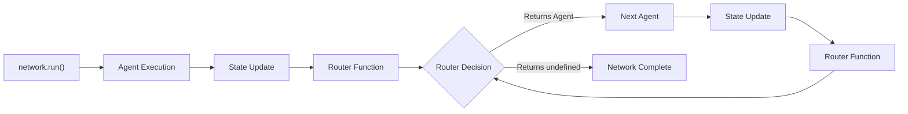
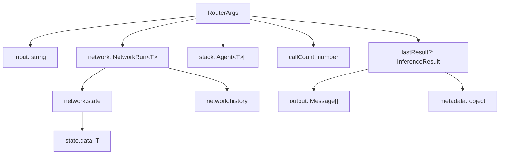
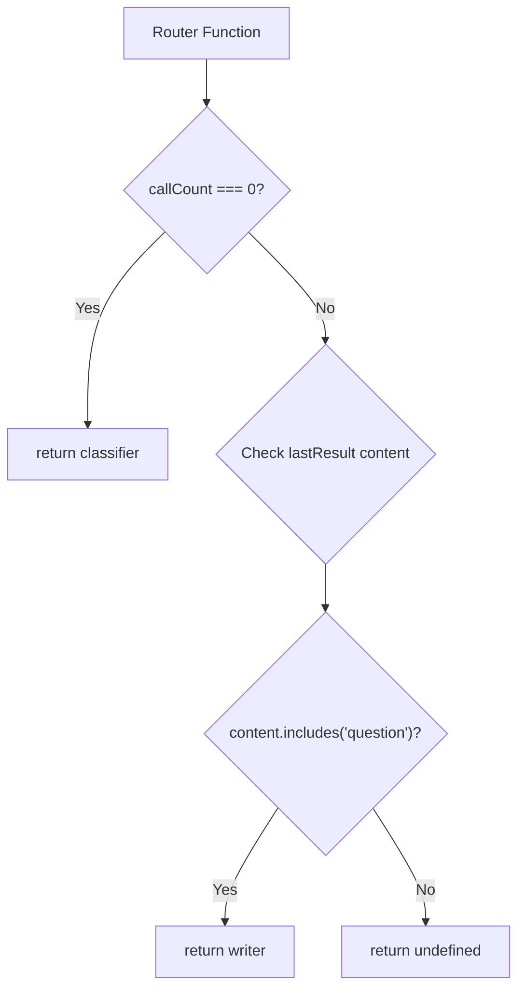
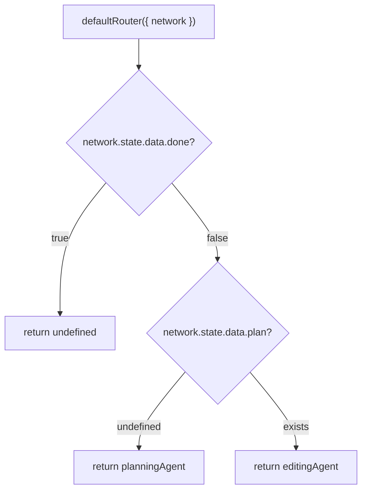
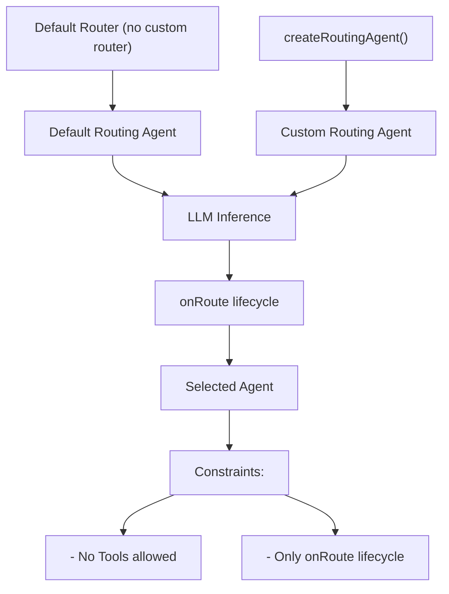
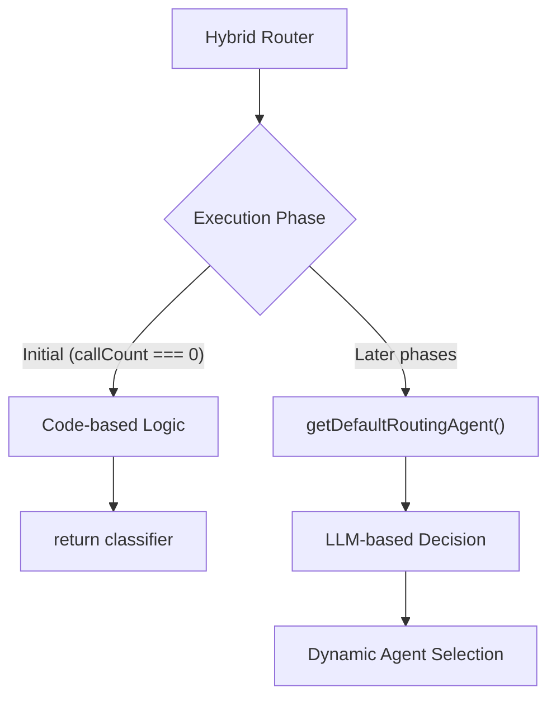
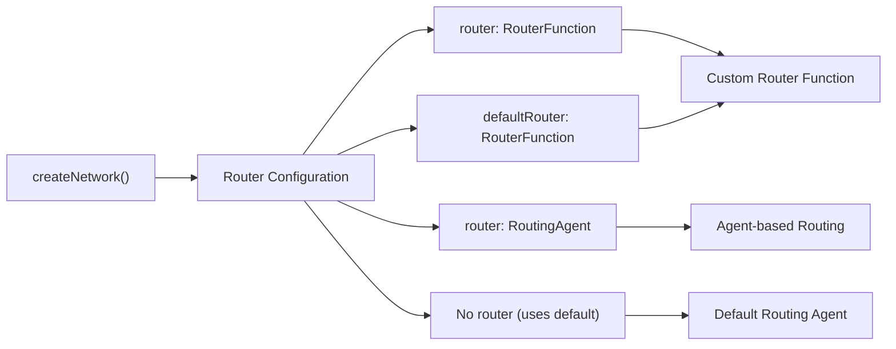
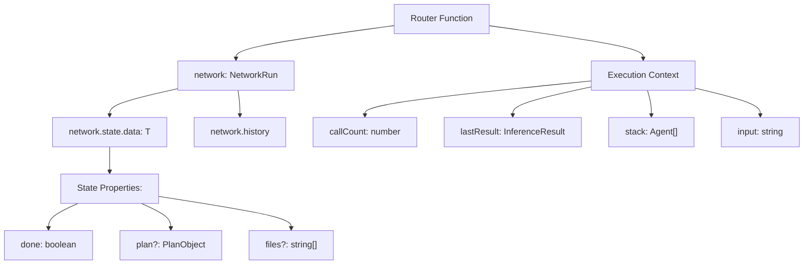

Routers control the execution flow in multi-agent networks by determining which agent runs next based on current state. This document covers router concepts, implementation patterns, and configuration within AgentKit networks.

For information about network orchestration and agent coordination, see [Networks](#2.2). For details about the state system that routers inspect, see [State Management](#2.3). For advanced routing patterns and sophisticated workflows, see [Human-in-the-Loop](#5.1).

## Router Purpose and Function

A router is a function that executes after each agent completes, deciding whether to continue the network execution loop or terminate it. Routers inspect network state, conversation history, and execution context to make routing decisions.

The router function returns either:
- An `Agent` instance to execute next
- `undefined` to stop the network execution loop

**Router Execution Flow**


Sources: [docs/concepts/routers.mdx:8-25](), [docs/advanced-patterns/routing.mdx:10-17]()

## Router Function Interface

The router function receives a `RouterArgs` object containing execution context and returns an optional `Agent`.

**RouterArgs Interface Structure**


The router function signature:
```typescript
type RouterFunction<T> = (args: {
  input: string;
  network: NetworkRun<T>;
  stack: Agent<T>[];
  callCount: number;
  lastResult?: InferenceResult;
}) => Promise<Agent<T> | undefined>;
```

Sources: [docs/concepts/routers.mdx:70-79](), [docs/advanced-patterns/routing.mdx:99-117]()

## Router Types

### Code-based Routers

Code-based routers use deterministic logic to make routing decisions. They inspect state properties and execution context to determine the next agent.

**Code-based Router Decision Tree**


Example implementation from [docs/concepts/routers.mdx:99-123]():
```typescript
const network = createNetwork({
  agents: [classifier, writer],
  router: ({ lastResult, callCount }) => {
    if (callCount === 0) {
      return classifier;
    }
    if (callCount === 1 && content.includes("question")) {
      return writer;
    }
    return undefined;
  },
});
```

Sources: [docs/concepts/routers.mdx:95-126](), [examples/swebench/networks/codeWritingNetwork.ts:42-66]()

### State-based Routing

State-based routers inspect typed state data to make routing decisions, enabling complex workflow modeling.

**State-based Router Logic Flow**


Example from [examples/swebench/networks/codeWritingNetwork.ts:42-66]():
```typescript
defaultRouter: ({ network }) => {
  if (network.state.data.done) {
    return;
  }
  if (network.state.data.plan === undefined) {
    return planningAgent;
  }
  return editingAgent;
}
```

Sources: [examples/swebench/networks/codeWritingNetwork.ts:42-66](), [docs/advanced-patterns/routing.mdx:59-95]()

### Routing Agent

Routing agents use LLM inference to make routing decisions instead of deterministic code logic. They are created using `createRoutingAgent`.

**Routing Agent Architecture**


Example configuration:
```typescript
const routingAgent = createRoutingAgent({
  name: "Custom routing agent",
  description: "Selects agents based on the current state and request",
  lifecycle: {
    onRoute: ({ result, network }) => {
      // custom logic...
    },
  },
});
```

Sources: [docs/concepts/routers.mdx:127-159]()

### Hybrid Routing

Hybrid routers combine code-based logic with agent-based routing for different execution phases.

**Hybrid Router Pattern**


Example implementation:
```typescript
const network = createNetwork({
  agents: [classifier, writer],
  router: ({ callCount }) => {
    if (callCount === 0) {
      return classifier;
    }
    return getDefaultRoutingAgent();
  },
});
```

Sources: [docs/concepts/routers.mdx:161-187]()

## Router Configuration

Routers are configured in the `createNetwork` function using the `router` or `defaultRouter` property.

**Network Router Configuration Options**


Configuration examples:

**Function-based Router:**
```typescript
const network = createNetwork({
  agents: [agentA, agentB],
  router: ({ network, callCount }) => {
    // routing logic
  }
});
```

**Agent-based Router:**
```typescript
const network = createNetwork({
  agents: [agentA, agentB],
  router: createRoutingAgent({
    name: "Router",
    description: "Routes between agents"
  })
});
```

Sources: [docs/concepts/routers.mdx:40-68](), [examples/swebench/networks/codeWritingNetwork.ts:32-67]()

## Router Context and State Access

Routers have full access to network state, conversation history, and execution metadata for making routing decisions.

**Router Context Access Pattern**


State inspection example from [examples/swebench/networks/codeWritingNetwork.ts:42-66]():
```typescript
defaultRouter: ({ network }) => {
  const state = network.state.data;
  if (state.done) return;
  if (!state.plan) return planningAgent;
  return editingAgent;
}
```

Sources: [examples/swebench/networks/codeWritingNetwork.ts:42-66](), [docs/concepts/routers.mdx:188-219]()