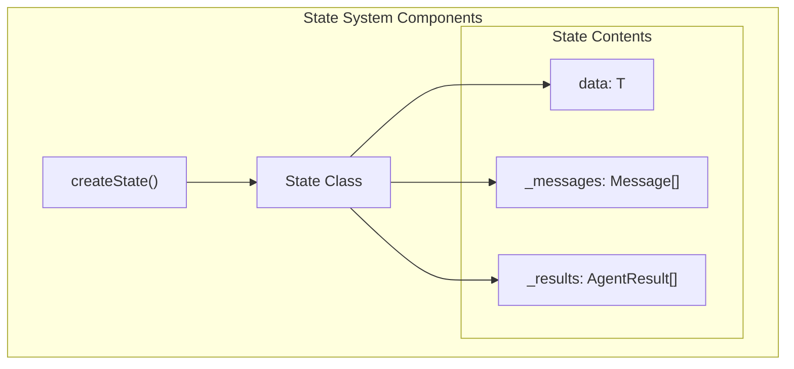
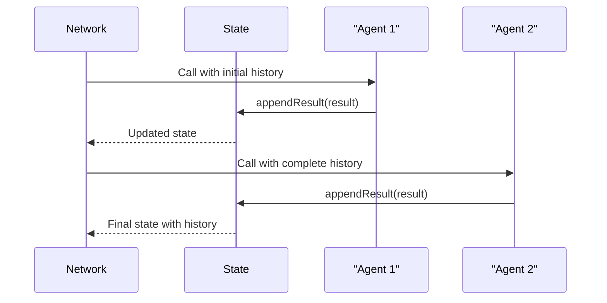
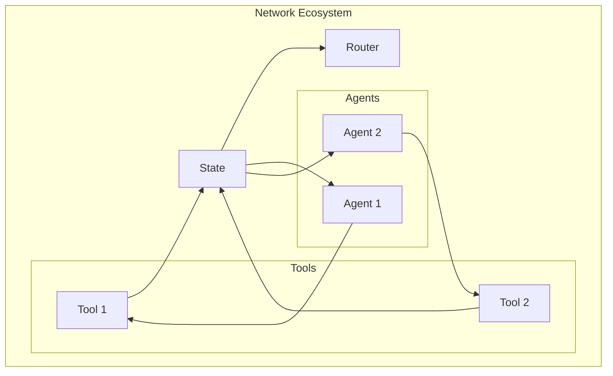
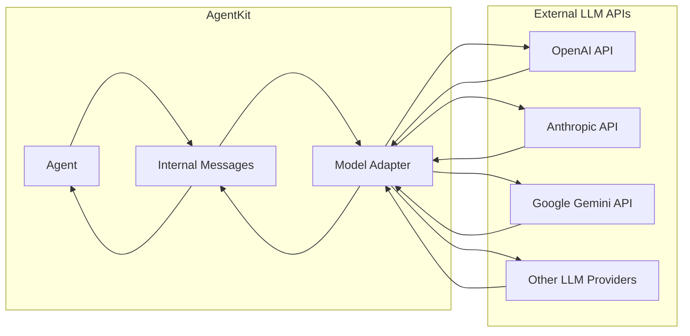
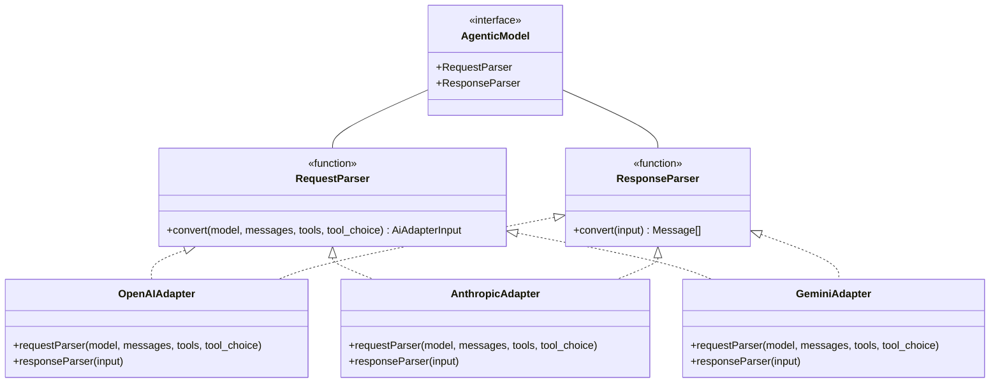
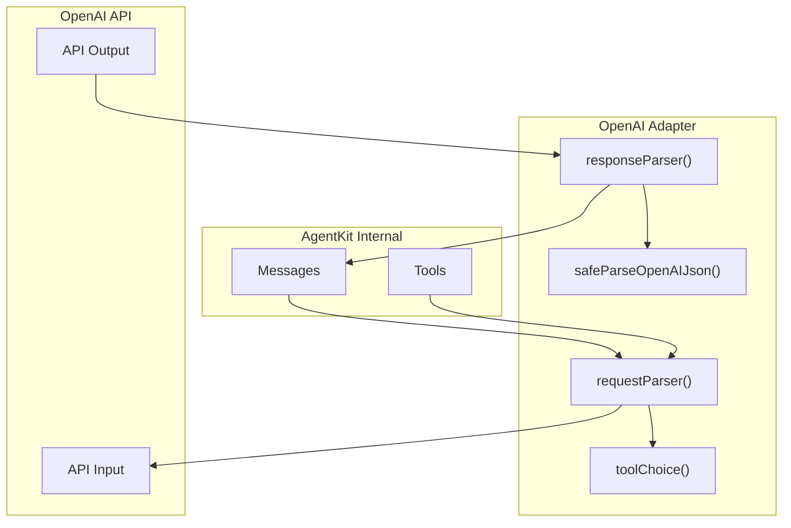
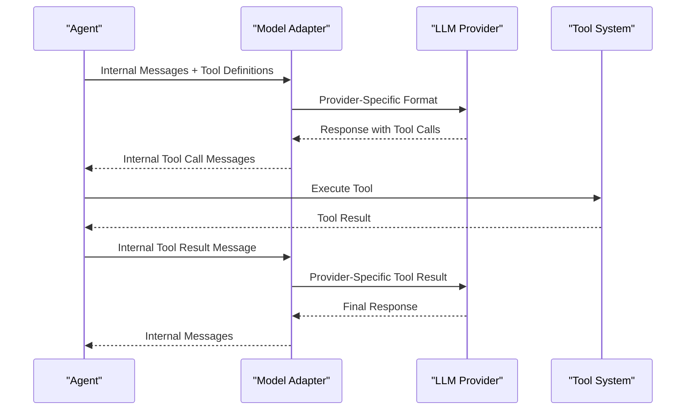

The State API provides shared memory and context management for AgentKit applications. It allows agents, networks, tools, and routers to maintain state across interactions, storing both typed data and message history. This document explains how to use the State API effectively in your agent applications.

For general concepts about state management, see [State Management](#2.3).

## State Overview

In AgentKit, State serves as a shared memory system that enables agents to build context across multiple interactions. It provides:

1. **Typed data storage** - Structured data with TypeScript type safety
2. **Message history** - A chronological record of all interactions
3. **Agent results** - Collection of outputs from agent executions



Sources: [packages/agent-kit/src/state.ts:21-26](), [packages/agent-kit/src/state.ts:36-159]()

## Creating State

The primary way to create state in AgentKit is through the `createState` function:

```typescript
// Define your state type
interface MyNetworkState {
  username?: string;
  currentStep?: number;
}

// Create a typed state
const state = createState<MyNetworkState>({
  username: "defaultUser",
});

// Access typed properties
console.log(state.data.username); // "defaultUser"
```

The `createState` function has the following signature:

```typescript
function createState<T extends StateData>(
  initialState?: T,
  opts?: Omit<State.Constructor<T>, "data">
): State<T>
```

Sources: [packages/agent-kit/src/state.ts:21-26](), [docs/concepts/state.mdx:38-45]()

## State Data Management

### Typed Data

State data is fully typed using TypeScript generics, allowing you to define complex structured data with type safety. The data is accessible through the `data` property:

```typescript
// Accessing and modifying state data
state.data.username = "Alice";
console.log(state.data.username); // "Alice"
state.data.currentStep = 1;
```

This type safety extends throughout the system - when you define a Network with a specific state type, all components (including tools and agents) can safely access the typed state.

Sources: [packages/agent-kit/src/state.ts:37-38](), [packages/agent-kit/src/state.test.ts:15-19](), [docs/concepts/state.mdx:31-45]()

### Message History

The state maintains a chronological history of all messages in the conversation, including user inputs, agent responses, and tool calls. This history provides context for agents in subsequent calls:



The history is accessed and formatted using the `formatHistory` method, which converts agent results into a message format that can be passed to agents.

Sources: [packages/agent-kit/src/state.ts:114-124](), [docs/concepts/state.mdx:14-24]()

### Agent Results

The state stores the results of agent executions as `AgentResult` objects, which can be accessed through the `results` getter:

```typescript
// Getting agent results
const results = state.results;
console.log(results.length); // Number of agent calls
```

The system internally uses `appendResult` to add each new result as agents are called.

Sources: [packages/agent-kit/src/state.ts:102-104](), [packages/agent-kit/src/state.ts:130-132]()

## State in the Agent Network Ecosystem

State serves as the central shared memory system across all components of an agent network:



Sources: [docs/concepts/state.mdx:8-17](), [docs/concepts/routers.mdx:8-26]()

### In Networks

When creating a network, you can provide a generic type for state, which ensures type safety throughout the system:

```typescript
const network = createNetwork<MyNetworkState>({
  agents: [agent1, agent2],
  router: ({ network }) => {
    // Access state in router
    if (!network.state.data.currentStep) {
      network.state.data.currentStep = 1;
      return agent1;
    } else {
      return undefined; // End network execution
    }
  },
});
```

Sources: [packages/agent-kit/src/state.test.ts:28-46](), [docs/concepts/state.mdx:63-65]()

### In Agents

Agents can access network state through their lifecycle hooks and dynamic system prompts:

```typescript
const agent = createAgent({
  name: "StateUser",
  system: ({ network }) => {
    // Access state in dynamic system prompt
    return `You are helping the user ${network.state.data.username}...`;
  },
  lifecycle: {
    onStart: ({ network }) => {
      // Access state in lifecycle hooks
      network.state.data.agentStarted = true;
    },
  },
});
```

Sources: [docs/concepts/agents.mdx:170-197]()

### In Tools

Tools can access and modify the network state through their handler function:

```typescript
const tool = createTool({
  name: "update_state",
  description: "Updates user state information",
  parameters: z.object({
    username: z.string(),
  }),
  handler: ({ username }, { network }) => {
    // Access and modify state in tool handler
    network.state.data.username = username;
    return { success: true };
  },
});
```

A practical example of a tool updating state:

```typescript
const writeFiles = createTool({
  name: "write_files",
  // ...
  handler: (output, { network }) => {
    const files = network.state.data.files || {};
    for (const file of output.files) {
      files[file.filename] = file.content;
    }
    network.state.data.files = files;
  },
});
```

Sources: [docs/reference/create-tool.mdx:85-88](), [docs/concepts/state.mdx:72-93]()

### In Routers

Routers can access the state to make routing decisions between agents:

```typescript
const router = ({ network, lastResult }) => {
  // Access state in router
  const category = network.state.data.category;
  
  if (category === "refund") {
    return refundAgent;
  } else if (category === "exchange") {
    return exchangeAgent;
  }
  
  return undefined; // End network execution
};
```

Sources: [docs/concepts/routers.mdx:106-122](), [docs/concepts/routers.mdx:188-220]()

## State API Reference

### `createState<T>` Function

Creates a new state object with the specified initial data and options.

**Signature:**
```typescript
function createState<T extends StateData>(
  initialState?: T,
  opts?: Omit<State.Constructor<T>, "data">
): State<T>
```

**Parameters:**
- `initialState?: T` - Optional initial data for the state
- `opts?: Omit<State.Constructor<T>, "data">` - Optional configuration options including:
  - `messages?: Message[]` - Initial messages to include in history
  - `results?: AgentResult[]` - Previous agent results for conversation history and memory

**Returns:** A new `State<T>` instance

Sources: [packages/agent-kit/src/state.ts:21-26](), [packages/agent-kit/src/state.ts:162-179]()

### `State<T>` Class

The main class for managing state in AgentKit.

**Properties:**
- `data: T` - Typed data storage
- `results: AgentResult[]` - Getter that returns a copy of the internal results array

**Methods:**
- `formatHistory(formatter?: (r: AgentResult) => Message[]): Message[]` - Formats the history for agent calls by converting agent results into messages
- `appendResult(call: AgentResult): void` - Adds a new result to the state's internal results array
- `clone(): State<T>` - Creates a safe clone of the state including data, results, and messages

**Deprecated API:**
- `kv` - A key-value store interface with methods `set()`, `get()`, `delete()`, `has()`, and `all()`. This API is deprecated and should be replaced with the fully typed `data` property.

Sources: [packages/agent-kit/src/state.ts:74-95](), [packages/agent-kit/src/state.ts:147-155]()

## Important Considerations

1. **State Scope**: State is only retained for a single network's run and is not persisted across different network executions. As noted in the documentation:

   > The `State`'s data is only retained for a single `Network`'s run. This means that it is only short-term memory and is not persisted across different Network `run()` calls.

2. **Type Safety**: Always define specific types for your state to take advantage of TypeScript's type checking.

3. **State Access**: All components in your network (agents, tools, routers) can read from and write to the state, creating a shared memory system.

4. **State Cloning**: When needed, use the `clone()` method to create a safe copy of the state for manipulation.

Sources: [docs/concepts/state.mdx:54-61](), [packages/agent-kit/src/state.ts:137-142]()

## Conclusion

The State API is a central mechanism in AgentKit that enables data persistence and context building across agent interactions. With its typed data system and comprehensive history tracking, it provides the foundation for building complex, context-aware agent networks.

# Model Adapters API


## Purpose and Scope

The Model Adapters API provides interfaces and implementations for connecting AgentKit agents to different Large Language Model (LLM) providers. Model adapters handle the bidirectional conversion between AgentKit's internal message format and the specific formats required by each LLM provider's API. This document details the architecture, interfaces, and implementations of model adapters in AgentKit.

For information about using agents with these models, see [Agents](#2.1), and for understanding tools with LLMs, see [Tools](#2.5).

## Architecture Overview

Model adapters serve as translation layers between AgentKit's internal message format and the proprietary formats required by various LLM providers. Each adapter implements standardized interfaces to ensure compatibility across the system.



Sources: [packages/agent-kit/src/adapters/openai.ts:1-206](), [packages/agent-kit/src/adapters/anthropic.ts:1-201](), [packages/agent-kit/src/adapters/gemini.ts:1-253]()

## Core Adapter Interface

Each model adapter implements a standardized interface consisting of two primary functions: `requestParser` and `responseParser`. These functions handle the conversion between AgentKit's internal message format and the model-specific format.



Sources: [packages/agent-kit/src/adapters/openai.ts:19-94](), [packages/agent-kit/src/adapters/openai.ts:96-151](), [packages/agent-kit/src/adapters/anthropic.ts:17-118](), [packages/agent-kit/src/adapters/anthropic.ts:120-182](), [packages/agent-kit/src/adapters/gemini.ts:16-48](), [packages/agent-kit/src/adapters/gemini.ts:58-134]()

### RequestParser

The `RequestParser` function converts from AgentKit's internal message format to the format required by a specific LLM provider. It handles:

- Message formatting
- Tool definitions
- Tool choice configuration
- Provider-specific parameters

The general function signature is:

```typescript
type RequestParser<T extends AiModel> = (
  model: AiAdapter<T>,
  messages: Message[],
  tools: Tool.Any[],
  tool_choice?: Tool.Choice
) => AiAdapter.Input<T>;
```

Sources: [packages/agent-kit/src/adapters/openai.ts:22-94](), [packages/agent-kit/src/adapters/anthropic.ts:20-118](), [packages/agent-kit/src/adapters/gemini.ts:19-48]()

### ResponseParser

The `ResponseParser` function converts from the LLM provider's response format back to AgentKit's internal message format. It handles:

- Text responses
- Tool call responses
- Error handling
- Special format considerations

The general function signature is:

```typescript
type ResponseParser<T extends AiModel> = (
  input: AiAdapter.Output<T>
) => Message[];
```

Sources: [packages/agent-kit/src/adapters/openai.ts:99-151](), [packages/agent-kit/src/adapters/anthropic.ts:123-182](), [packages/agent-kit/src/adapters/gemini.ts:61-134]()

## Supported Model Providers

AgentKit currently supports the following LLM providers through model adapters:

### OpenAI Adapter

The OpenAI adapter handles communication with OpenAI's API, supporting models like GPT-3.5, GPT-4, and their variants.

Key features:
- Handles OpenAI's function calling format
- Processes parallel tool calls
- Manages OpenAI-specific JSON parsing quirks



Sources: [packages/agent-kit/src/adapters/openai.ts:1-206]()

### Anthropic Adapter

The Anthropic adapter handles communication with Anthropic's API, supporting Claude models.

Key features:
- Handles Anthropic's system prompt separately
- Processes tool use format
- Manages Anthropic-specific message formatting requirements

Sources: [packages/agent-kit/src/adapters/anthropic.ts:1-201]()

### Gemini Adapter

The Gemini adapter handles communication with Google's Gemini API.

Key features:
- Handles Gemini's content parts format
- Processes function calling format
- Manages Gemini-specific JSON schema requirements

Sources: [packages/agent-kit/src/adapters/gemini.ts:1-253](), [docs/reference/model-gemini.mdx:1-80]()

## Message Format Transformation

Model adapters transform between the standardized internal message format and provider-specific formats. The following table summarizes the main message types and their transformations:

| Internal Message Type | OpenAI Format | Anthropic Format | Gemini Format |
|-----------------------|---------------|------------------|---------------|
| Text Message | `{ role, content }` | `{ role, content }` | `{ role, parts: [{ text }] }` |
| Tool Call Message | `{ role: "assistant", tool_calls: [...] }` | `{ role, content: [{ type: "tool_use", ... }] }` | `{ role: "model", parts: [{ functionCall: { ... } }] }` |
| Tool Result Message | `{ role: "tool", tool_call_id, content }` | `{ role: "user", content: [{ type: "tool_result", ... }] }` | `{ role: "user", parts: [{ functionResponse: { ... } }] }` |

Sources: [packages/agent-kit/src/adapters/openai.ts:22-94](), [packages/agent-kit/src/adapters/anthropic.ts:20-118](), [packages/agent-kit/src/adapters/gemini.ts:19-48](), [packages/agent-kit/src/adapters/gemini.ts:136-217]()

## Tool Integration

Model adapters handle the conversion of tool definitions to the format expected by each provider's API. They also process tool invocations from LLMs and convert tool results back to the format expected by the LLM.



Sources: [packages/agent-kit/src/adapters/openai.ts:64-91](), [packages/agent-kit/src/adapters/anthropic.ts:102-115](), [packages/agent-kit/src/adapters/gemini.ts:36-48]()

### Tool Choice Configuration

Model adapters provide a standardized way to configure how LLMs choose tools through the `tool_choice` parameter:

| Tool Choice | Description |
|-------------|-------------|
| `"auto"` | Let the LLM decide whether to use tools |
| `"any"` | Require the LLM to use one of the available tools |
| `"<tool_name>"` | Require the LLM to use a specific tool |

Each adapter converts this standardized format to the provider-specific format.

Sources: [packages/agent-kit/src/adapters/openai.ts:193-205](), [packages/agent-kit/src/adapters/anthropic.ts:184-200](), [packages/agent-kit/src/adapters/gemini.ts:219-245]()

## Using Model Adapters

To use a model adapter, pass it to the `createAgent` function through the `model` parameter. Each adapter function accepts configuration options specific to its provider.

Example for Gemini:

```typescript
import { createAgent, gemini } from "@inngest/agent-kit";

const agent = createAgent({
  name: "Code writer",
  system: "You are an expert TypeScript programmer.",
  model: gemini({ 
    model: "gemini-pro",
    apiKey: process.env.GOOGLE_API_KEY 
  }),
});
```

Sources: [docs/reference/model-gemini.mdx:8-16]()

## Provider-Specific Considerations

### OpenAI

- Handles backtick-wrapped JSON content in tool arguments
- Disables parallel tool calls for certain models (o1/o3)
- Maps OpenAI-specific stop reasons to standardized stop reasons

Sources: [packages/agent-kit/src/adapters/openai.ts:162-183](), [packages/agent-kit/src/adapters/openai.ts:69-76](), [packages/agent-kit/src/adapters/openai.ts:185-191]()

### Anthropic

- Handles system messages differently than other providers
- Manages limitations where the last message can't be an assistant message
- Requires handling empty parameters differently

Sources: [packages/agent-kit/src/adapters/anthropic.ts:28-33](), [packages/agent-kit/src/adapters/anthropic.ts:88-93](), [packages/agent-kit/src/adapters/anthropic.ts:107-111]()

### Gemini

- Converts Zod schemas to OpenAPI 3 format and removes additionalProperties
- Requires special handling for function responses
- Has limited support for function calls without parameters

Sources: [packages/agent-kit/src/adapters/gemini.ts:247-252](), [packages/agent-kit/src/adapters/gemini.ts:195-212](), [docs/reference/model-gemini.mdx:77-79]()

## Error Handling

Model adapters provide standardized error handling across different providers. All adapters follow a similar pattern for error handling:

1. Check if the response contains an error property
2. Throw an error with a meaningful message if an error is detected
3. Parse the response if no error is found

Sources: [packages/agent-kit/src/adapters/openai.ts:102-107](), [packages/agent-kit/src/adapters/anthropic.ts:126-131](), [packages/agent-kit/src/adapters/gemini.ts:64-69]()