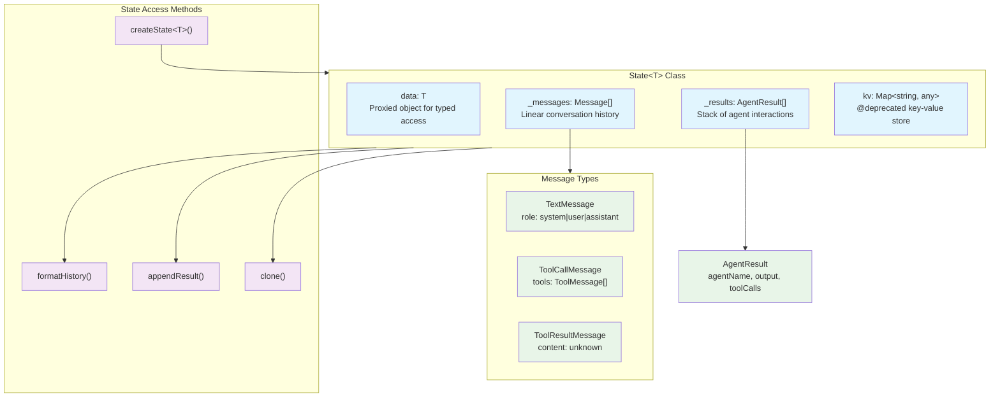
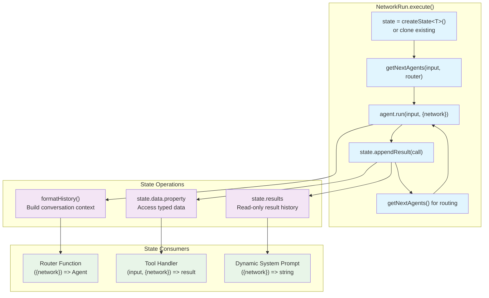

State Management in AgentKit provides shared memory and conversation history for multi-agent workflows. It enables agents to coordinate through persistent data storage and maintains a complete record of all interactions within a Network execution. State consists of two primary components: typed data storage for structured information and message history for conversation context.

For information about how state influences agent selection, see [Routers](#2.4). For details on how agents access and modify state, see [Agents](#2.1).

## State Architecture

The AgentKit state system is built around the `State` class which manages both typed data and message history throughout a network's execution lifecycle.

### Core State Components



Sources: [packages/agent-kit/src/state.ts:36-185](), [packages/agent-kit/src/types.ts:3-169]()

## Typed State Data

The `data` property provides strongly-typed storage accessible to all network components. This property is implemented as a JavaScript Proxy to enable future middleware hooks for state change tracking.

### State Data Interface

```typescript
// Define your state schema
interface NetworkState {
  username?: string;
  files?: Record<string, string>;
  solution?: boolean;
}

// Create typed state instance
const state = createState<NetworkState>({
  username: "default-user"
});
```

The typed data system supports:

| Feature | Description | Implementation |
|---------|-------------|----------------|
| Type Safety | Full TypeScript inference | Generic parameter `T extends StateData` |
| Proxy Access | Intercepted property setting | `new Proxy(this._data, {...})` |
| Initialization | Optional default values | Constructor `data` parameter |
| Mutation | Direct property modification | `state.data.property = value` |

Sources: [packages/agent-kit/src/state.ts:21-26](), [packages/agent-kit/src/state.ts:59-72]()

## Message History System

AgentKit maintains two parallel histories to support conversation continuity and debugging:

### Message Storage Structure

```mermaid
sequenceDiagram
    participant Network as "Network&lt;T&gt;"
    participant State as "State&lt;T&gt;"
    participant Agent as "Agent&lt;T&gt;"
    participant History as "_messages: Message[]"
    participant Results as "_results: AgentResult[]"
    
    Network->>State: "appendResult(agentResult)"
    State->>Results: "push(agentResult)"
    
    Network->>Agent: "agent.run(input, {network})"
    Agent->>State: "formatHistory()"
    State->>History: "concat(_messages)"
    State->>Results: "map(defaultResultFormatter)"
    State-->>Agent: "Message[] for context"
    
    Note over State: "_messages: pre-seeded conversation"
    Note over Results: "_results: chronological agent calls"
```

Sources: [packages/agent-kit/src/state.ts:114-124](), [packages/agent-kit/src/state.ts:130-132]()

### Message Type Definitions

The state system uses three primary message types:

```typescript
type Message = TextMessage | ToolCallMessage | ToolResultMessage;

interface TextMessage {
  type: "text";
  role: "system" | "user" | "assistant";
  content: string | Array<TextContent>;
  stop_reason?: "tool" | "stop";
}
```

Sources: [packages/agent-kit/src/types.ts:3-18]()

## State Lifecycle in Networks

State flows through the network execution cycle, providing context for routing decisions and maintaining conversation continuity.

### Network State Flow



Sources: [packages/agent-kit/src/network.ts:362-432](), [packages/agent-kit/src/state.ts:114-124]()

## State Usage Patterns

### Router State Access

Routers use state to make routing decisions based on conversation history and typed data:

```typescript
const network = createNetwork({
  agents: [classifierAgent, writerAgent],
  router: ({ network, lastResult, callCount }) => {
    // Access typed state data
    const solution = network.state.data.solution;
    if (solution) {
      return undefined; // Stop execution
    }
    
    // Access conversation history
    const results = network.state.results;
    // Route based on state and history
  }
});
```

Sources: [docs/concepts/routers.mdx:188-220]()

### Tool State Modification

Tools can read and modify state data during execution:

```typescript
const writeFilesTool = createTool({
  name: "write_files",
  parameters: z.object({
    files: z.array(z.object({
      filename: z.string(),
      content: z.string(),
    }))
  }),
  handler: (output, { network }) => {
    // Read existing state
    const files = network.state.data.files || {};
    
    // Modify state data
    for (const file of output.files) {
      files[file.filename] = file.content;
    }
    network.state.data.files = files;
  },
});
```

Sources: [docs/concepts/state.mdx:68-94]()

## State API Reference

### Core State Methods

| Method | Purpose | Return Type |
|--------|---------|-------------|
| `createState<T>(initialState?, opts?)` | Create new state instance | `State<T>` |
| `state.data` | Access typed data | `T` |
| `state.results` | Read-only result history | `AgentResult[]` |
| `state.formatHistory(formatter?)` | Build conversation context | `Message[]` |
| `state.appendResult(result)` | Add agent result | `void` |
| `state.clone()` | Create state copy | `State<T>` |

### State Constructor Options

```typescript
interface State.Constructor<T> {
  data?: T;                    // Initial typed data
  results?: AgentResult[];     // Previous agent results
  messages?: Message[];        // Pre-seeded messages
}
```

Sources: [packages/agent-kit/src/state.ts:162-180]()

### AgentResult Structure

Each `AgentResult` captures a complete agent interaction:

```typescript
class AgentResult {
  constructor(
    public agentName: string,           // Agent identifier
    public output: Message[],           // Parsed model output
    public toolCalls: ToolResultMessage[], // Tool execution results
    public createdAt: Date,             // Timestamp
    public prompt?: Message[],          // Input prompt (debug)
    public history?: Message[],         // Context history (debug)
    public raw?: string                 // Raw API response (debug)
  )
}
```

Sources: [packages/agent-kit/src/types.ts:86-136]()

## State Limitations and Considerations

### Memory Scope

State is retained only for a single `network.run()` execution. For persistent memory across multiple runs:

1. Export state after network completion: `network.state.results`
2. Serialize and store relevant data externally
3. Initialize new state with historical context using `messages` parameter

### Deprecated KV Interface

The `state.kv` key-value interface is deprecated in favor of typed `state.data`:

```typescript
// Deprecated approach
state.kv.set("key", value);
const value = state.kv.get("key");

// Preferred approach  
state.data.key = value;
const value = state.data.key;
```

Sources: [packages/agent-kit/src/state.ts:74-96](), [docs/concepts/state.mdx:54-61]()