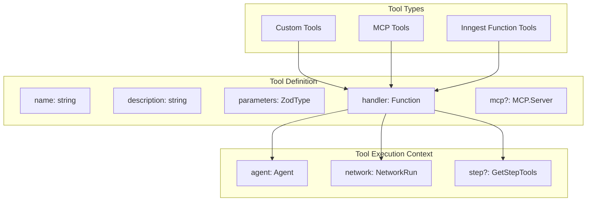
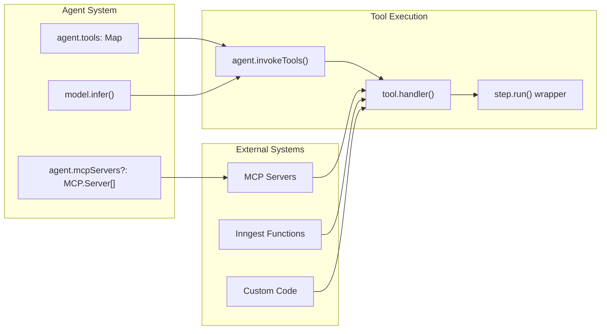
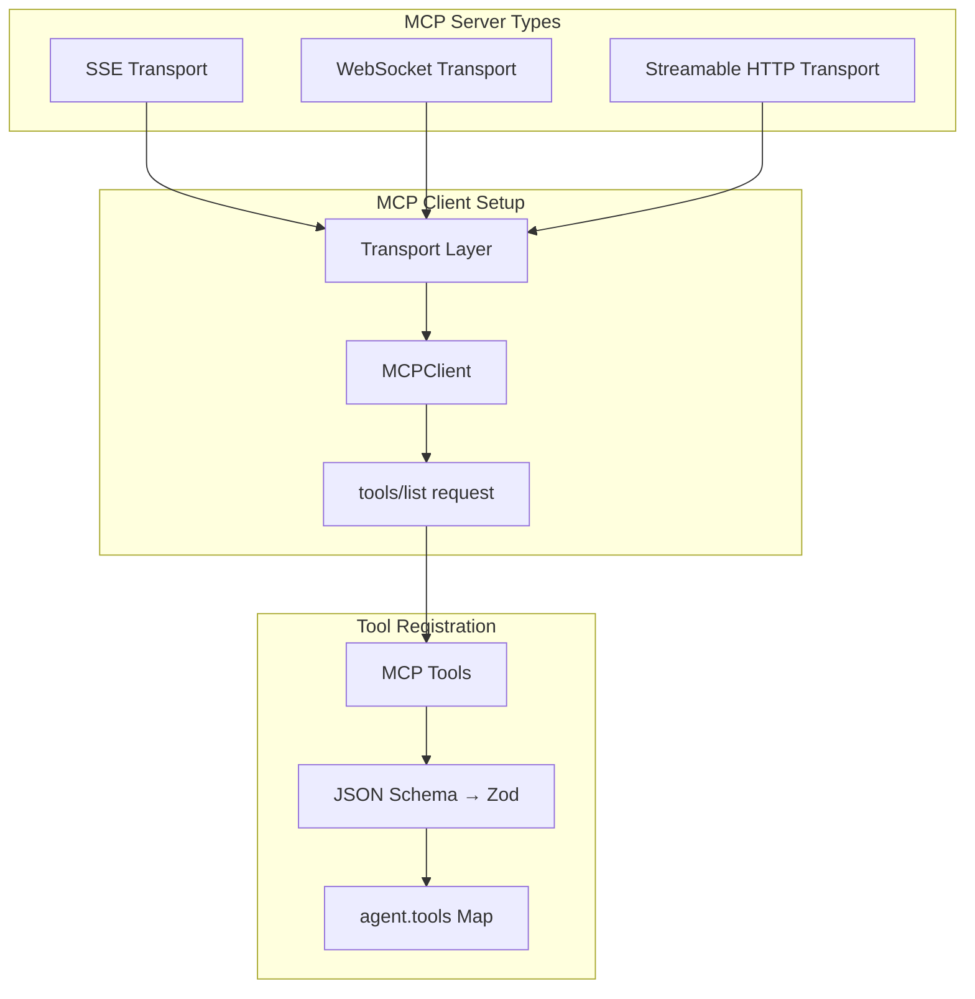
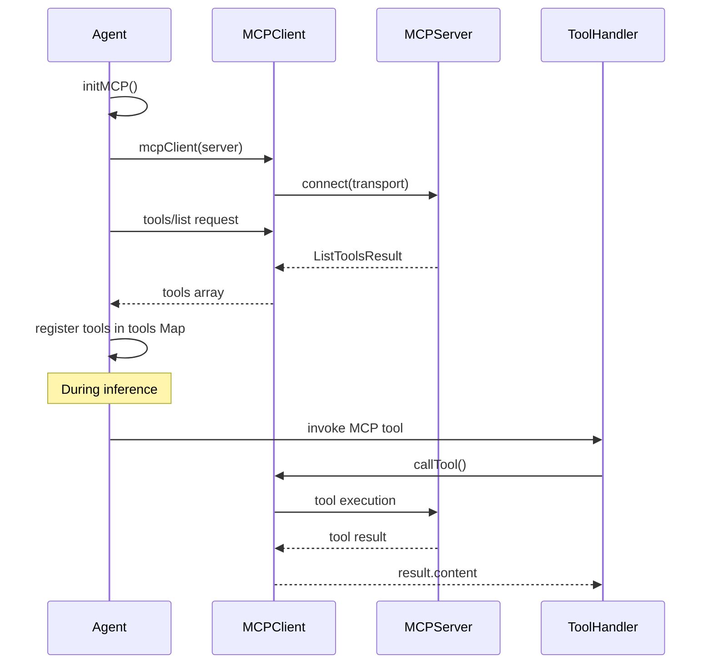
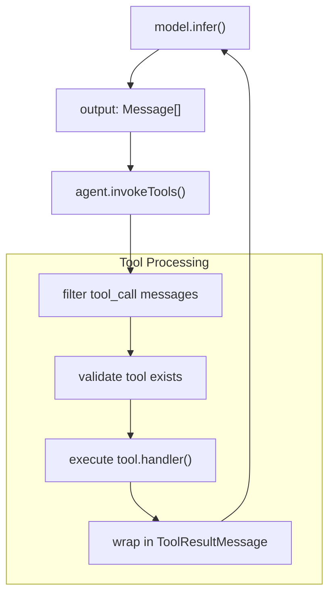
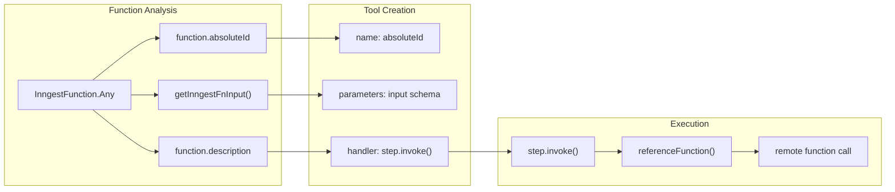
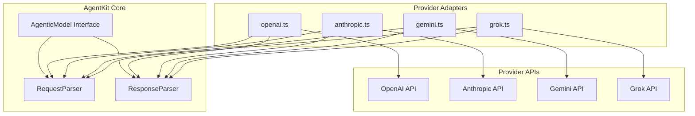
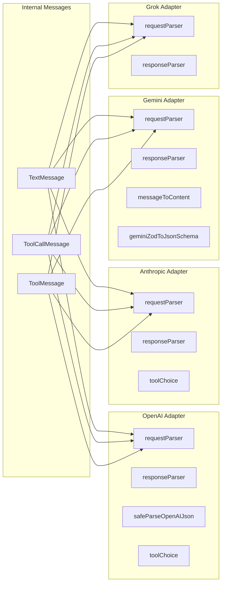
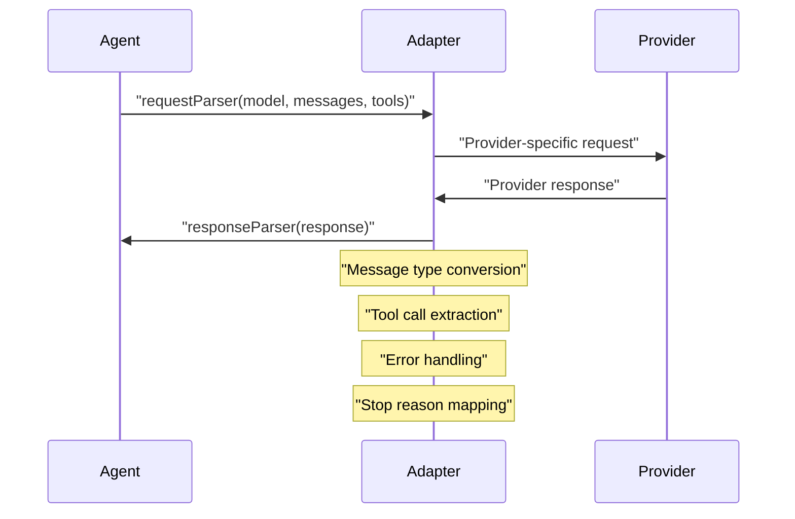

Tools extend agent capabilities by enabling structured function calls during model inference. They allow agents to interact with external systems, perform computations, and transform unstructured inputs into structured outputs. For information about how agents use tools during execution, see [Agents](#2.1).

## Tool Architecture

Tools in AgentKit are function definitions that models can invoke during inference. Each tool consists of metadata (name, description, parameters) that guides model decision-making and a handler function that executes the actual work.

### Core Tool Components



Sources: [packages/agent-kit/src/tool.ts:43-61](), [packages/agent-kit/src/tool.ts:63-75]()

### Tool Integration Points



Sources: [packages/agent-kit/src/agent.ts:67-68](), [packages/agent-kit/src/agent.ts:292-359]()

## Creating Custom Tools

### Basic Tool Creation

The `createTool` function provides type-safe tool creation with automatic input validation based on Zod schemas:

```typescript
// Example from documentation
const listChargesTool = createTool({
  name: 'list_charges',
  description: "Returns all of a user's charges between a date range.",
  parameters: z.object({
    userId: z.string(),
    created: z.object({
      gte: z.string().date(),
      lte: z.string().date(),
    }),
  }),
  handler: async ({ userId, created }, { network, agent, step }) => {
    // Handler implementation
    return charges;
  },
});
```

Sources: [packages/agent-kit/src/tool.ts:14-41]()

### Tool Handler Context

Tool handlers receive execution context through the `Tool.Options` interface:

| Property | Type | Description |
|----------|------|-------------|
| `agent` | `Agent<T>` | The agent executing the tool |
| `network` | `NetworkRun<T>` | Network execution context |
| `step` | `GetStepTools<Inngest.Any>` | Inngest step tools (optional) |

Sources: [packages/agent-kit/src/tool.ts:66-70]()

## MCP Integration

AgentKit supports Model Context Protocol (MCP) servers for dynamic tool discovery and execution.

### MCP Server Configuration



Sources: [packages/agent-kit/src/agent.ts:464-509](), [packages/agent-kit/src/tool.ts:77-119]()

### MCP Tool Lifecycle



Sources: [packages/agent-kit/src/agent.ts:397-459](), [packages/agent-kit/src/agent.ts:413-459]()

### MCP Transport Types

The framework supports three MCP transport mechanisms:

| Transport | Type | Configuration |
|-----------|------|---------------|
| Server-Sent Events | `"sse"` | `url`, `eventSourceInit`, `requestInit` |
| WebSocket | `"ws"` | `url` |
| Streamable HTTP | `"streamable-http"` | `url`, `requestInit`, `authProvider`, `reconnectionOptions` |

Sources: [packages/agent-kit/src/tool.ts:85-109]()

## Tool Execution Lifecycle

### Tool Invocation Flow



Sources: [packages/agent-kit/src/agent.ts:247-286](), [packages/agent-kit/src/agent.ts:292-359]()

### Tool Result Handling

Tool execution results are wrapped in `ToolResultMessage` objects:

```typescript
{
  role: "tool_result",
  type: "tool_result",
  tool: {
    type: "tool",
    id: tool.id,
    name: tool.name,
    input: tool.input.arguments
  },
  content: result,
  stop_reason: "tool"
}
```

Sources: [packages/agent-kit/src/agent.ts:342-355]()

## Tool Choice Control

Agents can control tool selection behavior through the `tool_choice` parameter:

| Choice | Behavior |
|--------|----------|
| `"auto"` | Model decides when to use tools |
| `"any"` | Force use of any available tool |
| `string` | Force use of specific named tool |

Sources: [packages/agent-kit/src/agent.ts:76-77](), [packages/agent-kit/src/tool.ts:74]()

## Inngest Function Integration

AgentKit automatically converts Inngest functions into tools by extracting their input schemas and wrapping execution in `step.invoke()` calls.

### Inngest Tool Registration



Sources: [packages/agent-kit/src/agent.ts:114-147](), [packages/agent-kit/src/util.ts:20-59]()

## Error Handling

Tool execution errors are automatically serialized and returned as tool results:

```typescript
.catch((err) => {
  return { error: serializeError(err) };
})
```

This ensures that tool failures don't crash agent execution but instead provide error information that models can reason about.

Sources: [packages/agent-kit/src/agent.ts:338-340]()

# Model Adapters


Model Adapters provide a normalized interface for integrating different AI model providers within AgentKit. They handle the transformation of messages between AgentKit's internal format and provider-specific APIs, enabling agents to work seamlessly with OpenAI, Anthropic, Gemini, and Grok models.

For information about configuring and using specific models within agents and networks, see [Models](#2.6). For details about agent configuration, see [Agents](#2.1).

## Architecture Overview

Model Adapters implement a standardized interface that normalizes the differences between AI providers. Each adapter consists of request and response parsers that handle bidirectional message transformation.

### Adapter Interface Structure



Sources: [packages/agent-kit/src/adapters/openai.ts:1-206](), [packages/agent-kit/src/adapters/anthropic.ts:1-201](), [packages/agent-kit/src/adapters/gemini.ts:1-253](), [packages/agent-kit/src/adapters/grok.ts:1-49](), [packages/agent-kit/src/model.ts]()

## Provider Implementation Details

Each provider adapter implements the `AgenticModel.RequestParser` and `AgenticModel.ResponseParser` interfaces to handle message transformation and provider-specific requirements.

### Code Entity Mapping



Sources: [packages/agent-kit/src/adapters/openai.ts:22-94](), [packages/agent-kit/src/adapters/anthropic.ts:20-118](), [packages/agent-kit/src/adapters/gemini.ts:19-49](), [packages/agent-kit/src/adapters/grok.ts:19-42]()

## Message Transformation Flow

Model Adapters handle the conversion of AgentKit's internal message format to and from provider-specific formats during agent execution.

### Request Transformation Process

| Provider | System Prompt | Tool Calling | Message Roles | Special Handling |
|----------|---------------|--------------|---------------|------------------|
| OpenAI | Inline in messages | `tool_calls` array | `user`, `assistant`, `tool` | o3/o1 model compatibility |
| Anthropic | Top-level `system` field | `tool_use` content blocks | `user`, `assistant` | Last message role patching |
| Gemini | User role conversion | `functionCall` parts | `user`, `model` | Function declarations |
| Grok | OpenAI-compatible | Disabled strict mode | `user`, `assistant`, `tool` | Strict mode override |

### Response Parsing



Sources: [packages/agent-kit/src/adapters/openai.ts:99-151](), [packages/agent-kit/src/adapters/anthropic.ts:123-182](), [packages/agent-kit/src/adapters/gemini.ts:61-134]()

## Provider-Specific Considerations

### OpenAI Adapter

The OpenAI adapter handles several model-specific requirements and limitations:

- **Parallel Tool Calls**: Disabled for structured output compatibility [packages/agent-kit/src/adapters/openai.ts:75]()
- **O3/O1 Model Support**: Excludes `parallel_tool_calls` parameter for o3 and o1 models [packages/agent-kit/src/adapters/openai.ts:69-76]()
- **JSON Parsing**: Handles backtick strings in function arguments via `safeParseOpenAIJson` [packages/agent-kit/src/adapters/openai.ts:162-183]()
- **Tool Choice Mapping**: Converts AgentKit tool choice to OpenAI format [packages/agent-kit/src/adapters/openai.ts:193-205]()

### Anthropic Adapter

The Anthropic adapter addresses Claude's specific API requirements:

- **System Prompts**: Extracts system messages to top-level `system` field [packages/agent-kit/src/adapters/anthropic.ts:28-32]()
- **Message Role Patching**: Converts final assistant messages to user role [packages/agent-kit/src/adapters/anthropic.ts:88-93]()
- **Required Parameters**: Enforces `max_tokens` requirement [packages/agent-kit/src/adapters/anthropic.ts:98]()
- **Tool Results**: Formats tool responses as content blocks [packages/agent-kit/src/adapters/anthropic.ts:66-82]()

### Gemini Adapter

The Gemini adapter transforms messages to Google's content part structure:

- **Content Parts**: Converts messages to `parts` arrays with text and function calls [packages/agent-kit/src/adapters/gemini.ts:136-217]()
- **Function Declarations**: Maps tools to Gemini's function declaration format [packages/agent-kit/src/adapters/gemini.ts:27-34]()
- **Schema Conversion**: Uses custom `geminiZodToJsonSchema` for parameter schemas [packages/agent-kit/src/adapters/gemini.ts:247-252]()
- **Role Mapping**: Maps system/user/assistant to user/model roles [packages/agent-kit/src/adapters/gemini.ts:139-194]()

### Grok Adapter

The Grok adapter leverages OpenAI compatibility while addressing limitations:

- **OpenAI Reuse**: Delegates to OpenAI request/response parsers [packages/agent-kit/src/adapters/grok.ts:25-30]()
- **Strict Mode Disable**: Overrides strict function calling support [packages/agent-kit/src/adapters/grok.ts:33-39]()
- **API Compatibility**: Maintains OpenAI-compatible interface while handling Grok limitations [packages/agent-kit/src/adapters/grok.ts:47-48]()

Sources: [packages/agent-kit/src/adapters/openai.ts:66-91](), [packages/agent-kit/src/adapters/anthropic.ts:88-99](), [packages/agent-kit/src/adapters/gemini.ts:27-49](), [packages/agent-kit/src/adapters/grok.ts:32-39]()

## Configuration and Environment Variables

Model Adapters support provider-specific configuration through environment variables and options:

| Provider | Environment Variable | Required Parameters | Optional Parameters |
|----------|---------------------|-------------------|-------------------|
| OpenAI | `OPENAI_API_KEY` | `model` | `apiKey`, `baseUrl`, `defaultParameters` |
| Anthropic | `ANTHROPIC_API_KEY` | `model`, `defaultParameters.max_tokens` | `apiKey`, `baseUrl`, `betaHeaders` |
| Gemini | `GEMINI_API_KEY` | `model` | `apiKey`, `baseUrl`, `defaultParameters` |
| Grok | `XAI_API_KEY` | `model` | `apiKey`, `baseUrl`, `defaultParameters` |

The adapters automatically handle API key resolution and provide sensible defaults for base URLs and parameters while allowing full customization through configuration objects.

Sources: [docs/concepts/models.mdx:192-198](), [docs/reference/model-openai.mdx:34-53](), [docs/reference/model-anthropic.mdx:41-76](), [docs/reference/model-gemini.mdx:39-62](), [docs/reference/model-grok.mdx:36-58]()