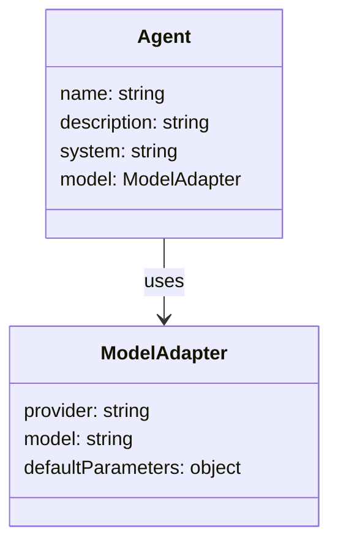

yarn add @inngest/agent-kit
```

You'll also need to install the following dependencies:

```bash
npm install zod
npm install --save-dev dotenv tsx @types/node
```

Sources: [examples/quick-start/package.json:14-23]()

## Creating Your First Agent

An Agent in AgentKit is an entity with a specific role that can answer questions or perform tasks using an LLM model. Let's create a PostgreSQL database administrator agent:

```typescript
import "dotenv/config";
import { anthropic, createAgent } from "@inngest/agent-kit";

const dbaAgent = createAgent({
  name: "Database administrator",
  description: "Provides expert support for managing PostgreSQL databases",
  system:
    "You are a PostgreSQL expert database administrator. " +
    "You only provide answers to questions linked to Postgres database schema, indexes, extensions.",
  model: anthropic({
    model: "claude-3-5-haiku-latest",
    defaultParameters: {
      max_tokens: 4096,
    },
  }),
});
```

Key components:
- `name`: A descriptive name for the agent
- `description`: A summary of the agent's capabilities  
- `system`: The system prompt that defines the agent's behavior
- `model`: The LLM provider and model configuration

The `createAgent` function is the primary constructor for building individual agents that can be used standalone or within networks.

Sources: [examples/quick-start/index.ts:15-39](), [docs/getting-started/quick-start.mdx:63-88]()

## Agent Components and Architecture

Below is a diagram showing the basic components of an Agent:



Sources: [examples/quick-start/index.ts:5-17]()

## Setting Up Environment Variables

Before running your agent, you'll need to set up the required API keys as environment variables:

```bash