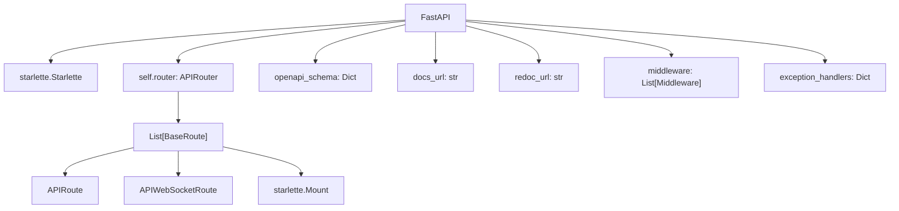
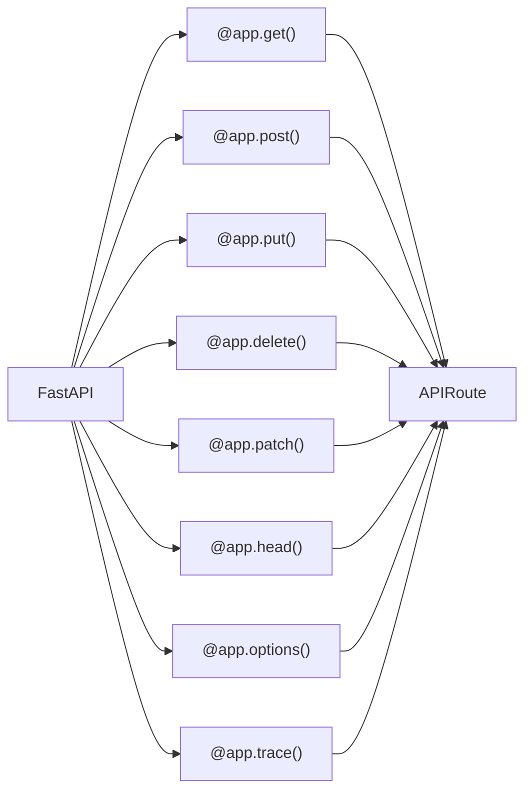
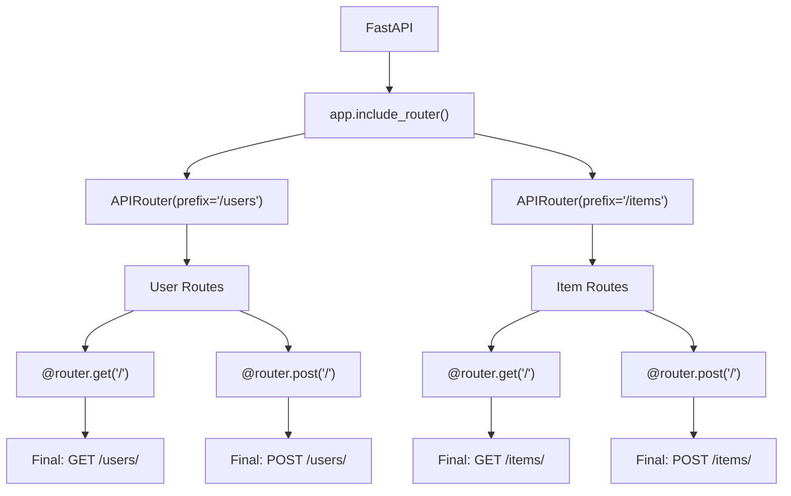
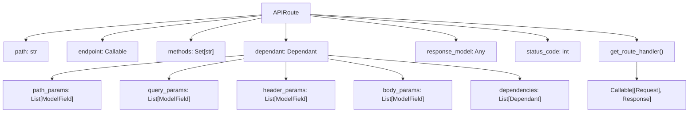
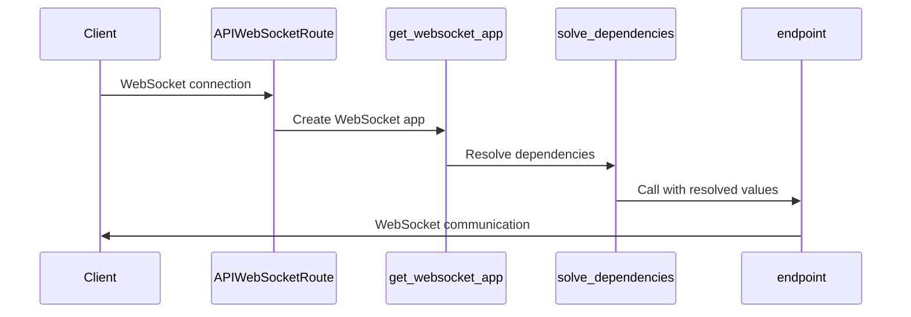
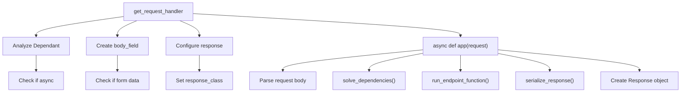
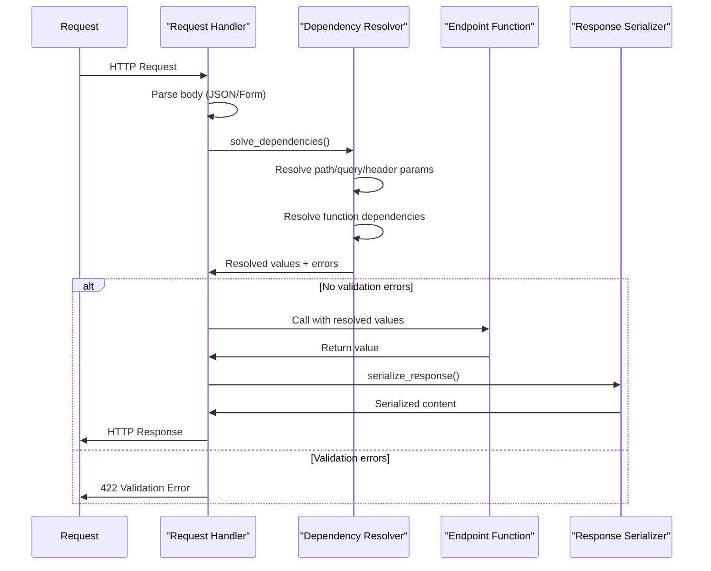
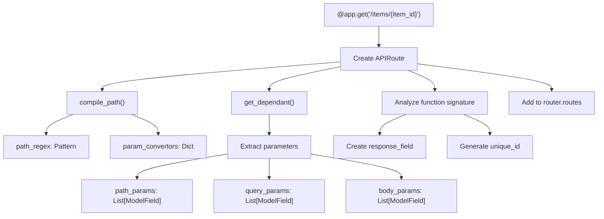
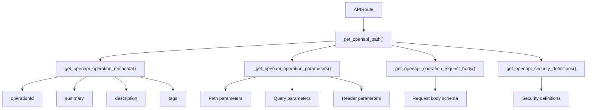
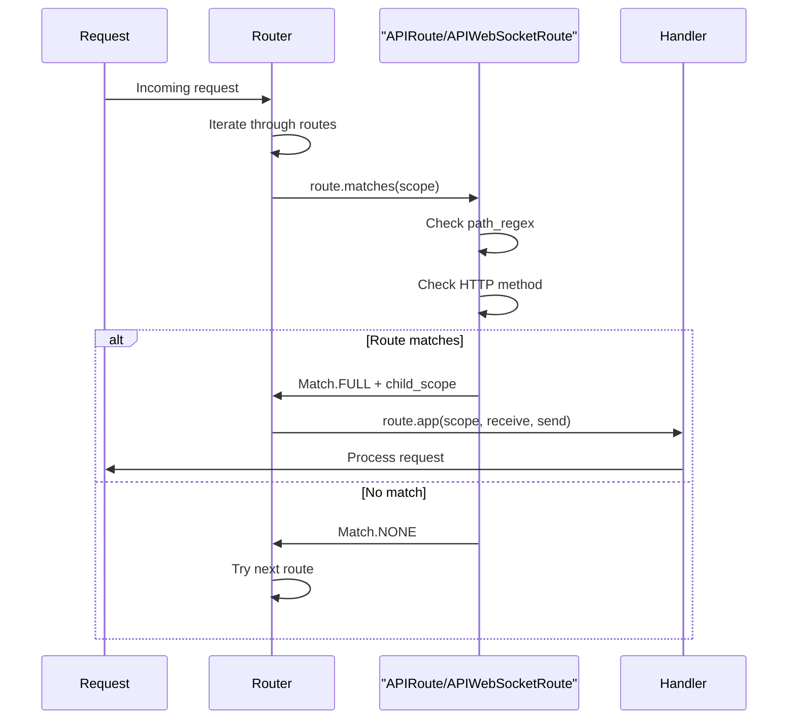

This document covers FastAPI's application and routing system, including the core `FastAPI` application class, route organization through `APIRouter`, individual route handling via `APIRoute` and `APIWebSocketRoute`, and the request processing pipeline. For information about dependency injection mechanics, see [Dependency Injection](#2.2). For details about parameter validation and handling, see [Parameter Validation and Handling](#2.3).

## FastAPI Application Class

The `FastAPI` class serves as the main application entry point, inheriting from Starlette's `Starlette` class while adding FastAPI-specific functionality including automatic API documentation, dependency injection, and enhanced routing capabilities.

### Application Structure

The `FastAPI` constructor accepts extensive configuration options for OpenAPI documentation, CORS, middleware, and routing behavior. Key configuration includes `title`, `description`, `version` for API metadata, `docs_url` and `redoc_url` for documentation endpoints, and `default_response_class` for response handling.

Sources: [fastapi/applications.py:48-640](), [fastapi/__init__.py:7]()

### Route Definition Methods

The `FastAPI` class provides HTTP method decorators that create `APIRoute` instances:

Each decorator method creates an `APIRoute` instance with the specified HTTP method, path, and endpoint function, then adds it to the application's router.

Sources: [fastapi/applications.py:697-1007]()

## APIRouter System

The `APIRouter` class enables modular route organization by grouping related path operations that can be included in the main application or other routers.

### Router Hierarchy

The `APIRouter` constructor accepts parameters including `prefix` for path prefixing, `tags` for OpenAPI organization, `dependencies` for shared dependencies, and `default_response_class` for response handling.

Sources: [fastapi/routing.py:596-621](), [fastapi/routing.py:623-740]()

### Router Registration

The `include_router` method merges an `APIRouter` into the application by copying its routes and applying prefix, tag, and dependency transformations:

| Parameter | Purpose | Example |
|-----------|---------|---------|
| `router` | APIRouter instance to include | `user_router` |
| `prefix` | Path prefix for all routes | `"/api/v1"` |
| `tags` | OpenAPI tags to apply | `["users"]` |
| `dependencies` | Dependencies to add to all routes | `[Depends(get_current_user)]` |

Sources: [fastapi/applications.py:1009-1106]()

## Route Classes

### APIRoute

The `APIRoute` class represents individual HTTP endpoints, handling path compilation, dependency analysis, and request processing setup.

The `APIRoute` constructor analyzes the endpoint function signature using `get_dependant()` to extract parameter information and build the dependency tree.

Sources: [fastapi/routing.py:429-593]()

### APIWebSocketRoute

The `APIWebSocketRoute` class handles WebSocket connections with similar dependency resolution but different connection lifecycle:

Sources: [fastapi/routing.py:389-427]()

## Request Processing Pipeline

### Request Handler Creation

The `get_request_handler` function creates the actual ASGI application that processes HTTP requests:

Sources: [fastapi/routing.py:218-358]()

### Request Flow

The generated request handler follows this processing sequence:

Sources: [fastapi/routing.py:241-356](), [fastapi/dependencies/utils.py:572-689]()

## Route Registration Process

### Route Creation and Registration

When routes are defined using decorators, the following process occurs:

The route registration process includes path compilation using Starlette's `compile_path`, dependency analysis via `get_dependant`, and OpenAPI schema preparation.

Sources: [fastapi/routing.py:430-571](), [fastapi/dependencies/utils.py:265-314]()

### Dependency Tree Construction

The `get_dependant` function recursively builds a dependency tree by analyzing function signatures:

| Component | Purpose | Location |
|-----------|---------|----------|
| `path_params` | URL path parameters | `dependant.path_params` |
| `query_params` | Query string parameters | `dependant.query_params` |
| `header_params` | HTTP header parameters | `dependant.header_params` |
| `cookie_params` | Cookie parameters | `dependant.cookie_params` |
| `body_params` | Request body parameters | `dependant.body_params` |
| `dependencies` | Sub-dependency functions | `dependant.dependencies` |

Sources: [fastapi/dependencies/utils.py:265-314](), [fastapi/dependencies/models.py:15-37]()

## OpenAPI Integration

### Schema Generation

The routing system automatically generates OpenAPI schemas through the `get_openapi_path` function:

Each `APIRoute` contributes to the OpenAPI schema by providing operation metadata, parameter schemas, request/response body schemas, and security definitions.

Sources: [fastapi/openapi/utils.py:254-439]()

### Route Matching

The route matching process uses Starlette's routing system with FastAPI enhancements:

The `matches` method on `APIRoute` and `APIWebSocketRoute` determines if a route should handle a specific request based on path pattern and HTTP method.

Sources: [fastapi/routing.py:589-593](), [fastapi/routing.py:422-426]()