FastAPI maintains a comprehensive community ecosystem that integrates automated data collection, community recognition systems, and multi-channel engagement platforms. This ecosystem tracks contributor activity across GitHub, manages community expertise recognition, and provides multiple pathways for users to get help and contribute to the project.

The community ecosystem encompasses automated data collection scripts that analyze GitHub activity, structured data storage for community metrics, recognition systems for experts and contributors, and engagement channels including documentation, Discord, and social media platforms.

For information about the translation automation specifically, see [Translation Management](#7.2). For details about external resources and sponsorship display, see [External Resources and Sponsorship](#7.3). For GitHub automation workflows, see [Community Automation](#7.4).

## Community Engagement Channels

FastAPI provides multiple channels for community interaction, help-seeking, and contribution, documented primarily in the help system across multiple languages.

### Help and Support Infrastructure

The `docs/en/docs/help-fastapi.md` file and its translations serve as the central hub for community engagement, providing structured pathways for users to get help and contribute to the project.

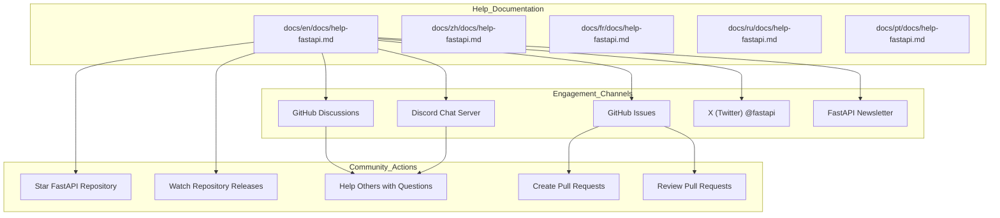
```mermaid
graph TD
    subgraph "Help_Documentation"
        HELP_FASTAPI_EN["docs/en/docs/help-fastapi.md"]
        HELP_FASTAPI_ZH["docs/zh/docs/help-fastapi.md"]
        HELP_FASTAPI_FR["docs/fr/docs/help-fastapi.md"]
        HELP_FASTAPI_RU["docs/ru/docs/help-fastapi.md"]
        HELP_FASTAPI_PT["docs/pt/docs/help-fastapi.md"]
    end
    
    subgraph "Engagement_Channels"
        GITHUB_DISCUSSIONS["GitHub Discussions"]
        GITHUB_ISSUES["GitHub Issues"]
        DISCORD_CHAT["Discord Chat Server"]
        SOCIAL_MEDIA["X (Twitter) @fastapi"]
        NEWSLETTER["FastAPI Newsletter"]
    end
    
    subgraph "Community_Actions"
        STAR_REPO["Star FastAPI Repository"]
        WATCH_RELEASES["Watch Repository Releases"]
        HELP_OTHERS["Help Others with Questions"]
        CREATE_PRS["Create Pull Requests"]
        REVIEW_PRS["Review Pull Requests"]
    end
    
    HELP_FASTAPI_EN --> GITHUB_DISCUSSIONS
    HELP_FASTAPI_EN --> GITHUB_ISSUES
    HELP_FASTAPI_EN --> DISCORD_CHAT
    HELP_FASTAPI_EN --> SOCIAL_MEDIA
    HELP_FASTAPI_EN --> NEWSLETTER
    
    GITHUB_DISCUSSIONS --> HELP_OTHERS
    GITHUB_ISSUES --> CREATE_PRS
    GITHUB_ISSUES --> REVIEW_PRS
    DISCORD_CHAT --> HELP_OTHERS
    HELP_FASTAPI_EN --> STAR_REPO
    HELP_FASTAPI_EN --> WATCH_RELEASES
```

The help documentation provides structured guidance for different types of community participation, from passive support (starring, watching) to active contribution (answering questions, creating pull requests).

**Sources:** [docs/en/docs/help-fastapi.md:1-257](), [docs/zh/docs/help-fastapi.md:1-149](), [docs/fr/docs/help-fastapi.md:1-105]()

### Community Support Workflows

The help system establishes clear workflows for community members to provide support to others, with specific guidelines for understanding questions, reproducing problems, and suggesting solutions.

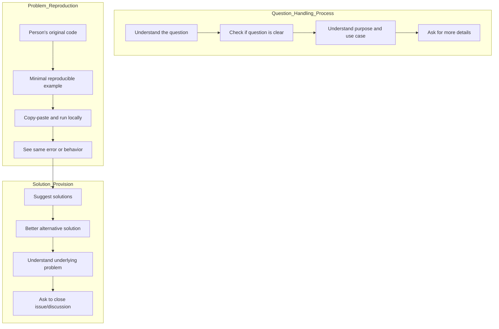
```mermaid
graph TD
    subgraph "Question_Handling_Process"
        UNDERSTAND_QUESTION["Understand the question"]
        CHECK_CLARITY["Check if question is clear"]
        UNDERSTAND_PURPOSE["Understand purpose and use case"]
        ASK_FOR_DETAILS["Ask for more details"]
    end
    
    subgraph "Problem_Reproduction"
        ORIGINAL_CODE["Person's original code"]
        MINIMAL_EXAMPLE["Minimal reproducible example"]
        COPY_PASTE_RUNNABLE["Copy-paste and run locally"]
        REPRODUCE_ERROR["See same error or behavior"]
    end
    
    subgraph "Solution_Provision"
        SUGGEST_SOLUTIONS["Suggest solutions"]
        BETTER_ALTERNATIVE["Better alternative solution"]
        UNDERLYING_PROBLEM["Understand underlying problem"]
        ASK_TO_CLOSE["Ask to close issue/discussion"]
    end
    
    UNDERSTAND_QUESTION --> CHECK_CLARITY
    CHECK_CLARITY --> UNDERSTAND_PURPOSE
    UNDERSTAND_PURPOSE --> ASK_FOR_DETAILS
    
    ORIGINAL_CODE --> MINIMAL_EXAMPLE
    MINIMAL_EXAMPLE --> COPY_PASTE_RUNNABLE
    COPY_PASTE_RUNNABLE --> REPRODUCE_ERROR
    
    REPRODUCE_ERROR --> SUGGEST_SOLUTIONS
    SUGGEST_SOLUTIONS --> BETTER_ALTERNATIVE
    BETTER_ALTERNATIVE --> UNDERLYING_PROBLEM
    UNDERLYING_PROBLEM --> ASK_TO_CLOSE
```

This workflow is documented across multiple language versions and emphasizes kindness and understanding in community interactions.

**Sources:** [docs/en/docs/help-fastapi.md:89-125](), [docs/pl/docs/help-fastapi.md:89-125](), [docs/ru/docs/help-fastapi.md:84-116]()

## Data Collection System

The community ecosystem relies on automated data collection from GitHub's APIs to track community engagement across multiple dimensions.

### Discussion Experts Tracking

The system identifies community experts by analyzing GitHub Discussions activity through the GraphQL API. The `scripts/people.py` script implements a comprehensive tracking system that monitors question-answering patterns.

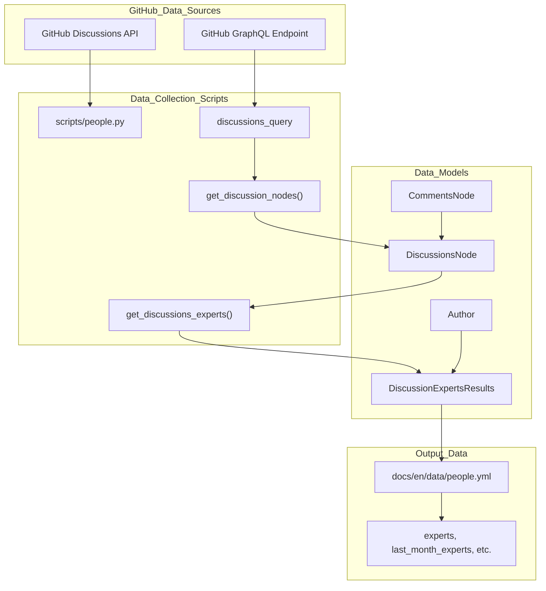
```mermaid
graph TD
    subgraph "GitHub_Data_Sources"
        GH_DISCUSSIONS["GitHub Discussions API"]
        GH_GRAPHQL["GitHub GraphQL Endpoint"]
    end
    
    subgraph "Data_Collection_Scripts"
        PEOPLE_SCRIPT["scripts/people.py"]
        DISCUSSIONS_QUERY["discussions_query"]
        GET_DISCUSSION_NODES["get_discussion_nodes()"]
        GET_DISCUSSIONS_EXPERTS["get_discussions_experts()"]
    end
    
    subgraph "Data_Models"
        AUTHOR["Author"]
        DISCUSSIONS_NODE["DiscussionsNode"] 
        DISCUSSION_EXPERTS_RESULTS["DiscussionExpertsResults"]
        COMMENTS_NODE["CommentsNode"]
    end
    
    subgraph "Output_Data"
        PEOPLE_YML["docs/en/data/people.yml"]
        EXPERTS_DATA["experts, last_month_experts, etc."]
    end
    
    GH_DISCUSSIONS --> PEOPLE_SCRIPT
    GH_GRAPHQL --> DISCUSSIONS_QUERY
    DISCUSSIONS_QUERY --> GET_DISCUSSION_NODES
    GET_DISCUSSION_NODES --> DISCUSSIONS_NODE
    DISCUSSIONS_NODE --> GET_DISCUSSIONS_EXPERTS
    GET_DISCUSSIONS_EXPERTS --> DISCUSSION_EXPERTS_RESULTS
    AUTHOR --> DISCUSSION_EXPERTS_RESULTS
    COMMENTS_NODE --> DISCUSSIONS_NODE
    DISCUSSION_EXPERTS_RESULTS --> PEOPLE_YML
    PEOPLE_YML --> EXPERTS_DATA
```

The system tracks experts across multiple time windows using counters for different periods: `last_month_commenters`, `three_months_commenters`, `six_months_commenters`, and `one_year_commenters`.

**Sources:** [scripts/people.py:16-61](), [scripts/people.py:170-177](), [scripts/people.py:195-255]()

### Contributors and Pull Request Analysis

The contributor tracking system analyzes pull request data to identify different types of community contributions, including code contributions, translations, and translation reviews.

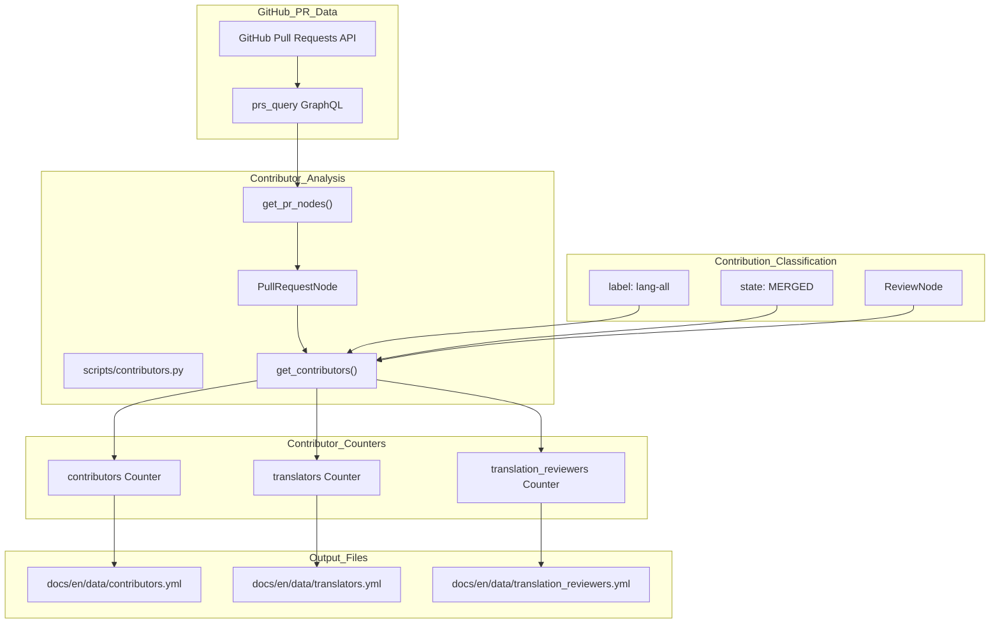
```mermaid
graph TD
    subgraph "GitHub_PR_Data"
        GITHUB_PRS["GitHub Pull Requests API"]
        PRS_QUERY["prs_query GraphQL"]
    end
    
    subgraph "Contributor_Analysis"
        CONTRIBUTORS_SCRIPT["scripts/contributors.py"]
        GET_PR_NODES["get_pr_nodes()"]
        GET_CONTRIBUTORS["get_contributors()"]
        PULL_REQUEST_NODE["PullRequestNode"]
    end
    
    subgraph "Contribution_Classification"
        LANG_ALL_LABEL["label: lang-all"]
        IS_MERGED["state: MERGED"]
        REVIEW_NODES["ReviewNode"]
    end
    
    subgraph "Contributor_Counters"
        CONTRIBUTORS_COUNTER["contributors Counter"]
        TRANSLATORS_COUNTER["translators Counter"] 
        TRANSLATION_REVIEWERS_COUNTER["translation_reviewers Counter"]
    end
    
    subgraph "Output_Files"
        CONTRIBUTORS_YML["docs/en/data/contributors.yml"]
        TRANSLATORS_YML["docs/en/data/translators.yml"]
        TRANSLATION_REVIEWERS_YML["docs/en/data/translation_reviewers.yml"]
    end
    
    GITHUB_PRS --> PRS_QUERY
    PRS_QUERY --> GET_PR_NODES
    GET_PR_NODES --> PULL_REQUEST_NODE
    PULL_REQUEST_NODE --> GET_CONTRIBUTORS
    LANG_ALL_LABEL --> GET_CONTRIBUTORS
    IS_MERGED --> GET_CONTRIBUTORS
    REVIEW_NODES --> GET_CONTRIBUTORS
    GET_CONTRIBUTORS --> CONTRIBUTORS_COUNTER
    GET_CONTRIBUTORS --> TRANSLATORS_COUNTER
    GET_CONTRIBUTORS --> TRANSLATION_REVIEWERS_COUNTER
    CONTRIBUTORS_COUNTER --> CONTRIBUTORS_YML
    TRANSLATORS_COUNTER --> TRANSLATORS_YML
    TRANSLATION_REVIEWERS_COUNTER --> TRANSLATION_REVIEWERS_YML
```

The system differentiates between regular contributors and translators by checking for the `lang-all` label on pull requests, ensuring proper categorization of translation work.

**Sources:** [scripts/contributors.py:18-56](), [scripts/contributors.py:175-204](), [scripts/contributors.py:175-204]()

## Community Data Storage

The community data is stored in structured YAML files that serve as the source of truth for community recognition and statistics.

### Data Schema and Structure

The community data follows a consistent schema across different contributor types, with each file containing user information and contribution metrics.

| File | Purpose | Key Fields |
|------|---------|------------|
| `docs/en/data/people.yml` | Discussion experts and maintainers | `maintainers`, `experts`, `last_month_experts`, `three_months_experts`, `six_months_experts`, `one_year_experts` |
| `docs/en/data/contributors.yml` | Code contributors | `login`, `count`, `avatarUrl`, `url` |
| `docs/en/data/translators.yml` | Translation contributors | `login`, `count`, `avatarUrl`, `url` |
| `docs/en/data/translation_reviewers.yml` | Translation reviewers | `login`, `count`, `avatarUrl`, `url` |
| `docs/en/data/github_sponsors.yml` | Financial sponsors | `sponsors` array with tiered structure |

**Sources:** [docs/en/data/people.yml:1-715](), [docs/en/data/contributors.yml:1-561](), [docs/en/data/translators.yml:1-500](), [docs/en/data/translation_reviewers.yml:1-500](), [docs/en/data/github_sponsors.yml:1-440]()

### User Filtering and Skip Lists

The system maintains a skip list to exclude automated accounts and specific users from community statistics, ensuring accurate representation of human contributors.

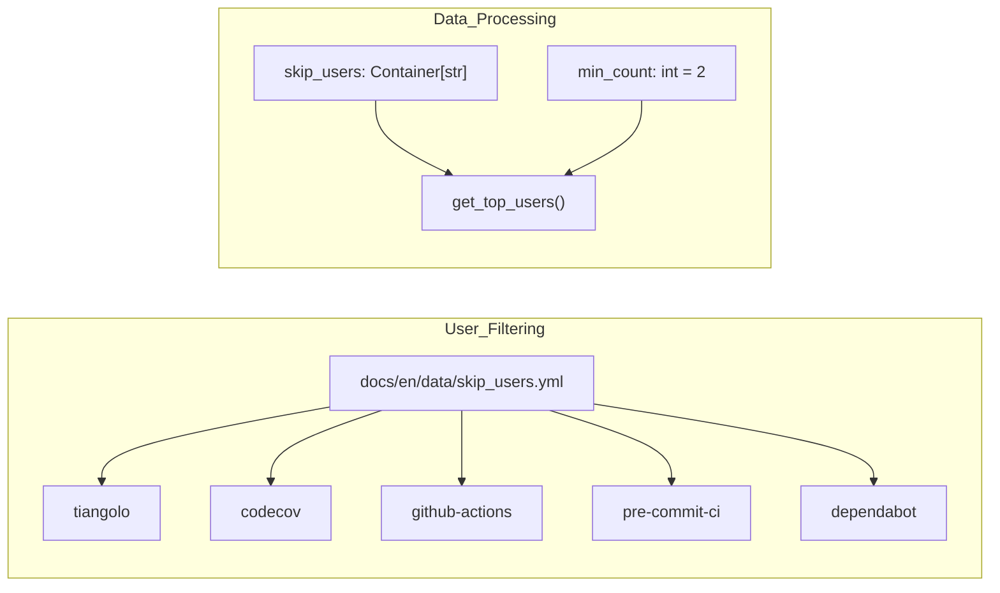
```mermaid
graph LR
    subgraph "User_Filtering"
        SKIP_USERS_YML["docs/en/data/skip_users.yml"]
        TIANGOLO["tiangolo"]
        CODECOV["codecov"] 
        GITHUB_ACTIONS["github-actions"]
        PRE_COMMIT_CI["pre-commit-ci"]
        DEPENDABOT["dependabot"]
    end
    
    subgraph "Data_Processing"
        GET_TOP_USERS["get_top_users()"]
        SKIP_USERS_CONTAINER["skip_users: Container[str]"]
        MIN_COUNT_CHECK["min_count: int = 2"]
    end
    
    SKIP_USERS_YML --> TIANGOLO
    SKIP_USERS_YML --> CODECOV
    SKIP_USERS_YML --> GITHUB_ACTIONS
    SKIP_USERS_YML --> PRE_COMMIT_CI
    SKIP_USERS_YML --> DEPENDABOT
    SKIP_USERS_CONTAINER --> GET_TOP_USERS
    MIN_COUNT_CHECK --> GET_TOP_USERS
```

The filtering ensures that bot accounts and the repository maintainer are not included in expert rankings, providing fair recognition for community members.

**Sources:** [docs/en/data/skip_users.yml:1-6](), [scripts/people.py:258-279]()

## Community Recognition and Display

The community data is rendered into a comprehensive recognition page that showcases different types of contributors across multiple categories and time periods.

### FastAPI People Page Structure

The `docs/en/docs/fastapi-people.md` file serves as the main community recognition page, using Jinja2 templating to dynamically display community member information.

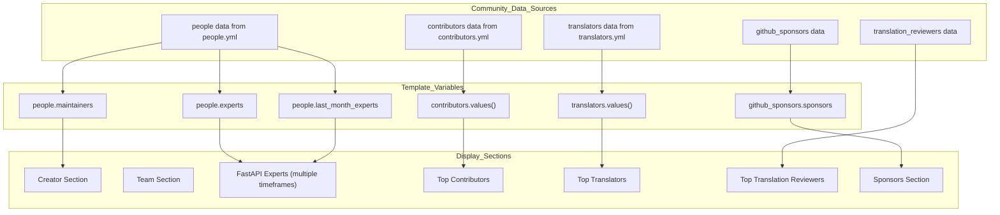
```mermaid
graph TD
    subgraph "Community_Data_Sources"
        PEOPLE_DATA["people data from people.yml"]
        CONTRIBUTORS_DATA["contributors data from contributors.yml"]
        TRANSLATORS_DATA["translators data from translators.yml"]
        TRANSLATION_REVIEWERS_DATA["translation_reviewers data"]
        SPONSORS_DATA["github_sponsors data"]
    end
    
    subgraph "Display_Sections"
        CREATOR_SECTION["Creator Section"]
        TEAM_SECTION["Team Section"]
        EXPERTS_SECTIONS["FastAPI Experts (multiple timeframes)"]
        CONTRIBUTORS_SECTION["Top Contributors"]
        TRANSLATORS_SECTION["Top Translators"]
        REVIEWERS_SECTION["Top Translation Reviewers"]
        SPONSORS_SECTION["Sponsors Section"]
    end
    
    subgraph "Template_Variables"
        PEOPLE_MAINTAINERS["people.maintainers"]
        PEOPLE_EXPERTS["people.experts"]
        PEOPLE_LAST_MONTH["people.last_month_experts"]
        CONTRIBUTORS_VALUES["contributors.values()"]
        TRANSLATORS_VALUES["translators.values()"]
        GITHUB_SPONSORS["github_sponsors.sponsors"]
    end
    
    PEOPLE_DATA --> PEOPLE_MAINTAINERS
    PEOPLE_DATA --> PEOPLE_EXPERTS
    PEOPLE_DATA --> PEOPLE_LAST_MONTH
    CONTRIBUTORS_DATA --> CONTRIBUTORS_VALUES
    TRANSLATORS_DATA --> TRANSLATORS_VALUES
    SPONSORS_DATA --> GITHUB_SPONSORS
    
    PEOPLE_MAINTAINERS --> CREATOR_SECTION
    PEOPLE_EXPERTS --> EXPERTS_SECTIONS
    PEOPLE_LAST_MONTH --> EXPERTS_SECTIONS
    CONTRIBUTORS_VALUES --> CONTRIBUTORS_SECTION
    TRANSLATORS_VALUES --> TRANSLATORS_SECTION
    TRANSLATION_REVIEWERS_DATA --> REVIEWERS_SECTION
    GITHUB_SPONSORS --> SPONSORS_SECTION
```

The page displays experts across multiple time windows: last month, 3 months, 6 months, 1 year, and all time, providing both recent and historical recognition.

**Sources:** [docs/en/docs/fastapi-people.md:75-82](), [docs/en/docs/fastapi-people.md:175-195](), [docs/en/docs/fastapi-people.md:199-217]()

### Dynamic User Lists and Statistics

The community page uses dynamic templating to display user information with avatars, contribution counts, and links to GitHub profiles.

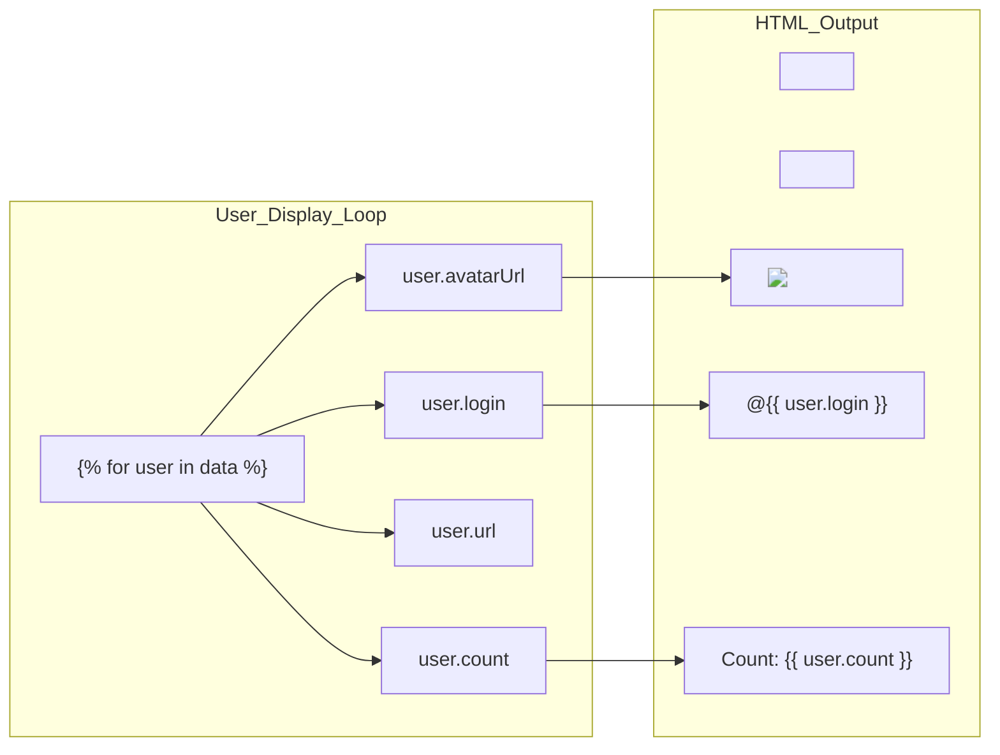
```mermaid
graph LR
    subgraph "User_Display_Loop"
        FOR_USER["{% for user in data %}"]
        USER_AVATAR["user.avatarUrl"]
        USER_LOGIN["user.login"] 
        USER_URL["user.url"]
        USER_COUNT["user.count"]
    end
    
    subgraph "HTML_Output"
        DIV_USER["<div class='user'>"]
        AVATAR_WRAPPER["<div class='avatar-wrapper'>"]
        IMG_TAG["<img src='{{ user.avatarUrl }}'/>"]
        TITLE_DIV["<div class='title'>@{{ user.login }}</div>"]
        COUNT_DIV["<div class='count'>Count: {{ user.count }}</div>"]
    end
    
    FOR_USER --> USER_AVATAR
    FOR_USER --> USER_LOGIN
    FOR_USER --> USER_URL
    FOR_USER --> USER_COUNT
    USER_AVATAR --> IMG_TAG
    USER_LOGIN --> TITLE_DIV
    USER_COUNT --> COUNT_DIV
```

Each user entry includes standardized fields: `login`, `count`, `avatarUrl`, and `url`, ensuring consistent display across all community sections.

**Sources:** [docs/en/docs/fastapi-people.md:89-98](), [docs/en/docs/fastapi-people.md:185-194](), [docs/en/docs/fastapi-people.md:207-216]()

## Data Processing and Update Mechanisms

The community ecosystem includes sophisticated data processing mechanisms that handle content updates, change detection, and automated commits.

### Content Update and Change Detection

The system implements content comparison and update logic to prevent unnecessary file modifications and commit noise.

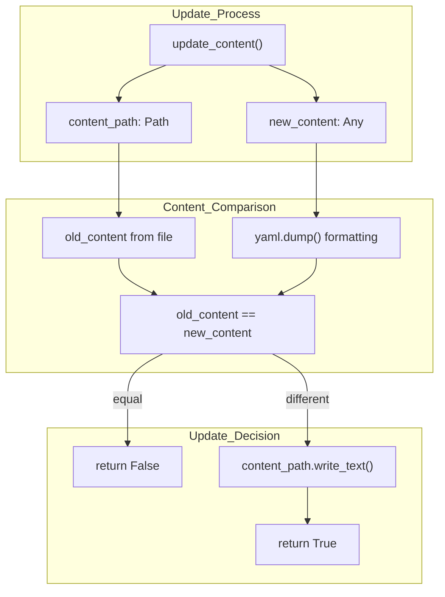
```mermaid
graph TD
    subgraph "Update_Process"
        UPDATE_CONTENT["update_content()"]
        CONTENT_PATH["content_path: Path"]
        NEW_CONTENT["new_content: Any"]
    end
    
    subgraph "Content_Comparison"
        OLD_CONTENT["old_content from file"]
        YAML_DUMP["yaml.dump() formatting"]
        CONTENT_COMPARISON["old_content == new_content"]
    end
    
    subgraph "Update_Decision"
        NO_CHANGE["return False"]
        WRITE_FILE["content_path.write_text()"]
        RETURN_TRUE["return True"]
    end
    
    UPDATE_CONTENT --> CONTENT_PATH
    UPDATE_CONTENT --> NEW_CONTENT
    CONTENT_PATH --> OLD_CONTENT
    NEW_CONTENT --> YAML_DUMP
    OLD_CONTENT --> CONTENT_COMPARISON
    YAML_DUMP --> CONTENT_COMPARISON
    CONTENT_COMPARISON -->|"equal"| NO_CHANGE
    CONTENT_COMPARISON -->|"different"| WRITE_FILE
    WRITE_FILE --> RETURN_TRUE
```

The system uses consistent YAML formatting with `sort_keys=False`, `width=200`, and `allow_unicode=True` to ensure stable content comparison.

**Sources:** [scripts/people.py:304-313](), [scripts/contributors.py:226-235]()

### Automated Git Operations and Pull Request Creation

The scripts include automated Git workflow management for creating pull requests with updated community data.

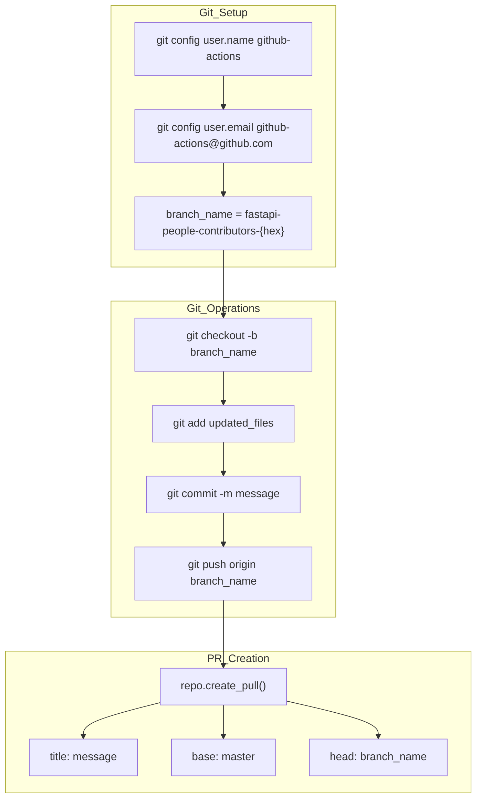
```mermaid
graph TD
    subgraph "Git_Setup"
        GIT_CONFIG_USER["git config user.name github-actions"]
        GIT_CONFIG_EMAIL["git config user.email github-actions@github.com"]
        BRANCH_NAME["branch_name = fastapi-people-contributors-{hex}"]
    end
    
    subgraph "Git_Operations"
        GIT_CHECKOUT["git checkout -b branch_name"]
        GIT_ADD["git add updated_files"]
        GIT_COMMIT["git commit -m message"]
        GIT_PUSH["git push origin branch_name"]
    end
    
    subgraph "PR_Creation"
        REPO_CREATE_PULL["repo.create_pull()"]
        PR_TITLE["title: message"]
        PR_BASE["base: master"]
        PR_HEAD["head: branch_name"]
    end
    
    GIT_CONFIG_USER --> GIT_CONFIG_EMAIL
    GIT_CONFIG_EMAIL --> BRANCH_NAME
    BRANCH_NAME --> GIT_CHECKOUT
    GIT_CHECKOUT --> GIT_ADD
    GIT_ADD --> GIT_COMMIT
    GIT_COMMIT --> GIT_PUSH
    GIT_PUSH --> REPO_CREATE_PULL
    REPO_CREATE_PULL --> PR_TITLE
    REPO_CREATE_PULL --> PR_BASE
    REPO_CREATE_PULL --> PR_HEAD
```

The automated workflow creates descriptive commit messages like "👥 Update FastAPI People - Contributors and Translators" and generates random branch names using `secrets.token_hex(4)`.

**Sources:** [scripts/contributors.py:284-311](), [scripts/people.py:367-394]()

# Contributors and Experts Management


This document covers FastAPI's automated system for recognizing and managing community contributors and experts. The system tracks GitHub Discussions participation, Pull Request contributions, translations, and sponsorship to create community recognition pages.

For information about the translation workflow automation, see [Translation Management](#7.2). For external sponsorship and community resources, see [External Resources and Sponsorship](#7.3).

## Purpose and Architecture

The Contributors and Experts Management system automatically identifies and recognizes community members across multiple contribution categories:

- **FastAPI Experts**: Users who help answer questions in GitHub Discussions
- **Contributors**: Users who create merged Pull Requests  
- **Translators**: Contributors who submit translation Pull Requests
- **Translation Reviewers**: Users who review and approve translations
- **Sponsors**: Financial supporters through GitHub Sponsors

The system operates through automated data collection scripts that query GitHub APIs, process contribution data, and generate YAML files consumed by documentation pages.

## Data Collection Architecture

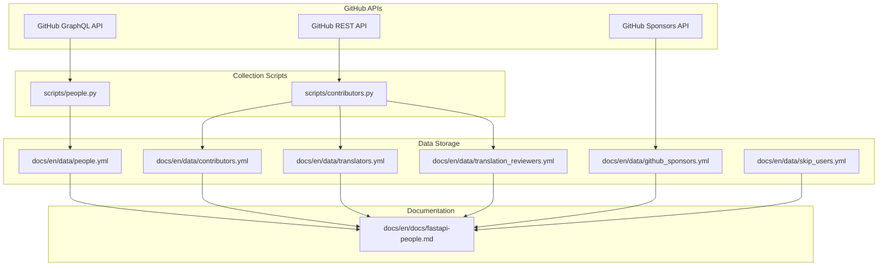
```mermaid
graph TD
    subgraph "GitHub APIs"
        GQL["GitHub GraphQL API"]
        REST["GitHub REST API"]
        SPONSORS["GitHub Sponsors API"]
    end
    
    subgraph "Collection Scripts"
        PEOPLE["scripts/people.py"]
        CONTRIB["scripts/contributors.py"]
    end
    
    subgraph "Data Storage"
        PEOPLE_YML["docs/en/data/people.yml"]
        CONTRIB_YML["docs/en/data/contributors.yml"]
        TRANS_YML["docs/en/data/translators.yml"]
        REVIEW_YML["docs/en/data/translation_reviewers.yml"]
        SPONSORS_YML["docs/en/data/github_sponsors.yml"]
        SKIP_YML["docs/en/data/skip_users.yml"]
    end
    
    subgraph "Documentation"
        PEOPLE_MD["docs/en/docs/fastapi-people.md"]
    end
    
    GQL --> PEOPLE
    REST --> CONTRIB
    SPONSORS --> SPONSORS_YML
    
    PEOPLE --> PEOPLE_YML
    CONTRIB --> CONTRIB_YML
    CONTRIB --> TRANS_YML
    CONTRIB --> REVIEW_YML
    
    PEOPLE_YML --> PEOPLE_MD
    CONTRIB_YML --> PEOPLE_MD
    TRANS_YML --> PEOPLE_MD
    REVIEW_YML --> PEOPLE_MD
    SPONSORS_YML --> PEOPLE_MD
    SKIP_YML --> PEOPLE_MD
```

**Data Collection and Documentation Flow**

Sources: [scripts/people.py:1-316](), [scripts/contributors.py:1-316](), [docs/en/data/people.yml:1-715](), [docs/en/docs/fastapi-people.md:1-306]()

## FastAPI Experts Detection System

The experts detection system analyzes GitHub Discussions to identify users who consistently help answer questions in the FastAPI community.

### Discussion Data Model

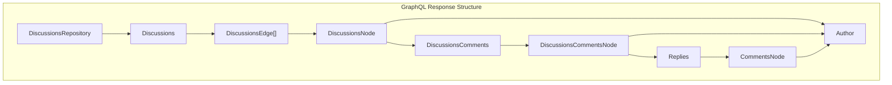
```mermaid
graph TD
    subgraph "GraphQL Response Structure"
        REPO["DiscussionsRepository"]
        DISCUSSIONS["Discussions"]
        EDGES["DiscussionsEdge[]"]
        NODE["DiscussionsNode"]
        COMMENTS["DiscussionsComments"]
        COMMENT_NODE["DiscussionsCommentsNode"]
        REPLIES["Replies"]
        REPLY_NODE["CommentsNode"]
        AUTHOR["Author"]
    end
    
    REPO --> DISCUSSIONS
    DISCUSSIONS --> EDGES
    EDGES --> NODE
    NODE --> COMMENTS
    NODE --> AUTHOR
    COMMENTS --> COMMENT_NODE
    COMMENT_NODE --> REPLIES
    COMMENT_NODE --> AUTHOR
    REPLIES --> REPLY_NODE
    REPLY_NODE --> AUTHOR
```

**GitHub Discussions Data Structure**

The system uses specific Pydantic models to parse GitHub GraphQL responses:

| Model | Purpose | Key Fields |
|-------|---------|------------|
| `DiscussionsNode` | Individual discussion thread | `number`, `author`, `createdAt`, `comments` |
| `DiscussionsCommentsNode` | Comment within discussion | `createdAt`, `author`, `replies` |
| `Author` | User information | `login`, `avatarUrl`, `url` |
| `DiscussionExpertsResults` | Aggregated results | `commenters`, time-based counters, `authors` |

Sources: [scripts/people.py:64-177]()

### Expert Identification Algorithm

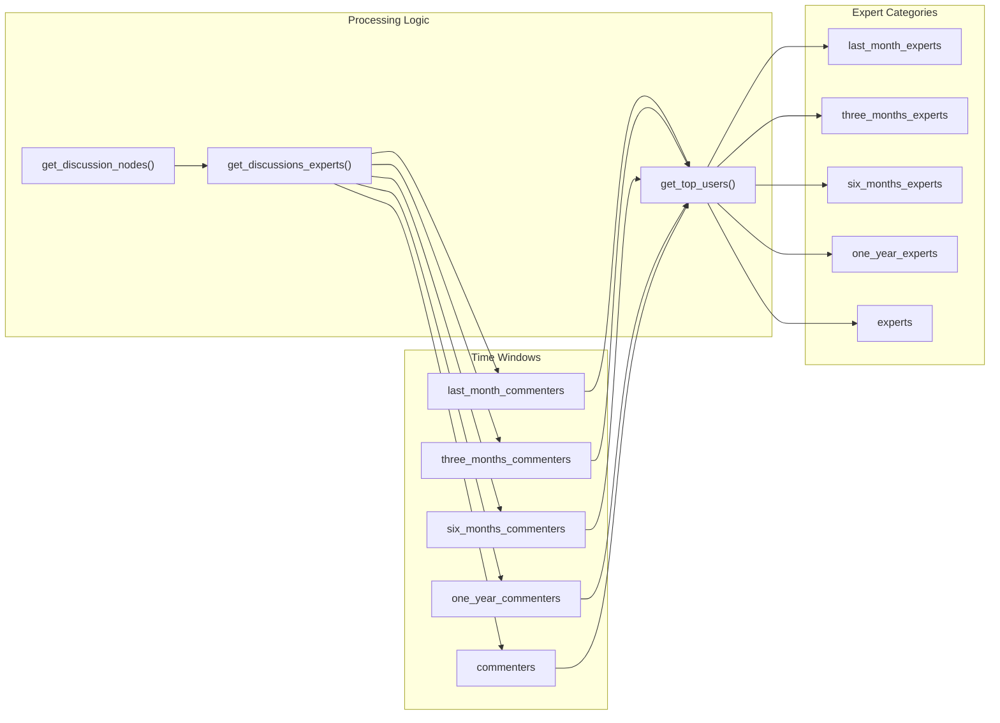
```mermaid
graph LR
    subgraph "Time Windows"
        MONTH["last_month_commenters"]
        THREE["three_months_commenters"] 
        SIX["six_months_commenters"]
        YEAR["one_year_commenters"]
        ALL["commenters"]
    end
    
    subgraph "Processing Logic"
        GET_DISCUSSIONS["get_discussion_nodes()"]
        ANALYZE["get_discussions_experts()"]
        FILTER["get_top_users()"]
    end
    
    subgraph "Expert Categories"
        MONTH_EXPERTS["last_month_experts"]
        THREE_EXPERTS["three_months_experts"] 
        SIX_EXPERTS["six_months_experts"]
        YEAR_EXPERTS["one_year_experts"]
        ALL_EXPERTS["experts"]
    end
    
    GET_DISCUSSIONS --> ANALYZE
    ANALYZE --> MONTH
    ANALYZE --> THREE
    ANALYZE --> SIX
    ANALYZE --> YEAR
    ANALYZE --> ALL
    
    MONTH --> FILTER
    THREE --> FILTER
    SIX --> FILTER
    YEAR --> FILTER  
    ALL --> FILTER
    
    FILTER --> MONTH_EXPERTS
    FILTER --> THREE_EXPERTS
    FILTER --> SIX_EXPERTS
    FILTER --> YEAR_EXPERTS
    FILTER --> ALL_EXPERTS
```

**Expert Detection Algorithm Flow**

The algorithm tracks participation over multiple time windows:
- **Last Month**: 30 days ago to now
- **3 Months**: 90 days ago to now  
- **6 Months**: 180 days ago to now
- **1 Year**: 365 days ago to now
- **All Time**: Complete history

Key logic in `get_discussions_experts()`:
1. Excludes discussion authors from being counted as helpers for their own discussions
2. Tracks the most recent comment time per user per discussion
3. Increments counters based on time window inclusion
4. Uses `Counter[str]` for efficient counting and ranking

Sources: [scripts/people.py:195-255](), [scripts/people.py:258-280]()

## Contributors and Translations System

The contributors system analyzes Pull Requests to categorize different types of contributions and identify translation workflow participants.

### Pull Request Analysis Pipeline

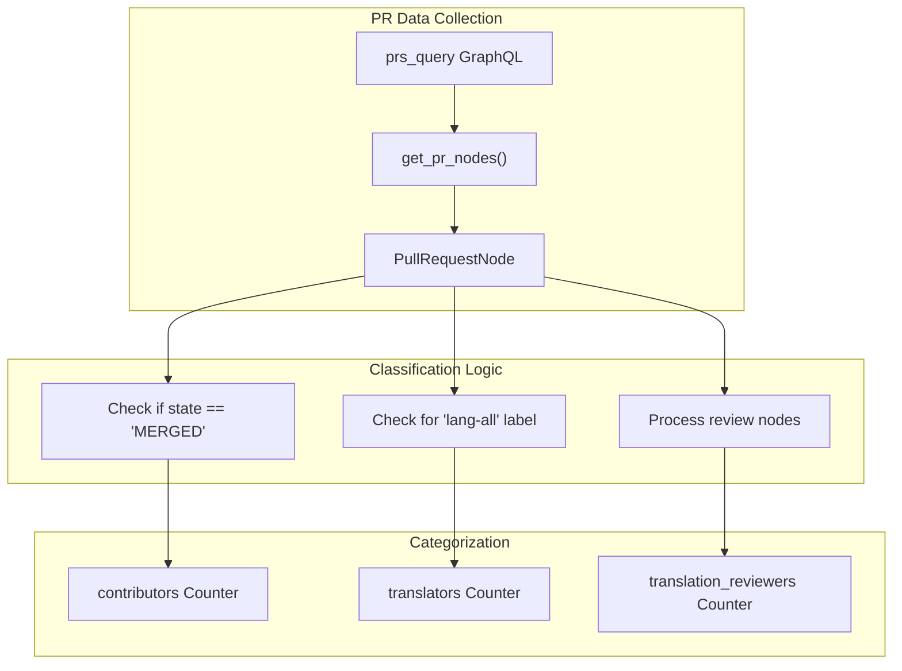
```mermaid
graph TD
    subgraph "PR Data Collection"
        PRS_QUERY["prs_query GraphQL"]
        GET_PR_NODES["get_pr_nodes()"]
        PR_NODE["PullRequestNode"]
    end
    
    subgraph "Classification Logic"
        CHECK_LABELS["Check for 'lang-all' label"]
        CHECK_STATE["Check if state == 'MERGED'"]
        CHECK_REVIEWS["Process review nodes"]
    end
    
    subgraph "Categorization"
        CONTRIBUTORS["contributors Counter"]
        TRANSLATORS["translators Counter"] 
        REVIEWERS["translation_reviewers Counter"]
    end
    
    PRS_QUERY --> GET_PR_NODES
    GET_PR_NODES --> PR_NODE
    PR_NODE --> CHECK_LABELS
    PR_NODE --> CHECK_STATE
    PR_NODE --> CHECK_REVIEWS
    
    CHECK_LABELS --> TRANSLATORS
    CHECK_STATE --> CONTRIBUTORS
    CHECK_REVIEWS --> REVIEWERS
```

**Pull Request Processing Pipeline**

The system distinguishes contributions by analyzing PR metadata:

| Contribution Type | Detection Logic | Counter |
|------------------|----------------|---------|
| **Regular Contributor** | Merged PR without `lang-all` label | `contributors` |
| **Translator** | Merged PR with `lang-all` label | `translators` |
| **Translation Reviewer** | Review on PR with `lang-all` label | `translation_reviewers` |

Sources: [scripts/contributors.py:175-204]()

### Data Output Structure

The processed data generates multiple YAML files with consistent structure:

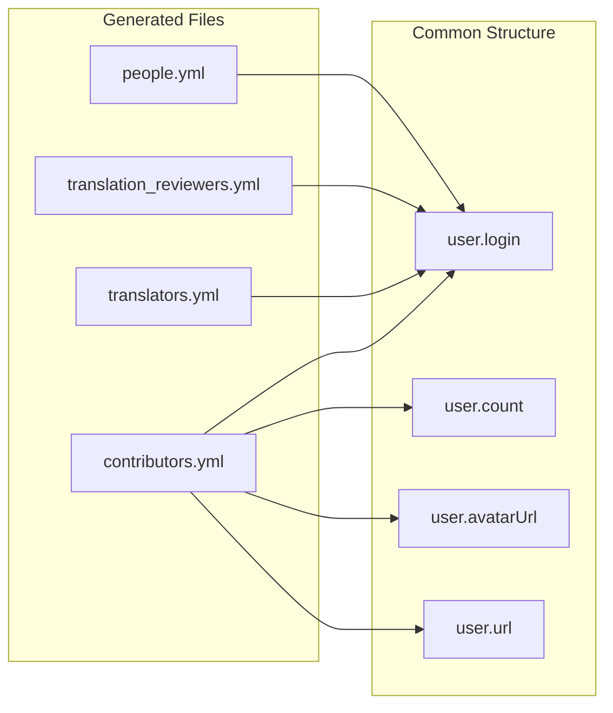
```mermaid
graph LR
    subgraph "Generated Files"
        CONTRIB_DATA["contributors.yml"]
        TRANS_DATA["translators.yml"] 
        REVIEW_DATA["translation_reviewers.yml"]
        PEOPLE_DATA["people.yml"]
    end
    
    subgraph "Common Structure"
        USER_LOGIN["user.login"]
        USER_COUNT["user.count"]
        USER_AVATAR["user.avatarUrl"]
        USER_URL["user.url"]
    end
    
    CONTRIB_DATA --> USER_LOGIN
    CONTRIB_DATA --> USER_COUNT
    CONTRIB_DATA --> USER_AVATAR
    CONTRIB_DATA --> USER_URL
    
    TRANS_DATA --> USER_LOGIN
    REVIEW_DATA --> USER_LOGIN
    PEOPLE_DATA --> USER_LOGIN
```

**Standardized User Data Structure**

All user data follows the pattern established by the `get_users_to_write()` function, ensuring consistency across different contribution types.

Sources: [scripts/contributors.py:207-224](), [scripts/people.py:282-301]()

## Automated Updates and Git Integration

Both collection scripts include automated Git workflow integration for updating community data.

### Update Workflow

| Step | Function | Purpose |
|------|----------|---------|
| **Data Collection** | `main()` | Execute GitHub API queries |
| **Content Comparison** | `update_content()` | Check if data changed |
| **Git Configuration** | `subprocess.run()` | Set up GitHub Actions user |
| **Branch Creation** | `git checkout -b` | Create update branch |
| **Pull Request** | `repo.create_pull()` | Submit changes for review |

The system only creates PRs when data has actually changed, using YAML content comparison:

```python
def update_content(*, content_path: Path, new_content: Any) -> bool:
    old_content = content_path.read_text(encoding="utf-8")
    new_content = yaml.dump(new_content, sort_keys=False, width=200, allow_unicode=True)
    if old_content == new_content:
        return False
```

Sources: [scripts/people.py:304-314](), [scripts/contributors.py:226-235](), [scripts/contributors.py:284-311]()

## Configuration and Security

### Settings Management

Both scripts use Pydantic Settings for configuration:

| Setting | Purpose | Default |
|---------|---------|---------|
| `github_token` | GitHub API authentication | Required |
| `github_repository` | Target repository | Required |
| `httpx_timeout` | API request timeout | 30 seconds |
| `sleep_interval` | Rate limiting delay | 5 seconds |

The `sleep_interval` in `people.py` handles GitHub's secondary rate limits for GraphQL queries.

### User Filtering

The system excludes certain automated users via `skip_users.yml`:
- `tiangolo` (project creator, counted separately)
- `codecov`, `github-actions`, `pre-commit-ci`, `dependabot` (bots)

Sources: [scripts/people.py:118-123](), [scripts/contributors.py:115-119](), [docs/en/data/skip_users.yml:1-6]()

## Documentation Integration

The community data integrates into documentation through template rendering in `fastapi-people.md`:

### Template Variables

| Variable | Source | Usage |
|----------|--------|--------|
| `people.experts` | `people.yml` | All-time FastAPI experts list |
| `people.last_month_experts` | `people.yml` | Recent experts |
| `contributors` | `contributors.yml` | Top contributors |
| `translators` | `translators.yml` | Top translators |
| `translation_reviewers` | `translation_reviewers.yml` | Top reviewers |
| `github_sponsors` | `github_sponsors.yml` | Sponsor information |

The documentation uses Jinja2-style templating to render user lists with avatars, usernames, and contribution counts.

Sources: [docs/en/docs/fastapi-people.md:17-293]()

# Translation Management


This document covers FastAPI's AI-powered translation workflow, which automatically translates documentation into multiple languages and coordinates community review through GitHub Discussions and automated workflows.

For information about the broader documentation system architecture, see [Documentation System](#6.1). For community management aspects, see [Contributors and Experts Management](#7.1).

## Overview

FastAPI maintains documentation in 11+ languages through an automated translation system that combines AI-powered translation with community review processes. The system uses OpenAI's GPT-4o model to translate English documentation, manages file synchronization across languages, and coordinates review workflows through GitHub Discussions.

## Core Translation Engine

### AI Translation Agent

The translation system centers around the `Agent` class from pydantic-ai, configured with OpenAI's GPT-4o model. The `translate_page()` function in [scripts/translate.py:97-158]() handles individual page translation with sophisticated prompt engineering.

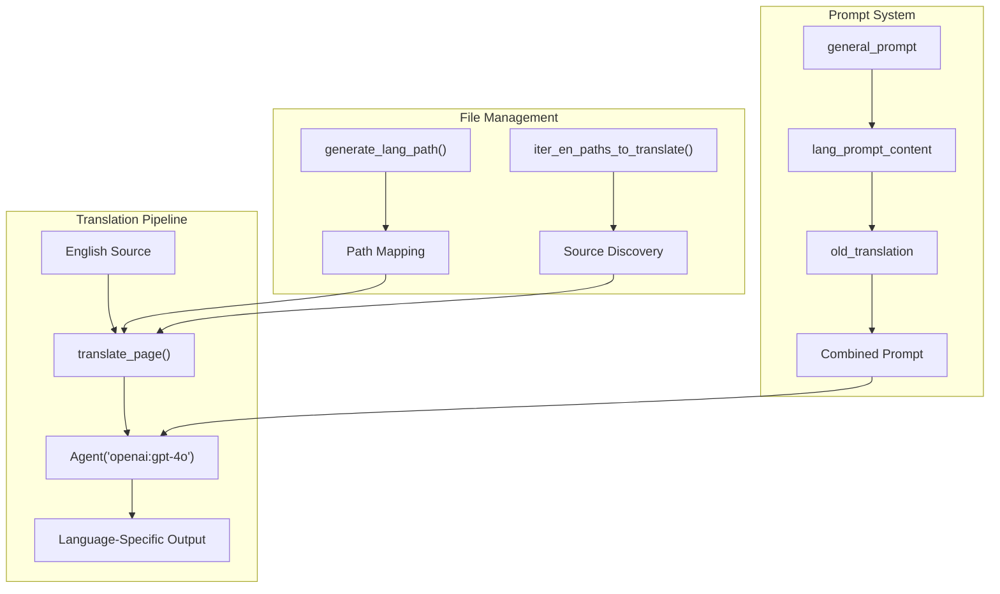
```mermaid
flowchart TD
    subgraph "Translation Pipeline"
        A["English Source"] --> B["translate_page()"]
        B --> C["Agent('openai:gpt-4o')"]
        C --> D["Language-Specific Output"]
    end
    
    subgraph "Prompt System"
        E["general_prompt"] --> F["lang_prompt_content"]
        F --> G["old_translation"]
        G --> H["Combined Prompt"]
    end
    
    subgraph "File Management"
        I["generate_lang_path()"] --> J["Path Mapping"]
        K["iter_en_paths_to_translate()"] --> L["Source Discovery"]
    end
    
    H --> C
    J --> B
    L --> B
```

**Translation Pipeline Architecture**

The system uses a multi-layered prompting approach. The `general_prompt` variable [scripts/translate.py:26-66]() provides base translation instructions, while language-specific prompts from `docs/{lang}/llm-prompt.md` files add terminology guidelines and style preferences.

Sources: [scripts/translate.py:122-157](), [scripts/translate.py:26-66]()

### File Organization and Path Mapping

The translation system maintains a structured file organization where English documentation in `docs/en/docs/` maps to translated versions in `docs/{lang}/docs/`. Two key functions handle this mapping:

| Function | Purpose | Input | Output |
|----------|---------|--------|--------|
| `generate_lang_path()` | English → Translated path | `docs/en/docs/tutorial/first-steps.md` | `docs/es/docs/tutorial/first-steps.md` |
| `generate_en_path()` | Translated → English path | `docs/es/docs/tutorial/first-steps.md` | `docs/en/docs/tutorial/first-steps.md` |

The `non_translated_sections` tuple [scripts/translate.py:14-23]() excludes specific content types like API reference, release notes, and management documentation from automatic translation.

Sources: [scripts/translate.py:76-94](), [scripts/translate.py:14-23]()

### Translation Commands and Workflows

The CLI interface provides multiple translation commands through the `typer` app:

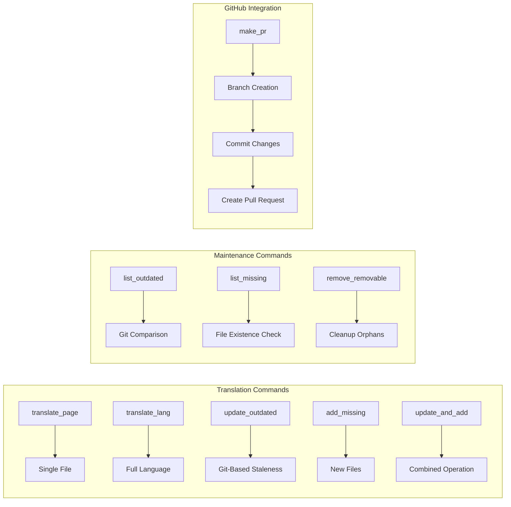
```mermaid
flowchart LR
    subgraph "Translation Commands"
        A["translate_page"] --> B["Single File"]
        C["translate_lang"] --> D["Full Language"]
        E["update_outdated"] --> F["Git-Based Staleness"]
        G["add_missing"] --> H["New Files"]
        I["update_and_add"] --> J["Combined Operation"]
    end
    
    subgraph "Maintenance Commands"
        K["list_outdated"] --> L["Git Comparison"]
        M["list_missing"] --> N["File Existence Check"]
        O["remove_removable"] --> P["Cleanup Orphans"]
    end
    
    subgraph "GitHub Integration"
        Q["make_pr"] --> R["Branch Creation"]
        R --> S["Commit Changes"]
        S --> T["Create Pull Request"]
    end
```

**Translation Command Architecture**

The `list_outdated()` function [scripts/translate.py:276-295]() uses Git commit timestamps to identify translations that need updates when English source files have been modified more recently than their translated counterparts.

Sources: [scripts/translate.py:192-324](), [scripts/translate.py:276-295]()

## GitHub Actions Integration

### Automated Translation Workflow

The GitHub Actions workflow `.github/workflows/translate.yml` provides a manual dispatch interface for running translation operations with different commands and target languages.

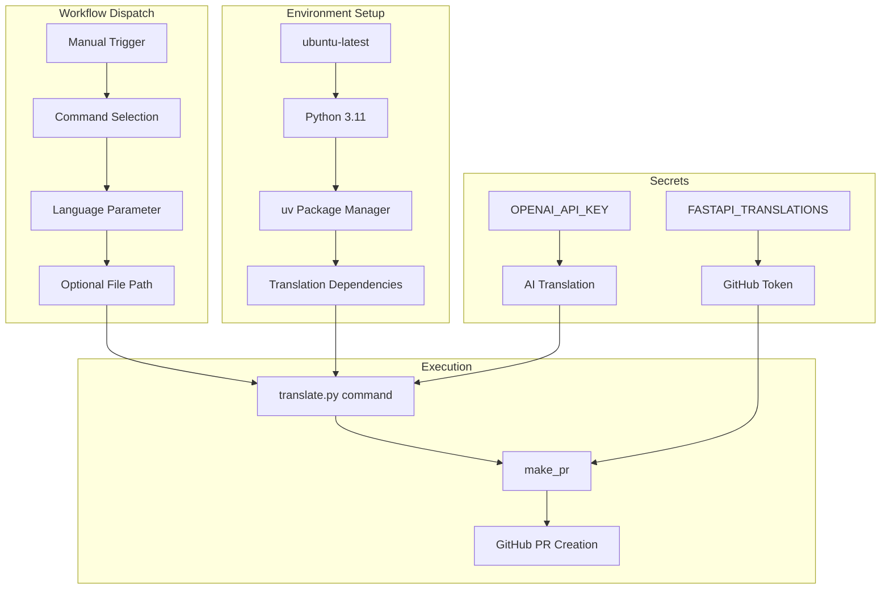
```mermaid
flowchart TD
    subgraph "Workflow Dispatch"
        A["Manual Trigger"] --> B["Command Selection"]
        B --> C["Language Parameter"]
        C --> D["Optional File Path"]
    end
    
    subgraph "Environment Setup"
        E["ubuntu-latest"] --> F["Python 3.11"]
        F --> G["uv Package Manager"]
        G --> H["Translation Dependencies"]
    end
    
    subgraph "Execution"
        I["translate.py command"] --> J["make_pr"]
        J --> K["GitHub PR Creation"]
    end
    
    subgraph "Secrets"
        L["FASTAPI_TRANSLATIONS"] --> M["GitHub Token"]
        N["OPENAI_API_KEY"] --> O["AI Translation"]
    end
    
    D --> I
    H --> I
    M --> J
    O --> I
```

**GitHub Actions Translation Workflow**

The workflow supports command options including `translate-page`, `translate-lang`, `update-outdated`, `add-missing`, `update-and-add`, and `remove-all-removable` [.github/workflows/translate.yml:10-19]().

Sources: [.github/workflows/translate.yml:1-78]()

### Pull Request Creation

The `make_pr()` function [scripts/translate.py:328-367]() handles automated PR creation with Git configuration, branch management, and GitHub API integration through the `PyGithub` library.

Sources: [scripts/translate.py:328-367]()

## Community Coordination System

### GitHub Discussions Integration

The notification system in `scripts/notify_translations.py` coordinates translation reviews through GitHub Discussions using GraphQL queries to track translation PRs and notify community reviewers.

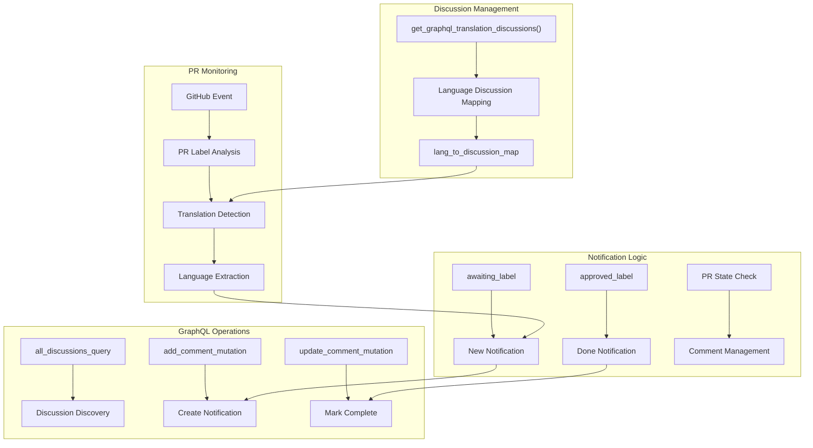
```mermaid
flowchart TD
    subgraph "Discussion Management"
        A["get_graphql_translation_discussions()"] --> B["Language Discussion Mapping"]
        B --> C["lang_to_discussion_map"]
    end
    
    subgraph "PR Monitoring"
        D["GitHub Event"] --> E["PR Label Analysis"]
        E --> F["Translation Detection"]
        F --> G["Language Extraction"]
    end
    
    subgraph "Notification Logic"
        H["awaiting_label"] --> I["New Notification"]
        J["approved_label"] --> K["Done Notification"]
        L["PR State Check"] --> M["Comment Management"]
    end
    
    subgraph "GraphQL Operations"
        N["all_discussions_query"] --> O["Discussion Discovery"]
        P["add_comment_mutation"] --> Q["Create Notification"]
        R["update_comment_mutation"] --> S["Mark Complete"]
    end
    
    C --> F
    G --> I
    I --> Q
    K --> S
```

**GitHub Discussions Coordination Architecture**

The system uses specific labels for translation workflow management: `awaiting-review`, `lang-all`, and `approved-1` [scripts/notify_translations.py:13-15](). The `questions_translations_category_id` constant [scripts/notify_translations.py:19]() identifies the GitHub Discussions category for translation coordination.

Sources: [scripts/notify_translations.py:13-15](), [scripts/notify_translations.py:21-84](), [scripts/notify_translations.py:349-373]()

### Review Workflow States

The notification system tracks three primary states for translation PRs:

| State | Trigger | Action | Message Type |
|-------|---------|--------|--------------|
| **Awaiting Review** | `awaiting-review` label | Create notification | `new_translation_message` |
| **Approved/Closed** | `approved-1` label or closed | Update to done | `done_translation_message` |
| **Already Notified** | Existing comment | Skip action | No change |

Sources: [scripts/notify_translations.py:360-427]()

## Language Configuration

### Language-Specific Prompts

Each supported language has a dedicated prompt file at `docs/{lang}/llm-prompt.md` that provides translation guidelines, terminology preferences, and style instructions. The Spanish prompt file [docs/es/llm-prompt.md:1-99]() exemplifies this approach with specific translation rules for technical terms.

### Language Registry

The `get_langs()` function [scripts/translate.py:72-73]() loads language configurations from `docs/language_names.yml`, providing the mapping between language codes and display names used throughout the translation system.

Sources: [scripts/translate.py:72-73](), [docs/es/llm-prompt.md:1-99]()

## Quality Control and Diff Minimization

### Incremental Translation Updates

The translation system implements sophisticated diff minimization to preserve existing translations when updating content. When `old_translation` exists [scripts/translate.py:128-144](), the system instructs the AI to minimize changes by preserving correct lines and only updating content that reflects changes in the English source.

### Technical Term Preservation

The `general_prompt` includes specific instructions for handling code snippets, technical terms, and markdown formatting [scripts/translate.py:27-37](). Code fragments surrounded by backticks remain untranslated, and console/terminal examples preserve their original English content.

Sources: [scripts/translate.py:128-144](), [scripts/translate.py:27-37]()

## Integration Points

The translation management system integrates with several other FastAPI infrastructure components:

- **Documentation Build System**: Translated files feed into the MkDocs build pipeline covered in [Documentation System](#6.1)
- **CI/CD Pipeline**: Translation workflows integrate with the broader automation system described in [CI/CD Pipeline](#6.2)
- **Community Management**: Translation coordination connects with contributor recognition systems detailed in [Contributors and Experts Management](#7.1)

Sources: [scripts/translate.py:1-371](), [.github/workflows/translate.yml:1-78](), [scripts/notify_translations.py:1-433]()

# External Resources and Sponsorship


This document covers the FastAPI project's external resources management system and sponsorship infrastructure. It explains how the project organizes and maintains community-contributed content, manages sponsorship information, and facilitates community engagement across multiple languages.

For information about contributor recognition and GitHub discussions experts, see [Contributors and Experts Management](#7.1). For details about translation coordination, see [Translation Management](#7.2).

## External Links Management System

The FastAPI project maintains a comprehensive database of external resources including articles, podcasts, talks, and GitHub repositories. This system is implemented through a structured YAML data file that feeds into documentation generation.

### Data Structure and Organization

The external links system uses a hierarchical YAML structure to organize content by type and language:

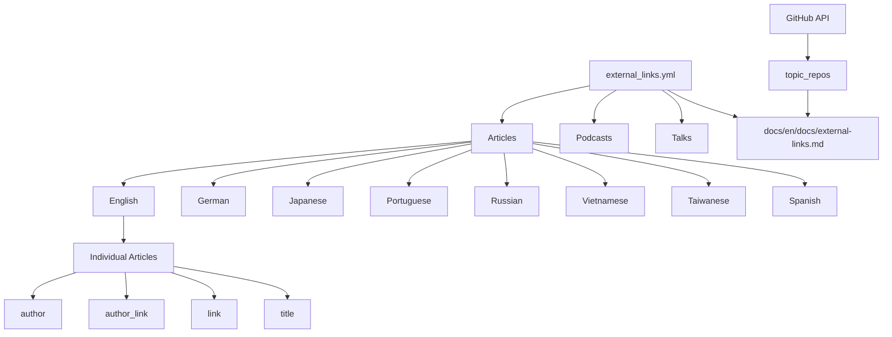
```mermaid
graph TD
    A["external_links.yml"] --> B["Articles"]
    A --> C["Podcasts"] 
    A --> D["Talks"]
    
    B --> E["English"]
    B --> F["German"]
    B --> G["Japanese"]
    B --> H["Portuguese"]
    B --> I["Russian"]
    B --> J["Vietnamese"]
    B --> K["Taiwanese"]
    B --> L["Spanish"]
    
    E --> M["Individual Articles"]
    M --> N["author"]
    M --> O["author_link"]
    M --> P["link"]
    M --> Q["title"]
    
    R["GitHub API"] --> S["topic_repos"]
    S --> T["External Links Page"]
    
    A --> T["docs/en/docs/external-links.md"]
```

**External Links Data Flow Architecture**

Sources: [docs/en/data/external_links.yml:1-419](), [docs/en/docs/external-links.md:1-40]()

### Content Categories and Structure

The system organizes external resources into three main categories:

| Category | Purpose | Data Fields |
|----------|---------|-------------|
| Articles | Blog posts, tutorials, guides | `author`, `author_link`, `link`, `title` |
| Podcasts | Audio content about FastAPI | `author`, `author_link`, `link`, `title` |
| Talks | Conference presentations, videos | `author`, `author_link`, `link`, `title` |

Each content item contains standardized metadata fields that enable consistent rendering and attribution across all languages.

### GitHub Repository Integration

The system automatically fetches and displays GitHub repositories with the `fastapi` topic:

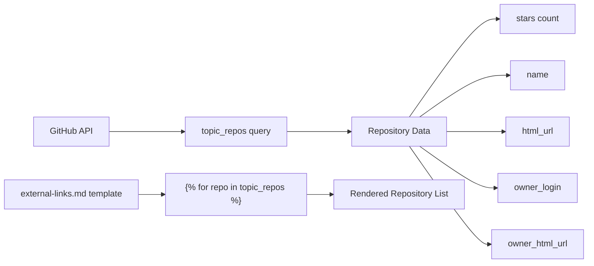
```mermaid
graph LR
    A["GitHub API"] --> B["topic_repos query"]
    B --> C["Repository Data"]
    C --> D["stars count"]
    C --> E["name"]
    C --> F["html_url"]
    C --> G["owner_login"]
    C --> H["owner_html_url"]
    
    I["external-links.md template"] --> J["{% for repo in topic_repos %}"]
    J --> K["Rendered Repository List"]
```

**GitHub Repository Data Integration**

Sources: [docs/en/docs/external-links.md:31-39]()

## Sponsorship Management Infrastructure

The FastAPI project implements a multi-tiered sponsorship system that supports both direct project sponsorship and ecosystem tool sponsorship.

### Primary Sponsorship Structure

```mermaid
graph TD
    A["FastAPI Sponsorship"] --> B["GitHub Sponsors"]
    B --> C["tiangolo"]
    
    D["Ecosystem Sponsorship"] --> E["Pydantic"]
    D --> F["Starlette/Uvicorn"]
    
    E --> G["Samuel Colvin"]
    F --> H["Encode"]
    
    I["Community Benefits"] --> J["Documentation Badges"]
    I --> K["Recognition"]
    I --> L["Support Tiers"]
    
    C --> I
    G --> I
    H --> I
```

**Sponsorship Ecosystem Architecture**

The sponsorship system recognizes that FastAPI depends on foundational tools and encourages supporting the entire ecosystem.

Sources: [docs/en/docs/help-fastapi.md:250-257](), [docs/zh/docs/help-fastapi.md:129-145]()

### Multi-Language Sponsorship Documentation

The sponsorship information is maintained across multiple language versions with consistent messaging:

| Language | File Path | Key Sections |
|----------|-----------|--------------|
| English | `docs/en/docs/help-fastapi.md` | Sponsor author, ecosystem tools |
| Chinese | `docs/zh/docs/help-fastapi.md` | 赞助作者, 赞助工具 |
| French | `docs/fr/docs/help-fastapi.md` | Parrainer l'auteur, outils |
| Polish | `docs/pl/docs/help-fastapi.md` | Wspieraj autora, narzędzia |
| Russian | `docs/ru/docs/help-fastapi.md` | Спонсировать автора |
| Portuguese | `docs/pt/docs/help-fastapi.md` | Patrocine o autor |
| Japanese | `docs/ja/docs/help-fastapi.md` | スポンサーになる |

Sources: [docs/en/docs/help-fastapi.md:250-257](), [docs/zh/docs/help-fastapi.md:129-148](), [docs/fr/docs/help-fastapi.md:87-104]()

## Community Engagement Systems

The project implements comprehensive systems for community engagement that integrate with external platforms and resources.

### Help and Support Infrastructure

```mermaid
graph TD
    A["Community Help System"] --> B["GitHub Discussions"]
    A --> C["GitHub Issues"]
    A --> D["Discord Chat"]
    
    E["Getting Help"] --> F["Newsletter Subscription"]
    E --> G["X/Twitter Following"]
    E --> H["GitHub Watching"]
    
    I["Providing Help"] --> J["Answer Questions"]
    I --> K["Review PRs"]
    I --> L["Create Content"]
    
    M["Recognition"] --> N["FastAPI Expert Status"]
    M --> O["Contributor Acknowledgment"]
    
    J --> N
    K --> N
    L --> P["external_links.yml"]
    P --> Q["Community Visibility"]
```

**Community Engagement Flow**

Sources: [docs/en/docs/help-fastapi.md:72-125](), [docs/en/docs/help-fastapi.md:213-227]()

### External Content Contribution Process

Contributors can add their FastAPI-related content through a structured process:

1. **Content Creation**: Authors create articles, videos, podcasts, or talks about FastAPI
2. **Submission**: Contributors edit the `external_links.yml` file via GitHub PR
3. **Placement**: New links are added to the beginning of the appropriate section
4. **Review**: The FastAPI team reviews and merges the contribution
5. **Publication**: Content appears on the external links documentation page

```mermaid
graph LR
    A["Content Creator"] --> B["Create FastAPI Content"]
    B --> C["Fork Repository"]
    C --> D["Edit external_links.yml"]
    D --> E["Submit Pull Request"]
    E --> F["Review Process"]
    F --> G["Merge to Master"]
    G --> H["Documentation Rebuild"]
    H --> I["Public Visibility"]
    
    J["Link Placement Rules"] --> K["Start of Section"]
    J --> L["Proper Category"]
    J --> M["Language Organization"]
```

**External Content Contribution Workflow**

Sources: [docs/en/docs/help-fastapi.md:201-203](), [docs/en/docs/external-links.md:10-12]()

## Implementation Details

### Data Processing Pipeline

The external resources system uses a template-based approach to render the YAML data into documentation:

```mermaid
graph TD
    A["external_links.yml"] --> B["MkDocs Processing"]
    B --> C["Jinja2 Template"]
    C --> D["external-links.md"]
    
    E["Template Logic"] --> F["{% for section_name, section_content in external_links.items() %}"]
    F --> G["{% for lang_name, lang_content in section_content.items() %}"]
    G --> H["{% for item in lang_content %}"]
    
    I["GitHub API Integration"] --> J["topic_repos data"]
    J --> K["Repository rendering"]
    
    L["Build Process"] --> M["Static Site Generation"]
    M --> N["Multi-language Sites"]
```

**Data Processing and Rendering Pipeline**

The template system iterates through the hierarchical YAML structure to generate organized documentation sections for each content type and language.

Sources: [docs/en/docs/external-links.md:15-29](), [docs/en/docs/external-links.md:35-39]()

### Maintenance and Quality Assurance

The system includes several mechanisms to ensure content quality and relevance:

- **Structured Data Validation**: YAML schema enforcement for required fields
- **Link Placement Rules**: New content added to section beginnings for visibility
- **Multi-language Consistency**: Parallel structure across all language versions
- **Community Review**: Pull request review process for all submissions
- **Automated GitHub Integration**: Dynamic repository listings via GitHub API

Sources: [docs/en/data/external_links.yml:1-419](), [docs/en/docs/help-fastapi.md:201-203]()

# Community Automation


This document covers the automated systems that manage community interactions and notifications within the FastAPI project. These systems handle notifications for documentation deployments, translation reviews, and other community-driven activities through GitHub integrations.

For information about contributor tracking and expert identification, see [Contributors and Experts Management](#7.1). For details about the translation workflow itself, see [Translation Management](#7.2).

## Overview

The FastAPI project uses two primary automation scripts to manage community notifications:

| System | Purpose | Trigger |
|--------|---------|---------|
| Documentation Deployment Notifications | Notify PRs about documentation preview deployments | GitHub Actions workflow completion |
| Translation Community Notifications | Notify language communities about translation PRs | PR label changes |

## Documentation Deployment Notifications

The `deploy_docs_status` system automatically updates pull requests with documentation preview links and deployment status information when documentation changes are detected.

### Core Functionality

The system operates through the `Settings` class which configures GitHub repository access and deployment parameters:

```mermaid
graph TD
    subgraph "deploy_docs_status.py"
        Settings["Settings"]
        LinkData["LinkData"]
        main_func["main()"]
    end
    
    subgraph "GitHub Integration"
        GitHub_API["Github API"]
        PR_object["Pull Request"]
        commit_status["Commit Status"]
        pr_comment["PR Comment"]
    end
    
    subgraph "Documentation Processing"
        docs_files["docs/ files"]
        lang_links["lang_links dict"]
        preview_links["Preview Links"]
    end
    
    Settings --> main_func
    main_func --> GitHub_API
    GitHub_API --> PR_object
    main_func --> docs_files
    docs_files --> lang_links
    lang_links --> LinkData
    LinkData --> preview_links
    preview_links --> pr_comment
    main_func --> commit_status
    
    PR_object --> commit_status
    PR_object --> pr_comment
```

### Status Management

The system creates different commit statuses based on deployment state:

- **Pending**: When deployment is in progress [scripts/deploy_docs_status.py:50-57]()
- **Success (No Changes)**: When no documentation files were modified [scripts/deploy_docs_status.py:40-48]()
- **Success (Deployed)**: When documentation is successfully deployed [scripts/deploy_docs_status.py:58-63]()

### Link Generation Process

The system processes documentation files to generate preview links using regex matching:

1. Identifies files matching pattern `docs/([^/]+)/docs/(.*)` [scripts/deploy_docs_status.py:71-74]()
2. Converts file paths to URL paths by handling `index.md` and `.md` extensions [scripts/deploy_docs_status.py:76-84]()
3. Generates `LinkData` objects containing preview, previous, and English reference links [scripts/deploy_docs_status.py:85-91]()

**Sources:** [scripts/deploy_docs_status.py:1-126]()

## Translation Community Notifications

The `notify_translations` system manages notifications to language-specific discussion threads when translation pull requests are opened, reviewed, or completed.

### System Architecture

```mermaid
graph TD
    subgraph "notify_translations.py Components"
        Settings_nt["Settings"]
        PartialGitHubEvent["PartialGitHubEvent"]
        Comment["Comment"]
        AllDiscussionsDiscussionNode["AllDiscussionsDiscussionNode"]
    end
    
    subgraph "GitHub GraphQL Integration"
        all_discussions_query["all_discussions_query"]
        translation_discussion_query["translation_discussion_query"]
        add_comment_mutation["add_comment_mutation"]
        update_comment_mutation["update_comment_mutation"]
    end
    
    subgraph "Processing Logic"
        get_graphql_translation_discussions["get_graphql_translation_discussions()"]
        get_graphql_translation_discussion_comments["get_graphql_translation_discussion_comments()"]
        create_comment_func["create_comment()"]
        update_comment_func["update_comment()"]
    end
    
    subgraph "Label Processing"
        awaiting_label["awaiting-review"]
        lang_all_label["lang-all"]
        approved_label["approved-1"]
        lang_specific["lang-{code}"]
    end
    
    Settings_nt --> get_graphql_translation_discussions
    all_discussions_query --> get_graphql_translation_discussions
    get_graphql_translation_discussions --> AllDiscussionsDiscussionNode
    
    translation_discussion_query --> get_graphql_translation_discussion_comments
    get_graphql_translation_discussion_comments --> Comment
    
    add_comment_mutation --> create_comment_func
    update_comment_mutation --> update_comment_func
    
    lang_specific --> get_graphql_translation_discussions
    awaiting_label --> create_comment_func
    approved_label --> update_comment_func
```

### Label-Based Workflow

The system uses specific GitHub labels to trigger notifications:

| Label | Purpose | Action |
|-------|---------|--------|
| `awaiting-review` | PR needs translation review | Create notification comment |
| `lang-all` | Marks PR as translation-related | Required for processing |
| `lang-{code}` | Identifies target language | Maps to discussion thread |
| `approved-1` | Translation is approved | Update notification to "done" |

### GraphQL Queries and Mutations

The system uses four main GraphQL operations:

1. **Discussion Discovery**: `all_discussions_query` finds translation discussions [scripts/notify_translations.py:21-41]()
2. **Comment Retrieval**: `translation_discussion_query` gets existing comments [scripts/notify_translations.py:43-60]()
3. **Comment Creation**: `add_comment_mutation` creates new notifications [scripts/notify_translations.py:62-72]()
4. **Comment Updates**: `update_comment_mutation` marks translations as complete [scripts/notify_translations.py:74-84]()

### Message Templates

The system uses two message templates:

- **New Translation**: `new_translation_message` announces new PRs requiring review [scripts/notify_translations.py:361]()
- **Completed Translation**: `done_translation_message` marks translations as finished [scripts/notify_translations.py:362]()

### Race Condition Prevention

To avoid multiple simultaneous notifications, the system includes a randomized delay:

```python
sleep_time = random.random() * 10  # 0-10 seconds
```

This prevents race conditions when multiple labels are applied simultaneously [scripts/notify_translations.py:329-334]().

**Sources:** [scripts/notify_translations.py:1-433]()

## Integration with GitHub Actions

Both automation systems integrate with GitHub Actions workflows through environment variables and event data:

### Common Configuration Pattern

Both scripts use `BaseSettings` from Pydantic for configuration management:

- `github_repository`: Target repository identifier
- `github_token`: Authentication token for API access
- Event-specific parameters (commit SHA, PR number, etc.)

### Event Processing

The `notify_translations` system processes GitHub webhook events:

1. Reads event data from `github_event_path` [scripts/notify_translations.py:315-320]()
2. Extracts PR number from event or settings [scripts/notify_translations.py:322-326]()
3. Processes PR labels to determine language scope [scripts/notify_translations.py:336-347]()

### Error Handling and Logging

Both systems implement comprehensive error handling:

- HTTP response validation [scripts/notify_translations.py:224-229]()
- GraphQL error checking [scripts/notify_translations.py:231-236]()
- Missing resource handling [scripts/deploy_docs_status.py:34-36]()

**Sources:** [scripts/deploy_docs_status.py:9-16](), [scripts/notify_translations.py:178-188]()

## Community Discussion Integration

The translation notification system specifically targets the "Questions: Translations" discussion category using the category ID `DIC_kwDOCZduT84CT5P9` [scripts/notify_translations.py:19](). This integration enables:

- Automatic discovery of language-specific discussion threads
- Targeted notifications to relevant community members
- Persistent comment tracking to avoid duplicate notifications
- Status updates when translations are completed

The system maintains a mapping between language codes and discussion threads, allowing precise targeting of notifications to the appropriate community groups [scripts/notify_translations.py:350-358]().

**Sources:** [scripts/notify_translations.py:18-20](), [scripts/notify_translations.py:349-373]()