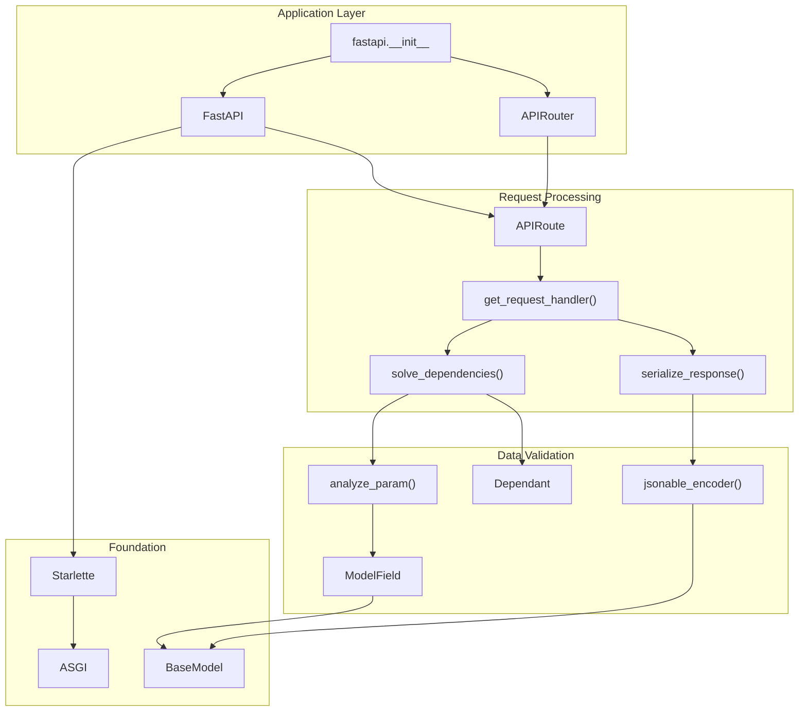
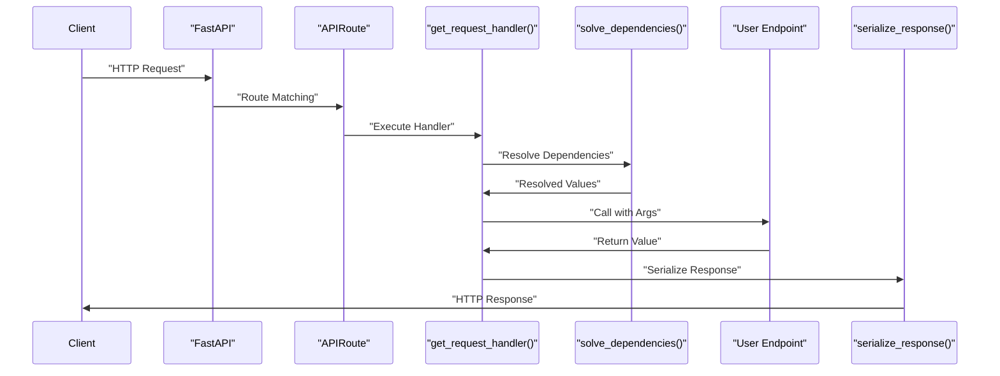
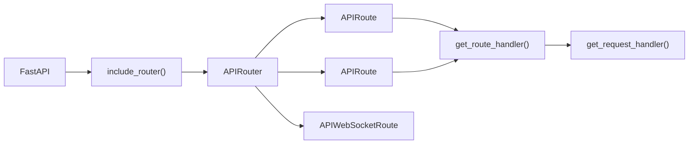
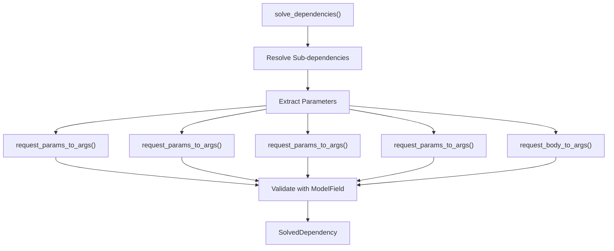
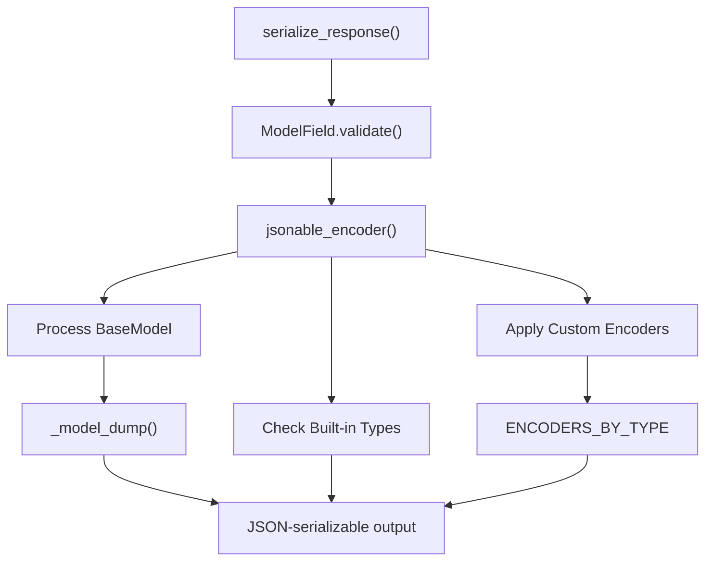
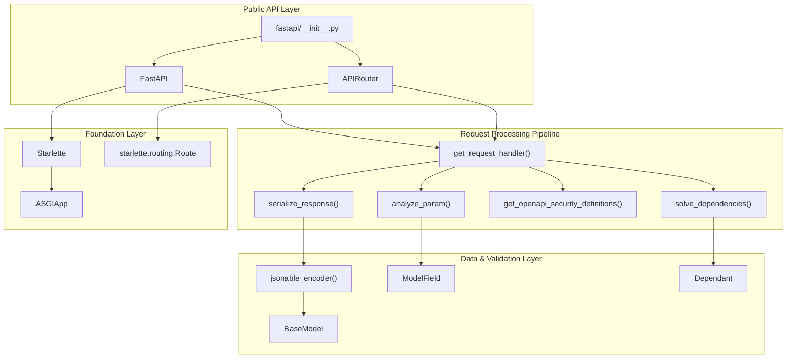

FastAPI's core architecture consists of several interconnected systems that work together to process HTTP requests, validate data, inject dependencies, and generate responses. This page provides an overview of these core components and their relationships. For detailed information about specific subsystems, see the dedicated pages: [Application and Routing System](#2.1), [Dependency Injection](#2.2), [Parameter Validation and Handling](#2.3), [Response Handling](#2.4), [Security Components](#2.5), [Settings Management](#2.6), and [Error Handling](#2.7).

## Architectural Overview

FastAPI's architecture is built in layers, with each layer providing specific functionality while building upon Starlette's ASGI foundation and Pydantic's validation capabilities.

### Core Framework Components



### Request Processing Pipeline



**Sources:** [fastapi/__init__.py:1-26](), [fastapi/applications.py:48](), [fastapi/routing.py:596](), [fastapi/routing.py:218](), [fastapi/dependencies/utils.py:572]()

## Core Components

### FastAPI Application Class

The `FastAPI` class in [fastapi/applications.py:48]() serves as the main entry point and inherits from Starlette's `Starlette` class. It aggregates all core functionality including routing, dependency injection, security, and OpenAPI generation.

Key responsibilities:
- Route registration and management via `add_api_route()` and HTTP method decorators
- Global dependency management 
- OpenAPI schema generation and documentation endpoints
- Exception handling and middleware configuration
- Application lifecycle management

**Sources:** [fastapi/applications.py:48-770]()

### APIRouter System

The `APIRouter` class in [fastapi/routing.py:596]() provides modular route organization. It mirrors the `FastAPI` class interface but operates as a sub-application that can be included in the main app or other routers.



**Sources:** [fastapi/routing.py:596-861](), [fastapi/routing.py:429-570](), [fastapi/routing.py:389-427]()

### Request Processing Pipeline

The request processing pipeline is implemented primarily in `get_request_handler()` in [fastapi/routing.py:218]() and handles the complete lifecycle of an HTTP request.

#### APIRoute and Request Handling

Each API endpoint is represented by an `APIRoute` instance that contains:
- Path pattern and HTTP methods
- Endpoint function reference
- Response model and serialization configuration
- Dependency tree (`Dependant` object)
- Security requirements
- OpenAPI metadata

The `get_request_handler()` function creates an async handler that:

1. **Body Parsing**: Extracts JSON, form data, or file uploads from the request body
2. **Dependency Resolution**: Calls `solve_dependencies()` to resolve all parameter and dependency values
3. **Endpoint Execution**: Runs the user's endpoint function with resolved dependencies
4. **Response Processing**: Serializes the response using `serialize_response()`

**Sources:** [fastapi/routing.py:429-570](), [fastapi/routing.py:218-359]()

### Dependency Injection System

The dependency injection system is built around the `Dependant` dataclass in [fastapi/dependencies/models.py:15]() and the `solve_dependencies()` function in [fastapi/dependencies/utils.py:572]().

#### Dependant Structure

The `Dependant` class represents a complete dependency tree:

```python
@dataclass
class Dependant:
    path_params: List[ModelField]
    query_params: List[ModelField] 
    header_params: List[ModelField]
    cookie_params: List[ModelField]
    body_params: List[ModelField]
    dependencies: List["Dependant"]
    security_requirements: List[SecurityRequirement]
    # ... other fields
```

#### Dependency Resolution Process



**Sources:** [fastapi/dependencies/utils.py:572-695](), [fastapi/dependencies/models.py:8-38](), [fastapi/dependencies/utils.py:740-816]()

### Parameter Validation and Processing

Parameter validation is handled through Pydantic `ModelField` objects created by `analyze_param()` in [fastapi/dependencies/utils.py:348]().

#### Parameter Analysis Flow

The `analyze_param()` function processes function signature parameters and:

1. **Annotation Processing**: Extracts type information and `Annotated` metadata
2. **Parameter Classification**: Determines if parameter is path, query, header, cookie, or body
3. **FieldInfo Creation**: Creates appropriate `FieldInfo` objects (`Path`, `Query`, `Header`, etc.)
4. **ModelField Generation**: Converts to Pydantic `ModelField` for validation

Parameter types are defined in [fastapi/params.py:18]():

```python
class ParamTypes(Enum):
    query = "query"
    header = "header" 
    path = "path"
    cookie = "cookie"
```

**Sources:** [fastapi/dependencies/utils.py:348-511](), [fastapi/params.py:18-23](), [fastapi/param_functions.py:1-68207]()

### Response Handling and Serialization

Response processing is handled by `serialize_response()` in [fastapi/routing.py:144]() and the `jsonable_encoder()` function in [fastapi/encoders.py:102]().

#### Response Serialization Process



The `jsonable_encoder()` handles conversion of complex Python objects to JSON-serializable formats using a registry of type encoders defined in `ENCODERS_BY_TYPE`.

**Sources:** [fastapi/routing.py:144-203](), [fastapi/encoders.py:102-343](), [fastapi/encoders.py:58-85]()

### Security Components

Security is integrated through the security classes in the `fastapi.security` module and processed during dependency resolution.

#### Security Integration

Security schemes inherit from `SecurityBase` and are processed as special dependencies:

1. **Security Scheme Definition**: Classes like `OAuth2`, `HTTPBearer`, `APIKeyHeader` define authentication schemes
2. **Dependency Integration**: Security schemes are treated as dependencies in the `Dependant` tree
3. **OpenAPI Integration**: Security requirements are automatically added to OpenAPI schema
4. **Request Processing**: Security validation occurs during dependency resolution

**Sources:** [fastapi/security/oauth2.py:308-319](), [fastapi/security/http.py:69-95](), [fastapi/security/api_key.py:11-21](), [fastapi/dependencies/models.py:8-12]()

### Exception Handling

FastAPI provides structured exception handling through custom exception classes that extend Starlette's base exceptions.

Key exception types:
- `HTTPException`: For client errors with HTTP status codes
- `RequestValidationError`: For request parameter validation failures  
- `ResponseValidationError`: For response model validation failures
- `WebSocketRequestValidationError`: For WebSocket parameter validation
- `FastAPIError`: Generic FastAPI-specific errors

**Sources:** [fastapi/exceptions.py:9-177]()

## Key Integration Points

### Starlette Foundation

FastAPI builds on Starlette's ASGI foundation, inheriting:
- ASGI application protocol implementation
- Basic routing and middleware support
- Request/Response objects
- Exception handling framework
- WebSocket support

The `FastAPI` class extends `Starlette` while the `APIRouter` class extends `starlette.routing.Router`.

### Pydantic Integration

Pydantic provides:
- Data validation through `BaseModel` and `ModelField`
- Type coercion and serialization
- JSON Schema generation for OpenAPI
- Field-level validation and constraints

FastAPI creates `ModelField` instances for all parameters and uses Pydantic's validation engine throughout the request processing pipeline.

**Sources:** [fastapi/applications.py:34](), [fastapi/routing.py:61-76](), [fastapi/utils.py:63-107](), [fastapi/_compat.py]()

# Core Architecture

This document covers the fundamental architectural components that make up the FastAPI framework itself. This includes the core classes, the request processing pipeline, dependency injection system, parameter validation, response handling, and the integration points with Pydantic and Starlette. For information about API documentation generation, see [API Documentation System](#3). For advanced features like async support and middleware, see [Advanced Features](#4).

## Architectural Overview

FastAPI's core architecture is built in layers, with each layer providing specific functionality while building upon the foundation provided by Starlette and Pydantic.



**Sources:** [fastapi/__init__.py:1-26](), [fastapi/applications.py:48-62](), [fastapi/routing.py:596-621](), [fastapi/routing.py:218-359](), [fastapi/dependencies/utils.py:572-695]()

## Core Components

### Application Layer

The `FastAPI` class serves as the primary entry point and orchestrates all framework functionality. It inherits from Starlette's `Starlette` class and provides the main application interface. The `APIRouter` class enables modular organization of routes and can be included in applications or other routers.

| Component | Purpose | Key Methods |
|-----------|---------|-------------|
| `FastAPI` | Main application class | `add_api_route()`, `get()`, `post()`, `include_router()` |
| `APIRouter` | Modular route organization | `add_api_route()`, `get()`, `post()`, `include_router()` |

Both classes provide identical interfaces for route registration, dependency management, and middleware configuration. See [Application and Routing System](#2.1) for detailed coverage.

**Sources:** [fastapi/applications.py:48](), [fastapi/routing.py:596]()

### Request Processing Pipeline

Each HTTP request flows through a standardized pipeline implemented by the `APIRoute` class and the `get_request_handler()` function. This pipeline handles parameter extraction, dependency resolution, endpoint execution, and response serialization.

The core processing steps are:

1. **Route Matching**: `FastAPI` matches the incoming request to an `APIRoute`
2. **Handler Execution**: `get_request_handler()` processes the request
3. **Parameter Parsing**: Request data is extracted and classified
4. **Dependency Resolution**: `solve_dependencies()` resolves all dependencies
5. **Endpoint Execution**: User-defined endpoint function is called
6. **Response Serialization**: `serialize_response()` converts the return value

**Sources:** [fastapi/routing.py:218](), [fastapi/routing.py:429]()

### Dependency Injection System

FastAPI's dependency injection is built around the `Dependant` dataclass and the `solve_dependencies()` function. The `Dependant` represents a complete dependency tree containing all parameters, sub-dependencies, and security requirements for an endpoint.

Dependencies are resolved recursively, with each dependency type handled by specific parameter extraction functions. The system supports caching, scoping, and hierarchical dependency resolution. See [Dependency Injection](#2.2) for complete details.

**Sources:** [fastapi/dependencies/models.py:15](), [fastapi/dependencies/utils.py:572]()

### Parameter Validation and Handling

Parameter processing uses Pydantic's `ModelField` objects created by the `analyze_param()` function. Parameters are classified by location (path, query, header, cookie, body) and validated according to their type annotations and `FieldInfo` constraints.

The parameter functions `Path()`, `Query()`, `Header()`, `Cookie()`, `Body()`, and `Form()` provide configuration options for validation, documentation, and processing behavior. See [Parameter Validation and Handling](#2.3) for comprehensive coverage.

**Sources:** [fastapi/dependencies/utils.py:348](), [fastapi/param_functions.py:1]()

### Response Handling

Response processing converts endpoint return values into HTTP responses through the `serialize_response()` function and `jsonable_encoder()`. The system handles Pydantic models, built-in Python types, and custom objects using a registry of type encoders.

Response classes like `JSONResponse`, `HTMLResponse`, and `FileResponse` provide control over content types, headers, and status codes. See [Response Handling](#2.4) for detailed information.

**Sources:** [fastapi/routing.py:144](), [fastapi/encoders.py:102]()

### Security Components

Security schemes are implemented as special dependency classes that inherit from `SecurityBase`. Classes like `OAuth2`, `HTTPBearer`, and `APIKeyHeader` define authentication mechanisms that integrate with the dependency injection system.

Security requirements are automatically added to OpenAPI schemas and processed during dependency resolution. See [Security Components](#2.5) for complete coverage of authentication and authorization.

**Sources:** [fastapi/security/oauth2.py:308](), [fastapi/security/http.py:69]()

### Settings Management

FastAPI integrates with Pydantic Settings for configuration management through environment variables and configuration files. The `BaseSettings` class provides validation and type conversion for application settings.

Settings can be used as dependencies, enabling easy testing and configuration management. See [Settings Management](#2.6) for detailed implementation patterns.

**Sources:** [docs/en/docs/advanced/settings.md:55]()

### Error Handling

FastAPI provides structured exception handling through custom exception classes that extend Starlette's base exceptions. Key exception types include `HTTPException`, `RequestValidationError`, and `WebSocketRequestValidationError`.

Exception handlers can be customized globally or per-route to control error responses and logging. See [Error Handling](#2.7) for comprehensive error management strategies.

**Sources:** [fastapi/exceptions.py:9]()

## Key Integration Points

### Starlette Foundation

FastAPI builds on Starlette's ASGI foundation, inheriting:
- ASGI application protocol implementation
- Basic routing and middleware support
- Request/Response objects
- Exception handling framework
- WebSocket support

The `FastAPI` class extends `Starlette` while the `APIRouter` class extends `starlette.routing.Router`.

### Pydantic Integration

Pydantic provides:
- Data validation through `BaseModel` and `ModelField`
- Type coercion and serialization
- JSON Schema generation for OpenAPI
- Field-level validation and constraints

FastAPI creates `ModelField` instances for all parameters and uses Pydantic's validation engine throughout the request processing pipeline.

**Sources:** [fastapi/applications.py:34](), [fastapi/routing.py:61-76](), [fastapi/utils.py:63-107]()