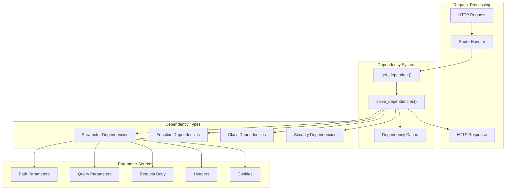
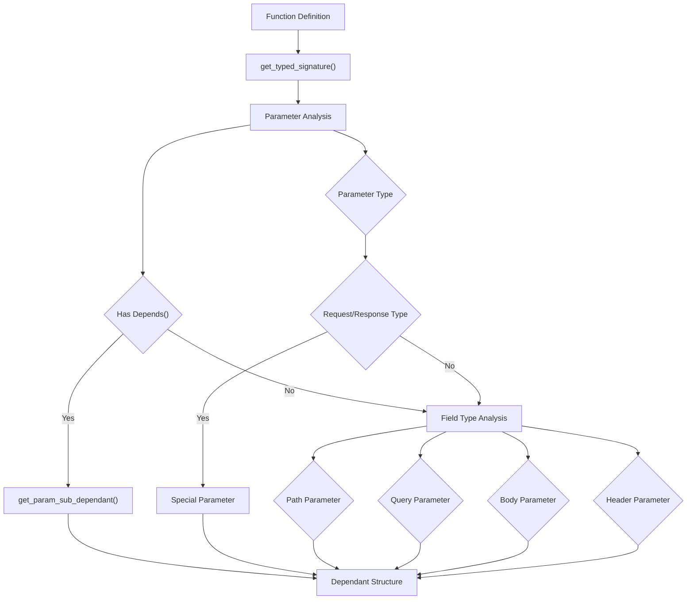

This document covers FastAPI's dependency injection system, which provides automatic resolution and injection of dependencies into path operation functions. The system analyzes function signatures to identify dependencies, validates parameters, and manages the lifecycle of dependency instances including caching and cleanup.

For information about parameter validation and handling, see [Parameter Validation and Handling](#2.3). For security-specific dependency injection, see [Security Components](#2.5).

## System Architecture

FastAPI's dependency injection system consists of three main components: dependency analysis, dependency resolution, and lifecycle management. The system automatically discovers dependencies through function signature inspection and resolves them recursively during request processing.

### Dependency Injection Architecture



Sources: [fastapi/routing.py:292-299](), [fastapi/dependencies/utils.py:572-695](), [fastapi/dependencies/models.py:15-37]()

## Core Components

### Dependant Model

The `Dependant` dataclass represents the dependency structure of a function, containing categorized parameters and sub-dependencies. Each dependant tracks parameter types, security requirements, and caching behavior.

| Field | Type | Purpose |
|-------|------|---------|
| `path_params` | `List[ModelField]` | Path parameter definitions |
| `query_params` | `List[ModelField]` | Query parameter definitions |
| `header_params` | `List[ModelField]` | Header parameter definitions |
| `cookie_params` | `List[ModelField]` | Cookie parameter definitions |
| `body_params` | `List[ModelField]` | Request body parameter definitions |
| `dependencies` | `List[Dependant]` | Nested dependency structures |
| `security_requirements` | `List[SecurityRequirement]` | Security-related dependencies |
| `call` | `Optional[Callable]` | The actual function to call |
| `use_cache` | `bool` | Whether to cache dependency results |

Sources: [fastapi/dependencies/models.py:15-37]()

### Depends Mechanism

The `Depends` class marks function parameters as dependencies, triggering automatic resolution by the dependency injection system.

```python
# From fastapi/params.py
class Depends:
    def __init__(self, dependency: Optional[Callable] = None, *, use_cache: bool = True)
```

The `dependency` parameter specifies the callable to invoke, while `use_cache` controls whether results should be cached for the request duration.

Sources: [fastapi/params.py:1-774]()

## Dependency Analysis Process

### Function Signature Analysis

The `get_dependant` function analyzes function signatures to extract dependency information, categorizing parameters by their types and annotations.



Sources: [fastapi/dependencies/utils.py:265-314](), [fastapi/dependencies/utils.py:348-511]()

### Parameter Classification

The `analyze_param` function classifies function parameters into dependency types based on annotations and default values:

- **Explicit Dependencies**: Parameters with `Depends()` annotations
- **Request Objects**: `Request`, `WebSocket`, `Response`, `BackgroundTasks` types
- **Path Parameters**: Parameters matching path template variables
- **Query Parameters**: Scalar types without special annotations
- **Body Parameters**: Complex types or explicit `Body()` annotations
- **Header/Cookie Parameters**: Parameters with `Header()` or `Cookie()` annotations

Sources: [fastapi/dependencies/utils.py:348-511](), [fastapi/dependencies/utils.py:317-338]()

## Dependency Resolution

### Resolution Algorithm

The `solve_dependencies` function recursively resolves dependencies using a depth-first approach with caching and lifecycle management.

```mermaid
graph TD
    START["solve_dependencies()"] --> INIT["Initialize Values Dict"]
    INIT --> LOOP["For Each Sub-Dependency"]
    
    LOOP --> OVERRIDE_CHECK{"Override Available?"}
    OVERRIDE_CHECK -->|Yes| USE_OVERRIDE["Use Override Function"]
    OVERRIDE_CHECK -->|No| CACHE_CHECK{"Result Cached?"}
    
    CACHE_CHECK -->|Yes| USE_CACHED["Use Cached Result"]
    CACHE_CHECK -->|No| RESOLVE_TYPE{"Dependency Type"}
    
    RESOLVE_TYPE --> GENERATOR{"Generator Function"}
    RESOLVE_TYPE --> ASYNC_FUNC{"Async Function"}
    RESOLVE_TYPE --> SYNC_FUNC{"Sync Function"]
    
    GENERATOR --> ENTER_CONTEXT["Enter Context Manager"]
    ASYNC_FUNC --> AWAIT_CALL["await dependency()"]
    SYNC_FUNC --> THREAD_CALL["run_in_threadpool()"]
    
    USE_OVERRIDE --> STORE_RESULT["Store in Values"]
    USE_CACHED --> STORE_RESULT
    ENTER_CONTEXT --> STORE_RESULT
    AWAIT_CALL --> STORE_RESULT
    THREAD_CALL --> STORE_RESULT
    
    STORE_RESULT --> CACHE_RESULT["Cache if Enabled"]
    CACHE_RESULT --> NEXT_DEP{"More Dependencies?"}
    NEXT_DEP -->|Yes| LOOP
    NEXT_DEP -->|No| PARAMS["Resolve Parameters"]
    
    PARAMS --> RETURN["Return SolvedDependency"]
```

Sources: [fastapi/dependencies/utils.py:572-695]()

### SolvedDependency Result

The dependency resolution process returns a `SolvedDependency` object containing all resolved values and metadata:

| Field | Type | Purpose |
|-------|------|---------|
| `values` | `Dict[str, Any]` | Resolved dependency values |
| `errors` | `List[Any]` | Validation errors encountered |
| `background_tasks` | `BackgroundTasks` | Background task manager |
| `response` | `Response` | Response object for headers/status |
| `dependency_cache` | `Dict` | Cache of resolved dependencies |

Sources: [fastapi/dependencies/utils.py:563-570]()

## Advanced Features

### Dependency Caching

Dependencies are cached by default using a cache key derived from the function and security scopes. Caching prevents redundant computations when the same dependency is used multiple times in a request.

```python