## Purpose and Scope

This document covers deployment and production configuration for FastAPI applications, focusing on proxy integration, HTTPS handling, environment management, and production-ready response configuration. For information about background tasks and async processing patterns, see [Background Tasks](#4.3). For database integration patterns in production, see [Database Integration](#4.2).

The material addresses the infrastructure layer concerns that arise when deploying FastAPI applications behind reverse proxies, load balancers, and TLS termination points in production environments.

## Proxy Configuration

### Proxy Forwarded Headers

FastAPI applications commonly run behind reverse proxies like Traefik, Nginx, or cloud load balancers. These proxies forward requests to the application server but modify request metadata in the process.

**Proxy Header Mechanism**

```mermaid
sequenceDiagram
    participant Client
    participant Proxy["Reverse Proxy<br/>(Traefik/Nginx)"]
    participant FastAPI["FastAPI App<br/>(Uvicorn)"]

    Client->>Proxy: "HTTPS Request<br/>Host: example.com"
    Note over Proxy: "Proxy adds forwarded headers"
    Proxy->>FastAPI: "HTTP Request<br/>X-Forwarded-For: client-ip<br/>X-Forwarded-Proto: https<br/>X-Forwarded-Host: example.com"
    FastAPI->>Proxy: "HTTP Response"
    Proxy->>Client: "HTTPS Response"
```

The proxy sets three critical headers:
- `X-Forwarded-For`: Original client IP address  
- `X-Forwarded-Proto`: Original protocol (`https`)
- `X-Forwarded-Host`: Original host domain

For security, FastAPI CLI requires explicit configuration to trust these headers using the `--forwarded-allow-ips` option. In production behind a trusted proxy, this is typically set to `--forwarded-allow-ips="*"`.

Sources: [docs/en/docs/advanced/behind-a-proxy.md:7-99](), [docs/en/docs/deployment/https.md:193-223]()

### Root Path Configuration

When applications are mounted under a path prefix (e.g., `/api/v1`), the `root_path` mechanism ensures correct URL generation for OpenAPI schemas and redirects.

**Root Path Architecture**


The `root_path` parameter can be configured in two ways:

1. **CLI Option**: `fastapi run --root-path /api/v1`
2. **Application Parameter**: `FastAPI(root_path="/api/v1")`

The application uses `request.scope["root_path"]` to access the current root path value for URL generation.

Sources: [docs/en/docs/advanced/behind-a-proxy.md:100-243](), [docs_src/behind_a_proxy/tutorial001.py:1-9]()

### TLS Termination Proxies

Production deployments typically use TLS termination proxies to handle certificate management and encryption/decryption, allowing the FastAPI application to operate over plain HTTP internally.

**TLS Termination Flow**


This architecture provides several benefits:
- Certificate management centralized in proxy
- Application server remains simple (HTTP only)
- Support for multiple domains/certificates via SNI
- Automatic certificate renewal without application downtime

Sources: [docs/en/docs/deployment/https.md:36-192](), [docs/en/docs/advanced/behind-a-proxy.md:252-366]()

## HTTPS and Certificate Management

### Certificate Handling

HTTPS certificates in production are typically managed by the TLS termination proxy rather than the FastAPI application directly. The proxy handles the TLS handshake and certificate validation process.

**Certificate Lifecycle Management**


Certificate properties:
- **Domain Association**: Certificates are tied to specific domains, not IP addresses
- **Expiration**: Typically 90 days for Let's Encrypt certificates  
- **Validation**: Requires proof of domain ownership for renewal
- **SNI Support**: Single proxy can handle multiple domain certificates

Sources: [docs/en/docs/deployment/https.md:46-59](), [docs/en/docs/deployment/https.md:170-192]()

### TLS Handshake Process

The TLS handshake establishes encrypted communication before HTTP traffic flows. Understanding this process is crucial for debugging production connectivity issues.

**TLS Handshake Sequence**

```mermaid
sequenceDiagram
    participant Client
    participant DNS["DNS Server"]
    participant Proxy["TLS Termination Proxy<br/>Port 443"]
    participant App["FastAPI Application"]

    Client->>DNS: "Resolve someapp.example.com"
    DNS->>Client: "Return IP address"
    
    Note over Client,Proxy: "TLS Handshake"
    Client->>Proxy: "ClientHello + SNI extension"
    Proxy->>Client: "ServerHello + Certificate"
    Client->>Proxy: "Verify certificate"
    Proxy->>Client: "Establish encryption keys"
    
    Note over Client,Proxy: "HTTPS Communication"
    Client->>Proxy: "Encrypted HTTP request"
    Proxy->>App: "Decrypted HTTP request"
    App->>Proxy: "HTTP response"  
    Proxy->>Client: "Encrypted HTTP response"
```

Key handshake components:
- **SNI Extension**: Allows proxy to select correct certificate for domain
- **Certificate Verification**: Client validates certificate against trusted authorities
- **Key Exchange**: Establishes symmetric encryption keys for session
- **HTTP Over TLS**: Application-layer HTTP runs over encrypted TCP connection

Sources: [docs/en/docs/deployment/https.md:90-129](), [docs/en/docs/deployment/https.md:130-159]()

## Environment and Settings Management

### Pydantic Settings

Production FastAPI applications use `pydantic-settings` for configuration management, allowing environment variables to be validated and type-converted automatically.

**Settings Architecture**

```mermaid
classDiagram
    class BaseSettings {
        +model_config: SettingsConfigDict
        +env_file: str
        +case_sensitive: bool
    }
    
    class Settings {
        +app_name: str
        +admin_email: str  
        +items_per_user: int
        +database_url: str
        +secret_key: str
    }
    
    class FastAPIApp {
        +get_settings() Settings
        +dependency_overrides: dict
    }
    
    BaseSettings <|-- Settings
    FastAPIApp --> Settings : depends_on
    
    note for Settings
        Environment variables:
        APP_NAME -> app_name
        ADMIN_EMAIL -> admin_email
        DATABASE_URL -> database_url
    end note
```

Key configuration patterns:
- **Environment Variables**: Automatically read and converted to appropriate types
- **Dependency Injection**: Settings provided via dependency for easy testing overrides  
- **Caching**: `@lru_cache` decorator prevents repeated file reads
- **Validation**: Pydantic validation rules applied to all configuration values

Sources: [docs/en/docs/advanced/settings.md:55-122](), [docs/en/docs/advanced/settings.md:141-182]()

### Environment Variables

Production deployments typically separate configuration from code using environment variables or `.env` files.

**Configuration Loading Process**


Configuration best practices:
- **Separation**: Keep secrets in environment variables, not code
- **Type Safety**: Use Pydantic models for automatic validation and conversion
- **Testing**: Override settings via dependency injection in tests
- **Performance**: Cache settings object to avoid repeated environment reads

Sources: [docs/en/docs/advanced/settings.md:183-275](), [docs/en/docs/advanced/settings.md:250-275]()

## Production Deployment Patterns

### Common Architectures

Production FastAPI deployments follow established patterns that separate concerns between proxy handling, application serving, and data storage.

**Multi-Service Production Architecture**


Architecture components:
- **Load Balancer**: Distributes traffic across multiple proxy instances
- **Reverse Proxy**: Handles TLS termination, static file serving, request routing
- **Application Instances**: Multiple FastAPI processes for horizontal scaling
- **Shared Data Layer**: Database and cache accessible to all application instances

Sources: [docs/en/docs/deployment/https.md:160-169](), [docs/en/docs/advanced/behind-a-proxy.md:387-458]()

### Response Configuration

Production applications often require custom response handling for performance, caching, or format requirements.

**Response Class Hierarchy**

```mermaid
classDiagram
    class Response {
        +content: bytes
        +status_code: int  
        +headers: dict
        +media_type: str
        +render(content) bytes
    }
    
    class JSONResponse {
        +media_type: "application/json"
    }
    
    class ORJSONResponse {
        +media_type: "application/json"
        +faster_serialization: bool
    }
    
    class HTMLResponse {
        +media_type: "text/html"
    }
    
    class StreamingResponse {
        +async_generator: callable
    }
    
    class FileResponse {
        +path: str
        +filename: str
        +content_length: int
    }
    
    Response <|-- JSONResponse
    Response <|-- ORJSONResponse  
    Response <|-- HTMLResponse
    Response <|-- StreamingResponse
    Response <|-- FileResponse
    
    note for ORJSONResponse
        High-performance JSON
        for data-heavy APIs
    end note
    
    note for StreamingResponse
        Large file downloads
        Real-time data feeds
    end note
```

Production response considerations:
- **Performance**: `ORJSONResponse` for high-throughput JSON APIs
- **Streaming**: `StreamingResponse` for large files or real-time data
- **Custom Headers**: Direct `Response` usage for cache control, CORS
- **Default Response Class**: Set at application level via `default_response_class`

Sources: [docs/en/docs/advanced/custom-response.md:21-49](), [docs/en/docs/advanced/custom-response.md:216-246](), [docs/en/docs/advanced/custom-response.md:295-309]()

# Testing Infrastructure


This document covers FastAPI's comprehensive testing infrastructure, including the test framework setup, code quality tools, and automated quality assurance processes. The testing infrastructure ensures code reliability through automated testing, linting, type checking, and pre-commit validation hooks.

For information about specific test framework usage patterns and TestClient implementation, see [Test Framework and Tools](#5.1). For details about linting, formatting, and pre-commit hook configuration, see [Code Quality and Pre-commit](#5.2).

## Overview

FastAPI's testing infrastructure is built around `pytest` as the primary testing framework, with `TestClient` providing HTTP request simulation capabilities. The system includes comprehensive code quality tools, version compatibility testing, and automated validation through pre-commit hooks.

**Testing Framework Architecture**


Sources: [requirements-tests.txt:1-17](), [tests/utils.py:1-35]()

## Testing Dependencies and Requirements

The testing infrastructure relies on a carefully curated set of dependencies defined in `requirements-tests.txt`. These dependencies support various testing scenarios including async operations, database interactions, and security features.

| Category | Package | Version | Purpose |
|----------|---------|---------|---------|
| Core Testing | `pytest` | `>=7.1.3,<9.0.0` | Primary testing framework |
| Coverage | `coverage[toml]` | `>= 6.5.0,< 8.0` | Test coverage measurement |
| Type Checking | `mypy` | `==1.8.0` | Static type analysis |
| Assertions | `dirty-equals` | `==0.9.0` | Flexible assertion matching |
| Snapshots | `inline-snapshot` | `>=0.21.1` | Snapshot testing |
| Database | `sqlmodel` | `==0.0.24` | Database model testing |
| Async | `anyio[trio]` | `>=3.2.1,<5.0.0` | Async testing support |
| Security | `PyJWT` | `==2.8.0` | JWT token testing |
| Authentication | `passlib[bcrypt]` | `>=1.7.2,<2.0.0` | Password hashing testing |

Sources: [requirements-tests.txt:1-17]()

## Version Compatibility Testing

The testing infrastructure includes sophisticated version compatibility utilities to ensure FastAPI works across different Python and Pydantic versions.

**Version Compatibility System**


The `tests/utils.py` module provides version-specific testing utilities:

- `needs_py39`: Skips tests requiring Python 3.9+
- `needs_py310`: Skips tests requiring Python 3.10+
- `needs_pydanticv1`: Skips tests requiring Pydantic v1
- `needs_pydanticv2`: Skips tests requiring Pydantic v2
- `pydantic_snapshot()`: Provides version-specific snapshot testing

Sources: [tests/utils.py:7-34]()

## Pre-commit Quality Assurance

The testing infrastructure includes automated code quality checks through pre-commit hooks configured in `.pre-commit-config.yaml`.

**Pre-commit Hook Pipeline**

```mermaid
graph TD
    subgraph "File Validation Hooks"
        check_large["check-added-large-files"]
        check_toml["check-toml"]
        check_yaml["check-yaml --unsafe"]
        fix_eof["end-of-file-fixer"]
        trim_ws["trailing-whitespace"]
    end
    
    subgraph "Code Quality Hooks"
        ruff_lint["ruff --fix"]
        ruff_format["ruff-format"]
    end
    
    subgraph "Configuration"
        python_version["python: python3.10"]
        pre_commit_ci["pre-commit.ci"]
    end
    
    subgraph "Automation"
        autofix_msg["🎨 [pre-commit.ci] Auto format"]
        autoupdate_msg["⬆ [pre-commit.ci] pre-commit autoupdate"]
    end
    
    python_version --> check_large
    python_version --> check_toml
    python_version --> check_yaml
    python_version --> fix_eof
    python_version --> trim_ws
    python_version --> ruff_lint
    python_version --> ruff_format
    
    pre_commit_ci --> autofix_msg
    pre_commit_ci --> autoupdate_msg
    
    ruff_lint --> ruff_format
```



Sources: [.pre-commit-config.yaml:1-26]()

## Test Patterns and Utilities

FastAPI tests follow consistent patterns for HTTP testing, OpenAPI schema validation, and cross-version compatibility.

**Common Testing Patterns**


Key testing utilities include:

- **TestClient**: HTTP client for simulating requests [tests/test_union_inherited_body.py:24]()
- **dirty-equals**: Flexible assertion matching [tests/test_union_inherited_body.py:89-98]()
- **inline-snapshot**: Snapshot testing for OpenAPI schemas [tests/test_tutorial/test_sql_databases/test_tutorial002.py:71-73]()
- **Parametrized fixtures**: Version compatibility testing [tests/test_tutorial/test_cookie_param_models/test_tutorial002.py:17-36]()

Sources: [tests/test_union_inherited_body.py:1-137](), [tests/test_tutorial/test_sql_databases/test_tutorial002.py:1-482](), [tests/test_tutorial/test_cookie_param_models/test_tutorial002.py:1-244]()

## Type Checking Integration

The testing infrastructure includes `mypy` for static type analysis, ensuring type safety across the codebase. Type checking is integrated with specific type stub packages for external dependencies.

**Type Checking Dependencies**

| Package | Version | Purpose |
|---------|---------|---------|
| `mypy` | `==1.8.0` | Static type checker |
| `types-ujson` | `==5.10.0.20240515` | Type stubs for ujson |
| `types-orjson` | `==3.6.2` | Type stubs for orjson |

Advanced type testing includes support for Python 3.10+ syntax using generics like `list[int]` and `dict[str, list[int]]` as demonstrated in the type compatibility tests.

Sources: [requirements-tests.txt:14-16](), [tests/test_typing_python39.py:1-25]()

## Test Organization Structure

Tests are organized by feature area with consistent naming conventions and import patterns. The test suite covers core functionality, tutorial examples, and edge cases across different Python and Pydantic versions.

**Test File Categories**

- **Core functionality tests**: `tests/test_*.py` 
- **Tutorial tests**: `tests/test_tutorial/*/test_*.py`
- **Version-specific tests**: Files with `_py39`, `_py310`, `_an` suffixes
- **Pydantic compatibility**: Files with `_pv1` suffixes

Each test file follows the pattern of importing required dependencies, creating a FastAPI app and TestClient, and implementing test functions with descriptive names and comprehensive assertions.

Sources: [tests/test_union_inherited_body.py:1-8](), [tests/test_tutorial/test_sql_databases/test_tutorial002.py:1-13](), [tests/test_tutorial/test_cookie_param_models/test_tutorial002.py:1-14]()

# Test Framework and Tools


This document covers FastAPI's comprehensive testing infrastructure, including the test framework setup, testing tools, quality assurance automation, and testing patterns used throughout the codebase. This infrastructure ensures code quality through automated testing, linting, formatting, and type checking.

For information about the broader CI/CD pipeline that runs these tests, see [CI/CD Pipeline](#6.2). For development workflow and tooling, see [Development Workflow](#6.3).

## Testing Framework Overview

FastAPI uses a multi-layered testing approach combining pytest, custom test utilities, and quality assurance tools to ensure comprehensive coverage and code quality.

### Core Testing Architecture


**Testing Framework Components**

The testing infrastructure consists of several integrated components that work together to provide comprehensive test coverage and code quality assurance.

Sources: [.pre-commit-config.yaml:1-26](), [requirements-tests.txt:1-17](), [tests/utils.py:1-35]()

## Core Testing Tools

### pytest and TestClient Setup

The primary testing framework uses `pytest` with FastAPI's `TestClient` for HTTP endpoint testing:


**Key Testing Components**

| Component | Purpose | Usage Pattern |
|-----------|---------|---------------|
| `TestClient` | HTTP endpoint testing | `client = TestClient(app)` |
| `pytest.mark.parametrize` | Test parameterization | Version-specific test variants |
| `dirty_equals.IsDict` | Flexible assertions | Pydantic version compatibility |
| `inline_snapshot` | Snapshot testing | Large response validation |

Sources: [requirements-tests.txt:3-17](), [tests/test_application.py:3-7](), [tests/test_query.py:1-6]()

### Test Application Structure

The main test application serves as a comprehensive example for testing various FastAPI features:


**Route Coverage Patterns**

The test application systematically covers different parameter types, validation constraints, and routing methods to ensure comprehensive testing of FastAPI's core functionality.

Sources: [tests/main.py:1-205](), [tests/test_application.py:10-22]()

## Testing Patterns and Utilities

### Version Compatibility Testing

FastAPI maintains compatibility across multiple Python and Pydantic versions using custom test markers:


**Version-Specific Testing Implementation**

```python
# Example from tests/utils.py
needs_py39 = pytest.mark.skipif(sys.version_info < (3, 9), reason="requires python3.9+")
needs_pydanticv2 = pytest.mark.skipif(not PYDANTIC_V2, reason="requires Pydantic v2")

def pydantic_snapshot(*, v2: Snapshot, v1: Snapshot):
    return v2 if PYDANTIC_V2 else v1
```

Sources: [tests/utils.py:7-35](), [tests/test_tutorial/test_cookie_param_models/test_tutorial002.py:17-31]()

### Assertion Strategies

FastAPI tests use multiple assertion libraries to handle different testing scenarios:


**Example Assertion Patterns**

The testing framework uses sophisticated assertion patterns to handle cross-version compatibility:

```python
# From tests/test_application.py
assert response.json() == IsDict({
    "detail": [{
        "type": "missing",
        "loc": ["query", "query"], 
        "msg": "Field required",
        "input": None,
    }]
}) | IsDict({
    # Pydantic v1 compatibility
    "detail": [{
        "loc": ["query", "query"],
        "msg": "field required", 
        "type": "value_error.missing",
    }]
})
```

Sources: [tests/test_query.py:12-34](), [tests/test_path.py:48-70](), [tests/test_union_inherited_body.py:89-98]()

## Quality Assurance Tools

### Pre-commit Hook Configuration

The project uses pre-commit hooks to ensure code quality before commits:


**Pre-commit Tool Configuration**

| Tool | Version | Purpose |
|------|---------|---------|
| `ruff` | v0.12.10 | Linting with auto-fix |
| `ruff-format` | v0.12.10 | Code formatting |
| `pre-commit-hooks` | v6.0.0 | File validation |

Sources: [.pre-commit-config.yaml:1-26]()

### Static Analysis Integration

The testing infrastructure includes static analysis tools for comprehensive code quality:


**Quality Metrics and Enforcement**

The testing framework enforces quality standards through multiple layers of automated checking, ensuring consistent code quality across the entire codebase.

Sources: [requirements-tests.txt:5-17](), [.pre-commit-config.yaml:16-22]()

## Test Organization and Execution

### Test Module Structure

FastAPI organizes tests into logical modules that mirror the framework's feature areas:

```mermaid
graph TD
    subgraph "Core Feature Tests"
        A["test_application.py"] --> B["Basic app functionality"]
        C["test_query.py"] --> D["Query parameter handling"]
        E["test_path.py"] --> F["Path parameter validation"]
        G["test_union_*.py"] --> H["Union type handling"]
    end
    
    subgraph "Tutorial Tests"
        I["test_tutorial/"] --> J["Documentation examples"]
        K["test_sql_databases/"] --> L["Database integration"]
        M["test_cookie_param_models/"] --> N["Cookie parameter models"]
    end
    
    subgraph "Utility Support"
        O["tests/main.py"] --> P["Shared test application"]
        Q["tests/utils.py"] --> R["Test utilities and markers"]
        S["tests/__init__.py"] --> T["Package initialization"]
    end
    
    B --> P
    D --> P
    F --> P
    H --> P
    J --> R
    L --> R
    N --> R
```

**Test Execution Patterns**

Each test module follows consistent patterns for setup, execution, and assertion, making the test suite maintainable and predictable.

Sources: [tests/test_application.py:1-53](), [tests/test_query.py:1-422](), [tests/test_path.py:1-1005](), [tests/test_tutorial/test_sql_databases/test_tutorial002.py:1-482]()

### Parametrized Testing Strategy

The framework extensively uses pytest parametrization for comprehensive coverage:

```mermaid
graph LR
    subgraph "Parameter Testing"
        A["@pytest.mark.parametrize"] --> B["path,expected_status,expected_response"]
        C["Multiple test variants"] --> D["Single test function"]
        E["pytest.param with marks"] --> F["Conditional execution"]
    end
    
    subgraph "Version Matrix"
        G["Python versions"] --> H["3.9, 3.10+"]
        I["Pydantic versions"] --> J["v1, v2"]
        K["Tutorial variants"] --> L["Standard, annotated"]
    end
    
    subgraph "Fixture Parametrization"
        M["@pytest.fixture params"] --> N["Client creation variants"]
        O["importlib.import_module"] --> P["Dynamic module loading"]
    end
    
    B --> D
    F --> D
    H --> N
    J --> N
    L --> N
    P --> N
```

**Example Parametrized Test Structure**

```python