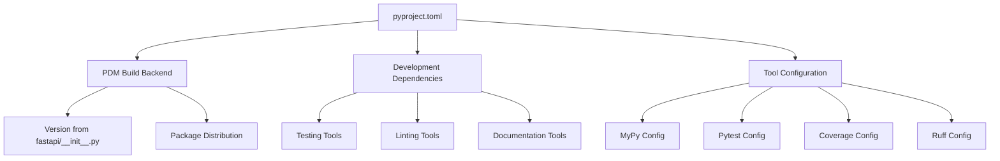
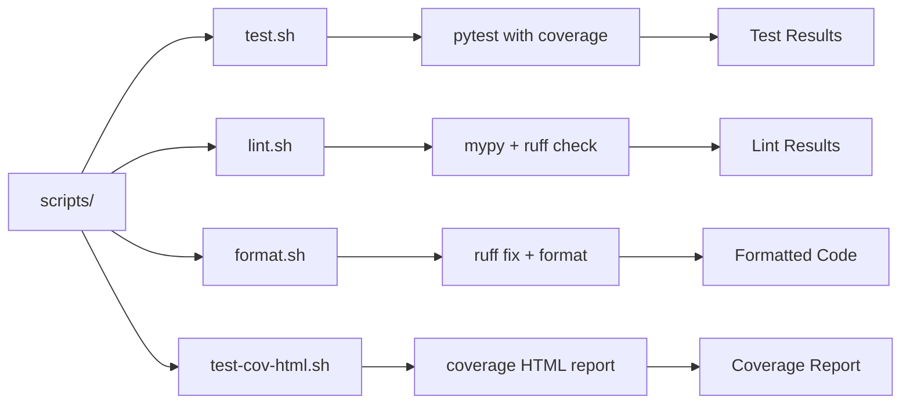
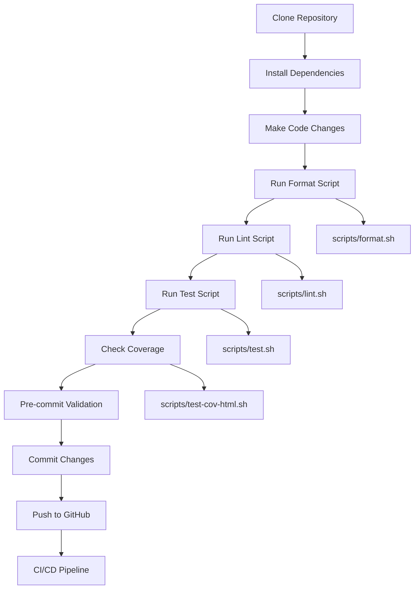
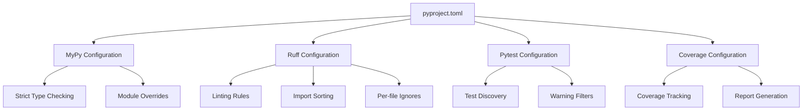
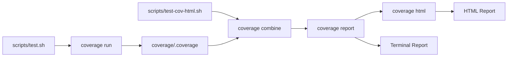

This document covers the local development workflow, tooling, and scripts used for contributing to the FastAPI codebase. It explains how developers use the project's build system, development scripts, and quality tools during the development process.

For information about automated CI/CD pipelines, see [CI/CD Pipeline](#6.2). For details about code quality tools configuration, see [Code Quality and Pre-commit](#5.2). For testing patterns and frameworks, see [Test Framework and Tools](#5.1).

## Build System and Project Configuration

FastAPI uses PDM (Python Dependency Management) as its build system, configured through `pyproject.toml`. The project follows modern Python packaging standards with comprehensive tooling configuration.

### Build System Configuration

The build system is configured using PDM backend with dynamic versioning:



**PDM Build System Configuration**

The build system specifies PDM as the backend and includes development sources in the distribution package.

Sources: [pyproject.toml:1-3](), [pyproject.toml:127-140]()

### Dependency Management

FastAPI defines multiple dependency groups for different use cases:

| Dependency Group | Purpose | Key Packages |
|-----------------|---------|-------------|
| Core Dependencies | Essential runtime requirements | `starlette`, `pydantic`, `typing-extensions` |
| `standard` | Standard FastAPI installation | `fastapi-cli`, `httpx`, `jinja2`, `uvicorn` |
| `all` | Complete feature set | All standard plus `orjson`, `ujson`, `pydantic-settings` |
| Development | Local development tools | `pre-commit`, `playwright` |

Sources: [pyproject.toml:45-48](), [pyproject.toml:60-77](), [pyproject.toml:98-122](), [requirements.txt:1-7]()

## Development Scripts Overview

The project provides shell scripts in the `scripts/` directory to standardize common development tasks:



**Development Script Ecosystem**

Each script serves a specific purpose in the development workflow, with clear separation of concerns.

Sources: [scripts/test.sh:1-8](), [scripts/lint.sh:1-9](), [scripts/format.sh:1-6](), [scripts/test-cov-html.sh:1-10]()

## Local Development Workflow

The typical development workflow follows this sequence:



**Local Development Process Flow**

The workflow ensures code quality through multiple validation stages before committing changes.

Sources: [scripts/format.sh:1-6](), [scripts/lint.sh:1-9](), [scripts/test.sh:1-8](), [requirements.txt:4-4]()

### Development Environment Setup

1. **Dependency Installation**: Install using the development requirements which include all optional dependencies and development tools
2. **Pre-commit Setup**: Install pre-commit hooks to enforce quality checks before commits
3. **Script Permissions**: Ensure shell scripts have execute permissions

Sources: [requirements.txt:1-7]()

## Code Quality Workflow

The code quality workflow uses multiple tools orchestrated through shell scripts:

### Formatting Workflow

The `scripts/format.sh` script performs automatic code formatting:

```bash
ruff check fastapi tests docs_src scripts --fix
ruff format fastapi tests docs_src scripts
```

This two-step process first applies automatic fixes for linting violations, then formats the code according to style guidelines.

Sources: [scripts/format.sh:4-5]()

### Linting Workflow  

The `scripts/lint.sh` script runs comprehensive code quality checks:

```bash
mypy fastapi
ruff check fastapi tests docs_src scripts
ruff format fastapi tests --check
```

This validates type annotations with MyPy, checks code quality with Ruff, and verifies formatting compliance.

Sources: [scripts/lint.sh:6-8]()

### Tool Configuration Integration



**Tool Configuration Architecture**

All development tools are configured centrally in `pyproject.toml` with tool-specific sections.

Sources: [pyproject.toml:144-270]()

## Testing Workflow

The testing workflow uses pytest with coverage tracking and custom configuration:

### Test Execution

The `scripts/test.sh` script sets up the testing environment:

```bash
export PYTHONPATH=./docs_src
coverage run -m pytest tests ${@}
```

This configures the Python path to include documentation source code and runs tests with coverage tracking.

Sources: [scripts/test.sh:6-7]()

### Test Configuration

Key pytest configuration elements:

| Configuration | Purpose | 
|--------------|---------|
| `--strict-config` | Enforce strict configuration validation |
| `--strict-markers` | Require marker registration |
| `--ignore=docs_src` | Exclude documentation code from test discovery |
| `xfail_strict = true` | Treat expected failures strictly |
| `filterwarnings` | Suppress specific deprecation warnings |

Sources: [pyproject.toml:163-187]()

## Coverage Reporting

The coverage system tracks code coverage across multiple contexts:



**Coverage Reporting Pipeline**

Coverage data is collected during test runs and can be combined and reported in multiple formats.

### Coverage Configuration

The coverage system is configured for parallel execution and comprehensive source tracking:

- **Data Collection**: Tracks `docs_src`, `tests`, and `fastapi` directories
- **Context Tracking**: Uses dynamic context based on test functions
- **Parallel Support**: Enables parallel test execution with data aggregation
- **HTML Reports**: Generates detailed HTML reports with context information

Sources: [pyproject.toml:189-210](), [scripts/test-cov-html.sh:6-9]()

### Coverage Output

The `scripts/test-cov-html.sh` script generates comprehensive coverage reports:

1. **Combine**: Merges parallel coverage data files
2. **Report**: Displays terminal coverage summary with missing lines
3. **HTML**: Creates interactive HTML coverage report

Sources: [scripts/test-cov-html.sh:7-9]()