## Purpose and Scope

The Documentation System encompasses the comprehensive infrastructure for building, maintaining, and deploying FastAPI's multi-language documentation website. This system manages the conversion of Markdown source files into a fully-featured documentation site with interactive API references, community pages, and automated translation workflows.

For information about CI/CD automation that builds and deploys this documentation, see [CI/CD Pipeline](#6.2). For details about translation management and community coordination, see [Translation Management](#7.2).

## Architecture Overview

The documentation system is built on MkDocs Material with a sophisticated multi-language inheritance model, automated content generation, and community data integration.

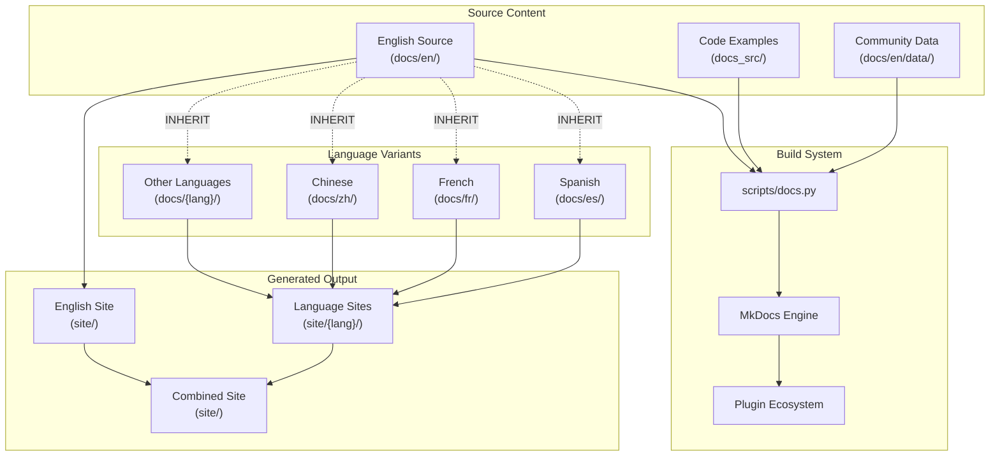

**Sources:** [docs/en/mkdocs.yml:1-362](), [scripts/docs.py:1-425](), [docs/zh/mkdocs.yml:1-2]()

## MkDocs Configuration System

### Base Configuration Structure

The documentation system uses a hierarchical configuration approach where the English configuration serves as the master template.

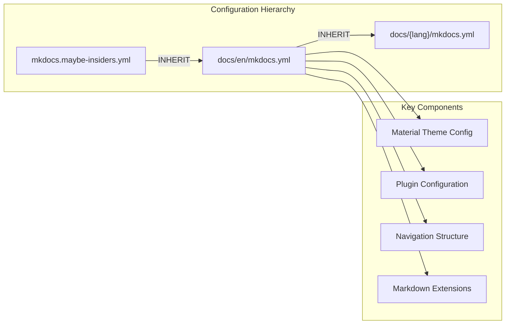

The base English configuration at [docs/en/mkdocs.yml:1-5]() inherits from `mkdocs.maybe-insiders.yml`, which conditionally loads insiders features based on environment variables [docs/en/mkdocs.maybe-insiders.yml:3]().

### Theme Configuration

The Material theme is configured with comprehensive feature flags and styling:

| Feature Category | Configuration | Purpose |
|-----------------|---------------|---------|
| Navigation | `navigation.tabs`, `navigation.instant` | Enhanced navigation UX |
| Content | `content.code.copy`, `content.tabs.link` | Interactive code blocks |
| Search | `search.highlight`, `search.suggest` | Advanced search capabilities |
| Visual | Dark/light mode toggle | User preference support |

**Sources:** [docs/en/mkdocs.yml:27-46](), [docs/en/mkdocs.yml:8-26]()

### Plugin Ecosystem

The documentation system integrates multiple specialized plugins:

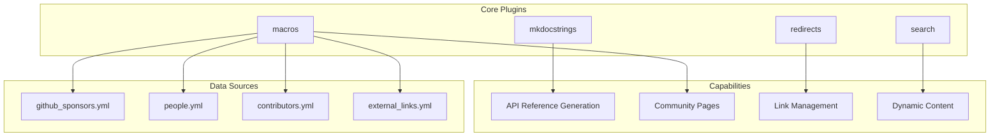

The `macros` plugin enables dynamic content generation by including YAML data files [docs/en/mkdocs.yml:57-68](), while `mkdocstrings` generates API documentation from Python docstrings [docs/en/mkdocs.yml:77-98]().

**Sources:** [docs/en/mkdocs.yml:54-98](), [requirements-docs.txt:18]()

## Multi-Language Support Architecture

### Inheritance Model

Each language variant uses a minimal configuration that inherits from the English base:

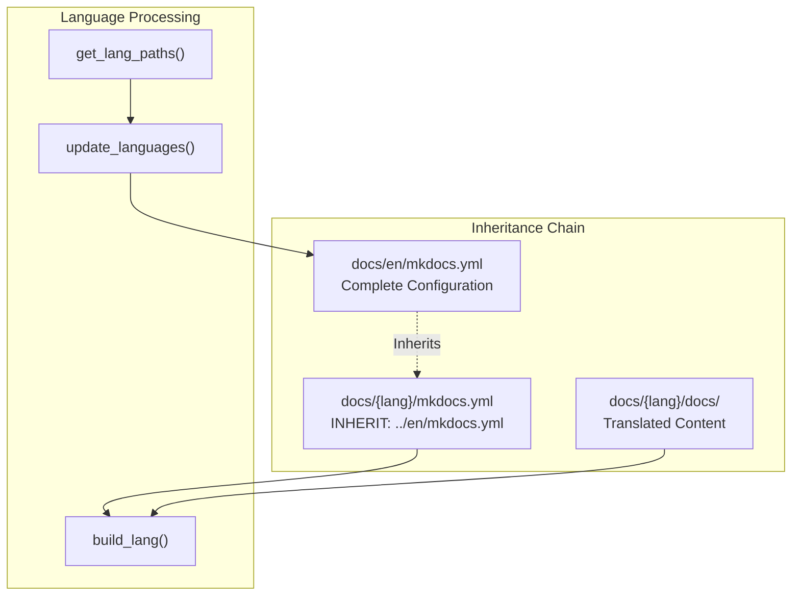

Language directories follow a consistent structure where [docs/zh/mkdocs.yml:1]() contains only `INHERIT: ../en/mkdocs.yml`, inheriting all configuration from the English version.

### Language Management Functions

The documentation build system provides language management through `scripts/docs.py`:

| Function | Purpose | Key Operations |
|----------|---------|----------------|
| `new_lang()` | Create new language | Creates directory, config, index with translation template |
| `build_lang()` | Build specific language | Runs MkDocs build, copies to site directory |
| `build_all()` | Build all languages | Parallel builds using process pool |
| `update_languages()` | Update language list | Updates alternate language links in config |

**Sources:** [scripts/docs.py:85-104](), [scripts/docs.py:108-143](), [scripts/docs.py:216-229](), [scripts/docs.py:232-237]()

### Language Names and Localization

Language names are managed through a centralized configuration:

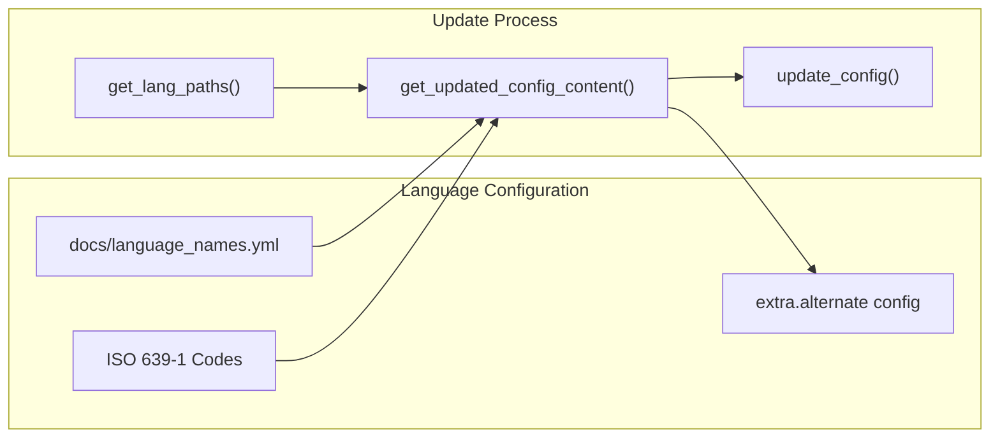

The system maintains language names in [docs/language_names.yml:1-184]() and automatically generates the alternate language switcher configuration [docs/en/mkdocs.yml:303-354]().

**Sources:** [scripts/docs.py:296-318](), [docs/language_names.yml:1-184](), [scripts/docs.py:321-327]()

## Build Process and Script Management

### Core Build Functions

The `scripts/docs.py` module provides comprehensive documentation management:

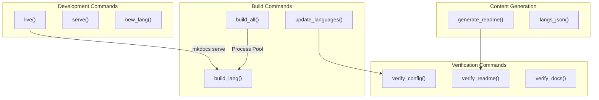

### Build Process Flow

The build system supports both development and production workflows:

| Mode | Command | Purpose | Output |
|------|---------|---------|---------|
| Development | `live` | Live reload for single language | Local server on port 8008 |
| Preview | `serve` | Static preview of built site | Combined multi-language site |
| Production | `build_all` | Build all languages | Complete site in `./site/` |

**Sources:** [scripts/docs.py:262-288](), [scripts/docs.py:240-258](), [scripts/docs.py:216-229]()

### Content Processing Pipeline

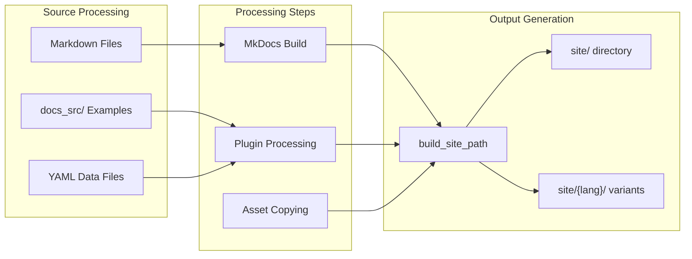

The build process creates temporary build directories [scripts/docs.py:125]() before copying to the final site location [scripts/docs.py:140]().

**Sources:** [scripts/docs.py:136-142](), [scripts/docs.py:44-45]()

## Content Organization and Structure

### Documentation Navigation Structure

The navigation is hierarchically organized in the main configuration:

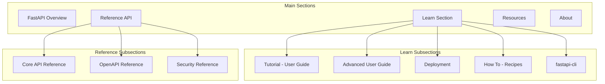

### Non-Translatable Content Management

The system maintains a list of sections that should not be translated:

| Section | Reason | Management |
|---------|--------|------------|
| `reference/` | Auto-generated API docs | Updated frequently from code |
| `release-notes.md` | Version-specific content | Rapid updates |
| `contributing.md` | Development guidelines | English-centric workflow |
| `external-links.md` | Community resources | Centrally maintained |

**Sources:** [scripts/docs.py:30-39](), [scripts/docs.py:349-368]()

### Content Validation System

The documentation system includes comprehensive validation:

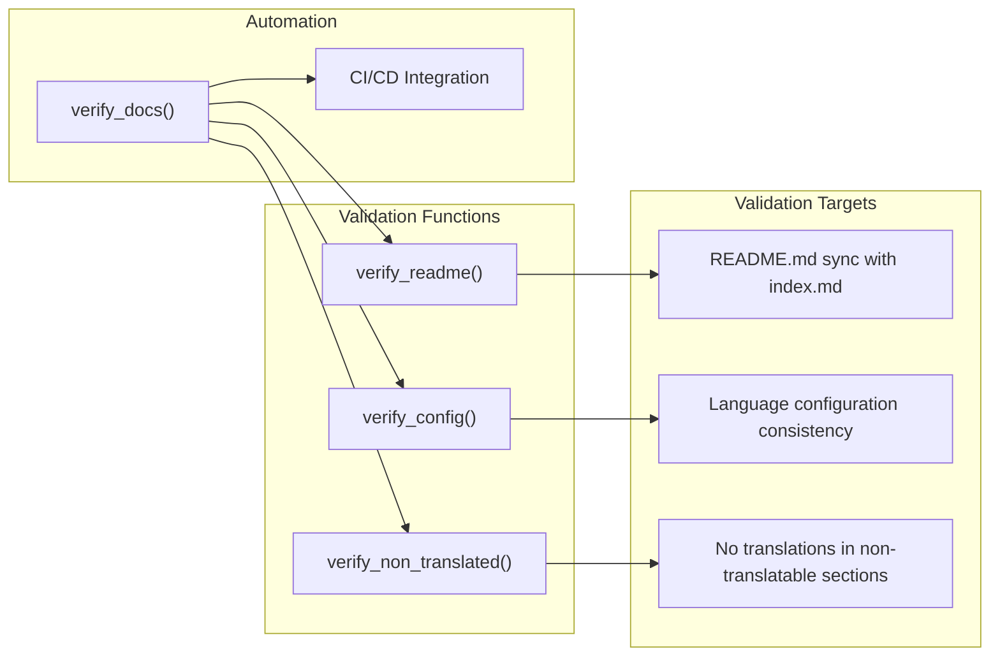

**Sources:** [scripts/docs.py:372-376](), [scripts/docs.py:198-212](), [scripts/docs.py:329-345]()

## Markdown Extensions and Processing

### Extension Configuration

The documentation system uses extensive Markdown extensions for enhanced functionality:

| Extension Category | Extensions | Purpose |
|-------------------|------------|---------|
| Content Structure | `tables`, `toc`, `attr_list` | Basic formatting and navigation |
| Code Highlighting | `pymdownx.highlight`, `pymdownx.superfences` | Syntax highlighting with line numbers |
| Interactive Elements | `pymdownx.blocks.tab`, `pymdownx.blocks.details` | Tabbed content and collapsible sections |
| Diagrams | `pymdownx.superfences` with mermaid | Diagram rendering support |

### Advanced Block Types

The system supports sophisticated content blocks through PyMdown extensions [docs/en/mkdocs.yml:274-289]():

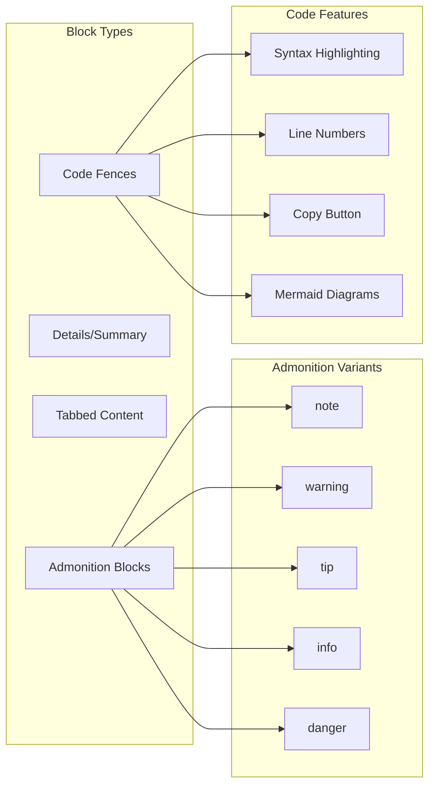

**Sources:** [docs/en/mkdocs.yml:253-290](), [docs/en/mkdocs.yml:268-272]()

## Community Data Integration

### Data Source Management

The documentation system integrates multiple community data sources:

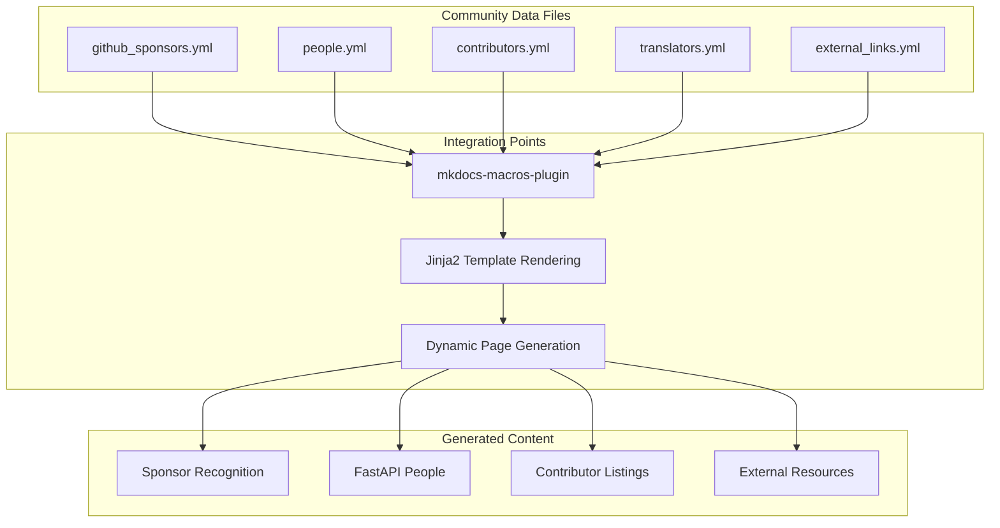

### Template Processing

The system includes sophisticated template processing for dynamic content generation, particularly for sponsor acknowledgments [scripts/docs.py:145-154]() using Jinja2 templates [scripts/docs.py:172]().

**Sources:** [docs/en/mkdocs.yml:56-68](), [scripts/docs.py:157-184](), [requirements-docs.txt:18]()

## Development and Deployment Integration

### Local Development Workflow

The documentation system provides streamlined development commands:

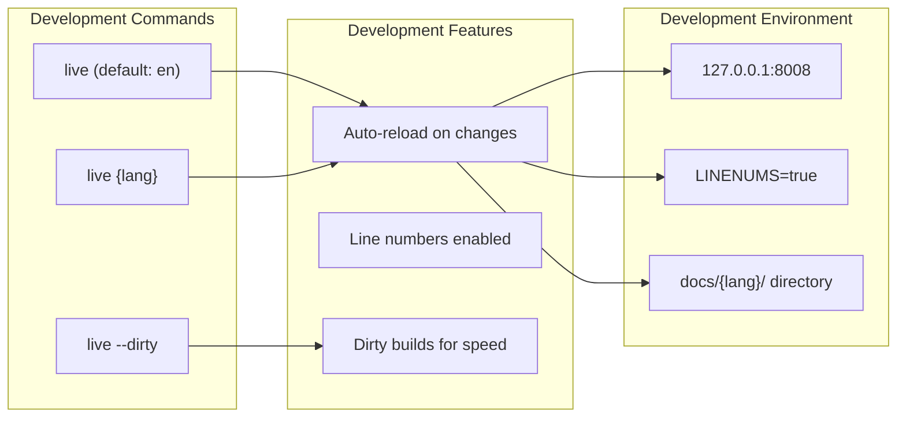

The development server automatically enables line numbers [scripts/docs.py:286]() to facilitate content editing and review.

### Production Build Process

For production deployment, the system uses parallel processing for efficiency [scripts/docs.py:224-228]():

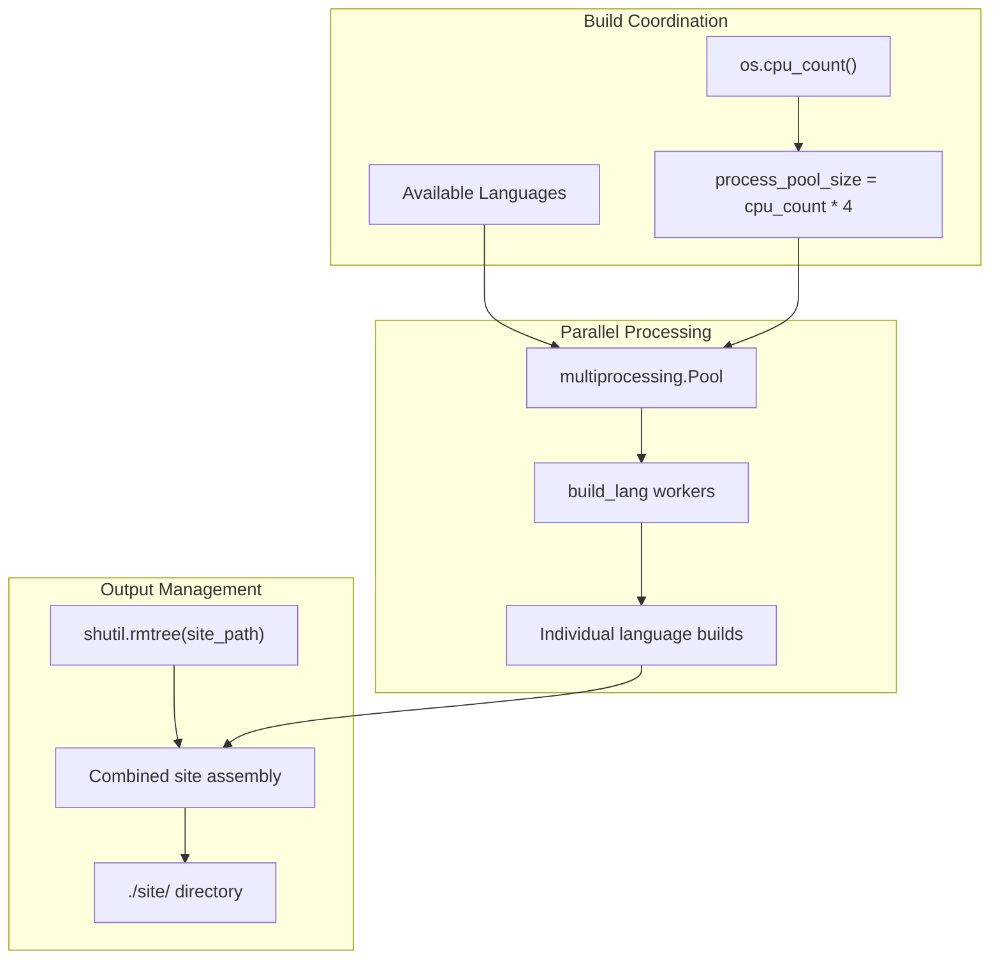

**Sources:** [scripts/docs.py:262-288](), [scripts/docs.py:216-229](), [scripts/docs.py:224-228]()

# CI/CD Pipeline


This document covers the comprehensive Continuous Integration/Continuous Deployment (CI/CD) infrastructure for the FastAPI repository, including automated testing, documentation building, package publishing, and community management workflows.

The CI/CD system is implemented entirely using GitHub Actions and consists of multiple interconnected workflows that handle code quality assurance, documentation generation, release automation, and community engagement. For information about the development workflow and local tooling, see [Development Workflow](#6.3). For details about the documentation build system itself, see [Documentation System](#6.1).

## Pipeline Architecture Overview

The FastAPI CI/CD pipeline consists of four main categories of automation: core development workflows, documentation pipelines, release management, and community automation.

```mermaid
graph TB
    subgraph "Trigger Events"
        PUSH["push: branches: master"]
        PR["pull_request: opened, synchronize"]
        RELEASE["release: created"]
        SCHEDULE["schedule: cron expressions"]
        MANUAL["workflow_dispatch"]
    end
    
    subgraph "Core CI/CD Workflows"
        TEST_YML[".github/workflows/test.yml"]
        LINT_JOB["job: lint"]
        TEST_JOB["job: test"]
        COVERAGE_JOB["job: coverage-combine"]
        SMOKESHOW_YML[".github/workflows/smokeshow.yml"]
        TEST_REDIST_YML[".github/workflows/test-redistribute.yml"]
    end
    
    subgraph "Documentation Pipeline"
        BUILD_DOCS_YML[".github/workflows/build-docs.yml"]
        DEPLOY_DOCS_YML[".github/workflows/deploy-docs.yml"]
        CHANGES_JOB["job: changes"]
        LANGS_JOB["job: langs"]
        BUILD_DOCS_JOB["job: build-docs"]
        DEPLOY_JOB["job: deploy-docs"]
    end
    
    subgraph "Release Pipeline"
        PUBLISH_YML[".github/workflows/publish.yml"]
        PUBLISH_JOB["job: publish"]
        LATEST_CHANGES_YML[".github/workflows/latest-changes.yml"]
    end
    
    subgraph "Community Automation"
        PEOPLE_YML[".github/workflows/people.yml"]
        SPONSORS_YML[".github/workflows/sponsors.yml"]
        CONTRIBUTORS_YML[".github/workflows/contributors.yml"]
        TOPIC_REPOS_YML[".github/workflows/topic-repos.yml"]
        ISSUE_MANAGER_YML[".github/workflows/issue-manager.yml"]
        LABEL_APPROVED_YML[".github/workflows/label-approved.yml"]
        NOTIFY_TRANS_YML[".github/workflows/notify-translations.yml"]
    end
    
    PUSH --> TEST_YML
    PR --> TEST_YML
    PUSH --> BUILD_DOCS_YML
    PR --> BUILD_DOCS_YML
    RELEASE --> PUBLISH_YML
    
    TEST_YML --> LINT_JOB
    TEST_YML --> TEST_JOB
    TEST_JOB --> COVERAGE_JOB
    COVERAGE_JOB --> SMOKESHOW_YML
    
    BUILD_DOCS_YML --> CHANGES_JOB
    BUILD_DOCS_YML --> LANGS_JOB
    BUILD_DOCS_YML --> BUILD_DOCS_JOB
    BUILD_DOCS_YML --> DEPLOY_DOCS_YML
    DEPLOY_DOCS_YML --> DEPLOY_JOB
    
    PUBLISH_YML --> PUBLISH_JOB
    
    SCHEDULE --> PEOPLE_YML
    SCHEDULE --> SPONSORS_YML
    SCHEDULE --> CONTRIBUTORS_YML
    SCHEDULE --> TOPIC_REPOS_YML
    SCHEDULE --> ISSUE_MANAGER_YML
    SCHEDULE --> LABEL_APPROVED_YML
```

Sources: [.github/workflows/test.yml:1-156](), [.github/workflows/build-docs.yml:1-138](), [.github/workflows/deploy-docs.yml:1-78](), [.github/workflows/publish.yml:1-43]()

## Core Testing and Quality Assurance

The testing pipeline ensures code quality through comprehensive linting, multi-version testing, and coverage reporting.

### Test Workflow

The `test.yml` workflow implements a multi-dimensional test matrix covering Python versions 3.8-3.13 and both Pydantic v1 and v2 compatibility.

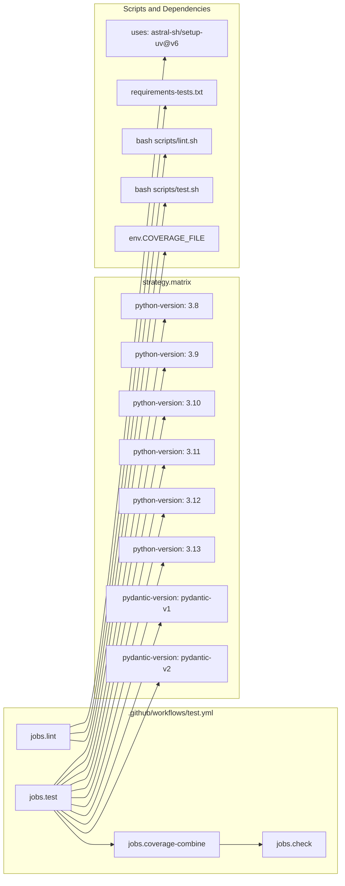

The test workflow uses specific environment variables and configurations:
- `UV_SYSTEM_PYTHON: 1` for system Python usage
- `COVERAGE_FILE` with unique naming per test matrix combination
- Conditional Pydantic version installation based on matrix parameters

Sources: [.github/workflows/test.yml:46-101](), [.github/workflows/test.yml:102-140]()

### Coverage Reporting

The coverage system integrates with Smokeshow for visual coverage reporting:

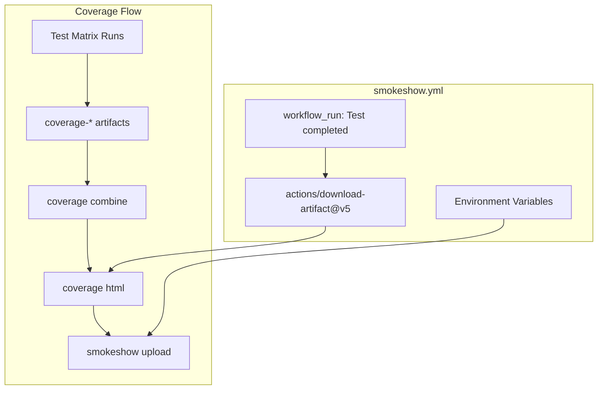

Sources: [.github/workflows/test.yml:89-139](), [.github/workflows/smokeshow.yml:14-61]()

## Documentation Build and Deployment Pipeline

The documentation system implements a sophisticated multi-language build and deployment process.

### Documentation Build Workflow

The `build-docs.yml` workflow handles path-based change detection and multi-language documentation building:

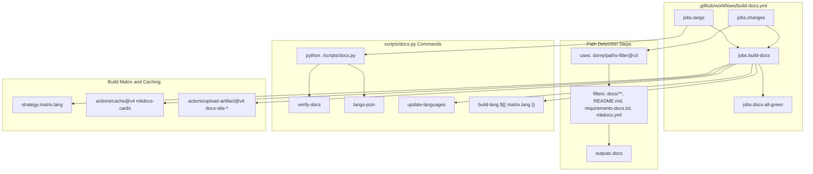

The workflow uses conditional MkDocs Material Insiders installation based on secret availability and supports caching for performance optimization.

Sources: [.github/workflows/build-docs.yml:14-138](), [.github/workflows/build-docs.yml:71-76](), [.github/workflows/build-docs.yml:112-124]()

### Documentation Deployment

The `deploy-docs.yml` workflow handles automatic deployment to Cloudflare Pages:

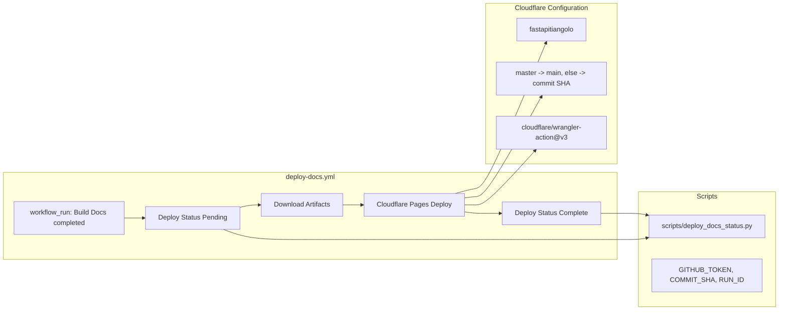

Sources: [.github/workflows/deploy-docs.yml:19-78](), [.github/workflows/deploy-docs.yml:58-69]()

## Release and Publishing Pipeline

The publishing system handles automated package distribution to PyPI for both `fastapi` and `fastapi-slim` variants.

### Package Publishing

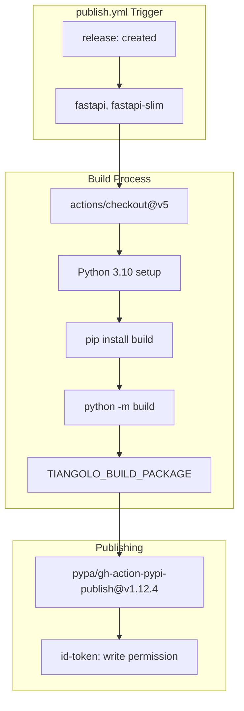

The publishing workflow uses trusted publishing with OpenID Connect tokens and supports building multiple package variants through the `TIANGOLO_BUILD_PACKAGE` environment variable.

Sources: [.github/workflows/publish.yml:8-43](), [.github/workflows/publish.yml:34-38]()

### Distribution Testing

The `test-redistribute.yml` workflow validates package distributions:

| Test Phase | Description | Commands |
|------------|-------------|----------|
| Source Distribution Build | Build sdist package | `python -m build --sdist` |
| Source Distribution Test | Test from extracted source | `bash scripts/test.sh` in dist directory |
| Wheel Build | Build wheel from sdist | `pip wheel --no-deps fastapi*.tar.gz` |

Sources: [.github/workflows/test-redistribute.yml:13-58]()

## Community Automation Workflows

The FastAPI repository includes extensive automation for community management, contributor recognition, and content updates.

### Contributor and Sponsor Management

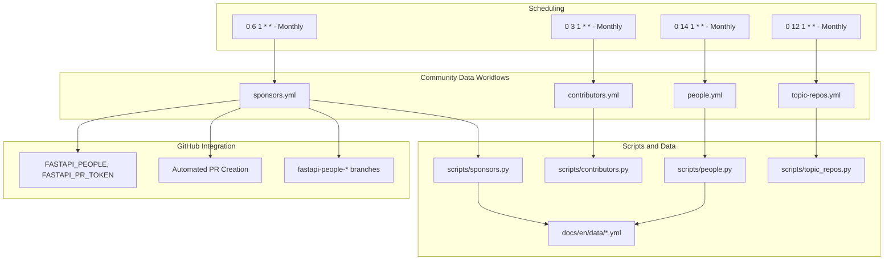

Sources: [.github/workflows/people.yml:3-55](), [.github/workflows/contributors.yml:3-54](), [.github/workflows/sponsors.yml:3-53](), [.github/workflows/topic-repos.yml:3-41]()

### Sponsor Data Processing

The `sponsors.py` script demonstrates the sophisticated data processing pipeline:

```mermaid
graph LR
    subgraph "scripts/sponsors.py Functions"
        GET_GRAPHQL_RESPONSE["get_graphql_response()"]
        GET_INDIVIDUAL_SPONSORS["get_individual_sponsors()"]
        GET_GRAPHQL_SPONSOR_EDGES["get_graphql_sponsor_edges()"]
        UPDATE_CONTENT["update_content()"]
        MAIN_FUNC["main()"]
    end
    
    subgraph "Pydantic Models"
        SPONSOR_ENTITY["class SponsorEntity"]
        TIER_MODEL["class Tier"]
        SPONSORSHIP_NODE["class SponsorshipAsMaintainerNode"]
        SPONSORS_RESPONSE["class SponsorsResponse"]
        SETTINGS_MODEL["class Settings"]
    end
    
    subgraph "Data Processing"
        SPONSORS_QUERY["sponsors_query GraphQL"]
        GITHUB_GRAPHQL_URL["github_graphql_url"]
        TIERS_DEFAULTDICT["defaultdict[float, dict[str, SponsorEntity]]"]
        GITHUB_SPONSORS_YML["docs/en/data/github_sponsors.yml"]
    end
    
    subgraph "Git and PR Automation"
        SUBPROCESS_GIT["subprocess.run git commands"]
        REPO_CREATE_PULL["repo.create_pull()"]
        BRANCH_NAME["fastapi-people-sponsors-{secrets.token_hex(4)}"]
    end
    
    MAIN_FUNC --> SETTINGS_MODEL
    MAIN_FUNC --> GET_INDIVIDUAL_SPONSORS
    GET_INDIVIDUAL_SPONSORS --> GET_GRAPHQL_SPONSOR_EDGES
    GET_GRAPHQL_SPONSOR_EDGES --> GET_GRAPHQL_RESPONSE
    GET_GRAPHQL_RESPONSE --> SPONSORS_QUERY
    GET_GRAPHQL_RESPONSE --> GITHUB_GRAPHQL_URL
    GET_GRAPHQL_RESPONSE --> SPONSORS_RESPONSE
    
    GET_INDIVIDUAL_SPONSORS --> TIERS_DEFAULTDICT
    TIERS_DEFAULTDICT --> SPONSOR_ENTITY
    TIERS_DEFAULTDICT --> TIER_MODEL
    
    MAIN_FUNC --> UPDATE_CONTENT
    UPDATE_CONTENT --> GITHUB_SPONSORS_YML
    MAIN_FUNC --> SUBPROCESS_GIT
    MAIN_FUNC --> REPO_CREATE_PULL
    SUBPROCESS_GIT --> BRANCH_NAME
```

Sources: [scripts/sponsors.py:17-45](), [scripts/sponsors.py:119-144](), [scripts/sponsors.py:192-217]()

### Issue and PR Management

The repository includes automated issue and PR management workflows:

| Workflow | Purpose | Trigger | Key Features |
|----------|---------|---------|--------------|
| `issue-manager.yml` | Auto-close stale issues | Schedule, labels, comments | Configurable delay, custom messages |
| `label-approved.yml` | Label approved PRs | Daily schedule | Approval tracking, awaiting-review label |
| `latest-changes.yml` | Update changelog | PR merge, manual | Automatic release notes generation |
| `notify-translations.yml` | Translation notifications | PR labels, close | Discussion creation for translation teams |

Sources: [.github/workflows/issue-manager.yml:22-48](), [.github/workflows/label-approved.yml:14-50](), [.github/workflows/latest-changes.yml:19-45](), [.github/workflows/notify-translations.yml:21-60]()

## Pipeline Configuration and Dependencies

The CI/CD system relies on standardized tooling and configuration across all workflows:

### Common Dependencies

| Tool | Version | Purpose | Configuration |
|------|---------|---------|---------------|
| `uv` | 0.4.15 | Package management | `astral-sh/setup-uv@v6` |
| Python | 3.8-3.13 | Runtime environment | `actions/setup-python@v5` |
| GitHub Actions | Latest | Workflow execution | Various action versions |

### Environment Variables and Secrets

```mermaid
graph TB
    subgraph "Global Environment Variables"
        UV_SYSTEM_PYTHON["env.UV_SYSTEM_PYTHON: 1"]
    end
    
    subgraph "Workflow-Specific Environment"
        COVERAGE_FILE_VAR["env.COVERAGE_FILE: coverage/.coverage.${{ runner.os }}-py${{ matrix.python-version }}"]
        GITHUB_CONTEXT_VAR["env.GITHUB_CONTEXT: ${{ toJson(github) }}"]
        TIANGOLO_BUILD_VAR["env.TIANGOLO_BUILD_PACKAGE: ${{ matrix.package }}"]
        TOKEN_VAR["env.TOKEN: ${{ secrets.FASTAPI_MKDOCS_MATERIAL_INSIDERS }}"]
        CONTEXT_VAR["env.CONTEXT: ${{ runner.os }}-py${{ matrix.python-version }}"]
    end
    
    subgraph "GitHub Secrets"
        GITHUB_TOKEN["secrets.GITHUB_TOKEN"]
        FASTAPI_LATEST_CHANGES["secrets.FASTAPI_LATEST_CHANGES"]
        FASTAPI_PEOPLE["secrets.FASTAPI_PEOPLE"]
        FASTAPI_PR_TOKEN["secrets.FASTAPI_PR_TOKEN"]
        FASTAPI_MKDOCS_MATERIAL_INSIDERS["secrets.FASTAPI_MKDOCS_MATERIAL_INSIDERS"]
        CLOUDFLARE_API_TOKEN["secrets.CLOUDFLARE_API_TOKEN"]
        CLOUDFLARE_ACCOUNT_ID["secrets.CLOUDFLARE_ACCOUNT_ID"]
        SMOKESHOW_AUTH_KEY["secrets.SMOKESHOW_AUTH_KEY"]
        SPONSORS_TOKEN["secrets.SPONSORS_TOKEN"]
    end
    
    subgraph "Permissions"
        ID_TOKEN_WRITE["permissions.id-token: write"]
        CONTENTS_WRITE["permissions.contents: write"]
        DEPLOYMENTS_WRITE["permissions.deployments: write"]
        ISSUES_WRITE["permissions.issues: write"]
        PULL_REQUESTS_WRITE["permissions.pull-requests: write"]
        STATUSES_WRITE["permissions.statuses: write"]
        DISCUSSIONS_WRITE["permissions.discussions: write"]
    end
    
    UV_SYSTEM_PYTHON --> COVERAGE_FILE_VAR
    UV_SYSTEM_PYTHON --> GITHUB_CONTEXT_VAR
    UV_SYSTEM_PYTHON --> TIANGOLO_BUILD_VAR
    
    GITHUB_TOKEN --> FASTAPI_LATEST_CHANGES
    FASTAPI_LATEST_CHANGES --> FASTAPI_PEOPLE
    FASTAPI_PEOPLE --> FASTAPI_PR_TOKEN
    FASTAPI_PR_TOKEN --> CLOUDFLARE_API_TOKEN
    CLOUDFLARE_API_TOKEN --> SMOKESHOW_AUTH_KEY
```

Sources: [.github/workflows/test.yml:15-16](), [.github/workflows/build-docs.yml:11-12](), [.github/workflows/publish.yml:34-35]()

### Branch Protection and Status Checks

The pipeline implements comprehensive status checking through "all-green" jobs that aggregate multiple workflow results:

- `docs-all-green` in `build-docs.yml` - Aggregates documentation build status
- `check` in `test.yml` - Aggregates test and coverage results  
- `test-redistribute-alls-green` in `test-redistribute.yml` - Aggregates distribution test results

These jobs use the `re-actors/alls-green@release/v1` action to provide unified status reporting for branch protection rules.

Sources: [.github/workflows/build-docs.yml:127-137](), [.github/workflows/test.yml:142-155](), [.github/workflows/test-redistribute.yml:60-69]()