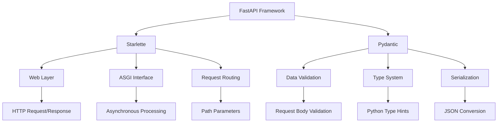
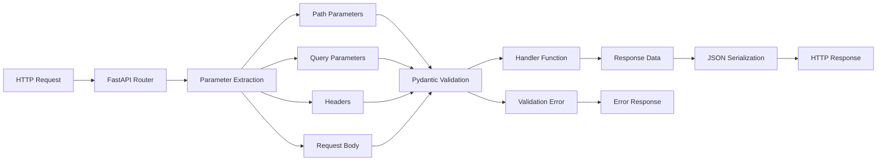
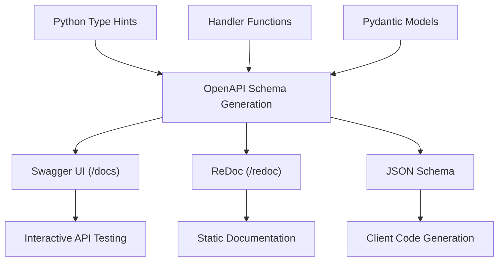
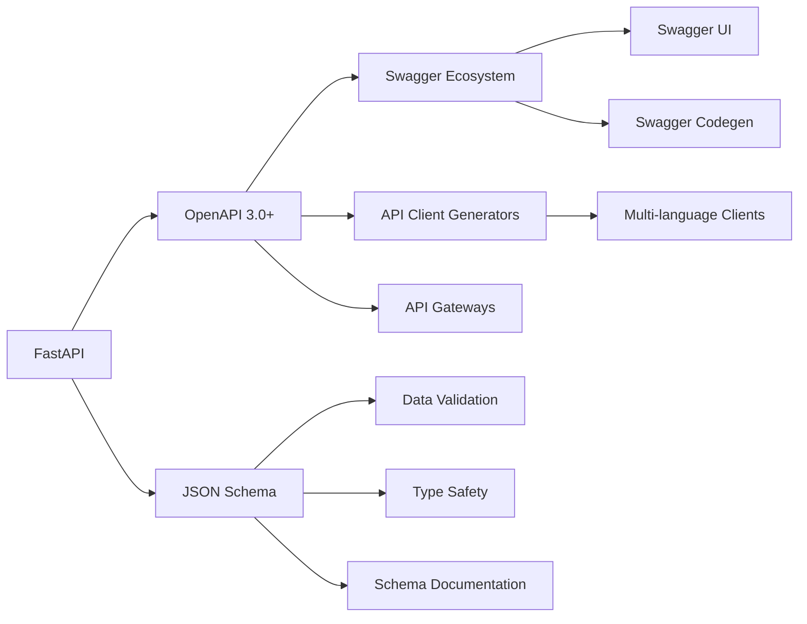

This document provides a comprehensive overview of FastAPI, a modern, high-performance web framework for building APIs with Python. It covers the framework's core architecture, key features, and fundamental concepts that developers need to understand when working with FastAPI applications.

For detailed information about specific FastAPI components and subsystems, see [Core Architecture](#2). For deployment and production considerations, see [Deployment and Production Considerations](#4.4). For testing approaches, see [Testing Infrastructure](#5).

## Purpose and Scope

FastAPI is a web framework designed for building REST APIs with Python, leveraging standard Python type hints to provide automatic validation, serialization, and interactive documentation generation. The framework prioritizes developer productivity, runtime performance, and production readiness while maintaining standards compliance with OpenAPI and JSON Schema specifications.

**Sources:** [README.md:30-41](), [docs/en/docs/index.md:36-47]()

## Architectural Foundations

FastAPI is built on two foundational libraries that provide complementary capabilities:



### Core Dependencies

The framework relies on two primary dependencies that handle different aspects of API functionality:

| Component | Responsibility | Key Features |
|-----------|---------------|--------------|
| Starlette | Web layer and ASGI handling | Request routing, middleware, WebSocket support, testing utilities |
| Pydantic | Data validation and serialization | Type-based validation, automatic parsing, JSON schema generation |

**Sources:** [README.md:126-129](), [docs/en/docs/index.md:124-127]()

## Request Processing Pipeline

FastAPI processes incoming requests through a structured pipeline that integrates type validation with HTTP handling:



The framework automatically handles parameter extraction, type validation, and response serialization based on Python type annotations declared in handler functions.

**Sources:** [README.md:387-404](), [docs/en/docs/index.md:385-402]()

## Key Framework Features

FastAPI provides several integrated capabilities that distinguish it from other Python web frameworks:

### Automatic Documentation Generation



The framework automatically generates OpenAPI-compliant documentation from type-annotated Python code, eliminating the need for separate documentation maintenance.

**Sources:** [README.md:261-273](), [docs/en/docs/index.md:259-271]()

### Performance Characteristics

FastAPI achieves high performance through several architectural decisions:

| Aspect | Implementation | Benefit |
|--------|---------------|---------|
| ASGI Foundation | Built on Starlette's ASGI implementation | Asynchronous request handling |
| Type Validation | Pydantic's optimized C extensions | Fast data parsing and validation |
| Minimal Overhead | Direct integration without abstraction layers | Reduced request processing latency |

Independent benchmarks position FastAPI among the fastest Python web frameworks, comparable to NodeJS and Go implementations.

**Sources:** [README.md:449-453](), [docs/en/docs/index.md:447-451]()

## Installation and Dependencies

FastAPI supports multiple installation configurations to accommodate different use cases:

### Standard Installation

The recommended installation includes commonly used dependencies:

```bash
pip install "fastapi[standard]"
```

This installation includes:
- `uvicorn` - ASGI server for development and production
- `fastapi-cli` - Command-line interface for FastAPI applications
- `httpx` - HTTP client for testing
- `jinja2` - Template engine support
- `python-multipart` - Form parsing capabilities

### Minimal Installation

For production environments with specific dependency requirements:

```bash
pip install fastapi
```

This provides only the core FastAPI functionality without optional dependencies.

**Sources:** [README.md:131-486](), [docs/en/docs/index.md:129-484]()

## Standards Compliance

FastAPI maintains full compatibility with established API standards:



This standards compliance ensures interoperability with existing API tooling and enables automatic client generation for multiple programming languages.

**Sources:** [README.md:41-47](), [docs/en/docs/index.md:41-47]()

## Development Workflow

FastAPI supports rapid development through integrated tooling:

| Tool | Purpose | Command |
|------|---------|---------|
| FastAPI CLI | Development server with auto-reload | `fastapi dev main.py` |
| Interactive Documentation | API testing and exploration | Access `/docs` endpoint |
| Type Checking | Static analysis integration | Compatible with `mypy`, `pytest` |
| Testing Framework | Built-in test client | Uses `TestClient` from Starlette |

The framework's development experience emphasizes fast iteration cycles with immediate feedback through automatic documentation updates and development server reloading.

**Sources:** [README.md:202-238](), [docs/en/docs/index.md:200-236]()

## Community and Ecosystem

FastAPI maintains an active community with supporting tools and resources:

### Sponsorship and Support

The project receives sponsorship from cloud providers and development tool companies, ensuring continued maintenance and development. Major sponsors include infrastructure providers that offer FastAPI deployment guides and optimized hosting solutions.

### Related Projects

- **Typer** - Command-line interface framework using similar design principles
- **SQLModel** - Database ORM integration designed for FastAPI compatibility
- **Starlette** - Underlying ASGI framework
- **Pydantic** - Data validation library

**Sources:** [README.md:45-68](), [docs/en/data/sponsors.yml:1-61](), [docs/en/docs/index.md:51-66]()