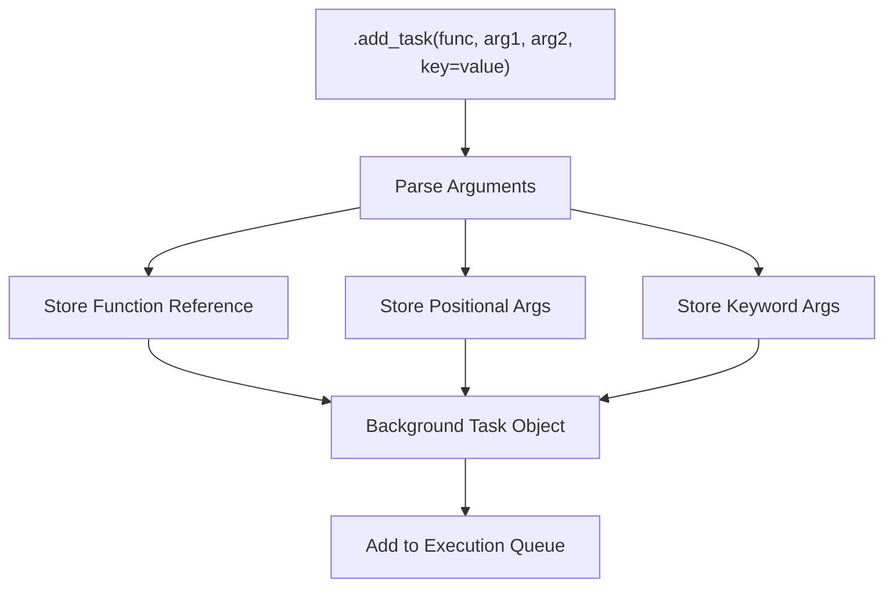
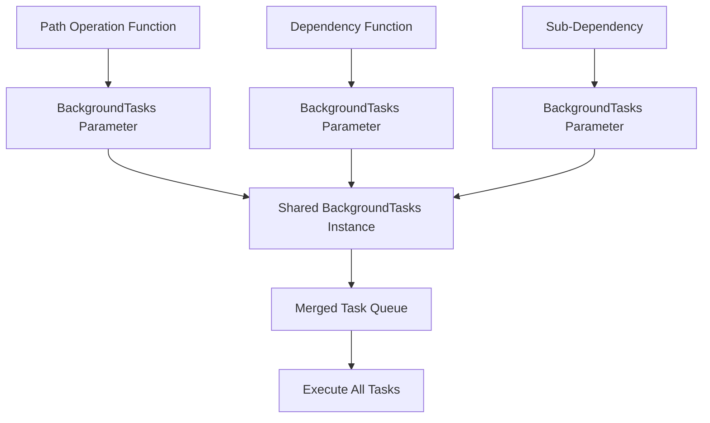
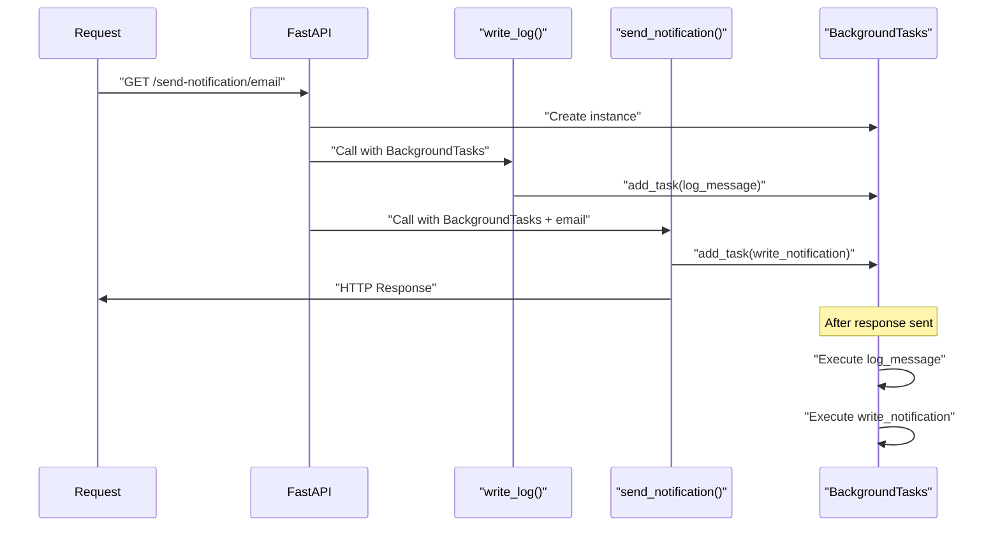
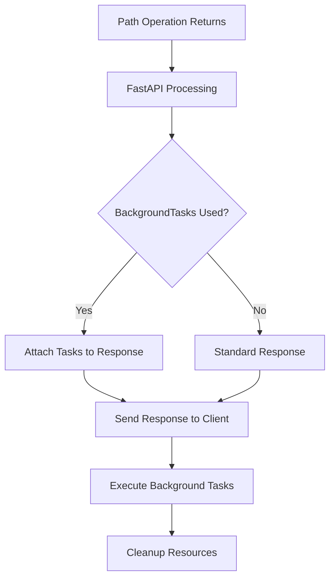
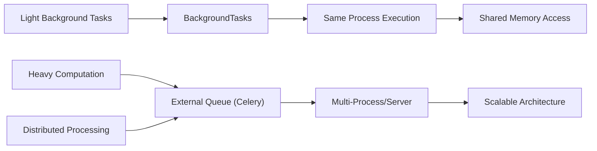

background_tasks.add_task(task_function, *args, **kwargs)
```

### Task Function Parameter Handling



The `.add_task()` method accepts:
- A callable function as the first argument
- Any positional arguments to pass to the function
- Any keyword arguments to pass to the function

Sources: [docs/en/docs/tutorial/background-tasks.md:42-46]()

## Dependency Injection Integration

### Multi-Level Background Task Usage



FastAPI automatically reuses the same `BackgroundTasks` instance across all dependency levels within a single request, ensuring all background tasks are collected and executed together.

### Dependency Injection Example Flow



Sources: [docs/en/docs/tutorial/background-tasks.md:48-63]()

## Technical Implementation Details

### Starlette Integration

FastAPI's background task system is a thin wrapper around Starlette's implementation:

| Component | FastAPI | Starlette |
|-----------|---------|-----------|
| Import Path | `from fastapi import BackgroundTasks` | `from starlette.background import BackgroundTasks` |
| Class | Re-exported reference | Original implementation |
| Alternative | `BackgroundTask` (single) | `BackgroundTask` (single) |

The key difference is that FastAPI provides `BackgroundTasks` (plural) as a dependency injection parameter, while `BackgroundTask` (singular) requires manual instantiation and response handling.

### Response Integration Mechanism



When `BackgroundTasks` is used as a parameter, FastAPI automatically attaches the queued tasks to the response object, ensuring they execute after the response is sent.

Sources: [docs/en/docs/tutorial/background-tasks.md:66-74]()

## Use Cases and Limitations

### Appropriate Use Cases

Background tasks are suitable for:
- Email notifications after user actions
- File processing that can be asynchronous
- Logging and analytics
- Cache warming
- Cleanup operations

### Performance Considerations



For heavy computational tasks or distributed processing, external task queue systems like Celery are recommended over FastAPI's built-in background tasks.

### Memory and Resource Sharing

Background tasks in FastAPI:
- Run in the same process as the web application
- Have access to shared memory and variables
- Are suitable for lightweight operations
- Should not be used for long-running or resource-intensive tasks

Sources: [docs/en/docs/tutorial/background-tasks.md:76-87]()