@pytest.mark.parametrize(
    "path,expected_status,expected_response",
    [
        ("/api_route", 200, {"message": "Hello World"}),
        ("/non_decorated_route", 200, {"message": "Hello World"}), 
        ("/nonexistent", 404, {"detail": "Not Found"}),
    ],
)
def test_get_path(path, expected_status, expected_response):
    response = client.get(path)
    assert response.status_code == expected_status
    assert response.json() == expected_response
```

Sources: [tests/test_application.py:10-22](), [tests/test_tutorial/test_cookie_param_models/test_tutorial002.py:17-36]()

# Code Quality and Pre-commit


This document covers the code quality infrastructure and pre-commit hook system used in the FastAPI repository. It details the configuration and usage of linting, formatting, type checking, and automated quality gates that ensure code consistency and reliability.

For information about the actual test framework and testing utilities, see [Test Framework and Tools](#5.1). For CI/CD automation that runs these quality checks, see [CI/CD Pipeline](#6.2).

## Pre-commit Hook System

FastAPI uses a comprehensive pre-commit hook system to enforce code quality standards before commits are made to the repository. The configuration is defined in [.pre-commit-config.yaml:1-26]().

### Hook Configuration

The pre-commit system is configured with Python 3.10 as the default language version and includes two main repository sources:

```mermaid
graph TB
    subgraph "Pre-commit Configuration"
        CONFIG[".pre-commit-config.yaml"]
        PYTHON_VERSION["default_language_version: python3.10"]
    end
    
    subgraph "pre-commit-hooks Repository v6.0.0"
        LARGE_FILES["id: check-added-large-files"]
        CHECK_TOML["id: check-toml"]
        CHECK_YAML["id: check-yaml args: --unsafe"]
        EOF_FIXER["id: end-of-file-fixer"]
        TRAILING_WS["id: trailing-whitespace"]
    end
    
    subgraph "ruff-pre-commit Repository v0.12.10"
        RUFF_LINT["id: ruff args: --fix"]
        RUFF_FORMAT["id: ruff-format"]
    end
    
    subgraph "Pre-commit.ci Integration"
        AUTOFIX["autofix_commit_msg"]
        AUTOUPDATE["autoupdate_commit_msg"]
    end
    
    CONFIG --> PYTHON_VERSION
    CONFIG --> LARGE_FILES
    CONFIG --> CHECK_TOML
    CONFIG --> CHECK_YAML
    CONFIG --> EOF_FIXER
    CONFIG --> TRAILING_WS
    CONFIG --> RUFF_LINT
    CONFIG --> RUFF_FORMAT
    CONFIG --> AUTOFIX
    CONFIG --> AUTOUPDATE
```

The system includes validation hooks for file formats and content, plus automated code quality enforcement through Ruff.

**Sources:** [.pre-commit-config.yaml:1-26]()

### Pre-commit.ci Integration

The configuration includes integration with pre-commit.ci for automated maintenance:

| Feature | Configuration | Description |
|---------|---------------|-------------|
| Auto-fix Messages | `🎨 [pre-commit.ci] Auto format from pre-commit.com hooks` | Commit messages for automatic fixes |
| Auto-update Messages | `⬆ [pre-commit.ci] pre-commit autoupdate` | Commit messages for dependency updates |

**Sources:** [.pre-commit-config.yaml:24-25]()

## Code Linting and Formatting with Ruff

FastAPI uses Ruff as its primary tool for both code linting and formatting, replacing multiple traditional tools with a single, fast implementation.

### Ruff Configuration

The Ruff configuration includes two main hooks:

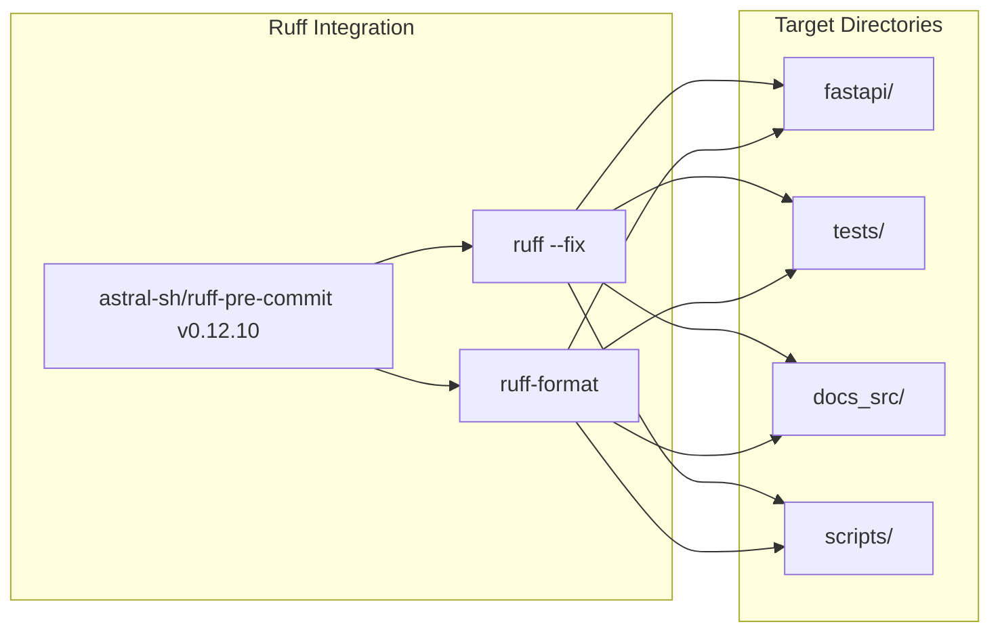

**Sources:** [.pre-commit-config.yaml:16-22](), [scripts/lint.sh:7-8](), [scripts/format.sh:4-5]()

### Manual Code Quality Scripts

The repository provides several scripts for manual execution of code quality tools:

| Script | Purpose | Commands |
|--------|---------|----------|
| `scripts/lint.sh` | Run linting and type checking | `mypy fastapi`, `ruff check`, `ruff format --check` |
| `scripts/format.sh` | Apply code formatting | `ruff check --fix`, `ruff format` |

**Sources:** [scripts/lint.sh:1-9](), [scripts/format.sh:1-6]()

## Type Checking with mypy

FastAPI uses mypy for static type checking to ensure type safety across the codebase.

### mypy Configuration

The mypy version is pinned in the test requirements and executed as part of the linting process:

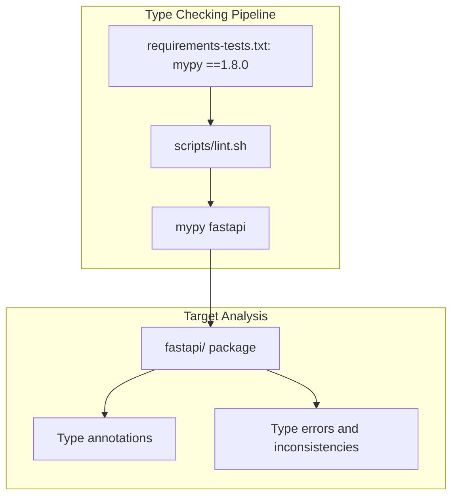

**Sources:** [requirements-tests.txt:5](), [scripts/lint.sh:6]()

## Test Coverage Infrastructure

The repository includes comprehensive test coverage tracking using the `coverage` tool.

### Coverage Configuration

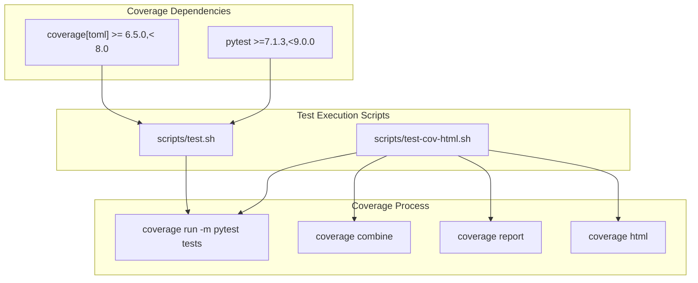

The test execution includes setting `PYTHONPATH=./docs_src` to include documentation source code in the test environment.

**Sources:** [requirements-tests.txt:3-4](), [scripts/test.sh:6-7](), [scripts/test-cov-html.sh:6-9]()

## Testing Infrastructure Dependencies

The testing infrastructure includes several specialized testing libraries and utilities:

| Dependency | Version | Purpose |
|------------|---------|---------|
| `pytest` | `>=7.1.3,<9.0.0` | Main testing framework |
| `coverage[toml]` | `>= 6.5.0,< 8.0` | Test coverage measurement |
| `mypy` | `==1.8.0` | Static type checking |
| `dirty-equals` | `==0.9.0` | Flexible equality testing |
| `inline-snapshot` | `>=0.21.1` | Snapshot testing |

**Sources:** [requirements-tests.txt:3-6](), [requirements-tests.txt:13]()

### Testing Utilities and Patterns

The repository includes specialized testing utilities for handling different Python versions and Pydantic versions:

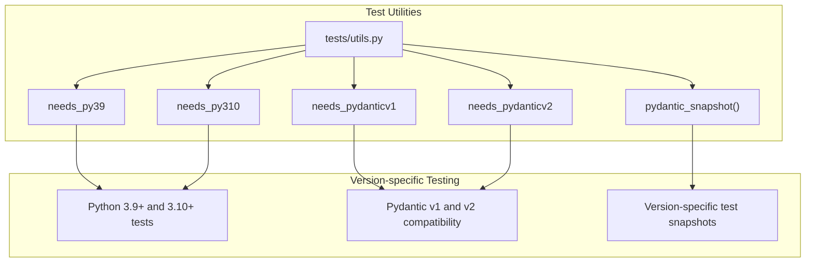

The `pydantic_snapshot` function enables version-specific snapshot testing for maintaining compatibility across Pydantic versions.

**Sources:** [tests/utils.py:7-12](), [tests/utils.py:15-34]()

## Quality Assurance Integration

The code quality system integrates with the broader development workflow through standardized scripts and dependency management:

### Development Dependencies

The main requirements file includes pre-commit as a development dependency:

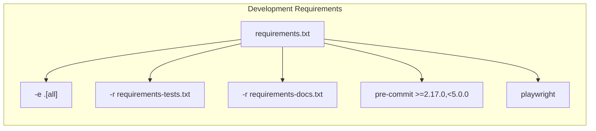

**Sources:** [requirements.txt:1-7]()

### Script Integration Patterns

The quality assurance scripts follow consistent patterns for error handling and output:

| Script Feature | Implementation | Purpose |
|----------------|----------------|---------|
| Error Handling | `set -e` | Exit on any command failure |
| Verbose Output | `set -x` | Display executed commands |
| Environment Setup | `export PYTHONPATH=./docs_src` | Include docs in Python path |
| Parameter Passing | `${@}` | Forward all script arguments |

**Sources:** [scripts/test.sh:3-4](), [scripts/lint.sh:3-4](), [scripts/format.sh:2]()

# Project Infrastructure


This document covers the fundamental project infrastructure of FastAPI, including the build system, packaging configuration, dependency management, and development tool configurations. The infrastructure serves as the foundation that enables FastAPI's development workflow, testing, and distribution.

For information about the documentation build system, see [Documentation System](#6.1). For CI/CD automation workflows, see [CI/CD Pipeline](#6.2). For development scripts and contributor workflows, see [Development Workflow](#6.3).

## Build System and Packaging

FastAPI uses a modern Python packaging approach centered around PDM (Python Dependency Manager) as the build backend. The project configuration is entirely defined in `pyproject.toml`, following PEP 518 standards.

### Build Configuration

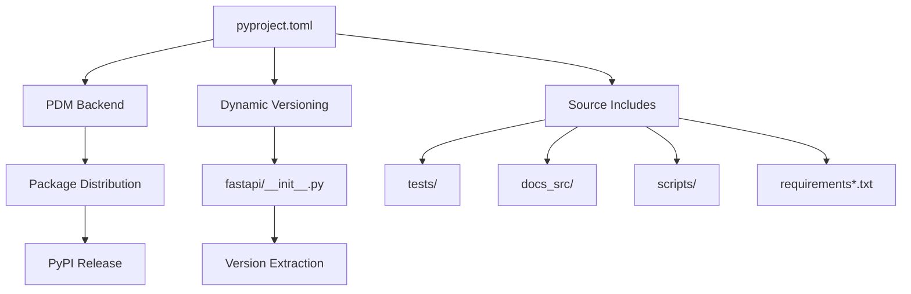

**Build System Configuration**

The build system is configured in [pyproject.toml:1-3](), specifying PDM as the backend. The `pdm.backend` handles all packaging operations, from source distribution to wheel creation.

**Dynamic Versioning**

Version management is handled dynamically through [pyproject.toml:127-128](), extracting the version from [fastapi/__init__.py](). This ensures the package version stays synchronized with the codebase version without manual updates.

**Source Distribution Includes**

The build includes additional directories beyond the core package [pyproject.toml:132-139]():
- `tests/` - Test suite for distribution validation
- `docs_src/` - Documentation source examples  
- `scripts/` - Development and utility scripts
- `requirements*.txt` - Dependency specifications
- `docs/en/docs/img/favicon.png` - Required for testing

Sources: [pyproject.toml:1-139]()

### Package Metadata and Dependencies

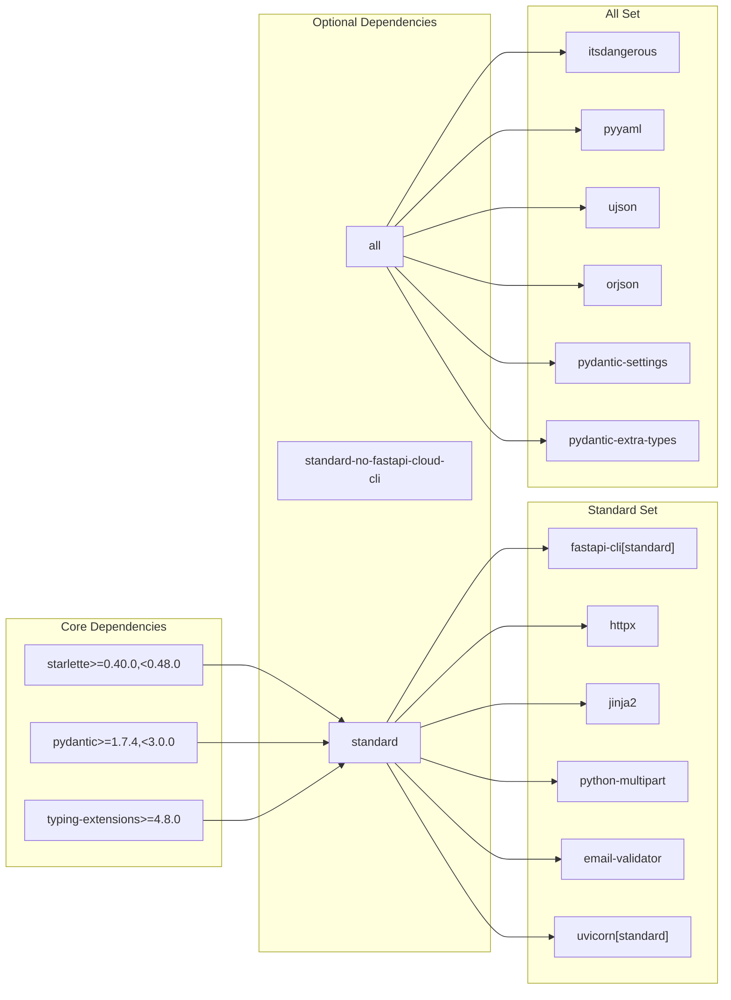

**Core Dependencies**

FastAPI maintains minimal core dependencies [pyproject.toml:45-49]():
- `starlette` - ASGI framework foundation
- `pydantic` - Data validation and serialization
- `typing-extensions` - Enhanced type hints

**Optional Dependency Sets**

Three optional dependency sets provide different installation profiles [pyproject.toml:58-122]():

| Set | Purpose | Key Components |
|-----|---------|----------------|
| `standard` | Common web app features | CLI, HTTP client, templates, file uploads |
| `standard-no-fastapi-cloud-cli` | Standard without FastAPI Cloud | Same as standard minus cloud CLI |
| `all` | Complete feature set | All standard features plus JSON, sessions, settings |

**CLI Entry Point**

The package provides a command-line interface through [pyproject.toml:124-125](), mapping the `fastapi` command to `fastapi.cli:main`.

Sources: [pyproject.toml:5-125]()

## Development Tool Configuration

FastAPI integrates multiple development tools through centralized configuration, ensuring consistent code quality and development experience across the project.

### Type Checking and Linting

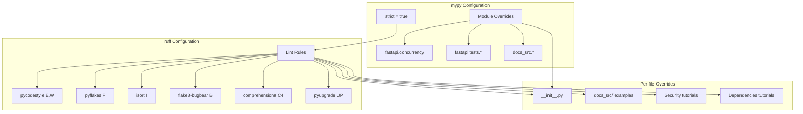

**MyPy Type Checking**

Strict type checking is enabled globally [pyproject.toml:144-145]() with targeted overrides for specific modules:
- `fastapi.concurrency` - Relaxed import checking due to threading complexity
- `fastapi.tests.*` - Allow missing imports for test isolation
- `docs_src.*` - Relaxed rules for documentation examples

**Ruff Linting and Formatting**

Comprehensive linting rules [pyproject.toml:211-226]() cover:
- Code style enforcement (pycodestyle)
- Import organization (isort)  
- Bug prevention (flake8-bugbear)
- Code modernization (pyupgrade)

Extensive per-file overrides [pyproject.toml:228-258]() accommodate documentation examples and tutorial code that intentionally demonstrates specific patterns.

Sources: [pyproject.toml:144-266]()

### Testing and Coverage Configuration

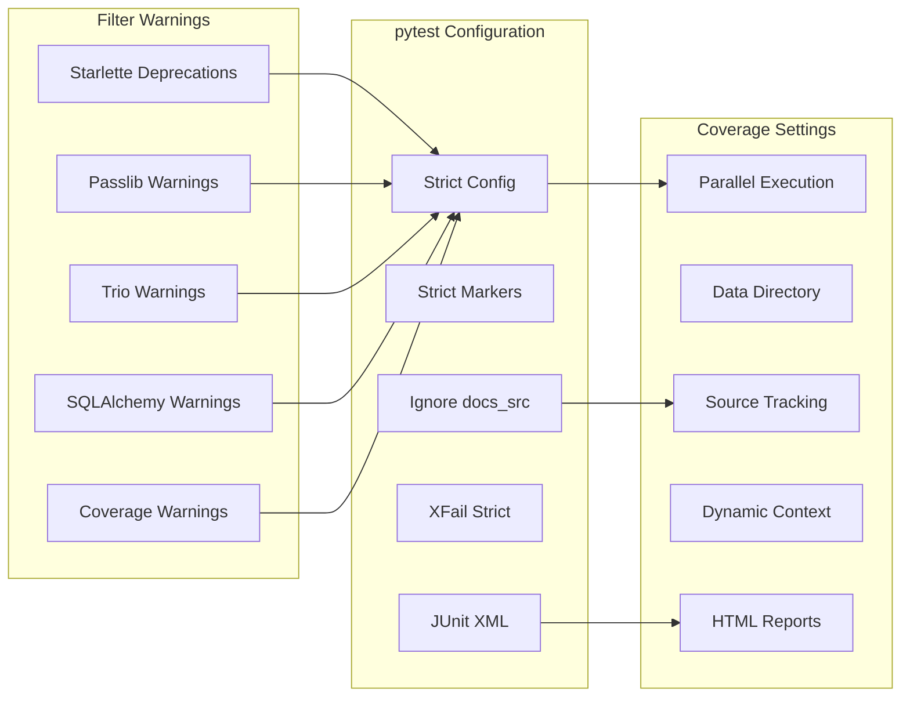

**Pytest Configuration**

Test execution is configured for strict validation [pyproject.toml:163-170]():
- Strict configuration prevents typos in pytest options
- Strict markers require all test markers to be registered
- Documentation source is excluded from test discovery
- XFail strict mode prevents accidentally passing expected failures

**Coverage Tracking**

Comprehensive coverage configuration [pyproject.toml:189-210]() enables:
- Parallel test execution with data aggregation
- Source tracking across `fastapi`, `tests`, and `docs_src`
- Dynamic context tracking per test function
- HTML reports with test context display

**Warning Filters**

Extensive warning filters [pyproject.toml:171-187]() handle known issues:
- Framework deprecation warnings (Starlette, SQLAlchemy)
- Library compatibility warnings (passlib, trio)
- Python version-specific warnings

Sources: [pyproject.toml:163-210]()

## Project Metadata and Distribution

The project maintains comprehensive metadata for PyPI distribution and ecosystem integration.

### Package Classification and Compatibility

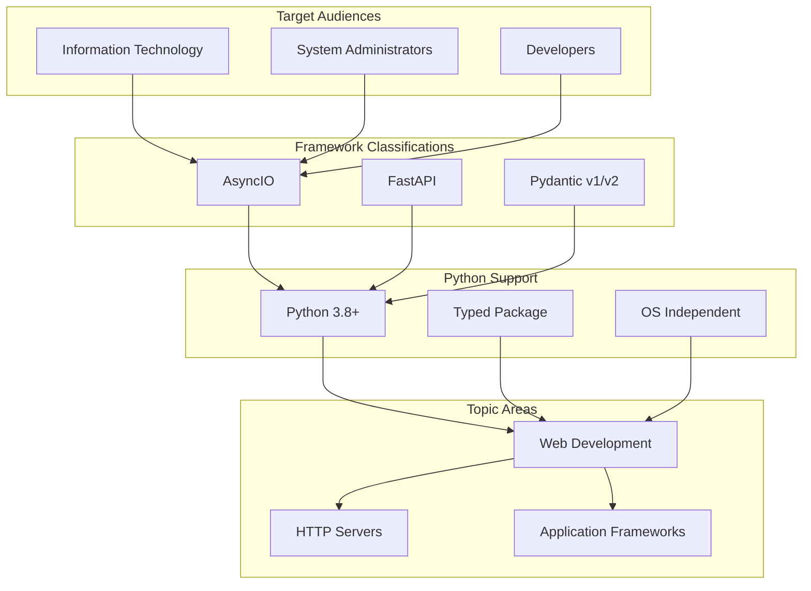

**Compatibility Matrix**

FastAPI supports a broad compatibility matrix [pyproject.toml:36-41]():
- Python versions: 3.8 through 3.13
- Framework integrations: AsyncIO, Pydantic v1/v2
- Operating systems: Platform independent
- Development status: Beta (stable API, active development)

**Project URLs and Resources**

The package provides comprehensive resource links [pyproject.toml:51-56]():

| Resource | URL |
|----------|-----|
| Homepage | GitHub repository |
| Documentation | Official docs site |
| Issues | GitHub issue tracker |
| Changelog | Release notes section |

Sources: [pyproject.toml:14-56]()

## Slim Package Variant

FastAPI supports a minimal distribution variant for specialized deployment scenarios.

### Slim Build Configuration

The project includes configuration for generating a `fastapi-slim` package [pyproject.toml:141-142]() through the `tiangolo._internal-slim-build` tool. This variant likely excludes optional dependencies and development tools for reduced installation size.

This configuration enables:
- Lightweight container deployments
- Minimal dependency installations
- Specialized distribution channels

Sources: [pyproject.toml:141-142]()

The project infrastructure provides a robust foundation for FastAPI's development, testing, and distribution processes. The configuration balances strict quality standards with practical development needs, supporting both core maintainers and the broader contributor community through comprehensive tooling and clear dependency management.