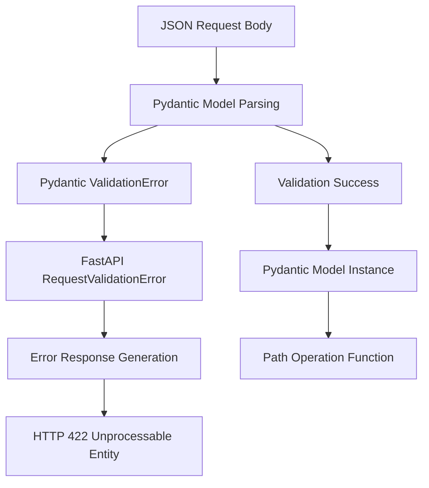
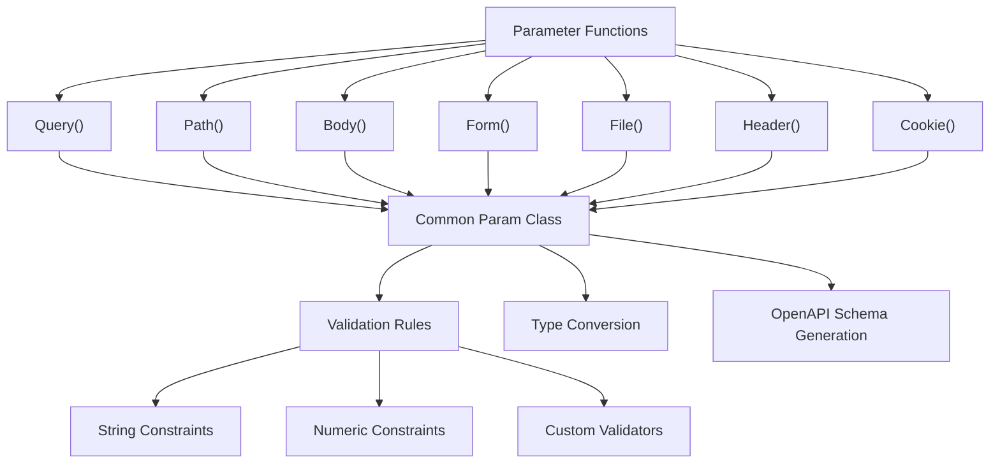
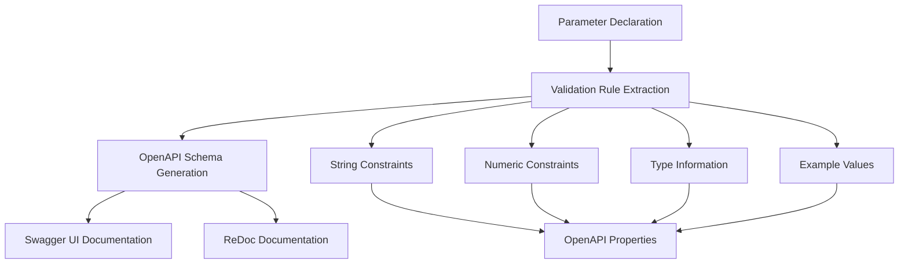

```

Sources: [docs/en/docs/tutorial/query-params-str-validations.md:273-304]()

## Path Parameter Validation

Path parameters use the `Path()` function and support the same validation features as query parameters, plus numeric constraints for integer and float values.

### Numeric Validation Constraints

Path parameters support numeric validation rules:

- `gt` - Greater than
- `ge` - Greater than or equal
- `lt` - Less than  
- `le` - Less than or equal

```python
from typing import Annotated
from fastapi import Path

item_id: Annotated[int, Path(ge=1)]  # Must be >= 1
size: Annotated[float, Path(gt=0, lt=1000)]  # Between 0 and 1000
```

Sources: [docs/en/docs/tutorial/path-params-numeric-validations.md:104-132]()

## Request Body Validation

Request body validation primarily uses Pydantic models, which provide comprehensive validation, type conversion, and documentation generation.

### Pydantic Model Integration

FastAPI automatically converts JSON request bodies to Pydantic model instances:

```python
from pydantic import BaseModel

class Item(BaseModel):
    name: str
    description: str | None = None
    price: float
    tax: float | None = None
```

The validation system automatically:
- Validates data types
- Converts compatible types
- Generates clear error messages
- Creates OpenAPI schema documentation

Sources: [docs/en/docs/tutorial/body.md:21-78]()

### Validation Error Handling



Sources: [docs/en/docs/tutorial/handling-errors.md:120-173]()

## Custom Validation

The system supports custom validation through Pydantic's validator functions, enabling complex business logic validation beyond basic type and constraint checking.

### AfterValidator Integration

Custom validators can be applied using Pydantic's `AfterValidator`:

```python
from typing import Annotated
from pydantic import AfterValidator

def validate_item_id(v: str) -> str:
    if not v.startswith(("isbn-", "imdb-")):
        raise ValueError("Item ID must start with 'isbn-' or 'imdb-'")
    return v

item_id: Annotated[str, AfterValidator(validate_item_id)]
```

Sources: [docs/en/docs/tutorial/query-params-str-validations.md:409-440]()

## Parameter Function Architecture



Sources: [docs/en/docs/tutorial/path-params-numeric-validations.md:144-164]()

## Type Conversion System

FastAPI automatically handles type conversion between HTTP string values and Python types, supporting complex data types beyond basic primitives.

### Supported Data Types

The system supports conversion for:

- Basic types: `int`, `float`, `str`, `bool`
- Date/time types: `datetime`, `date`, `time`, `timedelta`
- Complex types: `UUID`, `bytes`, `Decimal`
- Collections: `list`, `set`, `frozenset`

Sources: [docs/en/docs/tutorial/extra-data-types.md:20-52]()

## OpenAPI Integration

All parameter validation rules are automatically reflected in the generated OpenAPI schema, providing accurate API documentation that matches the actual validation behavior.

### Schema Generation Flow



Sources: [docs/en/docs/tutorial/query-params-str-validations.md:104-109](), [docs/en/docs/tutorial/path-params-numeric-validations.md:21-33]()

## Error Response Format

Validation failures result in standardized HTTP 422 responses with detailed error information including field locations, error messages, and error types.

### RequestValidationError Structure

The error response contains:
- `detail` - Array of validation errors
- `loc` - Location of the error (path, query, body, etc.)
- `msg` - Human-readable error message
- `type` - Error type identifier

Sources: [docs/en/docs/tutorial/handling-errors.md:122-156]()

## Advanced Configuration

### Parameter Exclusion and Documentation

Parameters can be excluded from OpenAPI documentation while maintaining validation:

```python
# Exclude from OpenAPI schema
q: Annotated[str, Query(include_in_schema=False)]

# Mark as deprecated
q: Annotated[str, Query(deprecated=True)]
```

Sources: [docs/en/docs/tutorial/query-params-str-validations.md:403-407](), [docs/en/docs/tutorial/query-params-str-validations.md:389-401]()

### Metadata and Documentation Enhancement

Parameters support rich metadata for enhanced documentation:

- `title` - Parameter title in documentation
- `description` - Detailed parameter description
- `example` - Example value for documentation

Sources: [docs/en/docs/tutorial/query-params-str-validations.md:347-367]()