This document covers FastAPI's automatic OpenAPI specification generation system. It explains how FastAPI introspects route definitions, parameters, dependencies, and security requirements to produce a complete OpenAPI 3.1.0 schema. For information about customizing the documentation UI that consumes this schema, see [Customizing API Documentation UI](#3.2).

## Architecture Overview

FastAPI's OpenAPI generation system operates through a multi-stage pipeline that transforms application route definitions into OpenAPI specification components. The system analyzes route handlers, their parameters, dependencies, response models, and security requirements to generate comprehensive API documentation.

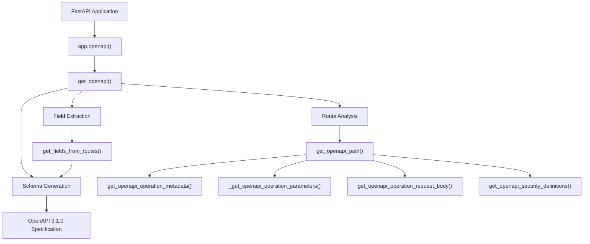

**Diagram: OpenAPI Generation Pipeline**

Sources: [fastapi/applications.py:773-844](), [fastapi/openapi/utils.py:477-551]()

## Core Components

### FastAPI Application Entry Point

The `FastAPI` class provides the primary interface for OpenAPI generation through its `openapi()` method. This method caches the generated schema and delegates the actual generation to utility functions.

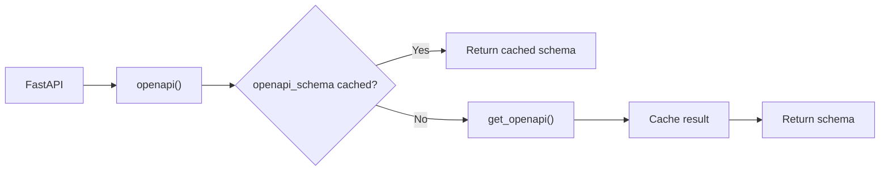

**Diagram: FastAPI OpenAPI Method Flow**

Sources: [fastapi/applications.py:773-844]()

### Route Processing System

The `get_openapi_path()` function processes individual `APIRoute` instances to generate OpenAPI path objects. It extracts operation metadata, parameters, request bodies, and security definitions.

| Component | Function | Purpose |
|-----------|----------|---------|
| `get_openapi_operation_metadata()` | Operation details | Generates operationId, summary, description, tags |
| `_get_openapi_operation_parameters()` | Parameter extraction | Processes path, query, header, cookie parameters |
| `get_openapi_operation_request_body()` | Request body schema | Generates request body specifications |
| `get_openapi_security_definitions()` | Security schemas | Extracts security requirements from dependencies |

Sources: [fastapi/openapi/utils.py:254-443]()

### Dependency Analysis

The system leverages FastAPI's dependency injection analysis to generate parameter and security schemas. The `get_flat_dependant()` function flattens the dependency tree to extract all parameters.

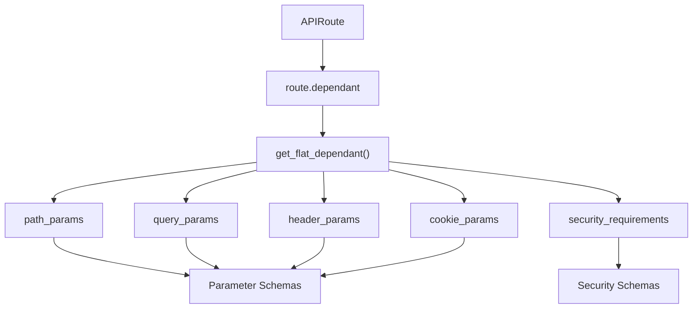

**Diagram: Dependency Analysis for Schema Generation**

Sources: [fastapi/dependencies/utils.py:177-209](), [fastapi/openapi/utils.py:95-167]()

## Schema Generation Process

### Main Generation Function

The `get_openapi()` function serves as the primary orchestrator, coordinating field extraction, schema generation, and component assembly into a complete OpenAPI specification.

Key steps performed:
1. Extract all model fields from routes and webhooks
2. Generate JSON schemas for all models
3. Process each route to create path items
4. Assemble components, security schemes, and definitions
5. Build final OpenAPI specification

Sources: [fastapi/openapi/utils.py:477-551]()

### Field Extraction and Schema Generation

The `get_fields_from_routes()` function extracts all `ModelField` instances from application routes, including request bodies, response models, and parameter definitions.

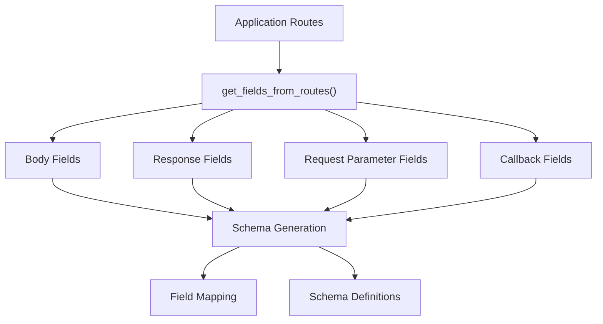

**Diagram: Field Extraction and Schema Generation**

Sources: [fastapi/openapi/utils.py:446-474]()

### Parameter Schema Generation

The `_get_openapi_operation_parameters()` function processes route dependencies to generate OpenAPI parameter definitions for path, query, header, and cookie parameters.

The function handles:
- Parameter grouping by type (path, query, header, cookie)
- Schema generation for each parameter
- Alias resolution and underscore conversion for headers
- Example and description extraction
- Deprecation marking

Sources: [fastapi/openapi/utils.py:95-167]()

### Request Body Schema Generation

The `get_openapi_operation_request_body()` function generates OpenAPI request body specifications from route body fields, including content-type handling and example extraction.

Sources: [fastapi/openapi/utils.py:170-204]()

## Security Schema Generation

FastAPI automatically generates OpenAPI security schemes from security dependencies in route definitions. The `get_openapi_security_definitions()` function extracts security requirements and converts them to OpenAPI security scheme definitions.

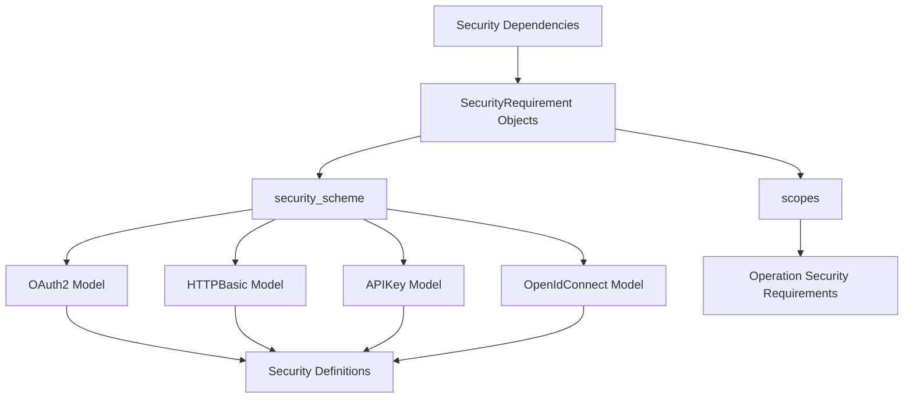

**Diagram: Security Schema Generation Process**

Sources: [fastapi/openapi/utils.py:78-92](), [fastapi/security/oauth2.py:308-377](), [fastapi/security/http.py:69-95](), [fastapi/security/api_key.py:11-21]()

## Response Schema Generation

The system generates response schemas from route response models and additional response definitions. For routes with response models, it creates schema definitions and links them to appropriate HTTP status codes.

The response generation process handles:
- Default response schemas from route response models
- Additional responses defined in route configuration
- HTTP status code validation for body content
- Media type determination based on response class

Sources: [fastapi/openapi/utils.py:354-443]()

## Operation ID Generation

Each OpenAPI operation requires a unique `operationId`. FastAPI provides a default generation strategy through the `generate_unique_id()` function, which creates IDs from route names, paths, and HTTP methods.

The generation process:
1. Combines route name and path format
2. Sanitizes non-word characters  
3. Appends HTTP method
4. Ensures uniqueness across operations

Sources: [fastapi/utils.py:179-184](), [fastapi/openapi/utils.py:228-251]()

## Validation Error Schema

FastAPI automatically includes validation error response schemas for routes with parameters or request bodies. The system adds HTTP 422 responses with standardized error schema definitions.

The validation error schema includes:
- `ValidationError` component definition
- `HTTPValidationError` wrapper definition  
- Automatic inclusion for routes with parameters

Sources: [fastapi/openapi/utils.py:41-66](), [fastapi/openapi/utils.py:419-439]()

## Customization Points

### OpenAPI Extra Configuration

Routes can include additional OpenAPI configuration through the `openapi_extra` parameter, which gets merged into the generated operation definition using deep dictionary updates.

### Custom Schema Generation

The system supports custom JSON schema generation through the `GenerateJsonSchema` class and field mapping systems, allowing fine-grained control over schema generation behavior.

### Operation ID Customization

Applications can provide custom operation ID generation functions through the `generate_unique_id_function` parameter on routes and routers.

Sources: [fastapi/routing.py:459-462](), [fastapi/routing.py:822-836](), [fastapi/openapi/utils.py:440-442]()

# Customizing API Documentation UI


This document covers the customization of FastAPI's interactive API documentation interfaces, specifically Swagger UI and ReDoc. It explains how to modify asset loading, customize appearance parameters, and implement self-hosted documentation assets.

For information about the automatic generation of OpenAPI schemas that power these documentation interfaces, see [OpenAPI Schema Generation](#3.1).

## Documentation UI Architecture

FastAPI provides two built-in documentation interfaces that consume OpenAPI schemas to generate interactive API documentation. The system allows flexible customization of both the visual presentation and asset delivery.

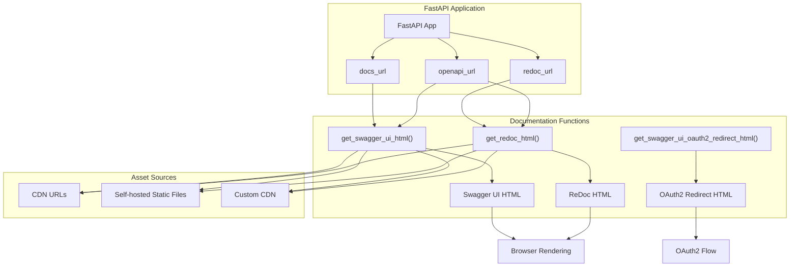

**Documentation UI Generation Flow**

Sources: [fastapi/openapi/docs.py:26-158](), [fastapi/openapi/docs.py:161-253]()

## Core Documentation Functions

The documentation system centers around three primary functions that generate HTML responses for different documentation interfaces.

### Swagger UI Generation

The `get_swagger_ui_html()` function creates the complete HTML page for Swagger UI documentation. It accepts multiple customization parameters and generates a self-contained HTML response.

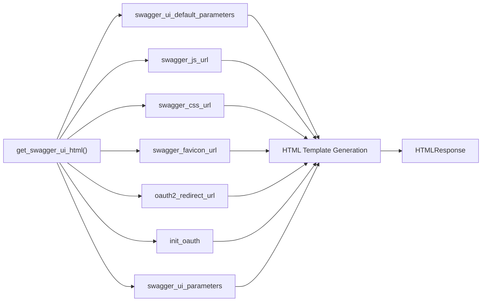

**Swagger UI Parameter Flow**

Sources: [fastapi/openapi/docs.py:26-158](), [fastapi/openapi/docs.py:8-23]()

### ReDoc Generation

The `get_redoc_html()` function provides an alternative documentation interface with different styling and layout characteristics.

| Parameter | Type | Default | Purpose |
|-----------|------|---------|---------|
| `openapi_url` | `str` | Required | OpenAPI schema endpoint |
| `title` | `str` | Required | HTML page title |
| `redoc_js_url` | `str` | CDN URL | ReDoc JavaScript bundle |
| `redoc_favicon_url` | `str` | FastAPI favicon | Page favicon |
| `with_google_fonts` | `bool` | `True` | Load Google Fonts CSS |

Sources: [fastapi/openapi/docs.py:161-253]()

## Asset Delivery Strategies

FastAPI supports three primary approaches for delivering documentation assets: default CDN, custom CDN, and self-hosting.

### Default CDN Configuration

By default, FastAPI loads documentation assets from public CDNs:

- Swagger UI JavaScript: `https://cdn.jsdelivr.net/npm/swagger-ui-dist@5/swagger-ui-bundle.js`
- Swagger UI CSS: `https://cdn.jsdelivr.net/npm/swagger-ui-dist@5/swagger-ui.css`
- ReDoc JavaScript: `https://cdn.jsdelivr.net/npm/redoc@2/bundles/redoc.standalone.js`

Sources: [fastapi/openapi/docs.py:56](), [fastapi/openapi/docs.py:66](), [fastapi/openapi/docs.py:191]()

### Custom CDN Implementation

To use alternative CDNs, applications must disable default documentation endpoints and create custom path operations.

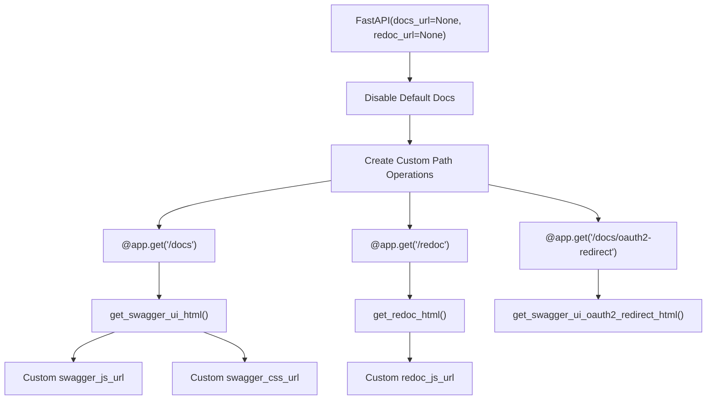

**Custom CDN Setup Flow**

Sources: [docs_src/custom_docs_ui/tutorial001.py:8](), [docs_src/custom_docs_ui/tutorial001.py:11-19](), [docs_src/custom_docs_ui/tutorial001.py:27-33]()

### Self-Hosting Static Files

Self-hosting involves serving documentation assets directly from the FastAPI application using `StaticFiles` mounting.

Required static files:
- `swagger-ui-bundle.js`
- `swagger-ui.css`
- `redoc.standalone.js`

Sources: [docs/en/docs/how-to/custom-docs-ui-assets.md:94-101]()

## Swagger UI Configuration Parameters

The `swagger_ui_default_parameters` dictionary defines the base configuration for Swagger UI behavior and appearance.

### Default Configuration

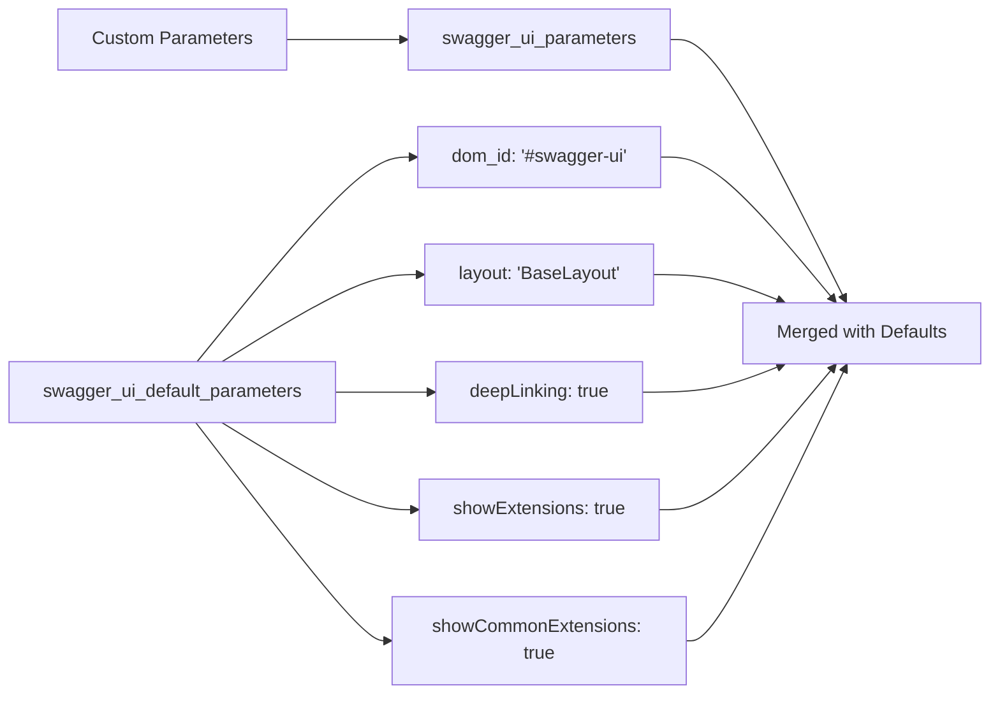

**Swagger UI Parameter Merging**

Sources: [fastapi/openapi/docs.py:17-23](), [fastapi/openapi/docs.py:113-115]()

### OAuth2 Integration

OAuth2 authentication requires special handling through the redirect mechanism and initialization parameters.

| Component | Function | Purpose |
|-----------|----------|---------|
| `oauth2_redirect_url` | OAuth2 callback handling | Processes authentication responses |
| `init_oauth` | OAuth2 client configuration | Configures OAuth2 client parameters |
| `get_swagger_ui_oauth2_redirect_html()` | Redirect page generation | Handles OAuth2 authorization flow |

Sources: [fastapi/openapi/docs.py:75-82](), [fastapi/openapi/docs.py:84-90](), [fastapi/openapi/docs.py:256-344]()

## Implementation Patterns

### Disabling Default Documentation

To implement custom documentation, applications must first disable the default endpoints by setting them to `None` during FastAPI instantiation.

Sources: [docs_src/custom_docs_ui/tutorial001.py:8]()

### Custom Path Operations

Custom documentation requires creating new path operations that call the documentation generation functions with custom parameters.

The standard pattern includes three endpoints:
- Main documentation endpoint (`/docs`)
- Alternative documentation endpoint (`/redoc`)  
- OAuth2 redirect endpoint (`/docs/oauth2-redirect`)

Sources: [docs_src/custom_docs_ui/tutorial001.py:11-24](), [docs_src/custom_docs_ui/tutorial001.py:27-33]()

### Testing Documentation Customization

The test infrastructure validates that custom URLs appear in the generated HTML responses and that OAuth2 redirect functionality operates correctly.

Key test validations:
- Custom asset URLs in HTML content
- OAuth2 redirect JavaScript presence
- API endpoint functionality

Sources: [tests/test_tutorial/test_custom_docs_ui/test_tutorial001.py:20-42](), [tests/test_local_docs.py:18-32]()

# Advanced Features


This document covers advanced FastAPI capabilities designed for complex, production-ready applications. These features enable sophisticated request processing, database integration, asynchronous operations, and advanced response handling patterns that go beyond basic CRUD operations.

For core framework concepts like routing and dependency injection, see [Core Architecture](#2). For API documentation features, see [API Documentation System](#3).

## Asynchronous Programming Support

FastAPI provides comprehensive asynchronous programming support through Python's coroutine system, leveraging Starlette's ASGI foundation and AnyIO compatibility for high-concurrency applications.

### Path Operation Function Execution Model

FastAPI automatically detects whether path operation functions are defined with `def` or `async def` and handles execution appropriately. Functions defined with `def` are executed in external threadpool to avoid blocking the event loop, while `async def` functions execute directly in the main event loop.

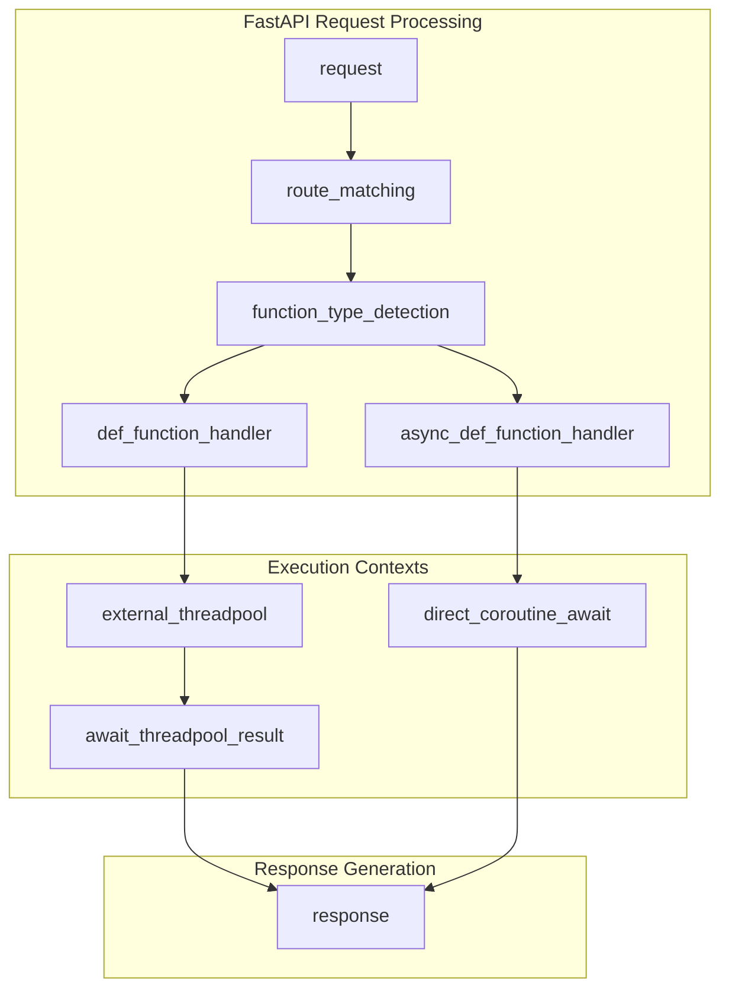

**FastAPI Path Operation Execution Flow**

| Function Type | Execution Context | Use Case | Performance Impact |
|---------------|-------------------|----------|-------------------|
| `def` | External threadpool | CPU-bound, blocking I/O | Prevents event loop blocking |
| `async def` | Event loop | Non-blocking I/O, coroutines | Maximum concurrency |
| `async def` with `await` | Event loop | Database calls, API requests | Concurrent I/O operations |

Sources: [docs/en/docs/async.md:416-439](), [docs/en/docs/async.md:418-422]()

### Concurrency vs Parallelism Implementation

FastAPI distinguishes between concurrency (handling multiple I/O operations simultaneously) and parallelism (utilizing multiple CPU cores). The framework optimizes for web application patterns where requests spend most time waiting for I/O operations.

```mermaid
graph TB
    subgraph "Concurrency Pattern - I/O Bound"
        ASYNC_PATH[async_def_path_operation] --> AWAIT_DB[await_database_query]
        AWAIT_DB --> AWAIT_API[await_external_api]
        AWAIT_API --> AWAIT_FILE[await_file_read]
        AWAIT_FILE --> EVENT_LOOP[event_loop_scheduling]
    end
    
    subgraph "Parallelism Pattern - CPU Bound"
        DEF_PATH[def_path_operation] --> CPU_WORK[cpu_intensive_computation]
        CPU_WORK --> THREADPOOL_EXEC[threadpool_execution]
        THREADPOOL_EXEC --> THREAD_ISOLATION[thread_isolation]
    end
    
    subgraph "Hybrid Pattern"
        MIXED_APP[fastapi_application] --> CONCURRENT_IO[concurrent_io_operations]
        MIXED_APP --> PARALLEL_CPU[parallel_cpu_operations]
        CONCURRENT_IO --> HIGH_THROUGHPUT[high_request_throughput]
        PARALLEL_CPU --> MULTICORE_USAGE[multicore_cpu_usage]
    end
```

**Concurrency and Parallelism in FastAPI Applications**

Sources: [docs/en/docs/async.md:96-255](), [docs/en/docs/async.md:293-301](), [docs/en/docs/async.md:238-254]()

### Dependency System Async Handling

FastAPI's dependency injection system seamlessly handles mixed `def` and `async def` dependencies, automatically managing execution contexts and dependency resolution order.

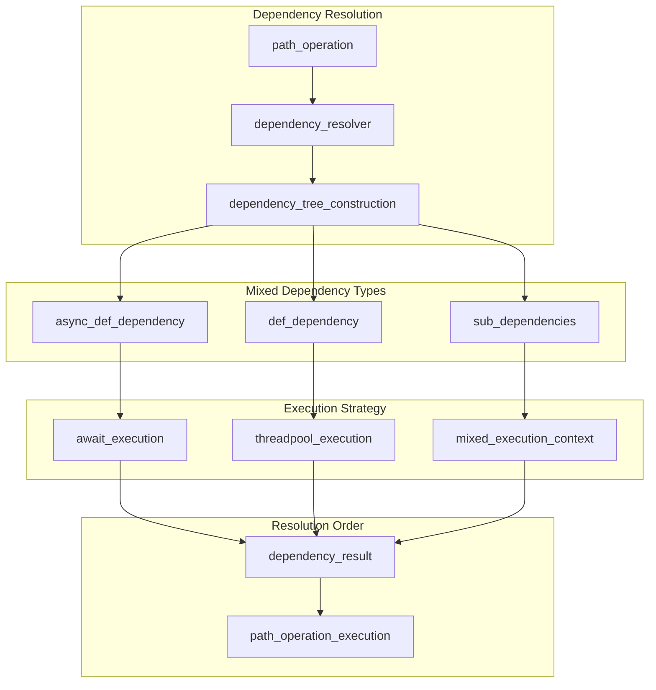

**Dependency System Async Execution**

Sources: [docs/en/docs/async.md:424-430](), [docs/en/docs/async.md:432-438]()

### AnyIO Integration and Compatibility

FastAPI and Starlette are built on AnyIO, providing compatibility with both Python's standard `asyncio` and `trio` async libraries. This enables advanced concurrency patterns and structured concurrency approaches.

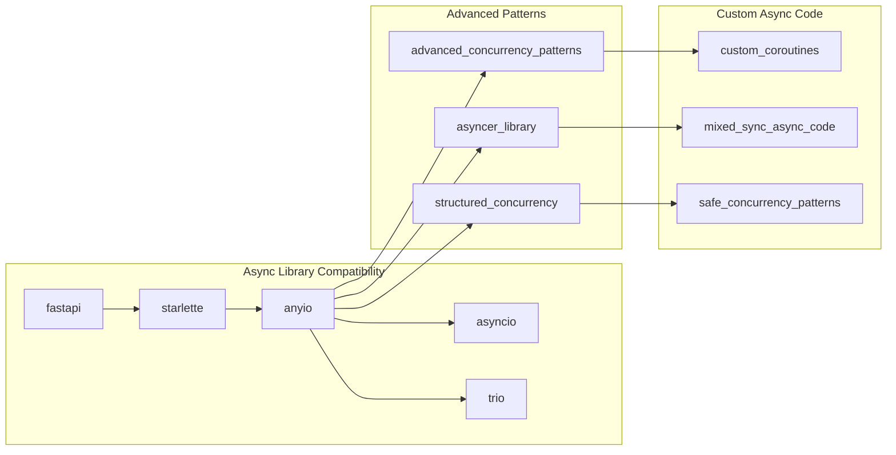

**AnyIO-Based Async Architecture**

Sources: [docs/en/docs/async.md:364-372](), [docs/en/docs/async.md:366-370]()
</old_str>

<old_str>
## Deployment and Production Considerations

FastAPI applications require specific configuration and architectural decisions for production deployment, including ASGI server selection, proxy configuration, and performance optimization strategies.

### ASGI Server Architecture

FastAPI applications run on ASGI servers that handle the interface between the web server and Python application. The choice of ASGI server and configuration impacts performance, scalability, and feature availability.

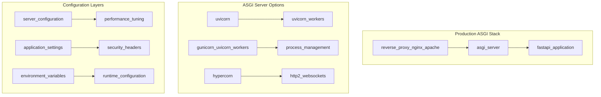

**ASGI Deployment Architecture**

### Production Deployment Patterns

FastAPI supports various deployment strategies depending on application requirements, from single-instance containers to multi-process, load-balanced configurations.

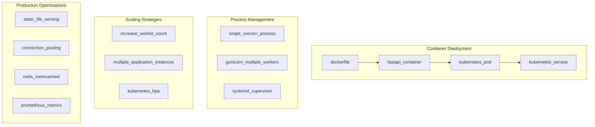

**Production Deployment and Scaling Patterns**

### Performance Optimization in Production

Production FastAPI applications benefit from specific optimizations including connection pooling, static file serving, caching strategies, and monitoring integration.

| Optimization Area | Implementation | Performance Impact |
|-------------------|----------------|-------------------|
| Database Connections | SQLAlchemy engine with connection pooling | Reduced connection overhead |
| Static File Serving | Nginx/CDN for static assets | Faster asset delivery |
| Response Caching | Redis/Memcached integration | Reduced computation load |
| Process Management | Gunicorn with uvicorn workers | Better resource utilization |
| Monitoring | Prometheus metrics collection | Performance visibility |

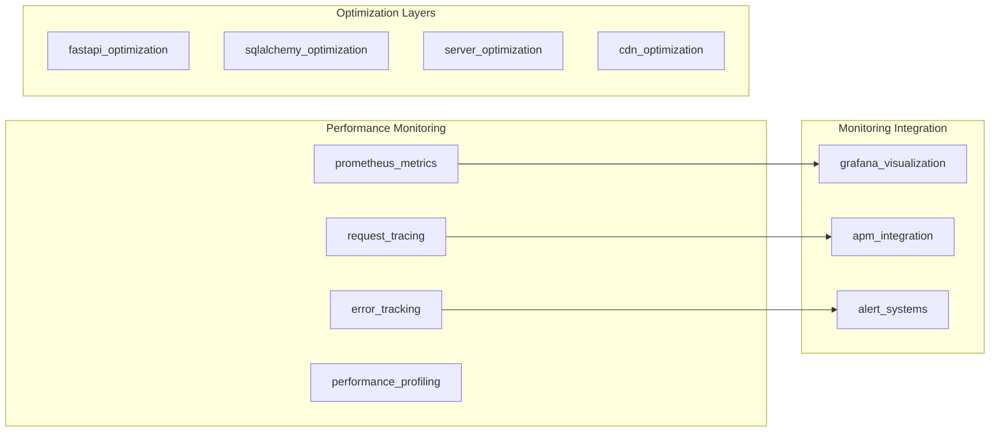

**Production Performance Monitoring and Optimization**

Sources: [docs/en/docs/async.md:250-254](), [docs/en/docs/async.md:418-422]()

The advanced capabilities of FastAPI enable sophisticated production applications with high-performance async processing, robust database integration, flexible background task handling, and comprehensive deployment options for scalable web API development.
</old_str>
<new_str>
### Background Task Execution Architecture

FastAPI's `BackgroundTasks` class enables post-response processing through task queuing that executes after the HTTP response is sent to the client, preventing response delays while ensuring important side-effects are handled.

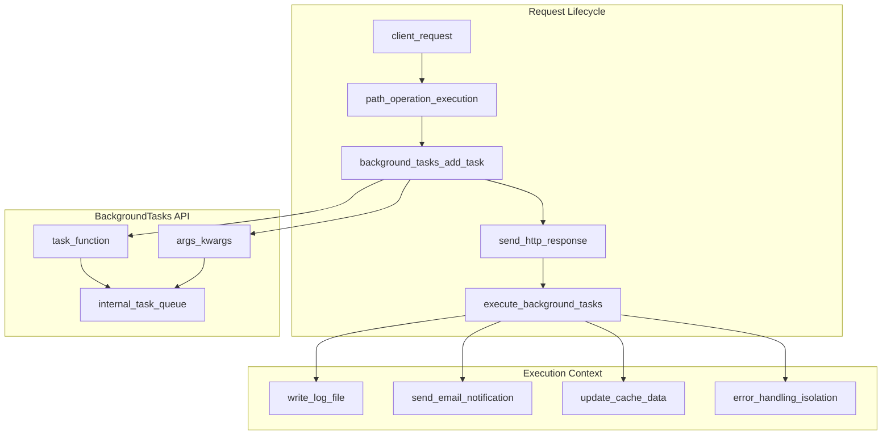

**BackgroundTasks Processing Pipeline**

The `BackgroundTasks` class integrates with dependency injection, allowing tasks to be added from path operations, dependencies, and sub-dependencies. Tasks are collected and executed after response completion.

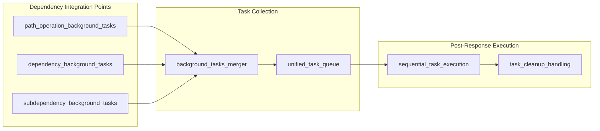

**Background Tasks Dependency Integration Pattern**

Sources: [docs/en/docs/tutorial/background-tasks.md:14-46](), [docs/en/docs/tutorial/background-tasks.md:48-63](), [docs/en/docs/tutorial/background-tasks.md:76-83]()

## Database Integration

FastAPI integrates seamlessly with SQL databases through SQLModel, providing type-safe database operations with automatic validation and serialization.

### SQLModel Architecture

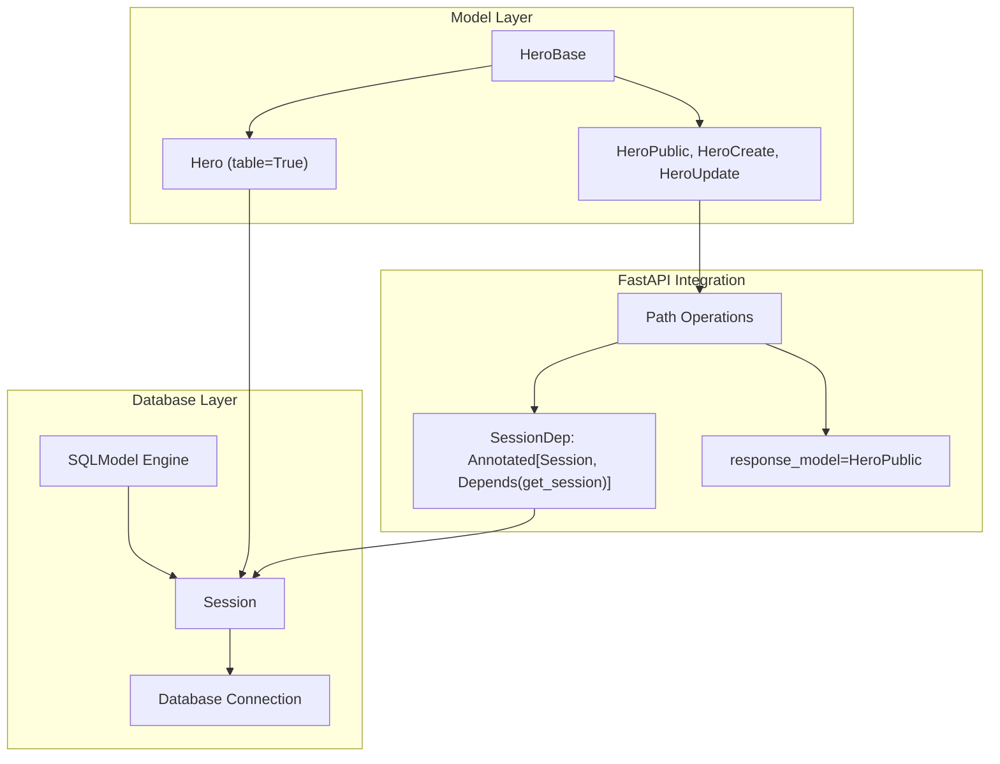

**SQLModel Integration Architecture**

The database integration follows a multi-model pattern where different Pydantic models serve specific purposes:

| Model Type | Purpose | Example | Usage |
|------------|---------|---------|--------|
| Base Model | Shared fields | `HeroBase` | Common attributes across models |
| Table Model | Database representation | `Hero(table=True)` | ORM mapping with `id` and `secret_name` |
| Public Model | API responses | `HeroPublic` | Excludes sensitive fields |
| Create Model | Input validation | `HeroCreate` | Accepts data without `id` |
| Update Model | Partial updates | `HeroUpdate` | All fields optional |

Sources: [docs/en/docs/tutorial/sql-databases.md:180-283](), [docs/en/docs/tutorial/sql-databases.md:74-101]()

### Session Management Pattern

FastAPI employs a session-per-request pattern using dependency injection to ensure database connections are properly managed.

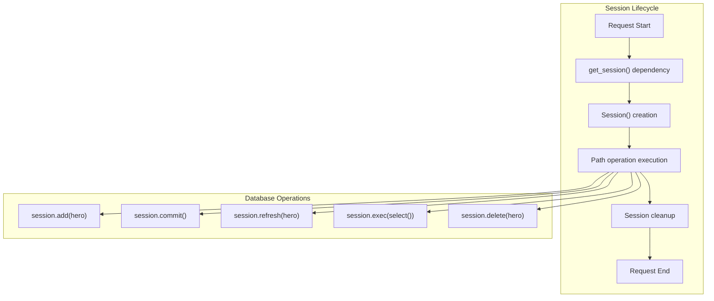

**Database Session Management**

Sources: [docs/en/docs/tutorial/sql-databases.md:92-101](), [docs/en/docs/tutorial/sql-databases.md:118-149]()

## Background Tasks

FastAPI provides built-in support for background task execution through the `BackgroundTasks` class, enabling post-response processing without blocking the client.

### Background Task Processing

```mermaid
graph LR
    subgraph "Request Flow"
        CLIENT_REQ["Client Request"]
        PATH_OP["Path Operation"]
        RESPONSE["Immediate Response"]
        CLIENT_RECV["Client Receives Response"]
    end
    
    subgraph "Background Processing"
        BG_TASKS["BackgroundTasks"]
        ADD_TASK["add_task(func, *args, **kwargs)"]
        TASK_QUEUE["Task Queue"]
        TASK_EXEC["Task Execution"]
    end
    
    subgraph "Task Functions"
        WRITE_FILE["write_notification()"]
        SEND_EMAIL["send_email()"]
        LOG_EVENT["log_event()"]
    end
    
    CLIENT_REQ --> PATH_OP
    PATH_OP --> BG_TASKS
    BG_TASKS --> ADD_TASK
    PATH_OP --> RESPONSE
    RESPONSE --> CLIENT_RECV
    
    ADD_TASK --> TASK_QUEUE
    TASK_QUEUE --> TASK_EXEC
    
    TASK_EXEC --> WRITE_FILE
    TASK_EXEC --> SEND_EMAIL
    TASK_EXEC --> LOG_EVENT
```

**Background Task Execution Flow**

Background tasks integrate with FastAPI's dependency injection system, allowing tasks to be added at multiple levels of the application hierarchy.

Sources: [docs/en/docs/tutorial/background-tasks.md:14-46](), [docs/en/docs/tutorial/background-tasks.md:48-63]()

### Background Task Dependency Pattern

```mermaid
graph TB
    subgraph "Dependency Hierarchy"
        PATH_LEVEL["Path Operation Level"]
        DEP_LEVEL["Dependency Level"]
        SUB_DEP_LEVEL["Sub-dependency Level"]
    end
    
    subgraph "BackgroundTasks Object"
        BG_INSTANCE["BackgroundTasks instance"]
        TASK_LIST["Internal task list"]
        MERGE_TASKS["Task merging"]
    end
    
    subgraph "Execution Context"
        AFTER_RESPONSE["After response sent"]
        TASK_RUNNER["Task execution"]
        ERROR_HANDLING["Error isolation"]
    end
    
    PATH_LEVEL --> BG_INSTANCE
    DEP_LEVEL --> BG_INSTANCE
    SUB_DEP_LEVEL --> BG_INSTANCE
    
    BG_INSTANCE --> TASK_LIST
    TASK_LIST --> MERGE_TASKS
    
    MERGE_TASKS --> AFTER_RESPONSE
    AFTER_RESPONSE --> TASK_RUNNER
    TASK_RUNNER --> ERROR_HANDLING
```

**Background Tasks Dependency Integration**

Sources: [docs/en/docs/tutorial/background-tasks.md:48-63](), [docs/en/docs/tutorial/background-tasks.md:76-83]()

## Advanced Response and Middleware

FastAPI provides sophisticated response handling capabilities and middleware integration for complex application requirements.

### Response Processing Pipeline

```mermaid
graph TB
    subgraph "Response Generation"
        RETURN_VALUE["Function return value"]
        RESPONSE_MODEL["response_model validation"]
        JSON_ENCODER["jsonable_encoder()"]
        JSON_RESPONSE["JSONResponse"]
        DIRECT_RESPONSE["Direct Response return"]
    end
    
    subgraph "Response Customization"
        STATUS_CODE["Custom status codes"]
        HEADERS["Custom headers"]
        COOKIES["Cookie management"]
        MEDIA_TYPE["Content-Type handling"]
    end
    
    subgraph "Response Types"
        JSON_RESP["JSONResponse"]
        HTML_RESP["HTMLResponse"]
        XML_RESP["Response with XML"]
        FILE_RESP["FileResponse"]
        STREAM_RESP["StreamingResponse"]
    end
    
    RETURN_VALUE --> RESPONSE_MODEL
    RESPONSE_MODEL --> JSON_ENCODER
    JSON_ENCODER --> JSON_RESPONSE
    RETURN_VALUE --> DIRECT_RESPONSE
    
    JSON_RESPONSE --> STATUS_CODE
    JSON_RESPONSE --> HEADERS
    JSON_RESPONSE --> COOKIES
    JSON_RESPONSE --> MEDIA_TYPE
    
    DIRECT_RESPONSE --> JSON_RESP
    DIRECT_RESPONSE --> HTML_RESP
    DIRECT_RESPONSE --> XML_RESP
    DIRECT_RESPONSE --> FILE_RESP
    DIRECT_RESPONSE --> STREAM_RESP
```

**Advanced Response Processing**

FastAPI supports multiple response patterns including automatic JSON serialization, direct response objects, and custom response classes for different content types.

Sources: [docs/es/docs/advanced/response-directly.md:13-28](), [docs/es/docs/advanced/additional-status-codes.md:8-16]()

### Middleware Integration Points

```mermaid
graph TB
    subgraph "Middleware Stack"
        CORS_MW["CORSMiddleware"]
        TRUSTED_HOST["TrustedHostMiddleware"]
        GZIP_MW["GZipMiddleware"]
        CUSTOM_MW["Custom Middleware"]
    end
    
    subgraph "Request Processing"
        INCOMING["Incoming Request"]
        MW_PROCESS["Middleware Processing"]
        ROUTE_MATCH["Route Matching"]
        PATH_OP["Path Operation"]
    end
    
    subgraph "Response Processing"
        RESPONSE_GEN["Response Generation"]
        MW_RESPONSE["Middleware Response Processing"]
        OUTGOING["Outgoing Response"]
    end
    
    INCOMING --> CORS_MW
    CORS_MW --> TRUSTED_HOST
    TRUSTED_HOST --> GZIP_MW
    GZIP_MW --> CUSTOM_MW
    CUSTOM_MW --> MW_PROCESS
    
    MW_PROCESS --> ROUTE_MATCH
    ROUTE_MATCH --> PATH_OP
    PATH_OP --> RESPONSE_GEN
    
    RESPONSE_GEN --> MW_RESPONSE
    MW_RESPONSE --> OUTGOING
```

**Middleware Processing Pipeline**

Sources: [docs/es/docs/advanced/response-headers.md:37-41](), [docs/es/docs/tutorial/cors.md]()

## Performance Considerations

FastAPI's advanced features are designed with performance in mind, leveraging Starlette's ASGI foundation and Pydantic's validation system.

### Async Performance Patterns

| Pattern | Use Case | Performance Impact |
|---------|----------|-------------------|
| `async def` with `await` | I/O bound operations | High concurrency, non-blocking |
| `def` functions | CPU bound operations | Thread pool execution |
| Background tasks | Post-response processing | No client blocking |
| Dependency caching | Expensive operations | Reduced computation overhead |

### Database Performance Optimization

```mermaid
graph LR
    subgraph "Connection Management"
        ENGINE_POOL["Engine connection pool"]
        SESSION_SCOPE["Session per request"]
        CONNECTION_REUSE["Connection reusing"]
    end
    
    subgraph "Query Optimization"
        SELECT_OPT["Optimized select() queries"]
        LIMIT_OFFSET["Pagination with limit/offset"]
        EAGER_LOADING["Relationship loading"]
    end
    
    subgraph "Data Serialization"
        PYDANTIC_PERF["Pydantic validation"]
        JSON_ENCODING["Fast JSON encoding"]
        RESPONSE_CACHE["Response model caching"]
    end
    
    ENGINE_POOL --> SESSION_SCOPE
    SESSION_SCOPE --> CONNECTION_REUSE
    
    SELECT_OPT --> LIMIT_OFFSET
    LIMIT_OFFSET --> EAGER_LOADING
    
    PYDANTIC_PERF --> JSON_ENCODING
    JSON_ENCODING --> RESPONSE_CACHE
```

**Database Performance Optimization**

Sources: [docs/en/docs/tutorial/sql-databases.md:80-85](), [docs/en/docs/async.md:250-254]()

The advanced features in FastAPI work together to provide a robust foundation for building high-performance, scalable web APIs with sophisticated data handling, asynchronous processing, and flexible response management capabilities.

# Asynchronous Support


This document explains how FastAPI handles asynchronous code execution, including the use of `async def` functions, concurrency patterns, and the differences between synchronous and asynchronous path operation functions.

## Purpose and Scope

This page covers:
- How FastAPI supports both synchronous and asynchronous code
- When to use `async def` vs regular `def` functions
- How FastAPI handles different function types internally
- Performance considerations for I/O-bound vs CPU-bound operations

## Overview of Asynchronous Support in FastAPI

FastAPI provides native asynchronous support through Python's `async`/`await` syntax, built on top of Starlette's ASGI foundation. This architecture enables efficient handling of concurrent requests, particularly for I/O-bound operations such as database queries, API calls, and file operations.

### FastAPI Async Architecture

```mermaid
flowchart TB
    subgraph ASGI["ASGI Server Interface"]
        ASGIServer["ASGI Server"]
    end
    
    subgraph FastAPICore["FastAPI Core"]
        FastAPIApp["FastAPI() instance"]
        StarletteBase["Starlette Foundation"]
        AnyIOCompat["AnyIO Compatibility Layer"]
    end
    
    subgraph ExecutionLayer["Execution Layer"]
        AsyncPath["async def path_operation()"]
        SyncPath["def path_operation()"]
        ThreadPool["External ThreadPool"]
    end
    
    subgraph Resources["External Resources"]
        AsyncDB["await db.fetch()"]
        SyncDB["db.execute()"]
        FileIO["file.read()"]
    end
    
    ASGIServer --> FastAPIApp
    FastAPIApp --> StarletteBase
    StarletteBase --> AnyIOCompat
    AnyIOCompat --> AsyncPath
    AnyIOCompat --> SyncPath
    SyncPath --> ThreadPool
    AsyncPath --> AsyncDB
    ThreadPool --> SyncDB
    ThreadPool --> FileIO
```

### Request Processing Flow

```mermaid
sequenceDiagram
    participant Client
    participant ASGI as "ASGI Server"
    participant FastAPI as "FastAPI App"
    participant PathOp as "Path Operation"
    participant ThreadPool as "ThreadPool"
    participant Resource as "External Resource"

    Client->>ASGI: HTTP Request
    ASGI->>FastAPI: ASGI scope/receive/send
    
    alt async def path operation
        FastAPI->>PathOp: await path_operation()
        PathOp->>Resource: await external_call()
        Resource-->>PathOp: response
        PathOp-->>FastAPI: result
    else def path operation  
        FastAPI->>ThreadPool: run_in_threadpool(path_operation)
        ThreadPool->>PathOp: path_operation()
        PathOp->>Resource: blocking_call()
        Resource-->>PathOp: response
        PathOp-->>ThreadPool: result
        ThreadPool-->>FastAPI: result
    end
    
    FastAPI->>ASGI: ASGI response
    ASGI->>Client: HTTP Response
```

Sources: [docs/en/docs/async.md:1-55], [docs/en/docs/async.md:366-372], [docs/en/docs/async.md:415-423]

## When to Use Async Functions

The decision to use `async def` or regular `def` for your path operation functions depends on what your function does:

| Use `async def` when... | Use `def` when... |
|-------------------------|-------------------|
| Calling other async functions with `await` | Using synchronous libraries (most database libraries) |
| Making async network calls | Performing CPU-intensive operations |
| Using async database drivers | Not making any I/O operations |
| Not doing CPU-intensive work | Not sure what to use |

FastAPI will handle both types correctly, but following these guidelines allows for performance optimizations.

```mermaid
flowchart TD
    Start["Need to define a\npath operation function"]
    AsyncLib{"Using libraries\nthat use await?"}
    CPUBound{"Performing CPU\nintensive work?"}
    IOWait{"Waiting for external\nresources (I/O)?"}
    UseAsync["Use async def"]
    UseSync["Use def"]
    
    Start --> AsyncLib
    AsyncLib -->|"Yes"| UseAsync
    AsyncLib -->|"No"| CPUBound
    CPUBound -->|"Yes"| UseSync
    CPUBound -->|"No"| IOWait
    IOWait -->|"Yes"| UseAsync
    IOWait -->|"No"| UseSync
```

Sources: [docs/en/docs/async.md:5-55]

## How FastAPI Handles Async and Sync Functions

### Path Operation Function Execution

FastAPI's handling of path operation functions depends on their declaration:

```mermaid
flowchart TD
    Request["Incoming Request"] --> Router["FastAPI Router"]
    Router --> FuncType{"Function Type?"}
    
    FuncType -->|"async def"| AsyncExec["Direct Execution"]
    FuncType -->|"def"| SyncExec["ThreadPool Execution"]
    
    AsyncExec --> AsyncFunc["await path_operation_function()"]
    SyncExec --> ThreadPool["run_in_threadpool()"]
    ThreadPool --> SyncFunc["path_operation_function()"]
    
    AsyncFunc --> AsyncReturn["Return awaited result"]
    SyncFunc --> SyncReturn["Return from thread"]
    
    AsyncReturn --> Response["HTTP Response"]
    SyncReturn --> Response
```

**For `async def` path operations:**
- FastAPI calls the function directly using `await`
- Execution remains in the main event loop
- Can use `await` for other async operations
- Example: [docs/en/docs/async.md:17-22]()

**For `def` path operations:**  
- FastAPI wraps the call in `run_in_threadpool()`
- Execution moves to an external thread
- Cannot use `await` inside the function
- Example: [docs/en/docs/async.md:34-39]()

### Dependencies and Sub-dependencies

The same execution model applies to the dependency injection system:

| Dependency Type | Execution Method | Can Use `await`? |
|----------------|------------------|------------------|
| `async def get_db()` | Direct await | ✅ Yes |
| `def get_db()` | ThreadPool | ❌ No |

Dependencies can be mixed freely - FastAPI handles each according to its type. Sub-dependencies follow the same pattern, allowing complex dependency trees with mixed execution models.

Sources: [docs/en/docs/async.md:415-423], [docs/en/docs/async.md:424-431]

## Concurrency vs Parallelism

FastAPI's asynchronous support is based on concurrency, which is different from parallelism:

```mermaid
flowchart LR
    subgraph "Concurrency (Async)"
        C1["Task 1"] --> CW1["Wait for I/O"]
        CW1 --> C2["Task 2"]
        C2 --> CW2["Wait for I/O"]
        CW2 --> C3["Back to Task 1"]
        C3 --> C4["Complete Task 1"]
        C4 --> C5["Complete Task 2"]
    end
    
    subgraph "Parallelism (Multiple Processors)"
        P1["Processor 1: Task 1"] --> P3["Processor 1: Complete Task 1"]
        P2["Processor 2: Task 2"] --> P4["Processor 2: Complete Task 2"]
    end
```

- **Concurrency**: Handling multiple tasks by switching between them when waiting occurs
- **Parallelism**: Executing multiple tasks simultaneously on different processors

FastAPI excels at concurrency, which is ideal for web applications that spend most of their time waiting for I/O operations.

Sources: [docs/en/docs/async.md:96-261]

## I/O-Bound vs CPU-Bound Operations

Understanding the difference between I/O-bound and CPU-bound operations helps in choosing the right approach:

| I/O-Bound Operations | CPU-Bound Operations |
|----------------------|---------------------|
| Network requests | Complex calculations |
| Database queries | Image/audio processing |
| File system operations | Machine learning |
| API calls | Data transformations |
| **Best with**: Async/concurrency | **Best with**: Parallelism |

For web APIs, most operations are I/O-bound, making async a good default choice.

Sources: [docs/en/docs/async.md:77-89], [docs/en/docs/async.md:262-301]

## Technical Implementation Details

FastAPI's asynchronous capabilities are built on a carefully designed stack that provides compatibility and performance:

### Async Stack Architecture

```mermaid
flowchart TB
    subgraph Application["Application Layer"]
        FastAPIApp["FastAPI()"]
        PathOps["@app.get() decorators"]
        Dependencies["Depends() functions"]
    end
    
    subgraph Framework["Framework Layer"]
        Starlette["Starlette ASGI Framework"]
        Routing["StarletteRoute"]
        Middleware["StarletteMiddleware"]
    end
    
    subgraph AsyncFoundation["Async Foundation"]
        AnyIO["AnyIO Library"]
        AsyncIO["asyncio (default)"]
        Trio["trio (optional)"]
    end
    
    subgraph Threading["Threading Layer"]
        ThreadPoolExecutor["ThreadPoolExecutor"]
        SyncFunctions["def functions"]
    end
    
    FastAPIApp --> Starlette
    PathOps --> Routing
    Dependencies --> Routing
    Starlette --> AnyIO
    AnyIO --> AsyncIO
    AnyIO --> Trio
    Routing --> ThreadPoolExecutor
    ThreadPoolExecutor --> SyncFunctions
```

### Coroutine and ThreadPool Management

FastAPI uses different execution strategies based on function signatures:

```mermaid
stateDiagram-v2
    [*] --> FunctionCall
    FunctionCall --> CheckType: Analyze function signature
    
    state CheckType {
        [*] --> AsyncDef: if async def
        [*] --> SyncDef: if def
    }
    
    AsyncDef --> CreateCoroutine: create coroutine object
    CreateCoroutine --> AwaitCoroutine: await coroutine
    AwaitCoroutine --> Return: return result
    
    SyncDef --> SubmitToThreadPool: submit to ThreadPoolExecutor
    SubmitToThreadPool --> RunInThread: execute in separate thread
    RunInThread --> AwaitThreadResult: await thread completion
    AwaitThreadResult --> Return
    
    Return --> [*]
```

### AnyIO Integration

FastAPI leverages AnyIO's structured concurrency features:
- Compatible with both `asyncio` and `trio` backends
- Provides unified async abstraction layer  
- Enables advanced concurrency patterns
- Supports context managers and cancellation

The `run_in_threadpool()` function prevents blocking the main event loop when executing synchronous code, ensuring the server remains responsive to other requests.

Sources: [docs/en/docs/async.md:366-372], [docs/en/docs/async.md:415-423], [docs/en/docs/async.md:418-420]

## Performance Considerations

Choosing the right function type directly impacts FastAPI application performance:

### Performance Matrix

| Operation Type | Library Support | Recommended Function Type | Execution Method | Performance Impact |
|---------------|-----------------|---------------------------|------------------|-------------------|
| Database queries | `asyncpg`, `motor` | `async def` | Direct await | ⚡ Optimal |
| Database queries | `psycopg2`, `pymongo` | `def` | ThreadPool | ✅ Good |
| HTTP requests | `httpx`, `aiohttp` | `async def` | Direct await | ⚡ Optimal |  
| HTTP requests | `requests` | `def` | ThreadPool | ✅ Good |
| File I/O | `aiofiles` | `async def` | Direct await | ⚡ Optimal |
| File I/O | Built-in `open()` | `def` | ThreadPool | ✅ Good |
| CPU computation | Any | `def` | ThreadPool | ⚠️ Limited |
| Trivial operations | N/A | `async def` | Direct | ⚡ Optimal |

### ThreadPool Behavior

When FastAPI encounters a `def` function, it automatically:

```mermaid
sequenceDiagram
    participant EventLoop as "Main Event Loop"
    participant Router as "FastAPI Router"  
    participant ThreadPool as "ThreadPoolExecutor"
    participant SyncFunc as "def path_operation()"

    EventLoop->>Router: Process request
    Router->>ThreadPool: run_in_threadpool(path_operation)
    Note over ThreadPool: Function runs in separate thread
    ThreadPool->>SyncFunc: Execute synchronously
    SyncFunc-->>ThreadPool: Return result
    ThreadPool-->>Router: Future result
    Router-->>EventLoop: awaited result
```

### FastAPI-Specific Optimizations

Unlike some other async frameworks, FastAPI optimizations include:

- **Automatic threadpool management**: No need to manually configure thread pools
- **Smart function detection**: Analyzes function signatures at startup
- **Mixed execution support**: Seamlessly combines async and sync dependencies
- **Zero-copy where possible**: Minimal overhead for async operations

For compute-only operations (no I/O), `async def` performs better in FastAPI due to reduced threadpool overhead - approximately 100 nanoseconds saved per call compared to other frameworks.

Sources: [docs/en/docs/async.md:415-423], [docs/en/docs/async.md:418-420]

## Writing Your Own Async Code

If you need to write custom asynchronous code beyond FastAPI's built-in functionality, you can use:

1. **AnyIO**: The library that powers Starlette and FastAPI
2. **Asyncer**: A thin layer on top of AnyIO with improved type annotations
3. **Standard asyncio**: Python's built-in asynchronous library

These tools can help you implement more advanced concurrency patterns in your FastAPI applications.

Sources: [docs/en/docs/async.md:366-372]

## Conclusion

FastAPI's support for both synchronous and asynchronous code provides flexibility while maintaining high performance. By understanding when to use each approach, you can optimize your application for different types of operations.

Remember:
- Use `async def` when working with other async code or I/O-bound operations
- Use regular `def` when working with synchronous libraries or CPU-bound tasks
- FastAPI will handle both correctly, but following these guidelines allows for better performance

The asynchronous capabilities of FastAPI, powered by Starlette and AnyIO, contribute significantly to its impressive performance compared to other Python web frameworks.

Sources: [docs/en/docs/async.md:394-403]

# Database Integration


This document covers FastAPI's database integration capabilities, focusing primarily on SQLModel as the recommended approach for SQL database integration. It includes session management, model patterns, CRUD operations, and security considerations for database-backed applications.

For background task integration with databases, see [Background Tasks](#4.3). For general error handling patterns including database errors, see [Error Handling](#2.7).

## Overview

FastAPI provides flexible database integration through SQLModel, which combines SQLAlchemy's database capabilities with Pydantic's validation features. The integration supports both simple single-model approaches and sophisticated multi-model patterns for production applications.

## Database Integration Architecture

```mermaid
graph TD
    subgraph "FastAPI Application Layer"
        A["FastAPI app instance"]
        B["Path operation functions"]
        C["Dependency injection system"]
    end
    
    subgraph "SQLModel Integration Layer"
        D["SQLModel table models"]
        E["SQLModel data models"]
        F["Session dependency"]
        G["Engine instance"]
    end
    
    subgraph "Database Layer"
        H["SQLAlchemy Engine"]
        I["Database connection pool"]
        J["SQL Database (SQLite/PostgreSQL/MySQL)"]
    end
    
    A --> B
    B --> C
    C --> F
    F --> D
    F --> E
    D --> G
    G --> H
    H --> I
    I --> J
    
    B --> D
    B --> E
```

**Database Integration Flow in FastAPI**

This architecture shows how FastAPI integrates with databases through SQLModel, which serves as an abstraction layer over SQLAlchemy while providing Pydantic validation capabilities.

Sources: [docs/en/docs/tutorial/sql-databases.md:1-358]()

## SQLModel Foundation

SQLModel serves as the primary database integration tool, combining SQLAlchemy's ORM capabilities with Pydantic's data validation. The framework distinguishes between table models and data models.

### Model Types

```mermaid
graph LR
    subgraph "SQLModel Model Types"
        A["SQLModel base class"]
        B["Table models (table=True)"]
        C["Data models (table=False)"]
    end
    
    subgraph "Table Model Examples"
        D["Hero class"]
        E["User class"]
    end
    
    subgraph "Data Model Examples"  
        F["HeroCreate class"]
        G["HeroPublic class"]
        H["HeroUpdate class"]
    end
    
    A --> B
    A --> C
    B --> D
    B --> E
    C --> F
    C --> G
    C --> H
```

**SQLModel Model Hierarchy**

Table models represent actual database tables with `table=True`, while data models handle API serialization and validation without direct database mapping.

Sources: [docs/en/docs/tutorial/sql-databases.md:182-187]()

## Engine and Session Management

### Engine Configuration

The database engine manages connections to the database. FastAPI applications typically create a single engine instance shared across the application.

```mermaid
graph TD
    A["create_engine()"] --> B["SQLModel engine instance"]
    B --> C["Connection pool"]
    C --> D["Database connections"]
    
    E["check_same_thread=False"] --> B
    F["Database URL"] --> A
    
    G["Session class"] --> H["Session instances"]
    B --> G
```

**Engine and Session Creation Flow**

The engine configuration includes thread safety settings for SQLite and connection pooling for production databases.

Sources: [docs/en/docs/tutorial/sql-databases.md:74-84]()

### Session Dependency Pattern

FastAPI uses dependency injection to provide database sessions to path operations:

```mermaid
graph LR
    A["get_session() dependency"] --> B["Session instance"]
    B --> C["Path operation function"]
    C --> D["Database operations"]
    D --> E["session.commit()"]
    D --> F["session.refresh()"]
    
    G["SessionDep = Annotated[Session, Depends(get_session)]"] --> C
```

**Session Dependency Lifecycle**

Each request receives its own session instance through the dependency injection system, ensuring proper transaction isolation.

Sources: [docs/en/docs/tutorial/sql-databases.md:92-100]()

## Model Patterns

### Single Model Approach

The simplest pattern uses one model class for both database representation and API serialization:

- Direct model usage in path operations
- Simple CRUD operations
- Minimal security separation

Sources: [docs/en/docs/tutorial/sql-databases.md:48-167]()

### Multiple Model Approach

Production applications typically use separate models for different purposes:

```mermaid
graph TD
    subgraph "Model Inheritance Hierarchy"
        A["HeroBase"] --> B["Hero (table model)"]
        A --> C["HeroPublic (data model)"]
        A --> D["HeroCreate (data model)"]
        A --> E["HeroUpdate (data model)"]
    end
    
    subgraph "Field Distribution"
        F["Shared fields: name, age"] --> A
        G["Database fields: id, secret_name"] --> B
        H["Public fields: id, name, age"] --> C
        I["Creation fields: name, age, secret_name"] --> D
        J["Update fields: all optional"] --> E
    end
```

**Multi-Model Pattern Structure**

This pattern provides security by controlling which fields are exposed in different contexts while avoiding code duplication through inheritance.

Sources: [docs/en/docs/tutorial/sql-databases.md:180-283]()

## CRUD Operations

### Create Operations

Create operations receive data models and convert them to table models:

```mermaid
sequenceDiagram
    participant C as "Client"
    participant P as "Path Operation"
    participant S as "Session"
    participant D as "Database"
    
    C->>P: "HeroCreate data"
    P->>P: "Create Hero table model"
    P->>S: "session.add(hero)"
    P->>S: "session.commit()"
    P->>S: "session.refresh(hero)"
    S->>D: "INSERT statement"
    P->>C: "HeroPublic response"
```

**Create Operation Flow**

The create flow demonstrates the conversion from input data model to table model and back to response data model.

Sources: [docs/en/docs/tutorial/sql-databases.md:281-291]()

### Read Operations

Read operations use SQLModel's `select()` function with session execution:

- List operations with pagination support
- Single item retrieval by ID
- Automatic conversion to response models

Sources: [docs/en/docs/tutorial/sql-databases.md:130-140](), [docs/en/docs/tutorial/sql-databases.md:303-316]()

### Update Operations

Update operations use partial data models with `exclude_unset=True`:

```mermaid
graph LR
    A["PATCH request"] --> B["HeroUpdate model"]
    B --> C["exclude_unset=True"]
    C --> D["dict with only sent fields"]
    D --> E["sqlmodel_update()"]
    E --> F["Database update"]
```

**Update Operation Pattern**

The update pattern ensures only explicitly provided fields are modified, avoiding accidental overwrites of unspecified fields.

Sources: [docs/en/docs/tutorial/sql-databases.md:315-326]()

### Delete Operations

Delete operations retrieve the entity, verify existence, and remove it from the session:

Sources: [docs/en/docs/tutorial/sql-databases.md:325-334]()

## Security Considerations

### Field Exposure Control

The multiple model pattern provides security by controlling field visibility:

- `secret_name` fields excluded from public responses
- `id` fields prevented from client input during creation
- Response models ensure consistent data contracts

Sources: [docs/en/docs/tutorial/sql-databases.md:168-180]()

### Database Initialization

Table creation typically occurs during application startup rather than on-demand:

```mermaid
graph LR
    A["Application startup"] --> B["create_tables()"]
    B --> C["SQLModel.metadata.create_all()"]
    C --> D["Database tables created"]
    
    E["Production deployment"] --> F["Migration scripts"]
    F --> G["Alembic/similar tools"]
```

**Database Initialization Patterns**

Development uses automatic table creation while production relies on migration scripts for controlled schema changes.

Sources: [docs/en/docs/tutorial/sql-databases.md:102-116]()

## Error Handling Integration

Database operations integrate with FastAPI's error handling through `HTTPException`:

- 404 errors for missing entities
- Validation errors for invalid data
- Database constraint violations

For comprehensive error handling patterns, see [Error Handling](#2.7).

Sources: [docs/en/docs/tutorial/handling-errors.md:22-43]()

## Production Considerations

### Database Selection

SQLModel supports multiple database backends through SQLAlchemy:

- SQLite for development and simple deployments
- PostgreSQL for production applications
- MySQL, Oracle, SQL Server for enterprise environments

Sources: [docs/en/docs/tutorial/sql-databases.md:15-26]()

### Migration Management

Production deployments require proper migration handling:

- Alembic integration for schema changes
- Version control for database schemas
- Automated deployment pipelines

Sources: [docs/en/docs/tutorial/sql-databases.md:110-116]()

# Background Tasks


This document covers FastAPI's background task system, which allows executing functions after an HTTP response has been sent to the client. This system is useful for operations like sending emails, processing files, or logging that don't need to block the response.

For information about asynchronous programming concepts in FastAPI, see [4.1](#4.1). For dependency injection patterns, see [2.2](#2.2).

## Purpose and Core Concepts

Background tasks in FastAPI enable deferred execution of functions after the HTTP response has been sent to the client. This pattern allows for better user experience by avoiding blocking operations while ensuring important side effects still occur.

The system is built on top of Starlette's background task implementation and integrates seamlessly with FastAPI's dependency injection system.

### Request-Response with Background Tasks Flow

```mermaid
sequenceDiagram
    participant Client
    participant FastAPI as "FastAPI Application"
    participant BgTasks as "BackgroundTasks"
    participant TaskFunc as "Task Functions"

    Client->>FastAPI: "HTTP Request"
    FastAPI->>BgTasks: "Create BackgroundTasks instance"
    FastAPI->>BgTasks: "Add tasks via .add_task()"
    FastAPI->>Client: "HTTP Response (immediate)"
    
    Note over BgTasks,TaskFunc: After response sent
    BgTasks->>TaskFunc: "Execute task 1"
    BgTasks->>TaskFunc: "Execute task 2"
    BgTasks->>TaskFunc: "Execute task N"
```

Sources: [docs/en/docs/tutorial/background-tasks.md:1-87]()

## Core Architecture

### BackgroundTasks Class Integration

```mermaid
graph TD
    FastAPIApp["FastAPI Application"] --> PathOp["Path Operation Function"]
    PathOp --> BGParam["BackgroundTasks Parameter"]
    BGParam --> BGInstance["BackgroundTasks Instance"]
    BGInstance --> AddTask[".add_task() Method"]
    AddTask --> TaskQueue["Task Queue"]
    
    Response["HTTP Response"] --> Sent["Response Sent"]
    Sent --> Execute["Execute Tasks"]
    TaskQueue --> Execute
    
    StarletteBG["starlette.background.BackgroundTasks"] --> BGInstance
```

The `BackgroundTasks` class is imported directly from Starlette but re-exported through FastAPI's main module for convenience. This design allows FastAPI to leverage Starlette's proven implementation while providing a unified import interface.

Sources: [fastapi/__init__.py:8](), [docs/en/docs/tutorial/background-tasks.md:66-74]()

### Task Function Types and Execution

FastAPI's background task system supports both synchronous and asynchronous task functions:

| Function Type | Declaration | Execution Context |
|---------------|-------------|-------------------|
| Synchronous | `def task_func()` | Thread pool |
| Asynchronous | `async def task_func()` | Event loop |

```mermaid
graph LR
    TaskAdd["task_function"] --> TypeCheck{"Function Type?"}
    TypeCheck -->|"def"| SyncExec["Thread Pool Execution"]
    TypeCheck -->|"async def"| AsyncExec["Event Loop Execution"]
    
    SyncExec --> Complete["Task Complete"]
    AsyncExec --> Complete
```

Sources: [docs/en/docs/tutorial/background-tasks.md:28-34]()

## Implementation Patterns

### Basic Usage Pattern

The most common pattern involves three steps:

1. **Import and declare**: Import `BackgroundTasks` and declare it as a parameter
2. **Create task function**: Define the function to execute in the background
3. **Add task**: Use `.add_task()` to queue the function

```python