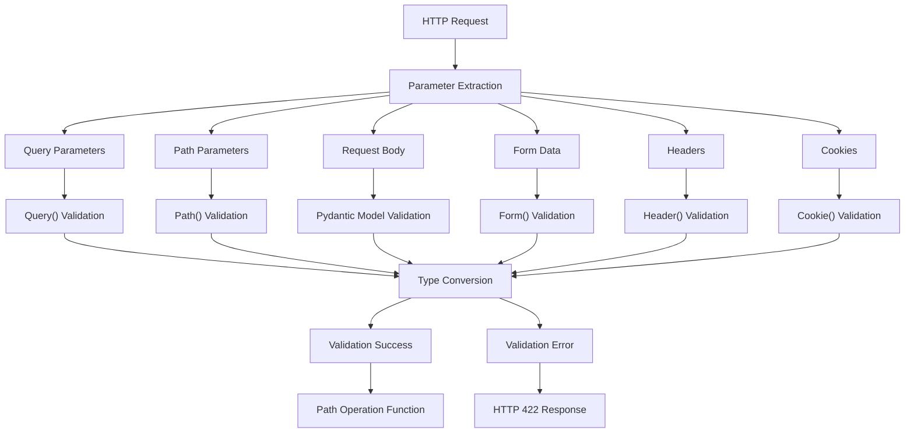

This document covers FastAPI's comprehensive parameter validation and handling system, which automatically validates, converts, and documents request parameters including query parameters, path parameters, request bodies, form data, files, headers, and cookies. For information about dependency injection and parameter sharing, see [Dependency Injection](#2.2). For details about response handling and serialization, see [Response Handling](#2.4).

## Core Parameter Types

FastAPI provides specialized functions for declaring and validating different types of request parameters. Each parameter type has its own dedicated function that handles validation, type conversion, and OpenAPI documentation generation.

### Parameter Declaration Functions

The main parameter declaration functions are exported from the root FastAPI module:

- `Query()` - Query string parameters
- `Path()` - URL path parameters  
- `Body()` - Request body content
- `Form()` - HTML form data
- `File()` - File uploads
- `Header()` - HTTP headers
- `Cookie()` - HTTP cookies

Sources: [fastapi/__init__.py:12-20]()

### Parameter Validation Flow



Sources: [docs/en/docs/tutorial/query-params-str-validations.md:1-493](), [docs/en/docs/tutorial/path-params-numeric-validations.md:1-165]()

## Query Parameter Validation

Query parameters are declared using the `Query()` function with the `Annotated` type hint syntax. The system supports string validation, numeric constraints, and custom validation functions.

### String Validation Constraints

Query parameters support various string validation rules:

- `min_length` - Minimum string length
- `max_length` - Maximum string length  
- `pattern` - Regular expression pattern matching
- `alias` - Alternative parameter name for the URL

```python
from typing import Annotated
from fastapi import Query

# Example usage patterns from the codebase
q: Annotated[str | None, Query(max_length=50)] = None
q: Annotated[str, Query(min_length=3, pattern="^fixedquery$")]
```

Sources: [docs/en/docs/tutorial/query-params-str-validations.md:88-97](), [docs/en/docs/tutorial/query-params-str-validations.md:188-222]()

### List and Multiple Value Handling

The `Query()` function supports receiving multiple values for the same parameter name, returning them as a Python `list`:

```python
q: Annotated[list[str] | None, Query()] = None