This document covers how FastAPI processes and serializes responses from path operation functions into HTTP responses. It explains the default response behavior, serialization pipeline, response model validation, and custom response classes. For information about request handling and parameter validation, see [Parameter Validation and Handling](#2.3). For error handling mechanisms, see [Error Handling](#2.7).

## Default Response Behavior

FastAPI automatically converts path operation return values into HTTP responses using `JSONResponse` as the default response class. When a path operation function returns data, FastAPI applies the following default behavior:

- **Automatic JSON Conversion**: Return values are serialized to JSON using the `jsonable_encoder`
- **Content-Type Headers**: HTTP headers are automatically set to `application/json`
- **Status Codes**: Default status code is 200, unless explicitly specified
- **Response Model Validation**: If a `response_model` is declared, the return value is validated against it

The default response class can be overridden at the application level or per-route using the `response_class` parameter.

Sources: [fastapi/applications.py:354-373](), [fastapi/routing.py:454-456]()

## Response Serialization Pipeline

### Response Content Preparation

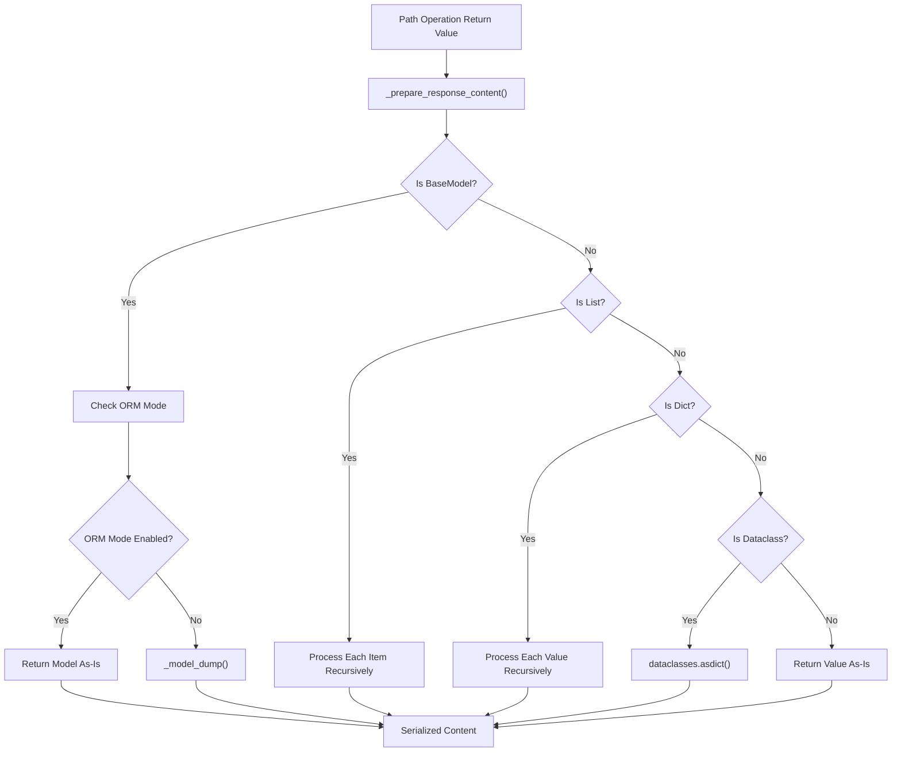

The `_prepare_response_content` function handles the initial content preparation by recursively processing different data types and applying serialization rules based on the `exclude_unset`, `exclude_defaults`, and `exclude_none` parameters.

Sources: [fastapi/routing.py:80-124]()

### JSON Encoding Process

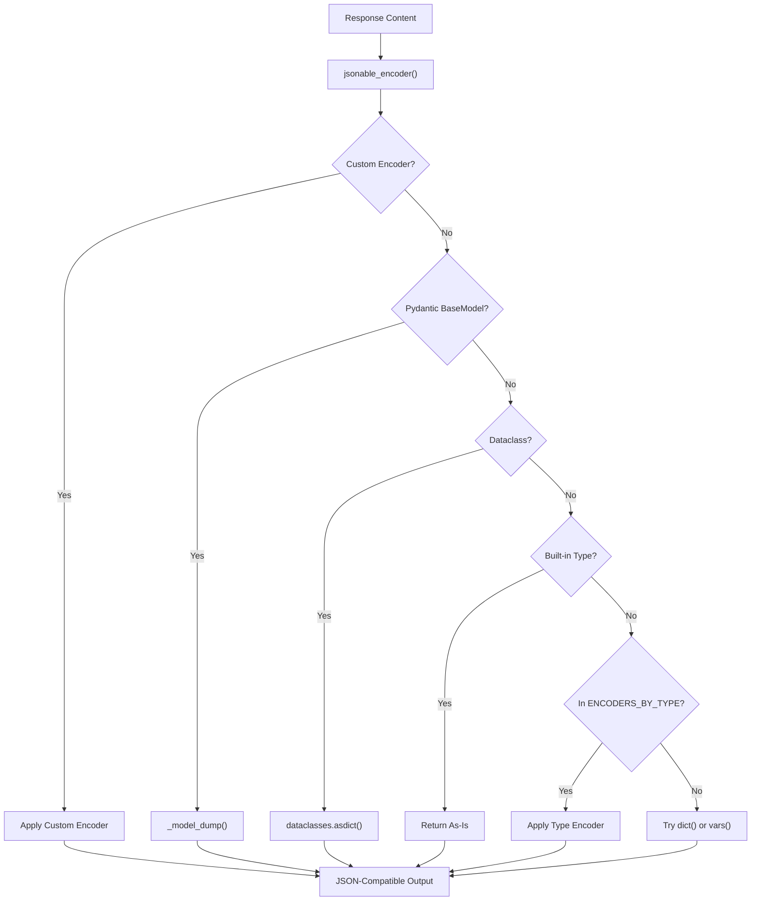

The `jsonable_encoder` provides comprehensive type conversion with support for custom encoders, Pydantic models, dataclasses, and various Python built-in types including datetime, UUID, Enum, and Path objects.

Sources: [fastapi/encoders.py:102-343]()

## Response Model Validation

### Response Field Creation

When a path operation declares a `response_model`, FastAPI creates response fields during route initialization:

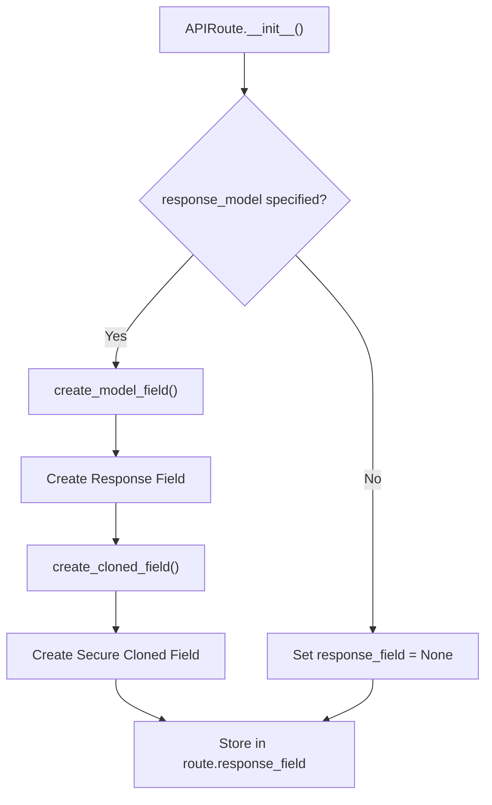

The cloned field ensures that Pydantic submodel inheritance doesn't bypass validation, preventing security issues where a subclass with additional fields might be returned directly.

Sources: [fastapi/routing.py:507-530]()

### Response Validation Process

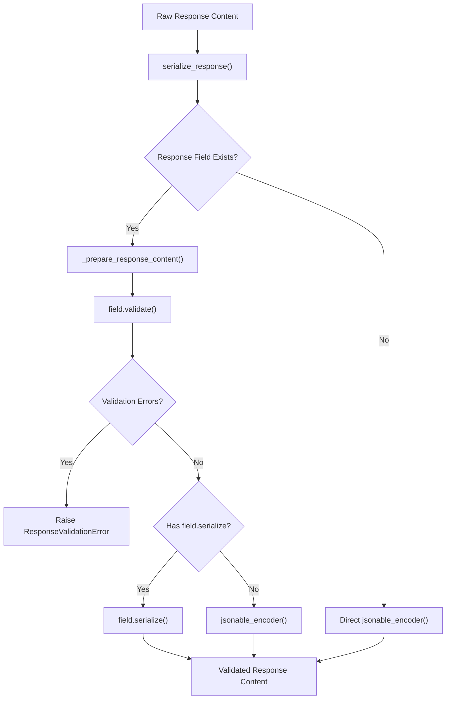

The `serialize_response` function validates response content against the declared response model, ensuring type safety and proper serialization. It handles both Pydantic v1 and v2 compatibility through the `hasattr(field, "serialize")` check.

Sources: [fastapi/routing.py:144-203]()

## Custom Response Classes

### Response Class Hierarchy

FastAPI supports various response classes that inherit from Starlette's `Response`:

| Response Class | Media Type | Use Case |
|----------------|------------|----------|
| `JSONResponse` | `application/json` | Default, automatic JSON serialization |
| `ORJSONResponse` | `application/json` | High-performance JSON with `orjson` |
| `HTMLResponse` | `text/html` | HTML content |
| `PlainTextResponse` | `text/plain` | Plain text responses |
| `RedirectResponse` | N/A | HTTP redirects |
| `FileResponse` | Based on file | File downloads |
| `StreamingResponse` | Custom | Streaming content |

### Custom Response Integration

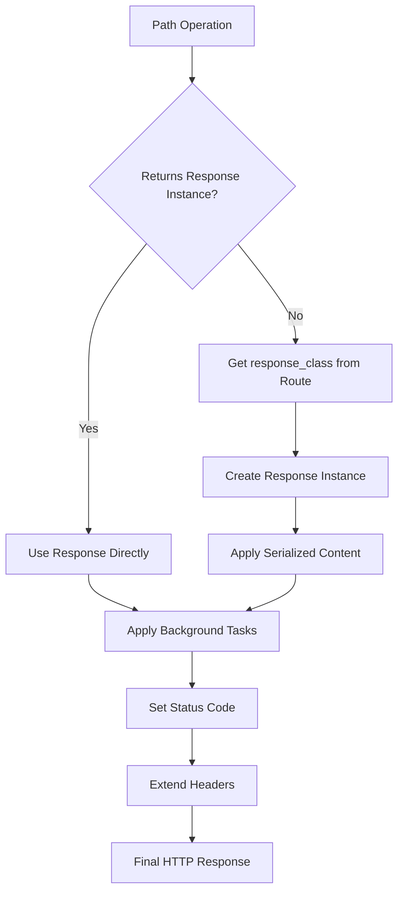

When a path operation returns a `Response` instance directly, FastAPI bypasses the serialization pipeline. Otherwise, it uses the declared `response_class` to wrap the serialized content.

Sources: [fastapi/routing.py:307-342](), [docs/en/docs/advanced/custom-response.md:1-86]()

## Response Generation Flow

### Complete Request-Response Cycle

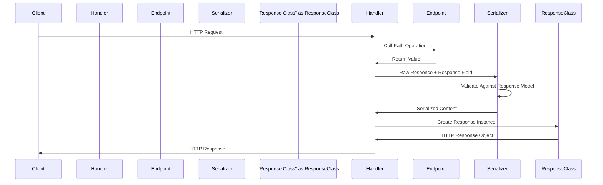

### Response Handler Implementation

The `get_request_handler` function orchestrates the complete response generation process:

1. **Endpoint Execution**: Calls the path operation function via `run_endpoint_function`
2. **Response Type Check**: Determines if return value is already a `Response` instance
3. **Content Serialization**: Applies `serialize_response` with response model validation
4. **Response Construction**: Creates response instance with proper status codes and headers
5. **Background Tasks**: Attaches any background tasks to the response
6. **Body Validation**: Ensures response body is allowed for the status code

Sources: [fastapi/routing.py:241-356]()

### Status Code and Header Management

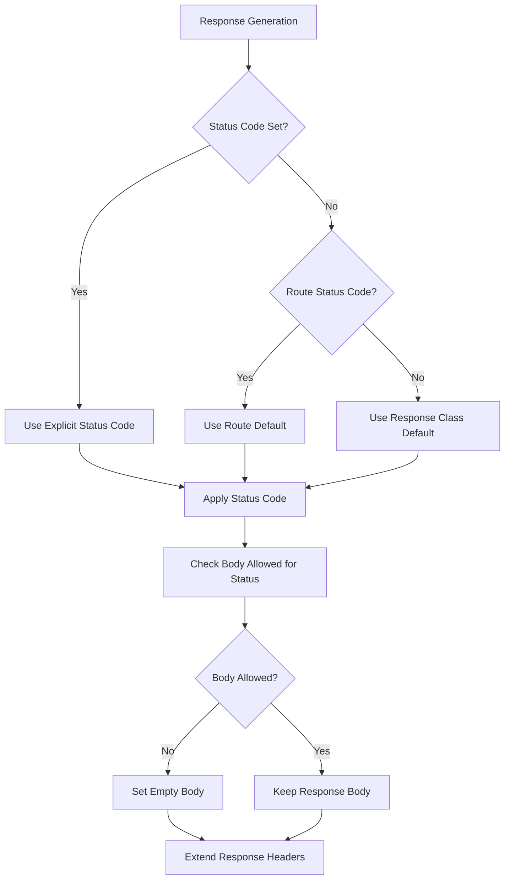

FastAPI automatically manages status codes based on the hierarchy of explicit parameters, route defaults, and response class defaults. It also validates that response bodies are appropriate for the status code (e.g., no body for 204 No Content).

Sources: [fastapi/routing.py:317-342](), [fastapi/utils.py:42-56]()

# Security Components

This document covers FastAPI's security infrastructure, including authentication schemes (OAuth2, HTTP Basic/Bearer, API Key, OpenID Connect), security dependencies, and permission scopes. For broader API documentation concepts, see [API Documentation System](#3). For error handling in security contexts, see [Error Handling](#2.7).

## Overview

FastAPI provides a comprehensive security system with multiple authentication schemes integrated into the dependency injection framework. The security components handle authentication, authorization, token validation, and scope-based permissions through a collection of base classes, concrete implementations, and utilities that automatically integrate with OpenAPI documentation generation.

## Security Component Architecture

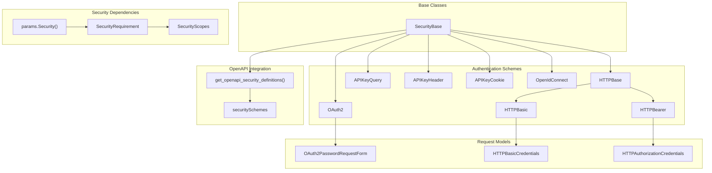

Sources: [fastapi/security/base.py](), [fastapi/security/oauth2.py:308-441](), [fastapi/security/http.py:69-340](), [fastapi/security/api_key.py](), [fastapi/dependencies/models.py:8-12](), [fastapi/openapi/utils.py:78-92]()

## Base Security Classes

### SecurityBase

The `SecurityBase` class serves as the foundation for all security schemes in FastAPI. It provides the basic interface that all authentication mechanisms inherit from and ensures consistent integration with the dependency injection system.

Sources: [fastapi/security/base.py]()

### SecurityRequirement

The `SecurityRequirement` dataclass represents security requirements for operations, containing a reference to the security scheme and any required scopes:

| Field | Type | Description |
|-------|------|-------------|
| `security_scheme` | `SecurityBase` | The security scheme instance |
| `scopes` | `Optional[Sequence[str]]` | Required permission scopes |

Sources: [fastapi/dependencies/models.py:8-12]()

## Authentication Schemes

### OAuth2 Components

#### OAuth2

The `OAuth2` class implements OAuth2 authentication flows. It accepts flow configurations and integrates with OpenAPI documentation generation.

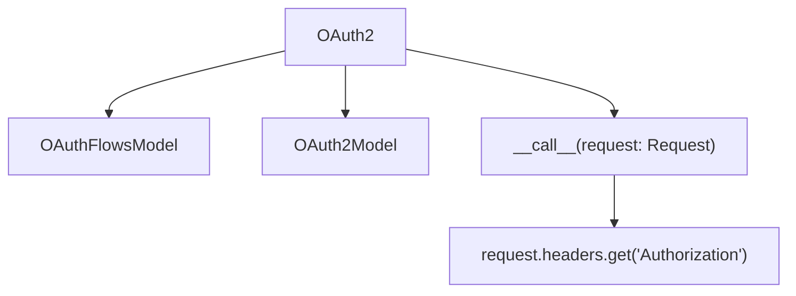

Key initialization parameters:
- `flows` - OAuth2 flow definitions (`OAuthFlowsModel`)
- `scheme_name` - Security scheme name for OpenAPI
- `description` - Security scheme description
- `auto_error` - Whether to automatically raise errors for missing auth

Sources: [fastapi/security/oauth2.py:308-441]()

#### OAuth2PasswordRequestForm

The `OAuth2PasswordRequestForm` class handles login form data according to OAuth2 password flow specifications:

| Field | Type | Required | Description |
|-------|------|----------|-------------|
| `username` | `str` | Yes | User identifier |
| `password` | `str` | Yes | User password |
| `scope` | `str` | No | Space-separated scopes |
| `grant_type` | `str` | No | OAuth2 grant type |
| `client_id` | `str` | No | OAuth2 client ID |
| `client_secret` | `str` | No | OAuth2 client secret |

The form data is automatically parsed from request form fields and made available as a dependency.

Sources: [fastapi/security/oauth2.py:16-149]()

### HTTP Authentication Components

#### HTTPBasic

The `HTTPBasic` class implements HTTP Basic authentication, extracting and validating Base64-encoded credentials from the `Authorization` header.

Returns `HTTPBasicCredentials` containing `username` and `password` fields.

Sources: [fastapi/security/http.py:97-217]()

#### HTTPBearer

The `HTTPBearer` class implements HTTP Bearer token authentication, extracting tokens from the `Authorization` header.

Returns `HTTPAuthorizationCredentials` containing:
- `scheme` - The authorization scheme (e.g., "Bearer")
- `credentials` - The token value

Sources: [fastapi/security/http.py:220-340]()

### API Key Authentication

FastAPI provides three API key authentication classes for different token locations:

| Class | Token Location | Usage |
|-------|----------------|--------|
| `APIKeyQuery` | Query parameter | `?api_key=token` |
| `APIKeyHeader` | HTTP header | `X-API-Key: token` |
| `APIKeyCookie` | HTTP cookie | `Cookie: api_key=token` |

All API key classes inherit from `APIKeyBase` and return the extracted key value as a string.

Sources: [fastapi/security/api_key.py:23-237]()

### OpenID Connect

The `OpenIdConnect` class implements OpenID Connect authentication with a configurable OpenID Connect URL.

Key parameter:
- `openIdConnectUrl` - The OpenID Connect discovery endpoint URL

Sources: [fastapi/security/open_id_connect_url.py:11-77]()

## Security Dependency Integration

### Dependency Resolution Flow

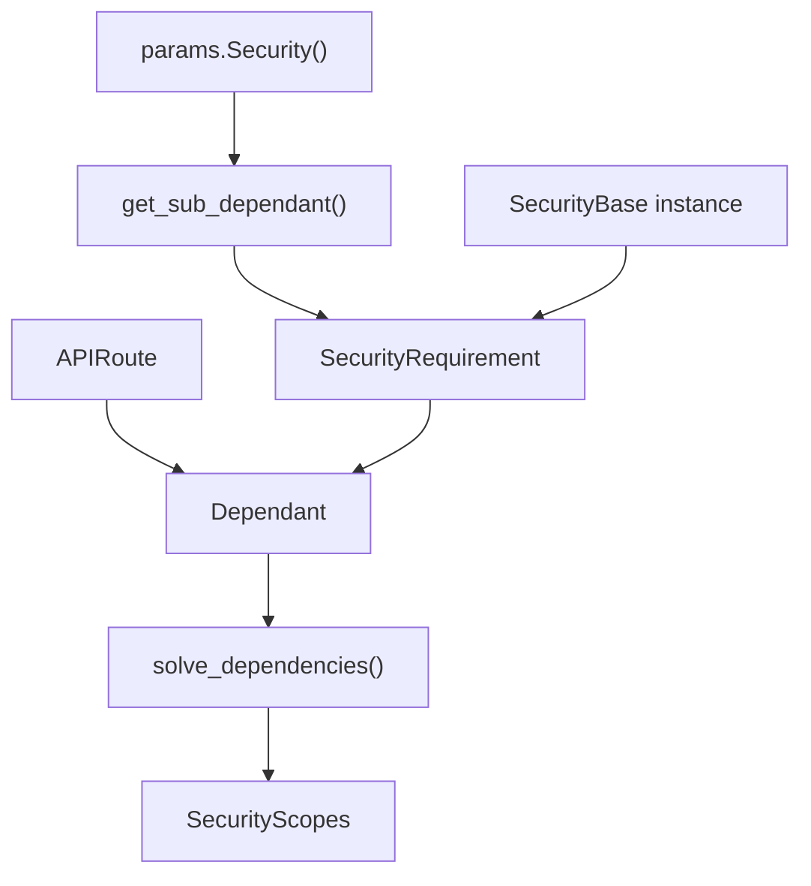

The dependency system processes security components through several key functions:

1. **`get_sub_dependant()`** - Creates `SecurityRequirement` objects from `params.Security` annotations
2. **`solve_dependencies()`** - Resolves security dependencies and populates `SecurityScopes`
3. **Security scheme `__call__`** - Executes authentication logic during request processing

Sources: [fastapi/dependencies/utils.py:142-171](), [fastapi/routing.py:292-298]()

### SecurityScopes Integration

The `SecurityScopes` class aggregates all security scopes required by a request's dependency tree. It is automatically injected when security dependencies are present:

Key attributes:
- `scopes` - List of all required scope strings
- `scope_str` - Space-separated scope string for WWW-Authenticate headers

Sources: [fastapi/security/oauth2.py:57](), [fastapi/dependencies/utils.py:685-687]()

## OpenAPI Security Documentation

### Security Schema Generation

FastAPI automatically generates OpenAPI security schemas through the `get_openapi_security_definitions()` function:

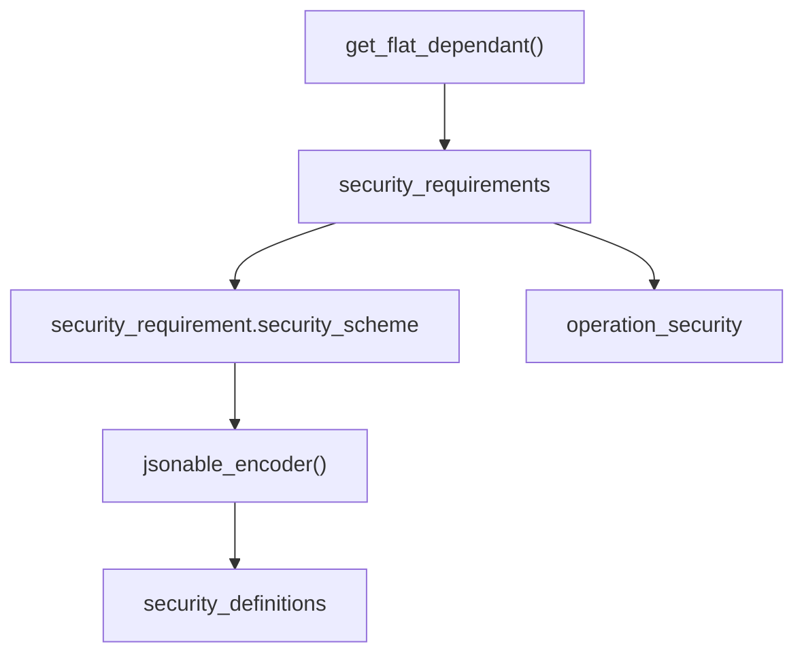

The function processes security requirements to generate:
- **Security Definitions**: OpenAPI security scheme objects
- **Operation Security**: Per-operation security requirements with scopes

Sources: [fastapi/openapi/utils.py:78-92]()

### Security Schema Integration

Security schemes are integrated into the OpenAPI specification through several key areas:

| OpenAPI Section | Content | Source |
|----------------|---------|---------|
| `components.securitySchemes` | Security scheme definitions | Security scheme `model` attributes |
| `paths.{path}.{method}.security` | Per-operation security requirements | `SecurityRequirement.scopes` |
| `paths.{path}.{method}.parameters` | Security parameters (API keys) | Parameter extraction logic |

The integration ensures that interactive documentation (Swagger UI, ReDoc) displays proper authentication interfaces and security requirements.

Sources: [fastapi/openapi/utils.py:282-288](), [fastapi/openapi/utils.py:534-537]()

## Token Validation Pipeline

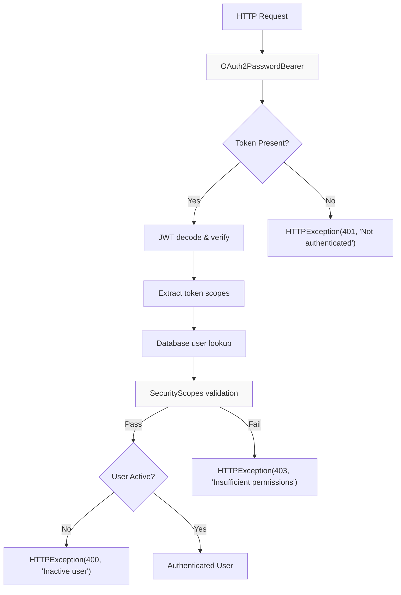

The token validation pipeline processes authentication through multiple stages:

1. **Token Extraction**: `OAuth2PasswordBearer` extracts Bearer token from Authorization header
2. **Token Validation**: Decode and verify JWT signature and expiration
3. **Scope Extraction**: Parse scopes from token payload
4. **User Resolution**: Look up user details from token subject
5. **Scope Authorization**: Validate token scopes against required scopes via `SecurityScopes`
6. **User Status**: Verify user account is active and permitted

Sources: [docs/en/docs/tutorial/security/oauth2-jwt.md:158-166](), [docs/en/docs/advanced/security/oauth2-scopes.md:155-192]()

## Integration with Dependency Injection

Security components integrate seamlessly with FastAPI's dependency injection system through several mechanisms:

| Component | Integration Method | Purpose |
|-----------|-------------------|---------|
| `OAuth2PasswordBearer` | `Depends()` | Token extraction and validation |
| `OAuth2PasswordRequestForm` | `Depends()` | Login form parsing |
| `Security()` | Dependency decorator | Scope-aware authorization |
| `SecurityScopes` | Dependency parameter | Scope aggregation and validation |

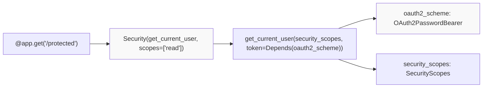

The dependency system automatically:
- Injects `SecurityScopes` with aggregated scope requirements
- Resolves `OAuth2PasswordBearer` to extract and return tokens
- Validates dependency chains for proper security configuration
- Documents security requirements in OpenAPI schema

Sources: [docs/en/docs/advanced/security/oauth2-scopes.md:194-234](), [fastapi/__init__.py:20]()

## OpenAPI Security Documentation

FastAPI automatically generates OpenAPI security documentation from security components:

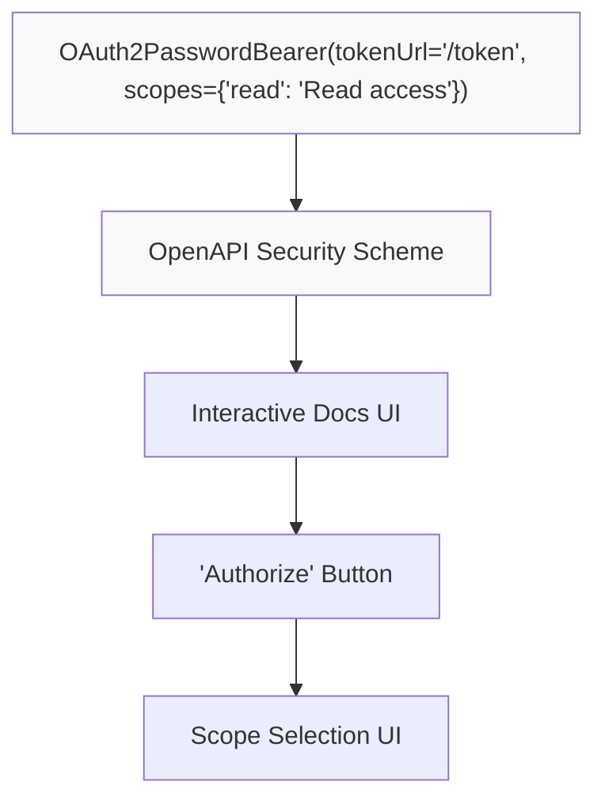

The security documentation includes:
- OAuth2 flow definitions and token URLs
- Available scopes with descriptions
- Security requirements for each endpoint
- Interactive authentication forms in documentation UI

Sources: [docs/en/docs/tutorial/security/first-steps.md:177-185](), [docs/en/docs/advanced/security/oauth2-scopes.md:76-83]()