FastAPI's settings management system provides type-safe configuration handling through Pydantic's `BaseSettings` class. The system automatically reads environment variables, validates configuration values, and integrates with FastAPI's dependency injection system for clean application architecture.

This system centers around the `BaseSettings` class from `pydantic-settings`, dependency injection using `Depends()`, and performance optimization through `@lru_cache` decorators.

## BaseSettings Architecture

The settings system is built around `BaseSettings` from `pydantic-settings`, which provides automatic environment variable reading and type validation. Configuration flows from environment variables through `BaseSettings` subclasses to application components via dependency injection.

**BaseSettings Implementation Flow**
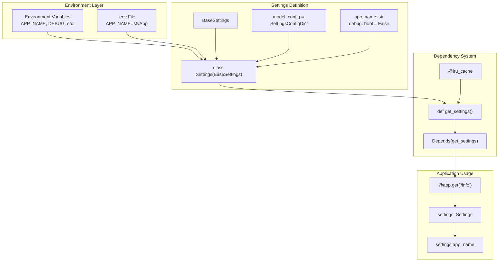

Sources: [docs/en/docs/advanced/settings.md:55-90](), [docs/en/docs/advanced/settings.md:141-172]()

## BaseSettings Class Implementation

The `BaseSettings` class from `pydantic-settings` provides the core functionality for configuration management. It automatically reads environment variables, performs type conversion, and validates configuration values.

### Settings Class Definition

Settings classes inherit from `BaseSettings` and declare configuration as typed class attributes:

```python
from pydantic_settings import BaseSettings, SettingsConfigDict

class Settings(BaseSettings):
    model_config = SettingsConfigDict(env_file=".env")
    
    app_name: str = "FastAPI App"
    debug: bool = False
    items_per_user: int = 50
    admin_email: str
```

**Settings Class Structure**
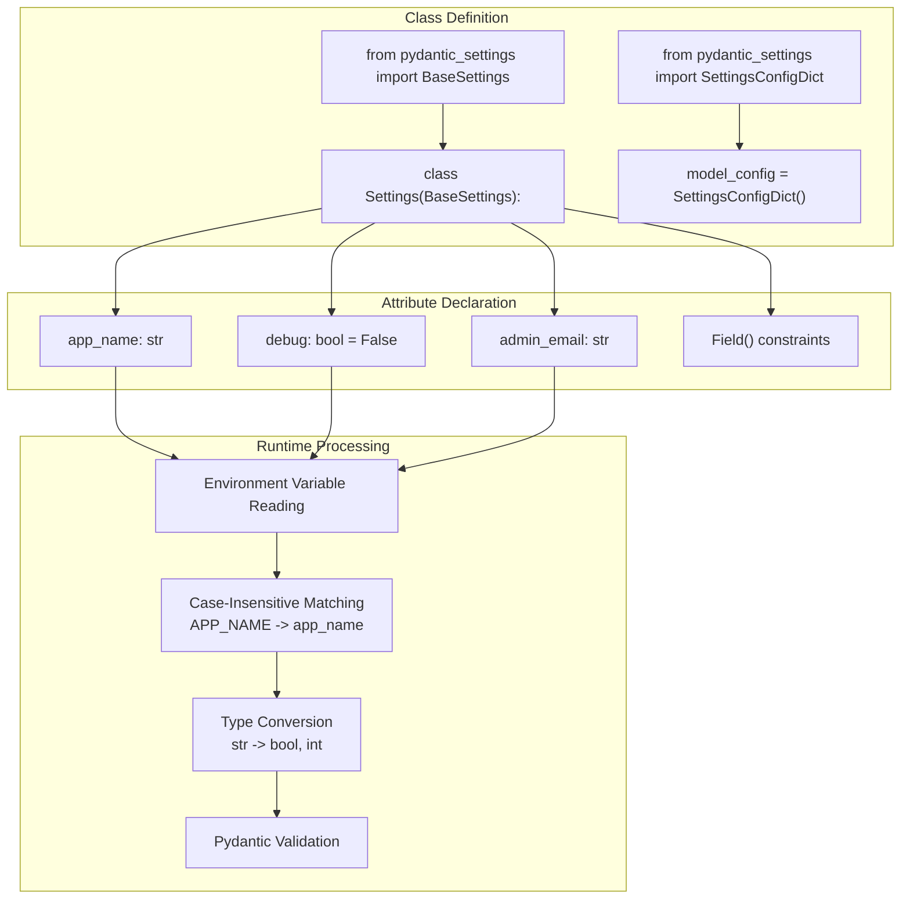

Sources: [docs/en/docs/advanced/settings.md:55-90](), [docs/en/docs/advanced/settings.md:218-249]()

### Environment Variable Mapping

`BaseSettings` automatically maps environment variables to class attributes using case-insensitive matching. The system performs type conversion based on the declared type annotations.

| Class Attribute | Environment Variable | Type Conversion | Example |
|-----------------|---------------------|-----------------|---------|
| `app_name: str` | `APP_NAME` | String | `"FastAPI App"` |
| `debug: bool` | `DEBUG` | Boolean parsing | `"true"` → `True` |
| `items_per_user: int` | `ITEMS_PER_USER` | Integer parsing | `"50"` → `50` |
| `admin_email: EmailStr` | `ADMIN_EMAIL` | Email validation | `"admin@example.com"` |
| `database_url: str` | `DATABASE_URL` | String | `"postgresql://..."` |

The mapping follows Python naming conventions (snake_case) for attributes while accepting standard environment variable naming (UPPER_CASE).

Sources: [docs/en/docs/advanced/settings.md:87-89]()

## Settings Integration Patterns

### Module-Level Settings

The simplest pattern creates a settings instance at module level that can be imported across the application:

```python
# config.py
from pydantic_settings import BaseSettings

class Settings(BaseSettings):
    app_name: str = "FastAPI App"
    debug: bool = False

settings = Settings()

# main.py
from fastapi import FastAPI
from .config import settings

app = FastAPI(title=settings.app_name)
```

This pattern works for simple applications but creates global state that complicates testing.

Sources: [docs/en/docs/advanced/settings.md:124-139]()

### Dependency Injection Pattern

The recommended pattern uses FastAPI's dependency system with `Depends()` to inject settings into path operations. This enables testing through dependency overrides and performance optimization through caching.

**Settings Dependency Implementation**
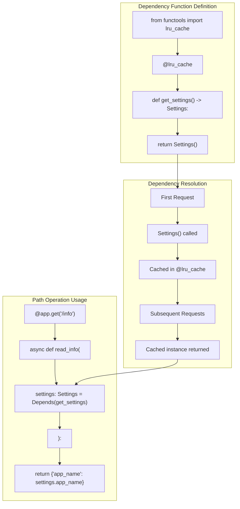

This pattern provides clean separation of concerns and supports dependency overrides for testing.

Sources: [docs/en/docs/advanced/settings.md:141-182](), [docs/en/docs/advanced/settings.md:250-275]()

## Configuration Sources

### Environment Variables

`BaseSettings` automatically reads environment variables as the primary configuration source. All environment variables are initially strings and are converted to declared types through Pydantic's type conversion system.

### .env File Integration

The system supports `.env` files through `python-dotenv` integration, configured via `SettingsConfigDict`:

```python
from pydantic_settings import BaseSettings, SettingsConfigDict

class Settings(BaseSettings):
    model_config = SettingsConfigDict(env_file=".env")
    
    app_name: str = "Default App"
    debug: bool = False
```

**Configuration Source Resolution**
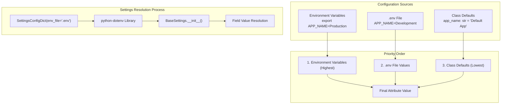

Configuration follows a strict precedence: environment variables override `.env` file values, which override class defaults.

Sources: [docs/en/docs/advanced/settings.md:183-249]()

## Performance Optimization with @lru_cache

### LRU Cache Implementation

The `@lru_cache` decorator from `functools` prevents repeated `Settings()` instantiation and file system access, providing significant performance benefits for frequently accessed configuration.

```python
from functools import lru_cache
from pydantic_settings import BaseSettings

@lru_cache
def get_settings() -> Settings:
    return Settings()

# FastAPI dependency usage
@app.get("/info")
async def read_info(settings: Settings = Depends(get_settings)):
    return {"app_name": settings.app_name}
```

**@lru_cache Optimization Flow**
```mermaid
sequenceDiagram
    participant path_operation["Path Operation Function"]
    participant Depends_system["Depends(get_settings)"]
    participant lru_cache_decorator["@lru_cache"]
    participant get_settings_function["get_settings()"]
    participant Settings_constructor["Settings()"]
    participant filesystem[".env File System"]
    
    Note over path_operation,filesystem: First Request
    path_operation->>Depends_system: Inject settings dependency
    Depends_system->>lru_cache_decorator: Call get_settings()
    lru_cache_decorator->>get_settings_function: Execute function
    get_settings_function->>Settings_constructor: Create Settings()
    Settings_constructor->>filesystem: Read .env file
    filesystem->>Settings_constructor: Return file contents
    Settings_constructor->>lru_cache_decorator: Return Settings instance
    lru_cache_decorator->>path_operation: Cache and return settings
    
    Note over path_operation,filesystem: Subsequent Requests
    path_operation->>Depends_system: Inject settings dependency
    Depends_system->>lru_cache_decorator: Call get_settings()
    lru_cache_decorator->>path_operation: Return cached Settings instance
```

The `@lru_cache` decorator ensures `Settings()` is only called once, eliminating repeated file I/O and object instantiation overhead.

Sources: [docs/en/docs/advanced/settings.md:250-339]()

## Testing Patterns

### Dependency Overrides for Testing

The dependency injection pattern enables clean testing through `app.dependency_overrides`, allowing test-specific configuration without modifying global state.

```python
# Test configuration
def get_settings_override():
    return Settings(
        admin_email="test@example.com",
        debug=True,
        database_url="sqlite:///test.db"
    )

# Test setup
app.dependency_overrides[get_settings] = get_settings_override

# Test teardown
app.dependency_overrides.clear()
```

**Testing Override Pattern**
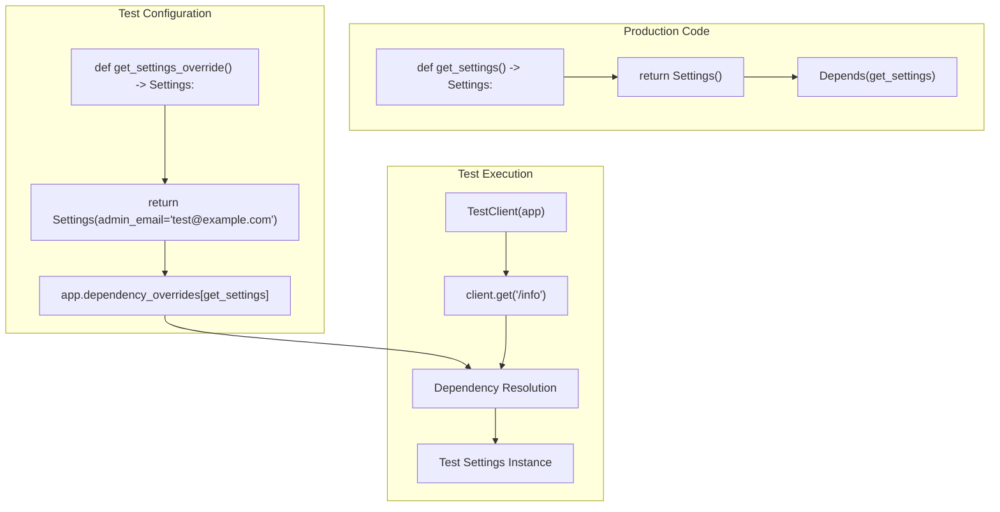

This pattern ensures test isolation and enables testing with different configuration scenarios.

Sources: [docs/en/docs/advanced/settings.md:173-182]()

## Security Considerations

Settings management often involves sensitive configuration like database credentials, API keys, and secret tokens. The system supports secure practices through:

- Environment variable isolation from code
- `.env` file exclusion from version control
- Type validation preventing configuration errors
- Dependency injection enabling secure testing practices

For specific security implementations, see [Security Components](#2.5) which covers OAuth2, JWT tokens, and authentication configuration patterns.

Sources: [docs/en/docs/advanced/settings.md:1-7]()

# Error Handling


FastAPI implements a comprehensive exception hierarchy and handler system that manages errors from request validation, application logic, and WebSocket connections. The system centers around specific exception classes and handler functions that process different error types while maintaining automatic OpenAPI documentation integration.

For information about parameter validation that triggers errors, see [Parameter Validation and Handling](#2.3). For broader request processing context, see [Application and Routing System](#2.1).

## Exception Class Hierarchy

FastAPI defines a complete exception hierarchy that extends Starlette's base exceptions while adding framework-specific error handling capabilities.

### Core Exception Classes

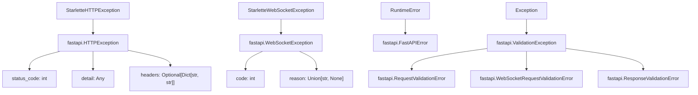

**FastAPI Exception Class Hierarchy with Code Entity Names**
Sources: [fastapi/exceptions.py:9-177]()

The `HTTPException` class [fastapi/exceptions.py:9-66]() extends Starlette's version to accept any JSON-serializable data in the `detail` field, while `WebSocketException` [fastapi/exceptions.py:68-137]() provides WebSocket-specific error handling with RFC 6455 compliant close codes.

### Validation Exception Architecture

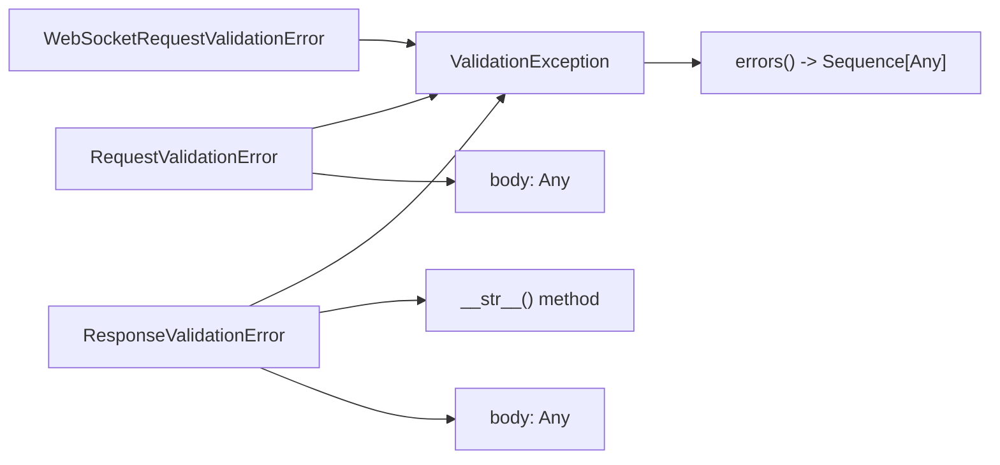

**Validation Exception Structure with Actual Class Methods**
Sources: [fastapi/exceptions.py:149-177]()

The `ValidationException` base class [fastapi/exceptions.py:149-155]() provides the `errors()` method interface, while `RequestValidationError` [fastapi/exceptions.py:157-161]() and `ResponseValidationError` [fastapi/exceptions.py:167-177]() store the invalid request/response body for debugging purposes.

## Exception Handlers

FastAPI provides default exception handlers for framework exceptions and enables registration of custom handlers for application-specific error processing.

### Default Exception Handler Functions

```mermaid
graph TD
    http_exception_handler["http_exception_handler"] --> Request["request: Request"]
    http_exception_handler --> HTTPException["exc: HTTPException"]
    http_exception_handler --> Response_or_JSONResponse["Response | JSONResponse"]
    
    request_validation_exception_handler["request_validation_exception_handler"] --> Request2["request: Request"]
    request_validation_exception_handler --> RequestValidationError["exc: RequestValidationError"]
    request_validation_exception_handler --> JSONResponse422["JSONResponse(422)"]
    
    websocket_request_validation_exception_handler["websocket_request_validation_exception_handler"] --> WebSocket["websocket: WebSocket"]
    websocket_request_validation_exception_handler --> WebSocketRequestValidationError["exc: WebSocketRequestValidationError"]
    websocket_request_validation_exception_handler --> websocket_close["websocket.close()"]
```

**Default Exception Handler Function Signatures**
Sources: [fastapi/exception_handlers.py:11-35]()

The `http_exception_handler` [fastapi/exception_handlers.py:11-18]() uses `is_body_allowed_for_status_code()` to determine response format, while `request_validation_exception_handler` [fastapi/exception_handlers.py:20-27]() returns 422 status with `jsonable_encoder(exc.errors())`. WebSocket validation errors [fastapi/exception_handlers.py:29-35]() close the connection with `WS_1008_POLICY_VIOLATION`.

### Custom Exception Handler Registration

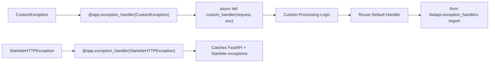

**Exception Handler Registration with Actual Import Paths**
Sources: [docs/en/docs/tutorial/handling-errors.md:82-102](), [docs/en/docs/tutorial/handling-errors.md:249-256]()

Custom handlers are registered with `@app.exception_handler()` and can import default handlers from `fastapi.exception_handlers` for reuse. Registering handlers for Starlette exceptions catches both FastAPI and Starlette internal exceptions.

### WebSocket Exception Handling

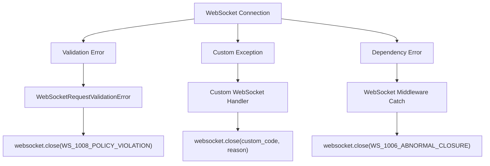

**WebSocket Exception Handling Flow with Status Codes**
Sources: [tests/test_ws_router.py:210-272](), [fastapi/exception_handlers.py:29-35]()

WebSocket validation errors trigger `WS_1008_POLICY_VIOLATION` close codes, while custom WebSocket exception handlers [tests/test_ws_router.py:257-272]() can define custom close codes and reasons. WebSocket middleware can catch dependency errors [tests/test_ws_router.py:236-255]().

## Error Response Integration

Error handling integrates with FastAPI's broader request processing pipeline and OpenAPI documentation generation.

### Error Flow in Request Processing Pipeline

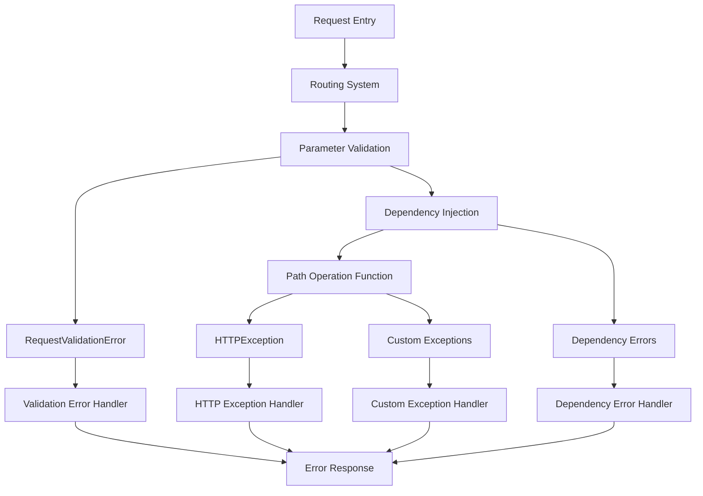

**Error Handling Integration with Request Processing**
Sources: [docs/en/docs/tutorial/handling-errors.md:1-256](), [docs/en/docs/tutorial/dependencies/index.md:32-42]()

Errors can occur at multiple stages of request processing: during parameter validation, dependency injection, or within path operation functions. Each error type is handled by appropriate handlers that can be customized or extended while maintaining the overall request processing flow.

### Exception Handler Inheritance and Reuse

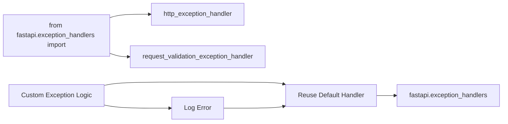

**Exception Handler Reuse Pattern**
Sources: [docs/en/docs/tutorial/handling-errors.md:249-256]()

FastAPI provides importable default exception handlers from `fastapi.exception_handlers` that can be reused within custom exception handling logic. This allows developers to add custom processing (like logging) while maintaining standard error response formats.

## OpenAPI Documentation Integration

Error responses declared in exception handlers and path operations are automatically included in the generated OpenAPI schema, providing comprehensive API documentation that includes both success and error scenarios.

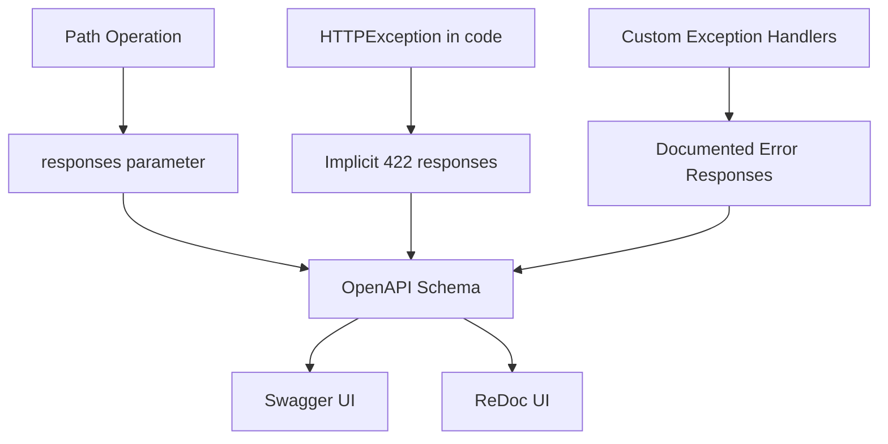

**Error Documentation Generation Flow**
Sources: [docs/en/docs/tutorial/handling-errors.md:1-256](), [docs/en/docs/tutorial/query-params-str-validations.md:104-109]()

The framework automatically generates OpenAPI documentation for validation errors (422 responses) and incorporates custom error responses defined in path operations. This ensures that API consumers have complete information about both successful and error response formats.

# API Documentation System


## Purpose and Scope

The API Documentation System generates and serves interactive API documentation interfaces for FastAPI applications. This system specifically handles the creation of Swagger UI and ReDoc interfaces that allow users to explore, test, and interact with API endpoints directly in the browser.

This document covers the automatic generation of documentation HTML pages, asset management (JavaScript/CSS files), and customization options for the documentation UI. For information about OpenAPI schema generation that powers these interfaces, see [OpenAPI Schema Generation](#3.1). For broader documentation infrastructure including MkDocs and multi-language support, see [Documentation System](#6.1).

## System Overview

The API Documentation System operates as a bridge between FastAPI's OpenAPI schema generation and web-based documentation interfaces. It provides HTML generation functions that create fully functional documentation pages served directly by FastAPI applications.

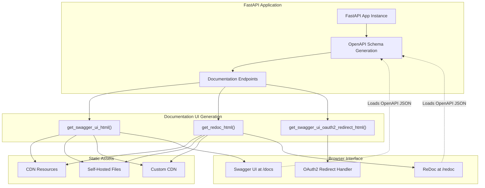

**Documentation UI Generation Flow**
The system generates HTML responses containing JavaScript that initializes documentation interfaces using OpenAPI specifications.

Sources: [fastapi/openapi/docs.py:1-345]()

## Core Components

The documentation system centers around three primary HTML generation functions that create complete documentation interfaces with embedded JavaScript and CSS.

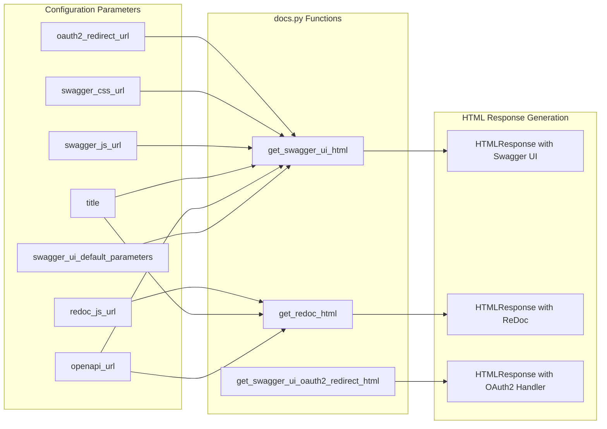

**Core Function Architecture**
Each documentation interface is generated by a dedicated function that assembles HTML with proper asset references and configuration.

### Primary Generation Functions

The `get_swagger_ui_html()` function creates the main interactive documentation interface. It accepts parameters for customizing the OpenAPI URL, title, asset URLs, and Swagger UI configuration through the `swagger_ui_parameters` parameter.

Sources: [fastapi/openapi/docs.py:26-158]()

The `get_redoc_html()` function generates an alternative documentation interface using ReDoc. It provides a different visual style and interaction model compared to Swagger UI, with options for Google Fonts integration and custom styling.

Sources: [fastapi/openapi/docs.py:161-253]()

The `get_swagger_ui_oauth2_redirect_html()` function handles OAuth2 authentication flow redirects specifically for Swagger UI. This enables authentication testing directly within the documentation interface.

Sources: [fastapi/openapi/docs.py:256-344]()

### Default Configuration

The system provides sensible defaults through `swagger_ui_default_parameters` which includes DOM targeting, layout configuration, and feature toggles for the Swagger UI interface.

| Parameter | Default Value | Purpose |
|-----------|---------------|---------|
| `dom_id` | `"#swagger-ui"` | Target DOM element for UI mounting |
| `layout` | `"BaseLayout"` | Swagger UI layout configuration |
| `deepLinking` | `True` | Enable URL-based navigation |
| `showExtensions` | `True` | Display OpenAPI extensions |
| `showCommonExtensions` | `True` | Display common vendor extensions |

Sources: [fastapi/openapi/docs.py:8-23]()

## Asset Management

The documentation system supports three asset delivery modes: CDN-based (default), custom CDN, and self-hosted static files. Each mode provides different trade-offs between simplicity, control, and offline functionality.

### CDN-Based Assets (Default)

By default, the system loads assets from jsdelivr CDN with these default URLs:
- Swagger UI JavaScript: `https://cdn.jsdelivr.net/npm/swagger-ui-dist@5/swagger-ui-bundle.js`
- Swagger UI CSS: `https://cdn.jsdelivr.net/npm/swagger-ui-dist@5/swagger-ui.css`
- ReDoc JavaScript: `https://cdn.jsdelivr.net/npm/redoc@2/bundles/redoc.standalone.js`
- Favicon: `https://fastapi.tiangolo.com/img/favicon.png`

Sources: [fastapi/openapi/docs.py:47-74](), [fastapi/openapi/docs.py:182-199]()

### Custom CDN Configuration

Applications can specify alternative CDN URLs by passing custom `swagger_js_url`, `swagger_css_url`, and `redoc_js_url` parameters to the generation functions. This supports scenarios where default CDNs are blocked or alternative sources are preferred.

Sources: [docs/en/docs/how-to/custom-docs-ui-assets.md:9-58](), [docs_src/custom_docs_ui/tutorial001.py:11-33]()

### Self-Hosted Static Assets

For offline or airgapped deployments, applications can serve documentation assets locally by:
1. Downloading required JavaScript and CSS files
2. Serving them through FastAPI's `StaticFiles` mounting
3. Configuring documentation functions to use local URLs

The required files are:
- `swagger-ui-bundle.js` and `swagger-ui.css` for Swagger UI
- `redoc.standalone.js` for ReDoc

Sources: [docs/en/docs/how-to/custom-docs-ui-assets.md:59-186]()

## Integration with FastAPI Applications

FastAPI applications automatically configure documentation endpoints unless explicitly disabled. The system integrates through several application-level configurations and automatic endpoint registration.

### Automatic Documentation Endpoints

FastAPI applications automatically create documentation endpoints at `/docs` (Swagger UI) and `/redoc` (ReDoc) unless disabled by setting `docs_url=None` or `redoc_url=None` in the FastAPI constructor.

The automatic endpoints use these application attributes:
- `app.openapi_url` - URL for OpenAPI JSON schema
- `app.title` - Application title for documentation pages
- `app.swagger_ui_oauth2_redirect_url` - OAuth2 redirect handler URL

### Custom Documentation Endpoints

Applications requiring asset customization must disable automatic endpoints and create custom path operations that call the HTML generation functions with appropriate parameters.

```python
# Disable automatic docs
app = FastAPI(docs_url=None, redoc_url=None)

# Create custom endpoints
@app.get("/docs", include_in_schema=False)
async def custom_swagger_ui_html():
    return get_swagger_ui_html(
        openapi_url=app.openapi_url,
        title=app.title + " - Swagger UI",
        swagger_js_url="custom-cdn-url",
        swagger_css_url="custom-cdn-url"
    )
```

Sources: [docs_src/custom_docs_ui/tutorial001.py:8-39]()

### OAuth2 Integration

The system supports OAuth2 authentication flows through the redirect handler endpoint. Applications using OAuth2 security schemes can enable authentication testing directly within Swagger UI by configuring the `oauth2_redirect_url` and `init_oauth` parameters.

The OAuth2 redirect handler processes authentication callbacks and returns tokens to the Swagger UI interface, enabling full authentication testing within the documentation.

Sources: [fastapi/openapi/docs.py:75-90](), [fastapi/openapi/docs.py:256-344]()

## Testing and Validation

The documentation system includes comprehensive testing to ensure proper HTML generation, asset URL inclusion, and configuration parameter handling.

Test coverage includes:
- Default CDN URL inclusion in generated HTML
- Custom URL parameter handling
- OAuth2 redirect functionality
- Google Fonts configuration for ReDoc
- Static file serving integration

Sources: [tests/test_local_docs.py:1-68](), [tests/test_tutorial/test_custom_docs_ui/test_tutorial001.py:1-43]()