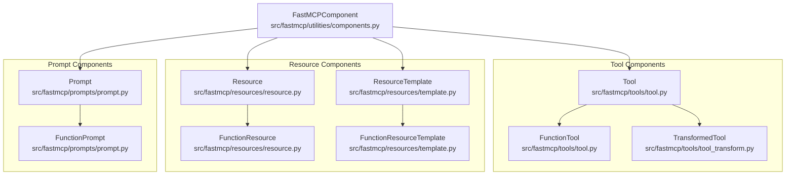
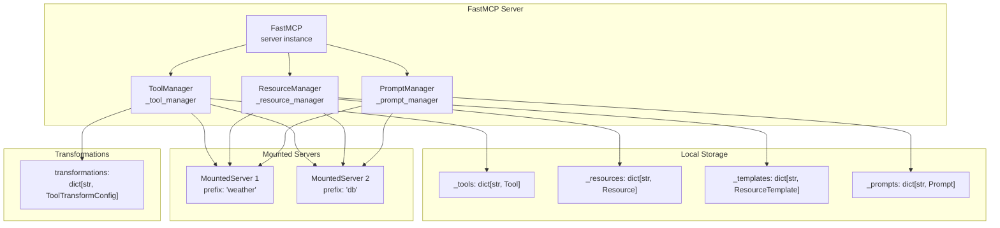
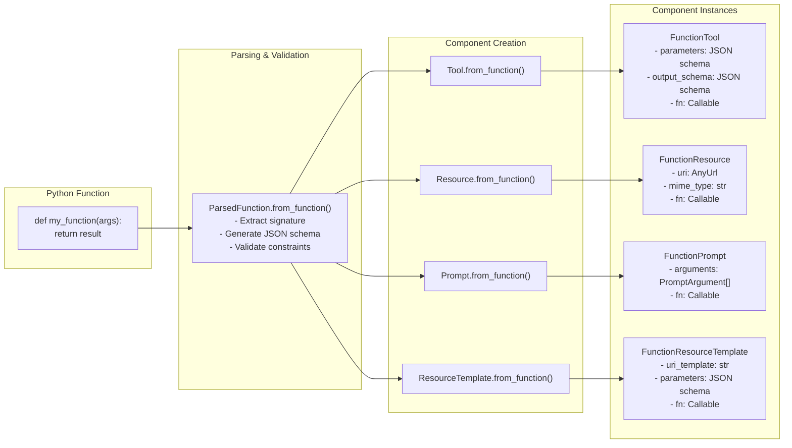
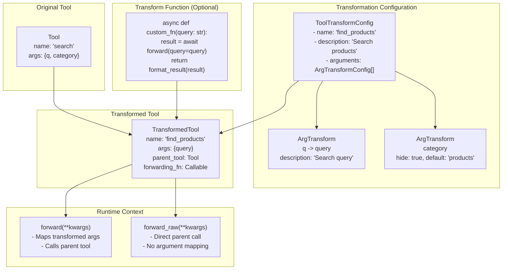
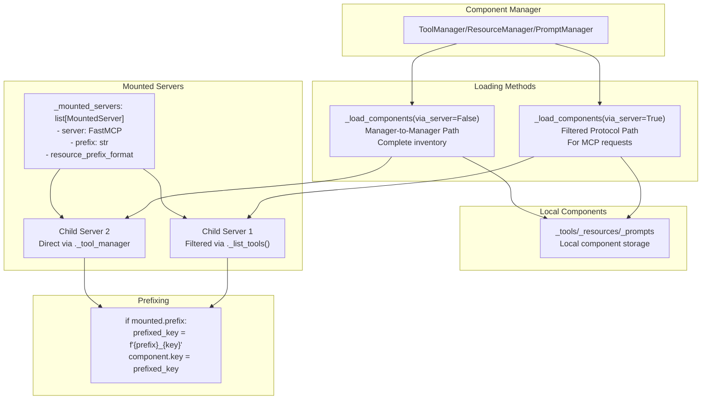

This document covers the FastMCP component system, which provides a unified framework for managing Tools, Resources, Prompts, and Resource Templates. It explains how these components are created, registered, managed, and composed within FastMCP servers.

For information about server composition and mounting mechanisms, see [Server Composition and Proxying](#2.3). For details about dependency injection and the Context system, see [Context System and Dependencies](#2.2).

## Component Type Hierarchy

FastMCP organizes all server capabilities into four main component types, each sharing common functionality through a base class architecture.

### Component Class Structure



**Sources**: [src/fastmcp/utilities/components.py:28-125](), [src/fastmcp/tools/tool.py:105-240](), [src/fastmcp/resources/resource.py:34-219](), [src/fastmcp/resources/template.py:53-314](), [src/fastmcp/prompts/prompt.py:65-262]()

### Base Component Properties

All FastMCP components inherit from `FastMCPComponent` and share these properties:

| Property | Type | Purpose |
|----------|------|---------|
| `name` | `str` | Unique identifier for the component |
| `title` | `str \| None` | Display title for UI purposes |
| `description` | `str \| None` | Human-readable description |
| `tags` | `set[str]` | Categorization tags for filtering |
| `meta` | `dict[str, Any] \| None` | Additional metadata |
| `enabled` | `bool` | Whether component is active |
| `key` | `str` | Internal bookkeeping identifier (may include prefixes) |

**Sources**: [src/fastmcp/utilities/components.py:28-69]()

## Component Manager Architecture

Each component type has a dedicated manager class that handles registration, retrieval, and execution. The managers follow a consistent pattern and support server composition through mounting.

### Manager System Overview



**Sources**: [src/fastmcp/tools/tool_manager.py:25-255](), [src/fastmcp/resources/resource_manager.py:28-344](), [src/fastmcp/prompts/prompt_manager.py:21-204]()

### Manager Responsibilities

Each manager provides these core operations:

| Operation | Tool Manager | Resource Manager | Prompt Manager |
|-----------|--------------|------------------|----------------|
| **Add Component** | `add_tool(tool)` | `add_resource(resource)` | `add_prompt(prompt)` |
| **Get Component** | `get_tool(key)` | `read_resource(uri)` | `get_prompt(key)` |
| **List Components** | `list_tools()` | `list_resources()` | `list_prompts()` |
| **Execute/Use** | `call_tool(key, args)` | Templates: `create_resource()` | `render_prompt(name, args)` |

**Sources**: [src/fastmcp/tools/tool_manager.py:108-254](), [src/fastmcp/resources/resource_manager.py:275-344](), [src/fastmcp/prompts/prompt_manager.py:91-204]()

## Component Creation from Functions

FastMCP provides a consistent pattern for creating components from Python functions using static factory methods.

### Function-to-Component Creation Flow



**Sources**: [src/fastmcp/tools/tool.py:354-491](), [src/fastmcp/resources/resource.py:168-219](), [src/fastmcp/prompts/prompt.py:156-262](), [src/fastmcp/resources/template.py:214-313]()

### Context Injection

All function-based components support automatic Context injection for accessing server capabilities:

```python
# Context parameter is automatically detected and injected
def my_tool(query: str, ctx: Context) -> str:
    ctx.logger.info(f"Processing query: {query}")
    return f"Result for {query}"
```

The parameter detection uses `find_kwarg_by_type()` to identify Context parameters and excludes them from the component's public schema.

**Sources**: [src/fastmcp/utilities/types.py:find_kwarg_by_type](), [src/fastmcp/tools/tool.py:407-412](), [src/fastmcp/resources/template.py:245-246]()

## Tool Transformation System

Tools can be transformed to create modified versions with different schemas, argument mappings, or custom behavior. This enables adaptation without code duplication.

### Tool Transformation Architecture



**Sources**: [src/fastmcp/tools/tool_transform.py:232-517](), [src/fastmcp/tools/tool_transform.py:37-91](), [src/fastmcp/tools/tool_transform.py:93-207]()

### Argument Transformation Options

The `ArgTransform` class provides fine-grained control over individual arguments:

| Transform Type | Purpose | Example |
|----------------|---------|---------|
| **Rename** | Change argument name | `name="new_name"` |
| **Hide** | Remove from public schema | `hide=True, default="constant"` |
| **Default Value** | Add/change default | `default=42` |
| **Default Factory** | Dynamic defaults | `default_factory=lambda: time.time()` |
| **Type Change** | Modify expected type | `type=str` |
| **Make Required** | Remove default value | `required=True` |

**Sources**: [src/fastmcp/tools/tool_transform.py:93-207]()

## Server Composition and Component Mounting

Managers support mounting other servers to create hierarchical component structures. This enables composition of multiple FastMCP servers into larger systems.

### Component Loading Paths



**Sources**: [src/fastmcp/tools/tool_manager.py:55-101](), [src/fastmcp/resources/resource_manager.py:72-190](), [src/fastmcp/prompts/prompt_manager.py:49-89]()

## Component Lifecycle Management

Components support enable/disable operations and automatic notifications to trigger list change events in the MCP protocol.

### Component State Management

Each component can be enabled or disabled, and state changes automatically notify the Context system:

```python