This document covers FastMCP's configuration management system, which enables declarative server definitions, multi-server orchestration, and standardized MCP client configurations. The system provides both programmatic and file-based configuration approaches for defining MCP servers, their connections, authentication, and behavioral transformations.

For information about HTTP server deployment configuration, see [HTTP Server and Deployment](#4). For CLI-based configuration commands, see [Command Line Interface](#5). For project build and dependency configuration, see [Installation and Setup](#1.1).

## Configuration System Architecture

The configuration management system centers around the `MCPConfig` class hierarchy, which provides both standard and canonical configuration formats for defining MCP servers and their properties.

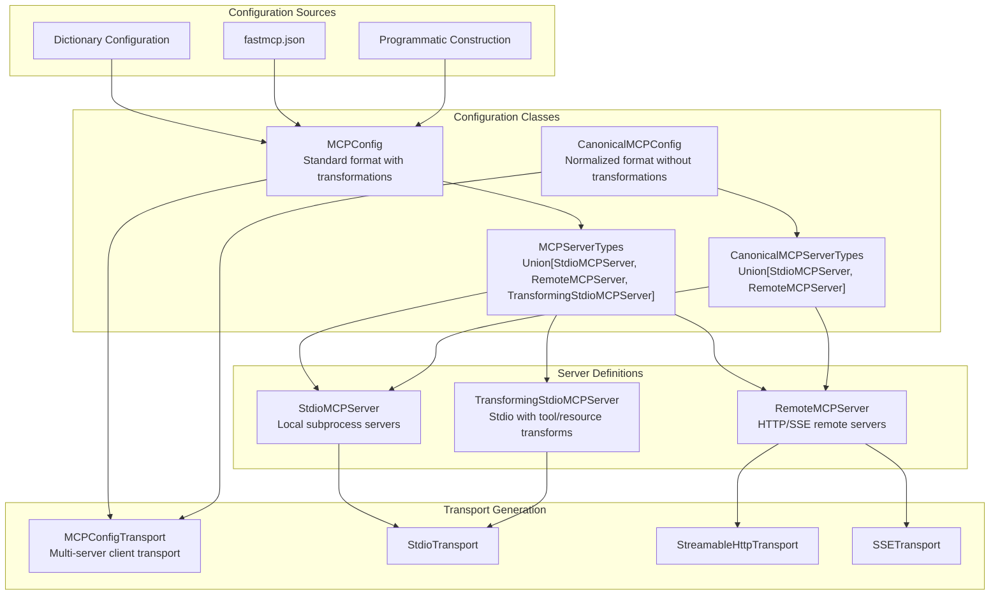

Sources: [tests/test_mcp_config.py:25-33](), [src/fastmcp/mcp_config.py]()

## Server Configuration Types

FastMCP supports three primary server configuration types, each designed for different deployment scenarios and capability requirements.

### StdioMCPServer Configuration

`StdioMCPServer` configurations define local subprocess-based MCP servers that communicate via standard input/output streams.

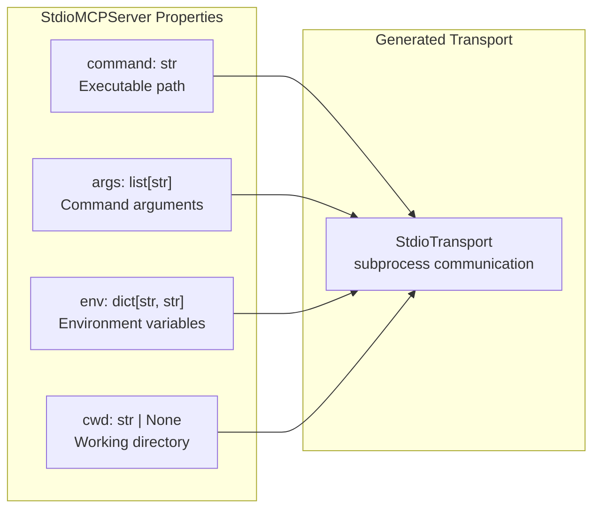

Example configuration structure:
```json
{
  "mcpServers": {
    "local_server": {
      "command": "python",
      "args": ["/path/to/server.py"],
      "env": {"DEBUG": "1"}
    }
  }
}
```

Sources: [tests/test_mcp_config.py:50-63](), [tests/test_mcp_config.py:177-202]()

### RemoteMCPServer Configuration

`RemoteMCPServer` configurations define HTTP-based remote MCP servers with automatic transport inference and authentication support.

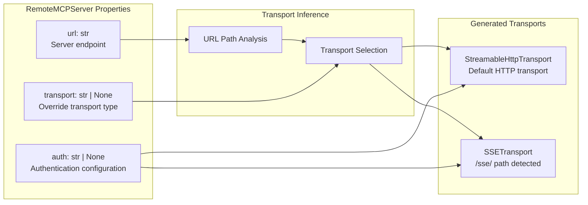

The system automatically infers `SSETransport` for URLs containing `/sse/` paths, while defaulting to `StreamableHttpTransport` for other HTTP endpoints.

Sources: [tests/test_mcp_config.py:134-175](), [tests/test_mcp_config.py:412-467]()

### TransformingStdioMCPServer Configuration

`TransformingStdioMCPServer` extends stdio servers with tool and resource transformation capabilities, enabling name remapping, argument transformation, and selective inclusion/exclusion.

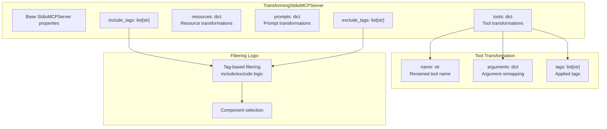

Sources: [tests/test_mcp_config.py:534-588](), [tests/test_mcp_config.py:639-698]()

## Configuration File Formats

FastMCP supports multiple configuration input formats with automatic normalization and validation.

### Dictionary-based Configuration

The system accepts both nested `mcpServers` format and root-level server definitions:

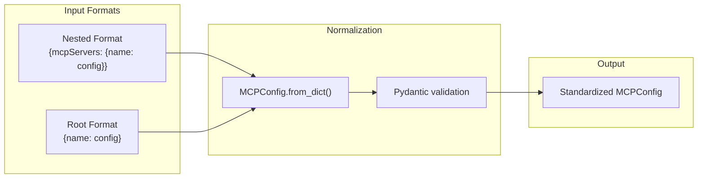

The parser automatically detects and normalizes root-level server definitions to the standard nested format.

Sources: [tests/test_mcp_config.py:86-99](), [tests/test_mcp_config.py:66-84]()

### Configuration Discrimination

The system uses discriminated unions to automatically select appropriate server types based on configuration content:

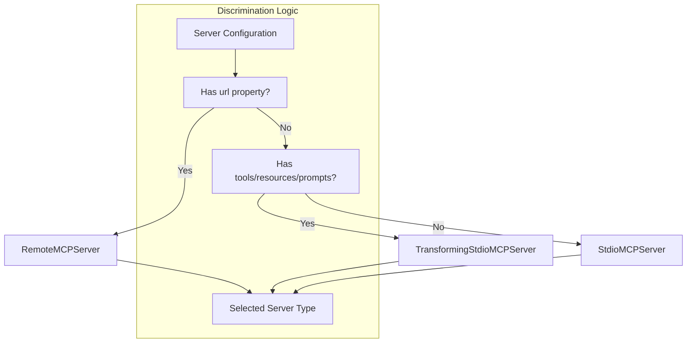

Sources: [tests/test_mcp_config.py:101-132]()

## Transport Configuration and Generation

The configuration system generates appropriate transport instances based on server definitions, with automatic inference and override capabilities.

### Transport Generation Pipeline

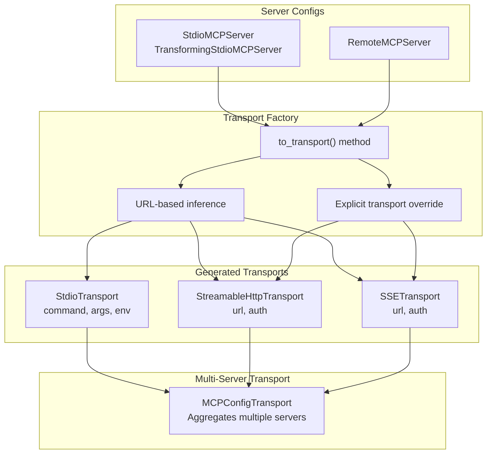

Sources: [tests/test_mcp_config.py:142-175](), [src/fastmcp/client/transports.py]()

## Authentication Configuration

FastMCP provides flexible authentication configuration supporting bearer tokens and OAuth flows for remote servers.

### Authentication Types

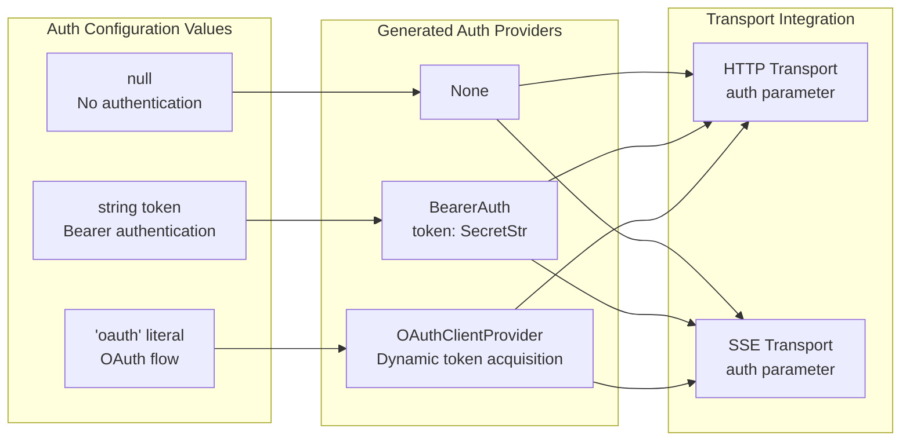

Authentication is automatically applied to both `StreamableHttpTransport` and `SSETransport` instances based on the remote server configuration.

Sources: [tests/test_mcp_config.py:425-467]()

## Multi-Server Orchestration

The `MCPConfigTransport` enables simultaneous connection to multiple MCP servers with unified tool/resource/prompt namespacing.

### Multi-Server Architecture

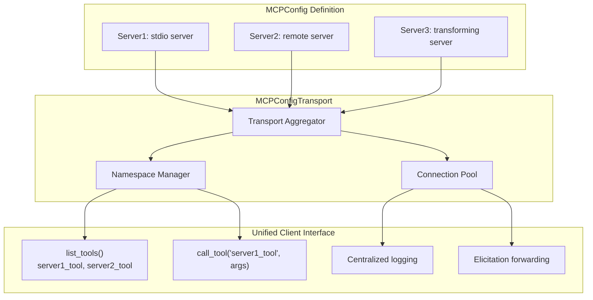

Each server's tools, resources, and prompts are prefixed with the server name (e.g., `server_name_tool_name`) to avoid conflicts while maintaining clear attribution.

Sources: [tests/test_mcp_config.py:204-244](), [tests/test_mcp_config.py:469-532](), [tests/test_mcp_config.py:700-740]()

## Environment and Project Configuration

FastMCP integrates with standard Python project configuration through `pyproject.toml` and supports environment-based configuration management.

### Project Configuration Structure

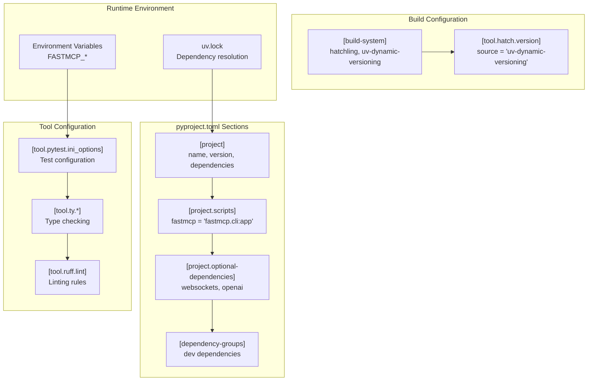

The configuration system supports environment variable-based test configuration through `FASTMCP_TEST_MODE`, `FASTMCP_LOG_LEVEL`, and other `FASTMCP_*` prefixed variables.

Sources: [pyproject.toml:1-147](), [.github/workflows/run-tests.yml:78-81]()

# Testing and Development Framework


This document covers FastMCP's comprehensive testing infrastructure, development utilities, and testing patterns. It explains the testing utilities, fixtures, and methodologies used to test FastMCP servers, clients, transports, and integrations.

For information about deployment and production configuration, see [HTTP Server and Deployment](#4). For development workflow tools like the CLI, see [Command Line Interface](#5).

## Testing Infrastructure Overview

FastMCP provides a robust testing framework designed to handle the complexities of testing distributed MCP systems, including process isolation, network communication, authentication flows, and transport mechanisms.

```mermaid
graph TB
    subgraph "Testing Utilities"
        TestUtils["fastmcp.utilities.tests"]
        ProcessMgmt["run_server_in_process()"]
        SettingsOverride["temporary_settings()"]
        LogCapture["caplog_for_fastmcp()"]
        HeadlessAuth["HeadlessOAuth"]
    end
    
    subgraph "Test Fixtures"
        ConfTest["tests/conftest.py"]
        PortMgmt["free_port_factory()"]
        WorkerID["worker_id fixture"]
        IntegrationMarker["integration marker"]
    end
    
    subgraph "Transport Testing"
        HTTPTests["StreamableHttpTransport tests"]
        SSETests["SSETransport tests"]
        StdioTests["StdioTransport tests"]
        MemoryTests["FastMCPTransport tests"]
    end
    
    subgraph "Server Testing"
        ServerFixtures["FastMCP server fixtures"]
        AuthTesting["OAuth/JWT testing"]
        ComponentTesting["Tool/Resource/Prompt testing"]
        MiddlewareTesting["Middleware testing"]
    end
    
    subgraph "Client Testing"
        ClientFixtures["Client fixtures"]
        AuthClientTesting["Client authentication"]
        TimeoutTesting["Timeout behavior"]
        ErrorHandling["Error handling"]
    end
    
    TestUtils --> ProcessMgmt
    TestUtils --> SettingsOverride
    TestUtils --> LogCapture
    TestUtils --> HeadlessAuth
    
    ConfTest --> PortMgmt
    ConfTest --> WorkerID
    ConfTest --> IntegrationMarker
    
    ProcessMgmt --> ServerFixtures
    PortMgmt --> ServerFixtures
    
    ServerFixtures --> HTTPTests
    ServerFixtures --> SSETests
    ServerFixtures --> AuthTesting
    
    HeadlessAuth --> AuthClientTesting
    ClientFixtures --> TimeoutTesting
```

**Testing Framework Architecture**

Sources: [src/fastmcp/utilities/tests.py:1-200](), [tests/conftest.py:1-60]()

## Core Testing Utilities

### Process Management

The `run_server_in_process()` function provides isolated server testing by running FastMCP servers in separate processes:

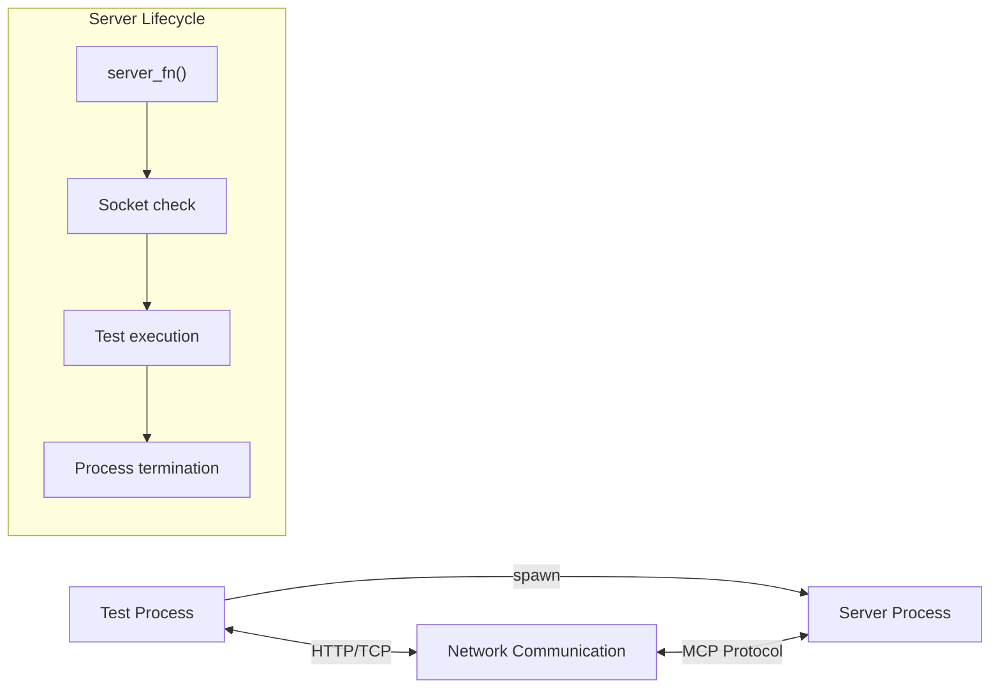

**Process Isolation for Server Testing**

The utility handles server lifecycle, port allocation, and cleanup automatically:

| Function | Purpose | Key Parameters |
|----------|---------|----------------|
| `run_server_in_process()` | Spawns server in separate process | `server_fn`, `host`, `port`, `**kwargs` |
| Socket readiness check | Waits for server to accept connections | `max_attempts=30` |
| Process cleanup | Terminates server process | `timeout=5` for graceful, then `kill()` |

Sources: [src/fastmcp/utilities/tests.py:74-140]()

### Settings Override System

The `temporary_settings()` context manager allows safe modification of FastMCP configuration during tests:

```python
# Example usage pattern from tests
with temporary_settings(log_level='DEBUG', experimental_feature=True):
    # Test code runs with modified settings
    assert fastmcp.settings.log_level == 'DEBUG'
# Settings automatically restored
```

Sources: [src/fastmcp/utilities/tests.py:24-55]()

### Authentication Testing

The `HeadlessOAuth` class simulates OAuth flows without browser interaction:

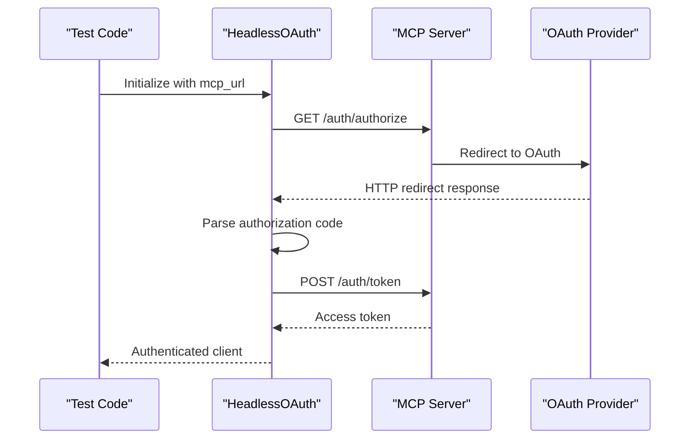

**Headless OAuth Flow for Testing**

The implementation bypasses browser interaction by making direct HTTP requests and parsing redirect responses:

| Method | Purpose | Returns |
|--------|---------|---------|
| `redirect_handler()` | Makes HTTP request to auth URL | Stores response |
| `callback_handler()` | Extracts auth code from redirect | `(auth_code, state)` |

Sources: [src/fastmcp/utilities/tests.py:154-200]()

## Test Fixtures and Configuration

### Port Management

FastMCP provides utilities for managing network ports in test environments:

```python
# Free port fixtures from conftest.py
@pytest.fixture
def free_port():
    """Get a free port for the test to use."""
    
@pytest.fixture 
def free_port_factory(worker_id):
    """Factory to get free ports that tracks used ports per test session."""
```

The `free_port_factory` tracks used ports to prevent conflicts in parallel test execution.

Sources: [tests/conftest.py:34-59]()

### Integration Test Marking

Tests are automatically categorized based on their location:

```python
def pytest_collection_modifyitems(items):
    """Automatically mark tests in integration_tests folder with 'integration' marker."""
    for item in items:
        if "integration_tests" in str(item.fspath):
            item.add_marker(pytest.mark.integration)
```

Sources: [tests/conftest.py:8-13]()

## Transport Testing Patterns

### HTTP Transport Testing

FastMCP tests HTTP transports using real server instances with comprehensive scenarios:

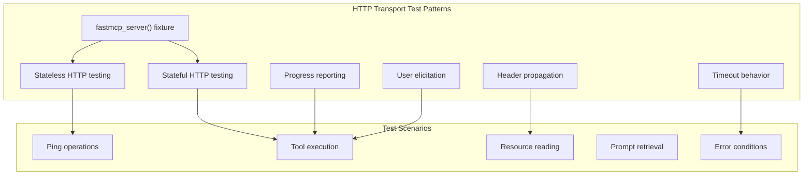

**HTTP Transport Testing Architecture**

Key test patterns include:

- **Parameterized testing**: Tests run against both stateless and stateful HTTP modes
- **Header propagation**: Verification that client headers reach server components
- **Timeout handling**: Testing both client-level and operation-level timeouts
- **Progress reporting**: Async progress updates during long-running operations

Sources: [tests/client/test_streamable_http.py:21-248]()

### SSE Transport Testing

Server-Sent Events transport testing follows similar patterns with transport-specific considerations:

| Test Category | Key Features | Example Test |
|---------------|--------------|--------------|
| Basic connectivity | Ping, list operations | `test_ping()` |
| Header handling | Client header propagation | `test_http_headers()` |
| Timeout behavior | Platform-specific timeout handling | `TestTimeout` class |
| Nested routing | Complex URL path resolution | `test_nested_sse_server_resolves_correctly()` |

Sources: [tests/client/test_sse.py:19-167]()

## Authentication Testing Framework

### JWT Provider Testing

FastMCP includes comprehensive JWT testing with both RSA and symmetric key scenarios:

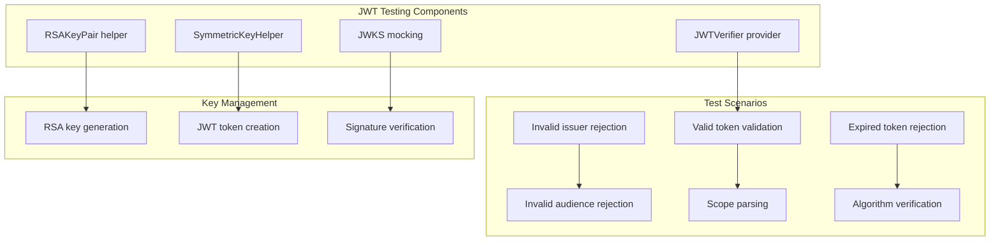

**JWT Authentication Testing Framework**

The testing framework provides helpers for various JWT scenarios:

- **RSA key management**: `RSAKeyPair.generate()` creates test key pairs
- **Symmetric keys**: `SymmetricKeyHelper` for HMAC algorithms
- **Token validation**: Comprehensive issuer, audience, and scope testing
- **JWKS mocking**: HTTP mocking for JWKS URI endpoints

Sources: [tests/server/auth/test_jwt_provider.py:14-871]()

### OAuth Provider Testing

OAuth providers are tested using integration patterns with real HTTP servers:

```python
# Example OAuth provider test pattern
def run_mcp_server(host: str, port: int) -> None:
    mcp = FastMCP(auth=DescopeProvider(...))
    
    @mcp.tool
    def add(a: int, b: int) -> int:
        return a + b
    
    mcp.run(host=host, port=port, transport="http")

@pytest.fixture  
def mcp_server_url() -> Generator[str]:
    with run_server_in_process(run_mcp_server) as url:
        yield f"{url}/mcp"
```

Sources: [tests/server/auth/providers/test_descope.py:121-141](), [tests/server/auth/providers/test_workos.py:160-178]()

## Component Testing Patterns

### Tool Testing with BulkToolCaller

The `BulkToolCaller` provides patterns for testing tool execution at scale:

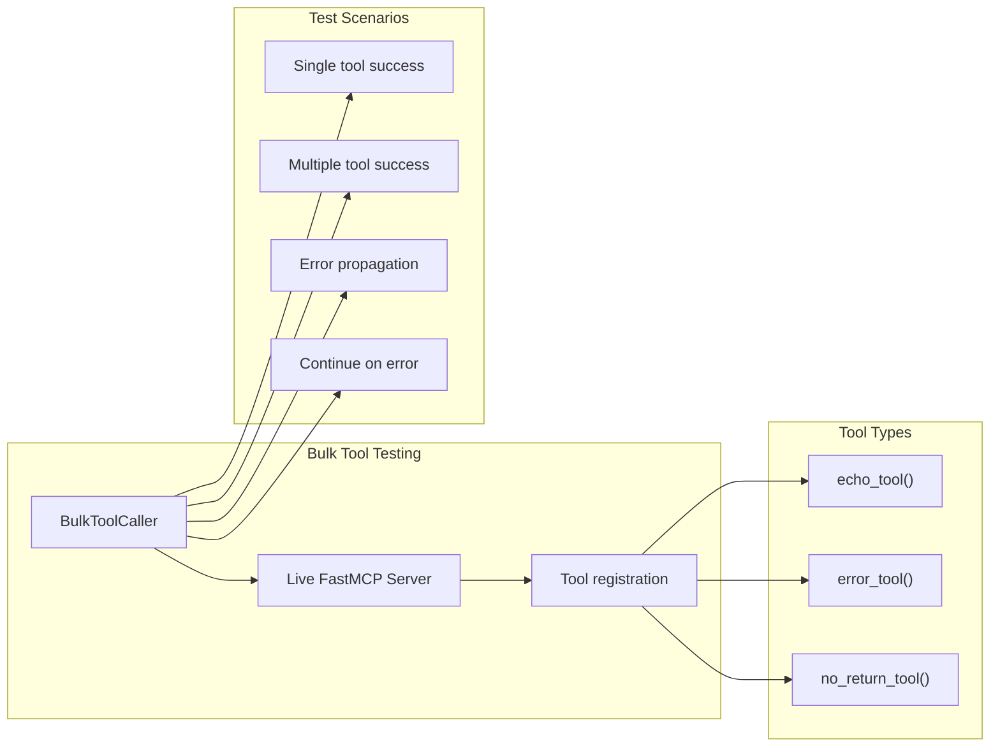

**Bulk Tool Testing Framework**

Key testing patterns include:

- **Live server integration**: Tests use actual `FastMCP` instances with registered tools
- **Error propagation**: Testing both fail-fast and continue-on-error modes
- **Result validation**: Snapshot testing for consistent output verification

Sources: [tests/contrib/test_bulk_tool_caller.py:70-289]()

### HTTP Dependencies Testing

FastMCP tests dependency injection in HTTP contexts across multiple transports:

| Component | Test Pattern | Verification |
|-----------|--------------|--------------|
| `get_http_request()` | Tool, Resource, Prompt usage | Header extraction from HTTP request |
| StreamableHttp | Direct header propagation | Client headers in server context |
| SSE | Event stream headers | Header preservation across SSE |

Sources: [tests/server/http/test_http_dependencies.py:13-124]()

## Development Workflow Testing

### OpenAPI Integration Testing

FastMCP tests OpenAPI server generation with both legacy and experimental parsers:

```python
# Test pattern for OpenAPI integration
def fastmcp_server_for_headers() -> FastMCP:
    app = FastAPI()
    
    @app.get("/headers")  
    def get_headers(request: Request):
        return request.headers
    
    mcp = FastMCP.from_fastapi(
        app,
        httpx_client_kwargs={"headers": {"x-server-header": "test-abc"}},
        route_maps=[
            RouteMap(methods=["GET"], pattern=r".*\{.*\}.*", mcp_type=MCPType.RESOURCE_TEMPLATE),
            RouteMap(methods=["GET"], pattern=r".*", mcp_type=MCPType.RESOURCE),
        ],
    )
    return mcp
```

The testing verifies:
- **Route mapping**: HTTP routes to MCP components
- **Header propagation**: Client and server headers through proxy chains
- **Resource templates**: Dynamic URI pattern matching

Sources: [tests/client/test_openapi_legacy.py:13-47](), [tests/client/test_openapi_experimental.py:14-46]()

## Best Practices and Patterns

### Test Organization

FastMCP follows these testing organization principles:

1. **Fixture-based setup**: Reusable server and client configurations
2. **Process isolation**: Each test gets clean server instances  
3. **Transport agnostic**: Tests run across multiple transport types
4. **Integration marking**: Automatic categorization of integration vs unit tests
5. **Parallel execution**: xdist compatibility with port management

### Error Testing Patterns

```python