This page covers the FastMCP documentation system, release management, and how documentation is structured and maintained within the project. It explains the technical infrastructure behind documentation generation, changelog management, and the various output formats designed for both human and LLM consumption.

For information about the CLI system and commands, see [Command Line Interface](#5). For details about project infrastructure and automation, see [Project Infrastructure](#9).

## Documentation Architecture

The FastMCP documentation system consists of several interconnected components that generate and maintain documentation across multiple formats and platforms.

### Documentation Structure Overview

**Sources:** [docs/changelog.mdx:1-10](), [docs/updates.mdx:1-10](), [.github/workflows/run-static.yml:1-20](), [.pre-commit-config.yaml:1-15]()

### Documentation File Organization

The documentation follows a structured hierarchy with specific file types and naming conventions:

| File Type | Location | Purpose | Example |
|-----------|----------|---------|---------|
| Release Notes | `docs/changelog.mdx` | Detailed changelog entries | [docs/changelog.mdx:7-79]() |
| Update Cards | `docs/updates.mdx` | Visual release summaries | [docs/updates.mdx:8-22]() |
| Navigation Schema | `docs.json` | Site structure definition | Referenced in architecture |
| README Documentation | `*/README.md` | Component-specific docs | [src/fastmcp/contrib/mcp_mixin/README.md:1-117]() |

**Sources:** [docs/changelog.mdx:1-5](), [docs/updates.mdx:1-6](), [src/fastmcp/contrib/mcp_mixin/README.md:1-10]()

## Release Management and Updates

FastMCP uses a structured approach to managing releases and communicating updates to users and developers.

### Changelog Structure

The changelog follows a consistent format with version-specific entries:

```mermaid
graph TD
    subgraph "Changelog Entry Structure"
        VersionHeader["Version Header<br/>v2.12.4: OIDC What You Did There"]
        ReleaseDate["Release Date<br/>2025-09-26"]
        Description["Release Description<br/>High-level summary"]
        
        subgraph "Change Categories"
            NewFeatures["New Features 🎉<br/>feat: prefixed items"]
            Enhancements["Enhancements 🔧<br/>Minor improvements"]
            Fixes["Fixes 🐞<br/>Bug fixes and patches"]
            Docs["Docs 📚<br/>Documentation updates"]
            Dependencies["Dependencies 📦<br/>Dependency updates"]
        end
        
        subgraph "Metadata"
            Contributors["New Contributors<br/>First-time contributors"]
            FullChangelog["Full Changelog<br/>GitHub comparison links"]
        end
    end
    
    VersionHeader --> ReleaseDate
    ReleaseDate --> Description
    Description --> NewFeatures
    NewFeatures --> Enhancements
    Enhancements --> Fixes
    Fixes --> Docs
    Docs --> Dependencies
    Dependencies --> Contributors
    Contributors --> FullChangelog
```

**Sources:** [docs/changelog.mdx:7-79](), [docs/changelog.mdx:81-123]()

### Update Card System

The updates system provides visual summaries of releases through structured cards:

**Sources:** [docs/updates.mdx:8-22](), [docs/updates.mdx:54-68]()

## Documentation Generation and Maintenance

FastMCP employs automated systems for maintaining documentation quality and consistency.

### Static Analysis and Quality Gates

The documentation maintenance relies on automated quality checks:

**Sources:** [.pre-commit-config.yaml:3-48](), [.github/workflows/run-static.yml:26-54]()

### Automated Documentation Updates

The project uses automated workflows to maintain documentation currency:

| Automation Type | Trigger | Purpose | Implementation |
|------------------|---------|---------|----------------|
| Schema Updates | Code changes | Keep schemas current | PR-based automation |
| SDK Documentation | Post-merge | Generate API docs | GitHub Actions |
| Static Analysis | PR/Push | Quality validation | [.github/workflows/run-static.yml:18-20]() |
| Spell Checking | Pre-commit | Content quality | [.pre-commit-config.yaml:43-48]() |

**Sources:** [.github/workflows/run-static.yml:8-22](), [.pre-commit-config.yaml:25-42]()

## LLM-Friendly Documentation Formats

FastMCP generates documentation in formats optimized for consumption by Large Language Models and AI assistants.

### Documentation Format Bridge

**Sources:** [src/fastmcp/contrib/mcp_mixin/README.md:1-25](), [docs/updates.mdx:1-6]()

### Component Documentation Pattern

FastMCP components follow a standardized documentation pattern, as exemplified by the MCP Mixin:

**Sources:** [src/fastmcp/contrib/mcp_mixin/README.md:3-25](), [src/fastmcp/contrib/mcp_mixin/README.md:26-117]()

The documentation system ensures that FastMCP maintains comprehensive, up-to-date, and accessible documentation across multiple formats and audiences, supporting both human developers and AI systems that need to understand and work with the codebase.