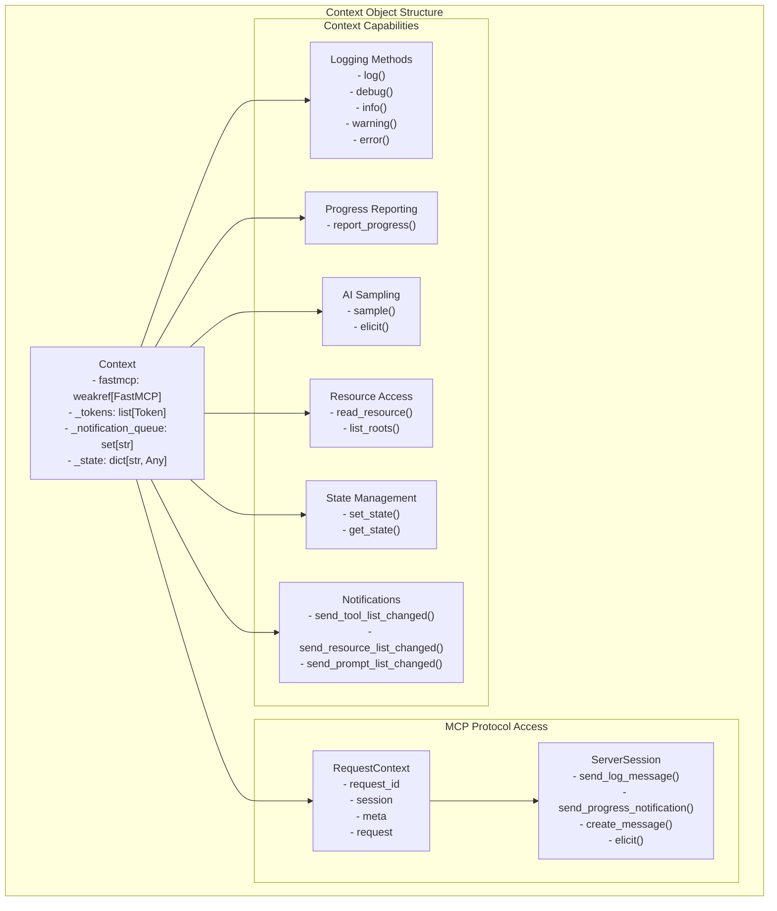
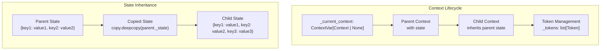
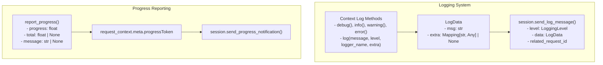
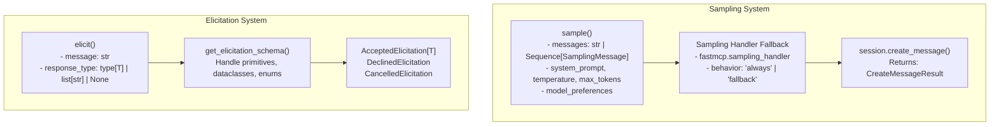
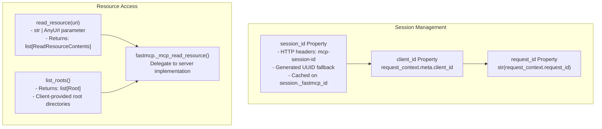
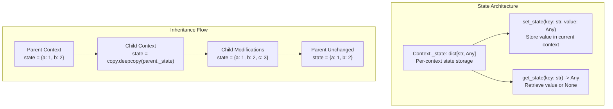
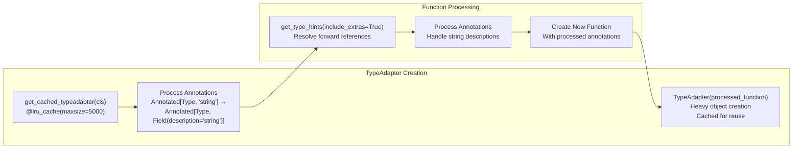
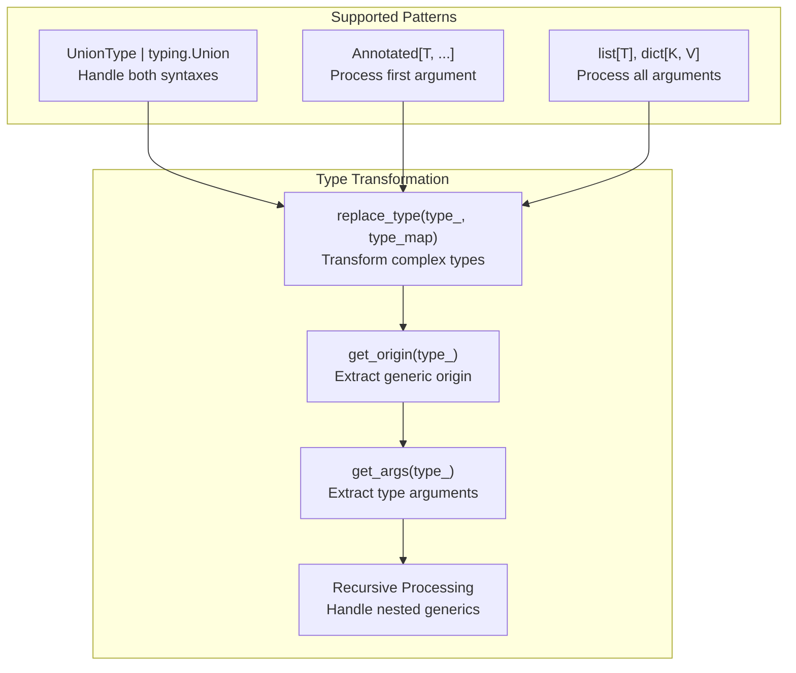

def enable(self) -> None:
    super().enable()
    try:
        context = get_context()
        context._queue_tool_list_changed()  # Notify protocol
    except RuntimeError:
        pass  # No context available

def disable(self) -> None:
    super().disable()
    # Similar notification logic
```

This ensures that MCP clients receive updated component lists when components are dynamically enabled or disabled.

**Sources**: [src/fastmcp/tools/tool.py:123-137](), [src/fastmcp/resources/resource.py:53-67](), [src/fastmcp/prompts/prompt.py:72-86](), [src/fastmcp/resources/template.py:72-86]()

# Context System and Dependencies


This section covers the Context object system and dependency injection mechanisms in FastMCP. The `Context` class provides tools and resources with access to MCP protocol capabilities like logging, sampling, and resource reading, while the dependency injection system automatically provides these capabilities to user functions based on type annotations.

For information about how components (tools, resources, prompts) are created and managed, see [Component System Architecture](#2.1). For details about server composition and mounting, see [Server Composition and Proxying](#2.3).

## Context Object Architecture

The `Context` class serves as the primary interface between user-defined tools/resources and the underlying MCP protocol capabilities. It provides a clean, Pythonic API for accessing server session functionality.



**Sources:** [src/fastmcp/server/context.py:79-123](), [src/fastmcp/server/context.py:159-169]()

### Context Lifecycle Management

The `Context` object implements async context manager semantics with inheritance-based state management:



**Sources:** [src/fastmcp/server/context.py:53](), [src/fastmcp/server/context.py:138-157](), [src/fastmcp/server/context.py:584-590]()

## Dependency Injection System

FastMCP uses type annotation-based dependency injection to automatically provide `Context` objects and other dependencies to user functions.

```mermaid
graph LR
    subgraph "User Function"
        UserFunction["@server.tool<br/>async def my_tool(x: int, ctx: Context) -> str"]
        TypeHints["Function Annotations<br/>x: int<br/>ctx: Context"]
    end
    
    subgraph "Type Analysis"
        FindKwargByType["find_kwarg_by_type()<br/>Inspect function signature<br/>Match Context type"]
        TypeHints2["get_type_hints()<br/>include_extras=True<br/>Handle forward refs"]
        IsClassMember["is_class_member_of_type()<br/>Handle Union, Annotated"]
    end
    
    subgraph "Injection Process"
        ContextInjection["Context Injection<br/>Provide current context<br/>as 'ctx' parameter"]
        FunctionCall["Function Execution<br/>my_tool(x=5, ctx=context)"]
    end
    
    UserFunction --> TypeHints
    TypeHints --> FindKwargByType
    FindKwargByType --> TypeHints2
    TypeHints2 --> IsClassMember
    IsClassMember --> ContextInjection
    ContextInjection --> FunctionCall
```



**Sources:** [src/fastmcp/utilities/types.py:152-176](), [src/fastmcp/utilities/types.py:130-149]()

### Type Annotation Processing

The system handles complex type annotations including unions, forward references, and `Annotated` types:

| Type Pattern | Example | Processing |
|--------------|---------|------------|
| Direct Type | `ctx: Context` | Direct match via `issubclass_safe()` |
| Union Type | `ctx: Context \| None` | Check each union member |
| Annotated Type | `ctx: Annotated[Context, "description"]` | Extract base type from first argument |
| Forward Reference | `ctx: "Context"` | Resolve via `get_type_hints()` |

**Sources:** [src/fastmcp/utilities/types.py:120-128](), [src/fastmcp/utilities/types.py:54-117]()

## MCP Capabilities Access

The `Context` object provides access to core MCP protocol capabilities through a clean interface:

### Logging and Progress



**Sources:** [src/fastmcp/server/context.py:57-67](), [src/fastmcp/server/context.py:210-234](), [src/fastmcp/server/context.py:170-195]()

### AI Sampling and Elicitation



**Sources:** [src/fastmcp/server/context.py:361-442](), [src/fastmcp/server/context.py:444-567]()

### Session and Resource Management



**Sources:** [src/fastmcp/server/context.py:250-292](), [src/fastmcp/server/context.py:197-208](), [src/fastmcp/server/context.py:344-347]()

## State Management

The Context system provides request-scoped state management with inheritance semantics:



**Sources:** [src/fastmcp/server/context.py:113-117](), [src/fastmcp/server/context.py:140-144](), [tests/server/test_context.py:134-180]()

## Type System Integration

FastMCP's type system supports the Context dependency injection through several utility functions:

### Type Adapter Caching



**Sources:** [src/fastmcp/utilities/types.py:44-117](), [tests/utilities/test_types.py:624-695]()

### Helper Type Classes

FastMCP provides helper classes for common content types that integrate with the Context system:

| Class | Purpose | Key Methods |
|-------|---------|-------------|
| `Image` | Image content handling | `to_image_content()` → `ImageContent` |
| `Audio` | Audio content handling | `to_audio_content()` → `AudioContent` |
| `File` | File resource handling | `to_resource_content()` → `EmbeddedResource` |

**Sources:** [src/fastmcp/utilities/types.py:178-379](), [examples/get_file.py:4](), [examples/get_file.py:15](), [examples/get_file.py:27]()

### Type Replacement System



**Sources:** [src/fastmcp/utilities/types.py:381-415](), [tests/utilities/test_types.py:598-622]()