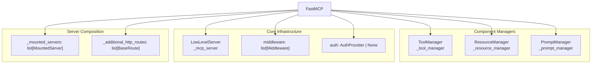
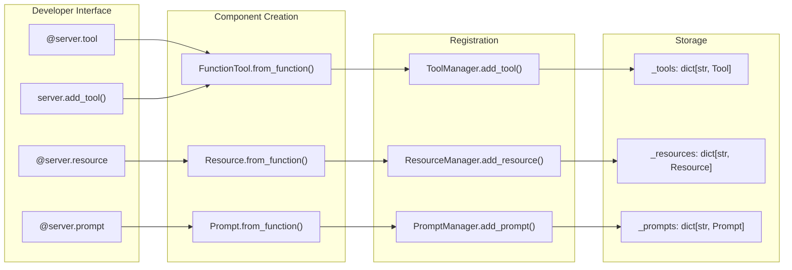
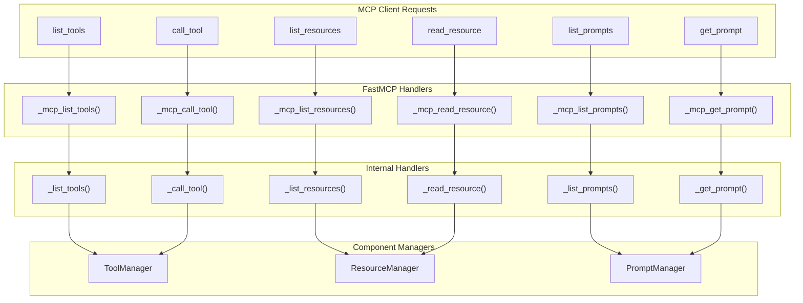
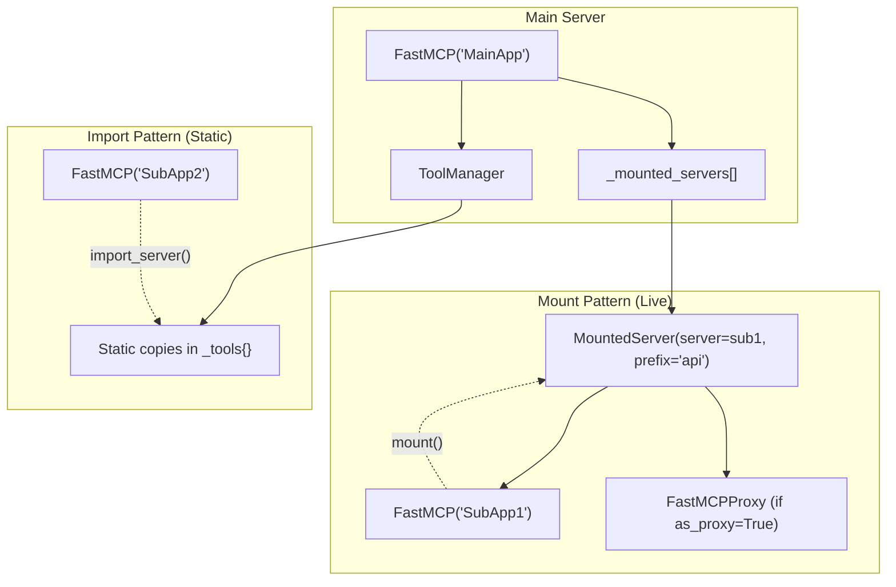
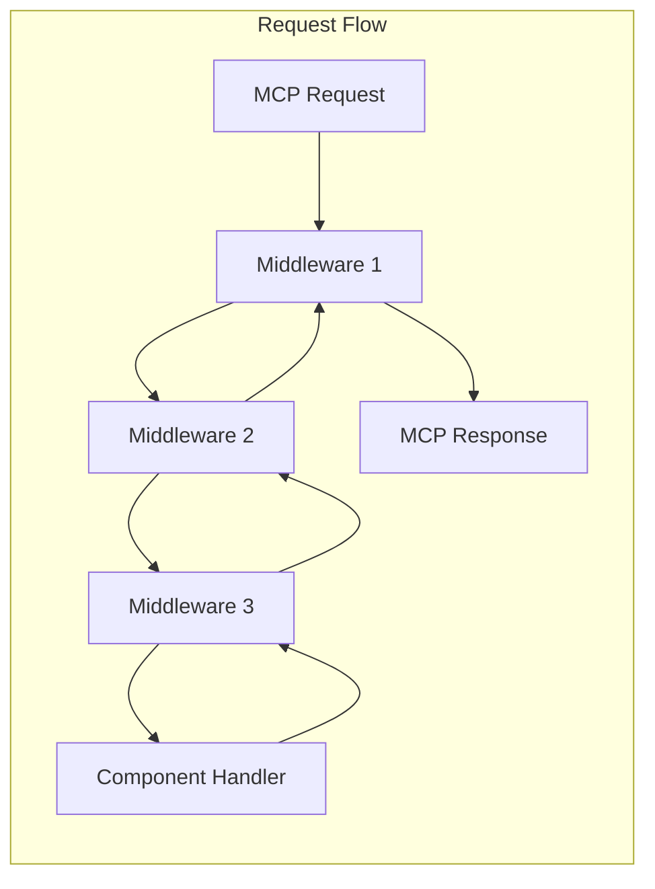
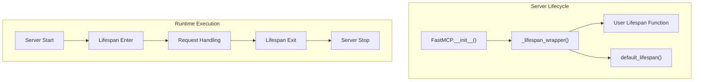
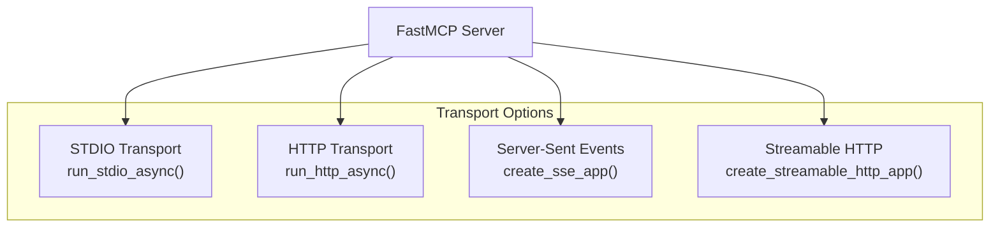

uv python install 3.10
uv sync --python 3.10
```

**Sources:** [.github/workflows/run-static.yml:44-50](), [pyproject.toml:20]()

# FastMCP Server Core


## Purpose and Scope

The FastMCP Server Core is the central orchestrating component of the FastMCP framework, implemented primarily in the `FastMCP` class. This document covers the core server architecture, component management, MCP protocol integration, server composition patterns, and lifecycle management. 

For information about individual component types (Tools, Resources, Prompts), see [Component System Architecture](#2.1). For client-side interaction with FastMCP servers, see [FastMCP Client System](#3). For HTTP deployment and authentication, see [HTTP Server and Deployment](#4).

## Core Server Architecture

The `FastMCP` class serves as the primary interface for creating MCP servers, providing a high-level, Pythonic API that wraps the low-level MCP protocol implementation.

### FastMCP Server Structure



The `FastMCP` class maintains three specialized managers for different component types, wraps a low-level MCP server for protocol handling, and supports server composition through mounting and importing.

**Sources:** [src/fastmcp/server/server.py:125-202](), [src/fastmcp/server/server.py:176-188]()

### Component Registration Flow



Component registration flows from high-level decorators through component creation to manager-specific storage dictionaries.

**Sources:** [src/fastmcp/server/server.py:858-881](), [src/fastmcp/server/server.py:945-1058](), [tests/server/test_server.py:141-151]()

## MCP Protocol Integration

FastMCP integrates with the Model Context Protocol by wrapping a `LowLevelServer` and implementing the required MCP handlers.

### Protocol Handler Architecture



The protocol integration uses a two-layer approach: MCP handlers that manage protocol specifics and internal handlers that apply middleware and delegate to component managers.

**Sources:** [src/fastmcp/server/server.py:387-396](), [src/fastmcp/server/server.py:522-533](), [src/fastmcp/server/server.py:701-727]()

### Handler Registration Process

During server initialization, the `_setup_handlers()` method registers protocol handlers with the underlying `LowLevelServer`:

| Handler Method | MCP Operation | Component Type |
|---|---|---|
| `_mcp_list_tools` | `tools/list` | Tools |
| `_mcp_call_tool` | `tools/call` | Tools |
| `_mcp_list_resources` | `resources/list` | Resources |
| `_mcp_read_resource` | `resources/read` | Resources |
| `_mcp_list_prompts` | `prompts/list` | Prompts |
| `_mcp_get_prompt` | `prompts/get` | Prompts |

**Sources:** [src/fastmcp/server/server.py:387-396]()

## Server Composition and Mounting

FastMCP supports two patterns for combining multiple servers: **mounting** (live delegation) and **importing** (static copying).

### Mount vs Import Architecture



Mounting creates live links to other servers, while importing creates static copies of components.

**Sources:** [src/fastmcp/server/server.py:175](), [tests/server/test_mount.py:19-47](), [tests/server/test_import_server.py:10-34]()

### Component Prefixing Behavior

When servers are mounted or imported with prefixes, component names are prefixed according to these patterns:

| Component Type | Prefix Format | Example |
|---|---|---|
| Tools | `{prefix}_{tool_name}` | `api_get_data` |
| Resources | `{protocol}://{prefix}/{path}` | `data://api/users` |
| Resource Templates | `{protocol}://{prefix}/{template}` | `users://api/{user_id}` |
| Prompts | `{prefix}_{prompt_name}` | `api_greeting` |

**Sources:** [src/fastmcp/server/server.py:1395-1420](), [tests/server/test_mount.py:978-1024]()

## Middleware System

FastMCP implements a middleware system that allows request processing to be modified through a chain of middleware functions.

### Middleware Execution Flow



Middleware functions receive a `MiddlewareContext` and a `call_next` function, allowing them to process requests before and after the main handler.

**Sources:** [src/fastmcp/server/server.py:397-406](), [src/fastmcp/server/server.py:553-564]()

### MiddlewareContext Structure

The `MiddlewareContext` provides access to:
- `message`: The MCP request parameters
- `source`: Request source ("client")
- `type`: Request type ("request") 
- `method`: MCP method name (e.g., "tools/call")
- `fastmcp_context`: Current FastMCP context object

**Sources:** [src/fastmcp/server/server.py:555-561]()

## Lifecycle Management

FastMCP servers support lifecycle management through lifespan context managers, similar to FastAPI applications.

### Lifespan Context Pattern



Lifespan functions allow setup and cleanup operations to be performed when servers start and stop.

**Sources:** [src/fastmcp/server/server.py:93-123](), [src/fastmcp/server/server.py:191-202]()

## Configuration and Settings

FastMCP server behavior is controlled through the global `Settings` object and constructor parameters.

### Key Configuration Areas

| Setting Category | Key Parameters | Purpose |
|---|---|---|
| Component Filtering | `include_tags`, `exclude_tags` | Control which components are exposed |
| Error Handling | `mask_error_details` | Control error information disclosure |
| Resource Prefixing | `resource_prefix_format` | Control URI prefixing behavior |
| Authentication | `server_auth` | Automatic auth provider configuration |
| Metadata | `include_fastmcp_meta` | Control FastMCP metadata inclusion |

**Sources:** [src/fastmcp/settings.py:293-333](), [src/fastmcp/server/server.py:126-169]()

### Component Enablement Logic

The `_should_enable_component()` method determines whether components are exposed based on:

1. Component `enabled` status
2. Global `include_tags` filtering (if any component tags match)
3. Global `exclude_tags` filtering (if any component tags match)

Components are enabled if they pass all filtering criteria.

**Sources:** [src/fastmcp/server/server.py:1507-1530]()

## Transport Integration

FastMCP servers can run over multiple transport protocols through the `run()` and `run_async()` methods.

### Supported Transports



The transport is selected via the `transport` parameter to `run()` or `run_async()`.

**Sources:** [src/fastmcp/server/server.py:336-364](), [src/fastmcp/server/server.py:1567-1583]()