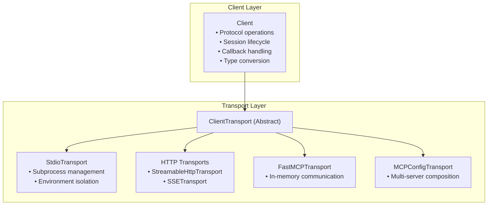
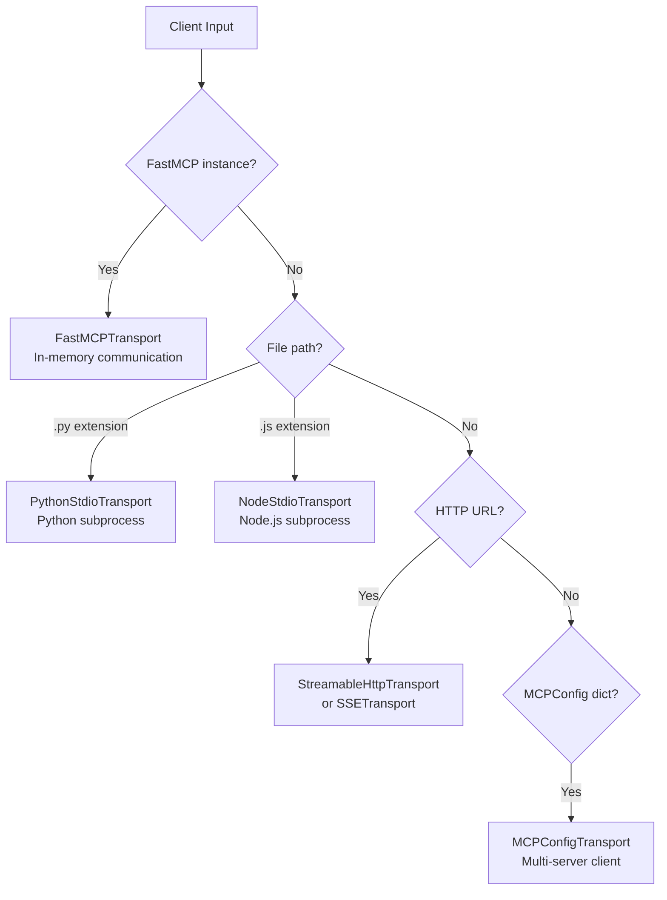
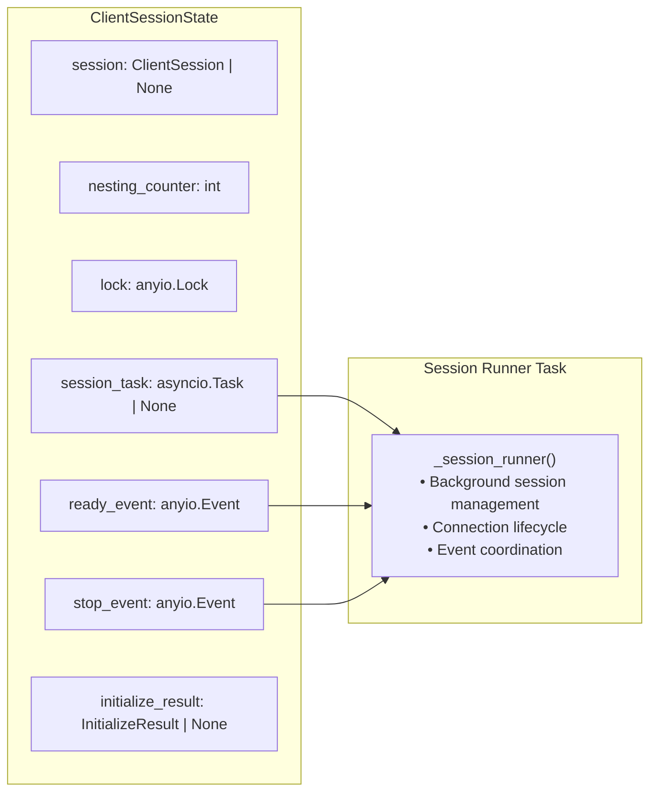
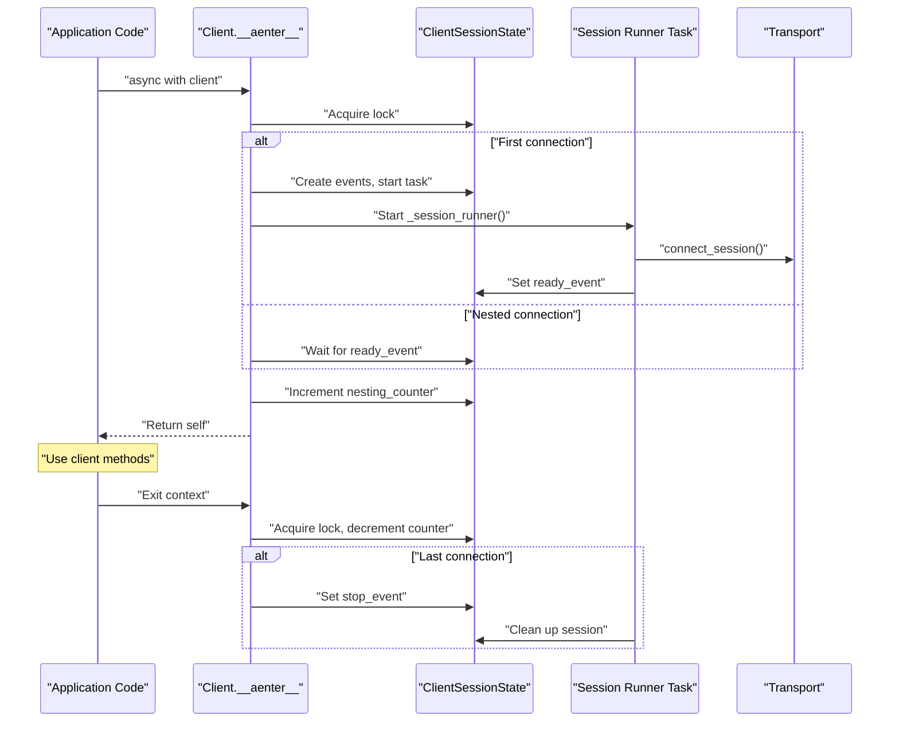
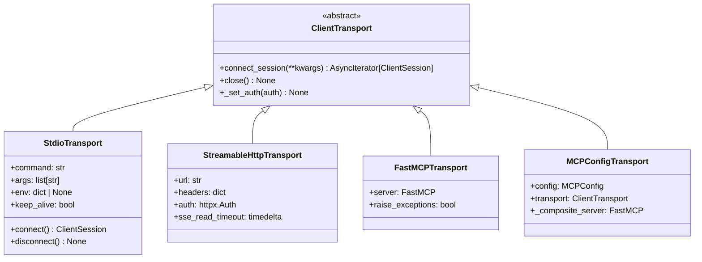
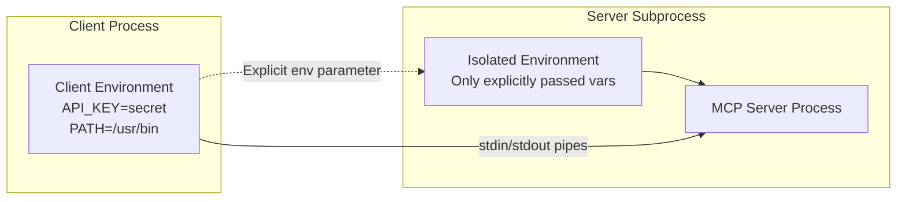
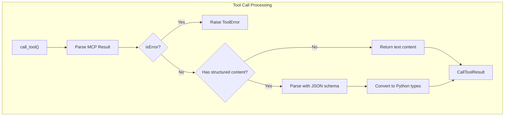
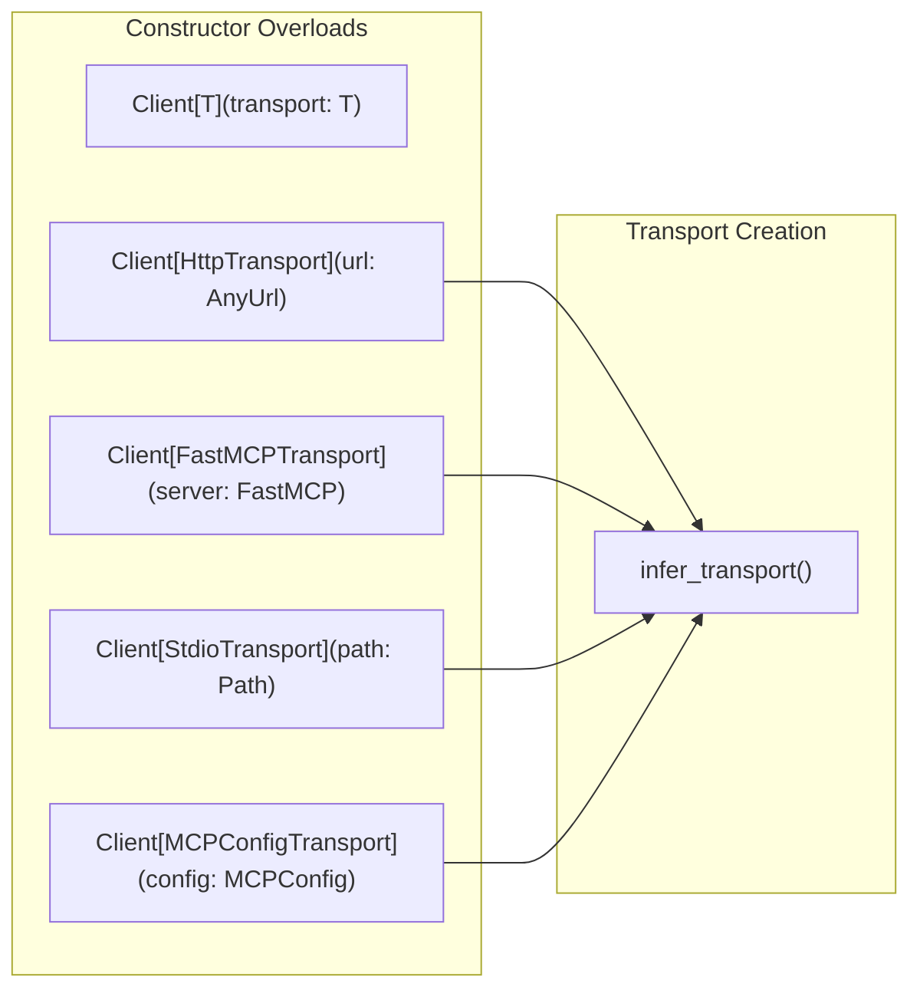
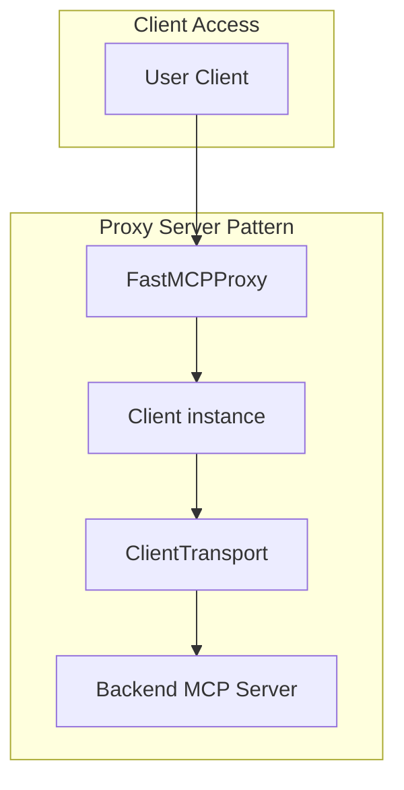
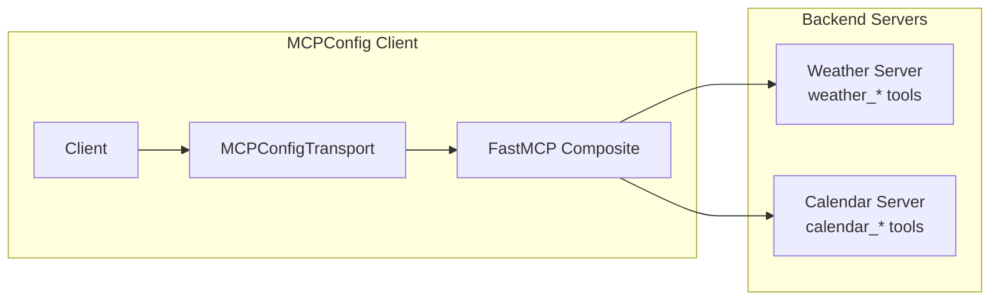

The FastMCP Client System provides a programmatic interface for interacting with Model Context Protocol (MCP) servers through a well-typed, Pythonic API. This system handles protocol operations, connection management, and session lifecycle while abstracting away transport-specific implementation details.

For information about creating and configuring MCP servers, see [FastMCP Server Core](#2). For details about HTTP server deployment and authentication, see [HTTP Server and Deployment](#6).

## Core Architecture

The FastMCP Client System implements a separation of concerns between protocol handling and connection management through two primary components:

| Component | Responsibility | Key Classes |
|-----------|----------------|-------------|
| **Client** | MCP protocol operations, session management, callback handling | `Client` |
| **Transport** | Connection establishment, communication channel management | `ClientTransport`, `SSETransport`, `StreamableHttpTransport`, `StdioTransport`, `FastMCPTransport` |

### Client-Transport Relationship

**Sources**: [src/fastmcp/client/client.py:90-149](), [src/fastmcp/client/transports.py:71-115]()

The `Client` class uses generic typing to preserve specific transport types, enabling transport-specific configuration while maintaining a consistent protocol interface.

### Transport Inference

The client automatically selects appropriate transports based on input type:

**Sources**: [src/fastmcp/client/transports.py:888-924](), [src/fastmcp/client/client.py:150-221]()

## Client Session Management

The `Client` implements a sophisticated session management system supporting reentrant context managers and concurrent usage patterns.

### Session State Architecture

**Sources**: [src/fastmcp/client/client.py:73-88](), [src/fastmcp/client/client.py:451-474]()

### Connection Lifecycle

The client manages connection lifecycle through reference counting and background session management:

**Sources**: [src/fastmcp/client/client.py:367-411](), [src/fastmcp/client/client.py:413-449]()

## Transport System

### Transport Interface

All transports implement the `ClientTransport` abstract base class:

**Sources**: [src/fastmcp/client/transports.py:71-115](), [src/fastmcp/client/transports.py:301-417]()

### STDIO Transport Environment Management

STDIO transports implement environment isolation for security:

**Sources**: [src/fastmcp/client/transports.py:301-417](), [src/fastmcp/client/transports.py:465-508]()

## Client Protocol Operations

The `Client` class provides methods for all MCP protocol operations, with both raw protocol and convenience variants:

### Tool Operations

| Method | Return Type | Description |
|--------|-------------|-------------|
| `list_tools()` | `list[mcp.types.Tool]` | List available tools |
| `list_tools_mcp()` | `mcp.types.ListToolsResult` | Raw MCP protocol result |
| `call_tool()` | `CallToolResult` | Execute tool with type conversion |
| `call_tool_mcp()` | `mcp.types.CallToolResult` | Raw MCP tool execution |

**Sources**: [src/fastmcp/client/client.py:763-895]()

### Resource Operations

| Method | Return Type | Description |
|--------|-------------|-------------|
| `list_resources()` | `list[mcp.types.Resource]` | List available resources |
| `list_resource_templates()` | `list[mcp.types.ResourceTemplate]` | List URI templates |
| `read_resource()` | `list[mcp.types.TextResourceContents \| BlobResourceContents]` | Read resource contents |

**Sources**: [src/fastmcp/client/client.py:525-636]()

### Prompt Operations

| Method | Return Type | Description |
|--------|-------------|-------------|
| `list_prompts()` | `list[mcp.types.Prompt]` | List available prompts |
| `get_prompt()` | `mcp.types.GetPromptResult` | Render prompt with arguments |

**Sources**: [src/fastmcp/client/client.py:639-716]()

### Tool Result Processing

The client provides structured result handling through the `CallToolResult` dataclass:

**Sources**: [src/fastmcp/client/client.py:826-894](), [src/fastmcp/client/client.py:897-903]()

## Client Configuration and Handlers

### Handler System

The client supports multiple callback handlers for server interactions:

| Handler Type | Purpose | Interface |
|--------------|---------|-----------|
| `LogHandler` | Process server log messages | `(LogMessage) -> Awaitable[None]` |
| `ProgressHandler` | Monitor operation progress | `(float, float?, str?) -> Awaitable[None]` |
| `SamplingHandler` | Respond to LLM sampling requests | Complex sampling interface |
| `RootsHandler` | Provide filesystem roots | `() -> RootsList` |

**Sources**: [src/fastmcp/client/client.py:210-267]()

### Client Factory Pattern

The client constructor uses overloaded signatures to support transport inference while maintaining type safety:

**Sources**: [src/fastmcp/client/client.py:150-221](), [src/fastmcp/client/transports.py:888-924]()

## Integration with Server Composition

The client system integrates with FastMCP's server composition patterns through several mechanisms:

### Proxy Client Usage

**Sources**: [docs/servers/proxy.mdx:278-329](), [examples/in_memory_proxy_example.py:40-50]()

### Multi-Server Configuration

The `MCPConfigTransport` enables single-client access to multiple servers through automatic composition:

**Sources**: [src/fastmcp/client/transports.py:817-887](), [docs/clients/client.mdx:124-142]()