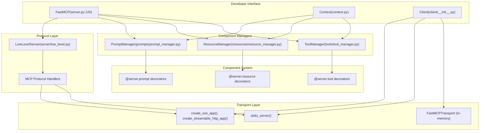

This document provides a high-level introduction to the FastMCP framework architecture, covering its core purpose, major system components, and how they work together to enable production-ready Model Context Protocol (MCP) applications.

For detailed server implementation patterns, see [FastMCP Server Core](#2). For client usage and transport mechanisms, see [FastMCP Client System](#3). For deployment and configuration specifics, see [Configuration Management](#7).

## What is FastMCP?

FastMCP is a comprehensive Python framework for building production-ready MCP servers and clients. The Model Context Protocol (MCP) is a standardized way to connect LLMs to tools and data sources, and FastMCP provides the infrastructure to make these connections robust, secure, and scalable.

At its core, FastMCP wraps the low-level MCP protocol with a high-level, Pythonic interface. The framework handles protocol details, authentication, deployment, and advanced patterns like server composition and proxying.

Sources: [src/fastmcp/server/server.py:1-84](), [README.md:37-54](), [docs/getting-started/welcome.mdx:21-57]()

## Core Architecture Overview

FastMCP follows a layered architecture with clear separation between the high-level developer interface, protocol implementation, and transport layers.

### FastMCP System Components



Sources: [src/fastmcp/server/server.py:125-266](), [src/fastmcp/__init__.py:15-20](), [src/fastmcp/server/low_level.py](), [src/fastmcp/tools/tool_manager.py](), [src/fastmcp/resources/resource_manager.py](), [src/fastmcp/prompts/prompt_manager.py]()

### Request Flow Architecture

```mermaid
graph LR
    subgraph "Client Request"
        ClientCall["client.call_tool()"]
        Transport["Transport Layer"]
    end
    
    subgraph "Server Processing"
        MCPHandlers["_mcp_call_tool(server.py:701)"]
        Middleware["_apply_middleware(server.py:397)"]
        ToolExecution["_call_tool(server.py:729)"]
        ComponentManager["ToolManager.call_tool()"]
        UserFunction["User @tool Function"]
    end
    
    subgraph "Response Path"
        ToolResult["ToolResult.to_mcp_result()"]
        MCPResponse["MCP Protocol Response"]
        ClientResponse["Client receives result"]
    end
    
    ClientCall --> Transport
    Transport --> MCPHandlers
    MCPHandlers --> Middleware
    Middleware --> ToolExecution
    ToolExecution --> ComponentManager
    ComponentManager --> UserFunction
    
    UserFunction --> ToolResult
    ToolResult --> MCPResponse
    MCPResponse --> ClientResponse
```



Sources: [src/fastmcp/server/server.py:701-752](), [src/fastmcp/server/server.py:397-406](), [src/fastmcp/tools/tool_manager.py]()

## FastMCP Server Components

The `FastMCP` class serves as the central orchestrator, managing three core component types and their lifecycle.

### Component Manager System

| Component | Manager Class | Decorator | Key Methods |
|-----------|---------------|-----------|-------------|
| Tools | `ToolManager` | `@server.tool` | `add_tool()`, `call_tool()` |
| Resources | `ResourceManager` | `@server.resource` | `add_resource()`, `read_resource()` |
| Prompts | `PromptManager` | `@server.prompt` | `add_prompt()`, `render_prompt()` |

The server initializes these managers in its constructor:

```python