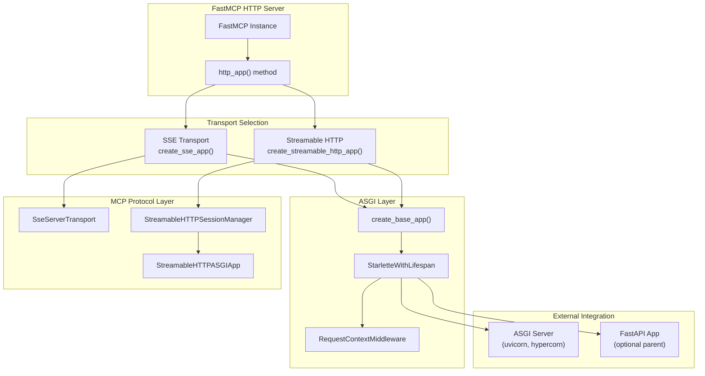
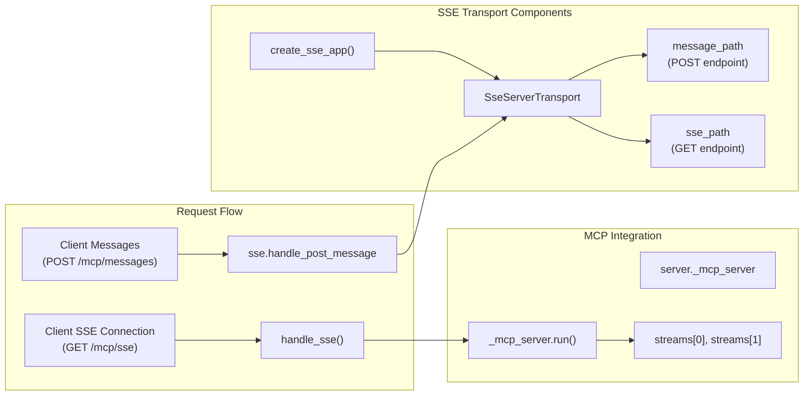
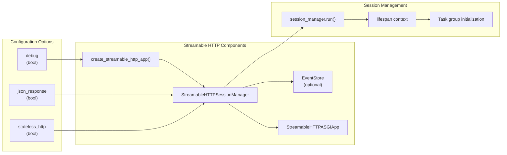
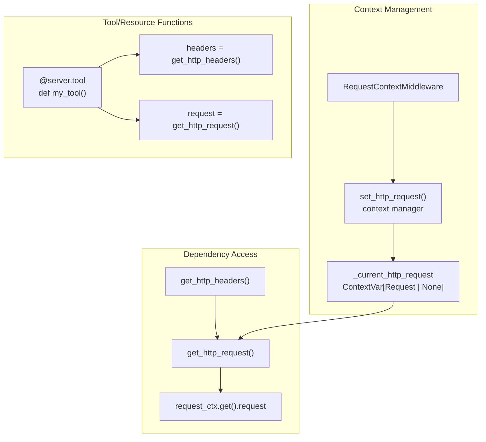
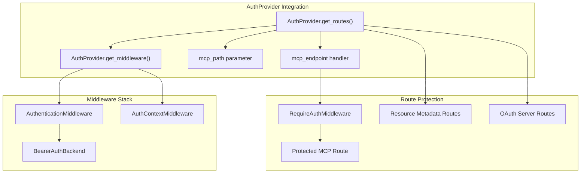
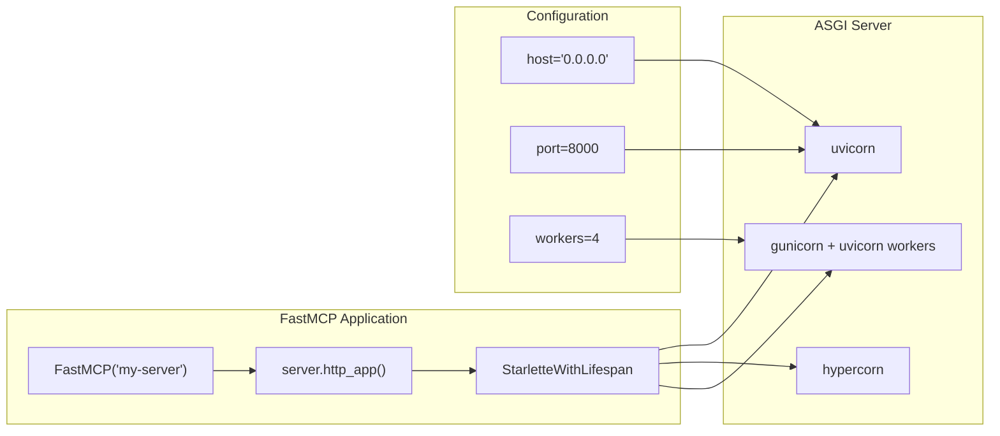
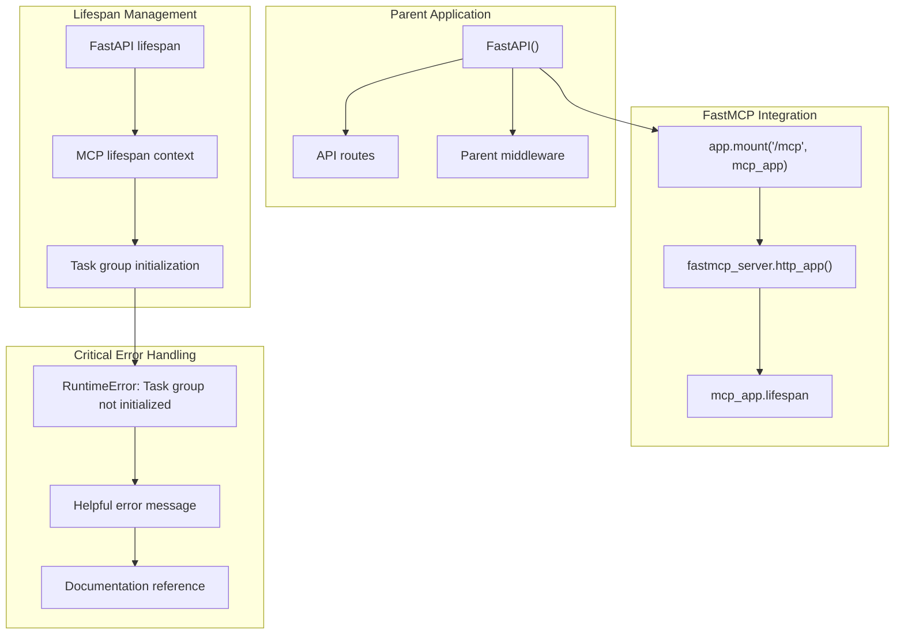
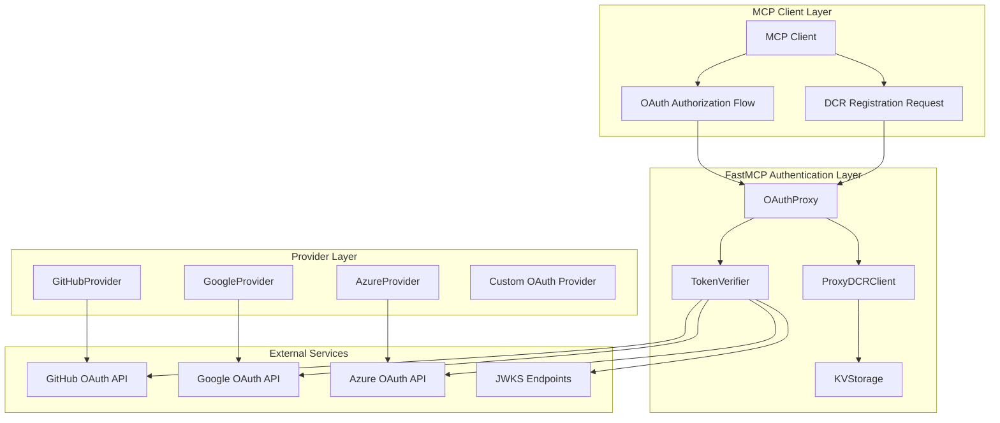
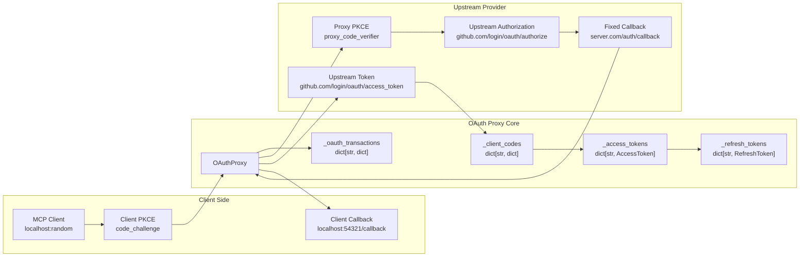
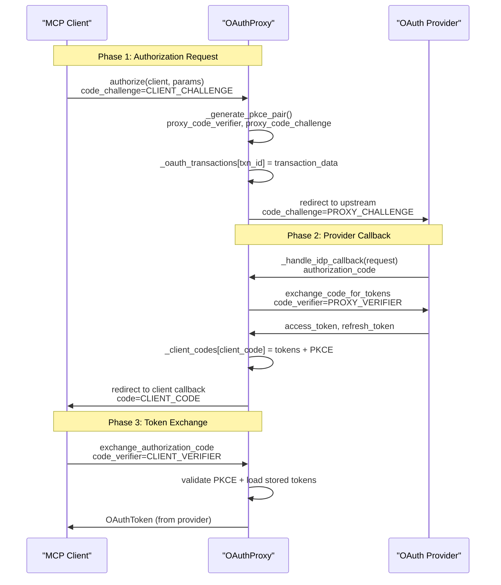

This page covers the HTTP server architecture and deployment patterns in FastMCP. It explains how FastMCP servers expose MCP protocols over HTTP using Starlette/ASGI applications, including support for Server-Sent Events (SSE) and Streamable HTTP transports. For client-side HTTP communication, see [Transport Mechanisms](#3.1). For authentication and security configuration, see [Authentication and Security](#4.1).

## HTTP Server Architecture

FastMCP provides HTTP server functionality through ASGI applications built on Starlette. The system supports two primary HTTP transport mechanisms for the MCP protocol: SSE (Server-Sent Events) and Streamable HTTP.



Sources: [src/fastmcp/server/http.py:98-123](), [src/fastmcp/server/http.py:126-228](), [src/fastmcp/server/http.py:231-321]()

## Transport Mechanisms

### SSE (Server-Sent Events) Transport

SSE transport provides real-time bidirectional communication using Server-Sent Events for server-to-client messages and HTTP POST for client-to-server messages.



Sources: [src/fastmcp/server/http.py:126-228](), [src/fastmcp/server/http.py:152-163]()

### Streamable HTTP Transport

Streamable HTTP transport provides session-based communication over standard HTTP requests with optional JSON response formatting.



Sources: [src/fastmcp/server/http.py:231-321](), [src/fastmcp/server/http.py:261-267](), [src/fastmcp/server/http.py:304-314]()

## ASGI Application Structure

### Base Application Factory

The `create_base_app()` function creates the foundational Starlette application with common middleware and routing.

| Component | Purpose | Implementation |
|-----------|---------|----------------|
| `StarletteWithLifespan` | Extended Starlette app with lifespan property | [src/fastmcp/server/http.py:67-71]() |
| `RequestContextMiddleware` | Stores HTTP request in context variable | [src/fastmcp/server/http.py:82-95]() |
| Route configuration | Custom routes with MCP endpoints | [src/fastmcp/server/http.py:98-123]() |
| Middleware stack | Authentication and custom middleware | [src/fastmcp/server/http.py:115-116]() |

### Request Context System

FastMCP maintains HTTP request context through context variables for dependency injection in tools and resources.



Sources: [src/fastmcp/server/http.py:61-79](), [src/fastmcp/server/dependencies.py:42-53](), [src/fastmcp/server/dependencies.py:56-99]()

## Authentication Integration

### Auth Provider Routes

Authentication providers integrate with HTTP apps through route and middleware systems.



Sources: [src/fastmcp/server/auth/auth.py:81-119](), [src/fastmcp/server/auth/auth.py:121-133](), [src/fastmcp/server/http.py:166-189]()

### Route Configuration with Authentication

| Auth Type | Route Creation | Middleware | Protected Endpoints |
|-----------|---------------|------------|-------------------|
| No Auth | Direct route creation | `RequestContextMiddleware` only | None |
| `TokenVerifier` | Base routes + protected MCP | `BearerAuthBackend` + `AuthContextMiddleware` | MCP endpoint |
| `RemoteAuthProvider` | Protected resource metadata | Same as TokenVerifier | MCP + metadata endpoints |
| `OAuthProvider` | Full OAuth server routes | Same as TokenVerifier | All OAuth + MCP endpoints |

Sources: [src/fastmcp/server/http.py:190-207](), [src/fastmcp/server/http.py:273-284](), [src/fastmcp/server/auth/auth.py:225-252]()

## Deployment Patterns

### Standalone ASGI Deployment

FastMCP HTTP apps can be deployed directly with ASGI servers:



### Parent ASGI Application Integration

FastMCP apps can be mounted within larger ASGI applications like FastAPI:



Sources: [src/fastmcp/server/http.py:29-58](), [src/fastmcp/server/http.py:304-314]()

## Error Handling and Diagnostics

### Streamable HTTP Task Group Error

The `StreamableHTTPASGIApp` provides detailed error messages for common deployment issues:

| Error Condition | Root Cause | Error Message | Solution |
|----------------|------------|---------------|----------|
| Task group not initialized | Parent app doesn't use MCP lifespan | "FastMCP's StreamableHTTPSessionManager task group was not initialized" | Set `lifespan=mcp_app.lifespan` in parent app |
| Runtime error during request | MCP library internal error | Original error message preserved | Check MCP library documentation |
| General ASGI errors | Various deployment issues | Standard ASGI error handling | Review ASGI server logs |

Sources: [src/fastmcp/server/http.py:35-58]()

### Request Context Errors

| Function | Error Condition | Exception | Solution |
|----------|----------------|-----------|----------|
| `get_http_request()` | No active HTTP request | `RuntimeError` | Ensure called within HTTP request context |
| `get_http_headers()` | No active HTTP request | Returns empty dict | Check for HTTP context before using headers |
| `get_context()` | No active FastMCP context | `RuntimeError` | Ensure called within FastMCP tool/resource |

Sources: [src/fastmcp/server/dependencies.py:42-53](), [src/fastmcp/server/dependencies.py:56-99](), [src/fastmcp/server/dependencies.py:30-36]()

# Authentication and Security


This document covers FastMCP's comprehensive authentication and security system, including OAuth integration, token verification, and security mechanisms. The system enables FastMCP servers to authenticate with traditional OAuth providers (GitHub, Google, Azure, etc.) while maintaining compatibility with MCP's Dynamic Client Registration requirements.

For HTTP server deployment patterns, see [HTTP Server and Deployment](#4). For middleware-based security features like rate limiting and request validation, see [Middleware System](#4.2).

## Architecture Overview

FastMCP's authentication system centers around the **OAuth Proxy** pattern, which bridges the gap between traditional OAuth providers (that require pre-registered applications) and MCP clients (that expect Dynamic Client Registration). The system consists of several key components working together to provide secure, transparent authentication.

### Core Authentication Flow



Sources: [src/fastmcp/server/auth/oauth_proxy.py:125-231](), [src/fastmcp/server/auth/providers/github.py:167-193](), [src/fastmcp/server/auth/providers/google.py:183-209]()

## OAuth Proxy System

The `OAuthProxy` class is the cornerstone of FastMCP's authentication system, implementing a transparent proxy that presents a DCR-compliant interface to MCP clients while using pre-registered credentials with upstream OAuth providers.

### OAuth Proxy Architecture



Sources: [src/fastmcp/server/auth/oauth_proxy.py:125-371](), [src/fastmcp/server/auth/oauth_proxy.py:464-559]()

### Dynamic Client Registration Implementation

The proxy implements local DCR through the `ProxyDCRClient` class, which validates redirect URIs against configurable patterns while maintaining compatibility with upstream providers that only accept fixed redirect URIs.

```mermaid
graph TB
    subgraph "DCR Registration Flow"
        ClientRegister["`register_client()`<br/>OAuthClientInformationFull"]
        ProxyDCRClient["`ProxyDCRClient`<br/>allowed_redirect_uri_patterns"]
        ClientStorage["`_client_storage`<br/>JSONFileStorage"]
        RedirectValidation["`validate_redirect_uri()`<br/>Pattern Matching"]
    end
    
    subgraph "Storage Structure"
        StorageData["`storage_data`<br/>client: ProxyDCRClient<br/>allowed_redirect_uri_patterns"]
        FileSystem["`~/.fastmcp/oauth-proxy-clients/`<br/>client_id.json"]
    end
    
    ClientRegister --> ProxyDCRClient
    ProxyDCRClient --> RedirectValidation
    RedirectValidation --> StorageData
    StorageData --> ClientStorage
    ClientStorage --> FileSystem
```

Sources: [src/fastmcp/server/auth/oauth_proxy.py:60-115](), [src/fastmcp/server/auth/oauth_proxy.py:396-459]()

### Authorization Code Exchange

The proxy implements a dual-layer authorization flow that maintains security while bridging DCR requirements with traditional OAuth constraints.



Sources: [src/fastmcp/server/auth/oauth_proxy.py:464-669](), [src/fastmcp/server/auth/oauth_proxy.py:876-1061]()

## Token Verification System

FastMCP supports multiple token verification strategies through the `TokenVerifier` base class and provider-specific implementations that handle different token formats and validation mechanisms.

### Token Verifier Architecture

```mermaid
graph TB
    subgraph "Token Verifier Hierarchy"
        TokenVerifier["`TokenVerifier`<br/>required_scopes: list[str]<br/>verify_token(token) -> AccessToken"]
        
        JWTVerifier["`JWTVerifier`<br/>jwks_uri: str<br/>issuer: str<br/>algorithm: str"]
        
        GitHubTokenVerifier["`GitHubTokenVerifier`<br/>api.github.com/user<br/>X-OAuth-Scopes header"]
        
        GoogleTokenVerifier["`GoogleTokenVerifier`<br/>googleapis.com/oauth2/v1/tokeninfo<br/>userinfo endpoint"]
        
        AzureTokenVerifier["`AzureTokenVerifier`<br/>graph.microsoft.com/v1.0/me<br/>Graph API validation"]
        
        WorkOSTokenVerifier["`WorkOSTokenVerifier`<br/>authkit.app/oauth2/userinfo<br/>AuthKit validation"]
    end
    
    subgraph "Verification Methods"
        JWKSValidation["`JWKS Signature Validation`<br/>RS256, HS256<br/>Cryptographic verification"]
        
        APIValidation["`API Endpoint Validation`<br/>HTTP calls to provider<br/>Opaque token validation"]
        
        UserInfoExtraction["`User Info Extraction`<br/>Claims mapping<br/>Scope validation"]
    end
    
    TokenVerifier --> JWTVerifier
    TokenVerifier --> GitHubTokenVerifier  
    TokenVerifier --> GoogleTokenVerifier
    TokenVerifier --> AzureTokenVerifier
    TokenVerifier --> WorkOSTokenVerifier
    
    JWTVerifier --> JWKSValidation
    GitHubTokenVerifier --> APIValidation
    GoogleTokenVerifier --> APIValidation
    AzureTokenVerifier --> APIValidation
    WorkOSTokenVerifier --> APIValidation
    
    JWKSValidation --> UserInfoExtraction
    APIValidation --> UserInfoExtraction
```

Sources: [src/fastmcp/server/auth/providers/jwt.py:1-200](), [src/fastmcp/server/auth/providers/github.py:62-165](), [src/fastmcp/server/auth/providers/google.py:64-181]()

### Access Token Structure

The `AccessToken` class provides a unified representation of validated tokens across all providers:

```mermaid
graph LR
    subgraph "AccessToken Components"
        AccessToken["`AccessToken`<br/>token: str<br/>client_id: str<br/>scopes: list[str]<br/>expires_at: int | None<br/>claims: dict[str, Any]"]
        
        Claims["`claims`<br/>sub: user_id<br/>email: str<br/>name: str<br/>provider_specific_data"]
        
        Scopes["`scopes`<br/>Validated against<br/>required_scopes"]
    end
    
    subgraph "Provider Mapping"
        GitHubClaims["`GitHub Claims`<br/>github_user_data<br/>login, avatar_url"]
        
        GoogleClaims["`Google Claims`<br/>google_user_data<br/>picture, locale"]
        
        AzureClaims["`Azure Claims`<br/>job_title<br/>office_location"]
    end
    
    AccessToken --> Claims
    AccessToken --> Scopes
    Claims --> GitHubClaims
    Claims --> GoogleClaims  
    Claims --> AzureClaims
```

Sources: [src/fastmcp/server/auth/auth.py:50-85](), [src/fastmcp/server/auth/providers/github.py:144-157](), [src/fastmcp/server/auth/providers/google.py:152-173]()

## Built-in Provider Implementations

FastMCP includes ready-to-use provider implementations for major OAuth services, each handling provider-specific requirements and token formats.

### Provider Class Hierarchy

```mermaid
graph TB
    subgraph "Provider Base Classes"
        OAuthProxy["`OAuthProxy`<br/>DCR-compliant proxy<br/>PKCE forwarding<br/>Callback handling"]
        
        RemoteAuthProvider["`RemoteAuthProvider`<br/>Metadata forwarding<br/>Authorization server delegation"]
    end
    
    subgraph "OAuth Proxy Providers"
        GitHubProvider["`GitHubProvider`<br/>github.com/login/oauth/*<br/>GitHubTokenVerifier"]
        
        GoogleProvider["`GoogleProvider`<br/>accounts.google.com/o/oauth2/*<br/>GoogleTokenVerifier"]
        
        AzureProvider["`AzureProvider`<br/>login.microsoftonline.com/{tenant}/*<br/>AzureTokenVerifier"]
        
        WorkOSProvider["`WorkOSProvider`<br/>{domain}.authkit.app/oauth2/*<br/>WorkOSTokenVerifier"]
    end
    
    subgraph "DCR Providers"
        AuthKitProvider["`AuthKitProvider`<br/>WorkOS DCR support<br/>Metadata forwarding"]
    end
    
    subgraph "Configuration"
        ProviderSettings["`*ProviderSettings`<br/>Environment variables<br/>FASTMCP_SERVER_AUTH_*"]
        
        NotSetPattern["`NotSet / NotSetT`<br/>Parameter/environment fallback<br/>Validation pattern"]
    end
    
    OAuthProxy --> GitHubProvider
    OAuthProxy --> GoogleProvider
    OAuthProxy --> AzureProvider
    OAuthProxy --> WorkOSProvider
    
    RemoteAuthProvider --> AuthKitProvider
    
    GitHubProvider --> ProviderSettings
    GoogleProvider --> ProviderSettings
    AzureProvider --> ProviderSettings
    WorkOSProvider --> ProviderSettings
    
    ProviderSettings --> NotSetPattern
```

Sources: [src/fastmcp/server/auth/providers/github.py:167-284](), [src/fastmcp/server/auth/providers/google.py:183-303](), [src/fastmcp/server/auth/providers/azure.py:118-266](), [src/fastmcp/server/auth/providers/workos.py:128-262]()

## Security Features

FastMCP implements multiple layers of security to protect OAuth flows and ensure secure token handling.

### PKCE (Proof Key for Code Exchange)

The proxy implements dual-layer PKCE protection, maintaining security between client-to-proxy and proxy-to-provider connections:

```mermaid
graph LR
    subgraph "Client PKCE Layer"
        ClientVerifier["`client_code_verifier`<br/>Generated by MCP client"]
        ClientChallenge["`client_code_challenge`<br/>SHA256(verifier) + base64url"]
        ClientValidation["`PKCE Validation`<br/>MCP framework validates<br/>client's PKCE"]
    end
    
    subgraph "Proxy PKCE Layer"  
        ProxyVerifier["`proxy_code_verifier`<br/>_generate_pkce_pair()"]
        ProxyChallenge["`proxy_code_challenge`<br/>S256 method<br/>Sent to upstream"]
        ProxyValidation["`Upstream Validation`<br/>Provider validates<br/>proxy's PKCE"]
    end
    
    subgraph "Transaction Storage"
        TransactionData["`_oauth_transactions[txn_id]`<br/>code_challenge: client<br/>proxy_code_verifier: proxy"]
    end
    
    ClientVerifier --> ClientChallenge
    ClientChallenge --> ClientValidation
    
    ProxyVerifier --> ProxyChallenge  
    ProxyChallenge --> ProxyValidation
    
    ClientChallenge --> TransactionData
    ProxyVerifier --> TransactionData
```

Sources: [src/fastmcp/server/auth/oauth_proxy.py:377-391](), [src/fastmcp/server/auth/oauth_proxy.py:481-530]()

### Redirect URI Validation

The `ProxyDCRClient` class implements configurable redirect URI validation to prevent authorization code interception while maintaining DCR compatibility:

```mermaid
graph TB
    subgraph "Redirect URI Patterns"
        AllowedPatterns["`allowed_client_redirect_uris`<br/>['http://localhost:*']<br/>['https://*.example.com/*']"]
        
        DefaultPatterns["`Default: None`<br/>All URIs allowed<br/>(DCR compatibility)"]
        
        RestrictivePatterns["`Empty list: []`<br/>No URIs allowed<br/>(Maximum security)"]
    end
    
    subgraph "Validation Logic"
        ValidateRedirectURI["`validate_redirect_uri()`<br/>Pattern matching<br/>Wildcard support"]
        
        PatternMatch["`validate_redirect_uri()`<br/>from redirect_validation<br/>Glob-style patterns"]
        
        FallbackValidation["`super().validate_redirect_uri()`<br/>Standard OAuth validation"]
    end
    
    AllowedPatterns --> ValidateRedirectURI
    DefaultPatterns --> ValidateRedirectURI
    RestrictivePatterns --> ValidateRedirectURI
    
    ValidateRedirectURI --> PatternMatch
    PatternMatch --> FallbackValidation
```

Sources: [src/fastmcp/server/auth/oauth_proxy.py:60-115](), [src/fastmcp/server/auth/redirect_validation.py:1-50]()

### Token Management and Revocation

The proxy maintains comprehensive token lifecycle management with cleanup and revocation capabilities:

```mermaid
graph LR
    subgraph "Token Storage"
        AccessTokenStorage["`_access_tokens`<br/>dict[str, AccessToken]<br/>Token tracking"]
        
        RefreshTokenStorage["`_refresh_tokens`<br/>dict[str, RefreshToken]<br/>Refresh tracking"]
        
        TokenRelations["`_access_to_refresh`<br/>`_refresh_to_access`<br/>Bidirectional mapping"]
    end
    
    subgraph "Token Operations"
        TokenRevocation["`revoke_token()`<br/>Local cleanup<br/>Upstream revocation"]
        
        TokenRefresh["`exchange_refresh_token()`<br/>AsyncOAuth2Client<br/>authlib integration"]
        
        TokenValidation["`load_access_token()`<br/>Delegate to TokenVerifier<br/>JWKS or API validation"]
    end
    
    subgraph "Cleanup Mechanisms"
        LocalCleanup["`Local Storage Cleanup`<br/>Remove paired tokens<br/>Maintain consistency"]
        
        UpstreamRevocation["`Upstream Revocation`<br/>HTTP POST to<br/>revocation_endpoint"]
        
        ExpirationHandling["`Expiration Handling`<br/>expires_at checking<br/>Automatic cleanup"]
    end
    
    AccessTokenStorage --> TokenRevocation
    RefreshTokenStorage --> TokenRevocation
    TokenRelations --> TokenRevocation
    
    TokenRevocation --> LocalCleanup
    TokenRevocation --> UpstreamRevocation
    TokenValidation --> ExpirationHandling
```

Sources: [src/fastmcp/server/auth/oauth_proxy.py:775-818](), [src/fastmcp/server/auth/oauth_proxy.py:674-753]()

## Storage and Persistence

FastMCP provides pluggable storage backends for persisting OAuth client registrations and maintaining session state across server restarts.

### Storage Architecture

```mermaid
graph TB
    subgraph "Storage Interface"
        KVStorage["`KVStorage Protocol`<br/>get(key) -> dict | None<br/>set(key, value)<br/>delete(key)"]
    end
    
    subgraph "File-Based Storage"
        JSONFileStorage["`JSONFileStorage`<br/>~/.fastmcp/oauth-proxy-clients/<br/>Automatic metadata<br/>timestamp tracking"]
        
        FileStructure["`File Structure`<br/>{client_id}.json<br/>data: client_info<br/>timestamp: float"]
        
        SafeKeys["`_get_safe_key()`<br/>Filesystem-safe naming<br/>Character sanitization"]
    end
    
    subgraph "In-Memory Storage"
        InMemoryStorage["`InMemoryStorage`<br/>_data: dict[str, dict]<br/>Testing/temporary use"]
    end
    
    subgraph "Storage Operations"
        MetadataWrapping["`Metadata Wrapping`<br/>timestamp: creation_time<br/>data: actual_payload"]
        
        CleanupOperations["`cleanup_old_entries()`<br/>Age-based removal<br/>30-day default TTL"]
    end
    
    KVStorage --> JSONFileStorage
    KVStorage --> InMemoryStorage
    
    JSONFileStorage --> FileStructure
    JSONFileStorage --> SafeKeys
    JSONFileStorage --> MetadataWrapping
    JSONFileStorage --> CleanupOperations
    
    InMemoryStorage --> MetadataWrapping
```

Sources: [src/fastmcp/utilities/storage.py:16-205](), [src/fastmcp/server/auth/oauth_proxy.py:345-349]()

The authentication system provides a robust, secure foundation for FastMCP servers while maintaining compatibility with both traditional OAuth providers and MCP's Dynamic Client Registration requirements. The modular design allows for easy extension with new providers and verification methods as needed.