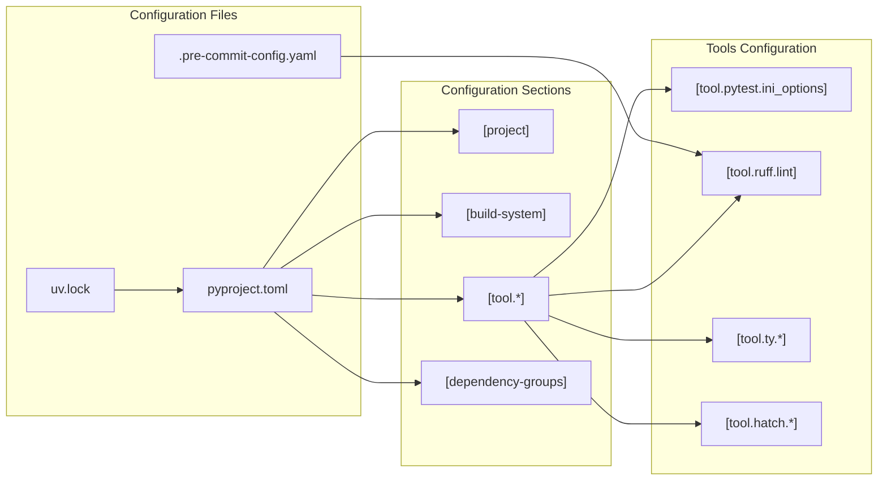
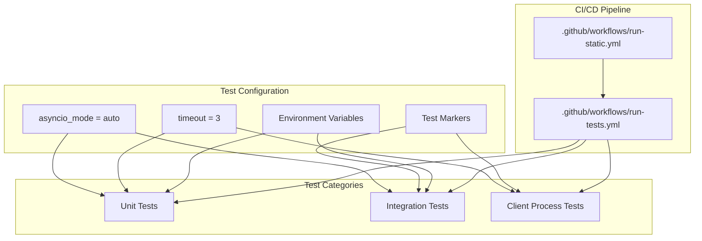

uv sync --frozen
```

### Development Installation

For development work, install with development dependencies:

```bash
# Install with development dependencies
uv sync

# Install pre-commit hooks
uv run pre-commit install
```

**Sources:** [.github/workflows/run-tests.yml:46-48](), [pyproject.toml:47-71]()

## Dependency Architecture

The following diagram shows the core dependency structure and how packages map to FastMCP functionality:

```mermaid
graph TB
    subgraph "Core Dependencies"
        mcp["mcp>=1.12.4,<2.0.0"]
        httpx["httpx>=0.28.1"]
        pydantic["pydantic[email]>=2.11.7"]
        authlib["authlib>=1.5.2"]
    end
    
    subgraph "Optional Dependencies"
        websockets["websockets>=15.0.1"]
        openai["openai>=1.102.0"]
    end
    
    subgraph "Development Dependencies"
        pytest["pytest>=8.3.3"]
        ruff["ruff"]
        precommit["pre-commit"]
        tycheck["ty>=0.0.1a19"]
    end
    
    subgraph "Utility Dependencies"
        rich["rich>=13.9.4"]
        cyclopts["cyclopts>=3.0.0"]
        dotenv["python-dotenv>=1.1.0"]
        pyperclip["pyperclip>=1.9.0"]
    end
    
    subgraph "FastMCP Components"
        server["FastMCP Server"]
        client["FastMCP Client"]
        cli["fastmcp CLI"]
        auth["Authentication System"]
    end
    
    mcp --> server
    mcp --> client
    httpx --> client
    httpx --> server
    pydantic --> server
    authlib --> auth
    websockets --> server
    openai --> client
    rich --> cli
    cyclopts --> cli
    dotenv --> server
    pyperclip --> cli
    
    pytest --> server
    pytest --> client
    ruff --> server
    ruff --> client
    precommit --> server
    precommit --> client
    tycheck --> server
    tycheck --> client
```



**Sources:** [pyproject.toml:6-18](), [pyproject.toml:43-46](), [pyproject.toml:47-71]()

## Project Configuration Files

FastMCP uses several configuration files for different aspects of the development and runtime environment:

### Build and Dependency Configuration



**Sources:** [pyproject.toml:1-143](), [uv.lock:1-8](), [.pre-commit-config.yaml:1-42]()

### CLI Script Configuration

The `fastmcp` command-line interface is configured as an entry point script:

| Configuration | Value | Purpose |
|---------------|-------|---------|
| Script name | `fastmcp` | CLI command name |
| Entry point | `fastmcp.cli:app` | Module and function path |
| Dependencies | `cyclopts>=3.0.0`, `rich>=13.9.4` | CLI framework and output formatting |

**Sources:** [pyproject.toml:73-74](), [pyproject.toml:12-13]()

## Environment Setup

### Environment Variables

FastMCP supports several environment variables for configuration:

| Variable | Purpose | Default |
|----------|---------|---------|
| `FASTMCP_TEST_MODE` | Enable test mode | `0` |
| `FASTMCP_LOG_LEVEL` | Set logging level | `INFO` |
| `FASTMCP_ENABLE_RICH_TRACEBACKS` | Enable rich error formatting | `1` |

### Testing Environment

The testing environment is configured with specific settings:



**Sources:** [pyproject.toml:98-119](), [.github/workflows/run-tests.yml:25-82](), [.github/workflows/run-static.yml:26-55]()

## Authentication Setup

For development and testing with authentication providers, additional environment variables are required:

### GitHub OAuth Configuration

| Variable | Purpose | Required For |
|----------|---------|--------------|
| `FASTMCP_GITHUB_TOKEN` | GitHub API access | GitHub integrations |
| `FASTMCP_TEST_AUTH_GITHUB_CLIENT_ID` | OAuth client ID | GitHub auth testing |
| `FASTMCP_TEST_AUTH_GITHUB_CLIENT_SECRET` | OAuth client secret | GitHub auth testing |

**Sources:** [tests/integration_tests/auth/test_github_provider_integration.py:25-28](), [.github/workflows/run-tests.yml:79-81]()

## Installation Verification

After installation, verify the setup using these commands:

### Basic Verification

```bash
# Check FastMCP CLI is available
uv run fastmcp --help

# Run unit tests
uv run pytest -v tests -m "not integration and not client_process"

# Run static analysis
uv run pre-commit run --all-files
```

### Development Environment Verification

```bash