The FastMCP middleware system provides a flexible framework for intercepting, monitoring, and modifying MCP message processing. This system allows developers to add cross-cutting concerns like logging, timing, error handling, and rate limiting without modifying core server logic.

This document covers the middleware architecture, built-in middleware implementations, and patterns for creating custom middleware. For authentication-specific middleware functionality, see [Authentication and Security](#4.1). For HTTP server deployment patterns, see [HTTP Server and Deployment](#4).

## Core Middleware Architecture

The middleware system is built around a pipeline pattern where each middleware can inspect, modify, or handle MCP messages before passing control to the next middleware in the chain.

### Middleware Pipeline Flow

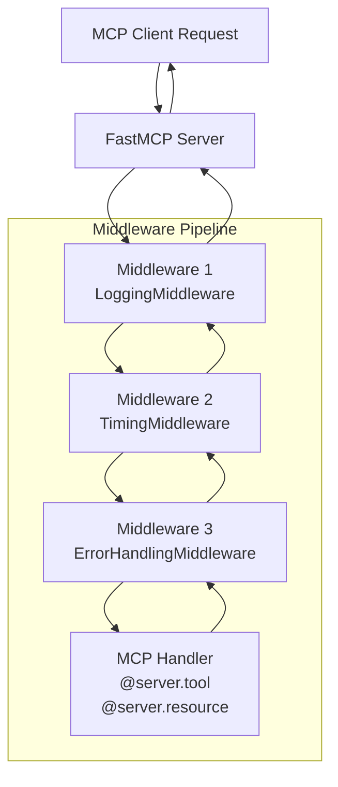

Sources: [src/fastmcp/server/middleware/middleware.py:1-200](), [tests/server/middleware/test_logging.py:506-775]()

### Core Middleware Components

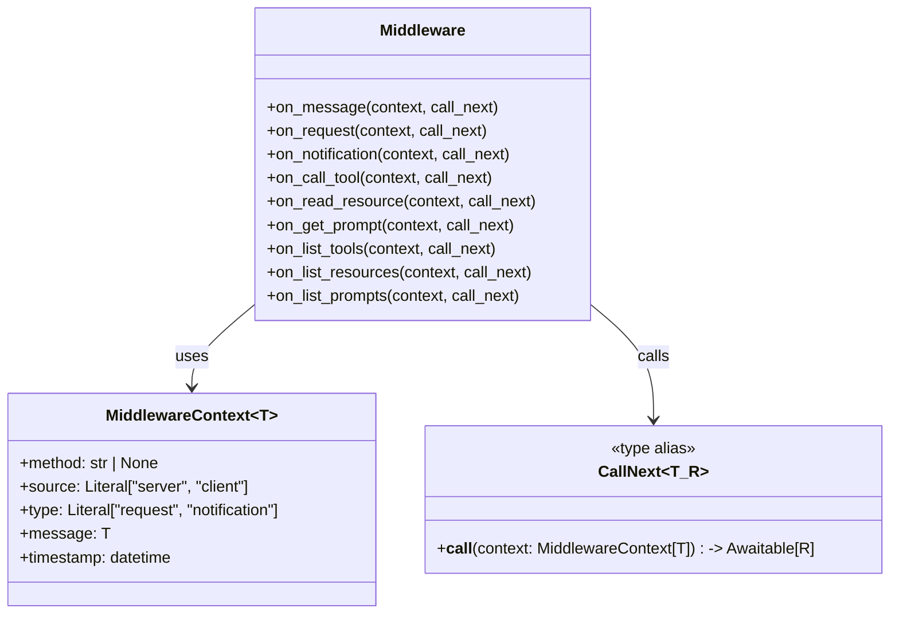

Sources: [src/fastmcp/server/middleware/middleware.py:11-50]()

The `Middleware` base class provides hook methods for different MCP operations. The `MiddlewareContext[T]` carries message data and metadata through the pipeline, while `CallNext[T, R]` represents the continuation of the middleware chain.

## Built-in Middleware Types

FastMCP includes several production-ready middleware implementations for common server needs.

### Logging Middleware

The logging system provides two complementary approaches for request monitoring and debugging.

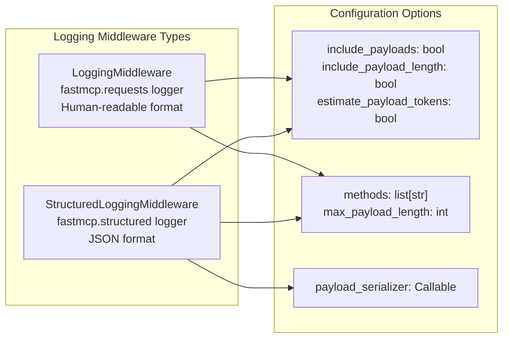

Sources: [src/fastmcp/server/middleware/logging.py:143-196](), [src/fastmcp/server/middleware/logging.py:198-246]()

| Middleware | Logger Name | Output Format | Use Case |
|------------|-------------|---------------|----------|
| `LoggingMiddleware` | `fastmcp.requests` | Key-value pairs | Development, human debugging |
| `StructuredLoggingMiddleware` | `fastmcp.structured` | JSON objects | Production, log aggregation |

Key features include payload serialization via `default_serializer()` using `pydantic_core.to_json()`, token estimation at approximately 4 characters per token, and configurable payload truncation via `max_payload_length`.

### Timing and Performance Middleware

Performance monitoring middleware provides request timing and operation-specific measurements.

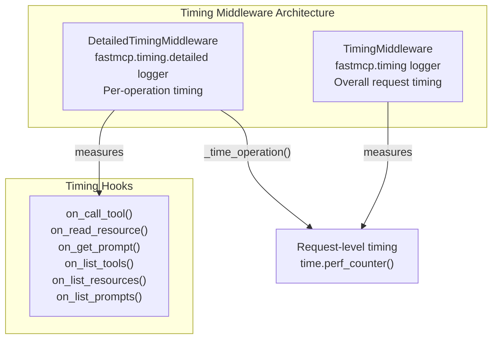

Sources: [src/fastmcp/server/middleware/timing.py:10-58](), [src/fastmcp/server/middleware/timing.py:60-157]()

Both middleware use `time.perf_counter()` for high-precision timing measurements and log results in milliseconds with 2 decimal precision.

### Error Handling and Retry Middleware

Error management middleware provides consistent error transformation and automatic retry capabilities.

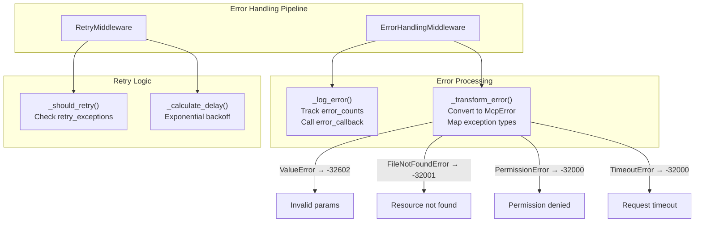

Sources: [src/fastmcp/server/middleware/error_handling.py:15-124](), [src/fastmcp/server/middleware/error_handling.py:126-207]()

The `ErrorHandlingMiddleware` transforms Python exceptions into MCP-compliant `McpError` instances with appropriate error codes, while `RetryMiddleware` implements exponential backoff retry logic for transient failures.

### Rate Limiting Middleware

Rate limiting middleware protects servers from abuse using token bucket and sliding window algorithms.

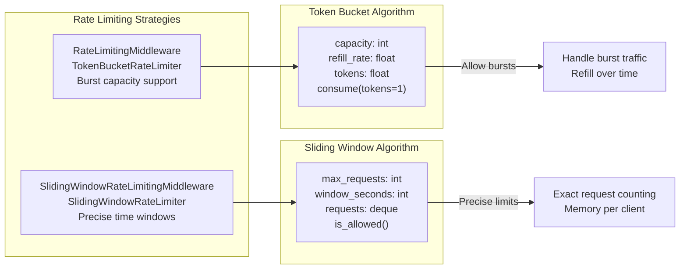

Sources: [src/fastmcp/server/middleware/rate_limiting.py:92-168](), [src/fastmcp/server/middleware/rate_limiting.py:170-232]()

Both implementations support per-client rate limiting via `get_client_id` functions and use `asyncio.Lock()` for thread-safe operation.

## Custom Middleware Development

Creating custom middleware involves extending the `Middleware` base class and implementing the appropriate hook methods.

### Middleware Hook Methods

| Hook Method | Trigger | Context Type | Use Case |
|-------------|---------|--------------|----------|
| `on_message()` | All messages | Generic | Universal logging, authentication |
| `on_request()` | Request messages | Generic | Timing, rate limiting |
| `on_notification()` | Notification messages | Generic | Event tracking |
| `on_call_tool()` | Tool execution | `CallToolRequest` | Tool-specific logic |
| `on_read_resource()` | Resource access | `ReadResourceRequest` | Resource security |
| `on_get_prompt()` | Prompt retrieval | `GetPromptRequest` | Prompt customization |

Sources: [src/fastmcp/server/middleware/middleware.py:11-200]()

### Custom Middleware Example Pattern

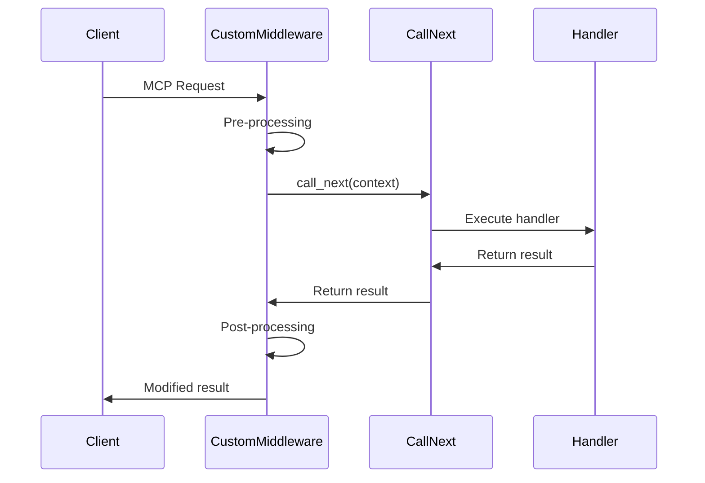

Sources: [tests/server/middleware/test_logging.py:110-141](), [tests/server/middleware/test_timing.py:47-70]()

Custom middleware should call `await call_next(context)` to continue the pipeline and can modify the context or result before/after the call.

## Integration with FastMCP Server

Middleware integration occurs through the `FastMCP.add_middleware()` method, which builds the middleware pipeline in registration order.

### Middleware Registration and Execution

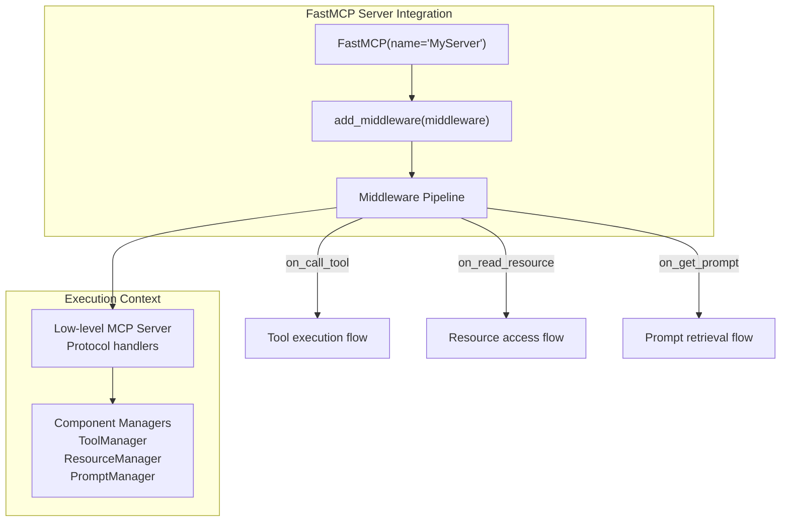

Sources: [tests/server/middleware/test_logging.py:543-575](), [tests/server/middleware/test_timing.py:192-224]()

Middleware executes in the order registered, forming a chain where each middleware can inspect, modify, or terminate request processing. The system supports both synchronous and asynchronous middleware operations through the `CallNext` continuation pattern.

## Middleware Configuration Patterns

Production deployments typically combine multiple middleware types for comprehensive server monitoring and protection.

### Common Middleware Stack Configuration

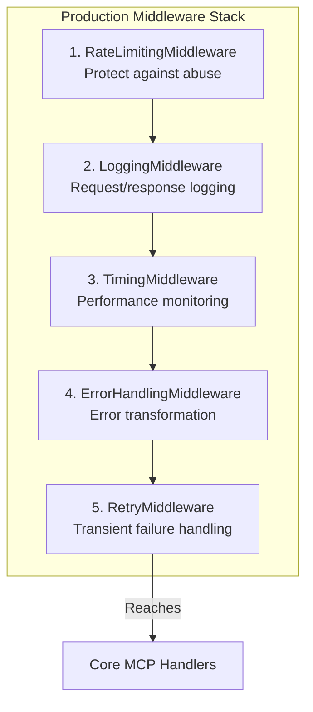

Sources: [tests/server/middleware/test_error_handling.py:589-624](), [tests/server/middleware/test_logging.py:710-744]()

This ordering ensures that rate limiting occurs first to protect server resources, followed by comprehensive monitoring and error handling capabilities. The middleware system's flexibility allows for custom combinations based on specific deployment requirements.

# Command Line Interface


The FastMCP CLI provides a comprehensive command-line interface for running, developing, installing, and inspecting MCP servers. Built with `cyclopts`, it serves as the primary entry point for all FastMCP operations from development to production deployment.

For information about the underlying server architecture that the CLI manages, see [FastMCP Server Core](#2). For details about client-server communication patterns, see [FastMCP Client System](#3).

## CLI Application Architecture

The FastMCP CLI is implemented as a `cyclopts.App` with modular command structure supporting both direct execution and subprocess delegation through `uv`.

### Main CLI Application Structure

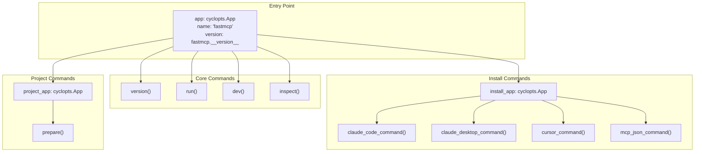

**Sources:** [src/fastmcp/cli/cli.py:36-40](), [src/fastmcp/cli/cli.py:781-782](), [src/fastmcp/cli/cli.py:871-874]()

### Configuration and Environment Management

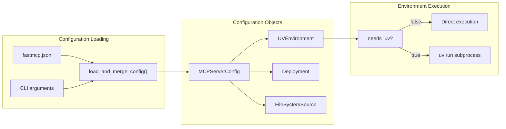

**Sources:** [src/fastmcp/utilities/cli.py:23](), [src/fastmcp/cli/cli.py:465-469](), [src/fastmcp/cli/cli.py:497-517]()

## Core CLI Commands

### Version Command

The `version()` command provides comprehensive version and platform information for debugging and support purposes.

| Option | Flag | Description |
|--------|------|-------------|
| Copy | `--copy` | Copy version information to clipboard using `pyperclip` |

Information displayed:
- `fastmcp.__version__` - FastMCP version
- `importlib.metadata.version("mcp")` - MCP protocol version  
- `platform.python_version()` - Python version
- `platform.platform()` - Platform details
- `Path(fastmcp.__file__).resolve().parents[1]` - FastMCP root path

**Sources:** [src/fastmcp/cli/cli.py:92-127]()

### Run Command

The `run()` command executes MCP servers with flexible server specification parsing and multiple execution modes.

#### Server Specification Resolution

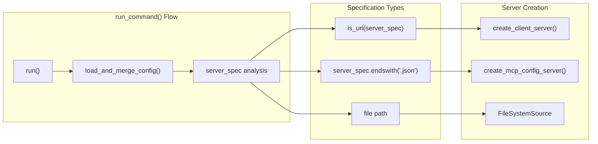

**Sources:** [src/fastmcp/cli/run.py:79-198](), [src/fastmcp/cli/run.py:25-29](), [src/fastmcp/cli/run.py:31-49](), [src/fastmcp/cli/run.py:51-60]()

#### Transport Configuration

| Transport | Default Host | Default Port | Default Path |
|-----------|--------------|--------------|-------------|
| `stdio` | N/A | N/A | N/A |
| `http` / `streamable-http` | `127.0.0.1` | `8000` | `/mcp/` |
| `sse` | `127.0.0.1` | `8000` | `/sse/` |

The run command supports both direct execution and `uv run` subprocess execution based on environment configuration.

**Sources:** [src/fastmcp/cli/cli.py:313-333](), [src/fastmcp/cli/cli.py:465-517]()

### Dev Command

The `dev()` command launches the MCP Inspector with automatic environment setup and dependency management.

#### Development Workflow

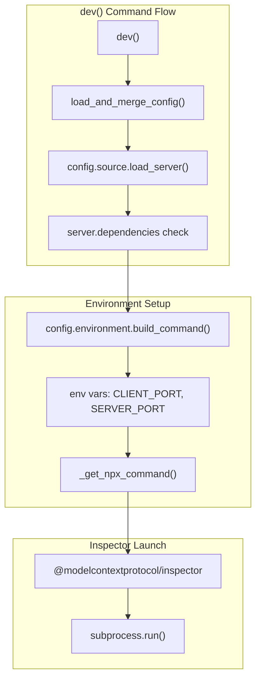

The `dev` command always runs via `uv run` subprocess and includes deprecation warnings for servers using the legacy `dependencies` parameter.

**Sources:** [src/fastmcp/cli/cli.py:129-307](), [src/fastmcp/cli/cli.py:43-56](), [src/fastmcp/cli/cli.py:234-251]()

### Inspect Command  

The `inspect()` command analyzes FastMCP servers and generates detailed reports in multiple formats.

| Option | Flag | Description |
|--------|------|-------------|
| Format | `--format` / `-f` | Output format: `fastmcp` or `mcp` |
| Output | `--output` / `-o` | Save to file (requires `--format`) |

#### Inspection Process

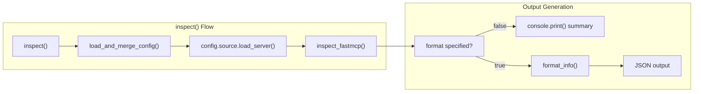

**Sources:** [src/fastmcp/cli/cli.py:543-777](), [src/fastmcp/utilities/inspect.py:26-28]()

## Install Commands

The FastMCP CLI provides installation commands for multiple MCP clients through a dedicated install subcommand structure.

### Install Command Architecture

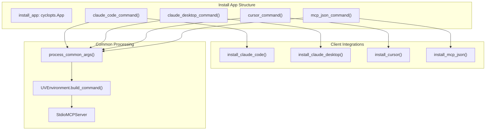

**Sources:** [src/fastmcp/cli/cli.py:874](), [src/fastmcp/cli/install/claude_code.py:153-244](), [src/fastmcp/cli/install/claude_desktop.py:125-214](), [src/fastmcp/cli/install/cursor.py:234-331](), [src/fastmcp/cli/install/mcp_json.py:98-196]()

### Client-Specific Installation

#### Claude Desktop Integration

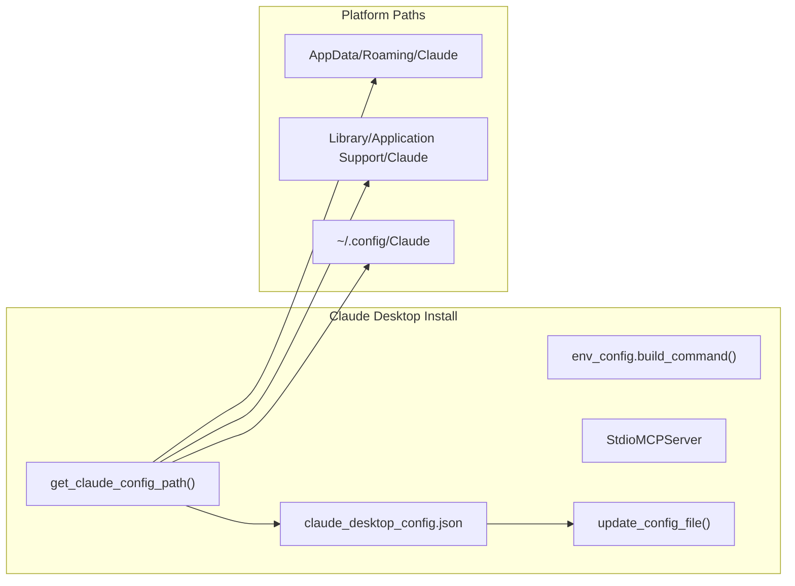

**Sources:** [src/fastmcp/cli/install/claude_desktop.py:20-36](), [src/fastmcp/cli/install/claude_desktop.py:38-123]()

#### Cursor Integration

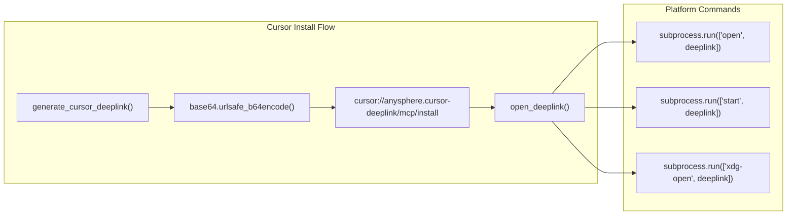

**Sources:** [src/fastmcp/cli/install/cursor.py:21-43](), [src/fastmcp/cli/install/cursor.py:45-66]()

### Project Preparation

The `project prepare` command creates persistent environments for repeated server execution.

#### Project Prepare Flow

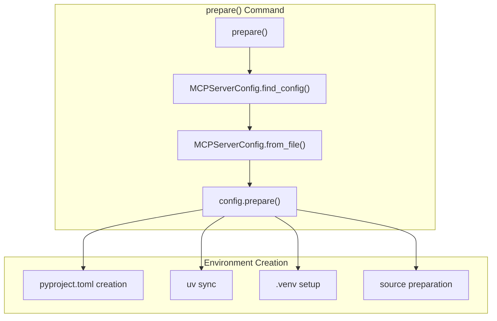

**Sources:** [src/fastmcp/cli/cli.py:784-867](), [src/fastmcp/utilities/mcp_server_config/__init__.py:31](), [src/fastmcp/utilities/mcp_server_config/__init__.py:55-57]()

## Configuration System Integration

### Configuration Loading and Merging

The CLI integrates with the FastMCP configuration system to provide seamless operation across different deployment scenarios.

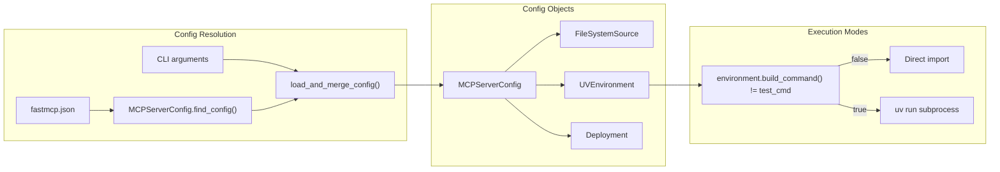

**Sources:** [src/fastmcp/utilities/cli.py:23](), [src/fastmcp/cli/cli.py:424-439](), [src/fastmcp/cli/cli.py:467-469]()

## Error Handling and Platform Support

### Cross-Platform Command Detection

The CLI handles platform-specific differences for external tool detection and subprocess execution.

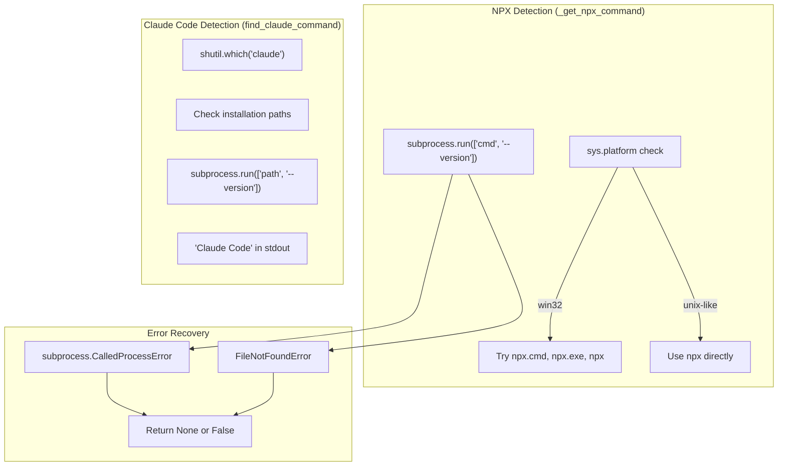

**Sources:** [src/fastmcp/cli/cli.py:43-56](), [src/fastmcp/cli/install/claude_code.py:20-66](), [src/fastmcp/cli/install/cursor.py:45-66]()

## Command Execution Patterns

### UV Integration

The CLI leverages `uv` for modern Python dependency management and isolated execution environments:

```mermaid
graph LR
    subgraph "UV Command Construction"
        build_start["_build_uv_command()"]
        
        build_start --> base_cmd["['uv', 'run']"]
        base_cmd --> add_python["--python version"]
        add_python --> add_project["--project path"]
        add_project --> add_fastmcp["--with fastmcp"]
        add_fastmcp --> add_packages["--with packages"]
        add_packages --> add_requirements["--with-requirements"]
        add_requirements --> add_fastmcp_run["['fastmcp', 'run', server_spec]"]
        add_fastmcp_run --> add_flags["Transport/logging flags"]
    end
    
    subgraph "Execution Modes"
        direct_mode["Direct import<br/>run_command()"]
        uv_mode["UV subprocess<br/>run_with_uv()"]
        
        condition["UV options provided?"]
        condition -->|true| uv_mode
        condition -->|false| direct_mode
    end
    
    style build_start fill:#f9f9f9,stroke:#333,stroke-width:2px
    style condition fill:#e8f5e8,stroke:#333,stroke-width:2px
```

**Sources:** [src/fastmcp/cli/cli.py:60-100](), [src/fastmcp/cli/cli.py:389-413](), [src/fastmcp/cli/run.py:174-250]()

### Cross-Platform Considerations

The CLI handles platform-specific differences, particularly for Windows systems:

| Platform | NPX Detection | Shell Usage | Path Handling |
|----------|---------------|-------------|---------------|
| Windows | Try `npx.cmd`, `npx.exe`, `npx` | `shell=True` | Drive letter colon handling |
| Unix-like | Use `npx` directly | `shell=False` | Standard path parsing |

**Sources:** [src/fastmcp/cli/cli.py:35-49](), [src/fastmcp/cli/cli.py:257-262]()

## Error Handling and Validation

The CLI implements comprehensive error handling with structured logging:

- **File validation**: Checks for file existence and type during path parsing
- **Module import errors**: Graceful handling of import failures with descriptive messages
- **Server validation**: Ensures imported objects are valid FastMCP instances
- **Subprocess errors**: Captures and reports subprocess execution failures
- **Configuration validation**: Validates MCP config files using Pydantic models

Exit codes follow standard conventions:
- `0`: Success
- `1`: General errors (file not found, import failures, validation errors)

**Sources:** [src/fastmcp/cli/run.py:52-57](), [src/fastmcp/cli/run.py:94-100](), [src/fastmcp/cli/run.py:118-124](), [src/fastmcp/cli/cli.py:265-282]()

# OpenAPI Integration


FastMCP's OpenAPI integration enables automatic generation of FastMCP servers from OpenAPI specifications, converting HTTP API definitions into MCP Tools, Resources, and ResourceTemplates. This system parses OpenAPI schemas and creates appropriate MCP components based on configurable route mapping rules.

For general FastMCP server functionality, see [FastMCP Server Core](#2). For HTTP server deployment, see [HTTP Server and Deployment](#4). For client-side API consumption, see [FastMCP Client System](#3).

## Architecture Overview

The OpenAPI integration consists of three main layers: schema parsing, route mapping, and component generation. The system transforms OpenAPI specifications into FastMCP components through an intermediate representation.

```mermaid
graph TB
    subgraph "Input Layer"
        OpenAPISpec["OpenAPI Specification<br/>(JSON/YAML)"]
    end
    
    subgraph "Parsing Layer"
        OpenAPIParser["OpenAPIParser<br/>parse_openapi_to_http_routes()"]
        HTTPRoute["HTTPRoute<br/>Intermediate Representation"]
    end
    
    subgraph "Mapping Layer"
        RouteMap["RouteMap Objects<br/>Mapping Rules"]
        DetermineType["_determine_route_type()"]
        MCPType["MCPType Enum<br/>(TOOL/RESOURCE/RESOURCE_TEMPLATE)"]
    end
    
    subgraph "Generation Layer"
        FastMCPOpenAPI["FastMCPOpenAPI<br/>Main Server Class"]
        OpenAPITool["OpenAPITool"]
        OpenAPIResource["OpenAPIResource"] 
        OpenAPIResourceTemplate["OpenAPIResourceTemplate"]
    end
    
    subgraph "Execution Layer"
        HTTPClient["httpx.AsyncClient<br/>HTTP Execution"]
        MCPProtocol["MCP Protocol<br/>Tool/Resource Calls"]
    end
    
    OpenAPISpec --> OpenAPIParser
    OpenAPIParser --> HTTPRoute
    HTTPRoute --> DetermineType
    RouteMap --> DetermineType
    DetermineType --> MCPType
    HTTPRoute --> FastMCPOpenAPI
    MCPType --> FastMCPOpenAPI
    FastMCPOpenAPI --> OpenAPITool
    FastMCPOpenAPI --> OpenAPIResource
    FastMCPOpenAPI --> OpenAPIResourceTemplate
    OpenAPITool --> HTTPClient
    OpenAPIResource --> HTTPClient
    OpenAPIResourceTemplate --> HTTPClient
    HTTPClient --> MCPProtocol
```

**Sources:** [src/fastmcp/server/openapi.py:1-100](), [src/fastmcp/utilities/openapi.py:200-250]()

## Core Components

### FastMCPOpenAPI Server Class

The `FastMCPOpenAPI` class extends `FastMCP` to provide OpenAPI-based server creation. It parses OpenAPI specifications and automatically generates appropriate MCP components.

```mermaid
graph LR
    FastMCPOpenAPI["FastMCPOpenAPI"]
    
    subgraph "Configuration"
        RouteMapsList["route_maps: list[RouteMap]"]
        RouteMapFn["route_map_fn: RouteMapFn"]
        MCPComponentFn["mcp_component_fn: ComponentFn"]
        MCPNames["mcp_names: dict[str, str]"]
    end
    
    subgraph "Processing"
        HTTPRoutes["http_routes: list[HTTPRoute]"]
        UsedNames["_used_names: Counter"]
        GenerateDefaultName["_generate_default_name()"]
        GetUniqueName["_get_unique_name()"]
    end
    
    subgraph "Component Creation"
        CreateOpenAPITool["_create_openapi_tool()"]
        CreateOpenAPIResource["_create_openapi_resource()"]
        CreateOpenAPITemplate["_create_openapi_template()"]
    end
    
    FastMCPOpenAPI --> RouteMapsList
    FastMCPOpenAPI --> RouteMapFn
    FastMCPOpenAPI --> MCPComponentFn
    FastMCPOpenAPI --> MCPNames
    FastMCPOpenAPI --> HTTPRoutes
    FastMCPOpenAPI --> UsedNames
    HTTPRoutes --> GenerateDefaultName
    UsedNames --> GetUniqueName
    FastMCPOpenAPI --> CreateOpenAPITool
    FastMCPOpenAPI --> CreateOpenAPIResource
    FastMCPOpenAPI --> CreateOpenAPITemplate
```

**Sources:** [src/fastmcp/server/openapi.py:696-831](), [src/fastmcp/server/openapi.py:833-887]()

### OpenAPI Component Types

Three specialized component classes handle different types of HTTP endpoints:

| Component | Purpose | HTTP Methods | Use Case |
|-----------|---------|--------------|----------|
| `OpenAPITool` | Executable operations | POST, PUT, PATCH, DELETE | API actions, data modification |
| `OpenAPIResource` | Static data endpoints | GET (no path params) | Fixed data retrieval |
| `OpenAPIResourceTemplate` | Parameterized data | GET (with path params) | Dynamic data retrieval |

**Sources:** [src/fastmcp/server/openapi.py:229-521](), [src/fastmcp/server/openapi.py:523-640](), [src/fastmcp/server/openapi.py:642-694]()

## Route Mapping System

### MCPType Enumeration

The `MCPType` enum defines the target component types for HTTP routes:

```python
class MCPType(enum.Enum):
    TOOL = "TOOL"                    # Executable operations
    RESOURCE = "RESOURCE"            # Static data endpoints  
    RESOURCE_TEMPLATE = "RESOURCE_TEMPLATE"  # Parameterized endpoints
    EXCLUDE = "EXCLUDE"              # Skip route conversion
```

**Sources:** [src/fastmcp/server/openapi.py:78-94]()

### RouteMap Configuration

`RouteMap` objects define mapping rules from HTTP routes to MCP component types:

```mermaid
graph TD
    RouteMap["RouteMap Configuration"]
    
    subgraph "Matching Criteria"
        Methods["methods: list[HttpMethod] | '*'"]
        Pattern["pattern: Pattern[str] | str"]
        Tags["tags: set[str]"]
    end
    
    subgraph "Target Configuration"
        MCPType["mcp_type: MCPType"]
        MCPTags["mcp_tags: set[str]"]
    end
    
    subgraph "Matching Process"
        DetermineRouteType["_determine_route_type()"]
        MethodCheck["HTTP Method Match"]
        PatternCheck["Path Pattern Match"]
        TagCheck["Tag Match (AND)"]
    end
    
    RouteMap --> Methods
    RouteMap --> Pattern
    RouteMap --> Tags
    RouteMap --> MCPType
    RouteMap --> MCPTags
    
    Methods --> DetermineRouteType
    Pattern --> DetermineRouteType
    Tags --> DetermineRouteType
    DetermineRouteType --> MethodCheck
    DetermineRouteType --> PatternCheck
    DetermineRouteType --> TagCheck
```

**Sources:** [src/fastmcp/server/openapi.py:110-182](), [src/fastmcp/server/openapi.py:184-227]()

### Default Route Mapping

By default, all routes are converted to Tools unless custom mappings specify otherwise:

```python
DEFAULT_ROUTE_MAPPINGS = [
    RouteMap(mcp_type=MCPType.TOOL),
]
```

**Sources:** [src/fastmcp/server/openapi.py:177-181]()

## Schema Parsing System

### HTTPRoute Intermediate Representation

The parsing system converts OpenAPI specifications into `HTTPRoute` objects that capture all necessary information for component generation:

```mermaid
graph LR
    subgraph "OpenAPI Elements"
        Operation["OpenAPI Operation"]
        Parameters["Parameters[]"]
        RequestBody["RequestBody"]
        Responses["Responses{}"]
        Components["Components/Schemas"]
    end
    
    subgraph "HTTPRoute IR"
        HTTPRouteObj["HTTPRoute"]
        ParameterInfo["ParameterInfo[]"]
        RequestBodyInfo["RequestBodyInfo"]
        ResponseInfo["ResponseInfo{}"]
        SchemaDefinitions["schema_definitions: dict"]
    end
    
    subgraph "Parsing Functions"
        ParseOpenAPI["parse_openapi_to_http_routes()"]
        ExtractParameters["_extract_parameters()"]
        ExtractRequestBody["_extract_request_body()"]
        ExtractResponses["_extract_responses()"]
        ResolveRef["_resolve_ref()"]
    end
    
    Operation --> ParseOpenAPI
    Parameters --> ExtractParameters
    RequestBody --> ExtractRequestBody
    Responses --> ExtractResponses
    Components --> ResolveRef
    
    ParseOpenAPI --> HTTPRouteObj
    ExtractParameters --> ParameterInfo
    ExtractRequestBody --> RequestBodyInfo
    ExtractResponses --> ResponseInfo
    ResolveRef --> SchemaDefinitions
```

**Sources:** [src/fastmcp/utilities/openapi.py:201-253](), [src/fastmcp/utilities/openapi.py:379-477](), [src/fastmcp/utilities/openapi.py:479-543]()

### Parameter Processing

The system handles complex parameter scenarios including location conflicts and array formatting:

| Parameter Location | Handling | Example |
|-------------------|----------|---------|
| `path` | Required, URL substitution | `/users/{userId}` |
| `query` | Optional, query string | `?limit=10&offset=0` |
| `header` | Optional, HTTP headers | `X-API-Key: secret` |
| `cookie` | Optional, cookie values | `session=abc123` |

**Sources:** [src/fastmcp/utilities/openapi.py:124-135](), [src/fastmcp/server/openapi.py:264-418]()

## Component Creation Process

### Schema Combination

The `_combine_schemas` function merges parameter schemas with request body schemas, handling name collisions by suffixing parameter names with their location:

```mermaid
graph TD
    subgraph "Input Schemas"
        RouteParameters["Route Parameters"]
        RequestBodySchema["Request Body Schema"]
    end
    
    subgraph "Processing"
        CombineSchemas["_combine_schemas()"]
        DetectCollisions["Name Collision Detection"]
        SuffixParameters["Parameter Name Suffixing"]
        MergeProperties["Schema Property Merging"]
    end
    
    subgraph "Output"
        CombinedSchema["Combined JSON Schema"]
        ParameterProperties["Parameter Properties"]
        BodyProperties["Body Properties"]
        RequiredFields["Required Fields Array"]
    end
    
    RouteParameters --> CombineSchemas
    RequestBodySchema --> CombineSchemas
    CombineSchemas --> DetectCollisions
    DetectCollisions --> SuffixParameters
    SuffixParameters --> MergeProperties
    MergeProperties --> CombinedSchema
    CombinedSchema --> ParameterProperties
    CombinedSchema --> BodyProperties
    CombinedSchema --> RequiredFields
```

**Sources:** [src/fastmcp/utilities/openapi.py:892-1050]()

### Name Generation and Collision Handling

The system generates unique component names using operation IDs, summaries, or path-based naming with collision detection:

```python
def _generate_default_name(self, route: HTTPRoute, mcp_names_map: dict[str, str] | None = None) -> str:
    # Priority: custom mapping > operationId > summary > path-based
    # Truncated to 56 characters maximum
    # Processed through _slugify() for URL-safe names
```

**Sources:** [src/fastmcp/server/openapi.py:833-856](), [src/fastmcp/server/openapi.py:858-886](), [src/fastmcp/server/openapi.py:44-64]()

## HTTP Request Execution

### Parameter Serialization

OpenAPI components handle complex parameter serialization including arrays, objects, and style-specific formatting:

```mermaid
graph TD
    subgraph "Parameter Types"
        PathParams["Path Parameters"]
        QueryParams["Query Parameters"]
        HeaderParams["Header Parameters"]
        BodyParams["Request Body"]
    end
    
    subgraph "Serialization Strategies"
        SimpleStyle["Simple Style (path)"]
        FormStyle["Form Style (query)"]
        DeepObjectStyle["deepObject Style"]
        ArrayFormatting["Array Parameter Formatting"]
    end
    
    subgraph "HTTP Request"
        URLConstruction["URL Construction"]
        QueryString["Query String Building"]
        HeaderMapping["Header Mapping"]
        JSONBody["JSON Body Serialization"]
    end
    
    PathParams --> SimpleStyle
    QueryParams --> FormStyle
    QueryParams --> DeepObjectStyle
    QueryParams --> ArrayFormatting
    HeaderParams --> HeaderMapping
    BodyParams --> JSONBody
    
    SimpleStyle --> URLConstruction
    FormStyle --> QueryString
    DeepObjectStyle --> QueryString
    ArrayFormatting --> QueryString
    HeaderMapping --> HTTPRequest["HTTP Request"]
    JSONBody --> HTTPRequest
    URLConstruction --> HTTPRequest
    QueryString --> HTTPRequest
```

**Sources:** [src/fastmcp/server/openapi.py:288-417](), [src/fastmcp/utilities/openapi.py:41-121]()

### Response Processing

The system handles various response types and content negotiation:

| Content Type | Processing | Output |
|-------------|------------|--------|
| `application/json` | JSON parsing, structured output | `ToolResult(structured_content=...)` |
| `text/*` | Text content | `ToolResult(content=...)` |
| `application/xml` | Text content | `ToolResult(content=...)` |
| Binary | Raw bytes | `ToolResult(content=...)` |

**Sources:** [src/fastmcp/server/openapi.py:482-502](), [src/fastmcp/server/openapi.py:614-621]()

## Advanced Features

### Custom Route Mapping Functions

Advanced route mapping through `route_map_fn` and `mcp_component_fn` callbacks:

```python