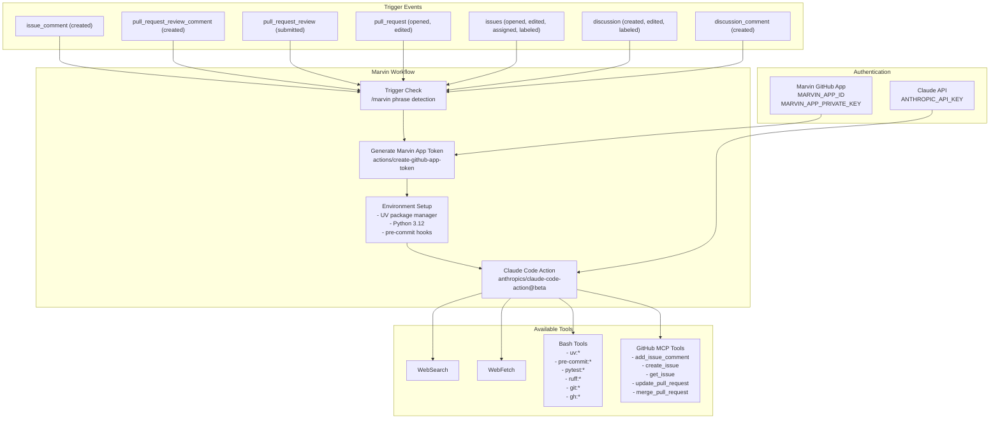
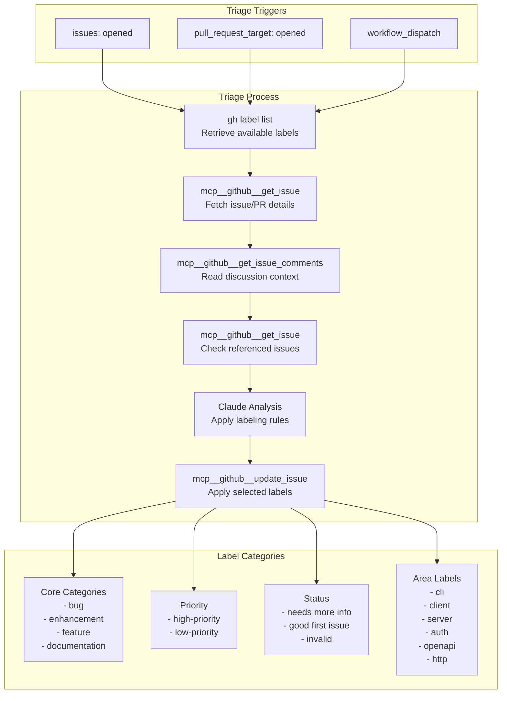
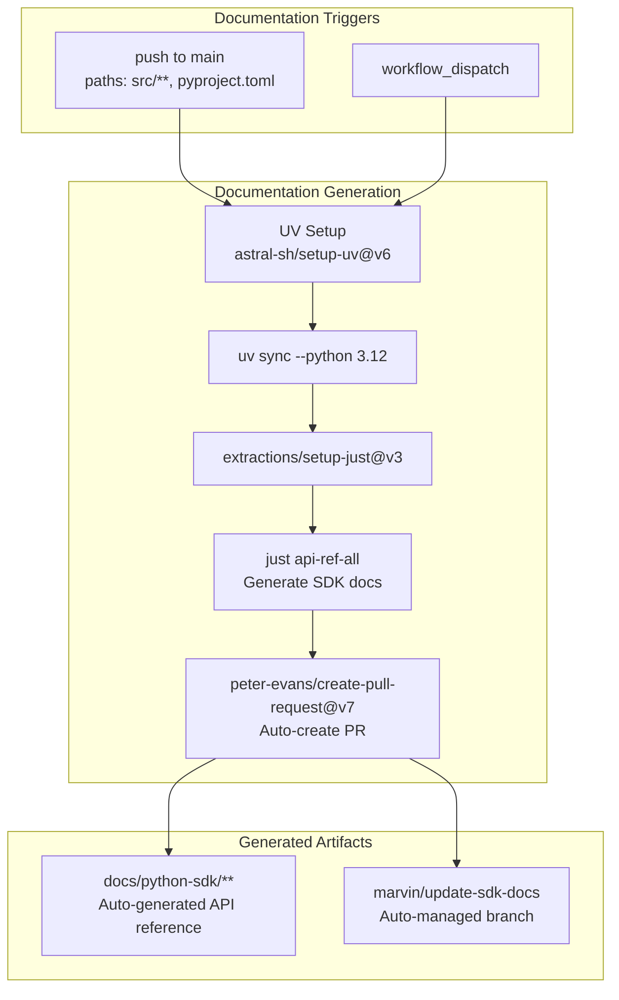
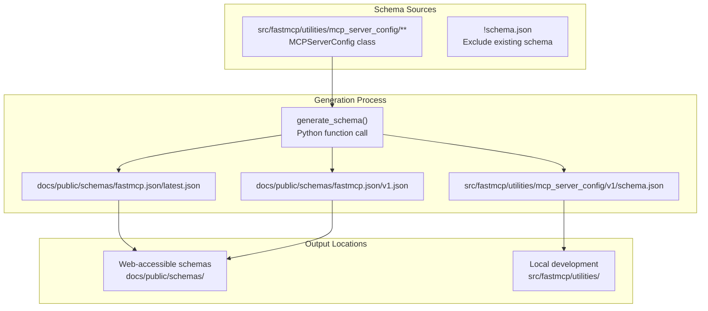
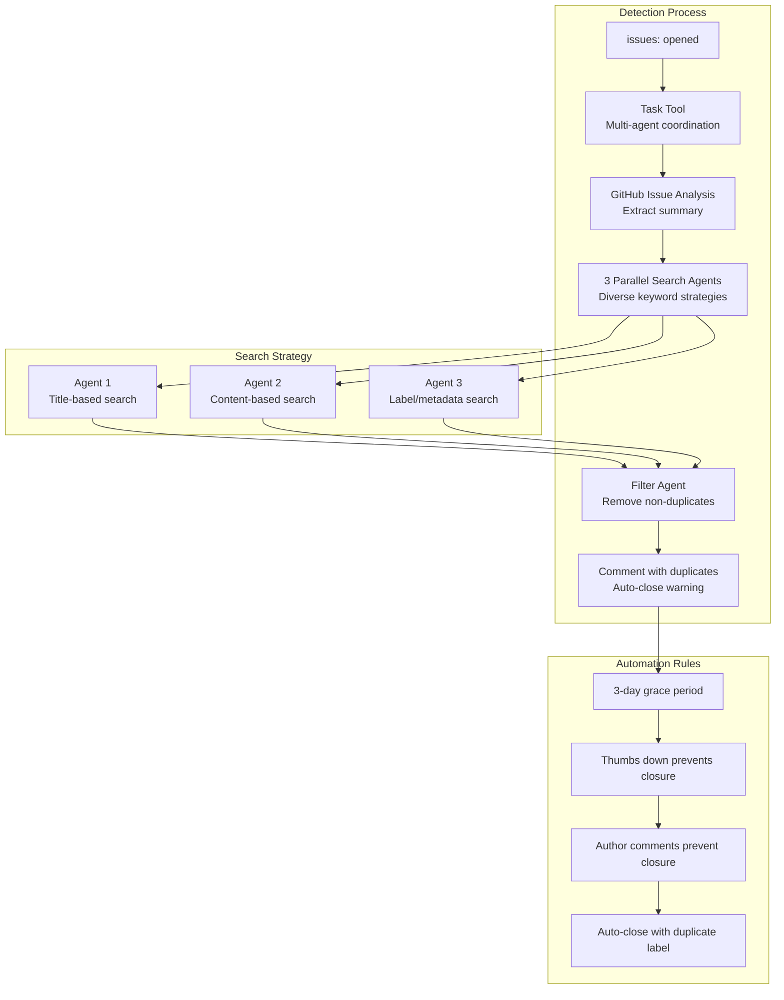
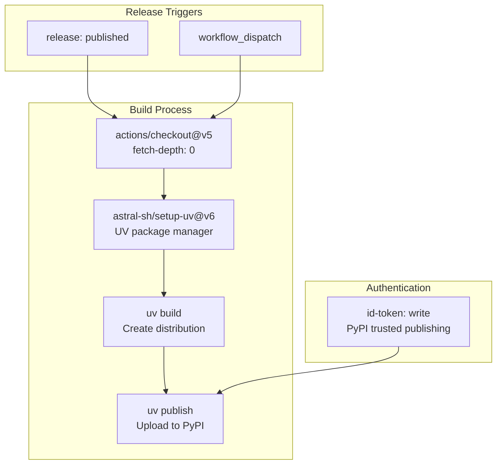

This document covers the automated infrastructure and workflows that maintain the FastMCP project, including AI-driven automation, documentation generation, issue management, and CI/CD pipelines. The infrastructure is primarily built around GitHub Actions workflows and integrates with external AI services for intelligent project maintenance.

For information about testing infrastructure and development workflows, see [Testing and Development Framework](#8).

## AI-Driven Automation System

The core of FastMCP's infrastructure is the Marvin Context Protocol system, which provides AI-powered assistance for project maintenance, issue triage, and development tasks.

### Marvin Context Protocol Workflow

The main Marvin workflow is defined in [.github/workflows/marvin.yml:1-72]() and triggers on various GitHub events when the `/marvin` phrase is detected. The workflow uses the `anthropics/claude-code-action@beta` action with extensive tool permissions for code analysis and repository interaction.

**Sources:** [.github/workflows/marvin.yml:1-72]()

### Issue Triage Automation

The triage system is implemented in [.github/workflows/marvin-label-triage.yml:1-158]() and uses sophisticated rules to categorize issues and PRs automatically. The system enforces mutually exclusive core categories and applies area labels only when thematically central.

**Sources:** [.github/workflows/marvin-label-triage.yml:1-158]()

## Documentation Automation

### SDK Documentation Pipeline

The SDK documentation workflow [.github/workflows/update-sdk-docs.yml:1-75]() automatically generates API reference documentation from source code docstrings and type annotations using the `just api-ref-all` command.

**Sources:** [.github/workflows/update-sdk-docs.yml:1-75]()

### Configuration Schema Updates

The schema update workflow [.github/workflows/update-config-schema.yml:1-92]() maintains the `fastmcp.json` configuration schema by generating it from the `MCPServerConfig` class definition:

**Sources:** [.github/workflows/update-config-schema.yml:1-92]()

## Issue Management Automation

### Duplicate Detection System

The duplicate detection system [.github/workflows/marvin-dedupe-issues.yml:1-81]() uses a multi-agent approach with the Task tool to coordinate parallel searches and intelligent filtering.

**Sources:** [.github/workflows/marvin-dedupe-issues.yml:1-81]()

### Auto-Close Implementation

The auto-close mechanism is implemented in [scripts/auto_close_duplicates.py:1-332]() with the following key components:

| Component | Class | Purpose |
|-----------|-------|---------|
| Issue Management | `Issue` | Represents GitHub issue data |
| Comment Handling | `Comment` | Manages issue comments |
| Reaction Tracking | `Reaction` | Tracks user reactions |
| API Client | `GitHubClient` | GitHub API interaction |

The script implements sophisticated logic in `should_close_as_duplicate()` [scripts/auto_close_duplicates.py:216-254]() to check for preventing conditions before auto-closing issues.

**Sources:** [scripts/auto_close_duplicates.py:1-332](), [.github/workflows/auto-close-duplicates.yml:1-29]()

## CI/CD Pipeline

### Publishing Workflow

The publishing workflow [.github/workflows/publish.yml:1-27]() uses PyPI's trusted publishing feature for secure package deployment without managing API tokens.

**Sources:** [.github/workflows/publish.yml:1-27]()

## Infrastructure Components

### GitHub App Integration

The Marvin Context Protocol system relies on a GitHub App for authentication:

- **App ID**: Stored as `MARVIN_APP_ID` secret
- **Private Key**: Stored as `MARVIN_APP_PRIVATE_KEY` secret
- **Token Generation**: Uses `actions/create-github-app-token@v2`
- **Permissions**: Comprehensive access to contents, issues, pull-requests, discussions, and actions

### External Service Dependencies

| Service | Purpose | Authentication |
|---------|---------|----------------|
| Anthropic Claude | AI-powered code analysis and automation | `ANTHROPIC_API_KEY` |
| GitHub Docker Registry | MCP server containers | App token |
| PyPI | Package publishing | Trusted publishing (OIDC) |

### Automation Bot Identity

All automated actions use the bot identity:
- **Name**: `marvin-context-protocol[bot]`
- **Email**: `225465937+marvin-context-protocol[bot]@users.noreply.github.com`
- **User ID**: `225465937`

This ensures consistent attribution for automated contributions and proper GitHub integration.

**Sources:** [.github/workflows/update-sdk-docs.yml:68-69](), [.github/workflows/update-config-schema.yml:85-86]()