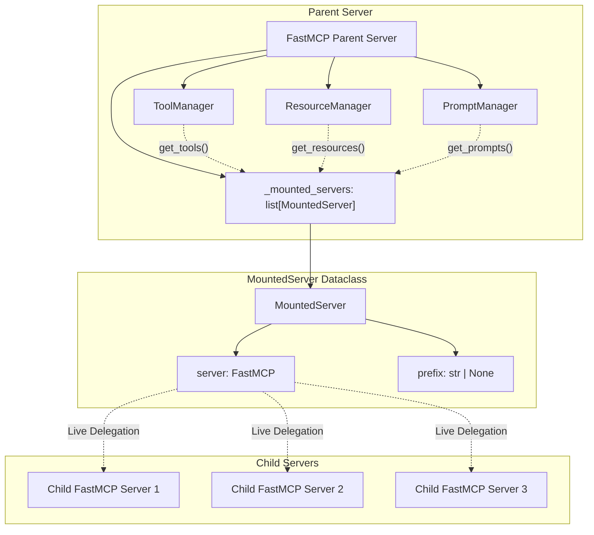
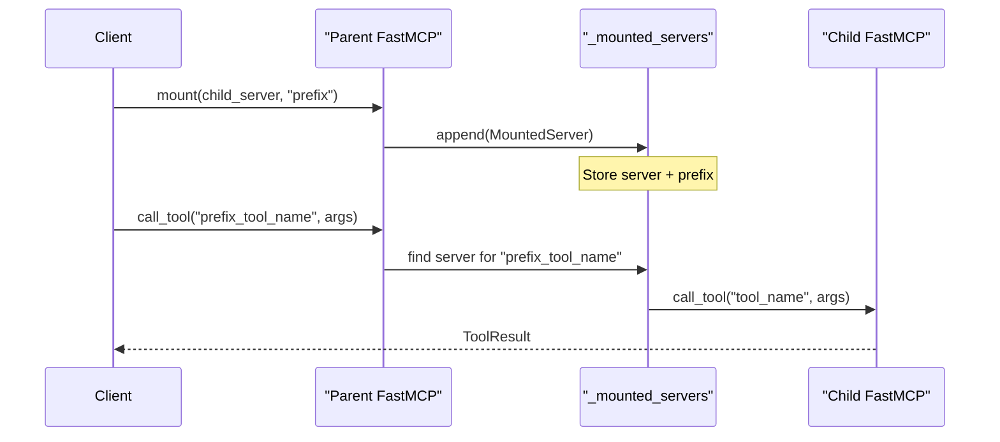
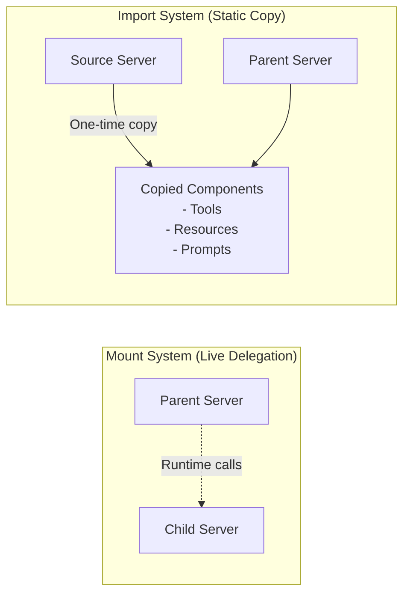
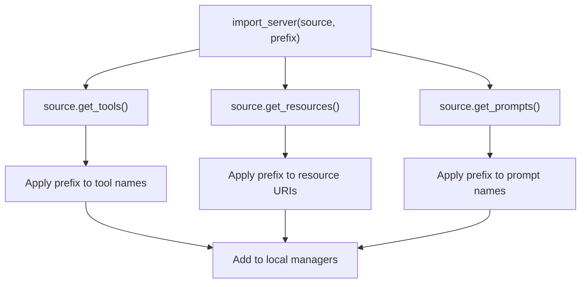
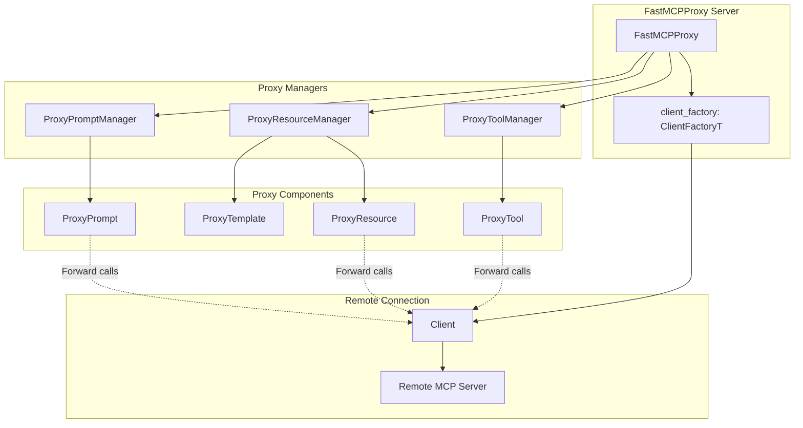
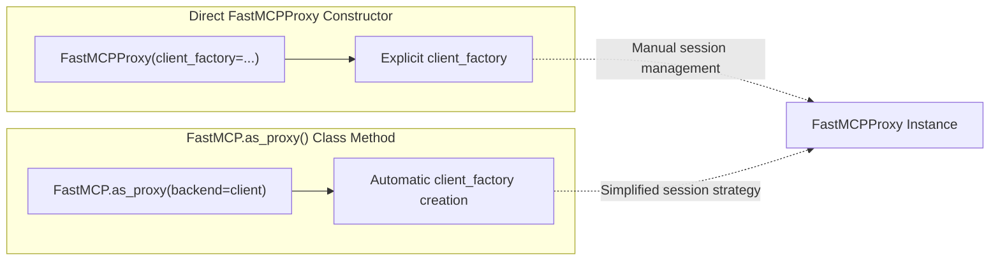
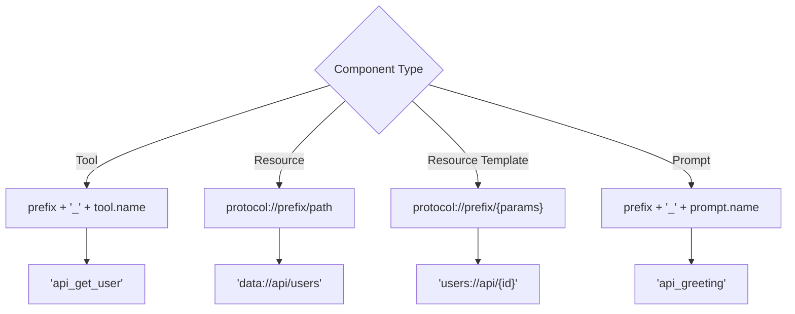
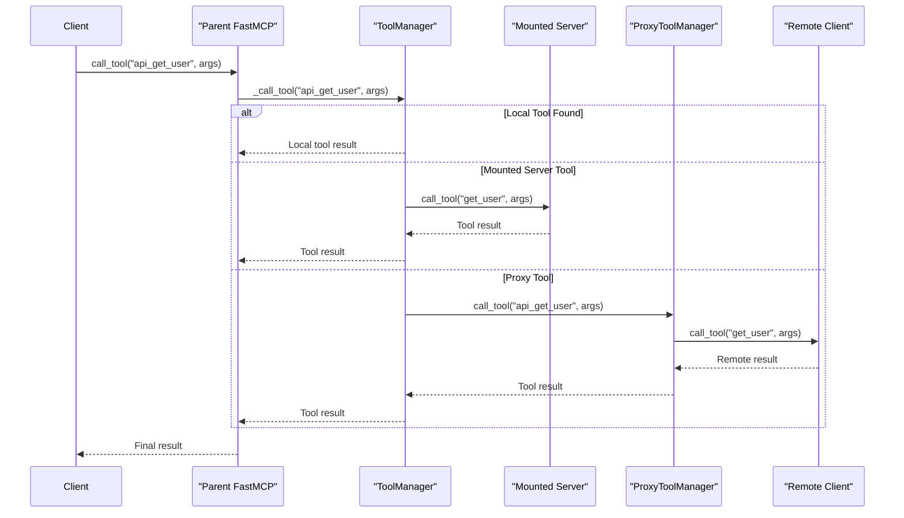
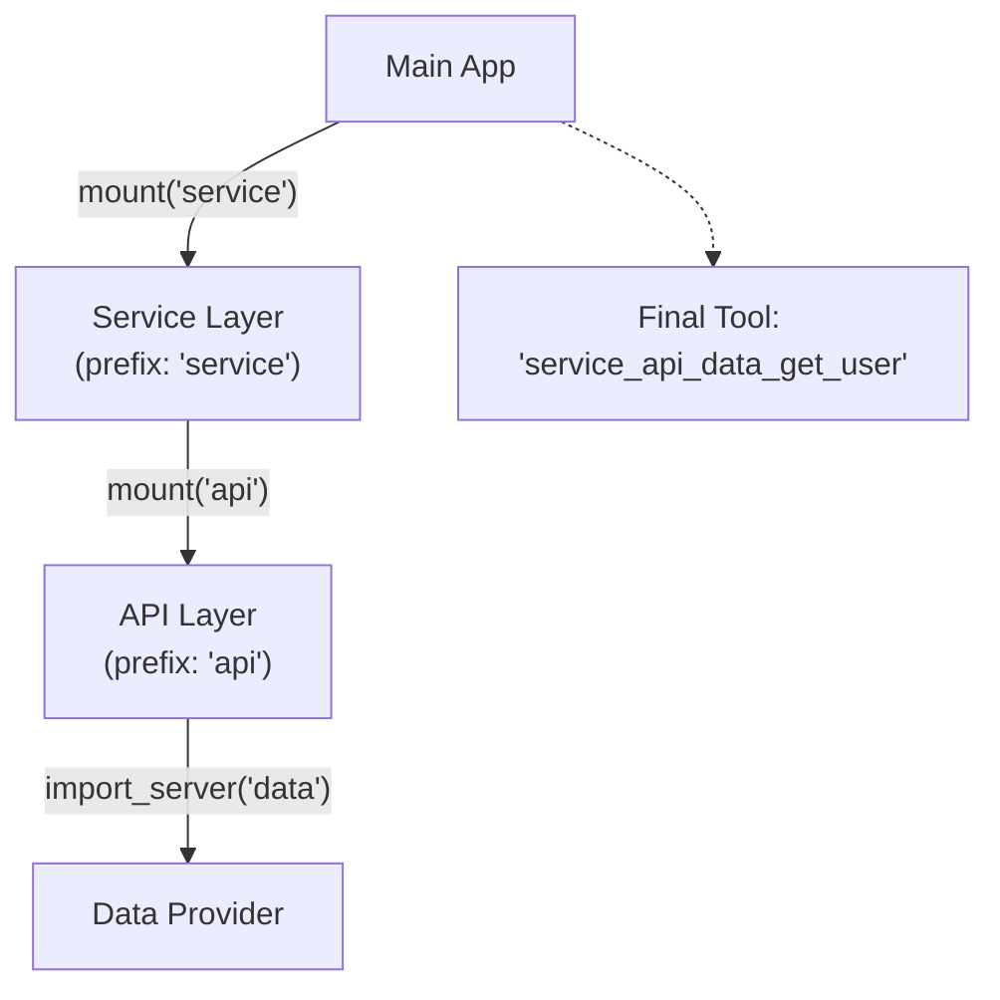
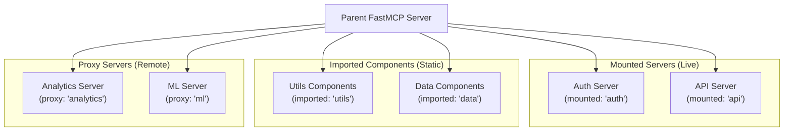

Server composition and proxying enables FastMCP servers to combine functionality from multiple other servers, either through live delegation (mounting) or static copying (importing). This system allows complex applications to be built by composing smaller, focused servers while maintaining clean separation of concerns.

For information about the core FastMCP server architecture, see [2](#2). For details about component management and registration, see [2.1](#2.1).

## Overview

FastMCP provides three primary mechanisms for server composition:

- **Mounting** - Live delegation to child servers with automatic prefix handling
- **Importing** - Static copying of components from other servers  
- **Proxying** - Transparent forwarding to remote MCP-compliant servers

All composition methods support automatic prefixing of component names to avoid conflicts and provide clear namespacing.

## Mount System Architecture

The mount system enables live delegation to child FastMCP servers. When a component is requested, the parent server forwards the request to the appropriate mounted server in real-time.

### Mount System Core Components

**Sources:** [src/fastmcp/server/server.py:175](), [src/fastmcp/server/server.py:1260-1332]()

### Mount Method Implementation

The `mount` method in `FastMCP` registers child servers for live delegation:

**Sources:** [src/fastmcp/server/server.py:1260-1332](), [tests/server/test_mount.py:16-68]()

## Import System Architecture  

The import system performs static copying of components from other servers. Components are copied once at import time and become part of the importing server.

### Import vs Mount Comparison

**Sources:** [src/fastmcp/server/server.py:1334-1421](), [tests/server/test_import_server.py:10-34]()

### Import Method Implementation

The `import_server` method copies components with prefix handling:

**Sources:** [src/fastmcp/server/server.py:1334-1421](), [tests/server/test_import_server.py:61-89]()

## Proxy System Architecture

The proxy system enables FastMCP servers to act as transparent proxies to remote MCP-compliant servers. This is implemented through specialized managers and components.

### Proxy System Core Components

**Sources:** [src/fastmcp/server/proxy.py:454-519](), [src/fastmcp/server/proxy.py:69-121]()

### FastMCPProxy Creation Methods

FastMCP provides two ways to create proxy servers:

**Sources:** [src/fastmcp/server/server.py:1555-1610](), [src/fastmcp/server/proxy.py:460-508]()

## Prefix Handling System

All composition methods support automatic prefixing to avoid component name conflicts. The prefix handling varies by component type.

### Prefix Application Rules

**Sources:** [src/fastmcp/server/server.py:1423-1553](), [src/fastmcp/server/server.py:2157-2205]()

### Resource Prefix Utilities

FastMCP provides utility functions for resource prefix manipulation:

| Function | Purpose | Example |
|----------|---------|---------|
| `add_resource_prefix()` | Add prefix to resource URI | `data://users` → `data://api/users` |
| `remove_resource_prefix()` | Remove prefix from URI | `data://api/users` → `data://users` |
| `has_resource_prefix()` | Check if URI has prefix | Returns `True` for `data://api/users` |

**Sources:** [src/fastmcp/server/server.py:2157-2205](), [tests/server/test_server.py:22-26]()

## Component Request Flow

The following diagram shows how requests flow through the composition system:

**Sources:** [src/fastmcp/server/server.py:729-752](), [src/fastmcp/server/proxy.py:107-121](), [src/fastmcp/server/proxy.py:280-296]()

## Advanced Composition Patterns

### Multi-Level Composition

Servers can be composed in multiple levels, with prefixes accumulating:

**Sources:** [tests/server/test_import_server.py:249-283](), [tests/server/test_mount.py:466-509]()

### Mixed Composition Strategies

A single parent server can use multiple composition strategies simultaneously:

**Sources:** [tests/server/test_mount.py:210-238](), [tests/server/test_import_server.py:36-58](), [src/fastmcp/server/proxy.py:454-519]()