This document covers the transport layer of the FastMCP client system, which handles connection establishment and communication with MCP servers. Transport mechanisms are responsible for the underlying connection details (subprocess management, HTTP connections, in-memory calls), while the `Client` class handles MCP protocol operations.

For information about client operations like calling tools and reading resources, see [Client Operations and Testing](#3.2). For server-side HTTP infrastructure, see [HTTP Server and Deployment](#6).

## Architecture Overview

The FastMCP client system separates concerns between protocol handling and connection management through a two-layer architecture:

### Core Transport Architecture

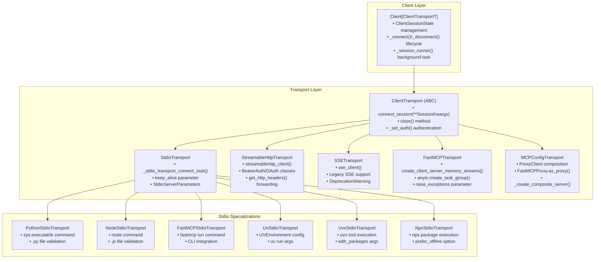

**Sources:** [src/fastmcp/client/client.py:97-155](), [src/fastmcp/client/transports.py:75-119](), [src/fastmcp/client/transports.py:301-417]()

The `Client` class is a generic type `Client[ClientTransportT]` that accepts any transport instance or transport-inferrable input and delegates connection management to the transport while handling all MCP protocol details itself. The transport layer provides connection abstraction while the client handles session management including reentrant context managers and initialization.

## Transport Inference System

The client system automatically selects appropriate transports based on input types through the `infer_transport` function:

### Transport Selection Logic

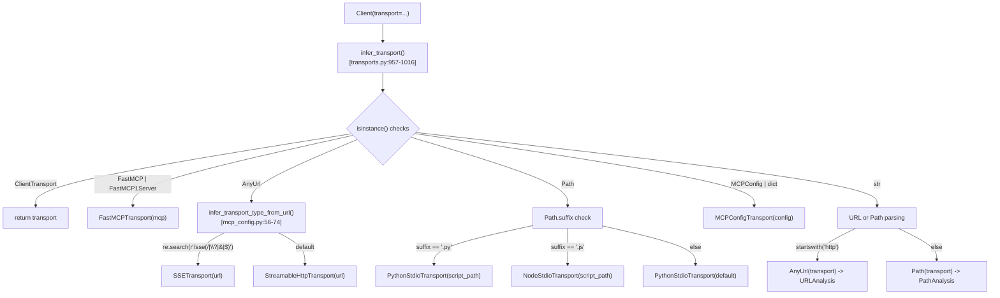

**Sources:** [src/fastmcp/client/transports.py:957-1016](), [src/fastmcp/client/client.py:231](), [src/fastmcp/mcp_config.py:56-74]()

The `infer_transport` function provides automatic transport selection with intelligent defaults. HTTP URLs are analyzed for SSE paths (containing `/sse/`) while other HTTP URLs default to `StreamableHttpTransport`. File paths use extension-based selection, and the system gracefully handles edge cases by falling back to sensible defaults.

## Transport Types and Use Cases

### Transport Comparison Matrix

| Transport Type | Best For | Connection Model | Session Persistence | Authentication Support |
|---|---|---|---|---|
| `FastMCPTransport` | Testing, development, in-process | In-memory | N/A | N/A |
| `StreamableHttpTransport` | Production HTTP servers | Remote network | Stateless | Yes (Bearer, OAuth) |
| `SSETransport` | Legacy HTTP servers, SSE endpoints | Remote network | Stateless | Yes (Bearer, OAuth) |
| `StdioTransport` | Local MCP servers, subprocesses | Subprocess pipes | Configurable (`keep_alive`) | N/A |
| `MCPConfigTransport` | Multi-server applications | Mixed transports | Varies by server | Per-server configuration |

### Transport Capabilities

| Transport | Header Forwarding | Timeout Control | Environment Variables | Keep-Alive |
|---|---|---|---|---|
| `StreamableHttpTransport` | Yes (`get_http_headers()`) | Yes (`sse_read_timeout`) | N/A | N/A |
| `SSETransport` | Yes (`get_http_headers()`) | Yes (`sse_read_timeout`) | N/A | N/A |
| `StdioTransport` | N/A | N/A | Yes (`env` parameter) | Yes (configurable) |
| `FastMCPTransport` | N/A | N/A | Inherited from process | N/A |

**Sources:** [src/fastmcp/client/transports.py:160-227](), [src/fastmcp/client/transports.py:230-298](), [src/fastmcp/client/transports.py:301-417](), [src/fastmcp/client/transports.py:783-835]()

## Stdio Transport Family

Stdio transports manage local MCP servers through subprocess execution, communicating via stdin/stdout pipes.

### Base Stdio Transport

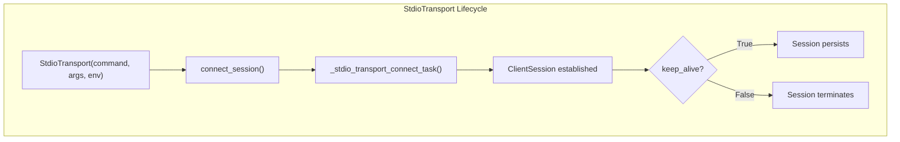

**Sources:** [src/fastmcp/client/transports.py:301-417](), [src/fastmcp/client/transports.py:419-463]()

The `StdioTransport` class provides the foundation for all subprocess-based transports. Key features include:

- **Session Persistence**: Controlled via `keep_alive` parameter [src/fastmcp/client/transports.py:315-336]()
- **Environment Isolation**: Explicit environment variable passing [src/fastmcp/client/transports.py:312-314]()
- **Async Task Management**: Background connection task [src/fastmcp/client/transports.py:419-463]()

### Specialized Stdio Implementations

| Class | Command | File Extension | Use Case |
|---|---|---|---|
| `PythonStdioTransport` | `python` | `.py` | Python MCP servers |
| `NodeStdioTransport` | `node` | `.js` | JavaScript MCP servers |
| `FastMCPStdioTransport` | `fastmcp` | `.py` | FastMCP CLI execution |
| `UvStdioTransport` | `uv` | N/A | Python package execution |
| `UvxStdioTransport` | `uvx` | N/A | Python tool execution |
| `NpxStdioTransport` | `npx` | N/A | Node package execution |

**Sources:** [src/fastmcp/client/transports.py:465-509](), [src/fastmcp/client/transports.py:511-536](), [src/fastmcp/client/transports.py:538-577]()

## Remote Transport Types

Remote transports connect to MCP servers running as web services over HTTP connections.

### StreamableHttpTransport Architecture

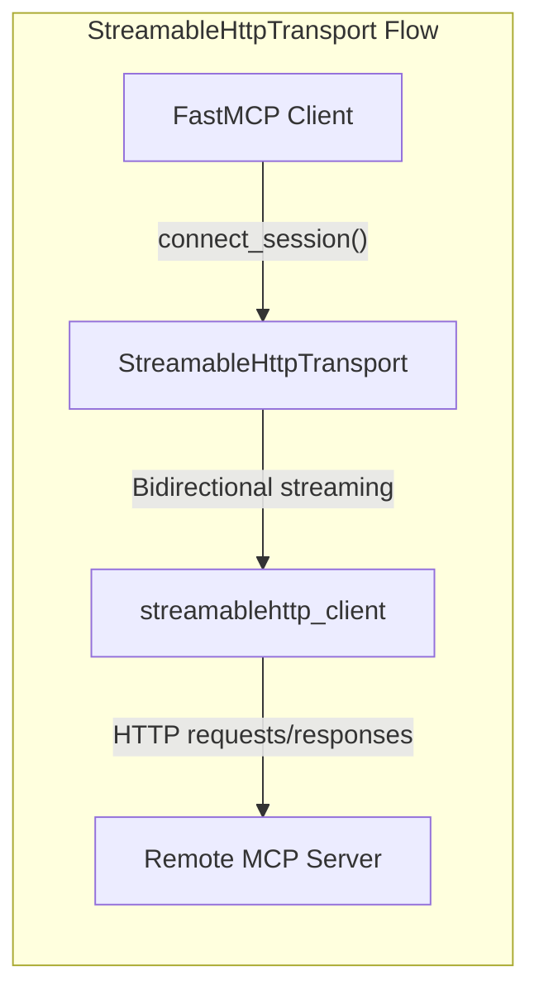

**Sources:** [src/fastmcp/client/transports.py:228-298]()

The `StreamableHttpTransport` provides efficient bidirectional communication for production deployments:

- **Authentication Support**: OAuth and Bearer token authentication [src/fastmcp/client/transports.py:256-261]()
- **Header Forwarding**: Automatic forwarding of HTTP headers in proxy scenarios [src/fastmcp/client/transports.py:274]()
- **Timeout Configuration**: Configurable request timeouts [src/fastmcp/client/transports.py:280-281]()

### SSETransport (Legacy)

The `SSETransport` maintains compatibility with older Server-Sent Events implementations but is superseded by `StreamableHttpTransport` for new deployments [src/fastmcp/client/transports.py:156-226]().

## In-Memory Transport

The `FastMCPTransport` enables direct communication with FastMCP server instances within the same Python process.

### In-Memory Communication Flow

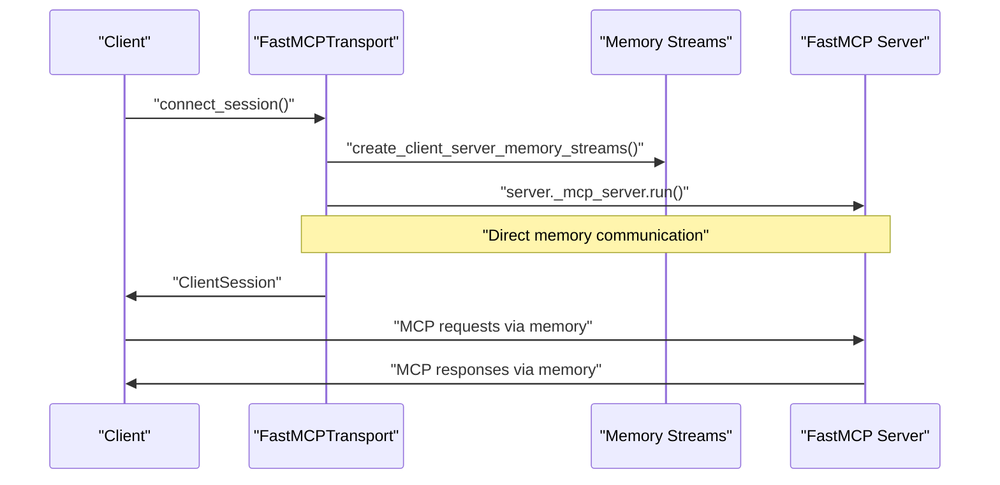

**Sources:** [src/fastmcp/client/transports.py:763-815]()

Key characteristics of in-memory transport:
- **Zero Network Overhead**: Direct method calls within same process
- **Shared Environment**: Full access to client process environment variables
- **Exception Control**: Configurable exception raising via `raise_exceptions` parameter [src/fastmcp/client/transports.py:772]()

## Multi-Server Configuration Transport

The `MCPConfigTransport` enables connections to multiple MCP servers through configuration-based routing.

### MCPConfig Architecture

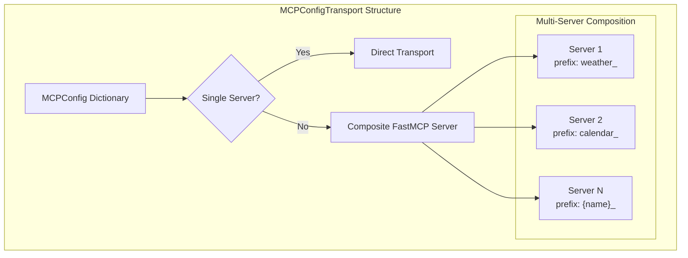

**Sources:** [src/fastmcp/client/transports.py:817-926]()

The transport automatically handles server composition:
- **Single Server**: Direct transport to the configured server
- **Multiple Servers**: Creates composite server with prefixed component names
- **Flexible Configuration**: Supports all transport types within the configuration

### Configuration Schema Support

```python
config = {
    "mcpServers": {
        "server_name": {
            "transport": "http",
            "url": "https://api.example.com/mcp",
            "headers": {"Authorization": "Bearer token"}
        }
    }
}
```

**Sources:** [src/fastmcp/client/transports.py:865-887]()

## Session Management and Connection Lifecycle

### Session Context Management

The transport layer provides async context manager support for proper session lifecycle, with sophisticated reentrant session management in the `Client` class:

### Client Session State Management

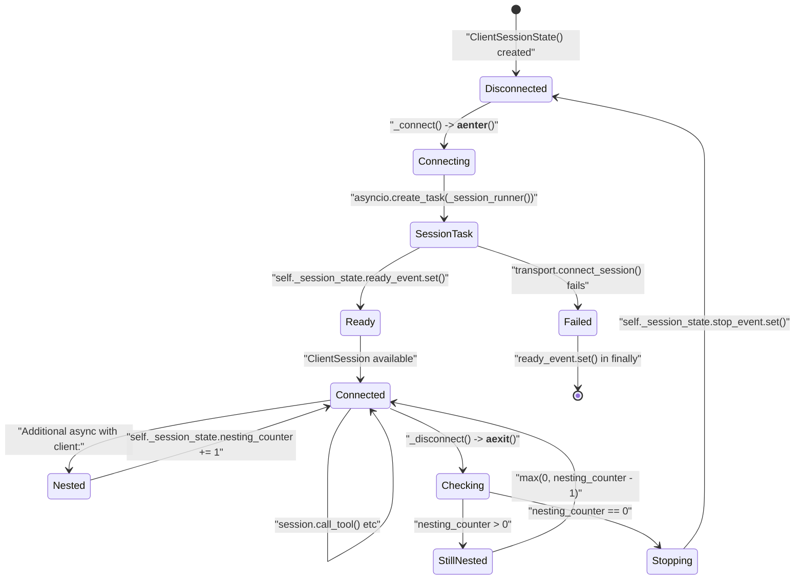

**Sources:** [src/fastmcp/client/client.py:80-96](), [src/fastmcp/client/client.py:373-463](), [src/fastmcp/client/client.py:465-488]()

The `Client` implements sophisticated reentrant context manager support using:
- `ClientSessionState` with `nesting_counter`, `session_task`, `ready_event`, and `stop_event`
- Background `_session_runner()` task for session lifecycle management
- Thread-safe session sharing across multiple concurrent `async with client:` blocks
- Automatic cleanup when the last context exits

### Transport Connect Session Protocol

All transports implement the `connect_session` async context manager method:

```python
@abc.abstractmethod
@contextlib.asynccontextmanager
async def connect_session(
    self, **session_kwargs: Unpack[SessionKwargs]
) -> AsyncIterator[ClientSession]:
```

**Sources:** [src/fastmcp/client/transports.py:84-106]()

This protocol ensures consistent connection lifecycle across all transport types while allowing transport-specific connection details.

### Authentication Integration

Remote transports support multiple authentication mechanisms:

| Auth Type | Implementation | Usage |
|---|---|---|
| Bearer Token | `BearerAuth` class | String token passed to `auth` parameter |
| OAuth | `OAuth` class | `auth="oauth"` with URL-based configuration |
| Custom Headers | Direct header passing | Custom authentication schemes |

**Sources:** [src/fastmcp/client/transports.py:184-189](), [src/fastmcp/client/transports.py:256-261]()

# Client Authentication


This page covers client-side authentication in FastMCP, focusing on OAuth flows, token storage, browser-based authentication, and integration with identity providers. This documentation explains how FastMCP clients authenticate with protected servers using industry-standard OAuth 2.0 and OpenID Connect protocols.

For server-side authentication configuration and identity providers, see [Authentication and Security](#4.1). For transport-specific authentication mechanisms, see [Transport Mechanisms](#3.1).

## Overview

FastMCP client authentication is built around OAuth 2.0 with OpenID Connect support, providing secure token-based authentication for MCP clients connecting to protected servers. The authentication system handles the complete OAuth flow, from initial authorization to token refresh and storage.

### Client Authentication Architecture

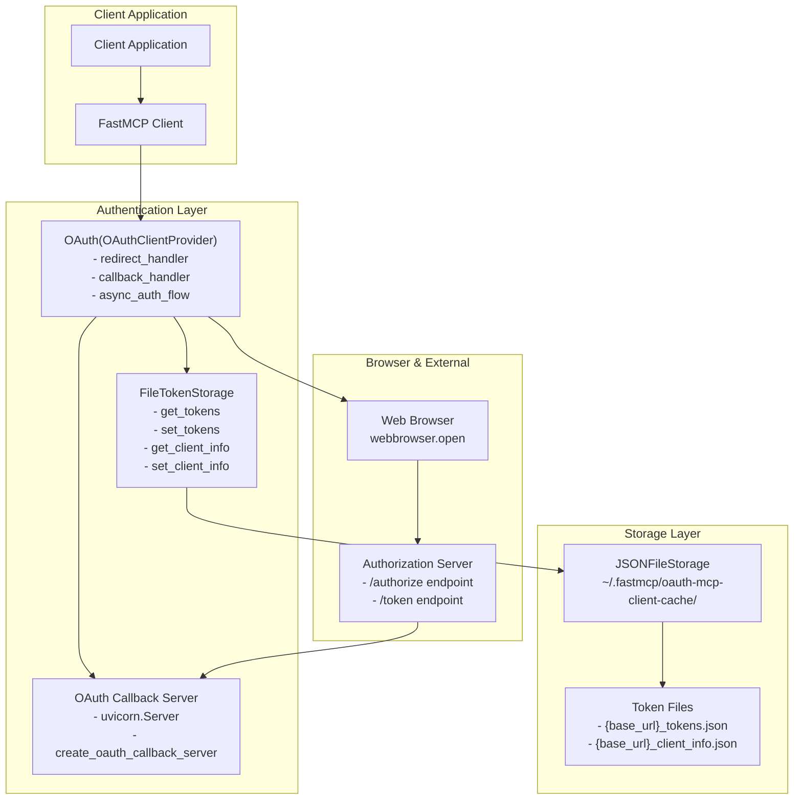

Sources: [src/fastmcp/client/auth/oauth.py:242-428](), [src/fastmcp/client/oauth_callback.py](), [src/fastmcp/utilities/storage.py]()

## OAuth Flow Implementation

The `OAuth` class implements the complete OAuth 2.0 authorization code flow with PKCE support, handling dynamic client registration, browser-based authorization, and token management.

### OAuth Provider Class Structure

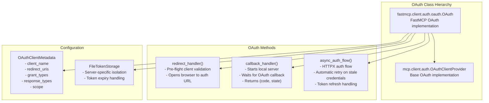

Sources: [src/fastmcp/client/auth/oauth.py:242-311](), [src/fastmcp/client/auth/oauth.py:322-374](), [src/fastmcp/client/auth/oauth.py:376-427]()

### Authorization Flow Process

The OAuth authorization flow follows these steps:

| Step | Method | Description | Error Handling |
|------|--------|-------------|----------------|
| 1 | `redirect_handler()` | Pre-flight validation, opens browser | Detects stale client_id (400 response) |
| 2 | `callback_handler()` | Starts local callback server | 5-minute timeout with graceful shutdown |
| 3 | Token Exchange | Exchanges auth code for tokens | Automatic retry on client errors |
| 4 | Token Storage | Saves tokens with absolute expiry | Validates token format and expiry |

Sources: [src/fastmcp/client/auth/oauth.py:322-341](), [src/fastmcp/client/auth/oauth.py:343-374]()

## Token Storage and Management

FastMCP implements sophisticated token storage with automatic expiry handling, server isolation, and format validation through the `FileTokenStorage` class.

### Token Storage Architecture

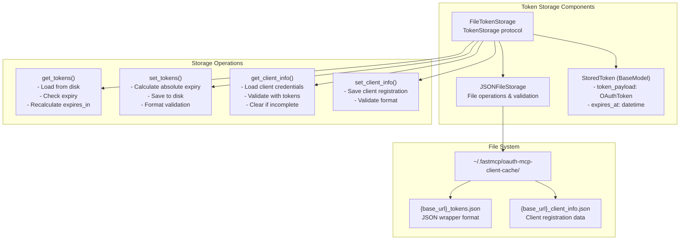

Sources: [src/fastmcp/client/auth/oauth.py:59-196](), [src/fastmcp/client/auth/oauth.py:44-52]()

### Token Expiry Handling

The token storage system uses absolute timestamps rather than relative `expires_in` values to ensure accurate expiry checking across application restarts:

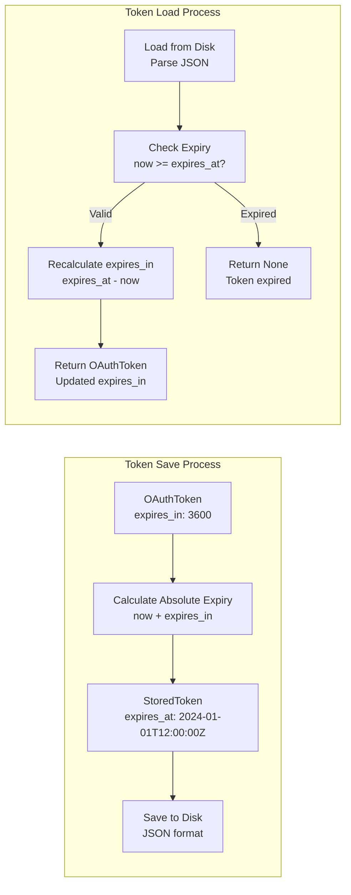

Sources: [src/fastmcp/client/auth/oauth.py:132-147](), [src/fastmcp/client/auth/oauth.py:96-130](), [tests/client/auth/test_oauth_token_expiry.py:13-164]()

## Browser-Based Authentication

FastMCP uses a browser-based OAuth flow that opens the user's default browser for authorization and runs a temporary local server to receive the OAuth callback.

### Browser Flow Implementation

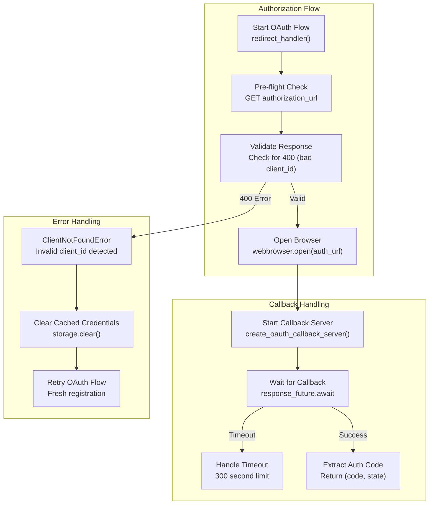

Sources: [src/fastmcp/client/auth/oauth.py:322-341](), [src/fastmcp/client/auth/oauth.py:343-374](), [src/fastmcp/client/auth/oauth.py:395-427]()

### Callback Server Configuration

The OAuth callback server uses dynamic port allocation and graceful shutdown:

| Configuration | Default | Description |
|---------------|---------|-------------|
| Port | `find_available_port()` | Dynamically allocated available port |
| Timeout | 300 seconds | Maximum wait time for user authorization |
| Redirect URI | `http://localhost:{port}/callback` | OAuth callback endpoint |
| Server Type | `uvicorn.Server` | ASGI server for handling callbacks |

Sources: [src/fastmcp/client/auth/oauth.py:275-276](), [src/fastmcp/utilities/http.py](), [src/fastmcp/client/oauth_callback.py]()

## Identity Provider Integration

FastMCP supports multiple identity providers through standardized OAuth 2.0 and OpenID Connect protocols. The authentication system is provider-agnostic, requiring only standard OAuth endpoints.

### Provider Configuration

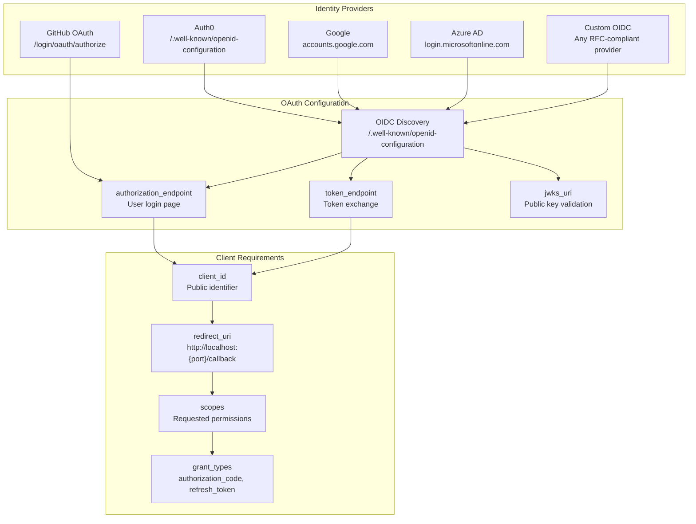

Sources: [src/fastmcp/server/auth/oidc_proxy.py:27-169](), [src/fastmcp/server/auth/providers/auth0.py:36-175]()

### Authentication Pre-flight Check

Before initiating OAuth flows, FastMCP can check if authentication is required:

```python
# Usage example from oauth.py
async def check_if_auth_required(
    mcp_url: str, httpx_kwargs: dict[str, Any] | None = None
) -> bool:
    """Check if the MCP endpoint requires authentication."""
```

This function tests the endpoint and returns `True` if authentication appears required based on HTTP status codes (401, 403) or WWW-Authenticate headers.

Sources: [src/fastmcp/client/auth/oauth.py:212-240]()

## Configuration and Usage

### Basic OAuth Configuration

```python
from fastmcp.client.auth.oauth import OAuth

oauth_provider = OAuth(
    mcp_url="https://api.example.com/mcp/",
    scopes=["openid", "profile", "email"],
    client_name="My FastMCP Client",
    token_storage_cache_dir=Path("~/.my-app/oauth-cache"),
    callback_port=8080  # Optional: fixed port
)
```

### Client Integration

```python
from fastmcp import Client

async with Client(
    "https://api.example.com/mcp/",
    auth=oauth_provider
) as client:
    # Client automatically handles OAuth flow
    tools = await client.list_tools()
```

### Token Storage Locations

The `FileTokenStorage` class stores tokens in server-specific files:

| File Type | Path Pattern | Purpose |
|-----------|--------------|---------|
| Tokens | `{base_url}_tokens.json` | Access/refresh tokens with expiry |
| Client Info | `{base_url}_client_info.json` | OAuth client registration data |
| Cache Dir | `~/.fastmcp/oauth-mcp-client-cache/` | Default storage location |

Sources: [src/fastmcp/client/auth/oauth.py:250-311](), [src/fastmcp/client/auth/oauth.py:55-86]()

### Error Handling and Recovery

The OAuth implementation includes automatic error recovery:

- **Stale Credentials**: Detects invalid client_id and clears cache for retry
- **Token Expiry**: Automatically refreshes expired tokens
- **Network Errors**: Graceful handling of connection issues
- **Timeout Handling**: 5-minute timeout with user-friendly messages

Sources: [src/fastmcp/client/auth/oauth.py:376-427](), [src/fastmcp/client/auth/oauth.py:38-41]()