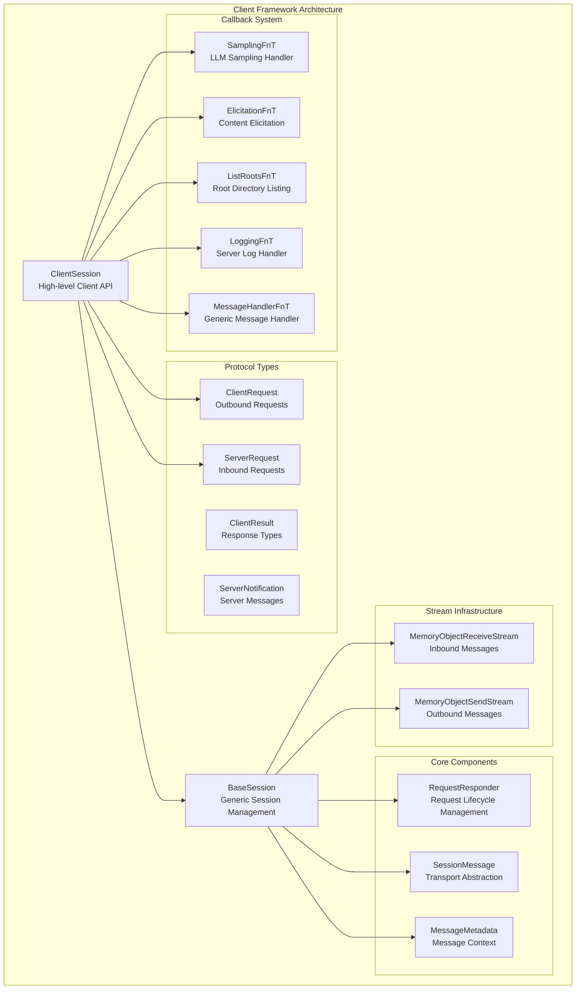
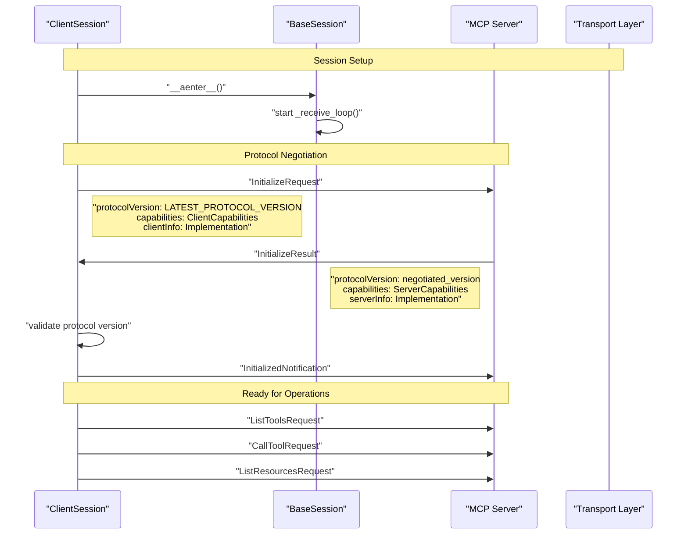
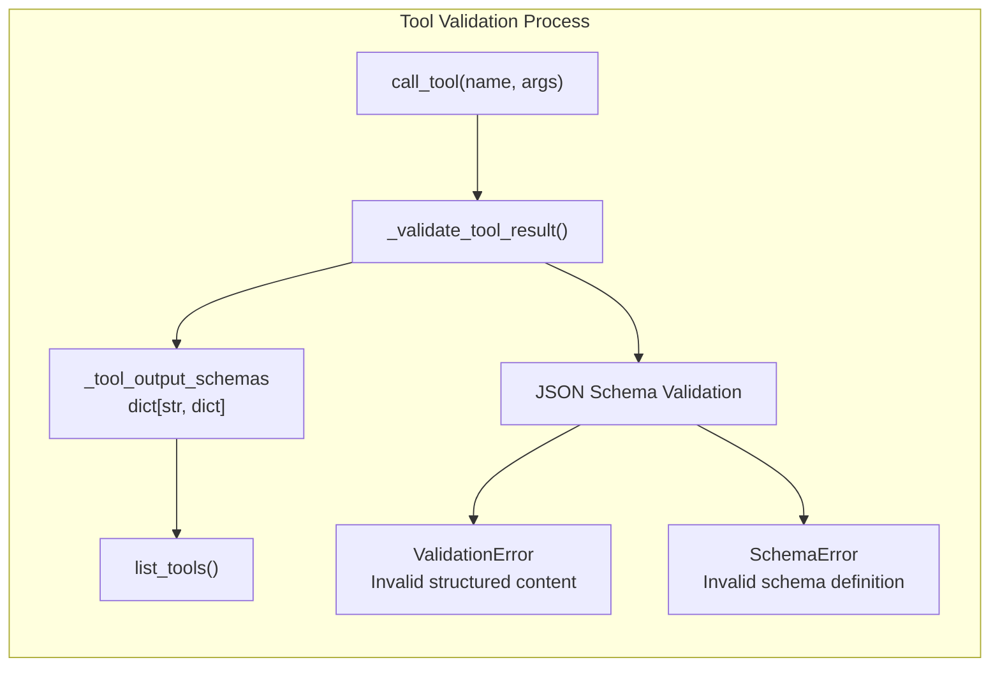
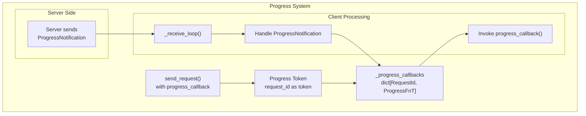
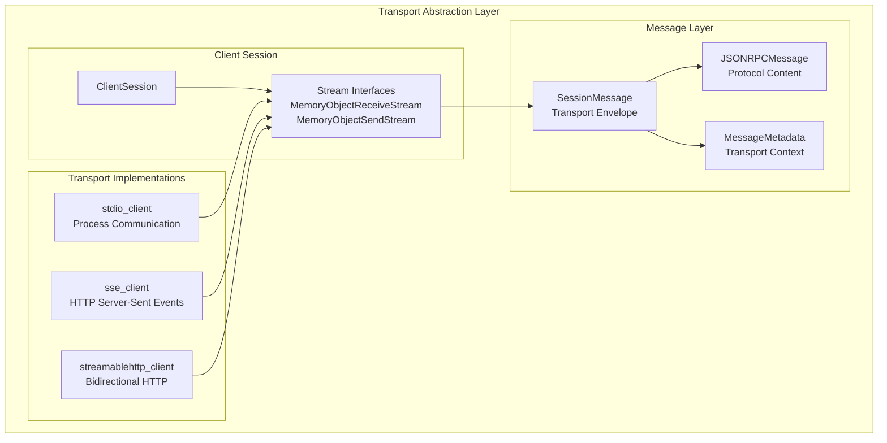
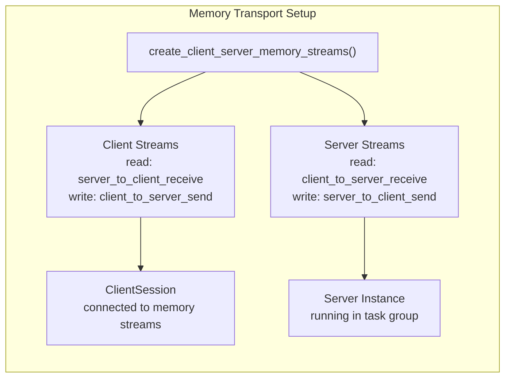

The Client Framework provides the core client-side components for connecting to and interacting with MCP servers. This framework handles session management, protocol communication, request/response patterns, and server capability discovery. It abstracts the underlying transport mechanisms while providing a high-level API for MCP operations.

For information about server-side implementations, see [FastMCP Server Framework](#2) and [Low-Level Server Implementation](#6). For transport-specific client implementations, see [Client Transports](#3.2). For authentication details, see [Client Authentication](#3.3).

## ClientSession Architecture

The `ClientSession` class serves as the primary interface for MCP client applications, built on top of the `BaseSession` foundation for session management and message handling.

**Sources:** [src/mcp/client/session.py:101-136](), [src/mcp/shared/session.py:159-200]()

## Session Lifecycle and Initialization

The client session follows a structured initialization process to establish protocol compatibility and exchange capability information with the server.

**Sources:** [src/mcp/client/session.py:137-174](), [tests/client/test_session.py:30-114]()

## Request and Response Handling

The framework implements a sophisticated request/response system with progress tracking, timeout management, and structured validation.

### Core Request Methods

| Method | Purpose | Request Type | Response Type |
|--------|---------|--------------|---------------|
| `call_tool()` | Execute server tools | `CallToolRequest` | `CallToolResult` |
| `list_tools()` | Discover available tools | `ListToolsRequest` | `ListToolsResult` |
| `read_resource()` | Access server resources | `ReadResourceRequest` | `ReadResourceResult` |
| `list_resources()` | Discover available resources | `ListResourcesRequest` | `ListResourcesResult` |
| `get_prompt()` | Retrieve prompt templates | `GetPromptRequest` | `GetPromptResult` |
| `complete()` | Get completion suggestions | `CompleteRequest` | `CompleteResult` |

**Sources:** [src/mcp/client/session.py:270-297](), [src/mcp/client/session.py:366-383]()

### Tool Output Validation

The client automatically validates structured tool outputs against server-provided schemas:

**Sources:** [src/mcp/client/session.py:298-319](), [src/mcp/client/session.py:377-381]()

## Progress and Notification System

The client framework supports bidirectional progress reporting and server-initiated notifications through callback functions and progress tokens.

### Progress Callback Integration

**Sources:** [src/mcp/shared/session.py:242-253](), [src/mcp/shared/session.py:389-399]()

### Server Request Handling

The client can handle server-initiated requests through configurable callback functions:

| Callback Type | Purpose | Default Behavior |
|---------------|---------|------------------|
| `SamplingFnT` | Handle LLM sampling requests | Returns "not supported" error |
| `ElicitationFnT` | Handle content elicitation | Returns "not supported" error |
| `ListRootsFnT` | Handle root directory listing | Returns "not supported" error |
| `LoggingFnT` | Handle server log messages | No-op (silent) |
| `MessageHandlerFnT` | Handle all incoming messages | No-op checkpoint |

**Sources:** [src/mcp/client/session.py:21-96](), [src/mcp/client/session.py:388-434]()

## Transport Integration

The client framework abstracts transport details through stream-based interfaces, allowing it to work with various transport mechanisms.

**Sources:** [src/mcp/client/session.py:110-128](), [src/mcp/client/__main__.py:36-64]()

## Testing and Development Utilities

The framework includes memory-based transport utilities for testing and development scenarios.

### Memory Transport Factory

The `create_connected_server_and_client_session()` function provides a complete testing environment with in-memory communication:

**Sources:** [src/mcp/shared/memory.py:28-50](), [src/mcp/shared/memory.py:53-99]()

### Error Handling and Exception Management

The client framework provides comprehensive error handling for various failure scenarios:

| Error Type | Source | Handling |
|------------|--------|----------|
| `TimeoutError` | Request timeout | Converted to `McpError` with timeout details |
| `JSONRPCError` | Server error response | Converted to `McpError` with server error |
| `ValidationError` | Tool output validation | Runtime error with validation details |
| `anyio.ClosedResourceError` | Transport closure | Graceful session termination |
| `RuntimeError` | Protocol version mismatch | Immediate session failure |

**Sources:** [src/mcp/shared/session.py:273-283](), [src/mcp/shared/session.py:416-436](), [src/mcp/client/session.py:314-318]()