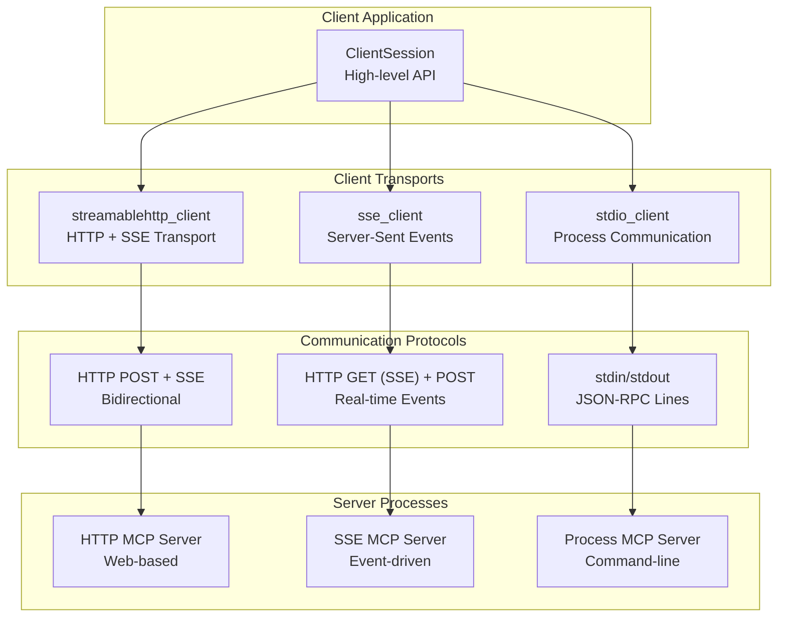
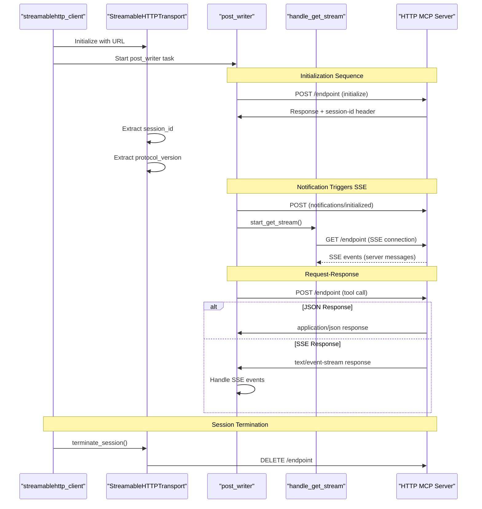
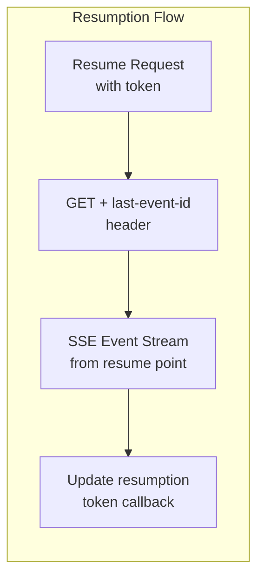
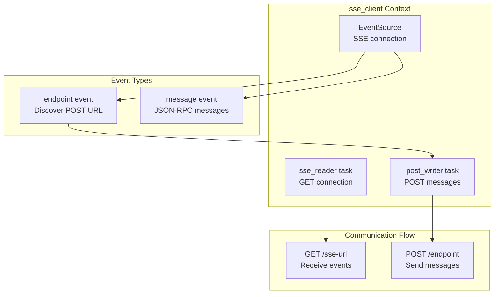
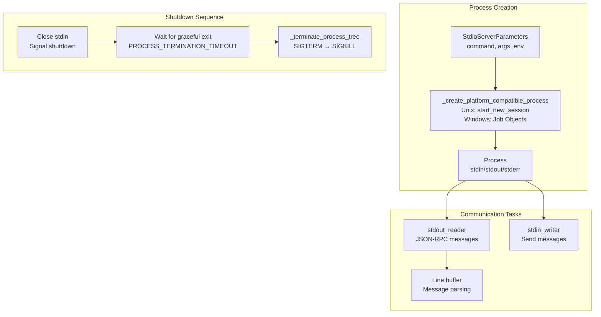
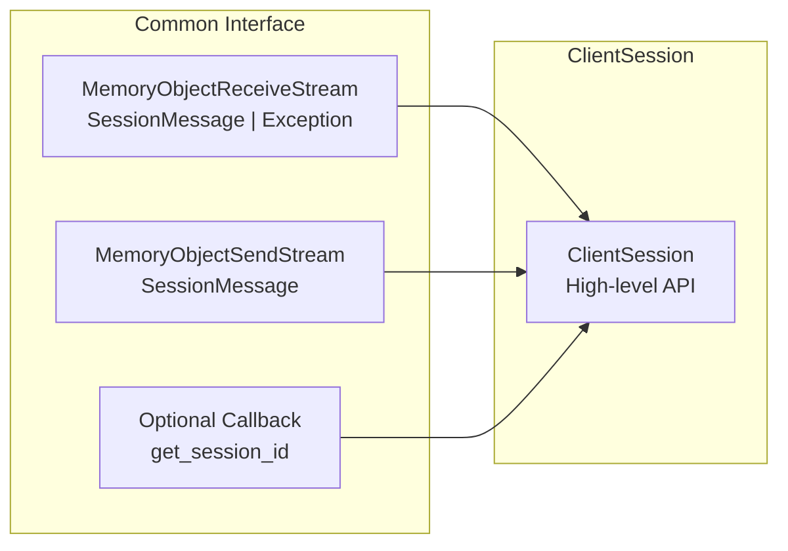

This document covers the client-side transport implementations in the MCP Python SDK that enable communication between MCP clients and servers. Client transports handle the low-level protocol communication, message serialization, and connection management for different communication channels.

For information about the high-level `ClientSession` that uses these transports, see [ClientSession Core](#3.1). For server-side transport implementations, see the Transport Layer sections [StreamableHTTP Transport](#5.1), [Server-Sent Events (SSE) Transport](#5.2), and [STDIO Transport](#5.3).

## Transport Architecture Overview

The MCP client framework provides three primary transport implementations, each designed for different deployment scenarios and communication patterns.

Sources: [src/mcp/client/streamable_http.py:1-514](), [src/mcp/client/sse.py:1-145](), [src/mcp/client/stdio/__init__.py:1-279]()

## StreamableHTTP Transport

The `StreamableHTTPTransport` is the most sophisticated client transport, supporting bidirectional HTTP communication with session management, resumption capabilities, and both JSON and Server-Sent Events responses.

### Core Components

The transport consists of the main `StreamableHTTPTransport` class and the `streamablehttp_client` async context manager:

| Component | Purpose | Location |
|-----------|---------|----------|
| `StreamableHTTPTransport` | Core transport logic | [src/mcp/client/streamable_http.py:74-442]() |
| `streamablehttp_client` | Client context manager | [src/mcp/client/streamable_http.py:445-514]() |
| `RequestContext` | Request operation context | [src/mcp/client/streamable_http.py:62-72]() |

### Message Flow Architecture

Sources: [src/mcp/client/streamable_http.py:366-422](), [src/mcp/client/streamable_http.py:192-219](), [src/mcp/client/streamable_http.py:254-295]()

### Session Management

The StreamableHTTP transport implements sophisticated session management with resumption support:

- **Session ID Extraction**: Automatically extracts session IDs from response headers [src/mcp/client/streamable_http.py:126-135]()
- **Protocol Version Negotiation**: Parses and stores protocol version from initialization responses [src/mcp/client/streamable_http.py:136-150]()
- **Request Header Preparation**: Adds session ID and protocol version to subsequent requests [src/mcp/client/streamable_http.py:109-117]()
- **Session Termination**: Sends DELETE requests to clean up server resources [src/mcp/client/streamable_http.py:423-438]()

### Resumption Capabilities

The transport supports resumption of interrupted sessions using resumption tokens:

Sources: [src/mcp/client/streamable_http.py:220-253](), [src/mcp/client/streamable_http.py:151-191]()

## SSE Transport

The `sse_client` provides a simpler transport focused on real-time communication using Server-Sent Events for server-to-client messages and HTTP POST for client-to-server messages.

### Architecture

Sources: [src/mcp/client/sse.py:24-145](), [src/mcp/client/sse.py:68-113](), [src/mcp/client/sse.py:114-133]()

### Endpoint Discovery

The SSE transport implements a discovery mechanism where the server provides the POST endpoint URL via SSE events:

1. **Initial Connection**: Client connects to SSE endpoint via GET request [src/mcp/client/sse.py:60-67]()
2. **Endpoint Event**: Server sends `endpoint` event with POST URL [src/mcp/client/sse.py:75-92]()
3. **Security Validation**: Client validates endpoint origin matches connection origin [src/mcp/client/sse.py:79-90]()
4. **Post Writer Activation**: POST writer task starts with discovered endpoint [src/mcp/client/sse.py:134-136]()

## STDIO Transport

The `stdio_client` manages communication with MCP servers running as separate processes, using standard input/output streams for JSON-RPC message exchange.

### Process Lifecycle

Sources: [src/mcp/client/stdio/__init__.py:106-217](), [src/mcp/client/stdio/__init__.py:235-279](), [src/mcp/client/stdio/__init__.py:139-165]()

### Platform-Specific Process Management

The STDIO transport implements platform-specific process creation and termination:

| Platform | Process Creation | Termination Strategy |
|----------|------------------|---------------------|
| Unix | `start_new_session=True` for process groups | `os.killpg()` for atomic group termination |
| Windows | Job Objects via `create_windows_process` | Job Object termination for child cleanup |

Sources: [src/mcp/client/stdio/__init__.py:235-260](), [src/mcp/client/stdio/__init__.py:262-279]()

### Message Processing

The transport handles JSON-RPC message processing with robust error handling:

- **Line-based Parsing**: Buffers input and splits on newlines [src/mcp/client/stdio/__init__.py:144-153]()
- **JSON Validation**: Validates each line as JSON-RPC message [src/mcp/client/stdio/__init__.py:154-162]()
- **Encoding Support**: Configurable text encoding and error handling [src/mcp/client/stdio/__init__.py:89-103]()

## Transport Selection and Usage Patterns

### Transport Comparison

| Transport | Use Case | Pros | Cons |
|-----------|----------|------|------|
| StreamableHTTP | Web services, production deployments | Session management, resumption, scalable | Complex, requires HTTP server |
| SSE | Real-time applications, event-driven | Simple, real-time events | Limited to web contexts |
| STDIO | CLI tools, development, local processes | Direct process control, simple setup | Process management complexity |

### Integration with ClientSession

All client transports follow the same interface pattern for integration with `ClientSession`:

Sources: [src/mcp/client/streamable_http.py:453-459](), [src/mcp/client/sse.py:45-49](), [src/mcp/client/stdio/__init__.py:111-115]()

## Error Handling and Resilience

### Connection Error Patterns

Each transport implements specific error handling strategies:

- **StreamableHTTP**: HTTP status code handling, session termination on 404, resumption error recovery [src/mcp/client/streamable_http.py:266-277]()
- **SSE**: Connection error recovery, origin validation errors [src/mcp/client/sse.py:108-110]()
- **STDIO**: Process creation failures, graceful shutdown with timeout escalation [src/mcp/client/stdio/__init__.py:191-217]()

### Timeout Management

Transport-specific timeout configurations:

| Transport | Timeout Type | Default | Configuration |
|-----------|--------------|---------|---------------|
| StreamableHTTP | HTTP operations | 30s | `timeout` parameter |
| StreamableHTTP | SSE read | 5 minutes | `sse_read_timeout` parameter |
| SSE | HTTP operations | 5s | `timeout` parameter |
| SSE | SSE read | 5 minutes | `sse_read_timeout` parameter |
| STDIO | Process termination | 2s | `PROCESS_TERMINATION_TIMEOUT` |

Sources: [src/mcp/client/streamable_http.py:77-100](), [src/mcp/client/sse.py:27-28](), [src/mcp/client/stdio/__init__.py:47-48]()