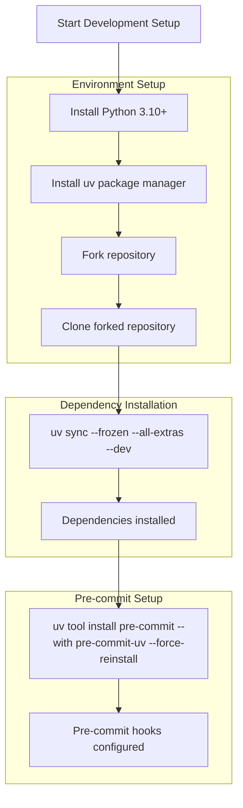
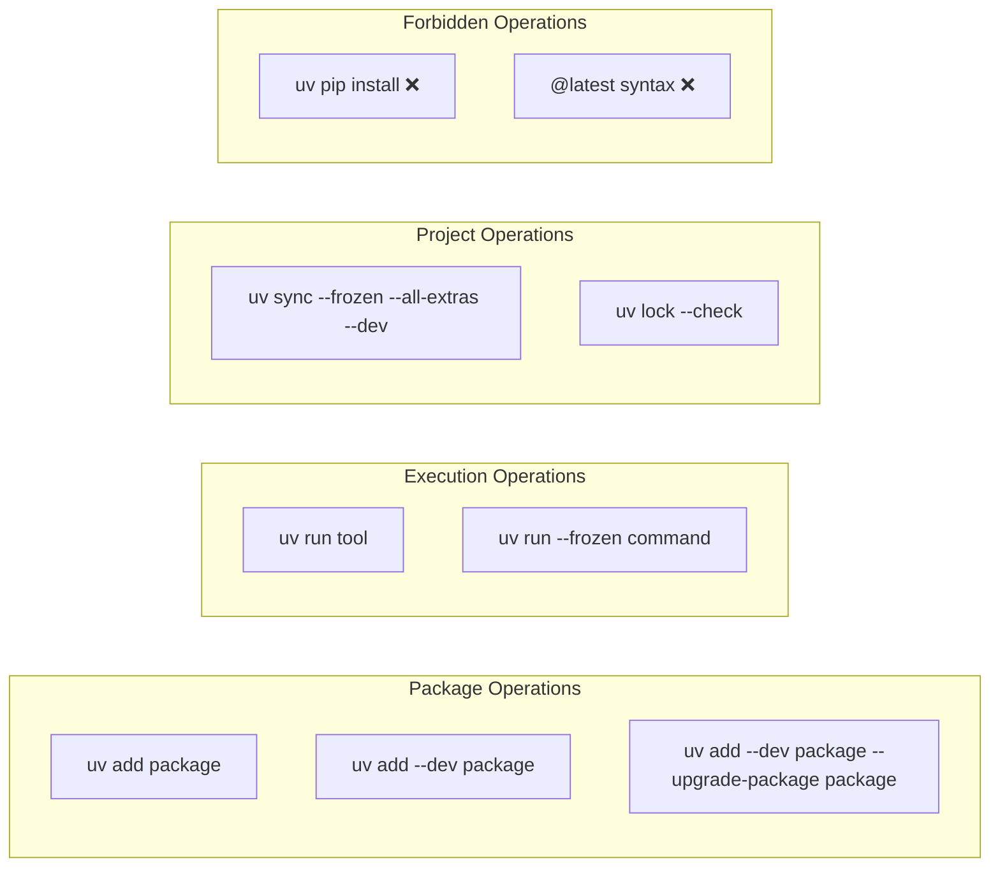
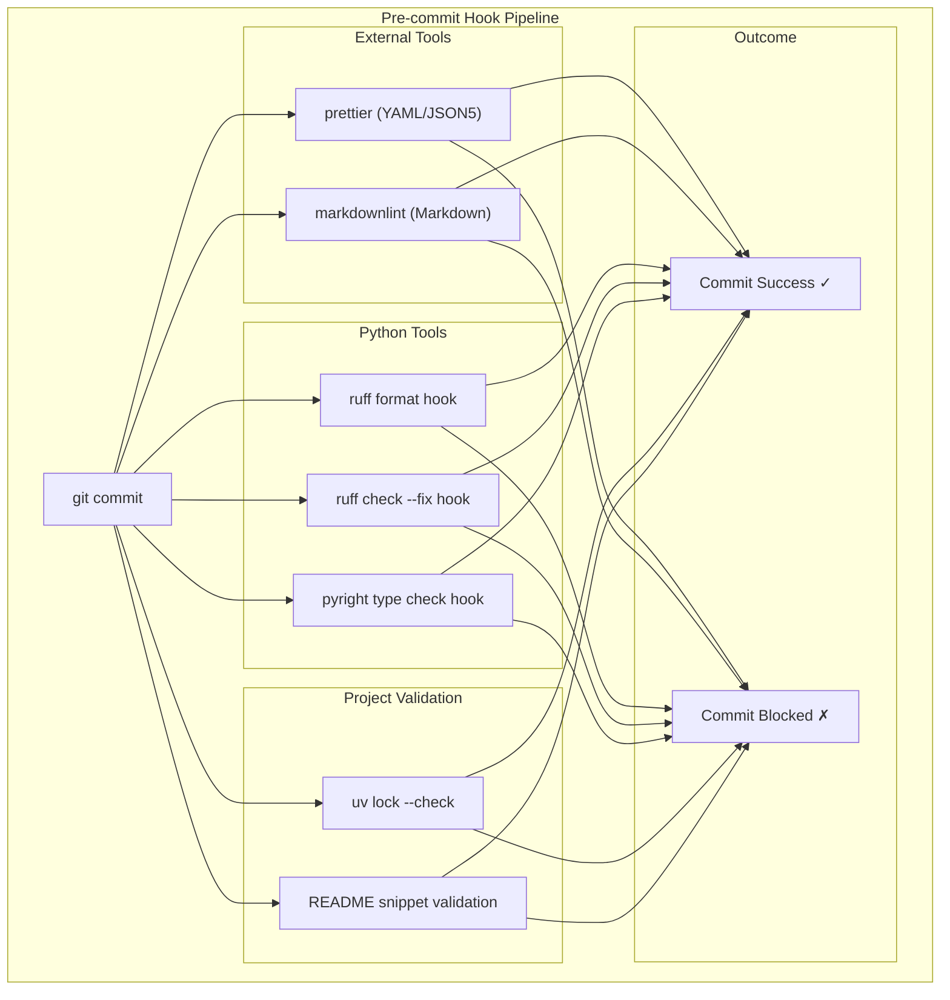
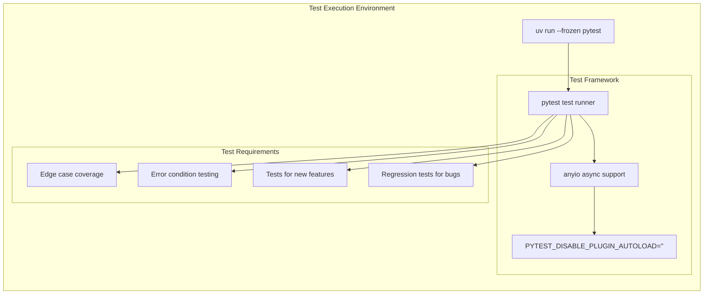
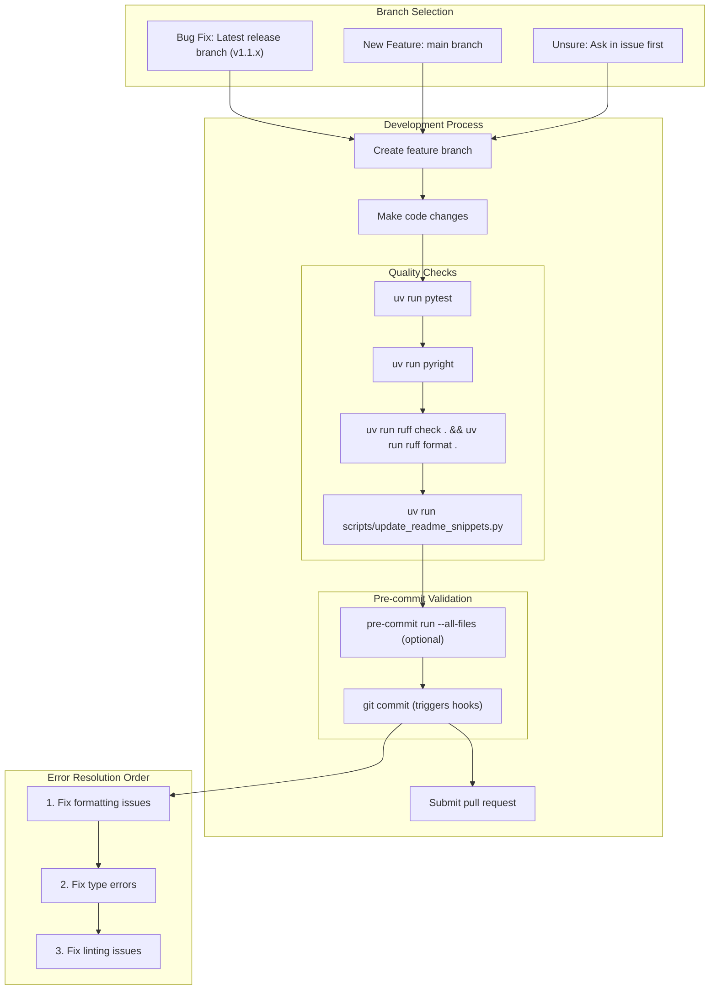

This document covers the development setup, code quality standards, pre-commit hooks, and contribution workflow for the MCP Python SDK. It provides the complete toolchain configuration and processes for maintaining code quality using uv and modern Python development tools.

For information about CLI commands and project management workflows, see [MCP CLI Commands](#8.1). For Claude Desktop integration setup, see [Claude Desktop Integration](#8.3).

## Development Setup Requirements

The MCP Python SDK uses a modern Python development stack with strict tooling requirements to ensure code quality and consistency.

### Core Requirements

| Requirement | Version | Purpose |
|-------------|---------|---------|
| Python | 3.10+ | Runtime environment |
| uv | Latest | Package and project management |
| pre-commit | Latest | Git hook automation |

### Installation Process

The development environment setup follows a specific sequence to ensure all tools are properly configured:

**Development Environment Setup Flow**

Sources: [CONTRIBUTING.md:7-22](), [CLAUDE.md:7-12]()

## Package Management with uv

The project exclusively uses `uv` for all package management operations. Traditional `pip` usage is explicitly forbidden to ensure consistent dependency resolution and lock file management.

### uv Command Patterns

**uv Package Management Commands**

| Operation | Command | Purpose |
|-----------|---------|---------|
| Add dependency | `uv add package` | Install production dependency |
| Add dev dependency | `uv add --dev package` | Install development dependency |
| Upgrade package | `uv add --dev package --upgrade-package package` | Update specific package |
| Run tool | `uv run tool` | Execute tool with project dependencies |
| Sync dependencies | `uv sync --frozen --all-extras --dev` | Install all dependencies from lock |
| Check lock file | `uv lock --check` | Verify lock file is current |

Sources: [CLAUDE.md:7-12](), [.pre-commit-config.yaml:48-52]()

## Code Quality Standards

The project enforces strict code quality standards through automated tooling and explicit requirements for all contributions.

### Code Quality Tools Integration

```mermaid
graph TB
    subgraph "Code Quality Pipeline"
        Code["Python Source Code"]
        
        subgraph "Formatting"
            RuffFormat["ruff format"]
            FormatCheck["Line length: 120 chars"]
        end
        
        subgraph "Linting"
            RuffCheck["ruff check --fix"]
            ImportSort["Import sorting (I001)"]
            UnusedImports["Unused import detection"]
        end
        
        subgraph "Type Checking"
            Pyright["pyright type checker"]
            TypeHints["Explicit type hints required"]
            NoneChecks["Optional type narrowing"]
        end
        
        subgraph "Documentation"
            Docstrings["Public API docstrings"]
            SmallFunctions["Focused function design"]
        end
    end
    
    Code --> RuffFormat
    RuffFormat --> FormatCheck
    FormatCheck --> RuffCheck
    RuffCheck --> ImportSort
    ImportSort --> UnusedImports
    UnusedImports --> Pyright
    Pyright --> TypeHints
    TypeHints --> NoneChecks
    NoneChecks --> Docstrings
    Docstrings --> SmallFunctions
```

**Code Quality Tool Chain**

### Quality Requirements

| Requirement | Tool | Configuration |
|-------------|------|---------------|
| Line length | ruff | 120 characters maximum |
| Type hints | pyright | Required for all code |
| Docstrings | manual | Required for public APIs |
| Import sorting | ruff | I001 rule enforcement |
| Function size | manual | Small, focused functions |

### Tool Execution Commands

| Tool | Format Command | Check Command |
|------|----------------|---------------|
| ruff | `uv run --frozen ruff format .` | `uv run --frozen ruff check .` |
| ruff (with fix) | N/A | `uv run --frozen ruff check . --fix` |
| pyright | N/A | `uv run --frozen pyright` |

Sources: [CLAUDE.md:14-20](), [CLAUDE.md:60-78](), [.pre-commit-config.yaml:26-46]()

## Pre-commit Hooks System

The project uses an automated pre-commit hook system that runs multiple quality checks on every commit to ensure code standards are maintained.

### Pre-commit Hook Configuration

**Pre-commit Hook Execution Flow**

### Hook Configuration Details

The pre-commit configuration in [.pre-commit-config.yaml:1-59]() defines the complete hook pipeline:

| Hook | Type | Purpose | Files |
|------|------|---------|-------|
| prettier | External | Format YAML/JSON5 | `types_or: [yaml, json5]` |
| markdownlint | External | Lint Markdown files | `types: [markdown]` |
| ruff-format | Local | Python code formatting | `types: [python]` |
| ruff | Local | Python linting with auto-fix | `types: [python]` |
| pyright | Local | Python type checking | `types: [python]` |
| uv-lock-check | Local | Verify uv.lock currency | `^(pyproject\.toml\|uv\.lock)$` |
| readme-snippets | Local | Validate README code snippets | README and example files |

### Pre-commit Execution

| Operation | Command | Purpose |
|-----------|---------|---------|
| Install hooks | `uv tool install pre-commit --with pre-commit-uv --force-reinstall` | Set up pre-commit system |
| Run on all files | `pre-commit run --all-files` | Manual execution of all hooks |
| Automatic execution | Triggered on `git commit` | Automatic quality gate |

Sources: [.pre-commit-config.yaml:1-59](), [CONTRIBUTING.md:17-22](), [CLAUDE.md:80-87]()

## Testing Framework

The project uses pytest with anyio for async testing, with specific configuration requirements to ensure consistent test execution.

### Testing Configuration

**Testing Framework Architecture**

### Testing Requirements

| Requirement | Implementation | Notes |
|-------------|----------------|-------|
| Test runner | pytest | Framework: `uv run --frozen pytest` |
| Async testing | anyio | NOT asyncio for async tests |
| Coverage | Edge cases and errors | Required for all code paths |
| New features | Tests required | Must include tests with feature |
| Bug fixes | Regression tests | Must include test preventing regression |

### Test Execution Commands

| Command | Purpose | Environment Variable |
|---------|---------|---------------------|
| `uv run --frozen pytest` | Standard test execution | None |
| `PYTEST_DISABLE_PLUGIN_AUTOLOAD="" uv run --frozen pytest` | Plugin conflict resolution | `PYTEST_DISABLE_PLUGIN_AUTOLOAD=""` |

Sources: [CLAUDE.md:21-27](), [CLAUDE.md:111-114](), [CONTRIBUTING.md:34-38]()

## Development Workflow

The development workflow integrates all quality tools into a structured process that ensures code quality and proper contribution management.

### Complete Development Workflow

**Complete Development Workflow Process**

### Error Resolution Priority

The development guidelines specify a specific order for resolving CI failures:

| Priority | Issue Type | Common Solutions |
|----------|------------|------------------|
| 1 | Formatting | `uv run ruff format .` |
| 2 | Type errors | Add None checks, type narrowing, verify signatures |
| 3 | Linting | `uv run ruff check . --fix` |

### Git Commit Standards

| Scenario | Command | Purpose |
|----------|---------|---------|
| Bug fixes from user reports | `git commit --trailer "Reported-by:<name>"` | Credit user reporting |
| GitHub issue fixes | `git commit --trailer "Github-Issue:#<number>"` | Link to issue |
| General commits | Standard commit message | No special trailers |

**Prohibited:** Any mention of co-authored-by or development tools in commit messages.

Sources: [CONTRIBUTING.md:25-66](), [CLAUDE.md:28-44](), [CLAUDE.md:89-123]()

## Exception Handling Standards

The project enforces specific exception handling patterns to ensure proper error reporting and debugging capabilities.

### Exception Handling Rules

| Rule | Implementation | Example |
|------|----------------|---------|
| Logging | Use `logger.exception()` not `logger.error()` | `logger.exception("Failed")` |
| Message format | Don't include exception in message | NOT `logger.exception(f"Failed: {e}")` |
| Specific exceptions | Catch specific types where possible | `except (OSError, PermissionError):` |
| General exceptions | Only for top-level handlers | `except Exception:` (limited use) |

### Exception Categories

| Operation Type | Recommended Exceptions | Purpose |
|----------------|----------------------|---------|
| File operations | `(OSError, PermissionError)` | Handle file system errors |
| JSON operations | `json.JSONDecodeError` | Handle JSON parsing errors |
| Network operations | `(ConnectionError, TimeoutError)` | Handle network failures |
| Top-level handlers | `Exception` | Prevent crashes in critical code |

Sources: [CLAUDE.md:124-135]()