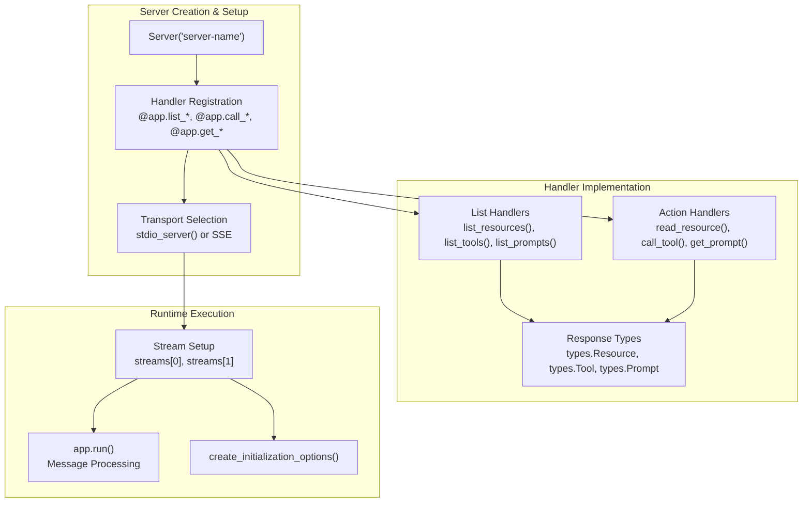
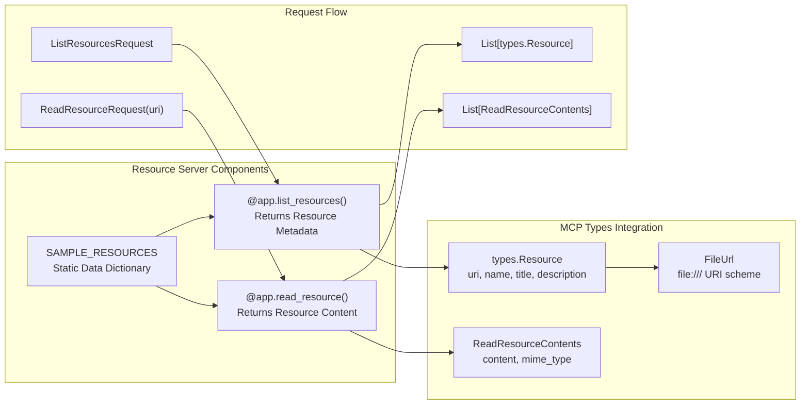
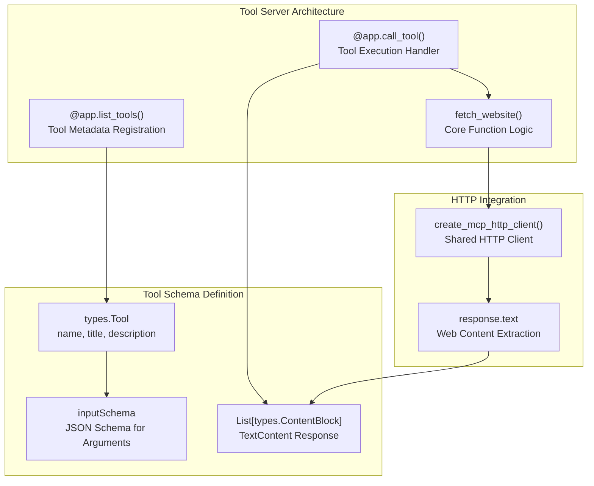
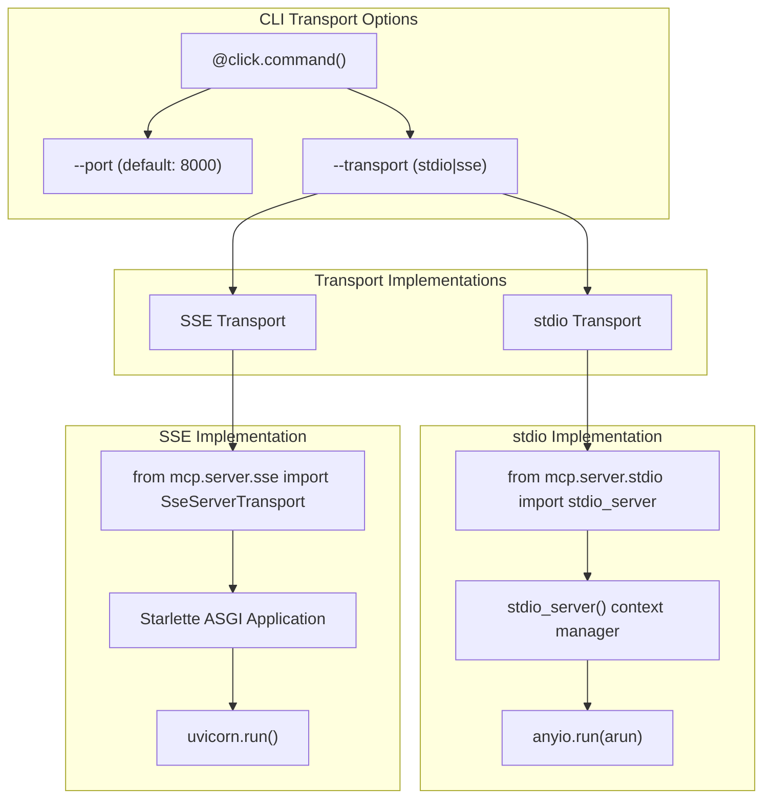

This document provides practical examples and tutorials for building MCP servers and clients using the Python SDK. It demonstrates both low-level server implementations and high-level patterns, showing how to create functional MCP servers that expose tools, resources, and prompts to clients.

For detailed FastMCP framework usage with decorators, see [FastMCP Server Framework](#2). For client implementation patterns, see [Client Framework](#3). For low-level protocol details, see [Protocol & Message System](#4).

## Overview of Example Categories

The MCP Python SDK includes several reference implementations that demonstrate core functionality:

| Example Type | Purpose | Key Components |
|--------------|---------|----------------|
| **Resource Server** | Expose data and content | `list_resources()`, `read_resource()` handlers |
| **Tool Server** | Provide executable functions | `list_tools()`, `call_tool()` handlers |
| **Prompt Server** | Offer prompt templates | `list_prompts()`, `get_prompt()` handlers |

All examples support multiple transport protocols (stdio, SSE) and follow consistent patterns using the low-level `Server` class from `mcp.server.lowlevel`.

## Low-Level Server Implementation Patterns

### Basic Server Structure

The foundation of all MCP servers follows this pattern:

**Sources:** [examples/servers/simple-resource/mcp_simple_resource/server.py:34-93](), [examples/servers/simple-tool/mcp_simple_tool/server.py:30-93](), [examples/servers/simple-prompt/mcp_simple_prompt/server.py:42-112]()

### Resource Server Example

The resource server demonstrates how to expose readable data sources through the MCP protocol:

**Key Implementation Details:**

- **Resource Registry**: [examples/servers/simple-resource/mcp_simple_resource/server.py:9-22]() defines `SAMPLE_RESOURCES` dictionary containing static content
- **List Handler**: [examples/servers/simple-resource/mcp_simple_resource/server.py:36-47]() creates `types.Resource` objects with `FileUrl` URIs
- **Read Handler**: [examples/servers/simple-resource/mcp_simple_resource/server.py:49-58]() parses URIs and returns `ReadResourceContents`

**Sources:** [examples/servers/simple-resource/mcp_simple_resource/server.py:9-58]()

### Tool Server Example

The tool server shows how to expose executable functions that clients can invoke:

**Key Implementation Details:**

- **Tool Function**: [examples/servers/simple-tool/mcp_simple_tool/server.py:11-18]() implements `fetch_website()` with `create_mcp_http_client`
- **Schema Definition**: [examples/servers/simple-tool/mcp_simple_tool/server.py:47-56]() defines JSON schema for `url` parameter
- **Tool Execution**: [examples/servers/simple-tool/mcp_simple_tool/server.py:32-38]() validates arguments and calls core function

**Sources:** [examples/servers/simple-tool/mcp_simple_tool/server.py:11-58]()

### Prompt Server Example

The prompt server demonstrates how to create parameterized prompt templates:

**Key Implementation Details:**

- **Message Creation**: [examples/servers/simple-prompt/mcp_simple_prompt/server.py:8-30]() implements `create_messages()` function with optional context and topic
- **Prompt Registration**: [examples/servers/simple-prompt/mcp_simple_prompt/server.py:44-64]() defines `types.Prompt` with `types.PromptArgument` specifications
- **Template Logic**: [examples/servers/simple-prompt/mcp_simple_prompt/server.py:66-77]() processes arguments and returns `types.GetPromptResult`

**Sources:** [examples/servers/simple-prompt/mcp_simple_prompt/server.py:8-77]()

## Transport Configuration Patterns

All example servers support dual transport modes using a consistent CLI pattern:

### Transport Selection Logic

**Implementation Details:**

- **CLI Setup**: [examples/servers/simple-resource/mcp_simple_resource/server.py:25-32]() defines consistent command-line interface
- **stdio Transport**: [examples/servers/simple-resource/mcp_simple_resource/server.py:84-91]() uses `stdio_server()` context manager with `anyio.run()`
- **SSE Transport**: [examples/servers/simple-resource/mcp_simple_resource/server.py:60-83]() integrates `SseServerTransport` with Starlette ASGI application

**Sources:** [examples/servers/simple-resource/mcp_simple_resource/server.py:25-93](), [examples/servers/simple-tool/mcp_simple_tool/server.py:21-93](), [examples/servers/simple-prompt/mcp_simple_prompt/server.py:33-112]()

## Common Development Patterns

### Error Handling
All examples implement consistent error handling patterns:
- Resource servers validate URIs and check resource existence [examples/servers/simple-resource/mcp_simple_resource/server.py:50-56]()
- Tool servers validate tool names and required arguments [examples/servers/simple-tool/mcp_simple_tool/server.py:34-37]()
- Prompt servers validate prompt names before processing [examples/servers/simple-prompt/mcp_simple_prompt/server.py:68-69]()

### Type System Integration
Examples demonstrate proper use of MCP type system:
- Import `mcp.types` for protocol types [examples/servers/simple-resource/mcp_simple_resource/server.py:3]()
- Use `types.Resource`, `types.Tool`, `types.Prompt` for metadata [examples/servers/simple-resource/mcp_simple_resource/server.py:39-45]()
- Return appropriate content types like `ReadResourceContents` and `TextContent` [examples/servers/simple-resource/mcp_simple_resource/server.py:58]()

For more advanced server implementations using the FastMCP framework, see [Server Examples](#9.1). For client usage examples, see [Client Examples](#9.2).