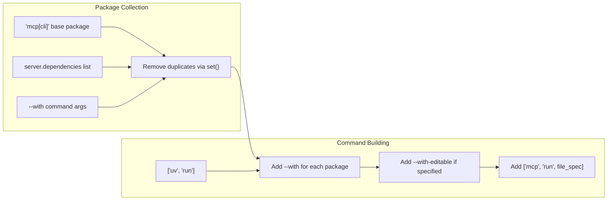

def version() -> None:
    try:
        version = importlib.metadata.version("mcp")
        print(f"MCP version {version}")
    except importlib.metadata.PackageNotFoundError:
        print("MCP version unknown (package not installed)")
        sys.exit(1)
```

Sources: [src/mcp/cli/cli.py:211-219]()

## Dependency Management Integration

All CLI commands integrate with `uv` for dependency management:

### UV Command Construction



Sources: [src/mcp/cli/cli.py:65-85](), [src/mcp/cli/claude.py:101-125]()

### UV Path Resolution

The CLI automatically locates the `uv` executable using platform-appropriate methods:

- Uses `shutil.which("uv")` to find full path
- Falls back to `"uv"` string if not found in PATH
- Provides clear error messages for missing uv installation

Sources: [src/mcp/cli/claude.py:33-41]()