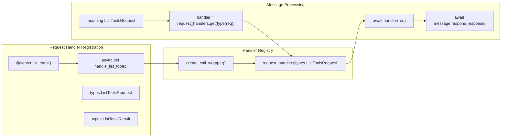
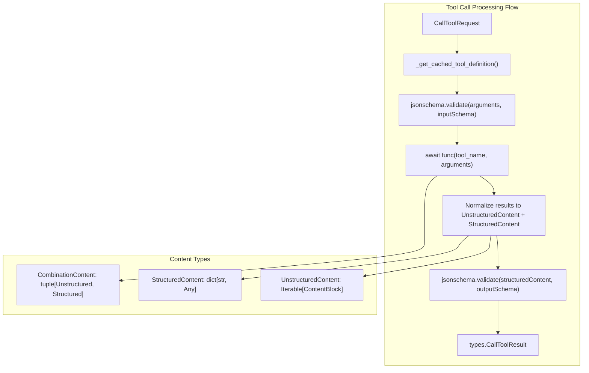
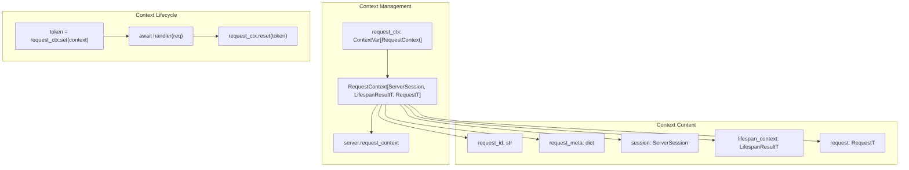
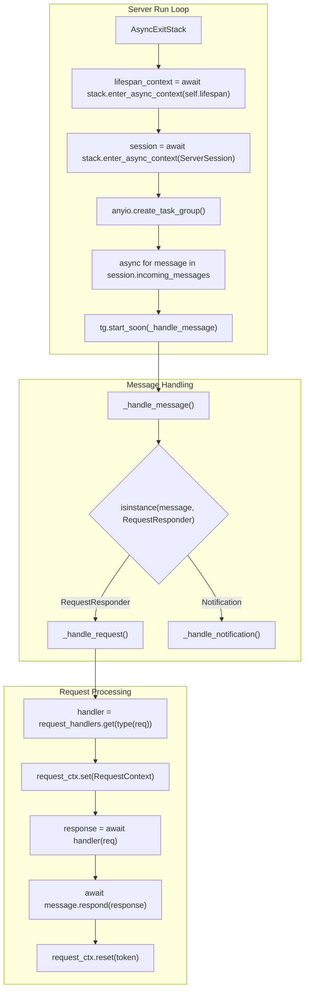
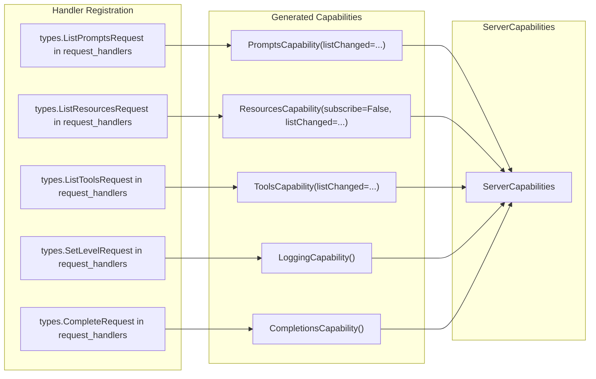

This document covers the low-level `Server` class that provides direct access to the MCP protocol implementation. This is the foundation layer that handles raw MCP requests and notifications with minimal abstraction. For high-level server development using decorators and automatic schema generation, see [FastMCP Server Framework](#2). For details on session management and client connections, see [ServerSession Implementation](#6.2).

## Server Class Overview

The `Server` class in [src/mcp/server/lowlevel/server.py]() provides a decorator-based framework for implementing MCP servers with direct control over protocol message handling. Unlike FastMCP's automatic introspection, the low-level server requires explicit handler registration and manual schema definition.

```mermaid
graph TB
    subgraph "Server Class Structure"
        Server["Server[LifespanResultT, RequestT]"]
        RequestHandlers["request_handlers: dict[type, Callable]"]
        NotificationHandlers["notification_handlers: dict[type, Callable]"]
        ToolCache["_tool_cache: dict[str, Tool]"]
        Lifespan["lifespan: AsyncContextManager"]
    end
    
    subgraph "Handler Decorators"
        ListPrompts["@server.list_prompts()"]
        GetPrompt["@server.get_prompt()"]
        ListResources["@server.list_resources()"]
        ReadResource["@server.read_resource()"]
        ListTools["@server.list_tools()"]
        CallTool["@server.call_tool()"]
        Progress["@server.progress_notification()"]
    end
    
    subgraph "Protocol Types"
        ListPromptsRequest["types.ListPromptsRequest"]
        GetPromptRequest["types.GetPromptRequest"]
        ListResourcesRequest["types.ListResourcesRequest"]
        ReadResourceRequest["types.ReadResourceRequest"]
        ListToolsRequest["types.ListToolsRequest"]
        CallToolRequest["types.CallToolRequest"]
        ProgressNotification["types.ProgressNotification"]
    end
    
    Server --> RequestHandlers
    Server --> NotificationHandlers
    Server --> ToolCache
    Server --> Lifespan
    
    ListPrompts --> ListPromptsRequest
    GetPrompt --> GetPromptRequest
    ListResources --> ListResourcesRequest
    ReadResource --> ReadResourceRequest
    ListTools --> ListToolsRequest
    CallTool --> CallToolRequest
    Progress --> ProgressNotification
    
    RequestHandlers --> ListPromptsRequest
    RequestHandlers --> GetPromptRequest
    RequestHandlers --> ListResourcesRequest
    RequestHandlers --> ReadResourceRequest
    RequestHandlers --> ListToolsRequest
    RequestHandlers --> CallToolRequest
    NotificationHandlers --> ProgressNotification
```

Sources: [src/mcp/server/lowlevel/server.py:133-158](), [src/mcp/server/lowlevel/server.py:152-155](), [src/mcp/types.py:82-103]()

The `Server` class is generic over two type parameters: `LifespanResultT` for lifespan context data and `RequestT` for request-specific data. It maintains separate dictionaries for request handlers and notification handlers, automatically routing incoming messages based on their type.

## Handler Registration System

Request and notification handlers are registered using decorator methods that map protocol message types to handler functions. Each decorator enforces specific function signatures while providing flexibility in implementation.

Sources: [src/mcp/server/lowlevel/server.py:409-438](), [src/mcp/server/lowlevel/server.py:245-255](), [src/mcp/server/lowlevel/func_inspection.py]()

Handler functions can return either the specific result type (e.g., `ListToolsResult`) or the legacy format (e.g., `list[Tool]`). The server automatically wraps legacy returns in the appropriate result container for backward compatibility.

## Tool Management and Validation

The server implements sophisticated tool management including input/output validation and result processing. Tools are cached to avoid repeated calls to `list_tools()` and support both structured and unstructured content output.

| Feature | Implementation | Purpose |
|---------|---------------|---------|
| Tool Caching | `_tool_cache: dict[str, Tool]` | Avoid repeated tool list requests |
| Input Validation | `jsonschema.validate()` | Validate arguments against `inputSchema` |
| Output Validation | `jsonschema.validate()` | Validate structured results against `outputSchema` |
| Content Normalization | `CombinationContent` handling | Support both structured and unstructured outputs |

Sources: [src/mcp/server/lowlevel/server.py:465-547](), [src/mcp/server/lowlevel/server.py:99-102](), [src/mcp/server/lowlevel/server.py:449-463]()

The `call_tool()` decorator accepts a `validate_input` parameter to control input validation. Output validation is automatically performed when `outputSchema` is defined in the tool definition.

## Request Context System

The server uses Python's `contextvars` module to provide request-scoped context accessible throughout the handler call stack. This context includes session information, lifespan data, and request metadata.

Sources: [src/mcp/server/lowlevel/server.py:105](), [src/mcp/server/lowlevel/server.py:232-236](), [src/mcp/server/lowlevel/server.py:677-685](), [src/mcp/shared/context.py]()

## Message Processing Architecture

The server's main `run()` method establishes a session and processes incoming messages through a task group, ensuring proper error handling and response delivery.

Sources: [src/mcp/server/lowlevel/server.py:598-636](), [src/mcp/server/lowlevel/server.py:637-655](), [src/mcp/server/lowlevel/server.py:656-713]()

## Capabilities Discovery

The server automatically generates `ServerCapabilities` based on registered handlers, allowing clients to discover available functionality without manual configuration.

Sources: [src/mcp/server/lowlevel/server.py:188-229](), [src/mcp/types.py:317-332](), [src/mcp/server/lowlevel/server.py:159-186]()

The `NotificationOptions` class controls whether the server supports change notifications for prompts, resources, and tools, which are reflected in the generated capabilities.