This document covers the core protocol type definitions and JSON-RPC message handling that form the foundation of the Model Context Protocol (MCP) Python SDK. It explains the type system defined in `mcp.types`, JSON-RPC message structure, and how these types enable protocol compliance and message validation.

For information about session management and bidirectional communication patterns, see [Session Management](#4.2). For transport-level message handling, see [Transport Layer](#5).

## JSON-RPC Message Foundation

The MCP protocol is built on JSON-RPC 2.0, with all communication following JSON-RPC message patterns. The SDK defines base message types that all protocol messages inherit from.

### Core JSON-RPC Types

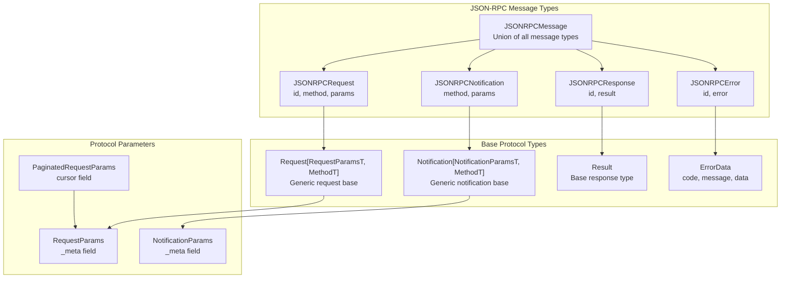

**Sources:** [src/mcp/types.py:124-192]()

The `JSONRPCMessage` union type allows the system to handle any valid JSON-RPC message, while the generic `Request` and `Notification` base classes provide type-safe parameter handling for specific MCP protocol messages.

### Message Structure and Metadata

All MCP messages support a `_meta` field for protocol-level metadata, including progress tokens for long-running operations:

| Component | Type | Purpose |
|-----------|------|---------|
| `RequestParams.Meta.progressToken` | `ProgressToken` | Enables out-of-band progress notifications |
| `Result.meta` | `dict[str, Any]` | General metadata for responses |
| `NotificationParams.Meta` | `BaseModel` | Metadata for notifications |

**Sources:** [src/mcp/types.py:43-75]()

## MCP Protocol Type Hierarchy

The MCP protocol defines specific message types for each capability, organized into client requests, server requests, and bidirectional notifications.

### Protocol Message Categories

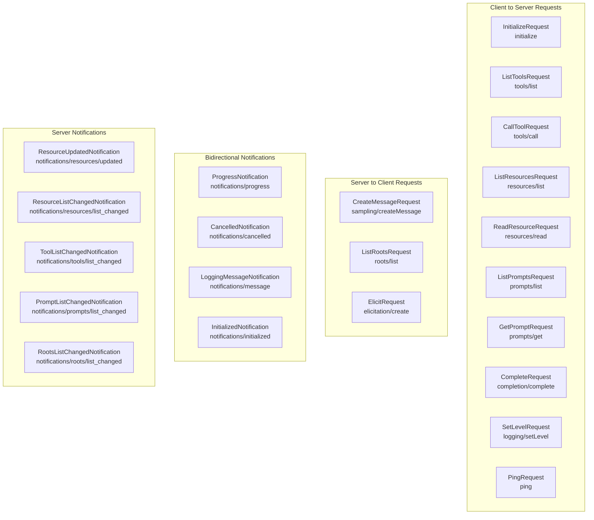

**Sources:** [src/mcp/types.py:248-1349]()

### Core Entity Types

The protocol defines entity types that represent the primary MCP capabilities:

```mermaid
graph TB
    subgraph "Entity Definitions"
        Tool["Tool<br/>name, description, inputSchema, outputSchema"]
        Resource["Resource<br/>uri, name, description, mimeType"]
        ResourceTemplate["ResourceTemplate<br/>uriTemplate, name, description"]
        Prompt["Prompt<br/>name, description, arguments"]
        Root["Root<br/>uri, name"]
    end
    
    subgraph "Supporting Types"
        PromptArgument["PromptArgument<br/>name, description, required"]
        ToolAnnotations["ToolAnnotations<br/>title, readOnlyHint, destructiveHint"]
        Icon["Icon<br/>src, mimeType, sizes"]
        Annotations["Annotations<br/>audience, priority"]
    end
    
    subgraph "Content Types"
        TextContent["TextContent<br/>type: 'text', text"]
        ImageContent["ImageContent<br/>type: 'image', data, mimeType"]
        AudioContent["AudioContent<br/>type: 'audio', data, mimeType"]
        EmbeddedResource["EmbeddedResource<br/>type: 'resource', resource"]
        ResourceLink["ResourceLink<br/>type: 'resource_link'"]
    end
    
    Tool --> ToolAnnotations
    Tool --> Icon
    Resource --> Icon
    Resource --> Annotations
    Prompt --> PromptArgument
    Prompt --> Icon
    
    ContentBlock["ContentBlock<br/>Union of content types"] --> TextContent
    ContentBlock --> ImageContent
    ContentBlock --> AudioContent
    ContentBlock --> EmbeddedResource
    ContentBlock --> ResourceLink
```

**Sources:** [src/mcp/types.py:425-890]()

## Message Flow Patterns

MCP follows specific request/response and notification patterns that define how clients and servers communicate.

### Request/Response Cycles

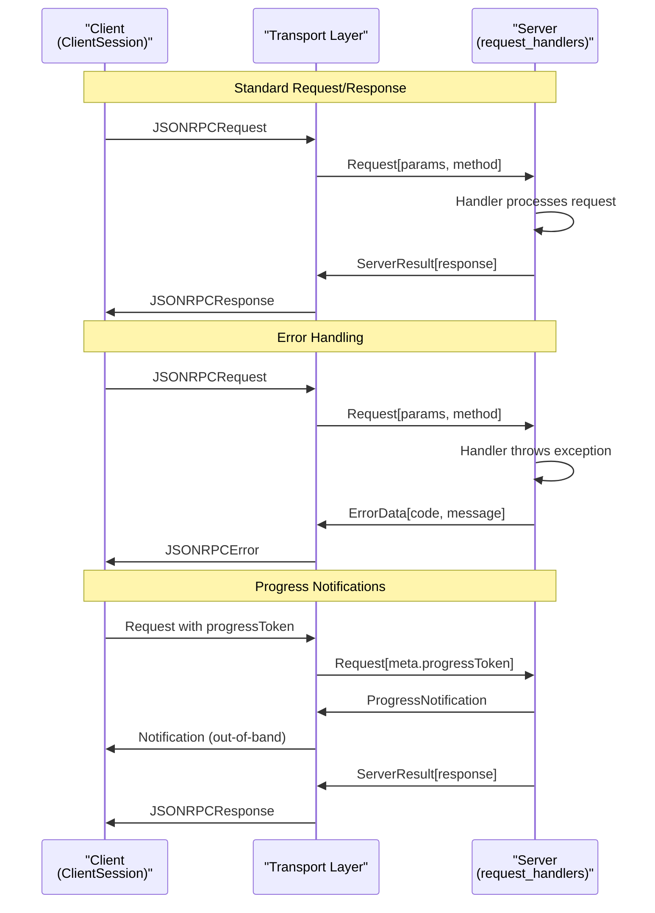

**Sources:** [src/mcp/server/lowlevel/server.py:598-714]()

### Server Message Handling

The low-level server processes messages through a type-safe dispatch system:

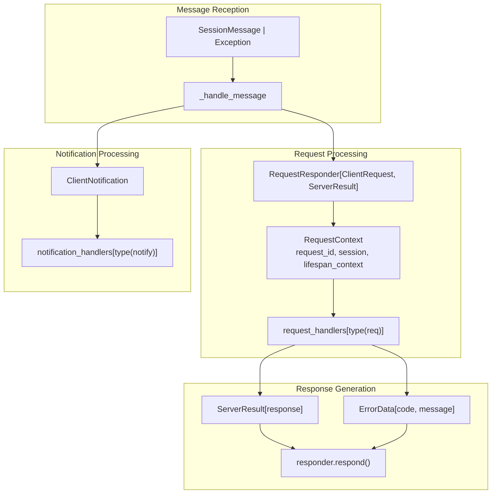

**Sources:** [src/mcp/server/lowlevel/server.py:637-714]()

## Type System Integration

The MCP type system ensures protocol compliance through Pydantic model validation and structured message handling.

### Protocol Version Management

The SDK supports protocol versioning with negotiation between client and server:

| Constant | Value | Purpose |
|----------|--------|---------|
| `LATEST_PROTOCOL_VERSION` | `"2025-06-18"` | Most recent protocol version |
| `DEFAULT_NEGOTIATED_VERSION` | `"2025-03-26"` | Fallback when no version specified |

**Sources:** [src/mcp/types.py:26-34]()

### Union Types and Message Routing

Protocol messages use Pydantic `RootModel` unions for type-safe message routing:

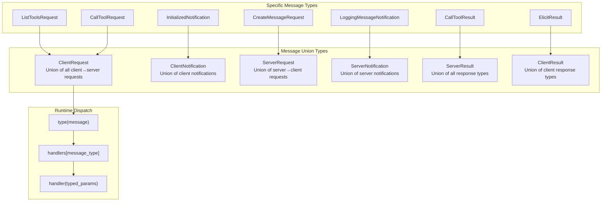

**Sources:** [src/mcp/types.py:1248-1349](), [src/mcp/server/lowlevel/server.py:152-156]()

### Structured Output and Validation

The protocol supports structured output validation for tools using JSON Schema:

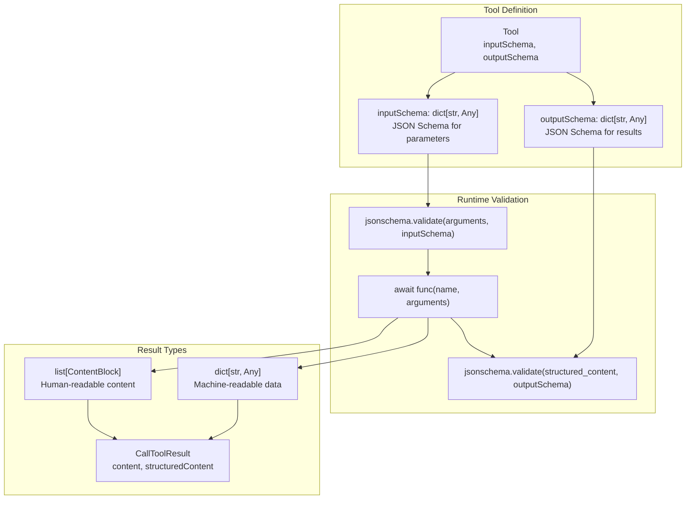

**Sources:** [src/mcp/server/lowlevel/server.py:488-542]()

The type system ensures that all protocol messages are validated against their schemas, enabling reliable communication and early error detection. This foundation supports the higher-level abstractions in FastMCP and client sessions while maintaining strict protocol compliance.

**Sources:** [src/mcp/types.py:1-1349](), [src/mcp/server/lowlevel/server.py:465-547]()

# Session Management


Session management in the MCP Python SDK provides the foundational infrastructure for maintaining communication state between clients and servers. This system handles message correlation, request/response tracking, protocol initialization, and connection lifecycle management. For specific client-side session usage, see [ClientSession Core](#3.1). For protocol message types and JSON-RPC implementation details, see [Protocol Types & JSON-RPC](#4.1).

## BaseSession Architecture

The `BaseSession` class forms the core of MCP's session management system, providing message correlation, stream management, and request/response tracking for both client and server implementations.

### Message Correlation System

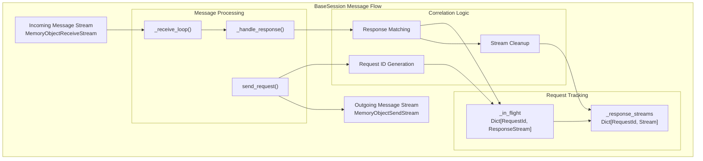

The BaseSession maintains request correlation through a sophisticated tracking system that maps request IDs to response streams, ensuring that responses are delivered to the correct waiting coroutines even in highly concurrent scenarios.

Sources: [src/mcp/shared/session.py](), [tests/shared/test_session.py:36-46](), [tests/client/test_resource_cleanup.py:12-61]()

### Stream Management and Cleanup

BaseSession manages memory object streams for bidirectional communication, with automatic cleanup to prevent resource leaks:

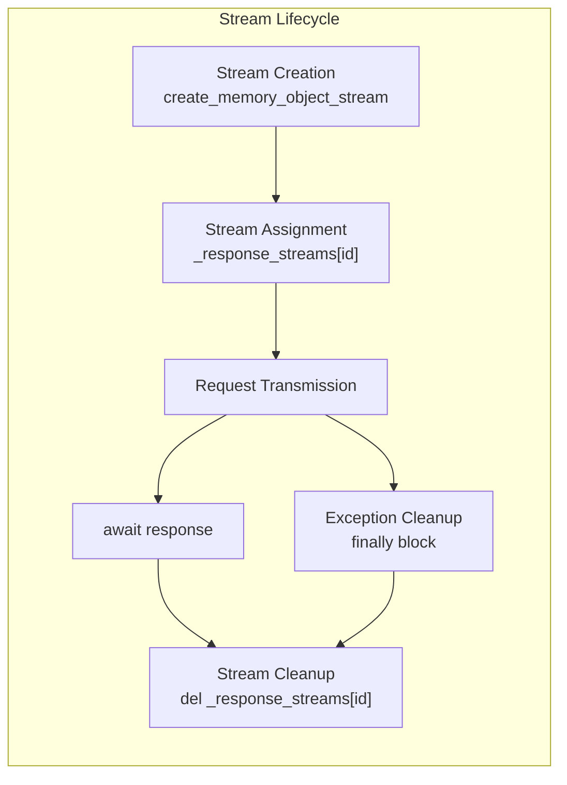

The session ensures proper stream cleanup even when exceptions occur during request transmission, preventing memory leaks in long-running connections.

Sources: [tests/client/test_resource_cleanup.py:13-56](), [src/mcp/shared/session.py]()

## ServerSession Implementation

The `ServerSession` class extends BaseSession to provide server-specific functionality, including initialization state management, client capability checking, and various notification methods.

### Initialization State Flow

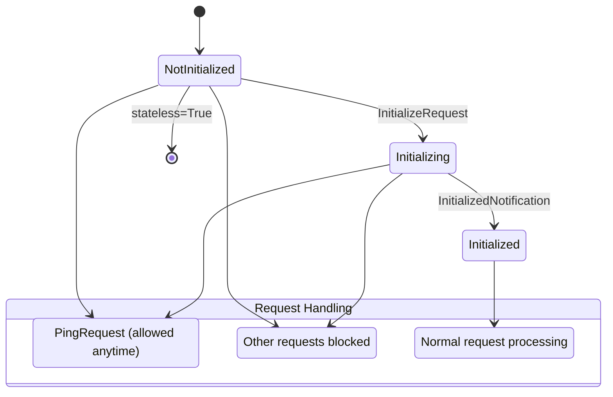

The ServerSession enforces a strict initialization protocol where most requests are blocked until the initialization handshake completes, with ping requests being the only exception.

Sources: [src/mcp/server/session.py:58-62](), [src/mcp/server/session.py:167-179](), [tests/server/test_session.py:219-283]()

### Client Capability Checking

ServerSession provides a comprehensive capability checking system that allows servers to adapt their behavior based on client capabilities:

| Capability Type | Check Method | Purpose |
|----------------|--------------|---------|
| `roots` | `check_client_capability()` | File system root access |
| `sampling` | `check_client_capability()` | LLM sampling support |
| `elicitation` | `check_client_capability()` | User input elicitation |
| `experimental` | `check_client_capability()` | Custom experimental features |

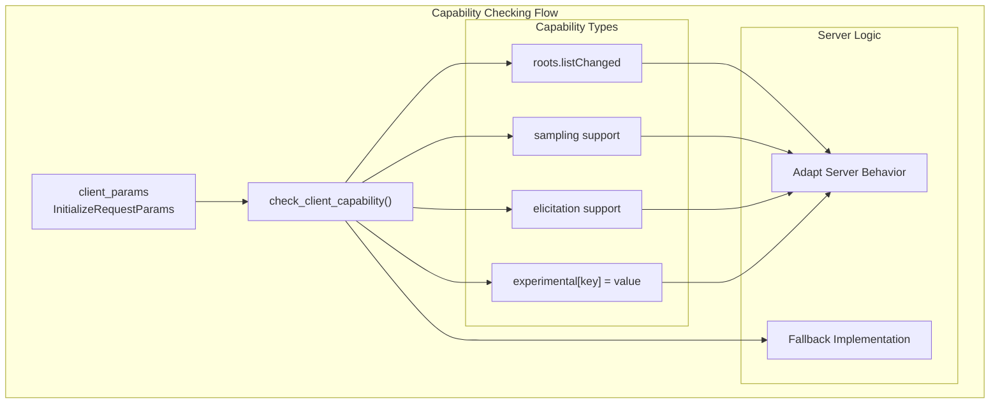

Sources: [src/mcp/server/session.py:105-136](), [src/mcp/server/session.py:8-34]()

## Session Communication Methods

ServerSession provides specialized methods for different types of server-to-client communication:

### Notification Methods

| Method | Purpose | Message Type |
|--------|---------|--------------|
| `send_log_message()` | Server logging | `LoggingMessageNotification` |
| `send_resource_updated()` | Resource change events | `ResourceUpdatedNotification` |
| `send_progress_notification()` | Operation progress | `ProgressNotification` |
| `send_resource_list_changed()` | Resource list updates | `ResourceListChangedNotification` |
| `send_tool_list_changed()` | Tool list updates | `ToolListChangedNotification` |
| `send_prompt_list_changed()` | Prompt list updates | `PromptListChangedNotification` |

### Request Methods

ServerSession can also send requests to clients for advanced capabilities:

| Method | Purpose | Result Type |
|--------|---------|-------------|
| `create_message()` | LLM sampling | `CreateMessageResult` |
| `list_roots()` | File system roots | `ListRootsResult` |
| `elicit()` | User input | `ElicitResult` |
| `send_ping()` | Connection health | `EmptyResult` |

Sources: [src/mcp/server/session.py:181-323]()

## Request Cancellation and Error Handling

The session management system provides robust cancellation and error handling capabilities:

```mermaid
graph TB
    subgraph "Cancellation Flow"
        RequestStart["Request Started<br/>Task Group"]
        CancelSent["CancelledNotification<br/>sent by client"]
        RequestCancel["Request Cancellation<br/>anyio.CancelledError"]
        McpError["McpError('Request cancelled')"]
        ServerContinue["Server Continues<br/>Processing New Requests"]
    end
    
    subgraph "Connection Error Flow"
        ConnectionLoss["Connection Closed"]
        PendingRequests["Pending Requests"]
        ConnectionError["McpError('Connection closed')"]
        StreamCleanup["Stream Cleanup"]
    end
    
    RequestStart --> CancelSent
    CancelSent --> RequestCancel
    RequestCancel --> McpError
    McpError --> ServerContinue
    
    ConnectionLoss --> PendingRequests
    PendingRequests --> ConnectionError
    ConnectionError --> StreamCleanup
```

The cancellation system ensures that servers remain functional after request cancellations and that pending requests are properly cleaned up when connections are lost.

Sources: [tests/shared/test_session.py:48-123](), [tests/server/test_cancel_handling.py:25-111](), [tests/shared/test_session.py:125-171]()

## Integration with Server Framework

ServerSession integrates closely with the broader MCP server framework:

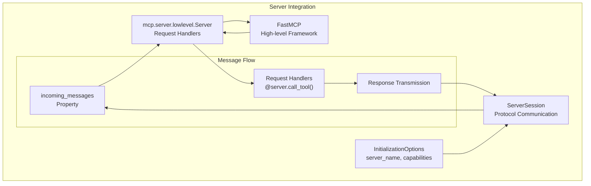

ServerSession serves as the communication bridge between the protocol layer and application logic, handling the low-level details of message transmission while providing a clean interface for server implementations.

Sources: [src/mcp/server/session.py:83-100](), [src/mcp/server/models.py:13-18](), [tests/server/test_session.py:32-81]()

# Context & Progress Reporting


This document covers the MCP SDK's context and progress reporting systems, which enable request-scoped data access and bidirectional progress communication between clients and servers. These systems provide the foundation for tracking long-running operations and maintaining request state throughout the MCP protocol lifecycle.

For information about session management and message correlation, see [Session Management](#4.2). For details about protocol message types, see [Protocol Types & JSON-RPC](#4.1).

## Request Context System

The request context system provides a structured way to access request-scoped information including session references, metadata, and lifecycle context. The `RequestContext` class serves as the primary interface for accessing this information within request handlers.

### RequestContext Architecture

```mermaid
graph TB
    subgraph "Request Context System"
        RC[RequestContext]
        Meta[types.RequestParams.Meta]
        Session["BaseSession[Any, Any, Any, Any, Any]"]
        LifespanCtx[lifespan_context]
    end
    
    subgraph "Session Integration"
        ServerSession[ServerSession]
        ClientSession[ClientSession]
        BaseSession[BaseSession]
    end
    
    subgraph "Request Metadata"
        ProgressToken[progressToken]
        RequestId[request_id]
        OtherMeta[other_metadata]
    end
    
    RC --> Meta
    RC --> Session
    RC --> LifespanCtx
    RC --> RequestId
    
    Session --> BaseSession
    BaseSession --> ServerSession
    BaseSession --> ClientSession
    
    Meta --> ProgressToken
    Meta --> OtherMeta
    
    ServerSession --> "send_progress_notification()"
    ClientSession --> "send_progress_notification()"
```

The `RequestContext` provides access to:
- **request_id**: Unique identifier for the current request
- **session**: Reference to the active session for sending notifications
- **meta**: Request metadata including progress tokens
- **lifespan_context**: Application lifecycle context

Sources: [tests/shared/test_progress_notifications.py:276-281]()

## Progress Notification System

Progress notifications enable both clients and servers to report the status of long-running operations. The system uses progress tokens to correlate notifications with specific requests and supports both absolute and incremental progress reporting.

### Progress Notification Types

| Component | Description | Usage |
|-----------|-------------|-------|
| `ProgressNotification` | Protocol message type for progress updates | Sent over transport |
| `progressToken` | String or int identifier | Correlates progress with request |
| `progress` | Float value | Current progress amount |
| `total` | Optional float | Total expected progress |
| `message` | Optional string | Human-readable status |

### Bidirectional Progress Flow

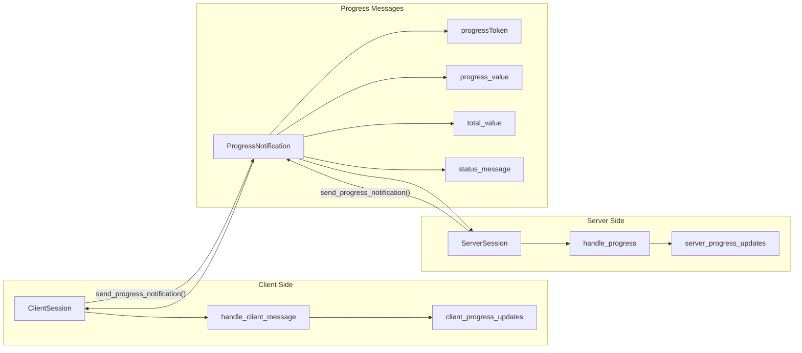

Both clients and servers can send progress notifications using the `send_progress_notification()` method available on their respective session classes. Progress tokens passed in request metadata enable correlation between requests and their associated progress updates.

Sources: [tests/shared/test_progress_notifications.py:98-119](), [tests/shared/test_progress_notifications.py:168-187]()

## Progress Context Manager

The SDK provides a convenient context manager for sending progress notifications that automatically handles progress token extraction and incremental progress tracking.

### Progress Manager Usage

```mermaid
graph TB
    subgraph "Progress Context Manager"
        ProgressMgr["progress(context, total=100)"]
        ProgressCtx[Progress Context]
        ProgressMethod["p.progress(amount, message)"]
    end
    
    subgraph "Context Integration"
        RequestCtx[RequestContext]
        SessionRef[session]
        MetaData[meta.progressToken]
    end
    
    subgraph "Automatic Tracking"
        CurrentProgress[current_progress]
        TotalValue[total_value]
        Incremental[incremental_updates]
    end
    
    ProgressMgr --> ProgressCtx
    ProgressCtx --> ProgressMethod
    
    RequestCtx --> SessionRef
    RequestCtx --> MetaData
    ProgressMgr --> RequestCtx
    
    ProgressMethod --> CurrentProgress
    ProgressMethod --> TotalValue
    ProgressMethod --> Incremental
    
    ProgressMethod -->|"session.send_progress_notification()"| "Notification Sent"
```

The progress context manager:
- Extracts progress tokens from request context automatically
- Maintains running total of incremental progress updates
- Provides simple `progress(amount, message)` interface
- Handles session communication transparently

Sources: [tests/shared/test_progress_notifications.py:287-292]()

## Session Integration

Progress reporting is deeply integrated with the session layer, where both `ClientSession` and `ServerSession` provide `send_progress_notification()` methods for sending progress updates.

### Session Progress Methods

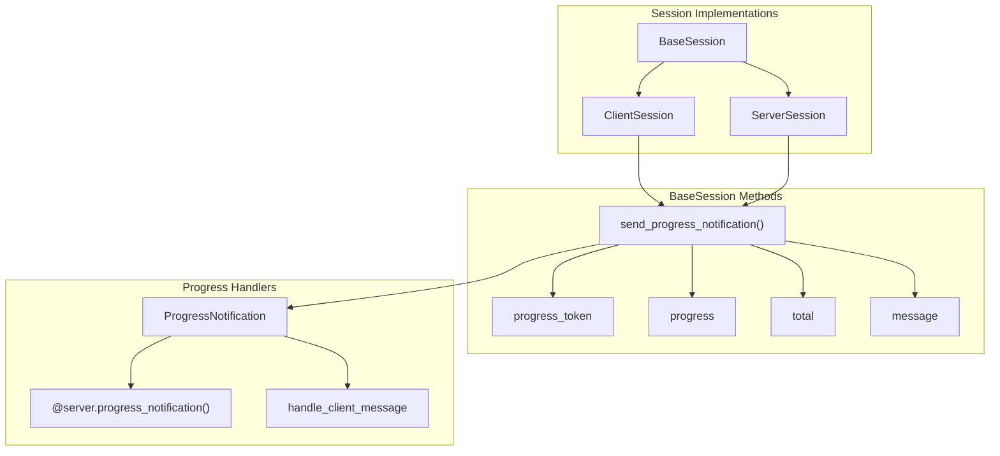

### Progress Handler Registration

Servers register progress notification handlers using decorators:

```python
@server.progress_notification()
async def handle_progress(
    progress_token: str | int,
    progress: float,
    total: float | None,
    message: str | None,
):
    # Handle incoming progress updates from clients
```

Clients handle progress notifications through message handlers that receive `ProgressNotification` messages and extract the relevant progress information.

Sources: [tests/shared/test_progress_notifications.py:57-71](), [tests/shared/test_progress_notifications.py:128-144]()

## Request Metadata Integration

Progress tokens are typically passed as part of request metadata using the `_meta` field in request parameters. This enables correlation between tool calls, resource reads, or other operations and their associated progress updates.

### Metadata Structure

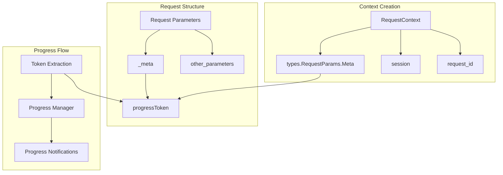

The metadata integration enables:
- Automatic progress token propagation from requests to handlers
- Correlation of progress updates with specific operations
- Support for multiple concurrent operations with distinct progress tokens

Sources: [tests/shared/test_progress_notifications.py:89-96](), [tests/shared/test_progress_notifications.py:275-281]()

# Transport Layer


The transport layer provides the foundational communication mechanisms that enable MCP clients and servers to exchange JSON-RPC messages. This layer abstracts away the underlying network protocols and provides consistent interfaces for different communication patterns including HTTP-based streaming, WebSockets, and process-based communication.

For detailed protocol message handling, see [Protocol & Message System](#4). For client-side transport usage, see [Client Transports](#3.2). For server-side transport security, see [Transport Security](#5.5).

## Transport Architecture Overview

The MCP SDK supports multiple transport mechanisms, each optimized for different deployment scenarios and communication patterns:

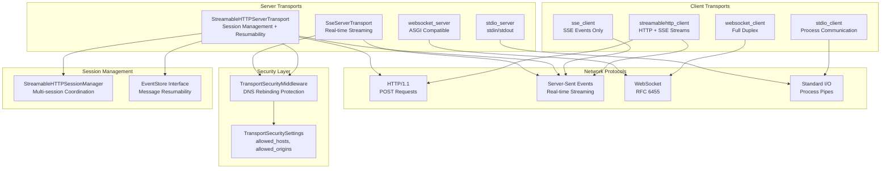

**Sources:** [src/mcp/server/streamable_http.py:122-902](), [src/mcp/server/sse.py:64-250](), [src/mcp/server/transport_security.py](), [tests/shared/test_streamable_http.py:1-1600]()

## Transport Types and Use Cases

| Transport | Primary Use Case | Features | Implementation |
|-----------|-----------------|-----------|---------------|
| **StreamableHTTP** | Production web deployment | Session management, resumability, stateful/stateless modes | [StreamableHTTPServerTransport](#5.1) |
| **SSE** | Real-time notifications | Lightweight streaming, ASGI integration | [SseServerTransport](#5.2) |
| **STDIO** | Local development, CLI tools | Process spawning, simple setup | [stdio_server/client](#5.3) |
| **WebSocket** | Interactive applications | Full-duplex, low latency | [websocket_server/client](#5.4) |

## Core Transport Classes

### Server Transport Interfaces

The server-side transports share common patterns but implement different communication mechanisms:

#### SSE Transport Architecture
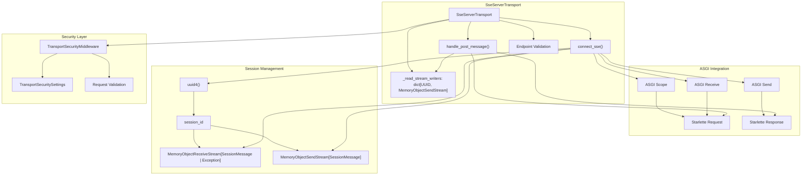

**Sources:** [src/mcp/server/sse.py:64-250](), [tests/shared/test_sse.py:83-104]()

The `SseServerTransport` class provides two ASGI applications:
- `connect_sse()`: Handles GET requests to establish SSE streams 
- `handle_post_message()`: Handles POST requests containing client messages

Key implementation details:
- Endpoint validation prevents full URLs, requiring relative paths like `/messages/`
- Session management using UUID4 for unique session identification
- Request context propagation through `ServerMessageMetadata`
- DNS rebinding protection via `TransportSecurityMiddleware`

### Client Transport Interfaces

Client transports provide consistent async context manager interfaces:

```mermaid
graph TB
    subgraph "Client Transport Pattern"
        ClientFunc["transport_client(url)"]
        ContextMgr["AsyncContextManager"]
        Streams["Tuple[ReadStream, WriteStream, ...]"]
        
        ClientFunc --> ContextMgr
        ContextMgr --> Streams
    end
    
    subgraph "Specific Implementations"
        StreamableHTTP["streamablehttp_client"]
        SSE["sse_client"]
        Stdio["stdio_client"]
        WebSocket["websocket_client"]
    end
    
    subgraph "ClientSession Integration"
        CS["ClientSession"]
        ReadStream["MemoryObjectReceiveStream"]
        WriteStream["MemoryObjectSendStream"]
        
        CS --> ReadStream
        CS --> WriteStream
    end
    
    StreamableHTTP --> Streams
    SSE --> Streams
    Stdio --> Streams
    WebSocket --> Streams
    
    Streams --> ReadStream
    Streams --> WriteStream
```

**Sources:** [src/mcp/client/streamable_http.py](), [src/mcp/client/sse.py](), [src/mcp/client/stdio.py](), [src/mcp/client/websocket.py]()

## Message Flow Architecture

All transports follow a common message flow pattern using anyio memory streams, with SSE implementing a specific dual-channel approach:

### General Message Flow
```mermaid
graph LR
    subgraph "Client Side"
        ClientSession["ClientSession"]
        ClientWrite["MemoryObjectSendStream[SessionMessage]"]
        ClientRead["MemoryObjectReceiveStream[SessionMessage]"]
        
        ClientSession --> ClientWrite
        ClientRead --> ClientSession
    end
    
    subgraph "Transport Layer"
        TransportClient["sse_client / stdio_client / etc"]
        Network["Network Protocol<br/>(HTTP+SSE/STDIO/WS)"]
        TransportServer["SseServerTransport / stdio_server"]
        
        ClientWrite --> TransportClient
        TransportClient --> Network
        Network --> TransportServer
        TransportServer --> ServerRead
    end
    
    subgraph "Server Side"
        ServerRead["MemoryObjectReceiveStream[SessionMessage | Exception]"]
        ServerWrite["MemoryObjectSendStream[SessionMessage]"]
        ServerSession["Server.run()"]
        
        ServerRead --> ServerSession
        ServerSession --> ServerWrite
    end
    
    ServerWrite --> TransportServer
    TransportServer --> Network
    Network --> TransportClient
    TransportClient --> ClientRead
```

### SSE-Specific Message Flow
```mermaid
graph TB
    subgraph "SSE Client"
        SSEClient["sse_client"]
        HTTPGet["HTTP GET /sse"]
        HTTPPost["HTTP POST /messages/?session_id=uuid"]
    end
    
    subgraph "SSE Server Transport"
        ConnectSSE["connect_sse()"]
        HandlePost["handle_post_message()"]
        SessionDict["_read_stream_writers[uuid]"]
        SSEWriter["sse_writer() task"]
        EventSource["EventSourceResponse"]
    end
    
    subgraph "Server Application"
        ServerRun["Server.run()"]
        ReadStream["MemoryObjectReceiveStream"]
        WriteStream["MemoryObjectSendStream"]
    end
    
    HTTPGet --> ConnectSSE
    ConnectSSE --> SessionDict
    ConnectSSE --> SSEWriter
    SSEWriter --> EventSource
    EventSource --> SSEClient
    
    HTTPPost --> HandlePost
    HandlePost --> SessionDict
    SessionDict --> ReadStream
    ReadStream --> ServerRun
    ServerRun --> WriteStream
    WriteStream --> SSEWriter
```

**Sources:** [src/mcp/server/sse.py:121-250](), [src/mcp/client/sse.py](), [tests/shared/test_sse.py:183-214]()

The SSE transport uses a unique dual-channel approach:
- **GET channel**: Establishes SSE stream for server-to-client messages
- **POST channel**: Handles client-to-server messages with session correlation
- **Session correlation**: UUID-based session matching between channels
- **Request context**: Each POST request includes full request context via `ServerMessageMetadata`

## Transport Security Features

All HTTP-based transports implement comprehensive security measures including endpoint validation and DNS rebinding protection:

### Security Validation Flow
```mermaid
graph TB
    subgraph "Request Processing"
        Request["Incoming Request"]
        EndpointVal["Endpoint Validation"]
        SecurityMW["TransportSecurityMiddleware"]
        HostCheck["Host Header Validation"] 
        OriginCheck["Origin Header Validation"]
        Allow["Allow Request"]
        Reject["Reject with 400/403"]
        
        Request --> EndpointVal
        EndpointVal --> SecurityMW
        SecurityMW --> HostCheck
        SecurityMW --> OriginCheck
        HostCheck --> Allow
        HostCheck --> Reject
        OriginCheck --> Allow
        OriginCheck --> Reject
    end
    
    subgraph "SSE Endpoint Validation"
        EndpointInput["endpoint: str"]
        RelativeCheck["Relative Path Check"]
        URLCheck["No '://' or '//' or '?' or '#'"]
        SlashNorm["Ensure starts with '/'"]
        ValidEndpoint["Valid endpoint"]
        
        EndpointInput --> RelativeCheck
        RelativeCheck --> URLCheck
        URLCheck --> SlashNorm
        SlashNorm --> ValidEndpoint
    end
    
    subgraph "Security Settings"
        TSecSettings["TransportSecuritySettings"]
        AllowedHosts["allowed_hosts: list[str]"]
        AllowedOrigins["allowed_origins: list[str]"]
        
        TSecSettings --> AllowedHosts
        TSecSettings --> AllowedOrigins
        SecurityMW --> TSecSettings
    end
    
    EndpointVal --> RelativeCheck
```

**Sources:** [src/mcp/server/sse.py:106-119](), [src/mcp/server/transport_security.py](), [tests/shared/test_sse.py:488-513]()

### SSE Endpoint Security
The `SseServerTransport` enforces strict endpoint validation to prevent security vulnerabilities:

- **Relative Path Requirement**: Endpoints must be relative paths (e.g., `/messages/`) not full URLs
- **URL Component Rejection**: Rejects endpoints containing `://`, `//`, `?`, or `#` 
- **Path Normalization**: Automatically adds leading `/` if missing
- **Security Rationale**: Prevents cross-origin requests and ensures clients connect to the same origin

```python
# Valid endpoints
SseServerTransport("/messages/")      # ✓ Valid
SseServerTransport("messages/")       # ✓ Normalized to "/messages/"
SseServerTransport("/")              # ✓ Valid

# Invalid endpoints (raise ValueError)
SseServerTransport("http://example.com/messages/")  # ✗ Full URL
SseServerTransport("//example.com/messages/")       # ✗ Protocol-relative URL  
SseServerTransport("/messages/?param=value")        # ✗ Query parameters
```

## Transport Selection Guidelines

Choose the appropriate transport based on your deployment requirements:

- **StreamableHTTP**: Best for production web applications requiring session persistence and resumability
- **SSE**: Ideal for lightweight real-time updates with simple setup  
- **STDIO**: Perfect for local development, CLI tools, and process-based architectures
- **WebSocket**: Optimal for interactive applications requiring low-latency bidirectional communication

Each transport is covered in detail in the following sections: [StreamableHTTP Transport](#5.1), [SSE Transport](#5.2), [STDIO Transport](#5.3), [WebSocket Transport](#5.4), and [Transport Security](#5.5).