The resource and prompt management system in FastMCP provides structured access to data sources and conversation templates for MCP servers. Resources represent data that can be read (files, HTTP endpoints, databases), while prompts are message templates that can be rendered with parameters for LLM interactions.

For tool execution functionality, see [Tool Management](#2.2). For low-level protocol handling, see [Protocol & Message System](#4).

## Resource Management Architecture

The resource system provides a unified interface for accessing various data sources through the `Resource` base class and supporting infrastructure.

### Resource Class Hierarchy

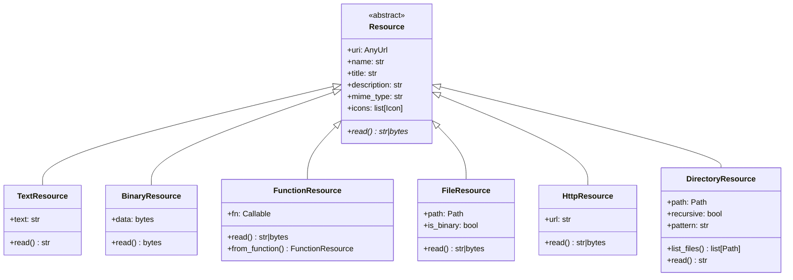

**Sources:** [src/mcp/server/fastmcp/resources/base.py:19-49](), [src/mcp/server/fastmcp/resources/types.py:20-200]()

### Resource Management Flow

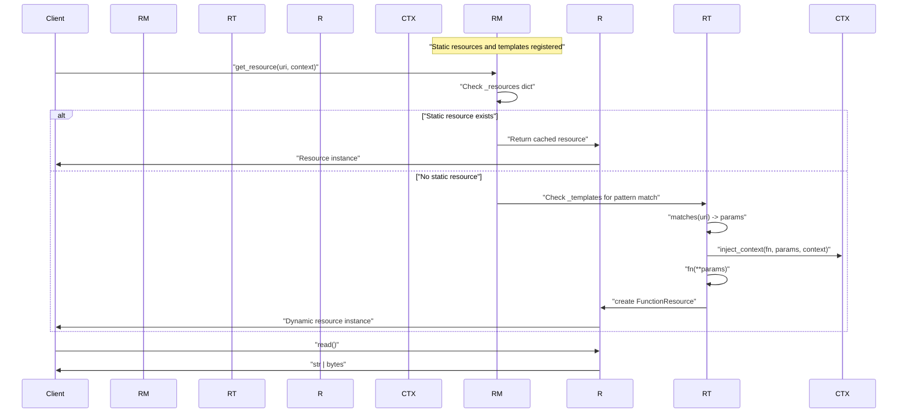

**Sources:** [src/mcp/server/fastmcp/resources/resource_manager.py:77-98](), [src/mcp/server/fastmcp/resources/templates.py:84-110]()

## Resource Types and Implementation

### Static Resource Types

The system provides several concrete resource implementations for common data sources:

| Resource Type | Purpose | Key Methods | File Location |
|---------------|---------|-------------|---------------|
| `TextResource` | Static text content | `read() -> str` | [types.py:20-27]() |
| `BinaryResource` | Static binary data | `read() -> bytes` | [types.py:30-37]() |
| `FileResource` | File system access | `read() -> str\|bytes` | [types.py:105-145]() |
| `HttpResource` | HTTP endpoint data | `read() -> str\|bytes` | [types.py:148-159]() |
| `DirectoryResource` | Directory listings | `list_files() -> list[Path]` | [types.py:162-199]() |

**Sources:** [src/mcp/server/fastmcp/resources/types.py:1-200]()

### Function Resources and Templates

`FunctionResource` enables lazy loading by wrapping functions that return data only when accessed:

```mermaid
graph TB
    subgraph "FunctionResource Creation"
        F["Function Definition"] --> V["validate_call()"]
        V --> FR["FunctionResource Instance"]
    end
    
    subgraph "ResourceTemplate System"
        UT["uri_template: weather://{city}/current"] --> M["matches(uri)"]
        M --> P["Extract params: {city: 'london'}"]
        P --> CI["inject_context()"]
        CI --> FC["fn(**params)"]
        FC --> CR["create_resource()"]
    end
    
    subgraph "Runtime Execution"
        Client --> RM["ResourceManager.get_resource()"]
        RM --> RT["ResourceTemplate.create_resource()"]
        RT --> FR2["FunctionResource with closure"]
        FR2 --> Read["resource.read()"]
        Read --> Result["Data returned"]
    end
```

**Sources:** [src/mcp/server/fastmcp/resources/types.py:40-102](), [src/mcp/server/fastmcp/resources/templates.py:22-110]()

## Prompt Management System

The prompt system provides template-based message generation for LLM interactions with parameter validation and context injection.

### Prompt Architecture

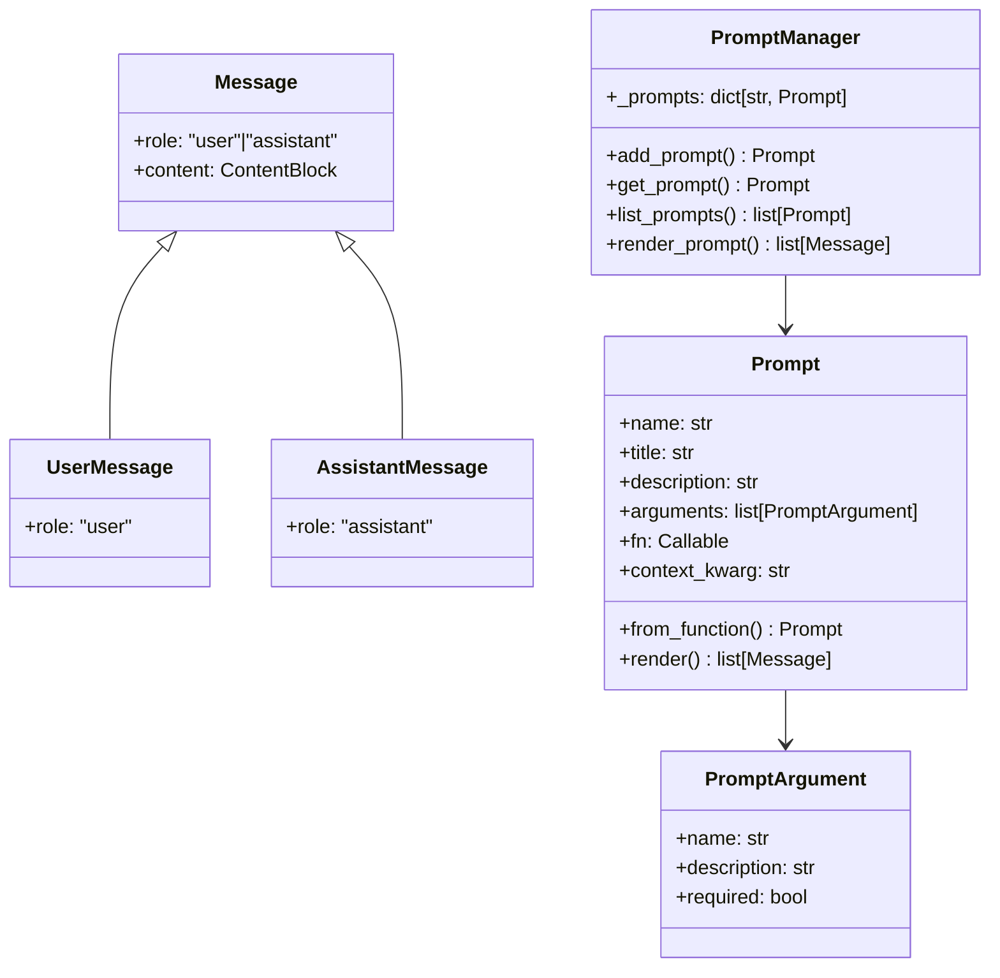

**Sources:** [src/mcp/server/fastmcp/prompts/base.py:22-184](), [src/mcp/server/fastmcp/prompts/manager.py:18-60]()

### Prompt Rendering Process

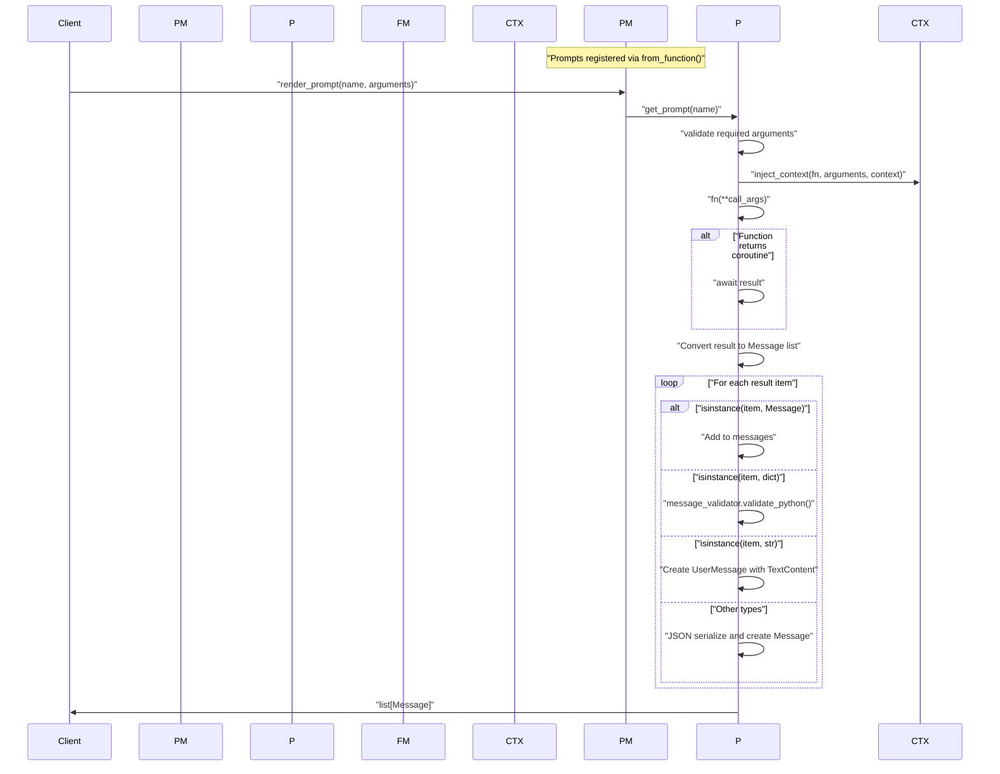

**Sources:** [src/mcp/server/fastmcp/prompts/base.py:137-183](), [src/mcp/server/fastmcp/prompts/manager.py:49-60]()

## Context Injection System

Both resources and prompts support context injection for accessing request-specific information during execution.

### Context Parameter Discovery

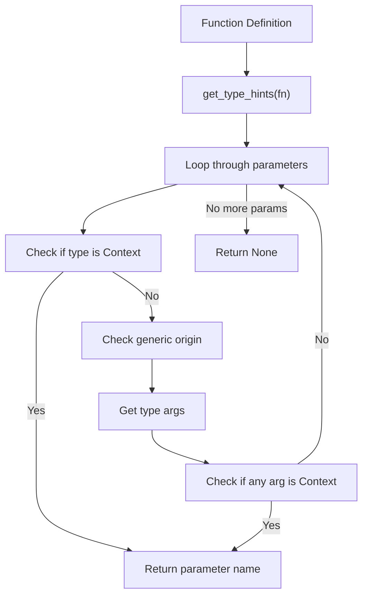

**Sources:** [src/mcp/server/fastmcp/utilities/context_injection.py:11-46]()

### Integration Points

The context injection system integrates with both resource templates and prompts:

| Component | Context Usage | Implementation |
|-----------|---------------|----------------|
| `ResourceTemplate.create_resource()` | Access request context during resource creation | [templates.py:92-93]() |
| `Prompt.render()` | Access session/request context during rendering | [base.py:153]() |
| `inject_context()` | Generic context injection utility | [context_injection.py:49-68]() |

**Sources:** [src/mcp/server/fastmcp/resources/templates.py:84-110](), [src/mcp/server/fastmcp/prompts/base.py:137-183](), [src/mcp/server/fastmcp/utilities/context_injection.py:49-68]()

## Manager Registration and Lifecycle

Both `ResourceManager` and `PromptManager` provide registration APIs for adding resources and prompts to FastMCP servers:

### Resource Registration

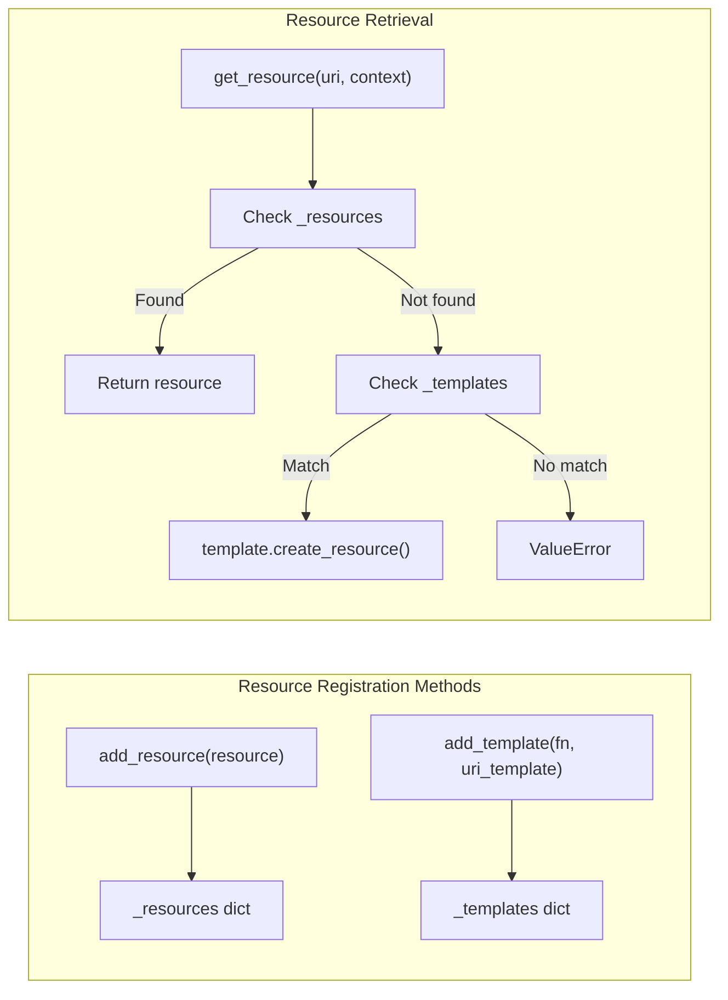

### Prompt Registration

The `PromptManager` maintains a simple dictionary mapping prompt names to `Prompt` instances, with optional duplicate warnings.

**Sources:** [src/mcp/server/fastmcp/resources/resource_manager.py:22-108](), [src/mcp/server/fastmcp/prompts/manager.py:18-60]()

# Function Introspection & Structured Output

This document explains how FastMCP automatically analyzes Python functions to generate JSON schemas for their arguments and return values, enabling automatic validation and structured output generation. This system allows FastMCP to seamlessly bridge between Python function signatures and the MCP protocol's JSON-based communication.

For information about how tools are registered and managed, see [Tool Management](#2.2). For details about the FastMCP server architecture, see [FastMCP Server Architecture](#2.1).

## Purpose and Scope

The function introspection system serves two primary purposes:

1. **Automatic Schema Generation**: Converts Python function signatures into JSON schemas that can be used by MCP clients to understand tool parameters
2. **Structured Output Support**: Enables tools to return structured data with schemas, allowing for richer client interactions

The system is built around the `func_metadata` function and `FuncMetadata` class, which analyze function signatures using Python's `inspect` module and Pydantic models to create validation and conversion pipelines.

## Function Introspection Architecture

The introspection system follows a pipeline from Python functions to validated execution:

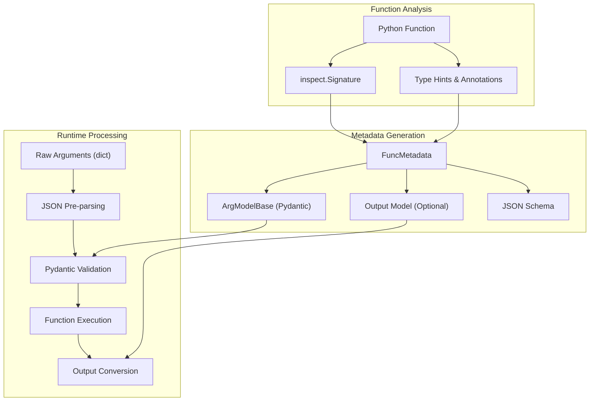

Sources: [src/mcp/server/fastmcp/utilities/func_metadata.py:166-284](), [src/mcp/server/fastmcp/utilities/func_metadata.py:62-164]()

## Argument Model Generation

The `func_metadata` function creates Pydantic models from function signatures to enable automatic validation:

### Core Process

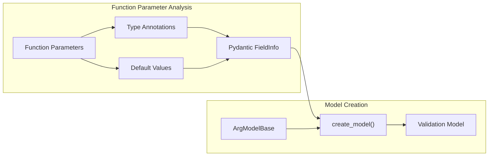

### Parameter Handling Rules

| Parameter Type | Treatment | Example |
|---------------|-----------|---------|
| Typed parameters | Direct mapping | `name: str` → `str` field |
| Untyped parameters | Mapped to `Any` with string schema | `value` → `Any` field |
| Parameters with `None` annotation | Mapped to null type | `x: None` → null field |
| Parameters starting with `_` | Rejected (raises `InvalidSignature`) | `_private: str` → Error |
| Parameters in `skip_names` | Excluded from model | Skipped entirely |
| BaseModel attribute conflicts | Uses aliases | `model_dump: str` → aliased field |

Sources: [src/mcp/server/fastmcp/utilities/func_metadata.py:208-258](), [src/mcp/server/fastmcp/utilities/func_metadata.py:240-252]()

## Structured Output System

FastMCP supports structured output based on function return type annotations. The system automatically detects whether a function should return structured or unstructured output:

### Return Type Handling

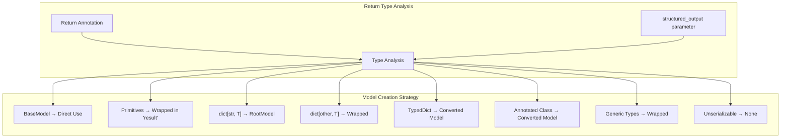

### Structured Output Examples

| Return Type | Model Strategy | Schema Generation |
|-------------|---------------|-------------------|
| `str` | Wrapped as `{"result": str}` | Simple object schema |
| `BaseModel` | Used directly | Full model schema |
| `dict[str, int]` | RootModel for dict | Object with additionalProperties |
| `dict[int, str]` | Wrapped as `{"result": dict}` | Wrapped object schema |
| `TypedDict` | Converted to BaseModel | Object with typed properties |
| `list[str]` | Wrapped as `{"result": list}` | Array in wrapped object |
| Annotated class | Converted to BaseModel | Object with class fields |
| Unannotated class | No structured output | Returns None |

Sources: [src/mcp/server/fastmcp/utilities/func_metadata.py:287-371](), [examples/snippets/servers/structured_output.py:1-98]()

## JSON Schema Generation

The system generates JSON schemas using Pydantic's schema generation with strict validation:

### Schema Generation Pipeline

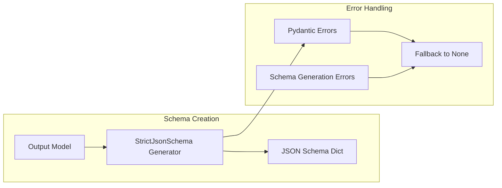

The `StrictJsonSchema` class raises exceptions instead of emitting warnings, allowing the system to detect non-serializable types and gracefully fall back to unstructured output.

Sources: [src/mcp/server/fastmcp/utilities/func_metadata.py:30-38](), [src/mcp/server/fastmcp/utilities/func_metadata.py:355-371]()

## Input Validation & Pre-parsing

The validation system includes sophisticated JSON pre-parsing to handle common client behavior:

### Pre-parsing Logic

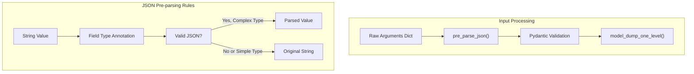

### Pre-parsing Examples

| Input | Field Type | Pre-parsed Result | Reason |
|-------|-----------|-------------------|---------|
| `'["a", "b"]'` | `list[str]` | `["a", "b"]` | JSON array parsed |
| `'"hello"'` | `str` | `'"hello"'` | JSON string kept as string |
| `'{"x": 1}'` | `SomeModel` | `{"x": 1}` | JSON object parsed |
| `'123'` | `int` | `'123'` | Simple value kept as string |
| `'invalid'` | `list[str]` | `'invalid'` | Invalid JSON kept as string |

Sources: [src/mcp/server/fastmcp/utilities/func_metadata.py:121-159](), [tests/server/fastmcp/test_func_metadata.py:463-552]()

## Output Conversion

The `convert_result` method handles converting function return values to the appropriate format for MCP responses:

### Conversion Flow

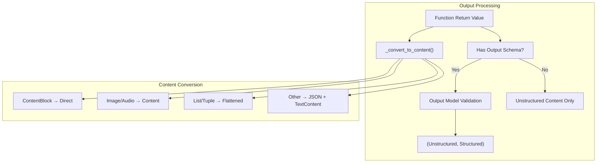

### Content Conversion Rules

| Return Value Type | Conversion Result |
|------------------|-------------------|
| `None` | Empty list `[]` |
| `ContentBlock` | Single-item list `[ContentBlock]` |
| `Image` | `[ImageContent]` |
| `Audio` | `[AudioContent]` |
| `list/tuple` | Flattened list of converted items |
| Other types | JSON-serialized as `[TextContent]` |

Sources: [src/mcp/server/fastmcp/utilities/func_metadata.py:91-119](), [src/mcp/server/fastmcp/utilities/func_metadata.py:489-523]()

## Integration with FastMCP

The function introspection system integrates seamlessly with FastMCP's tool registration:

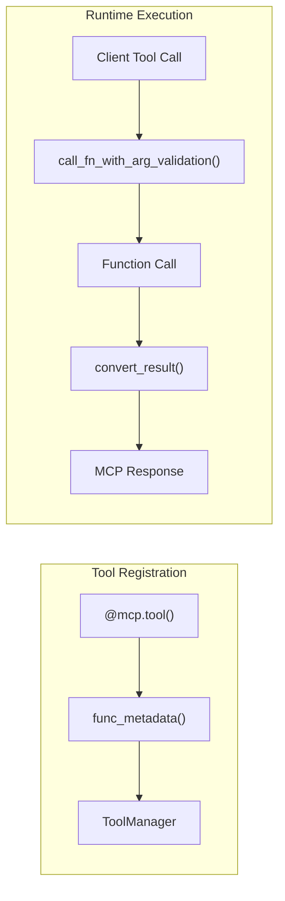

This system enables FastMCP to provide rich, type-safe tool interfaces while maintaining compatibility with the MCP protocol's JSON-based communication model.

Sources: [src/mcp/server/fastmcp/utilities/func_metadata.py:68-89](), [tests/server/fastmcp/test_integration.py:666-700]()