if returned_state is None or not secrets.compare_digest(returned_state, state):
    raise OAuthFlowError(f"State parameter mismatch: {returned_state} != {state}")
```

The `secrets.compare_digest()` function provides constant-time comparison to prevent timing attacks. The state parameter is included in the authorization URL and validated when the authorization code is returned via the `callback_handler`.

**Sources:** [src/mcp/client/auth.py:325](), [src/mcp/client/auth.py:349-350](), [src/mcp/client/auth.py:347-353]()

### Token Security

Token management includes several security measures implemented across multiple methods:

- **Secure storage**: Tokens are stored through the `TokenStorage` protocol interface via `storage.set_tokens()`
- **Automatic expiry**: Tokens are validated in `is_token_valid()` against wall-clock expiry time from `update_token_expiry()`
- **Scope validation**: `_handle_token_response()` validates returned token scopes against requested scopes
- **Automatic refresh**: `_refresh_token()` and `_handle_refresh_response()` automatically refresh expired tokens when possible
- **Secure transport**: `validate_issuer_url()` ensures all token exchanges occur over HTTPS (with localhost HTTP exception for development)

The scope validation logic in `_handle_token_response()` prevents privilege escalation:
```python
requested_scopes = set(self.context.client_metadata.scope.split())
returned_scopes = set(token_response.scope.split())
unauthorized_scopes = returned_scopes - requested_scopes
if unauthorized_scopes:
    raise OAuthTokenError(f"Server granted unauthorized scopes: {unauthorized_scopes}")
```

**Sources:** [src/mcp/client/auth.py:398-403](), [src/mcp/client/auth.py:120-133](), [src/mcp/server/auth/routes.py:34-41](), [src/mcp/client/auth.py:388-409]()

### Resource Parameter Support

The SDK implements RFC 8707 resource indicators for enhanced security:

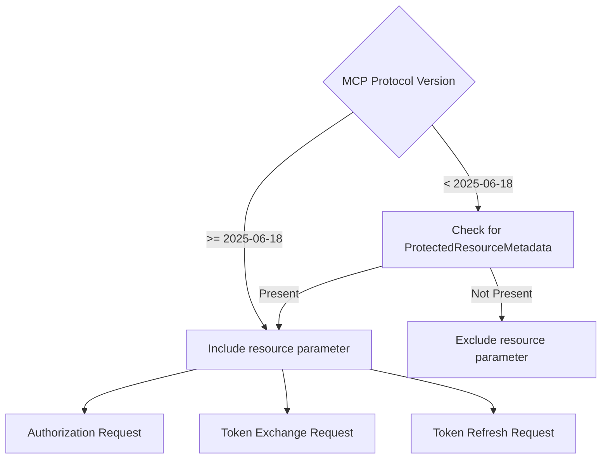

The resource parameter helps prevent token confusion attacks by explicitly identifying the intended resource server.

**Sources:** [src/mcp/client/auth.py:159-177](), [src/mcp/client/auth.py:377-379](), [src/mcp/client/auth.py:431-433]()

# OAuth 2.0 System


This document covers the comprehensive OAuth 2.0 authentication and authorization implementation in the MCP Python SDK. The OAuth 2.0 system provides secure authentication for both client and server components, implementing RFC 6749 (OAuth 2.0), RFC 7636 (PKCE), RFC 8414 (Authorization Server Metadata), and RFC 9728 (Protected Resource Metadata).

For information about client transport integration, see [Client Transports](#3.2). For server-side transport security, see [Transport Security](#5.5).

## OAuth 2.0 Architecture Overview

The OAuth 2.0 system consists of client-side authentication components and server-side authorization infrastructure, supporting both acting as OAuth clients and providing OAuth authorization services.

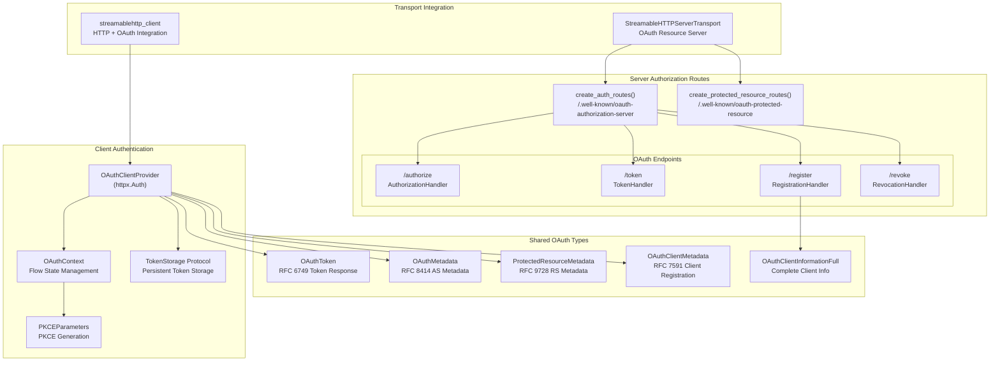

**Sources:** [src/mcp/client/auth.py:179-552](), [src/mcp/shared/auth.py:1-156](), [src/mcp/server/auth/routes.py:68-187]()

## Client Authentication System

The `OAuthClientProvider` class implements the OAuth 2.0 authorization code flow with PKCE as an httpx authentication provider, enabling automatic token management for MCP clients. The provider sets `requires_response_body = True` to access response bodies for OAuth error handling and token processing.

### OAuthClientProvider Implementation

```mermaid
graph TB
    subgraph "OAuthClientProvider Core"
        Provider[OAuthClientProvider]
        AsyncAuthFlow["async_auth_flow()<br/>httpx.Auth Integration"]
        Context["OAuthContext<br/>Flow State & Metadata"]
    end
    
    subgraph "OAuth Discovery Flow"
        DiscoverProtectedResource["_discover_protected_resource()<br/>RFC 9728 Discovery"]
        GetDiscoveryUrls["_get_discovery_urls()<br/>Metadata Endpoint Fallback"]
        HandleOAuthMetadata["_handle_oauth_metadata_response()<br/>Store AS Metadata"]
    end
    
    subgraph "Client Registration"
        RegisterClient["_register_client()<br/>Dynamic Client Registration"]
        HandleRegistration["_handle_registration_response()<br/>Store Client Credentials"]
    end
    
    subgraph "Authorization Flow"
        PerformAuthorization["_perform_authorization()<br/>PKCE + Redirect Flow"]
        ExchangeToken["_exchange_token()<br/>Authorization Code Exchange"]
        RefreshToken["_refresh_token()<br/>Token Refresh"]
    end
    
    subgraph "Token Management"
        HandleTokenResponse["_handle_token_response()<br/>Token Validation & Storage"]
        HandleRefreshResponse["_handle_refresh_response()<br/>Refresh Response Processing"]
        AddAuthHeader["_add_auth_header()<br/>Bearer Token Injection"]
    end
    
    %% Flow relationships
    Provider --> AsyncAuthFlow
    AsyncAuthFlow --> Context
    AsyncAuthFlow --> DiscoverProtectedResource
    AsyncAuthFlow --> GetDiscoveryUrls
    AsyncAuthFlow --> HandleOAuthMetadata
    AsyncAuthFlow --> RegisterClient
    AsyncAuthFlow --> HandleRegistration
    AsyncAuthFlow --> PerformAuthorization
    AsyncAuthFlow --> ExchangeToken
    AsyncAuthFlow --> RefreshToken
    AsyncAuthFlow --> HandleTokenResponse
    AsyncAuthFlow --> HandleRefreshResponse
    AsyncAuthFlow --> AddAuthHeader
```

**Sources:** [src/mcp/client/auth.py:179-206](), [src/mcp/client/auth.py:485-551](), [src/mcp/client/auth.py:185]()

### PKCE Implementation

The system implements Proof Key for Code Exchange (PKCE) as specified in RFC 7636 to enhance security for OAuth flows.

| Component | Implementation | Purpose |
|-----------|---------------|---------|
| `PKCEParameters` | [src/mcp/client/auth.py:49-62]() | Generates cryptographically secure code verifier and challenge |
| Code Verifier | 128-character random string | Client-side secret for authorization code exchange |
| Code Challenge | SHA256 + Base64URL encoding | Server-verifiable challenge derived from verifier |
| Challenge Method | S256 | SHA256-based challenge method (required by RFC) |

**Sources:** [src/mcp/client/auth.py:49-62](), [tests/client/test_auth.py:82-107]()

### Token Storage Protocol

The `TokenStorage` protocol enables persistent token management across client sessions:

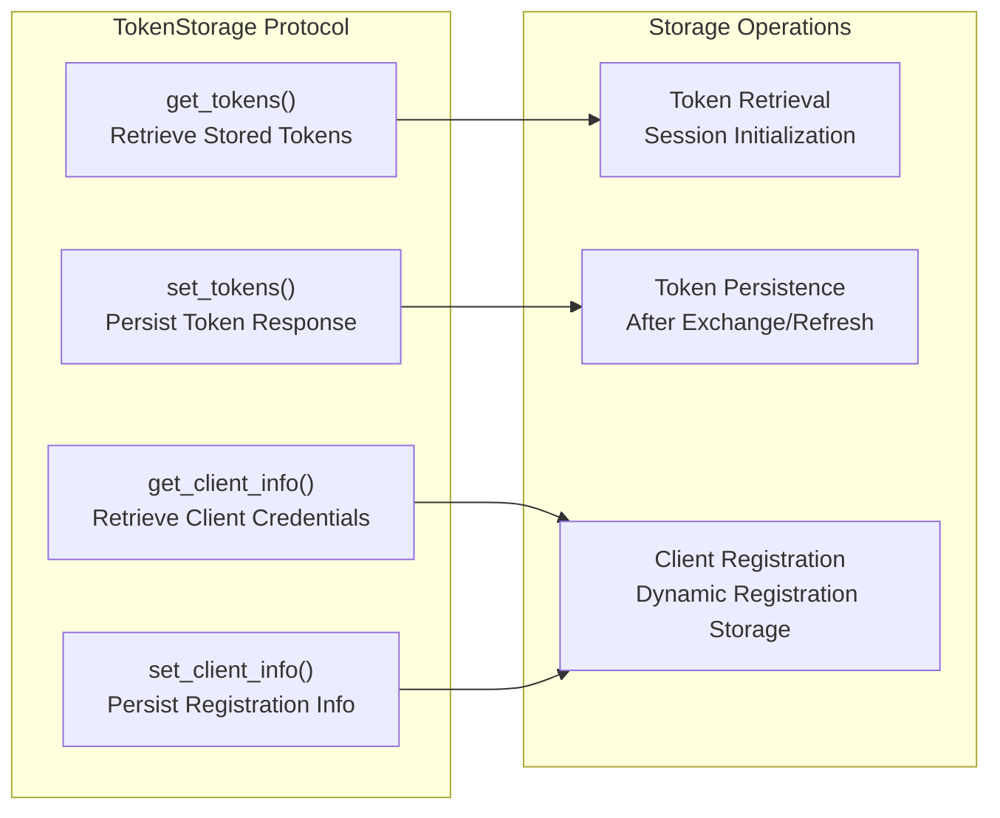

**Sources:** [src/mcp/client/auth.py:64-82](), [tests/client/test_auth.py:17-35]()

## OAuth Flow Implementation

The complete OAuth 2.0 authorization code flow with PKCE is implemented as an asynchronous generator that integrates with httpx's authentication system.

### Authorization Code Flow Sequence

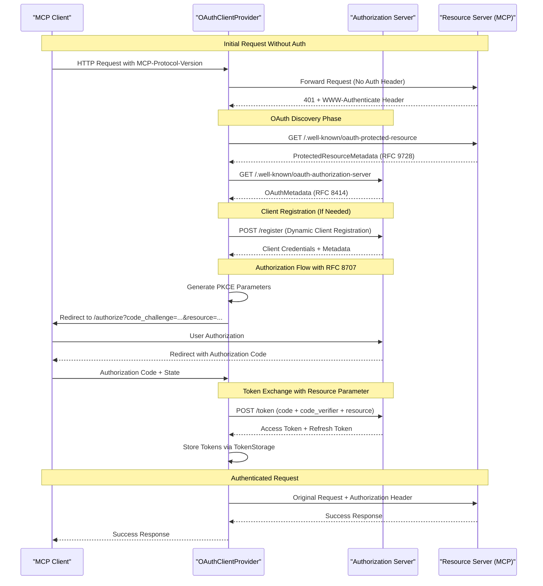

**Sources:** [src/mcp/client/auth.py:485-551](), [tests/client/test_auth.py:616-714]()

### OAuth Discovery and Fallback

The client implements comprehensive discovery mechanisms with fallback support for legacy servers. The `_get_discovery_urls()` method generates an ordered list of discovery URLs:

| Discovery Type | Endpoint Pattern | RFC Reference | Implementation |
|---------------|------------------|---------------|----------------|
| Protected Resource | `/.well-known/oauth-protected-resource` | RFC 9728 | `_discover_protected_resource()` |
| Authorization Server (Path-aware) | `/.well-known/oauth-authorization-server{path}` | RFC 8414 | `_get_discovery_urls()` |
| Authorization Server (Root) | `/.well-known/oauth-authorization-server` | RFC 8414 | Fallback in ordered list |
| OpenID Configuration (Path-aware) | `/.well-known/openid-configuration{path}` | RFC 8414 §5 | Path-aware discovery |
| OpenID Configuration (Legacy) | `{server}/.well-known/openid-configuration` | OIDC 1.0 | Legacy fallback |

The discovery process includes protocol version header injection (`MCP_PROTOCOL_VERSION`) and WWW-Authenticate header parsing for enhanced resource metadata discovery.

**Sources:** [src/mcp/client/auth.py:254-279](), [src/mcp/client/auth.py:231-240](), [src/mcp/client/auth.py:474-475](), [tests/client/test_auth.py:252-261]()

## Server Authorization System

The server-side OAuth implementation provides a complete authorization server that can issue tokens for MCP resources.

### Authorization Server Routes

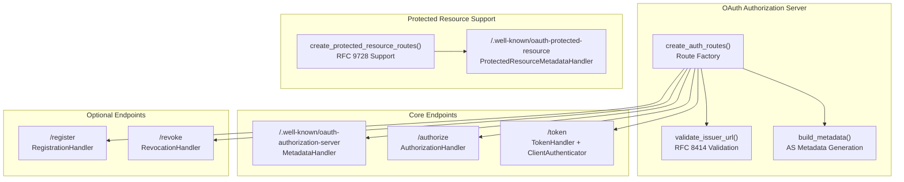

**Sources:** [src/mcp/server/auth/routes.py:68-147](), [src/mcp/server/auth/routes.py:189-227]()

### Client Registration Handler

The `RegistrationHandler` implements RFC 7591 Dynamic Client Registration:

| Validation | Implementation | Error Response |
|------------|---------------|----------------|
| Metadata Validation | Pydantic `OAuthClientMetadata` | `invalid_client_metadata` |
| Scope Validation | `ClientRegistrationOptions.valid_scopes` | `invalid_client_metadata` |
| Grant Type Validation | Must be `["authorization_code", "refresh_token"]` | `invalid_client_metadata` |
| Client Secret Generation | `secrets.token_hex(32)` for non-public clients | N/A |

**Sources:** [src/mcp/server/auth/handlers/register.py:34-120]()

## Token Management

The OAuth system provides comprehensive token lifecycle management including validation, refresh, and expiration handling.

### OAuthToken Model

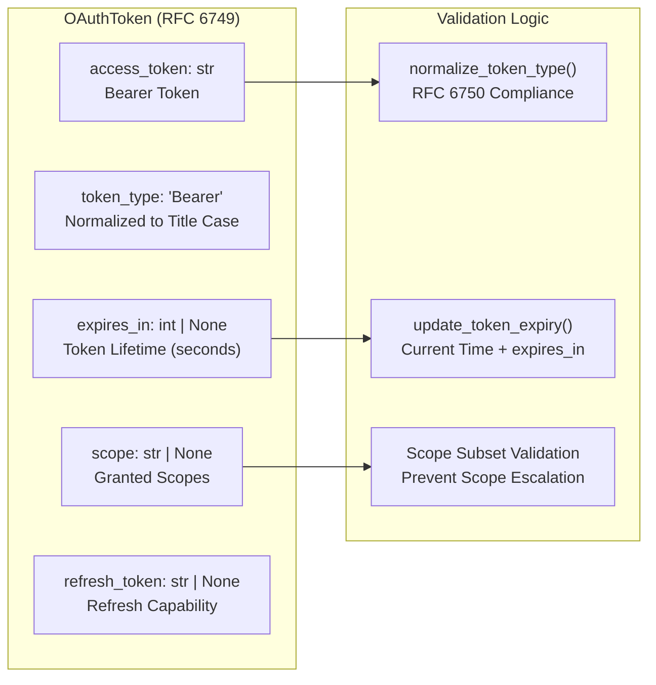

**Sources:** [src/mcp/shared/auth.py:6-25](), [src/mcp/client/auth.py:120-142]()

### Token Refresh Flow and Resource Parameter Support

The client automatically refreshes expired tokens using stored refresh tokens and includes RFC 8707 resource parameter support:

| Condition | Action | Fallback | Resource Parameter |
|-----------|--------|----------|-------------------|
| Token Valid | Use existing token | N/A | N/A |
| Token Expired + Refresh Available | Automatic refresh | Full re-authorization on failure | Included if PRM exists or protocol ≥ 2025-06-18 |
| Token Expired + No Refresh | Full OAuth flow | N/A | Included in authorization/token requests |
| Refresh Fails | Clear stored tokens | Full OAuth flow | N/A |

The `should_include_resource_param()` method determines when to include the resource parameter based on:
- Presence of Protected Resource Metadata (always include)
- MCP-Protocol-Version ≥ 2025-06-18 (include for newer protocols)

**Sources:** [src/mcp/client/auth.py:411-462](), [src/mcp/client/auth.py:159-176](), [src/mcp/client/auth.py:431-433](), [tests/client/test_auth.py:443-465](), [tests/client/test_auth.py:471-525]()

## Discovery and Metadata Systems

The OAuth implementation supports comprehensive metadata discovery for both authorization servers and protected resources.

### Authorization Server Metadata

The `OAuthMetadata` model implements RFC 8414 Authorization Server Metadata:

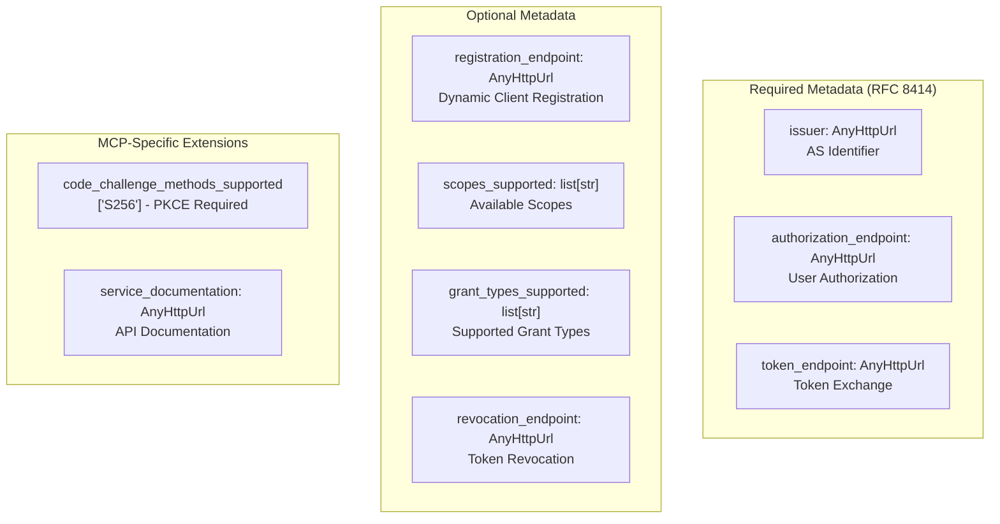

**Sources:** [src/mcp/shared/auth.py:105-132](), [src/mcp/server/auth/routes.py:149-186]()

### Protected Resource Metadata

RFC 9728 Protected Resource Metadata enables resource servers to advertise their authorization requirements:

| Field | Purpose | MCP Implementation | Default Value |
|-------|---------|-------------------|---------------|
| `resource` | Resource server identifier | MCP server URL | Server URL |
| `authorization_servers` | List of trusted AS URLs | AS that can issue tokens for this resource | Required field |
| `scopes_supported` | Available scopes | MCP-specific scopes (tools, resources, prompts) | Optional |
| `bearer_methods_supported` | Token presentation methods | `["header"]` (Authorization header only) | `["header"]` |
| `resource_name` | Human-readable name | Optional display name | Optional |
| `resource_documentation` | Documentation URL | API documentation link | Optional |

**Sources:** [src/mcp/shared/auth.py:134-156](), [src/mcp/server/auth/routes.py:189-227]()

## Security Features

The OAuth 2.0 implementation includes comprehensive security measures following current best practices.

### HTTPS and Security Validation

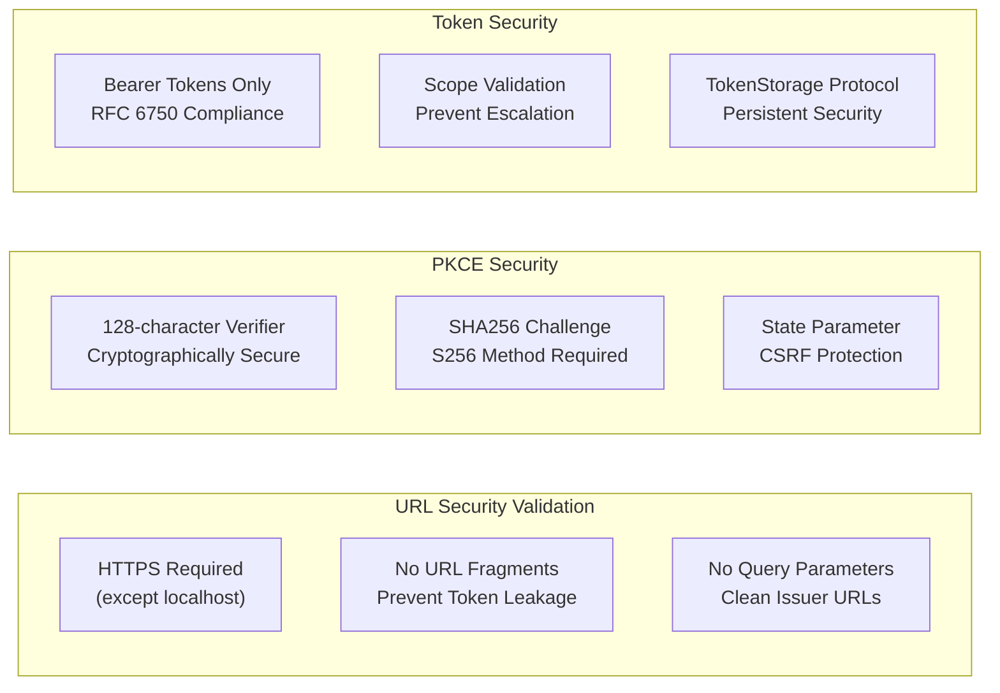

**Sources:** [src/mcp/server/auth/routes.py:23-47](), [src/mcp/client/auth.py:49-61](), [src/mcp/client/auth.py:347-353]()

### WWW-Authenticate Header Support

The client implements RFC 9728 WWW-Authenticate header parsing for enhanced discovery:

| Header Format | Extraction Pattern | Example |
|---------------|-------------------|---------|
| Quoted URL | `resource_metadata="URL"` | `Bearer resource_metadata="https://api.example.com/.well-known/oauth-protected-resource"` |
| Unquoted URL | `resource_metadata=URL` | `Bearer resource_metadata=https://api.example.com/.well-known/oauth-protected-resource` |
| Complex Header | Multiple parameters | `Bearer realm="api", resource_metadata="URL", error="insufficient_scope"` |

**Sources:** [src/mcp/client/auth.py:207-229](), [tests/client/test_auth.py:844-906]()

# Development Tools & CLI


The MCP Python SDK includes a comprehensive command-line interface (CLI) that streamlines the development workflow for MCP servers. The CLI provides commands for running servers, integrating with development tools, and deploying to client applications like Claude Desktop.

For information about the underlying server frameworks, see [FastMCP Server Framework](#2). For details about transport implementations, see [Transport Layer](#5).

## CLI Architecture

The MCP CLI is built using the `typer` library and provides a unified interface for server development and deployment operations. The system consists of two main modules: the core CLI implementation and Claude Desktop integration utilities.

### CLI Command Structure

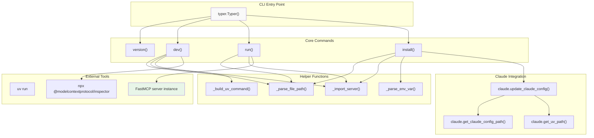

**Sources:** [src/mcp/cli/cli.py:34-39](), [src/mcp/cli/cli.py:211-488](), [src/mcp/cli/claude.py:44-148]()

### Server Import and Resolution

The CLI includes sophisticated server discovery and import mechanisms that handle various server specification formats and automatically resolve FastMCP server instances.

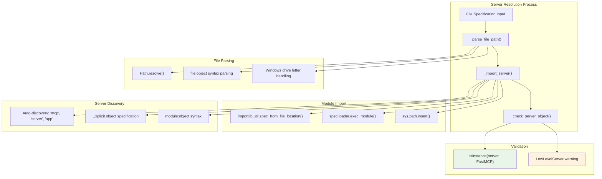

**Sources:** [src/mcp/cli/cli.py:88-116](), [src/mcp/cli/cli.py:119-208](), [src/mcp/cli/cli.py:143-159]()

## CLI Commands

### Version Command

The `version` command displays the currently installed MCP package version using Python's metadata system.

```python
# Usage: mcp version
# Implementation: cli.py:212-219
```

**Sources:** [src/mcp/cli/cli.py:212-219]()

### Development Command

The `dev` command runs an MCP server with the MCP Inspector for interactive development and testing. It automatically manages dependencies using `uv` and launches the Node.js-based inspector tool.

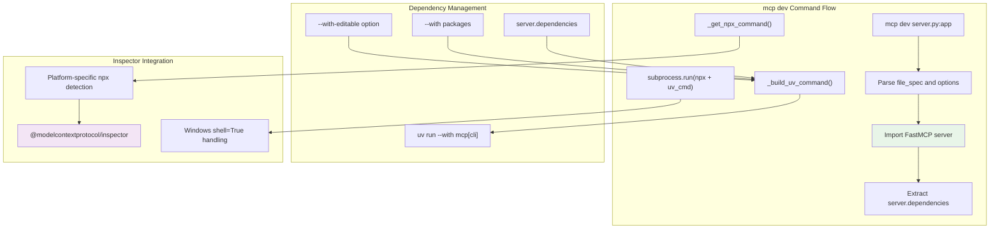

**Sources:** [src/mcp/cli/cli.py:222-303](), [src/mcp/cli/cli.py:42-53](), [src/mcp/cli/cli.py:65-85]()

### Run Command

The `run` command executes an MCP server directly without additional tooling. It supports transport specification and runs the server using the FastMCP framework.

Key features:
- Direct server execution without dependency management
- Transport protocol selection (`stdio` or `sse`)
- Server object import and validation

**Sources:** [src/mcp/cli/cli.py:305-359]()

### Install Command

The `install` command configures MCP servers for use with Claude Desktop by updating the application's configuration file. It handles dependency specification, environment variable management, and cross-platform config file locations.

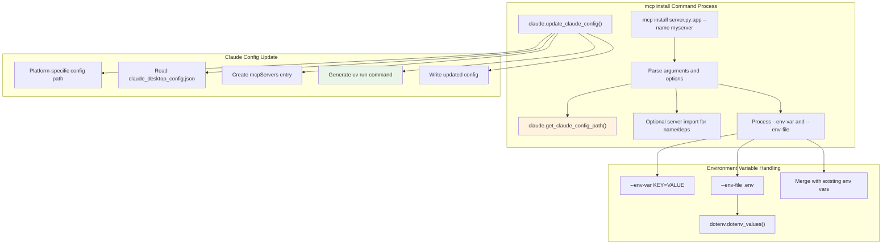

**Sources:** [src/mcp/cli/cli.py:362-488](), [src/mcp/cli/cli.py:456-476](), [src/mcp/cli/claude.py:44-148]()

## Claude Desktop Integration

The Claude integration module provides platform-aware configuration management for installing MCP servers into the Claude Desktop application.

### Configuration Path Detection

The system detects Claude Desktop configuration directories across different platforms:

| Platform | Configuration Path |
|----------|-------------------|
| Windows | `%APPDATA%\Claude` |
| macOS | `~/Library/Application Support/Claude` |
| Linux | `$XDG_CONFIG_HOME/Claude` or `~/.config/Claude` |

**Sources:** [src/mcp/cli/claude.py:17-30]()

### Config File Management

The `update_claude_config()` function manages the `claude_desktop_config.json` file, handling:

- Server entry creation and updates
- Environment variable preservation and merging
- Absolute path resolution for server files
- UV command generation with dependency specifications

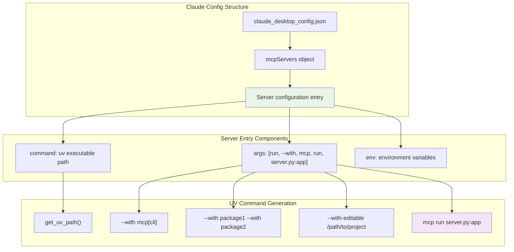

**Sources:** [src/mcp/cli/claude.py:44-148](), [src/mcp/cli/claude.py:101-125](), [src/mcp/cli/claude.py:33-41]()

## Development Workflow Integration

The CLI system integrates with the broader MCP development ecosystem through several key mechanisms:

### Dependency Management with UV

All CLI commands use `uv` for Python dependency management, ensuring reproducible environments and fast package installation. The system automatically includes the `mcp[cli]` package and any server-specific dependencies.

### FastMCP Server Integration

The CLI specifically targets FastMCP servers and includes validation to ensure compatibility. It automatically extracts server metadata including:

- Server name for Claude Desktop registration
- Dependency requirements for installation
- Transport capabilities for runtime configuration

### Inspector Integration

The `dev` command integrates with the Node.js-based MCP Inspector tool, providing a web interface for interactive server testing and debugging.

**Sources:** [src/mcp/cli/cli.py:260-284](), [src/mcp/cli/cli.py:152-159](), [src/mcp/cli/cli.py:442-455]()

# MCP CLI Commands


This document covers the MCP CLI commands that provide development tools for building, testing, and deploying MCP servers. The CLI facilitates server development with dependency management, debugging tools, and integration with Claude Desktop.

For information about the underlying FastMCP server framework that these commands operate on, see [FastMCP Server Framework](#2). For details about Claude Desktop integration configuration, see [Claude Desktop Integration](#8.3).

## Purpose and Scope

The MCP CLI provides three primary commands for MCP server development and deployment:

- `mcp dev` - Development server with MCP Inspector integration
- `mcp run` - Direct server execution 
- `mcp install` - Claude Desktop application integration
- `mcp version` - Version information

All commands support automatic dependency management through `uv` and handle both standalone Python files and package-based servers.

## CLI Architecture Overview

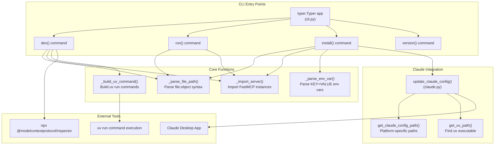

Sources: [src/mcp/cli/cli.py:34-39](), [src/mcp/cli/cli.py:42-86](), [src/mcp/cli/claude.py:44-148]()

## Development Command (mcp dev)

The `mcp dev` command launches the MCP Inspector for interactive server testing and debugging.

### Command Syntax

```bash
mcp dev <file_spec> [--with-editable PATH] [--with PACKAGE]...
```

### Implementation Flow

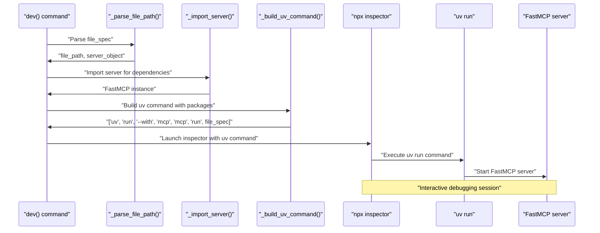

Sources: [src/mcp/cli/cli.py:222-303](), [src/mcp/cli/cli.py:65-85](), [src/mcp/cli/cli.py:268-283]()

### Key Features

| Feature | Implementation | Purpose |
|---------|---------------|---------|
| Dependency Detection | [src/mcp/cli/cli.py:262-264]() | Automatically includes server.dependencies |
| NPX Integration | [src/mcp/cli/cli.py:268-283]() | Launches MCP Inspector for debugging |
| Cross-Platform | [src/mcp/cli/cli.py:42-53]() | Handles Windows/Unix npx differences |
| Editable Install | [src/mcp/cli/cli.py:228-238]() | Supports --with-editable for development |

Sources: [src/mcp/cli/cli.py:222-303]()

## Run Command (mcp run)

The `mcp run` command executes MCP servers directly without dependency management.

### Command Syntax

```bash
mcp run <file_spec> [--transport TRANSPORT]
```

### Server Import Process

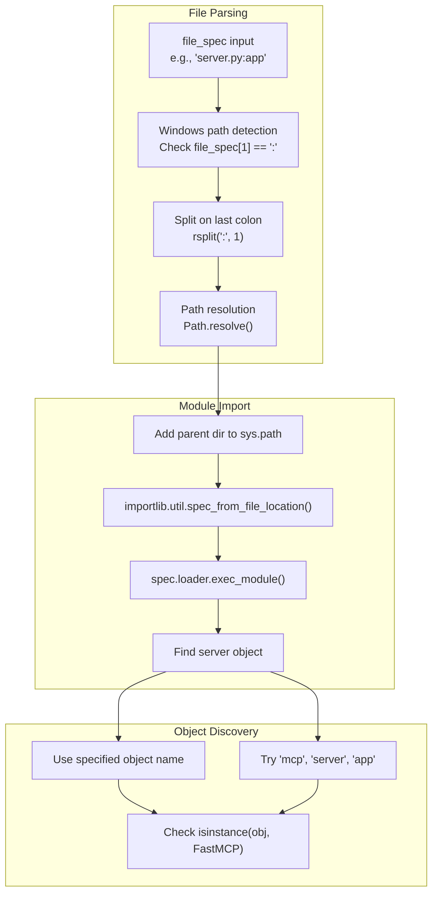

Sources: [src/mcp/cli/cli.py:88-208](), [src/mcp/cli/cli.py:305-360]()

### Transport Support

The run command supports optional transport specification:

- `stdio` - Standard input/output transport
- `sse` - Server-Sent Events transport
- Default: Server's configured transport

Sources: [src/mcp/cli/cli.py:311-318](), [src/mcp/cli/cli.py:346-350]()

## Install Command (mcp install)

The `mcp install` command configures MCP servers in Claude Desktop's configuration.

### Command Syntax

```bash
mcp install <file_spec> [--name NAME] [--with-editable PATH] [--with PACKAGE]... [--env-var KEY=VALUE]... [--env-file FILE]
```

### Claude Configuration Process

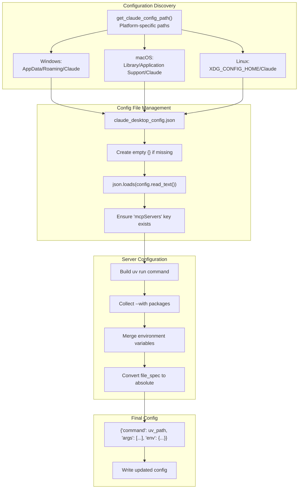

Sources: [src/mcp/cli/claude.py:17-31](), [src/mcp/cli/claude.py:44-148](), [src/mcp/cli/cli.py:362-489]()

### Environment Variable Handling

The install command supports flexible environment variable configuration:

| Method | Implementation | Behavior |
|--------|---------------|----------|
| Command Line | `--env-var KEY=VALUE` | [src/mcp/cli/cli.py:474-476]() |
| .env File | `--env-file path.env` | [src/mcp/cli/cli.py:462-471]() |
| Preservation | Existing vars preserved | [src/mcp/cli/claude.py:92-99]() |
| Merging | New vars override existing | [src/mcp/cli/claude.py:96-97]() |

Sources: [src/mcp/cli/cli.py:394-413](), [src/mcp/cli/cli.py:457-477]()

## Version Command (mcp version)

Simple command that displays the installed MCP package version using `importlib.metadata`.

```python