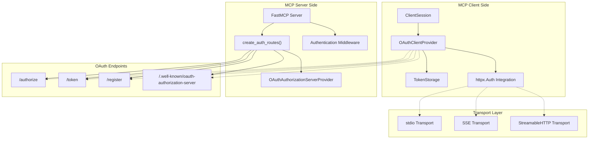
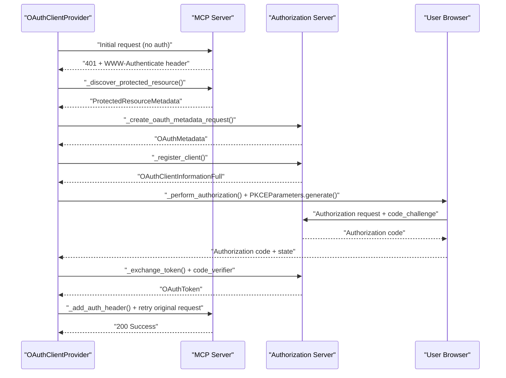
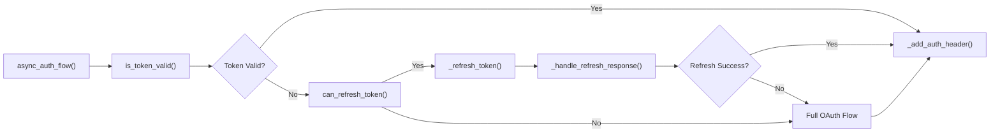
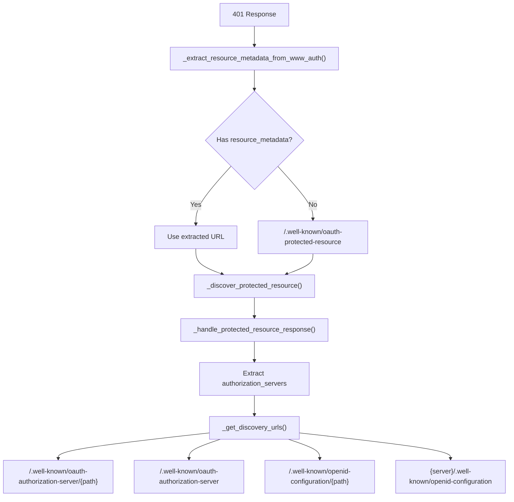
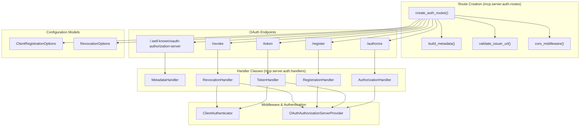
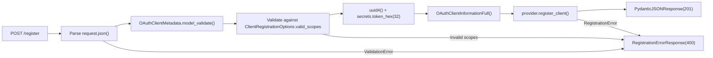
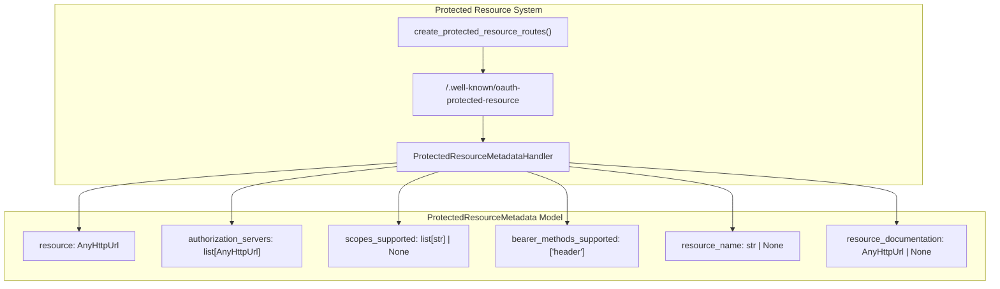
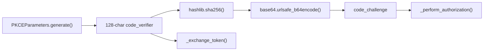

ServerSession(read_stream, write_stream, init_options, stateless=True)
```

In stateless mode, the session immediately transitions to `Initialized` state, bypassing the normal MCP initialization handshake.

Sources: [src/mcp/server/session.py:88-93]()

# Authentication & Security


This document covers the OAuth 2.0 authentication system implemented in the MCP Python SDK for securing communication between MCP clients and servers. The authentication system provides both client-side authentication (for MCP clients connecting to protected servers) and server-side authentication (for MCP servers that need to authenticate clients).

The OAuth system integrates seamlessly with MCP's core components:
- **ClientSession**: Automatically handles OAuth authentication when connecting to protected MCP servers
- **FastMCP servers**: Can optionally expose OAuth authorization server endpoints
- **Transport layer**: OAuth authentication works across all transport mechanisms (stdio, SSE, StreamableHTTP)

For detailed OAuth implementation specifics, see [OAuth 2.0 System](#7.1). For transport-level security features like DNS rebinding protection, see [Transport Security](#5.4). For the overall client framework, see [Client Framework](#3).

## MCP Authentication Integration



**Sources:** [src/mcp/client/auth.py:179-206](), [src/mcp/server/auth/routes.py:68-146](), [src/mcp/client/session.py](), [src/mcp/server/fastmcp/]()

## OAuth 2.0 Client Authentication

The MCP SDK provides a complete OAuth 2.0 client implementation centered around the `OAuthClientProvider` class, which integrates with httpx to provide transparent authentication for HTTP requests.

### Core Client Components Architecture

```mermaid
graph TB
    subgraph "OAuthClientProvider Class"
        OAuthClientProvider["OAuthClientProvider"]
        OAuthContext["OAuthContext"]
        TokenStorage["TokenStorage"]
        PKCEParameters["PKCEParameters"]
    end
    
    subgraph "OAuth Models (mcp.shared.auth)"
        ProtectedResourceMetadata["ProtectedResourceMetadata"]
        OAuthMetadata["OAuthMetadata"] 
        OAuthClientInformationFull["OAuthClientInformationFull"]
        OAuthToken["OAuthToken"]
        OAuthClientMetadata["OAuthClientMetadata"]
    end
    
    subgraph "Client Integration Methods"
        async_auth_flow["async_auth_flow()"]
        _initialize["_initialize()"]
        _refresh_token["_refresh_token()"]
        _add_auth_header["_add_auth_header()"]
    end
    
    subgraph "Discovery Methods"
        _discover_protected_resource["_discover_protected_resource()"]
        _get_discovery_urls["_get_discovery_urls()"]
        _extract_resource_metadata_from_www_auth["_extract_resource_metadata_from_www_auth()"]
    end
    
    OAuthClientProvider --> OAuthContext
    OAuthClientProvider --> TokenStorage
    OAuthClientProvider --> PKCEParameters
    OAuthContext --> ProtectedResourceMetadata
    OAuthContext --> OAuthMetadata
    OAuthContext --> OAuthClientInformationFull
    OAuthContext --> OAuthToken
    OAuthContext --> OAuthClientMetadata
    
    OAuthClientProvider --> async_auth_flow
    OAuthClientProvider --> _initialize
    OAuthClientProvider --> _refresh_token
    OAuthClientProvider --> _add_auth_header
    OAuthClientProvider --> _discover_protected_resource
    OAuthClientProvider --> _get_discovery_urls
    OAuthClientProvider --> _extract_resource_metadata_from_www_auth
```



The `OAuthClientProvider` implements the `httpx.Auth` interface, allowing it to be used as an authentication handler for any HTTP client that supports httpx auth providers. The class is instantiated with server URL, client metadata, token storage, and callback handlers for user interaction.

**Sources:** [src/mcp/client/auth.py:179-206](), [src/mcp/shared/auth.py:6-25](), [src/mcp/shared/auth.py:37-91](), [src/mcp/shared/auth.py:93-103]()

### OAuth Flow Implementation

The client authentication follows the OAuth 2.0 authorization code flow with PKCE (Proof Key for Code Exchange) for enhanced security. The entire flow is implemented in the `async_auth_flow()` method:



The flow includes several key security features implemented in specific methods:

- **PKCE (RFC 7636)**: `PKCEParameters.generate()` prevents authorization code interception attacks
- **State parameter**: `_perform_authorization()` prevents CSRF attacks during authorization  
- **Dynamic Client Registration (RFC 7591)**: `_register_client()` enables automatic client registration
- **Protected Resource Discovery (RFC 9728)**: `_discover_protected_resource()` enables automatic authorization server discovery

**Sources:** [src/mcp/client/auth.py:485-551](), [src/mcp/client/auth.py:312-356](), [src/mcp/client/auth.py:49-61](), [src/mcp/client/auth.py:231-252]()

### Token Management and Storage

The SDK provides a flexible token storage system through the `TokenStorage` protocol interface:

| Method | Purpose | Parameters | Return Type |
|--------|---------|------------|-------------|
| `get_tokens()` | Retrieve stored tokens | None | `OAuthToken \| None` |
| `set_tokens()` | Store new tokens | `OAuthToken` | `None` |
| `get_client_info()` | Retrieve client registration | None | `OAuthClientInformationFull \| None` |
| `set_client_info()` | Store client registration | `OAuthClientInformationFull` | `None` |

Token validation and refresh logic is handled automatically in `async_auth_flow()`:



The `OAuthContext` class manages token expiry using the `update_token_expiry()` method, which calculates wall-clock time based on the `expires_in` field from token responses. Token validation is performed by `is_token_valid()` which checks both token presence and expiry time.

**Sources:** [src/mcp/client/auth.py:64-82](), [src/mcp/client/auth.py:120-142](), [src/mcp/client/auth.py:411-461](), [src/mcp/client/auth.py:494-501]()

### Protected Resource Discovery

The client implements RFC 9728 for automatic discovery of authorization servers through several methods in `OAuthClientProvider`. The discovery process supports multiple fallback mechanisms:

1. **WWW-Authenticate Header**: `_extract_resource_metadata_from_www_auth()` extracts `resource_metadata` URL from 401 responses
2. **Well-known Resource Discovery**: `_discover_protected_resource()` falls back to `/.well-known/oauth-protected-resource`  
3. **Authorization Server Discovery**: `_get_discovery_urls()` tries multiple OAuth metadata endpoints



The discovery flow uses regex pattern matching in `_extract_resource_metadata_from_www_auth()` to parse the WWW-Authenticate header: `resource_metadata=(?:"([^"]+)"|([^\s,]+))`. If no resource_metadata is found, it constructs the well-known URL using `get_authorization_base_url()` and `urljoin()`.

**Sources:** [src/mcp/client/auth.py:207-240](), [src/mcp/client/auth.py:254-279](), [src/mcp/client/auth.py:517-530](), [src/mcp/client/auth.py:242-252]()

## OAuth 2.0 Server Implementation

The server-side authentication system provides a complete OAuth 2.0 authorization server implementation that MCP servers can use to authenticate clients. The system is built around the `create_auth_routes()` function and handler classes.

### Server Components Architecture



**Sources:** [src/mcp/server/auth/routes.py:68-146](), [src/mcp/server/auth/handlers/](), [src/mcp/server/auth/middleware/client_auth.py](), [src/mcp/server/auth/settings.py]()

### OAuth Metadata Generation

The server automatically generates RFC 8414 compliant OAuth metadata using the `build_metadata()` function based on configuration:

| Field | Value | Source |
|-------|-------|--------|
| `issuer` | Server base URL | `issuer_url` parameter |
| `authorization_endpoint` | `{issuer}/authorize` | `AUTHORIZATION_PATH` constant |
| `token_endpoint` | `{issuer}/token` | `TOKEN_PATH` constant |
| `registration_endpoint` | `{issuer}/register` | `REGISTRATION_PATH` constant (if enabled) |
| `revocation_endpoint` | `{issuer}/revoke` | `REVOCATION_PATH` constant (if enabled) |
| `scopes_supported` | Valid scopes list | `ClientRegistrationOptions.valid_scopes` |
| `grant_types_supported` | `["authorization_code", "refresh_token"]` | Fixed in `build_metadata()` |
| `token_endpoint_auth_methods_supported` | `["client_secret_post"]` | Fixed in `build_metadata()` |
| `code_challenge_methods_supported` | `["S256"]` | Fixed in `build_metadata()` |

The `build_metadata()` function constructs the complete `OAuthMetadata` object with proper URL validation through `validate_issuer_url()` and CORS support via `cors_middleware()`. The metadata is served by `MetadataHandler.handle()` at the well-known endpoint.

**Sources:** [src/mcp/server/auth/routes.py:149-186](), [src/mcp/server/auth/routes.py:23-47](), [src/mcp/server/auth/routes.py:49-52](), [src/mcp/server/auth/handlers/metadata.py]()

### Dynamic Client Registration

The server supports RFC 7591 dynamic client registration through the `RegistrationHandler.handle()` method:



Key registration features implemented in `RegistrationHandler.handle()`:
- **Automatic client ID generation**: Uses `uuid4()` for unique client identifiers  
- **Client secret generation**: Uses `secrets.token_hex(32)` for 32-byte cryptographically secure random hex string
- **Scope validation**: Ensures requested scopes are within `ClientRegistrationOptions.valid_scopes` 
- **Grant type validation**: Only supports `authorization_code` and `refresh_token` grant types
- **Client secret expiry**: Configurable via `ClientRegistrationOptions.client_secret_expiry_seconds`

**Sources:** [src/mcp/server/auth/handlers/register.py:34-121](), [src/mcp/server/auth/settings.py](), [src/mcp/server/auth/handlers/register.py:51-85]()

### Protected Resource Metadata

The server can also act as a protected resource by exposing RFC 9728 metadata through `create_protected_resource_routes()`:



This enables automatic discovery by OAuth clients using `_discover_protected_resource()` and supports the separation of authorization servers from protected resources as defined in RFC 9728.

**Sources:** [src/mcp/server/auth/routes.py:189-227](), [src/mcp/shared/auth.py:134-156](), [src/mcp/server/auth/handlers/metadata.py]()

## Security Features

### PKCE Implementation

The SDK implements PKCE (Proof Key for Code Exchange) as defined in RFC 7636 through the `PKCEParameters` class to prevent authorization code interception attacks:



PKCE parameters use cryptographically secure random generation in `PKCEParameters.generate()`:
- **Code verifier**: 128 characters from `secrets.choice(string.ascii_letters + string.digits + "-._~")`
- **Code challenge**: SHA256 hash of verifier, Base64URL encoded with `rstrip("=")` to remove padding
- **Challenge method**: Always `S256` (SHA256) as specified in OAuth server metadata

**Sources:** [src/mcp/client/auth.py:49-61](), [src/mcp/client/auth.py:324-325](), [src/mcp/client/auth.py:374](), [src/mcp/client/auth.py:56-61]()

### State Parameter Protection

The OAuth flow includes state parameter validation in `_perform_authorization()` to prevent CSRF attacks:

```python